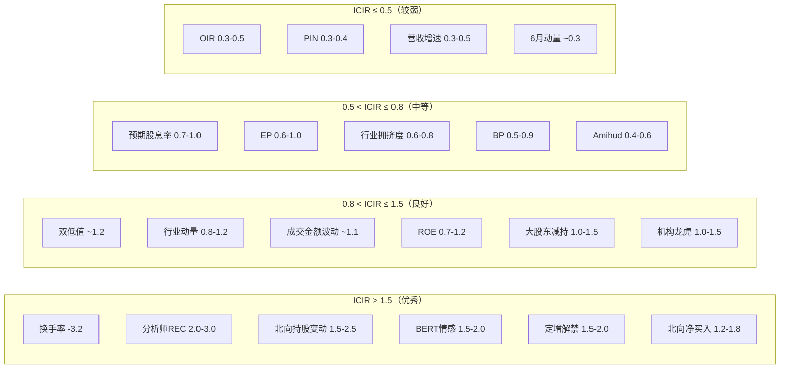

# A股量化因子有效性速查手册

> 本表从知识库32篇笔记中自动提取，按IC_IR从高到低排序。所有数值为A股实证参考区间。

## 因子有效性总表

| # | 因子名称 | 类别 | IC/Rank IC | IC_IR | 半衰期 | 推荐频率 | 多空年化 | 方向/备注 |
|---|----------|------|-----------|-------|--------|----------|---------|----------|
| 1 | 换手率(20日) | 技术/流动性 | -9.35% | -3.2 | 20-40日 | 周度 | 32% | 负向，A股最强技术因子 |
| 2 | 一致预期修正(REC) | 另类/分析师 | 3%-5% | 2.0-3.0 | 20-60日 | 日频 | 12-18% | 胜率82.8%，最稳健另类因子 |
| 3 | 北向持股变动 | 另类/资金流 | 3%-6% | 1.5-2.5 | 10-40日 | 日频 | 8-15% | 大盘股有效 |
| 4 | BERT新闻情感 | 另类/舆情 | 4%-7% | 1.5-2.0 | 10-30日 | 日频 | 12-20% | IC高但波动大 |
| 5 | 定增解禁占比 | 另类/事件 | -5%~-10% | 1.5-2.0 | 60日+ | 事件型 | -8%~-15% | 负向，最强负面信号 |
| 6 | 北向净买入占比 | 另类/资金流 | 4%-6% | 1.2-1.8 | 10-20日 | 日频 | 6-12% | 衰减快但交易成本低 |
| 7 | 双低值(可转债) | 可转债 | -10%~-18% | ~1.2 | 30日 | 月度 | 15.8-20.1% | 负向，可转债核心因子 |
| 8 | 行业动量(RankRet) | 宏观/行业 | 4%-6% | 0.8-1.2 | 120-240日 | 月/季度 | 12-25% | 行业层面有效 |
| 9 | 成交金额波动 | 技术/量价 | 5.61% | ~1.1 | 20-30日 | 周度 | 32.37% | 华西证券研报 |
| 10 | 转股溢价率 | 可转债 | -8%~-15% | ~1.1 | 30日 | 月度 | 12-18% | 负向，低溢价=高正股弹性 |
| 11 | ROE | 基本面/盈利 | 5%-7% | 0.7-1.2 | 2-4月 | 月度 | 8-15% | A股最有效基本面因子 |
| 12 | 大股东净减持 | 另类/事件 | -3%~-5% | 1.0-1.5 | 20-60日 | 事件型 | -4%~-8% | 负向，增持胜率56.5% |
| 13 | 机构净买入(龙虎榜) | 另类/资金流 | 3%-5% | 1.0-1.5 | 5-20日 | 日频 | 4-10% | 需正交化处理 |
| 14 | 融券余额占比 | 另类/两融 | -3%~-5% | 1.0-1.5 | 5-20日 | 日频 | -3%~-6% | 负向，手续费敏感 |
| 15 | ETF穿透净流入 | 另类/资金流 | 2%-4% | 1.0-1.5 | 10-30日 | 日频 | 3-8% | 与北向高相关(r>0.7) |
| 16 | 预期股息率 | 基本面/分红 | 5%-7% | 0.7-1.0 | 1月 | 月度 | 8-12% | 红利低波年化超额3-5% |
| 17 | EP(盈利收益率) | 基本面/价值 | 4%-6% | 0.6-1.0 | 1-2月 | 月度 | 6-12% | 扣非EP2更优 |
| 18 | VolumeRet_240 | 技术/行业动量 | 4%-6% | 0.9-1.4 | 240日 | 月/季度 | 24.25% | 行业层面最佳变体 |
| 19 | 正股动量(可转债) | 可转债 | 5%-10% | ~0.9 | 20日 | 月度 | 8-15% | 转股价值驱动 |
| 20 | 量价相关系数(20日) | 技术/量价 | -4.66% | ~0.9 | 20-30日 | 周度 | 15-30% | 负向反转，分钟级更佳 |
| 21 | BP(账面市值比) | 基本面/价值 | 3%-5% | 0.5-0.9 | 2-3月 | 月/季度 | 5-10% | 熊市防御强 |
| 22 | 融资买入占比 | 另类/两融 | -2%~-4% | 0.6-0.9 | 10-20日 | 日频 | -3%~-8% | 负向，杠杆抛压 |
| 23 | 1月反转 | 技术/动量 | -8.13% | ~0.8 | 10-30日 | 周度 | 15-20% | 负向=反转，远超美股 |
| 24 | IVOL(特质波动率) | 技术/波动率 | -2.3%/1% | ~0.8 | 40-60日 | 月度 | 5% | 负向，低IVOL Sharpe>2.0 |
| 25 | YTM(到期收益率) | 可转债 | 3%-6% | ~0.8 | 30日 | 月度 | 6-10% | 防御策略，回撤<5% |
| 26 | 行业拥挤度(PCA) | 宏观/拥挤 | 5.23% | 0.6-0.8 | 60日 | 月度 | 19.47% | 高集中度+高估值策略 |
| 27 | 毛利率 | 基本面/质量 | 3%-5% | 0.5-0.8 | 1月 | 月度 | 4-8% | 必须行业中性化 |
| 28 | 应计利润(反向) | 基本面/质量 | 3%-5% | 0.5-0.8 | 2-3月 | 季度 | 4-8% | 负向，低应计=高质量 |
| 29 | Amihud非流动性 | 技术/流动性 | 2%-4% | 0.4-0.6 | 30-50日 | 月度 | 3-8% | 最优低频代理 |
| 30 | 大单净流入 | 高频/L2 | 2%-4% | 0.4-0.6 | 10-20日 | 日频 | 3-8% | >5倍ADV或>50万元 |
| 31 | 集合竞价组合 | 高频/L2 | 3%-6% | 0.3-0.6 | 5-10日 | 日频 | 4-10% | 9:20-9:25不可撤最可靠 |
| 32 | F-Score | 基本面/质量 | 3%-5% | 0.4-0.6 | 2月 | 季度 | 4-8% | 大/中盘有效，小盘噪声大 |
| 33 | VWAP偏离 | 高频/尾盘 | -4%~-6% | 0.4-0.5 | 5-10日 | 日频 | -3%~-8% | 负向，尾盘拉升次日回落 |
| 34 | 尾盘成交量占比 | 高频/尾盘 | -4%~-6% | 0.4-0.5 | 5-10日 | 日频 | -4%~-10% | 负向，尾盘放量次日回调 |
| 35 | OIR(订单不平衡) | 高频/L2 | 3%-5% | 0.3-0.5 | 5-10日 | 日频 | 3-8% | 十档金额加权版更优 |
| 36 | IV Rank(期权) | 另类/期权 | 2%-4% | 0.3-0.5 | 5-20日 | 日频 | 2-6% | 择时为主，指数级适用 |
| 37 | PIN(知情交易) | 高频/微观 | 2%-4% | 0.3-0.4 | 5-20日 | 日频 | 2-6% | 中小盘更显著，MLE>100初值 |
| 38 | 营收增速 | 基本面/成长 | 2%-4% | 0.3-0.5 | 1-3月 | 月度 | 3-7% | IC弱，需择时 |
| 39 | 3月动量 | 技术/动量 | -4% | ~0.5 | 20-40日 | 双周 | -8%~-12% | 弱反转 |
| 40 | 6月动量 | 技术/动量 | -2% | ~0.3 | 40-80日 | 月度 | -3%~-6% | 接近无效 |

## 按IC_IR分层

## 按衰减速度分类

| 速度 | 半衰期 | 代表因子 | 推荐调仓 |
|------|--------|----------|----------|
| 快衰减 | 5-20日 | 高频因子(OIR/VWAP偏离/集竞)、短期反转、龙虎榜 | 日频/周频 |
| 中衰减 | 20-60日 | 换手率、量价因子、分析师REC、北向资金 | 周频/双周 |
| 慢衰减 | 2-6月 | ROE/EP/BP/毛利率/应计/F-Score/IVOL | 月度/季度 |
| 超慢 | 120-240日 | 行业动量VolumeRet、行业拥挤度 | 季度 |

## A股因子特色总结

1. **反转极强**：1月IC=-8.13%远超美股(-0.02%)，散户过度反应驱动
2. **换手率最强**：Rank IC -9.35%，A股截面最强技术面因子
3. **另类因子价值高**：分析师REC (ICIR 2.0-3.0) 显著优于美股同类
4. **基本面因子ROE最优**：IC 5%-7%，ICIR 0.7-1.2，全周期稳健
5. **可转债机会独特**：T+0+条款博弈+双低策略年化15.8%-20.1%
6. **高频因子A股Alpha空间大**：IC 5-10% vs 美股1-3%，小盘成长风格驱动

## 实战组合建议

| 策略类型 | 核心因子 | 辅助因子 | 调仓 | 预期年化超额 |
|----------|----------|----------|------|------------|
| 机构选股 | ROE + EP | 分析师REC + 北向 | 月度 | 8-15% |
| 量化私募 | 换手率 + 反转 | 量价 + 分析师 | 双周 | 15-25% |
| 高频策略 | 集竞 + OIR + 大单 | 尾盘异动 | 日频 | 需低延迟 |
| 可转债 | 双低 + 溢价率 | YTM + 正股动量 | 月度 | 15-30% |
| 风格择时 | 行业拥挤度 + 宏观 | 社融 + M1-M2 | 季度 | 12-18% |

## 数据来源

本表数据提取自以下知识库笔记：
- [[A股基本面因子体系]]
- [[A股技术面因子与量价特征]]
- [[A股另类数据与另类因子]]
- [[高频因子与日内数据挖掘]]
- [[A股行业轮动与风格轮动因子]]
- [[A股市场状态识别与择时因子]]
- [[因子评估方法论]]
- [[多因子模型构建实战]]
- [[A股可转债量化策略]]
- [[A股多因子选股策略开发全流程]]
