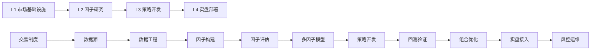

# A股量化交易知识库 — 内容地图（MOC）

> [!abstract] 知识库概览
> 本知识库覆盖 A 股量化交易全链路，从市场基础设施到实盘部署，共 **32 篇**专业笔记，按四个知识层级组织。

---

## L1: 市场基础设施与数据工程（9篇）

> 一切量化研究的地基——市场制度、数据源、工具链

### 交易制度与市场结构
- [[A股交易制度全解析]] — T+1、涨跌停、集合竞价、ST制度、大宗交易、注册制改革
- [[A股市场微观结构深度研究]] — 撮合机制、订单簿(L1/L2/逐笔)、Tick数据、冲击成本
- [[A股市场参与者结构与资金流分析]] — 机构/散户/北向资金/两融/龙虎榜
- [[A股指数体系与基准构建]] — 宽基/行业/风格指数、Smart Beta、指数增强基准

### 衍生品
- [[A股衍生品市场与对冲工具]] — 股指期货(IF/IH/IC/IM)、期权、雪球结构、可转债

### 数据与工具
- [[A股量化数据源全景图]] — Tushare/AkShare/Wind/聚宽/米筐等8大数据源对比
- [[量化数据工程实践]] — 复权处理、PIT数据库、因子库设计、数据质量监控
- [[A股量化交易平台深度对比]] — 聚宽/米筐/QMT/PTrade/vnpy等8大平台
- [[量化研究Python工具链搭建]] — 环境管理、核心库、Jupyter、性能优化、一键搭建

---

## L2: 因子研究与信号体系（8篇）

> 策略的核心原材料——因子构建、评估、合成

### 因子库
- [[A股基本面因子体系]] — FF三/五因子、价值/成长/质量/分红因子、PIT处理
- [[A股技术面因子与量价特征]] — 动量/反转、波动率、流动性、量价背离、日内模式
- [[A股另类数据与另类因子]] — 舆情/分析师/北向资金/两融/解禁/龙虎榜/期权IV
- [[高频因子与日内数据挖掘]] — L2数据、OIR/PIN/VWAP因子、时序数据库选型

### 因子评估与模型
- [[因子评估方法论]] — IC/IR分析、FM回归、拥挤度、周期分析、失效预警
- [[多因子模型构建实战]] — 预处理Pipeline、Barra CNE5/CNE6、5种合成方法
- [[A股行业轮动与风格轮动因子]] — 宏观驱动轮动、大小盘择时、景气度跟踪
- [[A股市场状态识别与择时因子]] — HMM、iVX、情绪指标、宏观择时、市场宽度

---

## L3: 策略开发与回测验证（9篇）

> 从因子到可执行策略的完整开发流程

### 策略类型
- [[A股多因子选股策略开发全流程]] — 选股Pipeline、A股特殊过滤、三大指数增强
- [[A股统计套利与配对交易策略]] — 协整检验、OU过程、卡尔曼滤波、ETF套利
- [[A股CTA与趋势跟踪策略]] — 海龟/ATR/Donchian、日内做T、期货CTA
- [[A股事件驱动策略]] — PEAD、分析师事件、公告事件、日历效应
- [[A股可转债量化策略]] — 定价模型、双低/低溢价/下修博弈、T+0日内
- [[A股机器学习量化策略]] — XGBoost/LightGBM/LSTM/Transformer/RL

### 回测与评估
- [[A股回测框架实战与避坑指南]] — Backtrader架构、5大陷阱、23项检查清单
- [[策略绩效评估与统计检验]] — 10大指标、Brinson归因、PBO/CSCV/DSR
- [[组合优化与资产配置]] — Markowitz/BL/风险平价/ERC、cvxpy约束优化

---

## L4: 实盘部署与风控运维（6篇）

> 将策略从回测推向实盘的最后一公里

### 实盘接入
- [[A股量化实盘接入方案]] — QMT/PTrade/柜台API/开源方案、实盘vs回测差异

### 风控与合规
- [[量化交易风控体系建设]] — 事前/事中/事后三层、Kelly仓位管理、5种止损
- [[A股量化交易合规要求]] — 程序化交易管理办法、异常交易阈值、私募合规、税务

### 运维与部署
- [[量化系统监控与运维]] — 四进程架构、Grafana+Prometheus、三级告警、容灾
- [[量化策略的服务器部署与自动化]] — Docker部署、定时调度、版本管理、安全加固
- [[交易成本建模与执行优化]] — 成本全分解、Almgren-Chriss、TWAP/VWAP/IS算法

---

## 学习路径建议

## 统计概览

| 层级 | 笔记数 | 覆盖子目录 |
|------|--------|-----------|
| L1 市场基础设施与数据工程 | 9 | 5/5 |
| L2 因子研究与信号体系 | 8 | 5/5 |
| L3 策略开发与回测验证 | 9 | 5/5 |
| L4 实盘部署与风控运维 | 6 | 5/5 |
| **合计** | **32** | **20/20** |

> 知识库创建于 2026-03-24，由 Claude Opus 4.6 深度调研生成
