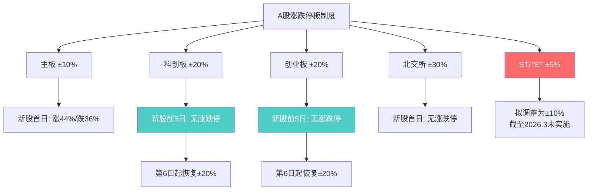
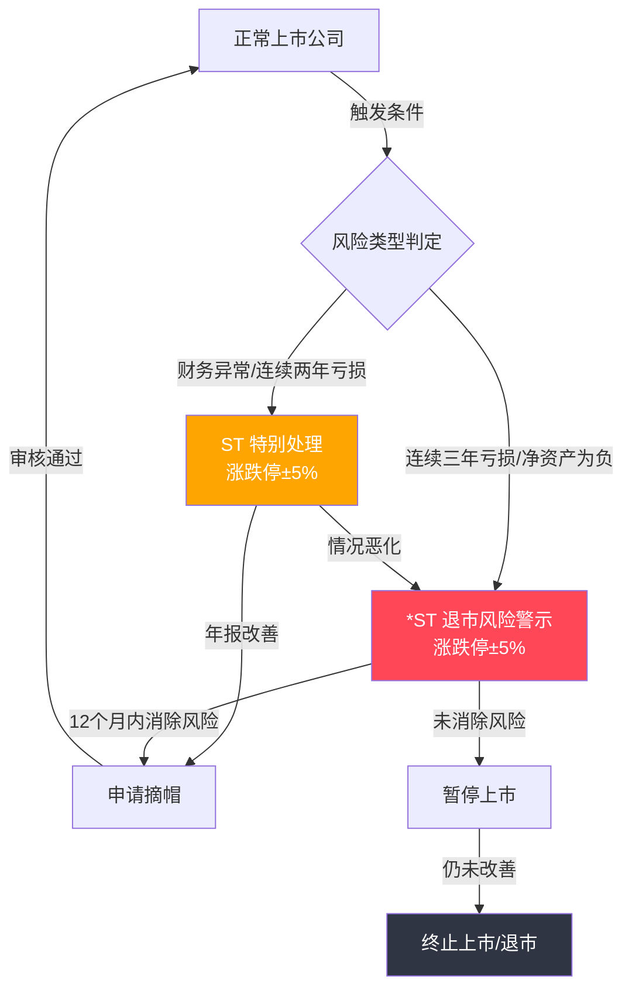
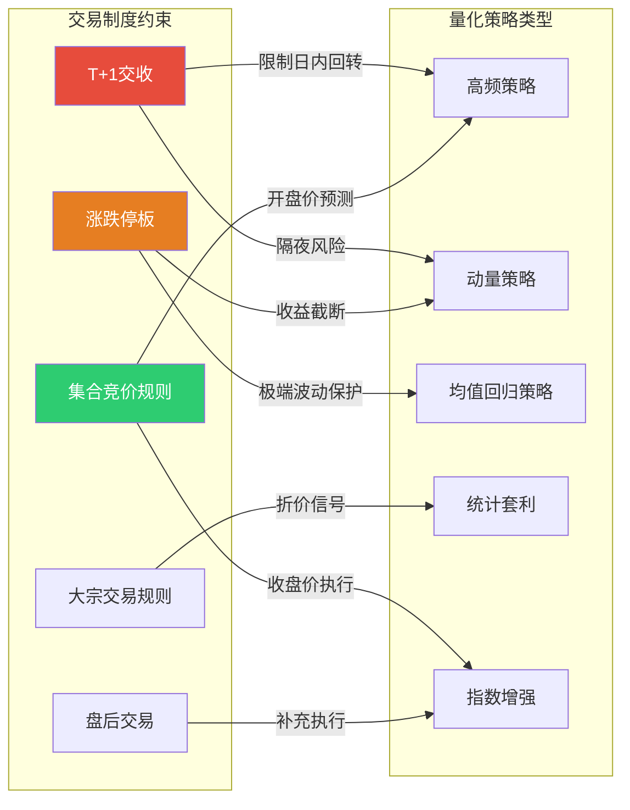

# A股交易制度全解析

> [!abstract] 核心要点
> A股市场实行T+1交收制度（买入次日方可卖出），主板涨跌停幅度为±10%，科创板/创业板为±20%，北交所为±30%，ST/*ST股票涨跌停为±5%。交易日分为开盘集合竞价（9:15-9:25）、连续竞价（9:30-14:57）、收盘集合竞价（14:57-15:00）三个阶段。科创板独有盘后固定价格交易（15:05-15:30），大宗交易门槛为单笔30万股或200万元。注册制改革下新股上市前5个交易日不设涨跌停限制，深刻改变了量化策略的生存环境。

## 在知识体系中的位置

本主题位于 **L1: 市场基础设施与数据工程** 层，是一切量化策略开发的制度基础。交易制度直接决定了策略的可行空间——T+1限制了日内回转交易（Intraday Round-Trip），涨跌停板约束了单日收益/亏损上限，集合竞价规则影响开盘/收盘价格的形成机制。理解这些"硬约束"是进入 L2（因子研究）和 L3（策略开发）的前提条件。

## 关键知识点

### T+1交收制度

#### 基本规则

A股市场对股票交易实行 **T+1交收制度**：T日（交易日）买入的股票，最早在T+1日才能卖出。资金交收同样在T+1日完成（中国结算在T+1日16:00前完成最终交收）。

#### T+0品种（例外情况）

并非所有品种都受T+1限制，以下品种实行 **T+0回转交易**：

| 品种 | T+0规则 | 备注 |
|------|---------|------|
| **ETF基金** | 买入当日可卖出 | 份额交易T+0，资金交收仍为T+1 |
| **可转债** | 买入当日可卖出 | 完全T+0交易 |
| **逆回购** | 到期自动回款 | 国债逆回购T+0申报 |
| **融券卖出** | 融券卖出当日可买券还券 | 需融资融券账户，2023年后融券T+1限制加强 |
| **港股通** | T+0（港股规则） | 通过沪深港通交易的港股 |

> **注意**：2023年10月起，证监会限制了融券T+0策略，要求转融通出借人出借的证券当日不得卖出，次日才可归还，实质上削弱了融券T+0套利能力。

#### 对量化策略的约束

1. **无法进行纯股票日内回转**：不同于美股/港股，A股量化策略无法在同一交易日内对同一股票进行买入-卖出操作（除非持有底仓，即"底仓+T+0"策略）
2. **底仓T+0策略**：持有一定底仓，日内先卖后买或先买后卖（利用前日持仓卖出），实现变相日内交易
3. **跨品种T+0**：利用ETF、可转债等T+0品种进行日内策略
4. **信号延迟执行**：因子信号产生后，若需建仓，最快在T日买入、T+1日才能了结，必须考虑隔夜风险（Overnight Risk）
5. **融券限制加强**：2023年后融券T+0受限，量化中性策略对冲成本上升

### 涨跌停板机制

#### 各板块涨跌停幅度

| 板块 | 涨跌停幅度 | 适用交易所 | 生效时间 |
|------|-----------|-----------|---------|
| **主板** | ±**10%** | 上交所/深交所 | 1996年12月16日起 |
| **科创板** | ±**20%** | 上交所 | 2019年7月22日起 |
| **创业板** | ±**20%** | 深交所 | 2020年8月24日注册制改革起 |
| **北交所** | ±**30%** | 北交所 | 2021年11月15日起 |
| **ST / *ST** | ±**5%** | 全部 | 与ST标记同步生效 |

#### 新股上市特殊规则

| 板块 | 上市首日规则 | 上市前N日不设涨跌停 |
|------|------------|-------------------|
| **主板** | 首日涨幅上限44%，跌幅下限36%（盘中临时停牌机制） | 仅首日特殊 |
| **科创板** | 上市前**5个交易日**不设涨跌停限制 | 5个交易日 |
| **创业板** | 上市前**5个交易日**不设涨跌停限制 | 5个交易日 |
| **北交所** | 上市首日不设涨跌停限制 | 1个交易日 |

#### 异常波动停牌核查机制

- **普通异常波动**（主板）：连续3个交易日涨跌幅偏离值累计达到±20%，或3日日均换手率达前5日均值的30倍且累计换手率≥20% → 发布异常波动公告，重点监控
- **严重异常波动**（主板）：10个交易日偏离值累计达到+100%或-50%，或10日内4次触及普通异常标准 → 强制停牌核查（通常1-3个交易日）

#### 对量化策略的影响

1. **收益截断效应**：涨跌停限制了单日最大收益和亏损，动量策略在涨停板股票上无法追入（流动性枯竭）
2. **涨停板溢价/折价**：涨停封板次日通常有溢价，跌停次日通常有折价，形成可利用的统计规律
3. **科创板/创业板波动空间更大**：±20%的涨跌停提供了更大的日内价格发现空间，量化策略可获取更大的Alpha
4. **北交所流动性挑战**：虽然±30%涨跌停提供最大波动空间，但北交所整体流动性较差，大单冲击成本高

### 集合竞价规则

#### 开盘集合竞价（9:15-9:25）

| 时间段 | 可否申报 | 可否撤单 | 行情展示 |
|--------|---------|---------|---------|
| **9:15-9:20** | 可以 | **可以撤单** | 显示虚拟参考价格、匹配量、未匹配量 |
| **9:20-9:25** | 可以 | **不可撤单** | 显示虚拟参考价格、匹配量、未匹配量 |
| **9:25** | 集中撮合 | — | 产生开盘价 |
| **9:25-9:30** | 可以申报 | 不可撤单 | 不做处理，9:30进入连续竞价 |

**开盘价确定原则**：以最大成交量为原则，即满足以下三个条件的价格：(1) 可实现最大成交量；(2) 高于该价格的买入申报与低于该价格的卖出申报全部成交；(3) 等于该价格的买入或卖出申报至少有一方全部成交。

#### 收盘集合竞价（14:57-15:00）

| 规则项 | 详情 |
|--------|------|
| **时间** | 14:57-15:00 |
| **申报** | 接受限价申报 |
| **撤单** | **全程不接受撤单** |
| **撮合** | 15:00一次性集中撮合，产生收盘价 |
| **无成交时** | 以最后一分钟含最后一笔成交的加权平均价为收盘价 |

> **注意**：深交所自2018年8月6日起实行收盘集合竞价，此前收盘价以最后一分钟加权均价确定。上交所仍以最后一分钟加权均价确定收盘价（截至2026年3月，上交所股票不实行收盘集合竞价，但科创板实行）。

#### 新股/复牌集合竞价特殊规则

- **新股首日开盘集合竞价**：有效申报价格范围为发行价的80%-120%
- **新股首日后续竞价**：有效申报范围为发行价的64%-144%
- **停牌复牌**：停牌期间可申报/撤单，复牌后进行集合竞价；若至14:57仍停牌，须在14:57复牌进入收盘集合竞价

#### 对量化策略的影响

1. **9:15-9:20虚假信号**：此时段可自由撤单，大量"试探性"挂单会产生虚假的供需信号，量化模型应忽略此时段数据
2. **9:20-9:25为真实信号**：不可撤单，申报更具参考价值，可用于预测开盘价方向
3. **收盘集合竞价无法撤单**：14:57后的申报一旦提交不可撤回，TWAP/VWAP算法需在14:57前完成大部分执行
4. **收盘价操纵监控**：收盘集合竞价阶段集中撮合，大单可影响收盘价，监管对此有严格监控

### ST与*ST特别处理制度

#### ST与*ST的区别

| 类型 | 标识 | 含义 | 涨跌停 | 触发条件 |
|------|------|------|--------|---------|
| **ST** | 股票简称前加"ST" | 特别处理（Special Treatment） | ±**5%** | 财务状况异常（如连续两年亏损）或其他异常情况 |
| ***ST** | 股票简称前加"*ST" | 退市风险警示 | ±**5%** | 更严重情形：连续三年亏损、净资产为负、破产受理等 |

> **2025年7月动态**：沪深交易所已征求意见拟将主板ST涨跌幅调整为±10%，但截至2026年3月尚未正式实施，仍为±5%。

#### ST标记的触发与解除

**触发条件**（主要情形）：
- 最近两个会计年度经审计的净利润连续为负值
- 最近一个会计年度经审计的净资产为负值
- 最近一个会计年度的财务报告被出具无法表示意见或否定意见的审计报告
- 公司存在重大违法行为
- 公司生产经营活动受到严重影响且预计在三个月内不能恢复正常

**解除条件（摘帽）**：
- 年报显示净利润为正且营业收入高于相关门槛（主板1亿元，2024年后部分标准提高至3亿元）
- 净资产为正值
- 审计报告为标准无保留意见
- 通常需要至少12个月的观察期

#### 对量化策略的影响

1. **波动空间压缩**：±5%涨跌停大幅限制日内价格空间，高频/动量策略收益被压缩
2. **退市风险**：*ST股票可能面临退市，持仓可能变为"废纸"，量化策略应设置ST/*ST股票池过滤
3. **摘帽/戴帽行情**：ST股票摘帽时恢复±10%涨跌停，可能出现补涨行情；反之戴帽时可能出现连续跌停
4. **流动性下降**：部分券商限制低风险评级投资者买入ST股票，导致流动性进一步下降
5. **信息不对称加剧**：ST公司信息披露频率更高但质量参差不齐，基本面因子可靠性降低

### 盘后固定价格交易

#### 基本规则（科创板独有）

盘后固定价格交易是科创板的制度创新，在收盘集合竞价结束后，以当日收盘价为成交价格，按照时间优先原则对收盘定价申报进行逐笔连续撮合。

| 规则项 | 详情 |
|--------|------|
| **适用板块** | 科创板（上交所） |
| **交易时间** | 每个交易日 **15:05-15:30** |
| **申报受理时间** | 9:30-11:30、13:00-15:30 |
| **成交价格** | 当日收盘价（固定） |
| **撮合方式** | 按时间优先原则逐笔连续撮合 |
| **申报数量** | 最低200股，最高100万股 |
| **申报类型** | 限价申报（收盘定价申报） |
| **未成交处理** | 申报当日有效，可在接受申报时间内撤销 |

#### 申报有效性判定

- **买入申报**：若收盘价高于申报限价，则该笔买入申报无效
- **卖出申报**：若收盘价低于申报限价，则该笔卖出申报无效
- **停牌股票**：当日15:00仍处于停牌状态的股票不进行盘后固定价格交易

#### 对量化策略的影响

1. **延长交易窗口**：为科创板提供了额外25分钟的交易机会，适合收盘后仍需调仓的算法
2. **确定性价格**：以收盘价成交，消除了价格不确定性，适合指数跟踪/ETF套利策略
3. **成交量计入当日**：盘后固定价格交易的成交量计入当日总成交量，影响量价指标计算
4. **流动性补充**：为收盘时未能完成的大额订单提供了补充执行机会

### 大宗交易制度

#### 基本规则

| 规则项 | 上交所 | 深交所 |
|--------|--------|--------|
| **申报门槛** | 单笔≥**30万股**或≥**200万元** | 单笔≥**30万股**或≥**200万元** |
| **申报时间** | 9:30-11:30、13:00-15:30 | 9:15-11:30、13:00-15:30 |
| **成交价格（有涨跌停）** | 当日涨跌停价格范围内 | 当日涨跌停价格范围内 |
| **成交价格（无涨跌停）** | 竞价均价±20%与当日最高/最低价孰近值 | 前收盘价的70%-130% |
| **交易方式** | 协议大宗交易、盘后定价大宗交易 | 协议大宗交易 |

#### 折价规则（协议转让定价下限）

| 板块 | 定价下限 | 备注 |
|------|---------|------|
| **主板** | 不低于前一交易日收盘价的 **90%** | 最大折价10% |
| **科创板/创业板** | 不低于前一交易日收盘价的 **80%** | 最大折价20% |
| **ST/*ST** | 不低于前一交易日收盘价的 **95%** | 折价空间更小 |

#### 减持规则与锁定期

- **大股东通过大宗交易减持**：任意连续90个自然日内，减持数量不得超过公司总股本的 **2%**
- **受让方锁定期**：通过大宗交易受让大股东/特定股东持股的，受让后 **6个月内** 不得转让（此为2017年减持新规要求，针对大股东/董监高/特定股东持股）

#### 对量化策略的影响

1. **大宗交易折价信号**：大宗交易折价率是重要的量化因子，高折价率可能预示短期股价承压
2. **大宗交易数据滞后**：大宗交易信息盘后披露，可用于次日策略决策
3. **大资金进出指标**：大宗交易量可作为机构资金流向的辅助指标
4. **套利机会**：大宗交易折价买入后持有等待价格回归的策略（需注意锁定期限制）

### 注册制改革对量化策略的影响

#### 注册制改革核心变化（量化相关）

| 变化项 | 核心制改前 | 注册制后 | 影响程度 |
|--------|-----------|---------|---------|
| **新股上市涨跌停** | 首日44%上限 | 前5日不设涨跌停（科创板/创业板） | 极高 |
| **上市公司数量** | ~3000家 | 超5300家（2024年） | 高 |
| **新股定价** | 23倍PE上限 | 市场化定价 | 高 |
| **退市制度** | 宽松 | 严格化（营收门槛提高至3亿） | 中 |
| **程序化交易监管** | 无专项规定 | 2024年起"先报告后交易"制度 | 极高 |

#### 具体影响分析

**1. 小市值策略失效**

注册制大幅增加上市公司供给，"壳资源"稀缺性消失。小市值因子（Size Factor）从2017年起持续失效，2020年累计亏损58%，2024年单月最大回撤达29.53%。供给过剩稀释了小市值股票的Alpha。

**2. 新股策略变革**

- 前5日不设涨跌停：价格发现更充分，但首日破发率上升（2022年达28.27%）
- 市场化定价：消除了"打新稳赚"的无风险收益，新股申购策略需纳入基本面筛选
- 高波动窗口：前5日波动率极高，为高频策略提供机会，但风险也成倍放大

**3. DMA策略拥挤与爆仓**

2024年初，微型股（市值<50亿元）策略拥挤导致股指期货贴水扩大，对冲成本飙升。部分量化基金杠杆高达4倍，在市场下跌时被迫平仓，现货卖出与期货平仓形成负反馈螺旋。

**4. 程序化交易监管趋严**

2024年起实施的监管措施：
- **报告制度**：程序化交易"先报告后交易"
- **高频交易认定标准**：单账户每秒申报/撤单合计≥300笔，或全日合计≥20,000笔
- **异常交易监测**：加强对瞬时申报速率、频繁撤单、策略趋同等行为的监控
- **北向资金纳入**：境外投资者通过沪深港通的程序化交易同样纳入监管

**5. 流动性分化加剧**

注册制后上市公司数量大增，资金分流导致中小市值股票流动性下降，量化策略的滑点和冲击成本增加。头部公司流动性聚集效应更加明显。

## 参数速查表

| 参数项 | 标准值/范围 | 约束类型 | 备注 |
|--------|------------|----------|------|
| T+N交收 | T+1（股票） | 硬性 | ETF/可转债T+0 |
| 主板涨跌停 | ±10% | 硬性 | 含原中小板 |
| 科创板涨跌停 | ±20% | 硬性 | 上市前5日无限制 |
| 创业板涨跌停 | ±20% | 硬性 | 上市前5日无限制 |
| 北交所涨跌停 | ±30% | 硬性 | 上市首日无限制 |
| ST/*ST涨跌停 | ±5% | 硬性 | 拟调整为±10%（未实施） |
| 开盘集合竞价 | 9:15-9:25 | 硬性 | 9:20后不可撤单 |
| 连续竞价 | 9:30-11:30, 13:00-14:57 | 硬性 | — |
| 收盘集合竞价 | 14:57-15:00 | 硬性 | 全程不可撤单 |
| 盘后固定价格交易 | 15:05-15:30 | 硬性 | 仅科创板 |
| 大宗交易门槛 | ≥30万股或≥200万元 | 硬性 | 单笔 |
| 大宗交易折价下限（主板） | 前收盘价的90% | 硬性 | 最大折价10% |
| 大宗交易折价下限（科创板/创业板） | 前收盘价的80% | 硬性 | 最大折价20% |
| 大股东大宗减持上限 | 90日内≤总股本2% | 硬性 | 连续计算 |
| 高频交易认定 | ≥300笔/秒 或 ≥20,000笔/日 | 硬性 | 2024年起 |
| 异常波动停牌（普通） | 3日偏离值累计±20% | 硬性 | 主板 |
| 异常波动停牌（严重） | 10日偏离值+100%/-50% | 硬性 | 主板 |

## 示意图

### 交易日时间线

```mermaid
gantt
    title A股交易日时间线
    dateFormat HH:mm
    axisFormat %H:%M

    section 集合竞价
    开盘集合竞价(可撤单)     :active, oc1, 09:15, 5min
    开盘集合竞价(不可撤单)   :crit, oc2, 09:20, 5min
    撮合产生开盘价           :milestone, m1, 09:25, 0min

    section 连续竞价
    上午连续竞价             :ct1, 09:30, 120min
    午间休市                 :done, lunch, 11:30, 90min
    下午连续竞价             :ct2, 13:00, 117min

    section 收盘
    收盘集合竞价(不可撤单)   :crit, cc1, 14:57, 3min
    撮合产生收盘价           :milestone, m2, 15:00, 0min

    section 盘后(科创板)
    盘后固定价格交易         :after1, 15:05, 25min
```

### 涨跌停板制度关系图

### ST/*ST处理流程

### 量化策略与交易制度约束关系

## 规则与约束

> [!important] 硬性规则
> - T+1交收：股票买入当日绝对不可卖出，违反将被交易系统拒绝
> - 涨跌停价格限制：超出涨跌停价格的委托将被交易所拒绝
> - 收盘集合竞价（14:57-15:00）全程不可撤单
> - 开盘集合竞价9:20-9:25不可撤单
> - 大宗交易单笔须达到30万股或200万元门槛
> - 高频交易须事先报告，达到认定标准（≥300笔/秒或≥20,000笔/日）需接受重点监控
> - 大股东大宗交易减持90日内不超过总股本2%

> [!tip] 软性建议
> - 量化策略池建议默认过滤ST/*ST股票，除非专门研究该类标的
> - 9:15-9:20集合竞价数据噪声大，模型训练建议排除
> - 注意科创板/创业板±20%涨跌停下的风险敞口管理，仓位应相应调低
> - 盘后固定价格交易可作为科创板策略的补充执行通道
> - 关注大宗交易折价率作为辅助因子，但注意数据为盘后披露

## 常见误区

> [!warning] 避坑清单
> - **误区1：所有A股品种都是T+1** → 正确：ETF、可转债实行T+0，可利用这些品种进行日内策略
> - **误区2：融券可以实现T+0** → 正确：2023年10月后融券T+0受到严格限制，转融通出借证券当日不得卖出
> - **误区3：所有板块涨跌停相同** → 正确：主板±10%、科创板/创业板±20%、北交所±30%、ST±5%，差异极大
> - **误区4：9:15-9:25的集合竞价数据都有参考价值** → 正确：9:15-9:20可自由撤单，大量虚假挂单，仅9:20-9:25数据较可靠
> - **误区5：收盘价都由最后一笔成交决定** → 正确：深交所（含创业板）和科创板采用收盘集合竞价产生收盘价，上交所主板以最后一分钟加权均价确定
> - **误区6：大宗交易折价没有下限** → 正确：主板折价下限为前收盘价90%，科创板/创业板为80%
> - **误区7：注册制后"打新"仍是无风险策略** → 正确：市场化定价+前5日无涨跌停，首日破发率可达28%以上
> - **误区8：北交所±30%涨跌停意味着更多机会** → 正确：需同时考虑北交所流动性不足的问题，大单冲击成本可能远超预期

## 选型决策指南

> [!example] 条件 → 选择
>
> | 条件/场景 | 推荐方案 | 排除/避免 | 原因 |
> |-----------|---------|-----------|------|
> | 需要日内回转交易 | ETF T+0策略、可转债T+0策略 | 股票日内买卖 | T+1制度限制 |
> | 追求大波动空间 | 科创板/创业板策略（±20%） | ST/*ST股票（±5%） | 涨跌停幅度差异 |
> | 大资金建仓/减仓 | 大宗交易通道 | 集中竞价大单直接下达 | 减少市场冲击 |
> | 收盘价执行需求 | 收盘集合竞价+盘后固定价格（科创板） | 14:57后临时调整 | 收盘不可撤单 |
> | 低风险偏好 | 主板大盘蓝筹（±10%） | 北交所（±30%流动性差） | 波动与流动性平衡 |
> | 新股策略 | 科创板/创业板前5日波动策略 | 盲目打新 | 注册制破发风险 |
> | 因子研究/回测 | 排除ST/*ST、排除上市前5日数据 | 混入特殊标的 | 避免极端值污染 |
> | 程序化交易合规 | 事先报告、控制申报频率 | 超高频未报告交易 | 2024年监管新规 |

## 与其他主题的关联

- [[A股市场微观结构深度研究]]：交易制度是微观结构的基础，涨跌停板、集合竞价规则直接影响订单簿动态和价格发现效率
- [[A股量化数据源全景图]]：交易制度决定了数据采集的时间窗口（如集合竞价数据、盘后大宗交易数据的处理方式）
- [[A股回测框架实战与避坑指南]]：回测引擎必须正确模拟T+1、涨跌停、集合竞价等制度约束，否则回测结果失真
- [[交易成本建模与执行优化]]：涨跌停板触及时的流动性枯竭、大宗交易折价率等均需纳入成本模型
- [[量化交易风控体系建设]]：不同板块涨跌停幅度差异要求差异化的仓位管理方案
- [[多因子模型构建实战]]：ST/*ST过滤、涨跌停数据处理是因子计算的前置环节
- [[A股注册制改革与量化策略影响]]：注册制对量化策略生态的全面影响
- [[A股量化交易合规要求]]：2024年新规下的程序化交易报告与监控要求

## 相关主题

- [[A股市场微观结构深度研究]]
- [[A股量化数据源全景图]]
- [[A股回测框架实战与避坑指南]]
- [[交易成本建模与执行优化]]
- [[量化交易风控体系建设]]
- [[多因子模型构建实战]]
- [[A股注册制改革与量化策略影响]]
- [[A股量化交易合规要求]]
- [[A股ETF量化策略与套利实战]]
- [[A股可转债量化策略]]

## 来源参考

- 上海证券交易所投资者教育：集合竞价与交易规则 http://edu.sse.com.cn/best/audio/tjxwc/c/5331843.shtml
- 上海证券交易所：科创板盘后固定价格交易规则 https://www.sse.com.cn/lawandrules/sselawsrules2025/stocks/mainipo/
- 上海证券交易所：ETF交收规则 https://www.sse.com.cn/assortment/fund/etf/rules/
- 东方财富网：A股涨跌停板制度详解（含异常波动停牌） https://caifuhao.eastmoney.com/news/20260224101723049027570
- 中国证监会：程序化交易管理规定（2024） https://www.csrc.gov.cn/csrc/c100029/c7473708/content.shtml
- 上海证券交易所：程序化交易报告制度解读 https://www.sse.com.cn/aboutus/mediacenter/hotandd/c/c_20240220_5735593.shtml
- MBA智库百科：特别处理（ST）制度 https://wiki.mbalib.com/wiki/特别处理
- 维基百科：A股特别处理制度 https://zh.wikipedia.org/zh-cn/特别处理
- 和讯网：ST涨跌停与量化策略影响分析 https://m.hexun.com/stock/2025-03-07/217746129.html
- 东方财富网：大宗交易规则详解 https://caifuhao.eastmoney.com/news/20251213125503791160600
- 中伦律师事务所：大宗交易定价与减持规则 https://www.zhonglun.com/research/articles/55624.html
- 聚宽社区：注册制改革对量化策略的影响研究 https://www.joinquant.com/post/179b452ae7d3a4233b706da16536b6ef
- 汉斯出版社：注册制下新股破发率研究 https://pdf.hanspub.org/fin2024146_71141152.pdf
- 用益信托网：DMA策略与量化基金拥挤度分析 https://www.usetrust.com/Research/Details.aspx?i=125892
- 证券时报：注册制与程序化交易监管 https://stcn.com/article/detail/1398881.html
- 方正证券：A股交易制度基础知识 https://www.foundersc.com/invEduInvKnowStockABasic/index.jhtml
- 富途证券：T+1交收制度解析 https://www.futuhk.com/hans/support/topic2_108
- 新浪财经：大宗交易规则与价格范围 http://k.sina.com.cn/article_7879922977_1d5ae152101901cch4.html
