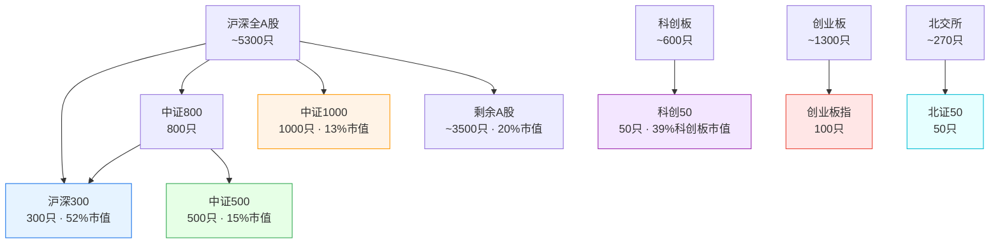
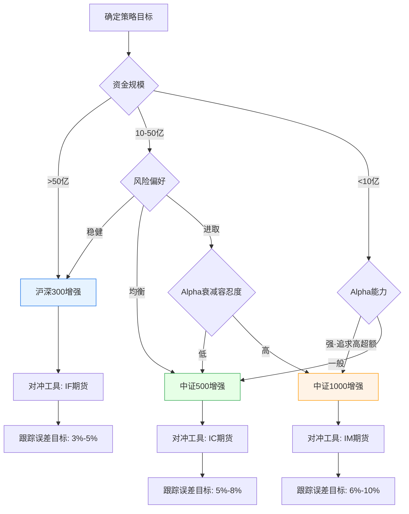

# A股指数体系与基准构建

## 核心要点

> [!summary] 一句话概括
> A股指数体系以中证规模指数族（沪深300/中证500/中证1000）为骨干，叠加板块指数（科创50/创业板指/北证50）、行业分类（中信/申万/Wind）、风格与Smart Beta指数，构成量化策略的基准选择与因子研究底座。

**关键参数速览：**
- **沪深300**：300只成分股，覆盖A股总市值约52%，半年调整一次，调整比例不超过10%
- **中证500**：500只成分股，覆盖A股总市值约15%，半年调整，与沪深300互补
- **中证1000**：1000只成分股，覆盖A股总市值约13%，半年调整，小盘代表
- **科创50**：50只成分股，覆盖科创板市值约39%，季度调整
- **创业板指**：100只成分股，半年调整，2025年起引入ESG剔除机制
- **北证50**：50只成分股，季度调整，单股权重上限10%
- 三大行业分类：中信30个一级行业、申万31个一级行业、Wind 29个一级行业

---

## 一、主要宽基指数详解

### 1.1 中证规模指数族：沪深300 / 中证500 / 中证1000

三只指数互补构成中证规模指数家族，合计覆盖沪深A股总市值超过80%。均采用**派许加权综合价格指数公式**：

$$\text{报告期指数} = \frac{\text{报告期样本调整市值}}{\text{基期调整市值}} \times 1000$$

其中调整股本基于**分级靠档自由流通比例**（自由流通比例<10%用实际流通股本，10%-30%靠档20%，30%-40%靠档30%，以此类推）。

#### 沪深300指数（000300）

| 参数 | 说明 |
|------|------|
| **成分股数量** | 300只 |
| **样本空间** | 沪深A股，上市超1个季度（大市值新股可豁免） |
| **选样方法** | 剔除ST股 -> 按最近1年日均成交额剔除后50% -> 按日均总市值选前300 |
| **加权方式** | 自由流通市值加权（分级靠档） |
| **基日/基点** | 2004年12月31日 / 1000点 |
| **A股市值覆盖率** | 约51.92%（2024年数据） |
| **定期调整** | 每半年（6月、12月第二个周五后的下一交易日生效） |
| **调整比例上限** | 不超过10%（即每次最多调整30只） |
| **缓冲区机制** | 排名前240的候选新股优先进入，排名前360的老样本优先保留 |
| **备选名单** | 15只，使用过半时补充公告 |
| **权重限制** | 无单一个股硬性上限，但分级靠档机制自然分散 |

**量化意义**：A股最核心的大盘基准，沪深300期货/期权流动性最优，指数增强产品最成熟。

#### 中证500指数（000905）

| 参数 | 说明 |
|------|------|
| **成分股数量** | 500只 |
| **样本空间** | 沪深A股中排除沪深300成分股后的股票 |
| **选样方法** | 剔除ST股和流动性后50% -> 按日均总市值选前500 |
| **A股市值覆盖率** | 约14.83%（2024年数据） |
| **定期调整** | 每半年，调整比例不超过10% |
| **缓冲区机制** | 前90%成交额老样本优先保留 |

**量化意义**：中盘股代表，多因子alpha空间大于沪深300，策略容量适中，指数增强基金规模第二大。

#### 中证1000指数（000852）

| 参数 | 说明 |
|------|------|
| **成分股数量** | 1000只 |
| **样本空间** | 沪深A股中排除中证800（沪深300+中证500）成分股 |
| **选样方法** | 剔除ST/流动性差股 -> 按规模和流动性选前1000 |
| **A股市值覆盖率** | 约13.22%（2024年数据） |
| **定期调整** | 每半年，调整比例不超过10% |

**量化意义**：小盘股代表，alpha空间最大但策略容量有限，适合中小规模量化资金，2022年上市股指期货后衍生品对冲日益完善。

### 1.2 板块特色指数

#### 科创50指数（000688）

| 参数 | 说明 |
|------|------|
| **成分股数量** | 50只 |
| **样本空间** | 科创板上市股票（含红筹CDR、差异化投票权公司） |
| **选样方法** | 剔除日均成交额后10% -> 按日均总市值选前50 |
| **加权方式** | 自由流通市值加权 |
| **权重上限** | 单股不超过10%，前五大合计不超过40% |
| **科创板市值覆盖率** | 约38.9% |
| **定期调整** | **每季度**（3/6/9/12月第二个周五后的下一交易日） |
| **调整比例上限** | 不超过10%（即每次最多5只） |
| **缓冲区** | 前40名候选优先进入，前60名老样本优先保留 |
| **新股纳入** | 上市满6个月（当满12个月公司达100-150只后调整为12个月），大市值可快速纳入 |
| **基日/基点** | 2019年12月31日 / 1000点 |

**量化意义**：科技创新板块核心基准，成分股集中在半导体、生物医药、新材料，波动率高，季度调整频率带来更频繁的调仓效应。

#### 创业板指数（399006）

| 参数 | 说明 |
|------|------|
| **成分股数量** | 100只 |
| **样本空间** | 创业板上市股票 |
| **选样方法** | 剔除日均成交额后10% -> 按日均总市值选前100 |
| **加权方式** | 自由流通市值加权 |
| **权重上限** | 2025年6月起单股不超过20% |
| **定期调整** | 每半年 |
| **备选名单** | 约5只（5%样本数） |
| **ESG约束（2025新规）** | 定期调整时剔除国证ESG评级B级以下股票 |
| **快速入选** | 上市5日内市值排名深圳市场前10，15个交易日后可快速入选 |

**量化意义**：成长风格代表指数，高beta特征明显，2025年ESG新规引入为行业首创，需关注其对成分股筛选的影响。

#### 北证50指数（899050）

| 参数 | 说明 |
|------|------|
| **成分股数量** | 50只 |
| **样本空间** | 北交所上市公司证券 |
| **选样方法** | 上市满6个月 -> 剔除日均成交额后20% -> 按日均总市值选前50 |
| **加权方式** | 自由流通市值加权 |
| **权重上限** | 单股不超过10%，前五大合计不超过40% |
| **定期调整** | **每季度**，调整比例不超过10% |
| **缓冲区** | 前40名候选优先进入，前60名老样本优先保留 |
| **临时调整** | ST后10交易日内剔除，重大违规证监会立案即移出，停牌超30天暂缓计入 |
| **基日/基点** | 2022年4月29日 / 1000点 |
| **样本平均市值** | 约56.8亿元（2025年3月） |

**量化意义**：北交所专精特新小巨人企业基准，流动性相对较弱，适合关注创新型中小企业的专题策略。

### 1.3 宽基指数层级关系

---

## 二、行业分类体系对比

A股市场主流使用三大行业分类体系，各有优势和应用场景：

### 2.1 三大体系对比

| 维度 | 中信行业分类 | 申万行业分类 | Wind行业分类 |
|------|-------------|-------------|-------------|
| **制定机构** | 中信证券 | 申万宏源证券 | 万得资讯 |
| **发布年份** | 2010年 | 2005年（2021年修订） | 与Wind终端同步 |
| **一级行业数** | 29~30个 | 31个（2021版） | 29个 |
| **二级行业数** | ~60个 | 134个 | 88个 |
| **三级行业数** | 105个 | 346个 | — |
| **层级数** | 三级 | 三级 | 二级 |
| **更新频率** | 不定期 | 不定期（2021年大改版） | 跟随Wind版本 |
| **数据获取** | 中信证券/Wind | 申万宏源/Wind/Tushare | Wind终端 |
| **市场覆盖** | A股+港股 | 主要A股 | A股为主 |

### 2.2 量化应用选择建议

| 场景 | 推荐分类 | 理由 |
|------|---------|------|
| **多因子模型行业中性化** | 申万一级（31个） | 最广泛采用，研报/因子库多基于此分类，便于对标 |
| **行业轮动策略** | 中信一级（30个） | 中信指数编制配套，行业ETF对应较好 |
| **基本面研究对标** | 申万三级（346个） | 颗粒度最细，可做精细行业对比 |
| **Wind终端一体化** | Wind行业分类 | 数据提取便利，终端内一站式使用 |
| **国际对标** | GICS（全球行业分类标准） | 国际投资者通用，但A股本土化不足 |

### 2.3 关键差异提示

- **命名差异**：同一行业在不同分类中名称不同。例如中信的"消费者服务"对应申万的"社会服务"
- **归属差异**：部分公司在不同体系下归入不同行业。例如光伏企业在申万归入"电力设备"，在中信可能归入"电力及公用事业"
- **数量变化**：申万2021年从28个一级行业扩充到31个（新增美容护理、电力设备、公用事业拆分等），使用历史数据时需注意版本切换

> [!warning] 量化实践注意
> 行业分类的选择会直接影响行业中性化处理、行业虚拟变量维度、以及因子IC测算结果。建议在策略文档中明确标注所用分类体系及版本。

---

## 三、风格指数与Smart Beta

### 3.1 风格指数

A股风格指数采用**二维框架**：规模（大盘/小盘） x 风格（价值/成长），通过因子评分将样本空间划分为四个象限。

#### 风格因子定义

| 因子类型 | 具体指标 | 计算方法 |
|---------|---------|---------|
| **价值因子** | 现金流/市价（CF/P）、盈利/市价（E/P）、净资产/市价（BV/P） | 三个指标Z分数取平均 |
| **成长因子** | EPS增长率、营收增长率、内部增长率 | 三个指标Z分数取平均 |
| **规模划分** | 日均总市值 | 大盘（沪深300/上证180范围）、小盘（中证500/1000范围） |

#### 主要风格指数

| 指数 | 样本空间 | 选股规则 | 成分股数 | 单股上限 |
|------|---------|---------|---------|---------|
| 沪深300价值 | 沪深300 | 价值评分最高的1/3 | 100只 | 10% |
| 沪深300成长 | 沪深300 | 成长评分最高的1/3 | 100只 | 10% |
| 中证500价值 | 中证500 | 价值评分排序 | 约167只 | 10% |
| 中证500成长 | 中证500 | 成长评分排序 | 约167只 | 10% |

- **相对指数** vs **绝对指数**：相对指数允许部分股票同时具有价值和成长属性（双属性股票），绝对指数严格二分
- **调整频率**：通常每半年（5/11月或6/12月）

### 3.2 Smart Beta指数

Smart Beta指数在传统市值加权基础上，引入单一或多个因子作为选股和加权依据，本质是**系统性因子暴露的被动投资工具**。

| Smart Beta类型 | 核心因子 | 代表指数 | 选股逻辑 | A股表现特征 |
|---------------|---------|---------|---------|------------|
| **红利/股息** | 股息率（D/P） | 中证红利（000922）、上证红利（000015） | 过去1年分红稳定+高股息率，权重正比红利评分 | 熊市防御性强，牛市弹性不足 |
| **低波动** | 历史波动率倒数 | 中证低波动（930955） | 过去1年日收益标准差最低的股票 | A股有效性弱于海外（散户博弈导致） |
| **质量** | ROE、盈利稳定性、低杠杆 | 中证质量（930926） | 高ROE+稳定盈利+低资产负债率综合评分 | 长期alpha显著，与基本面因子协同 |
| **动量** | 近期价格动量 | 中证动量（930868） | 近6/12个月价格涨幅排序 | A股反转效应显著，纯动量需慎用 |
| **等权** | 等权重 | 沪深300等权（000982） | 沪深300成分股等权重配置 | 相对市值加权有小盘溢价 |
| **基本面** | 营收/现金流/净资产/分红 | 基本面50（399925） | RAFI基本面指数方法论 | 长期有效，估值回归驱动 |

> [!tip] Smart Beta的量化应用
> - **因子择时**：根据宏观周期在不同Smart Beta之间轮动（如衰退期配置红利+低波，复苏期配置动量+成长）
> - **因子组合**：多因子Smart Beta（如红利+低波、质量+价值）可降低单因子回撤
> - **增强底仓**：以Smart Beta ETF作为底仓，叠加alpha信号做增强

---

## 四、指数增强策略的基准选择

### 4.1 三大基准对比

| 维度 | 沪深300增强 | 中证500增强 | 中证1000增强 |
|------|-----------|-----------|------------|
| **成分股数** | 300 | 500 | 1000 |
| **平均市值** | 大盘（千亿级） | 中盘（百亿级） | 小盘（几十亿级） |
| **Alpha空间** | 较小（机构定价充分） | 中等 | 较大（定价效率低） |
| **策略容量** | 最大（数百亿） | 大（百亿级） | 较小（数十亿级） |
| **超额收益中位数** | 3%~8% | 5%~15% | 8%~20% |
| **超额稳定性** | 最稳定 | 较稳定 | 波动较大 |
| **衍生品对冲** | IF期货、300ETF期权 | IC期货、500ETF期权 | IM期货 |
| **基金规模（2025）** | 最大 | 第二 | 快速增长 |
| **竞争强度** | 最高 | 较高 | 相对较低 |

### 4.2 基准选择决策流程

### 4.3 全市场选股策略的基准

对于不限于特定指数成分股的全市场选股产品：
- **万得全A（881001）**：覆盖所有沪深A股，最适合纯Alpha策略的业绩比较
- **中证全指（000985）**：覆盖沪深A股流通股，适合中性策略基准
- **自定义合成基准**：按策略实际的市值/行业分布构建合成指数，更精确反映风格暴露

### 4.4 自定义基准构建方法

| 方法 | 描述 | 适用场景 |
|------|------|---------|
| **成分股合成** | 手动指定成分股和权重，市值/等权加权 | 主题策略、行业策略 |
| **指数混合** | 按比例混合多个指数（如60%沪深300 + 40%中证500） | 产品基准跨风格 |
| **风格约束基准** | 在优化器中设置行业/风格中性约束 | 纯Alpha策略 |
| **动态基准** | 基于策略持仓特征动态调整基准权重 | 灵活配置策略 |

---

## 五、成分股调整效应

### 5.1 调整效应的核心规律

指数成分股定期调整（调入/调出）会产生系统性的价格效应，主要源于**被动资金（ETF/指数基金）的强制买卖**。

| 效应类型 | 时间窗口 | 表现 | 原因 |
|---------|---------|------|------|
| **调入股上涨** | 公告日至实施日 | 累计异常收益率显著为正 | 被动基金提前买入+市场预期博弈 |
| **调出股下跌** | 公告日至实施日 | 累计异常收益率显著为负 | 被动基金卖出+负面信号效应 |
| **实施后反转** | 实施日后5~20日 | 调入股超额回落，调出股超额反弹 | 价格压力消退，均值回归 |
| **成交量放大** | 公告日至实施日 | 调入/调出股成交量显著放大 | 被动+主动资金博弈 |

### 5.2 指数规模与估值效应（2013-2024数据）

| 指数类型 | 定期调整后PE变化（平均） | 解释 |
|---------|----------------------|------|
| 上证50 | +1.47% | 调入高市值股抬升估值 |
| 沪深300 | +0.97% | 同上，但幅度较小 |
| 科创50 | +6.64% | 高成长股集中，估值弹性大 |
| 中证500 | -4.61% | 调入相对低估值股压低整体 |
| 中证1000 | -6.85% | 同上，小盘效应更明显 |
| 创业板指 | -4.72% | 类似中小盘效应 |

### 5.3 量化策略应用

**事件驱动策略构建思路：**

1. **预测调入调出名单**：在公告日前根据编制规则模拟筛选，提前1-2周建仓
2. **买入预期调入股**：尤其关注从小市值指数上调至大市值指数的路径（收益更稳定）
3. **卖出/做空预期调出股**：实施日前减持，规避持续下跌
4. **实施日后反向操作**：利用反转效应，卖出调入股、买入调出股
5. **控制风险**：注意单次调整样本量限制（10%规则），大市值指数调整效应更显著

> [!warning] 实操注意
> - 近年来随着被动基金规模扩大，调整效应的"提前量"越来越大（市场学习效应）
> - 需关注各指数专家委员会的特殊裁定权，可能导致预测偏差
> - 2025年创业板指引入ESG约束后，成分股调整的可预测性部分降低

---

## 六、参数速查表

### 6.1 宽基指数核心参数

| 参数 | 沪深300 | 中证500 | 中证1000 | 科创50 | 创业板指 | 北证50 |
|------|--------|--------|---------|--------|---------|--------|
| **代码** | 000300 | 000905 | 000852 | 000688 | 399006 | 899050 |
| **成分股数** | 300 | 500 | 1000 | 50 | 100 | 50 |
| **A股市值覆盖** | ~52% | ~15% | ~13% | ~39%(科创板) | — | — |
| **加权方式** | 自由流通市值 | 自由流通市值 | 自由流通市值 | 自由流通市值 | 自由流通市值 | 自由流通市值 |
| **调整频率** | 半年 | 半年 | 半年 | 季度 | 半年 | 季度 |
| **调整比例上限** | 10% | 10% | 10% | 10% | — | 10% |
| **单股权重上限** | — | — | — | 10% | 20%(2025) | 10% |
| **前五大权重上限** | — | — | — | 40% | — | 40% |
| **基日** | 2004.12.31 | 2004.12.31 | 2004.12.31 | 2019.12.31 | 2010.05.31 | 2022.04.29 |
| **基点** | 1000 | 1000 | 1000 | 1000 | 1000 | 1000 |
| **流动性筛选** | 剔除后50% | 剔除后50% | 剔除后50% | 剔除后10% | 剔除后10% | 剔除后20% |
| **期货对冲** | IF | IC | IM | — | — | — |

### 6.2 行业分类快速对比

| 体系 | 一级 | 二级 | 三级 | 量化主用 | 数据源 |
|------|-----|-----|-----|---------|--------|
| 中信 | 30 | ~60 | 105 | 行业ETF | Wind/中信 |
| 申万 | 31 | 134 | 346 | 因子中性化 | Wind/Tushare |
| Wind | 29 | 88 | — | 终端研究 | Wind |
| GICS | 11 | 25 | 74 | 国际对标 | MSCI/标普 |

---

## 七、选型决策指南

### 7.1 不同策略类型的基准选择

| 策略类型 | 推荐基准 | 理由 |
|---------|---------|------|
| 大盘蓝筹多因子 | 沪深300 | 流动性好，对冲工具完善 |
| 中盘成长多因子 | 中证500 | Alpha空间与容量均衡 |
| 小盘量价策略 | 中证1000 | Alpha空间大，价量因子有效 |
| 科技主题策略 | 科创50 / 创业板指 | 板块聚焦，科技因子有效 |
| 全市场选股 | 万得全A / 中证全指 | 无选股范围约束 |
| 行业轮动 | 中信/申万行业指数 | 行业维度基准 |
| 红利/价值策略 | 中证红利 / 沪深300价值 | 风格维度基准 |
| 绝对收益（中性） | 无基准或自定义 | 关注绝对收益和夏普比率 |

### 7.2 指数数据获取

各指数的成分股、权重、历史行情等数据可通过以下渠道获取：

| 数据源 | 免费/付费 | 覆盖范围 | 详见 |
|--------|----------|---------|------|
| 中证指数官网 | 免费（延迟） | 中证系列全部指数 | [[A股量化数据源全景图]] |
| Wind终端 | 付费 | 全市场指数 | [[A股量化数据源全景图]] |
| Tushare Pro | 免费/付费 | 主流指数 | [[A股量化数据源全景图]] |
| AKShare | 免费 | 主流指数 | [[A股量化数据源全景图]] |
| 交易所官网 | 免费 | 本所指数 | [[A股交易制度全解析]] |

---

## 相关笔记

- [[A股交易制度全解析]] — 交易规则、涨跌停、T+1等制度基础
- [[A股市场微观结构深度研究]] — 市场微观结构与流动性分析
- [[A股量化数据源全景图]] — 数据获取渠道与API接口

---

## 来源参考

1. 中证指数有限公司. 沪深300指数编制方案. csindex.com.cn
2. 中证指数有限公司. 中证500指数编制方案. csindex.com.cn
3. 中证指数有限公司. 中证1000指数编制方案. csindex.com.cn
4. 上海证券交易所. 科创50指数编制方案. sse.com.cn
5. 深圳证券交易所/国证指数. 创业板指数编制方案. cnindex.com.cn
6. 中证指数有限公司. 北证50指数编制方案. csindex.com.cn
7. 上海证券交易所. 上证风格指数系列编制方案. sse.com.cn
8. MSCI. MSCI中国A股风格指数方法论. msci.com
9. 中信证券. 指数成分股调整效应研究. 2024
10. 东方财富网. 指数增强策略2025年度回顾. eastmoney.com
11. 中国证券金融. 指数增强基金市场分析报告. 2025
12. 申万宏源. 申万行业分类标准（2021版）
13. BigQuant. 自定义基准与指数增强策略框架. bigquant.com
14. 清华大学五道口金融学院. A股指数效应实证研究
15. 新浪财经. A股指数成分股调整效应与事件驱动策略. 2024
16. 中国证券报. 全市场选股产品基准设置实践. 2023
17. 深圳证券交易所. 创业板指ESG修订公告. 2025
18. 上海金融局. 科创50指数季度审核公告. 2026
