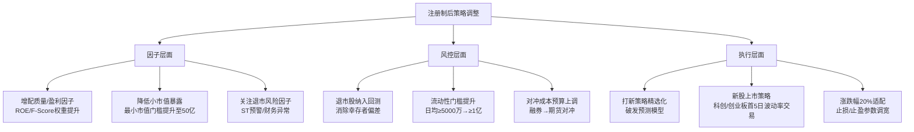

# A股注册制改革与量化策略影响

> - 注册制改革（科创板2019/创业板2020/全面注册制2023）是A股市场**结构性变革**，深刻改变了量化策略生态
> - 壳价值消亡：注册制前小市值股票的壳价值溢价约20-50%，注册制后**壳价值趋近于零**，小盘溢价逻辑重构
> - IPO定价市场化后新股首日涨幅从44%下限大幅分化（科创板/创业板首5日不设涨跌停），打新策略收益率从年化20-30%降至5-10%
> - 退市常态化（2020-2025年退市超200家）使**幸存者偏差**更加严重，回测必须包含退市股数据
> - 转融通/融券制度多次调整（2024年暂停转融券→融券T+0终结），量化对冲策略成本结构根本性改变

---

## 一、注册制改革时间线

| 时间 | 事件 | 量化影响 |
|------|------|---------|
| 2019.07 | 科创板开板（注册制试点） | 科创50指数诞生，新增投资标的 |
| 2020.08 | 创业板注册制改革 | 涨跌幅扩至±20%，波动率上升 |
| 2023.02 | 全面注册制实施 | 主板IPO定价市场化，壳价值消亡加速 |
| 2023.08 | 印花税减半至0.05% | 交易成本下降，高频策略受益 |
| 2023.10 | 融券T+0收紧 | 量化DMA策略受限 |
| 2024.01 | 量化DMA危机 | 雪球敲入+DMA平仓连锁踩踏 |
| 2024.05 | 程序化交易管理规定 | 高频认定300笔/秒，需先报告后交易 |
| 2024.07 | 转融券暂停 | 融券T+0策略彻底终结 |
| 2025.04 | 程序化交易实施细则 | 异常交易量化阈值明确 |

## 二、对量化策略的结构性影响

### 2.1 小盘股策略

| 维度 | 注册制前 | 注册制后 |
|------|---------|---------|
| 壳价值 | 20-50%溢价 | 趋近于零 |
| 小盘超额 | 年化15-25% | 年化5-12% |
| 退市风险 | 极低(<5家/年) | 常态化(30-50家/年) |
| IPO供给 | 稀缺(审批制) | 充裕(注册制) |
| 策略容量 | 大(壳价值支撑) | 收缩(个股流动性差) |

### 2.2 新股策略

| 维度 | 核准制 | 注册制 |
|------|--------|--------|
| 首日涨幅 | 44%涨停板(固定) | 科创/创业板首5日不设涨跌停 |
| 打新收益 | 年化20-30%(确定性高) | 年化5-10%(破发率20-30%) |
| 定价方式 | 发行价上限23倍PE | 市场化询价 |
| 破发率 | <5% | 20-30% |
| 策略变化 | 无脑打新 | 需选择性打新+破发预测 |

### 2.3 因子体系影响

| 因子 | 注册制前 | 注册制后 | 变化原因 |
|------|---------|---------|---------|
| 市值因子(SMB) | 小盘强溢价 | 溢价收窄 | 壳价值消亡+IPO供给增加 |
| 反转因子 | 强(散户驱动) | 减弱 | 机构占比提升+涨跌停扩至20% |
| 质量因子 | 中等 | 增强 | 退市常态化提升质量溢价 |
| 盈利因子(ROE) | 强 | 更强 | 基本面定价权重上升 |
| 换手率因子 | 最强 | 仍强但收窄 | 散户交易仍活跃但制度约束增加 |
| 波动率因子 | IVOL异象强 | 略减弱 | 涨跌幅扩大降低了波动率压制效应 |

### 2.4 对冲策略影响

| 维度 | 2020-2023 | 2024-2025 |
|------|-----------|-----------|
| 融券可得性 | 中等(转融通活跃) | 极差(转融券暂停) |
| 融券成本 | 年化6-8% | 年化8-10%+，券源稀缺 |
| 股指期货基差 | IC/IM贴水3-7% | IC贴水收窄至2-4% |
| 对冲工具 | 融券+股指期货 | 几乎只剩股指期货 |
| 市场中性策略 | 超额15-25% | 超额5-15%(成本上升) |

## 三、策略适应建议

## 四、相关笔记

- [[A股交易制度全解析]] — 注册制基本规则、涨跌停、T+1
- [[A股指数体系与基准构建]] — 科创50/创业板指编制
- [[A股市场参与者结构与资金流分析]] — 机构化趋势与散户占比变化
- [[A股量化交易合规要求]] — 程序化交易管理新规
- [[量化交易风控体系建设]] — 退市风险/融券风险管理
- [[A股基本面因子体系]] — 质量/盈利因子重要性提升
- [[A股技术面因子与量价特征]] — 反转/换手率因子变化

---

## 来源参考

1. 证监会《全面实行股票发行注册制相关规则》(2023.02)
2. 中金公司《注册制改革对A股市场结构的影响》2024
3. 华泰证券《壳价值消亡与小盘股策略重构》2023
4. 国泰君安《注册制后打新策略研究》2024
