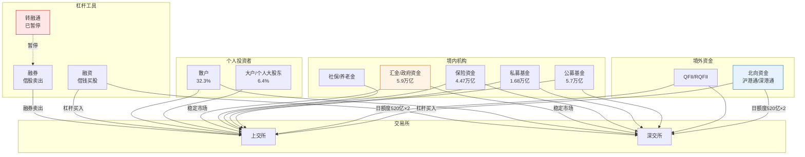
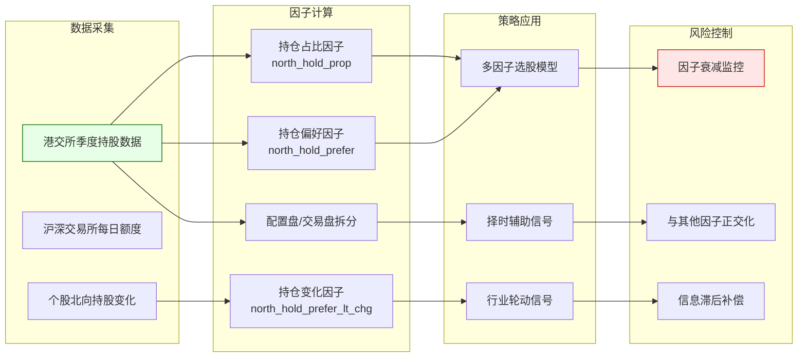

# A股市场参与者结构与资金流分析

## 核心要点

> [!summary] 30秒速览
> - A股流通市值中，一般个人投资者占32.3%，专业投资机构占19.2%，产业资本占34.4%（2024年末）
> - 公募基金是第一大机构投资者（持股市值约5.7万亿），量化私募2025年备案产品激增114%
> - 北向资金2024年8月起取消实时交易数据披露，持股改为按季度公布，日额度仍为沪/深各520亿元
> - 两融余额2025年末达2.51万亿元，2026年1月融资保证金比例上调至100%
> - 资金流指标（大单/超大单）存在定义不统一、主观划分、滞后性等根本局限
> - 龙虎榜数据可构建席位知名度因子、净流入因子等量化信号

## 在知识体系中的位置

```
L1: 市场基础设施与数据工程
├── [[A股交易制度全解析]]          ← 交易规则基础
├── [[A股市场微观结构深度研究]]     ← 订单簿与价格发现机制
├── A股市场参与者结构与资金流分析   ← 本文：谁在交易、资金如何流动
├── [[A股量化数据源全景图]]         ← 获取上述数据的渠道
├── [[量化数据工程实践]]            ← 数据清洗与存储
└── [[A股量化交易平台深度对比]]     ← 策略执行平台
```

本文聚焦"市场参与者是谁"以及"资金如何流动"，是理解 [[A股市场微观结构深度研究]] 中价格发现机制的前提，也是 [[A股指数体系与基准构建]] 中权重变动的驱动因素之一。

---

## 一、A股市场参与者结构全景

### 1.1 整体持股结构（2024年末数据）

按流通市值口径，A股五大类投资者占比如下：

| 投资者类型 | 流通市值占比 | 持股市值（万亿元） | 趋势（近三年） |
|:---|:---:|:---:|:---:|
| 产业资本 | 34.4% | — | 连续三年回升 |
| 一般个人投资者 | 32.3% | — | 缓慢下降 |
| 专业投资机构 | 19.2% | — | 稳步提升 |
| 政府持股（汇金等） | 7.6% | 5.9 | 连续三年回升 |
| 个人大股东 | 6.4% | — | 基本稳定 |

**自由流通市值口径**下，境内外机构投资者合计占比约46.84%，已接近半数。

> [!important] 账户数 vs 持股市值
> 个人投资者账户数占比99.76%（2368万人），机构仅0.24%（57万人）。但机构持股市值占比远高于账户占比——这一结构性差异是理解A股行为特征的关键。

### 1.2 专业机构投资者详解

#### 公募基金

- **持股市值**：约5.7万亿元，占流通市值7.3%
- **交易活跃度**：2024年股票交易金额21.3万亿元，占全A股交易额（258万亿元）的8.3%
- **特征**：第一大类机构投资者，在专业机构中占比约40%；季报披露持仓，被动指数型基金占比持续提升
- **数据获取**：基金季报/半年报/年报持仓数据，可通过 [[A股量化数据源全景图]] 中的 Wind、Choice、AKShare 等渠道获取

#### 私募基金

- **持股市值**：约1.68万亿元，占流通市值4.1%
- **量化私募**：2025年备案产品5617只，较2024年（2621只）增幅114.31%
- **策略分布**：股票策略占比60%以上
- **特征**：信息披露较少，仅季度向基金业协会报告；量化私募对市场微观结构影响显著（高频交易、日内回转）
- **数据获取**：私募排排网、朝阳永续等第三方平台；中基协备案信息

#### 保险资金

- **持股市值**：约4.47万亿元（2025Q1），占流通市值约3%
- **特征**：持股占比连续三年回升；偏好高股息、低波动蓝筹股；投资周期长（负债端久期匹配）
- **监管约束**：权益类资产配置上限根据偿付能力充足率分档（最高可达45%）
- **数据获取**：保险资管协会、季度偿付能力报告

#### 社保基金/养老金

- **持股占比**：约1.9%-3.9%
- **特征**：长线配置型资金，换手率低；全国社保基金委托外部管理人运作
- **信号意义**：社保基金新进/增持个股常被视为价值信号

#### QFII/RQFII

- **持股市值**：约1.2万亿元（陆股通外的外资通道）
- **最新变化**：2024年2月QFII/RQFII管理办法进一步放宽投资范围
- **特征**：与北向资金部分重叠；持仓数据通过季报披露，时效性低于北向资金

### 1.3 交易活跃度对比

公募基金、量化私募、外资三大主体交易占比已达全市场约30%。其中量化私募虽然持股市值占比不高，但由于高频交易特性，贡献了远超持仓比例的成交量。

---

## 二、北向资金：沪港通/深港通机制

### 2.1 基本机制

| 维度 | 沪股通 | 深股通 |
|:---|:---|:---|
| 开通时间 | 2014年11月17日 | 2016年12月5日 |
| 每日额度 | 520亿元人民币 | 520亿元人民币 |
| 额度性质 | 净买入额度（买入-卖出），当日用完即停 | 同左 |
| 标的范围 | 上证180/380成分股 + AH股 | 深证成指/中小创新指成分股 + AH股 |
| 交易货币 | 人民币（通过换汇） | 同左 |
| 结算周期 | T+0交收（资金）、T+2交收（股票） | 同左 |

> [!note] 额度披露规则
> - 当日额度余额 ≥ 30%：显示"额度充足"
> - 当日额度余额 < 30%：实时公布具体余额
> - 额度用完当日不再接受买入申报，但可卖出；跨日额度不结转

### 2.2 2024年重大变化：信息披露调整

| 时间节点 | 变化内容 | 影响 |
|:---|:---|:---|
| 2024年5月 | 港交所取消北向资金盘中实时买入/卖出金额披露 | 无法再实时跟踪北向资金动向 |
| 2024年8月19日 | 北向持股数据由每日披露改为**按季度披露** | 高频跟踪策略失效 |
| 持续影响 | 境内机构信息优势减弱，量化套利策略有效性下降 | 北向资金因子衰减 |

### 2.3 北向资金规模与特征（2025年数据）

- **持股规模**：截至2025年末，持股约1080亿股，持股市值突破2.5万亿元
- **交易活跃度**：2025年全年买卖总额达50.33万亿元
- **持股偏好**：
  - 配置盘（长线）：偏好消费、金融等价值板块
  - 交易盘（短线）：偏好科技、资源等高波动板块
- **数据获取**：港交所季度披露数据、Choice/Wind 北向持股数据库

### 2.4 北向资金量化因子

| 因子名称 | 定义 | IC均值 | IC_IR | 适用域 |
|:---|:---|:---:|:---:|:---|
| north_hold_prop | 北向持仓占自由流通市值比 | 3.5% | 0.60 | 全市场 |
| north_hold_prefer | 北向持仓偏好度（超/低配） | 3.8% | 0.69 | 全市场 |
| north_hold_prefer_lt_chg | 北向持仓偏好长期变化 | — | — | 沪深300/中证500/中证1000内多头年化超额>10% |

> [!warning] 因子衰减风险
> 2024年实时数据取消后，高频北向资金跟踪策略失效。季度披露数据仅支持低频因子构建，需结合其他因子源做多因子融合。

---

## 三、融资融券（两融）制度

### 3.1 基本机制

- **融资**：投资者向券商借入资金买入证券（看多杠杆）
- **融券**：投资者向券商借入证券卖出（看空工具）
- **转融通**：券商向中国证券金融公司借入资金或证券，扩大融资融券规模

### 3.2 两融余额规模

| 时间点 | 两融余额 | 备注 |
|:---|:---:|:---|
| 2015年6月峰值 | 2.27万亿元 | 杠杆牛市顶点 |
| 2024年9月24日前 | ~1.4万亿元 | 低位 |
| 2024年11月13日 | ~1.9万亿元 | 9.24行情后增长4830亿元 |
| 2025年末 | 2.51万亿元 | 时隔十年重回2万亿以上 |
| 2026年1月13日 | 持续增长 | 开年不到两周融资净买入超1400亿元 |

### 3.3 2023-2025监管变化时间线

| 时间 | 政策内容 | 影响 |
|:---|:---|:---|
| 2023年10月 | 限售股/战略配售股/大宗减持股持有者及关联方禁止融券卖出同一股票 | 封堵限售股变相减持 |
| 2024年初 | 多家券商禁止用融资买入证券偿还融券合约 | 封堵绕标套利空间 |
| 2024年7月22日 | 融券保证金比例由80%上调至100%；私募融券保证金由100%上调至120% | 提高融券成本 |
| 2024年 | 暂停转融券业务 | 市场融券来源大幅减少 |
| 2025年末 | 《融资融券客户交易行为管理》示范实践发布 | 穿透式管理，"看不清、不展业" |
| 2026年1月14日 | **融资保证金最低比例上调至100%** | 1:1配资，杠杆率从最高约2.5倍降至2倍 |

> [!caution] 融券T+0策略的终结
> 此前部分量化机构利用融券实现"T+0"日内回转交易——当日融券卖出后买入还券。随着融券保证金大幅提升、转融券暂停、限售股融券禁令等一系列政策出台，融券T+0策略空间已基本被压缩殆尽。这对依赖日内回转的量化策略（尤其是高频做市策略）影响显著。

### 3.4 两融因子构建

两融数据可构建以下量化因子：
- **融资余额变化率**：`(今日融资余额 - N日前融资余额) / N日前融资余额`，正向预示市场情绪偏多
- **融券余额占比**：`融券余额 / (融资余额 + 融券余额)`，高值暗示空头力量增强
- **两融余额/流通市值比**：衡量个股杠杆水平，极端值可作为风险预警
- **融资净买入强度**：`当日融资买入额 / 当日总成交额`

> 两融因子在价量复合模型中分组单调性较好，沪深300内推荐与量价相关性因子配合使用，中小市值内关注换手率和反转因子，两融作为补充。

---

## 四、主力资金流向分析

### 4.1 大单/超大单定义

| 分类 | 金额阈值 | 数据源 |
|:---|:---:|:---|
| 小单 | < 2万元 | 东方财富/同花顺 |
| 中单 | 2万-6万元 | 东方财富/同花顺 |
| 大单 | 6万-100万元 | 东方财富/同花顺 |
| 超大单 | ≥ 100万元 | 东方财富/同花顺 |

> [!warning] 阈值不统一
> 上述阈值为市场常见标准（东方财富、同花顺），但**各平台定义并不统一**。部分平台以50万元、200万元为大单/超大单分界。使用前务必确认数据源的具体定义。

### 4.2 资金流计算方法

#### 方法一：逐笔判定法（主流）

根据每笔成交的买卖方向判定：
- 以卖一价（或更高价）主动买入 → 计入**资金流入**
- 以买一价（或更低价）主动卖出 → 计入**资金流出**
- 净流入 = 主动买入总额 - 主动卖出总额

#### 方法二：分钟价格变化法

- 某分钟收盘价 > 上一分钟收盘价 → 该分钟全部成交额计入流入
- 某分钟收盘价 < 上一分钟收盘价 → 该分钟全部成交额计入流出
- 价格不变 → 不计入

#### 方法三：内外盘累计法

- 外盘（主动买入量）× 权重 + 内盘（主动卖出量）× 权重
- 累计30-60天，换手率 ≥ 100% 视为主力控盘完成

### 4.3 资金流指标的根本局限

| 局限类型 | 具体表现 |
|:---|:---|
| **定义主观性** | 大单阈值无统一标准，不同平台结果不一致 |
| **因果倒置** | 资金流本质是成交的事后统计，不代表"主力意图" |
| **对敲干扰** | 主力可通过对敲（自买自卖）制造虚假资金流信号 |
| **滞后性** | 基于历史成交数据，无法捕捉隐形资金（如算法拆单、暗池） |
| **忽略上下文** | 不考虑宏观政策、基本面变化，单独使用准确率低 |
| **统计悖论** | 每笔成交必有买卖双方，总资金流入 ≡ 总资金流出，"净流入"本质上是对成交方向的主观归因 |

> [!danger] 硬性规则
> **永远不要将"主力资金净流入"作为单一交易信号。** 它是情绪辅助指标，不是因果预测工具。在量化模型中，资金流因子需与量价、基本面因子正交化后使用。

---

## 五、龙虎榜数据解读

### 5.1 触发条件

沪深交易所每日公布满足以下条件之一的异动股票：

| 触发条件 | 具体阈值 |
|:---|:---|
| 日涨幅偏离值 | ≥ +7% 或 ≤ -7% |
| 日换手率 | ≥ 20% |
| 日价格振幅 | ≥ 15% |
| 连续三日累计涨幅偏离 | ≥ +20% 或 ≤ -20% |

每只上榜股票公布**买入前5名**和**卖出前5名**营业部/机构席位的成交金额。

### 5.2 席位类型与信号

| 席位类型 | 特征 | 信号解读 |
|:---|:---|:---|
| **机构专用席位** | 标注为"机构专用" | 中长线看好，基本面驱动 |
| **知名游资席位** | 如银河绍兴路、光大杭州庆春路等 | 题材高度认可，短线连板概率高但波动大 |
| **沪/深股通专用** | 北向资金席位 | 外资关注信号 |
| **普通营业部** | 无特殊标注 | 信号较弱 |

### 5.3 龙虎榜量化因子

| 因子名 | 构造方法 | 逻辑 |
|:---|:---|:---|
| 席位知名度因子 | `知名席位数 / 5`（买入端） | 知名游资/机构越多，市场认可度越高 |
| 净流入因子 | `(买入总额 - 卖出总额) / 当日总成交额` | 衡量龙虎榜资金净方向 |
| 换手涨幅匹配因子 | 换手率 > 市场均值 且 成交量放大 | 量价配合信号 |
| 连续上榜因子 | `连续上榜天数 × 净买入额` | 持续性强则空间大 |
| 机构占比因子 | `机构席位买入额 / 买入总额` | 机构主导的上榜更具持续性 |

---

## 六、参数速查表

| 参数 | 数值 | 更新时间 | 备注 |
|:---|:---|:---:|:---|
| 北向资金日额度（沪/深） | 各520亿元 | 持续有效 | 净买入口径 |
| 北向持股市值 | ~2.5万亿元 | 2025年末 | 含沪/深股通 |
| 北向持股披露频率 | 季度 | 2024年8月起 | 此前为每日 |
| 两融余额 | 2.51万亿元 | 2025年末 | 时隔10年回到2万亿+ |
| 融资保证金最低比例 | 100% | 2026年1月14日起 | 此前为80% |
| 融券保证金比例 | 100%（私募120%） | 2024年7月起 | — |
| 大单阈值（常见） | ≥ 6万元 | — | 平台定义不统一 |
| 超大单阈值（常见） | ≥ 100万元 | — | 平台定义不统一 |
| 龙虎榜涨幅偏离阈值 | ±7% | — | 沪深交易所规则 |
| 龙虎榜换手率阈值 | ≥ 20% | — | — |
| 个人投资者账户占比 | 99.76% | 2024年末 | — |
| 机构投资者自由流通市值占比 | ~46.84% | 2024年末 | 境内外合计 |
| 公募基金持股市值 | ~5.7万亿元 | 2024年末 | 占流通市值7.3% |
| 外资（陆股通+QFII）持股市值 | ~3.4万亿元 | 2024年末 | 占流通市值4.3% |

---

## 七、Mermaid 图表

### 7.1 A股市场资金流向关系图



### 7.2 北向资金跟踪与因子构建流程



---

## 八、硬性规则与软性建议

### 硬性规则（必须遵守）

1. **北向资金日额度用尽后不可买入**：额度机制是硬约束，策略中必须考虑极端行情下的额度耗尽风险
2. **融资保证金比例 ≥ 100%**：2026年1月14日起生效，实际杠杆不超过2倍
3. **限售股持有者及关联方禁止融券卖出同一股票**：违规将面临监管处罚
4. **转融券业务已暂停**：不可依赖转融通获取券源
5. **北向持股数据仅季度披露**：不可在模型中假设日频北向持股数据可用
6. **龙虎榜数据T+1公布**：当日收盘后才能获取，不可用于日内交易信号

### 软性建议（推荐遵循）

1. **资金流因子与量价因子正交化后使用**：避免多重共线性，资金流因子IC_IR在0.4-0.8区间
2. **北向资金因子降频使用**：鉴于披露频率变化，建议月频或季频调仓
3. **两融数据关注极端值**：两融余额/流通市值比超过历史95%分位时，视为过热信号
4. **龙虎榜因子重点关注机构席位**：机构席位信号比游资更具持续性
5. **多数据源交叉验证**：同一指标（如资金流）在不同平台的计算结果可能差异显著

---

## 九、常见误区

| 误区 | 真相 |
|:---|:---|
| "北向资金是聪明钱，跟着买就能赚" | 2024年后实时数据取消，跟踪策略失效；且北向资金因子IC_IR仅0.6-0.7，远非稳赢因子 |
| "主力资金净流入说明主力在买" | 每笔成交都有买卖双方，"净流入"是对成交方向的主观归因，不代表真实意图 |
| "两融余额越高越危险" | 需看两融余额/总市值比，2025年2.51万亿对应的杠杆率远低于2015年同期 |
| "龙虎榜机构买入必涨" | 机构席位有更高胜率但非100%，需结合市场环境和个股基本面 |
| "QFII持仓等于北向资金" | QFII/RQFII是独立通道，与沪深港通北向资金有重叠但不等同 |
| "融券T+0策略仍可执行" | 转融券暂停 + 保证金大幅提升，策略空间已基本消失 |
| "超大单流入说明机构在建仓" | 超大单可能是对敲、拆单、ETF申赎等非主动意图行为 |

---

## 十、选型决策指南：资金流数据源选择

### 场景一：多因子选股模型

- **推荐数据**：北向持仓季度数据 + 两融日频数据 + 龙虎榜事件数据
- **更新频率**：季度（北向）+ 日频（两融）+ 事件驱动（龙虎榜）
- **数据源**：Wind/Choice 专业终端，或 [[A股量化数据源全景图]] 中的免费替代方案

### 场景二：短线交易/事件驱动

- **推荐数据**：龙虎榜席位数据 + 两融余额变化 + 涨停板复盘
- **更新频率**：日频
- **注意事项**：北向资金实时数据已取消，不可作为日内信号源

### 场景三：宏观择时/仓位管理

- **推荐数据**：两融余额/总市值比 + 北向资金季度净流入 + 公募基金仓位
- **更新频率**：周频/月频
- **信号逻辑**：极端值反转（两融过热/过冷）+ 趋势跟踪（外资配置方向）

### 场景四：风险监控

- **推荐数据**：两融担保比例分布 + 融资净买入强度 + 北向大幅净卖出预警
- **更新频率**：日频
- **阈值设置**：融资担保比例跌破130%触发平仓预警

---

## 十一、资金流因子构建 Python 代码

```python
"""
A股资金流因子构建框架
数据依赖: akshare / tushare / Wind API
"""
import pandas as pd
import numpy as np
from typing import Optional

# ============================================================
# 1. 北向资金因子（季度频率）
# ============================================================

def calc_northbound_hold_ratio(
    north_hold: pd.DataFrame,  # columns: [date, stock_code, north_shares]
    free_float: pd.DataFrame,  # columns: [date, stock_code, free_float_shares]
) -> pd.DataFrame:
    """
    北向持仓占比因子 (north_hold_prop)
    IC均值 ~3.5%, IC_IR ~0.60
    """
    merged = north_hold.merge(free_float, on=["date", "stock_code"])
    merged["north_hold_prop"] = (
        merged["north_shares"] / merged["free_float_shares"]
    )
    return merged[["date", "stock_code", "north_hold_prop"]]


def calc_northbound_preference_change(
    north_hold: pd.DataFrame,
    lookback_quarters: int = 4,
) -> pd.DataFrame:
    """
    北向持仓偏好变化因子 (north_hold_prefer_lt_chg)
    沪深300/中证500/中证1000 多头年化超额 >10%
    """
    north_hold = north_hold.sort_values(["stock_code", "date"])
    north_hold["north_hold_chg"] = north_hold.groupby("stock_code")[
        "north_shares"
    ].pct_change(lookback_quarters)
    # 截面标准化
    north_hold["north_prefer_chg_zscore"] = north_hold.groupby("date")[
        "north_hold_chg"
    ].transform(lambda x: (x - x.mean()) / x.std())
    return north_hold[["date", "stock_code", "north_prefer_chg_zscore"]]


# ============================================================
# 2. 融资融券因子（日频）
# ============================================================

def calc_margin_factors(
    margin_data: pd.DataFrame,  # columns: [date, stock_code, fin_balance,
                                #           sec_balance, fin_buy_amount]
    turnover: pd.DataFrame,     # columns: [date, stock_code, total_turnover]
    window: int = 20,
) -> pd.DataFrame:
    """
    两融因子族:
    - fin_balance_chg: 融资余额变化率（N日）
    - sec_ratio: 融券余额占比
    - fin_buy_intensity: 融资净买入强度
    """
    df = margin_data.merge(turnover, on=["date", "stock_code"])
    df = df.sort_values(["stock_code", "date"])

    # 融资余额变化率
    df["fin_balance_lag"] = df.groupby("stock_code")["fin_balance"].shift(window)
    df["fin_balance_chg"] = (
        (df["fin_balance"] - df["fin_balance_lag"]) / df["fin_balance_lag"]
    )

    # 融券余额占比
    df["total_margin"] = df["fin_balance"] + df["sec_balance"]
    df["sec_ratio"] = df["sec_balance"] / df["total_margin"].replace(0, np.nan)

    # 融资净买入强度
    df["fin_buy_intensity"] = (
        df["fin_buy_amount"] / df["total_turnover"].replace(0, np.nan)
    )

    return df[["date", "stock_code", "fin_balance_chg", "sec_ratio",
               "fin_buy_intensity"]]


# ============================================================
# 3. 龙虎榜因子（事件驱动）
# ============================================================

def calc_lhb_factors(
    lhb_data: pd.DataFrame,
    # columns: [date, stock_code, seat_name, seat_type, buy_amount,
    #           sell_amount, total_turnover]
    famous_seats: Optional[list] = None,
) -> pd.DataFrame:
    """
    龙虎榜因子族:
    - lhb_net_inflow: 净流入因子
    - lhb_seat_fame: 席位知名度因子
    - lhb_inst_ratio: 机构占比因子
    """
    if famous_seats is None:
        famous_seats = [
            "银河证券绍兴", "光大证券杭州庆春路", "华泰证券深圳益田路",
            "中信证券上海溧阳路", "国泰君安上海江苏路",
        ]

    agg = lhb_data.groupby(["date", "stock_code"]).agg(
        total_buy=("buy_amount", "sum"),
        total_sell=("sell_amount", "sum"),
        turnover=("total_turnover", "first"),
        inst_buy=("buy_amount", lambda x: x[
            lhb_data.loc[x.index, "seat_type"] == "机构专用"
        ].sum()),
        famous_count=("seat_name", lambda x: x.isin(famous_seats).sum()),
        total_seats=("seat_name", "count"),
    ).reset_index()

    # 净流入因子
    agg["lhb_net_inflow"] = (
        (agg["total_buy"] - agg["total_sell"])
        / agg["turnover"].replace(0, np.nan)
    )

    # 席位知名度因子 (0~1)
    agg["lhb_seat_fame"] = agg["famous_count"] / agg["total_seats"]

    # 机构占比因子
    agg["lhb_inst_ratio"] = (
        agg["inst_buy"] / agg["total_buy"].replace(0, np.nan)
    )

    return agg[["date", "stock_code", "lhb_net_inflow",
                "lhb_seat_fame", "lhb_inst_ratio"]]


# ============================================================
# 4. 资金流因子（日频，基于逐笔成交）
# ============================================================

def calc_money_flow_factors(
    tick_data: pd.DataFrame,
    # columns: [date, stock_code, timestamp, price, volume, amount,
    #           direction]  # direction: 1=主买, -1=主卖
    large_threshold: float = 60000,       # 大单阈值: 6万元
    super_large_threshold: float = 1000000,  # 超大单阈值: 100万元
) -> pd.DataFrame:
    """
    资金流因子族:
    - net_inflow_large: 大单净流入 (IC_IR ~0.78)
    - net_inflow_super: 超大单净流入
    - am_inflow_ratio: 上午资金流入占比（10点前有效性更高）
    """
    df = tick_data.copy()

    # 分类大单/超大单
    df["order_type"] = "small"
    df.loc[df["amount"] >= large_threshold, "order_type"] = "large"
    df.loc[df["amount"] >= super_large_threshold, "order_type"] = "super_large"

    # 带方向的金额
    df["signed_amount"] = df["amount"] * df["direction"]

    # 按股票、日期、订单类型汇总
    daily = df.groupby(["date", "stock_code", "order_type"]).agg(
        net_amount=("signed_amount", "sum"),
        total_amount=("amount", "sum"),
    ).reset_index()

    # 大单净流入
    large_flow = daily[daily["order_type"] == "large"].rename(
        columns={"net_amount": "net_inflow_large"}
    )[["date", "stock_code", "net_inflow_large"]]

    # 超大单净流入
    super_flow = daily[daily["order_type"] == "super_large"].rename(
        columns={"net_amount": "net_inflow_super"}
    )[["date", "stock_code", "net_inflow_super"]]

    # 上午资金流入占比（10:30前）
    df["hour"] = pd.to_datetime(df["timestamp"]).dt.hour
    df["minute"] = pd.to_datetime(df["timestamp"]).dt.minute
    df["is_am_early"] = (df["hour"] < 10) | (
        (df["hour"] == 10) & (df["minute"] <= 0)
    )  # 开盘到10:00

    am_flow = df[df["is_am_early"]].groupby(["date", "stock_code"]).agg(
        am_net=("signed_amount", "sum")
    ).reset_index()

    total_flow = df.groupby(["date", "stock_code"]).agg(
        day_net=("signed_amount", "sum"),
        day_total=("amount", "sum"),
    ).reset_index()

    result = total_flow.merge(am_flow, on=["date", "stock_code"], how="left")
    result["am_inflow_ratio"] = result["am_net"] / result["day_total"].replace(
        0, np.nan
    )

    result = result.merge(large_flow, on=["date", "stock_code"], how="left")
    result = result.merge(super_flow, on=["date", "stock_code"], how="left")

    # 标准化
    for col in ["net_inflow_large", "net_inflow_super", "am_inflow_ratio"]:
        result[col] = result.groupby("date")[col].transform(
            lambda x: (x - x.mean()) / x.std()
        )

    return result[["date", "stock_code", "net_inflow_large",
                    "net_inflow_super", "am_inflow_ratio"]]


# ============================================================
# 5. 综合资金流多因子合成
# ============================================================

def composite_money_flow_alpha(
    north_factor: pd.DataFrame,
    margin_factor: pd.DataFrame,
    lhb_factor: pd.DataFrame,
    flow_factor: pd.DataFrame,
    weights: Optional[dict] = None,
) -> pd.DataFrame:
    """
    等权/自定义权重合成资金流复合因子
    默认权重基于各因子IC_IR经验值
    """
    if weights is None:
        weights = {
            "north_hold_prop": 0.15,
            "north_prefer_chg_zscore": 0.10,
            "fin_balance_chg": 0.10,
            "fin_buy_intensity": 0.10,
            "lhb_net_inflow": 0.15,
            "lhb_inst_ratio": 0.10,
            "net_inflow_large": 0.20,
            "am_inflow_ratio": 0.10,
        }

    # 合并所有因子
    merged = north_factor
    for df in [margin_factor, lhb_factor, flow_factor]:
        merged = merged.merge(df, on=["date", "stock_code"], how="outer")

    # 加权合成
    merged["composite_flow_alpha"] = sum(
        merged[col].fillna(0) * w for col, w in weights.items()
        if col in merged.columns
    )

    return merged[["date", "stock_code", "composite_flow_alpha"]]
```

> [!tip] 使用说明
> 1. 北向资金因子建议季度更新（受披露频率限制），其他因子可日频更新
> 2. `large_threshold` 和 `super_large_threshold` 应与你使用的数据源定义一致
> 3. 龙虎榜 `famous_seats` 列表需定期维护，游资席位会变迁
> 4. 数据源可通过 AKShare（`ak.stock_lhb_detail_em()`、`ak.stock_margin_detail_em()`）免费获取，详见 [[A股量化数据源全景图]]

---

## 十二、相关笔记链接

- [[A股交易制度全解析]] — 涨跌停、T+1等基础制度，影响资金流行为模式
- [[A股市场微观结构深度研究]] — 订单簿结构与价格发现机制，理解大单冲击的微观基础
- [[A股量化数据源全景图]] — 获取北向资金、两融、龙虎榜等数据的具体渠道
- [[量化数据工程实践]] — 上述数据的清洗、存储、更新流水线设计
- [[A股量化交易平台深度对比]] — 不同平台对资金流数据的支持程度
- [[A股指数体系与基准构建]] — 指数成分股权重与北向资金持仓的关联分析

---

## 来源参考

1. 华西证券. A股投资者结构全景图 (2025年5月). https://www.sfam.org.cn/news/64274
2. 港交所. 互联互通市场数据统计. https://www.hkex.com.hk/mutual-market/stock-connect/statistics/historical-daily
3. 证券时报. 北向资金实时交易信息披露调整 (2024年5月). https://www.stcn.com/article/detail/1201716.html
4. 中国证券业协会. 融资融券客户交易行为管理示范实践 (2025年).
5. 沪深北交易所. 融资保证金比例调整公告 (2026年1月14日).
6. 证监会. 融券保证金比例上调及转融券暂停通知 (2024年7月). https://www.stcn.com/article/detail/1255217.html
7. 21世纪经济报道. 融资融券绕标监管升级 (2026年1月). https://www.21jingji.com/article/20260115/herald/cd7bf489581612490f3dd5ca92a7582b.html
8. 上海市金融工作局. 两融余额分析报告 (2025年12月). https://jrj.sh.gov.cn/SCDT197/20251211/9493c7bc8da1428bbab00f8c259c316e.html
9. 中金公司. 量化价量因子手册 (2022年). https://finance.sina.cn/2022-08-10/detail-imizirav7498837.d.html
10. BigQuant. 北向资金拆分与因子构建. https://bigquant.com/square/paper/20558cb4-cae8-45f8-bf25-d96b4b8a1852
11. 东方财富. 龙虎榜数据中心. https://stock.eastmoney.com/a/clhbjd.html
12. CSDN. 资金流计算方法详解. https://blog.csdn.net/lost0910/article/details/104566647
