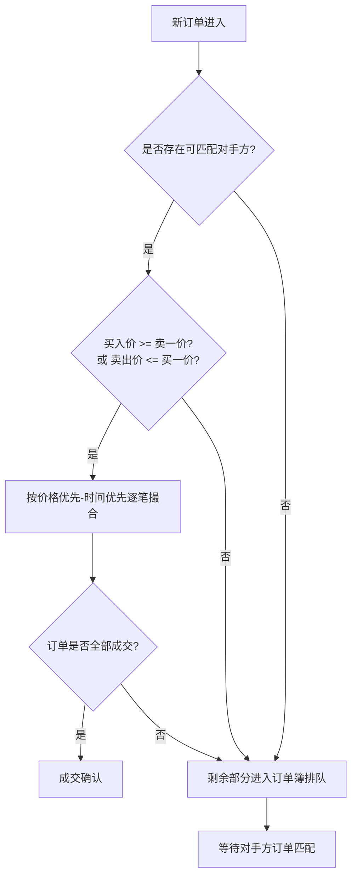
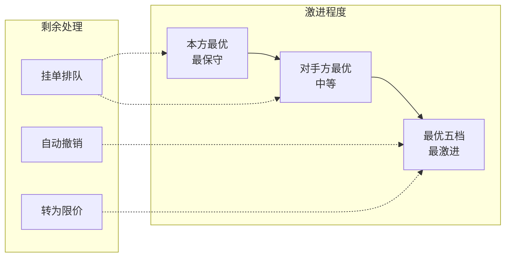
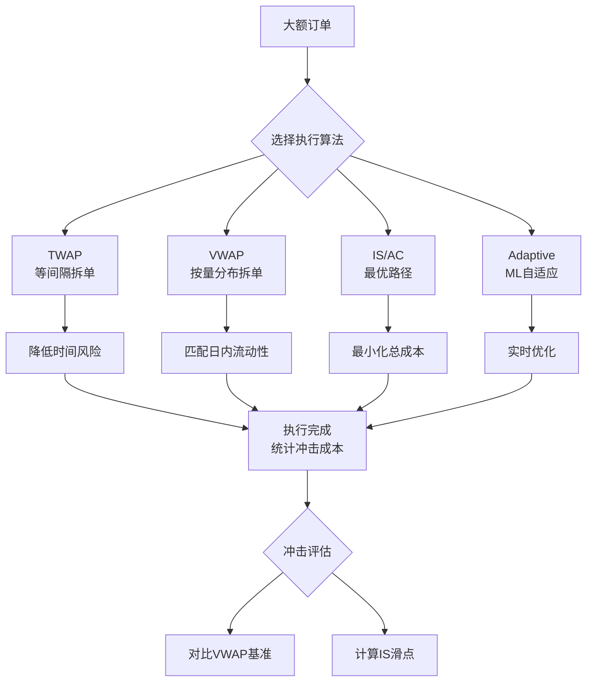
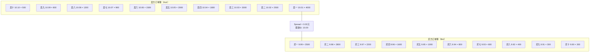
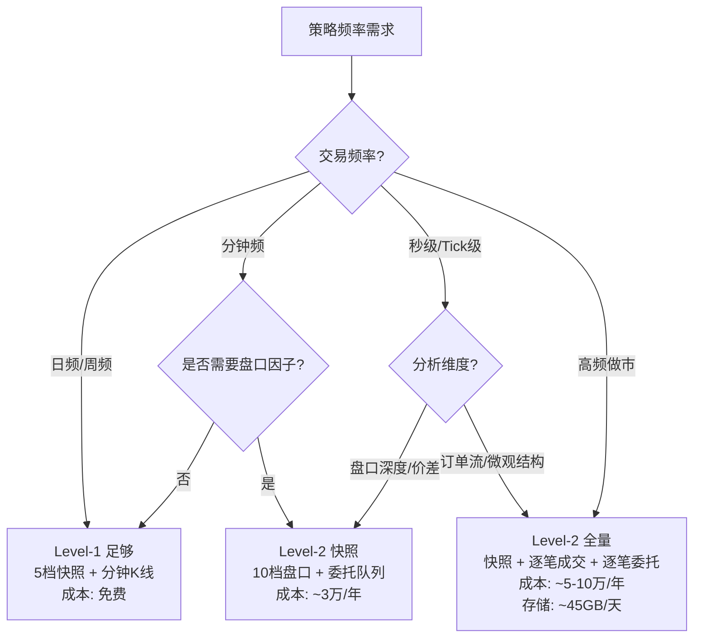

# A股市场微观结构深度研究

> [!abstract] 核心要点
> A股三大交易所（上交所/深交所/北交所）统一采用**价格优先-时间优先**撮合原则，通过集合竞价（9:15-9:25开盘、14:57-15:00收盘）和连续竞价（9:30-14:57）两种模式运行。行情数据分为 Level-1（5档盘口、3秒快照）和 Level-2（10档盘口+50笔委托队列+逐笔成交/委托，日增量30-45GB）两个层级。A股成交量呈现典型的**日内U型曲线**，开盘和收盘时段最活跃，午盘最低。市场冲击成本建模以 Almgren-Chriss 框架为主，实证显示订单量/ADV比超过5%时滑点易超1%。涨跌幅限制方面，主板±10%、创业板/科创板±20%、北交所±30%。

## 在知识体系中的位置

本笔记属于 **L1: 市场基础设施与数据工程** 层，是量化策略研发的底层基座。理解市场微观结构是构建高频因子（L2层）、设计交易执行算法（L3层）和实盘风控（L4层）的前提条件。

```
L1 市场基础设施 ← 本笔记
  ├── 撮合机制 → 影响订单路由策略
  ├── 订单簿结构 → 支撑高频因子计算（L2）
  ├── Tick数据 → 回测引擎数据源（L3）
  └── 冲击成本 → 执行算法与风控（L4）
```

## 关键知识点

### 撮合机制

#### 核心原则：价格优先-时间优先

三大交易所统一遵循相同的撮合优先级：

1. **价格优先**：买方出价高者优先成交，卖方出价低者优先成交
2. **时间优先**：同一价位下，先提交的订单优先撮合

#### 集合竞价

集合竞价通过汇集一段时间内所有有效申报，按**最大成交量原则**确定统一成交价。

| 阶段 | 时段 | 可否撤单 | 规则 |
|------|------|----------|------|
| 开盘集合竞价（申报） | 9:15 - 9:20 | 可以撤单 | 接受申报和撤单 |
| 开盘集合竞价（撮合） | 9:20 - 9:25 | **不可撤单** | 仅接受申报，不接受撤单 |
| 静默期 | 9:25 - 9:30 | 不接受任何操作 | 上交所接受申报但不处理；深交所/北交所不接受申报 |
| 收盘集合竞价 | 14:57 - 15:00 | **不可撤单** | 三所统一，确定收盘价 |

**最大成交量原则确定开盘/收盘价**：
- 选取使成交量最大的价格为成交价
- 高于该价格的买入申报和低于该价格的卖出申报全部成交
- 等于该价格的买方或卖方至少有一方全部成交

#### 连续竞价

连续竞价时段为 **9:30-11:30** 和 **13:00-14:57**，实时逐笔撮合。



#### 三大交易所涨跌幅对比

| 板块 | 交易所 | 涨跌幅限制 | 新股首日 | 特殊机制 |
|------|--------|------------|----------|----------|
| 主板 | 上交所/深交所 | ±10% | ±44%（首日） | ST股±5% |
| 科创板 | 上交所 | ±20% | 前5日无涨跌幅限制 | 盘后固定价格交易(15:05-15:30) |
| 创业板 | 深交所 | ±20% | 前5日无涨跌幅限制 | — |
| 北交所 | 北交所 | ±30% | 首日无涨跌幅限制 | 临时停牌：涨跌达±30%/±60%时停牌10分钟 |

#### 价格笼子机制（申报价格限制）

- **科创板/创业板**：连续竞价阶段，买入申报价格不得高于买入基准价格的102%，卖出申报价格不得低于卖出基准价格的98%（即±2%偏离限制）
- **北交所**：连续竞价阶段，申报价格偏离基准价格±5%或10个最小价格变动单位（取较大者）

---

### 订单簿结构

#### Level-1 vs Level-2 vs 逐笔数据全面对比

| 维度 | Level-1（基础行情） | Level-2（深度行情） | 逐笔数据 |
|------|---------------------|---------------------|-----------|
| **盘口深度** | 5档（买一~买五，卖一~卖五） | 10档（买一~买十，卖一~卖十） | N/A（非快照） |
| **委托队列** | 无 | 买一/卖一前50笔委托明细 | 全部逐笔委托 |
| **快照频率** | 3秒/次 | 3秒/次 | 实时逐笔 |
| **逐笔成交** | 无 | 有（含每笔成交价/量/方向） | 有 |
| **逐笔委托** | 无 | 深交所有/上交所有限 | 有 |
| **日数据量** | ~50MB/全市场 | 15-45GB/全市场 | 包含在L2内 |
| **费用** | 免费（券商终端） | 付费（约数万元/年） | 付费（L2包含） |
| **适用场景** | 日频/分钟频策略 | 高频因子、算法交易 | 订单流分析、微观结构研究 |

#### Level-2 快照数据字段详解

**基础行情字段：**

| 字段名 | 英文标识 | 说明 | 精度 |
|--------|----------|------|------|
| 证券代码 | SecurityID | 6位股票代码 | — |
| 行情时间 | DateTime/SendingTime | 快照时间戳 | 毫秒级 |
| 昨收价 | PreClosePx | 前一交易日收盘价 | 4位小数（×10000） |
| 开盘价 | OpenPx | 当日开盘价 | 4位小数 |
| 最高价 | HighPx | 当日最高成交价 | 4位小数 |
| 最低价 | LowPx | 当日最低成交价 | 4位小数 |
| 最新价 | LastPx | 最近一笔成交价 | 4位小数 |
| 成交量 | Volume/TotalVolumeTraded | 当日累计成交量 | 股 |
| 成交额 | Turnover/TotalValueTraded | 当日累计成交金额 | 元 |

**十档盘口字段：**

| 字段名 | 英文标识 | 说明 |
|--------|----------|------|
| 买一~买十价 | BidPrice1-10 | 买方前10档委托价格 |
| 买一~买十量 | BidVolume1-10 | 买方前10档委托数量 |
| 卖一~卖十价 | OfferPrice1-10 | 卖方前10档委托价格 |
| 卖一~卖十量 | OfferVolume1-10 | 卖方前10档委托数量 |
| 买方委托总量 | TotalBidQty | 买一至买十委托量之和 |
| 卖方委托总量 | TotalOfferQty | 卖一至卖十委托量之和 |
| 加权平均买价 | WeightedAvgBidPx | $\sum(BidPrice_i \times BidVolume_i) / TotalBidQty$ |
| 加权平均卖价 | WeightedAvgOfferPx | $\sum(OfferPrice_i \times OfferVolume_i) / TotalOfferQty$ |
| 委托笔数（买） | BidNumOrders1-10 | 各档位委托笔数 |
| 委托笔数（卖） | OfferNumOrders1-10 | 各档位委托笔数 |

**委托队列字段（买一/卖一前50笔）：**

| 字段名 | 说明 |
|--------|------|
| BidOrders[50] | 买一档前50笔委托的逐笔委托量 |
| OfferOrders[50] | 卖一档前50笔委托的逐笔委托量 |

**基金专属字段：**
- IOPV（Indicative Optimized Portfolio Value）：ETF/LOF基金的实时参考净值

#### 上交所 vs 深交所 Level-2 关键差异

| 差异项 | 上交所（SSE） | 深交所（SZSE） |
|--------|---------------|----------------|
| 逐笔委托发布 | **部分发布**：一笔订单若一次性全部撮合成交，不发布该委托信息；仅发布部分成交后的剩余委托 | **全量发布**：所有逐笔委托实时推送 |
| 逐笔成交推送 | 3秒批量推送 | 实时逐笔推送（毫秒级） |
| 逐笔委托类型标记 | "A"=委托单，"D"=主动撤单，"T"=成交单 | exec_type: '4'=撤单，'F'=成交 |
| 市价单价格 | 按实际成交价记录 | 逐笔委托表中价格标记为0，需从逐笔成交记录查找实际成交价 |
| 数据协议 | FAST/Binary协议 | Binary/STEP协议 |

---

### 订单类型

#### 限价申报（Limit Order）

三大交易所通用的基本订单类型。投资者指定价格和数量，只有市场价格等于或优于指定价格时才成交。未成交部分挂在订单簿中等待匹配。

- **申报价格范围**：涨跌停板范围内（如主板±10%）
- **最小价格变动单位**：0.01元
- **最小申报数量**：100股（1手），递增单位1股（北交所）或100股（主板）
- **最大申报数量**：100万股（单笔）

#### 市价申报（Market Order）

仅限**连续竞价阶段**（9:30-11:30、13:00-14:57）使用，集合竞价阶段不接受市价申报。

**深交所五种市价申报类型：**

| 类型 | 价格基准 | 成交范围 | 剩余处理 | 适用场景 |
|------|----------|----------|----------|----------|
| **对手方最优价格申报** | 对手方最优一档价（买入取卖一价） | 以对手方一档价作为限价申报 | 未成交部分以该价格挂单排队 | 控价大单，价格确定性高 |
| **本方最优价格申报** | 本方最优一档价（买入取买一价） | 以本方一档价作为限价申报 | 未成交部分以该价格挂单排队 | 跟随市场，最保守 |
| **最优五档即时成交剩余撤销** | 对手方最优5档 | 依次吃掉对手方5档队列 | 未成交部分**自动撤销** | 小单快速执行 |
| **最优五档即时成交剩余转限价** | 对手方最优5档 | 依次吃掉对手方5档队列 | 未成交部分**转为限价单**（以最后成交价挂单） | 兼顾速度与成交率 |
| **全额成交或撤销（FOK）** | 对手方最优价格 | 全部数量一次性成交 | 无法全额成交则**全部撤销** | 确保全额执行或不执行 |

**市价申报激进度排序：**
$$\text{最优五档(撤销/转限价)} > \text{对手方最优} > \text{本方最优}$$



**上交所市价申报：**
- 上交所主板以限价申报为主，市价申报类型相对有限
- 科创板支持保护限价申报（在限价基础上增加2%偏离保护）
- 无"本方最优"等深交所特有类型

**北交所市价申报：**
- 支持限价单和市价单
- 市价单仅限连续竞价阶段
- 设有价格笼子（基准价±5%或10个tick）限制极端偏离

---

### Tick数据结构

#### 3秒快照 vs 逐笔成交

| 维度 | 3秒快照（Snapshot） | 逐笔成交（Tick-by-Tick Trade） | 逐笔委托（Tick-by-Tick Order） |
|------|---------------------|-------------------------------|-------------------------------|
| **更新频率** | 固定3秒间隔 | 实时（毫秒级） | 实时（毫秒级，深交所）/3秒（上交所） |
| **数据内容** | 最新价+十档盘口+聚合统计 | 单笔成交价/量/时间/方向 | 单笔委托价/量/时间/类型 |
| **日数据量** | 约4800条/股/天 | 数万~数十万条/股/天 | 更多（含撤单） |
| **全市场日增** | ~200MB | ~15GB | ~30GB |
| **时间戳精度** | 毫秒（HHMMSSmmm） | 毫秒 | 毫秒 |
| **用途** | 分钟频策略、盘口因子 | 订单流分析、高频信号 | 订单簿重建、隐性流动性 |

#### 逐笔成交数据字段

| 字段 | 类型 | 说明 |
|------|------|------|
| SecurityID | string | 证券代码 |
| TradeTime | timestamp | 成交时间（毫秒级） |
| TradePrice | float | 成交价格 |
| TradeVolume | int | 成交数量（股） |
| TradeMoney | float | 成交金额（元） |
| BuyOrderNo | int | 买方委托号 |
| SellOrderNo | int | 卖方委托号 |
| ExecType | char | 成交类型（深交所：'F'=成交，'4'=撤单） |
| TradeBSFlag | char | 内外盘标志（'B'=主动买/外盘，'S'=主动卖/内盘） |
| TradeIndex/SeqNo | int | 成交编号（递增序列） |

#### 逐笔委托数据字段

| 字段 | 类型 | 说明 |
|------|------|------|
| SecurityID | string | 证券代码 |
| OrderTime | timestamp | 委托时间 |
| OrderPrice | float | 委托价格（市价单为0） |
| OrderVolume | int | 委托数量 |
| EntrustNo | int | 委托号 |
| EntrustType | char | 委托类型（上交所：'A'=委托，'D'=撤单） |
| Side | char | 方向（'B'=买，'S'=卖） |
| OrderType | char | 订单类型（'1'=市价，'2'=限价，'U'=本方最优） |

#### 数据量估算（全市场/交易日）

| 数据类型 | 条数（约） | 存储量（约） |
|----------|-----------|-------------|
| Level-1 快照 | ~1920万条（4000股×4800条） | ~200MB |
| Level-2 快照 | ~2400万条（5000股×4800条） | ~2GB |
| 逐笔成交 | ~2-5亿条 | ~15GB |
| 逐笔委托 | ~5-10亿条 | ~30GB |
| **L2合计** | — | **~45GB/天** |

---

### 流动性分布特征

#### 日内U型曲线

A股市场成交量和流动性呈现典型的**日内U型**（或W型）分布：

```
成交量
  |
  |##                                           ##
  |####                                       ####
  |######                                   ######
  |########                               ########
  |##########                           ##########
  |############     ###########       ############
  |##############################################
  |----------------------------------------------→ 时间
  9:30  10:00  10:30  11:00  11:30/13:00  14:00  14:57
       开盘高峰    逐渐衰减    午盘最低    缓慢回升   收盘高峰
```

**分时段特征：**

| 时段 | 成交量占比 | 特征 | 原因 |
|------|-----------|------|------|
| 9:30-10:00 | ~15-20% | **日内最高峰** | 隔夜信息释放，机构集中建仓 |
| 10:00-10:30 | ~10-12% | 快速衰减 | 信息消化完毕 |
| 10:30-11:30 | ~12-15% | 低位平稳 | 日内低谷第一阶段 |
| 13:00-14:00 | ~10-12% | **日内最低谷** | 午后开盘信息匮乏 |
| 14:00-14:57 | ~15-18% | 逐步回升 | 临近收盘，机构调仓 |
| 14:57-15:00 | ~8-10% | **收盘脉冲** | 收盘集合竞价，指数基金/ETF跟踪 |

#### 流动性度量指标

| 指标 | 公式/定义 | 日内特征 |
|------|----------|----------|
| **Amihud非流动性比率** | $ILLIQ = \frac{\|r_t\|}{Volume_t}$ | 开盘/收盘低（流动性好），午盘高 |
| **买卖价差** | $Spread = Ask_1 - Bid_1$ | 开盘较宽，盘中收窄，收盘再宽 |
| **订单簿深度** | $Depth = \sum_{i=1}^{N} (BidVol_i + OfferVol_i)$ | 随成交量U型分布 |
| **换手率** | $Turnover = \frac{Volume}{FloatShares}$ | 日内累计，斜率呈U型 |
| **Kyle Lambda** | 价格冲击系数 $\lambda = \frac{\Delta P}{\Delta Q}$ | 午盘最大（冲击最大） |

#### 影响因素

- **T+1交收制度**：当日买入不可卖出，放大日内波动风险，尤其午盘降低流动性
- **集合竞价机制**：开盘/收盘集合竞价天然汇聚流动性
- **信息不对称**：开盘时隔夜信息集中释放，知情交易者活跃
- **机构交易行为**：基金/保险等机构倾向开盘建仓、收盘调仓

---

### 市场冲击成本建模

#### 冲击成本分类

| 类型 | 定义 | 占比 | 持续时间 |
|------|------|------|----------|
| **永久性冲击** | 交易改变市场对证券内在价值的预期 | ~5% | 永久 |
| **临时性冲击** | 流动性需求导致的短暂价格偏离 | ~95% | 数分钟~数十分钟后回归 |

#### Almgren-Chriss 模型

Almgren-Chriss（2000）是最经典的最优执行框架，通过均值-方差优化平衡**冲击成本**和**时间风险**。

**模型设定：**
- 初始持仓 $X$ 股，需在 $T$ 时间内清仓
- 价格过程：$S_t = S_0 + \sigma W_t - g(v_t) - h(v_t)$
  - $g(v_t)$：永久性冲击函数
  - $h(v_t)$：临时性冲击函数
  - $v_t = \frac{dx}{dt}$：交易速率

**最优执行路径（线性冲击假设）：**

$$x(t) = X \cdot \frac{\sinh\left(\kappa(T - t)\right)}{\sinh(\kappa T)}$$

其中：
- $\kappa = \sqrt{\frac{\lambda \sigma^2}{2\eta}}$
- $\lambda$：风险厌恶系数
- $\sigma$：价格波动率
- $\eta$：临时性冲击参数

**冲击成本估算公式（简化）：**

$$Cost \approx \frac{\sigma^2 \cdot \eta}{2V} \cdot \frac{Q^3}{T^2}$$

其中 $Q$ = 订单总量，$V$ = 日均成交量，$T$ = 执行天数。

#### 平方根冲击模型（Square-Root Model）

实证中更常用的简化模型：

$$Impact = \alpha \cdot \sigma \cdot \sqrt{\frac{Q}{V}}$$

其中：
- $\alpha$：冲击系数（A股实证约0.5-1.5）
- $\sigma$：日波动率
- $Q/V$：参与率（订单量/日均成交量）

**A股实证参考值：**

| 参与率 (Q/V) | 预期冲击（bps） | 风险等级 |
|--------------|----------------|----------|
| 1% | 5-15 bps | 低 |
| 5% | 25-50 bps | 中 |
| 10% | 50-100 bps | 高 |
| 20% | 100-200+ bps | 极高 |

#### 执行算法与冲击优化

| 算法 | 原理 | 优点 | 缺点 |
|------|------|------|------|
| **TWAP** | 等时间间隔均匀拆单 | 简单，降低时间风险 | 不考虑流动性分布 |
| **VWAP** | 按历史成交量分布拆单 | 适配流动性U型曲线 | 对异常行情适应差 |
| **IS（Implementation Shortfall）** | Almgren-Chriss最优路径 | 理论最优 | 参数估计难 |
| **Adaptive/ML** | 机器学习实时调整 | 自适应市场状态 | 模型复杂，过拟合风险 |



---

## 参数速查表

| 参数项 | 标准值/范围 | 约束类型 | 备注 |
|--------|------------|----------|------|
| Level-1 快照频率 | 3秒 | 固定 | 全市场统一 |
| Level-2 快照频率 | 3秒 | 固定 | 含10档盘口 |
| Level-2 盘口深度 | 10档 | 固定 | + 买一/卖一前50笔队列 |
| Level-1 盘口深度 | 5档 | 固定 | 免费 |
| 逐笔成交推送 | 实时/3秒 | 深交所实时，上交所3秒批量 | 毫秒级时间戳 |
| 最小价格变动 | 0.01元 | 固定 | 全市场统一 |
| 最小申报数量 | 100股（主板）/1股递增（北交所） | 交易所规则 | 不足100股须一次性卖出 |
| 单笔最大申报 | 100万股 | 固定 | 三所统一 |
| 主板涨跌幅 | ±10% | 交易所规则 | ST股±5% |
| 科创板/创业板涨跌幅 | ±20% | 交易所规则 | 前5日无限制 |
| 北交所涨跌幅 | ±30% | 交易所规则 | 首日无限制 |
| 集合竞价（开盘） | 9:15-9:25 | 固定 | 9:20后不可撤单 |
| 集合竞价（收盘） | 14:57-15:00 | 固定 | 不可撤单 |
| 连续竞价 | 9:30-11:30, 13:00-14:57 | 固定 | 主要交易时段 |
| L2全市场日数据量 | 30-45GB | 经验值 | 含快照+逐笔 |
| 冲击成本（参与率5%） | 25-50 bps | 经验值 | 视流动性和波动率 |
| Amihud非流动性 | $\|r\|/Volume$ | 计算公式 | 值越大流动性越差 |
| 大宗交易门槛（北交所） | 10万股或100万元 | 交易所规则 | 15:00-15:30确认 |

---

## 示意图

### 订单簿结构示意



### A股交易时段流程

```mermaid
gantt
    title A股交易日时间线
    dateFormat HH:mm
    axisFormat %H:%M

    section 集合竞价
    开盘集合竞价(可撤单)   :a1, 09:15, 5min
    开盘集合竞价(不可撤单) :a2, 09:20, 5min
    静默期               :a3, 09:25, 5min

    section 连续竞价
    上午连续竞价           :b1, 09:30, 120min
    午间休市               :b2, 11:30, 90min
    下午连续竞价           :b3, 13:00, 117min

    section 收盘
    收盘集合竞价(不可撤单)  :c1, 14:57, 3min
```



---

## 规则与约束

1. **T+1交收**：当日买入的股票，需到下一交易日才能卖出。期间承担隔夜风险
2. **涨跌停板制度**：触及涨跌停后仍可委托，但可能无法成交（涨停无卖单/跌停无买单）
3. **市价单限制**：仅限连续竞价阶段使用，集合竞价阶段自动拒绝市价申报
4. **申报价格限制**：不得超出涨跌停价格范围。科创板/北交所有额外的价格笼子
5. **最小变动价位**：A股统一为0.01元/股
6. **大宗交易**：单笔达到一定规模（上交所/深交所50万股或300万元；北交所10万股或100万元）可通过大宗交易系统成交，不影响连续竞价
7. **盘后固定价格交易**：科创板特有，15:05-15:30以收盘价成交

---

## 常见误区

| 误区 | 正确理解 |
|------|----------|
| "Level-2数据是实时逐笔的" | Level-2**快照**仍是3秒频率，逐笔数据是L2的附加组件。深交所逐笔实时推送，上交所逐笔也是3秒批量 |
| "上交所和深交所数据完全一致" | 两所在逐笔委托发布规则、成交类型编码、市价单价格记录等方面存在显著差异 |
| "市价单保证成交" | 市价单可能因涨跌停、流动性不足等原因无法全部成交。最优五档剩余撤销类型更可能部分成交 |
| "U型曲线每天都一样" | U型是统计平均形态，个股/事件日（财报、除权）可能大幅偏离。利好消息可使上午峰值极端放大 |
| "冲击成本是固定的" | 冲击成本随参与率、波动率、流动性、时段动态变化。午盘低流动性时段冲击显著高于开盘 |
| "3秒快照能还原完整订单簿" | 3秒间隔内可能发生数百笔委托和成交，快照只是采样。完整还原需要逐笔委托+逐笔成交数据 |
| "北交所规则与沪深完全相同" | 北交所涨跌幅±30%、最小申报1股递增、做市商制度、临时停牌机制等均不同于沪深主板 |

---

## 选型决策指南

### 行情数据选型



### 执行算法选型

| 场景 | 推荐算法 | 理由 |
|------|----------|------|
| 小单（参与率 < 1%） | 直接市价/限价 | 冲击可忽略 |
| 中单（参与率 1-5%） | VWAP | 匹配流动性分布，降低信息泄露 |
| 大单（参与率 5-15%） | IS（Almgren-Chriss） | 最优化总执行成本 |
| 超大单（参与率 > 15%） | 多日拆分 + IS | 单日冲击过大，需跨日执行 |
| 紧急清仓 | TWAP（短周期） | 快速出清，接受较高冲击 |

---

## 与其他主题的关联

- **数据工程**：Tick数据的存储方案（列式存储如DolphinDB/ClickHouse）直接影响回测速度
- **高频因子**：订单簿不平衡（OBI）、成交主动性（VPIN）等因子依赖Level-2数据
- **算法交易**：冲击成本模型是执行算法的核心输入参数
- **风控体系**：流动性风险监控需要实时盘口深度数据
- **回测框架**：回测引擎的Tick回放精度取决于数据粒度（快照 vs 逐笔）

---

## 相关主题

- [[A股交易制度全解析]]
- [[A股量化数据源全景图]]
- [[高频因子库：订单簿与订单流]]
- [[交易成本建模与执行优化]]
- [[Level-2数据清洗与存储方案]]
- [[A股流动性风险管理]]
- [[回测引擎设计：Tick级回放]]
- [[交易成本建模与执行优化]]

---

## 来源参考

1. 上海证券交易所. 交易规则及技术接口规范. https://www.sse.com.cn
2. 深圳证券交易所. 交易规则（2024修订）. https://www.szse.cn
3. 北京证券交易所. 股票交易规则. https://www.bse.cn
4. 上交所信息服务. Level-2行情接口规范. https://www.sseinfo.com
5. Almgren, R. & Chriss, N. (2000). "Optimal Execution of Portfolio Transactions." Journal of Risk, 3(2), 5-39.
6. 华安证券. 高频视角下成交额蕴藏的Alpha：市场微观结构剖析. 2020.
7. 深圳证券交易所研究所. A股市场流动性研究. 2020.
8. DolphinDB. Level-2行情数据处理教程. https://docs.dolphindb.cn
9. 方正证券数据立方. Level-1/Level-2行情数据文档. https://datacube.foundersc.com
10. Alpha Quanter. Level-2逐笔数据解析. https://alpha-quanter.com
11. 华创证券. AI驱动的市场冲击成本预测模型. 2024.
12. 腾讯云开发者社区. A股Level-2行情数据字段详解. 2024.
