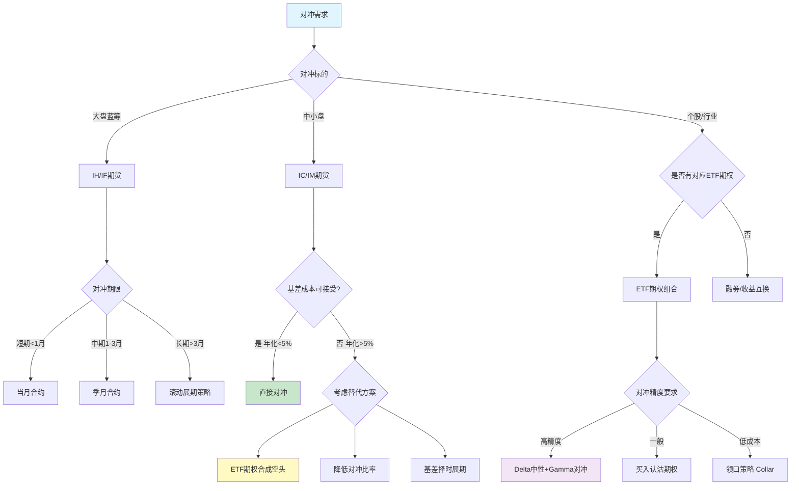
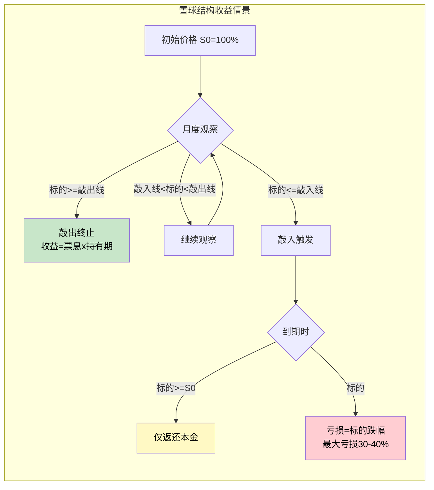

# A股衍生品市场与对冲工具

## 核心要点

> [!summary]
> - A股衍生品体系涵盖**场内**（股指期货、股指期权、ETF期权）与**场外**（雪球、凤凰结构）两大类，外加兼具股债属性的**可转债**
> - 股指期货是量化对冲的核心工具，IF/IH/IC/IM四个品种覆盖大盘到中小盘，但**基差成本**（尤其IC/IM长期贴水）是中性策略的最大隐性成本
> - ETF期权提供非线性对冲能力，50ETF期权流动性最佳，希腊字母管理是期权交易的核心技能
> - 场外衍生品（雪球/凤凰）本质是**卖出看跌期权**，投资者以承担尾部风险换取高票息
> - 可转债兼具债底保护与转股期权价值，转股溢价率、强赎条款、下修条款是量化建模的三大核心变量

## 一、股指期货合约规格

### 1.1 四大股指期货合约规格对比

中国金融期货交易所（CFFEX）上市四个股指期货品种：

| 参数 | IF（沪深300） | IH（上证50） | IC（中证500） | IM（中证1000） |
|------|:---:|:---:|:---:|:---:|
| **标的指数** | 沪深300 | 上证50 | 中证500 | 中证1000 |
| **上市日期** | 2010-04-16 | 2015-04-16 | 2015-04-16 | 2022-07-22 |
| **合约乘数** | **300元/点** | **300元/点** | **200元/点** | **200元/点** |
| **最小变动价位** | **0.2点** | **0.2点** | **0.2点** | **0.2点** |
| **最小变动金额** | 60元 | 60元 | 40元 | 40元 |
| **合约月份** | 当月、下月及随后两个季月 | 同左 | 同左 | 同左 |
| **交易时间** | 9:30-11:30, 13:00-15:00 | 同左 | 同左 | 同左 |
| **最后交易日** | 到期月第三个周五 | 同左 | 同左 | 同左 |
| **交割方式** | **现金交割** | **现金交割** | **现金交割** | **现金交割** |
| **交割结算价** | 最后交易日标的指数最后2小时算术平均价 | 同左 | 同左 | 同左 |
| **涨跌停板** | +/-10% | +/-10% | +/-10% | +/-10% |
| **交易所保证金** | **12%** | **12%** | **12%** | **14%** |
| **期货公司实际保证金** | 通常14%-18% | 通常14%-18% | 通常14%-18% | 通常16%-20% |

> [!note] 合约面值估算（2025年参考）
> - IF：3600点 x 300 = **108万元/手**，12%保证金约 **13万元**
> - IH：2700点 x 300 = **81万元/手**，12%保证金约 **9.7万元**
> - IC：5500点 x 200 = **110万元/手**，12%保证金约 **13.2万元**
> - IM：5800点 x 200 = **116万元/手**，14%保证金约 **16.2万元**

### 1.2 日内开仓限制（硬性规则）

中金所对投机性日内开仓交易实行严格限额：

| 规则 | 具体限制 | 生效日期 |
|------|---------|---------|
| **股指期货日内开仓** | 单个品种 **500手/日**（投机） | 2022-12-19起 |
| **股指期权日内开仓** | 单个品种 **200手/日** | 2022-12-19起 |
| **股指期权单月合约** | **100手/日** | 2022-12-19起 |
| **深度虚值期权** | **30手/日** | 2022-12-19起 |
| **套保交易** | 不受上述限制 | - |

> [!warning] 历史演变
> - 2015年股灾后，日内开仓限制一度收紧至 **10手/日**（2015-09-07）
> - 随后经历多次逐步放松，2022年12月调整至当前500手标准
> - 套期保值账户需向中金所申请额度，批准后不受投机限额约束

### 1.3 基差结构与展期成本

基差 = 期货价格 - 现货指数，**正基差（升水/Contango）** 或 **负基差（贴水/Backwardation）** 直接影响量化对冲策略的成本。

#### 2024-2025年基差格局

| 品种 | 基差状态 | 当季年化基差率（2024Q4） | 加权年化基差率（2025Q1） | 对冲含义 |
|------|---------|:---:|:---:|---------|
| **IH** | **升水** | +1.8% | +3.4% | 空头对冲获正收益 |
| **IF** | **升水** | +0.6% | +2.1% | 空头对冲获正收益 |
| **IC** | **贴水** | -2.1% | -3.0% | 空头对冲付出成本 |
| **IM** | **深度贴水** | -4.6% | -7.0% | 空头对冲成本高昂 |

> [!important] 基差对量化中性策略的影响
> - **贴水 = 对冲成本**：做多股票+做空期货的中性策略，若期货贴水，展期时需"低卖高买"，贴水即为策略的隐性成本
> - **IC/IM长期贴水原因**：大量量化中性策略集中在中小盘，空头套保需求远超多头投机需求
> - **展期成本**：每月或每季换合约时的基差差额，年化IC约3%、IM约6-7%
> - **2025年展望**：IC/IM贴水预计小于2024年但大于2023年，对冲成本仍是中性策略的核心约束

#### 展期策略

```
展期成本 = (远月合约价格 - 近月合约价格) / 近月合约价格 x (365 / 展期间隔天数)
```

常见展期策略：
1. **固定展期**：到期前N天（通常5-10天）统一展期，简单但可能错过有利时点
2. **基差择时展期**：监控基差水位，基差收窄时展期（减少成本），但增加执行复杂度
3. **跨期价差交易**：同时建立近月多头+远月空头，锁定展期成本

## 二、股指期权与ETF期权

### 2.1 股指期权（中金所）

#### 沪深300股指期权（IO）

| 参数 | 规格 |
|------|------|
| **标的** | 沪深300指数 |
| **合约乘数** | **100元/点** |
| **行权价间距** | 平值附近50点，远离平值逐步扩大至100/200点 |
| **合约月份** | 当月、下月及随后两个季月 |
| **行权方式** | **欧式**（仅到期日行权） |
| **交割方式** | **现金交割** |
| **最后交易日** | 到期月第三个周五 |
| **涨跌停板** | +/-10% |
| **交易时间** | 9:30-11:30, 13:00-15:00 |

### 2.2 ETF期权（上交所/深交所）

#### ETF期权合约规格对比

| 参数 | 50ETF期权 | 沪深300ETF期权（沪） | 沪深300ETF期权（深） | 中证500ETF期权 | 创业板ETF期权 |
|------|:---:|:---:|:---:|:---:|:---:|
| **交易所** | 上交所 | 上交所 | 深交所 | 上交所 | 深交所 |
| **标的** | 510050 | 510300 | 159919 | 510500 | 159915 |
| **合约单位** | **10000份** | **10000份** | **10000份** | **10000份** | **10000份** |
| **行权方式** | **欧式** | **欧式** | **欧式** | **欧式** | **欧式** |
| **交割方式** | **实物交割** | **实物交割** | **实物交割** | **实物交割** | **实物交割** |
| **到期日** | 到期月第四个周三 | 同左 | 同左 | 同左 | 同左 |
| **合约月份** | 当月、下月及随后两个季月 | 同左 | 同左 | 同左 | 同左 |

#### ETF期权行权价格间距规则（上交所/深交所统一）

| 标的前收盘价区间 | 行权价格间距 |
|:---:|:---:|
| <=3元 | **0.05元** |
| 3-5元（含） | **0.1元** |
| 5-10元（含） | **0.25元** |
| 10-20元（含） | 0.5元 |
| 20-50元（含） | 1元 |
| 50-100元（含） | 2.5元 |
| >100元 | 5元 |

> [!tip] 实务提示
> - 50ETF当前价格约2.5-3.5元区间，行权价间距为0.05-0.1元
> - 初始上市时每个到期月挂出9个行权价（1个平值+4个实值+4个虚值）
> - 存续期间如实值/虚值合约不足时，交易所会加挂新行权价

### 2.3 50ETF期权希腊字母（Greeks）计算

基于Black-Scholes-Merton模型，定义：

$$d_1 = \frac{\ln(S/K) + (r - q + \sigma^2/2)\tau}{\sigma\sqrt{\tau}}, \quad d_2 = d_1 - \sigma\sqrt{\tau}$$

其中 S=标的价格，K=行权价，r=无风险利率，q=分红率，$\sigma$=波动率，$\tau$=到期时间（年）

| 希腊字母 | 看涨期权公式 | 看跌期权公式 | 物理含义 |
|----------|------------|------------|---------|
| **Delta** ($\Delta$) | $N(d_1)$ | $N(d_1)-1$ | S变动1元，期权价变动量（看涨0~1，看跌-1~0） |
| **Gamma** ($\Gamma$) | $\frac{n(d_1)}{S\sigma\sqrt{\tau}}$ | 同看涨 | Delta的变化率（凸性），平值最大 |
| **Theta** ($\Theta$) | $-\frac{S\cdot n(d_1)\sigma}{2\sqrt{\tau}} - rKe^{-r\tau}N(d_2)$ | $-\frac{S\cdot n(d_1)\sigma}{2\sqrt{\tau}} + rKe^{-r\tau}N(-d_2)$ | 每日时间衰减（通常为负） |
| **Vega** ($\nu$) | $S\sqrt{\tau}\cdot n(d_1)$ | 同看涨 | 波动率变动1%的价格变动 |
| **Rho** ($\rho$) | $K\tau e^{-r\tau}N(d_2)$ | $-K\tau e^{-r\tau}N(-d_2)$ | 利率变动1%的价格变动 |

> 其中 $N(\cdot)$ 为标准正态CDF，$n(\cdot)$ 为标准正态PDF

#### 隐含波动率（IV）求解

隐含波动率是使BSM模型理论价格等于市场价格的波动率参数，需数值方法反解：

$$C_{market} = BSM(S, K, \tau, r, q, \sigma_{IV})$$

常用方法：**Newton-Raphson迭代**（利用Vega作为导数，收敛快）或**二分法**（稳健但较慢）。

## 三、场外衍生品结构

### 3.1 雪球结构（Snowball / Autocallable）

雪球结构本质：投资者向券商**卖出带障碍条款的看跌期权**，以承担标的下跌风险换取高额票息。

#### 核心参数

| 参数 | 典型值 | 说明 |
|------|--------|------|
| **标的** | 中证500/中证1000指数 | 挂钩股指期货 |
| **名义本金** | 100万起 | 机构客户为主 |
| **存续期** | 12-24个月 | 按月观察 |
| **票息（年化）** | 15%-25% | 随波动率和贴水水平变动 |
| **敲出水平** | 100%-103%初始价 | 触发提前终止 |
| **敲入水平** | 70%-80%初始价 | 触发看跌期权生效 |
| **观察频率** | 月度（敲出）/ 每日（敲入） | 敲出为月末观察 |

#### 四种情景

```
情景1: 敲出（最常见，概率约70%+）
  → 提前终止，获得 票息 x 持有月数/12 + 本金

情景2: 未敲入未敲出（概率约15%）
  → 到期获得 票息 + 本金

情景3: 敲入后再敲出（概率约5%）
  → 敲出时获得 票息 x 持有月数/12 + 本金

情景4: 敲入且未敲出（概率约10%，最大风险）
  → 到期亏损 = (期末价/初始价 - 1) x 本金
  → 最大亏损可达 30%-40%
```

### 3.2 凤凰结构（Phoenix）

凤凰结构与雪球的核心区别在于**票息支付机制**：

| 特征 | 雪球结构 | 凤凰结构 |
|------|---------|---------|
| **票息触发** | 仅敲出时一次性支付 | 每个观察日标的价>票息障碍即支付 |
| **票息频率** | 一次性（年化） | 按月/按季（可累积） |
| **敲入后票息** | 无 | 仍可在价格恢复后获得票息 |
| **适用市场** | 低波震荡、温和上涨 | 震荡市（稳定票息流） |
| **风险特征** | 尾部集中亏损 | 票息更平滑，但单次票息较低 |

### 3.3 场外衍生品定价方法

**蒙特卡洛模拟（Monte Carlo Simulation）** 是雪球/凤凰结构的主流定价方法：

1. 基于GBM（几何布朗运动）模拟 $N$ 条标的价格路径
2. 在每条路径上检查敲入/敲出条件
3. 计算每条路径的现金流并折现
4. 取所有路径的均值作为产品理论价格

## 四、可转债量化建模

### 4.1 核心指标

| 指标 | 公式 | 含义 |
|------|------|------|
| **转股价值**（平价） | 面值 / 转股价 x 正股价 | 立即转股可获得的价值 |
| **转股溢价率** | (转债价格 / 转股价值 - 1) x 100% | 转债相对转股价值的溢价，越低股性越强 |
| **纯债价值** | $\sum_{t} \frac{C_t}{(1+r)^t}$ | 不考虑转股的债券价值（债底） |
| **纯债溢价率** | (转债价格 / 纯债价值 - 1) x 100% | 转债相对债底的溢价，越低债性越强 |
| **到期收益率（YTM）** | 使现金流现值=转债价格的折现率 | 持有到期的年化收益 |

### 4.2 关键条款量化建模

#### 强赎条款（Forced Redemption / Call Provision）

触发条件（典型）：连续30个交易日中有15日正股收盘价 >= 转股价的130%

```
强赎概率建模：
P(强赎) = P(正股连续30日中>=15日超过1.3*转股价)
         = 路径依赖概率，需蒙特卡洛模拟或条件概率递推
```

- **效果**：一旦触发强赎，转债价格收敛于 max(转股价值, 赎回价)
- **建模影响**：强赎条款压制转债价格上限，使高平价转债的看涨期权变为"有上限看涨"（Capped Call）

#### 下修条款（Conversion Price Reset）

触发条件（典型）：连续20-30个交易日中有10-15日正股收盘价 < 转股价的80%-85%

```
下修后影响：
新转股价值 = 面值 / 新转股价 x 正股价
           > 旧转股价值（因新转股价更低）
→ 转债价值提升，转股溢价率下降
```

- **建模方法**：需在每个时间节点判断是否满足下修条件，属于路径依赖+博弈问题
- **CCB拆解法**：将未来平价路径按下修/不下修拆分，分别计算期望权益与债券现金流

#### 回售条款（Put Provision）

触发条件（典型）：连续30个交易日正股收盘价低于转股价的70%

- 持有人有权以面值+应计利息回售给发行人
- 提供了额外的"债底保护"

### 4.3 定价方法对比

| 方法 | 原理 | 优点 | 缺点 | 定价偏离度 |
|------|------|------|------|:---:|
| **债券+BSM期权** | 拆分为纯债+欧式看涨 | 封闭解，计算快 | 忽略条款路径依赖，系统性高估 | 中位数 -4.7% |
| **二叉树模型** | 离散化正股路径，逐节点处理条款 | 可处理复杂条款 | 计算量大，树步长敏感 | 中位数 -2.5% |
| **LSM蒙特卡洛** | 最小二乘MC，倒向演绎 | 灵活处理美式期权特征 | 收敛慢，需大量路径 | 中位数 -2.0% |
| **CCB完全拆解法** | 解析解拆解各条款 | 效率高，偏离度小 | 模型假设较强 | **中位数 1.3%** |

## 五、参数速查表

### 股指期货参数速查

| 参数 | IF | IH | IC | IM |
|------|:---:|:---:|:---:|:---:|
| 合约乘数 | 300元/点 | 300元/点 | 200元/点 | 200元/点 |
| 最小变动 | 0.2点(60元) | 0.2点(60元) | 0.2点(40元) | 0.2点(40元) |
| 交易所保证金 | 12% | 12% | 12% | 14% |
| 日内投机限仓 | 500手 | 500手 | 500手 | 500手 |
| 手续费(开仓) | 万分之0.23 | 万分之0.23 | 万分之0.23 | 万分之0.23 |
| 手续费(平今) | 万分之3.45 | 万分之3.45 | 万分之3.45 | 万分之3.45 |
| 交割手续费 | 万分之1 | 万分之1 | 万分之1 | 万分之1 |

### ETF期权参数速查

| 参数 | 50ETF期权 | 300ETF期权 | 500ETF期权 | 创业板ETF期权 |
|------|:---:|:---:|:---:|:---:|
| 合约单位 | 10000份 | 10000份 | 10000份 | 10000份 |
| 行权方式 | 欧式 | 欧式 | 欧式 | 欧式 |
| 交割方式 | 实物 | 实物 | 实物 | 实物 |
| 到期日 | 第四个周三 | 第四个周三 | 第四个周三 | 第四个周三 |
| 手续费 | 约1.5-3元/张 | 同左 | 同左 | 同左 |
| 行权费 | 约2元/张 | 同左 | 同左 | 同左 |

## 六、对冲工具选型决策树



## 七、雪球结构收益图



## 八、Python代码实现

### 8.1 基差监控与展期成本计算

```python
"""
股指期货基差监控与展期成本计算
依赖: akshare, pandas, matplotlib
"""
import akshare as ak
import pandas as pd
import numpy as np
from datetime import datetime, timedelta


def get_basis_data(symbol: str = "IF") -> pd.DataFrame:
    """
    获取股指期货基差数据
    symbol: IF / IH / IC / IM
    """
    # 获取期货主力合约行情
    futures_df = ak.futures_main_sina(symbol=f"{symbol}0")  # 主力合约

    # 获取标的指数（映射关系）
    index_map = {
        "IF": "sh000300",  # 沪深300
        "IH": "sh000016",  # 上证50
        "IC": "sh000905",  # 中证500
        "IM": "sh000852",  # 中证1000
    }
    index_df = ak.stock_zh_index_daily(symbol=index_map[symbol])

    return futures_df, index_df


def calc_annualized_basis(
    futures_price: float,
    spot_price: float,
    days_to_expiry: int,
) -> dict:
    """
    计算年化基差率

    Returns:
        dict: 包含基差、基差率、年化基差率
    """
    basis = futures_price - spot_price
    basis_rate = basis / spot_price
    annualized_basis = basis_rate * (365 / max(days_to_expiry, 1))

    return {
        "basis": round(basis, 2),
        "basis_rate": round(basis_rate * 100, 4),       # 百分比
        "annualized_basis": round(annualized_basis * 100, 4),  # 年化百分比
        "days_to_expiry": days_to_expiry,
    }


def calc_rollover_cost(
    near_price: float,
    far_price: float,
    near_spot: float,
    days_between: int = 30,
) -> dict:
    """
    计算展期成本

    Args:
        near_price: 近月合约价格
        far_price: 远月合约价格
        near_spot: 现货价格
        days_between: 两个合约到期日间隔天数
    """
    # 展期价差
    spread = far_price - near_price
    # 展期成本率
    rollover_rate = spread / near_spot
    # 年化展期成本
    annualized_rollover = rollover_rate * (365 / days_between)

    return {
        "spread": round(spread, 2),
        "rollover_rate": round(rollover_rate * 100, 4),
        "annualized_rollover": round(annualized_rollover * 100, 4),
    }


def basis_monitor_dashboard(symbols: list = None):
    """
    基差监控面板：输出四大品种的基差概览
    """
    if symbols is None:
        symbols = ["IF", "IH", "IC", "IM"]

    results = []
    for sym in symbols:
        try:
            # 示例：使用模拟数据结构
            # 实盘中应替换为实时行情接口
            info = {
                "symbol": sym,
                "futures_price": None,  # 从行情接口获取
                "spot_price": None,
                "basis": None,
                "annualized_basis": None,
            }
            results.append(info)
        except Exception as e:
            print(f"[WARN] {sym} 数据获取失败: {e}")

    return pd.DataFrame(results)


# 使用示例
if __name__ == "__main__":
    # 示例计算
    result = calc_annualized_basis(
        futures_price=3580.0,   # IF主力合约
        spot_price=3600.0,       # 沪深300指数
        days_to_expiry=25,
    )
    print(f"IF基差: {result['basis']}点, 年化基差率: {result['annualized_basis']}%")

    rollover = calc_rollover_cost(
        near_price=3580.0,
        far_price=3570.0,
        near_spot=3600.0,
        days_between=30,
    )
    print(f"展期价差: {rollover['spread']}点, 年化展期成本: {rollover['annualized_rollover']}%")
```

### 8.2 BSM期权定价与希腊字母计算

```python
"""
Black-Scholes-Merton 期权定价模型
适用于欧式期权（50ETF期权、沪深300ETF期权等）
"""
import numpy as np
from scipy.stats import norm
from scipy.optimize import brentq
from typing import Literal


class BSMOption:
    """BSM期权定价与希腊字母计算"""

    def __init__(
        self,
        S: float,          # 标的资产价格
        K: float,          # 行权价格
        T: float,          # 到期时间（年化）
        r: float,          # 无风险利率
        sigma: float,      # 波动率
        q: float = 0.0,    # 连续分红率
        option_type: Literal["call", "put"] = "call",
    ):
        self.S = S
        self.K = K
        self.T = T
        self.r = r
        self.sigma = sigma
        self.q = q
        self.option_type = option_type

        # 预计算 d1, d2
        self.d1 = (
            (np.log(S / K) + (r - q + 0.5 * sigma**2) * T)
            / (sigma * np.sqrt(T))
        )
        self.d2 = self.d1 - sigma * np.sqrt(T)

    def price(self) -> float:
        """BSM理论价格"""
        S, K, T, r, q = self.S, self.K, self.T, self.r, self.q
        d1, d2 = self.d1, self.d2

        if self.option_type == "call":
            return (
                S * np.exp(-q * T) * norm.cdf(d1)
                - K * np.exp(-r * T) * norm.cdf(d2)
            )
        else:
            return (
                K * np.exp(-r * T) * norm.cdf(-d2)
                - S * np.exp(-q * T) * norm.cdf(-d1)
            )

    def delta(self) -> float:
        """Delta: 标的价格敏感度"""
        if self.option_type == "call":
            return np.exp(-self.q * self.T) * norm.cdf(self.d1)
        else:
            return np.exp(-self.q * self.T) * (norm.cdf(self.d1) - 1)

    def gamma(self) -> float:
        """Gamma: Delta的变化率"""
        return (
            np.exp(-self.q * self.T)
            * norm.pdf(self.d1)
            / (self.S * self.sigma * np.sqrt(self.T))
        )

    def theta(self) -> float:
        """Theta: 时间衰减（日度）"""
        S, K, T, r, q = self.S, self.K, self.T, self.r, self.q
        d1, d2 = self.d1, self.d2

        term1 = -(S * np.exp(-q * T) * norm.pdf(d1) * self.sigma) / (2 * np.sqrt(T))

        if self.option_type == "call":
            term2 = -r * K * np.exp(-r * T) * norm.cdf(d2)
            term3 = q * S * np.exp(-q * T) * norm.cdf(d1)
        else:
            term2 = r * K * np.exp(-r * T) * norm.cdf(-d2)
            term3 = -q * S * np.exp(-q * T) * norm.cdf(-d1)

        return (term1 + term2 + term3) / 365  # 日度Theta

    def vega(self) -> float:
        """Vega: 波动率敏感度（sigma变动1%的价格变动）"""
        return (
            self.S
            * np.exp(-self.q * self.T)
            * np.sqrt(self.T)
            * norm.pdf(self.d1)
            / 100  # 标准化为sigma变动1%
        )

    def rho(self) -> float:
        """Rho: 利率敏感度"""
        K, T, r = self.K, self.T, self.r

        if self.option_type == "call":
            return K * T * np.exp(-r * T) * norm.cdf(self.d2) / 100
        else:
            return -K * T * np.exp(-r * T) * norm.cdf(-self.d2) / 100

    def greeks(self) -> dict:
        """返回全部希腊字母"""
        return {
            "price": round(self.price(), 6),
            "delta": round(self.delta(), 6),
            "gamma": round(self.gamma(), 6),
            "theta": round(self.theta(), 6),
            "vega": round(self.vega(), 6),
            "rho": round(self.rho(), 6),
        }


def implied_volatility(
    market_price: float,
    S: float,
    K: float,
    T: float,
    r: float,
    q: float = 0.0,
    option_type: str = "call",
) -> float:
    """
    Newton-Raphson / Brent 法求隐含波动率

    Args:
        market_price: 期权市场价格
    Returns:
        隐含波动率 sigma
    """
    def objective(sigma):
        opt = BSMOption(S, K, T, r, sigma, q, option_type)
        return opt.price() - market_price

    try:
        iv = brentq(objective, 1e-6, 5.0, xtol=1e-8)
        return round(iv, 6)
    except ValueError:
        return np.nan


# 使用示例
if __name__ == "__main__":
    # 50ETF期权示例
    opt = BSMOption(
        S=2.85,        # 50ETF当前价格
        K=2.90,        # 行权价
        T=30 / 365,    # 30天到期
        r=0.02,        # 无风险利率 2%
        sigma=0.20,    # 波动率 20%
        q=0.0,         # 分红率
        option_type="call",
    )

    print("=== 50ETF Call Option Greeks ===")
    for k, v in opt.greeks().items():
        print(f"  {k:>8s}: {v}")

    # 隐含波动率反算
    iv = implied_volatility(
        market_price=0.035,
        S=2.85, K=2.90, T=30/365, r=0.02,
    )
    print(f"\n隐含波动率 IV = {iv*100:.2f}%")
```

### 8.3 可转债定价（债券+期权拆解法）

```python
"""
可转债定价模型：债券+期权拆解法
包含转股溢价率计算、纯债价值评估、BSM期权部分定价
"""
import numpy as np
from scipy.stats import norm
from dataclasses import dataclass
from typing import List, Optional


@dataclass
class ConvertibleBond:
    """可转债基本参数"""
    face_value: float = 100.0          # 面值
    coupon_rates: List[float] = None   # 各年票面利率 [0.3, 0.5, 0.8, 1.2, 1.5, 2.0]
    maturity_years: float = 6.0        # 剩余期限（年）
    redemption_price: float = 106.0    # 到期赎回价（含补偿利息）
    conversion_price: float = 10.0     # 转股价
    stock_price: float = 12.0          # 当前正股价
    credit_spread: float = 0.02        # 信用利差
    risk_free_rate: float = 0.025      # 无风险利率
    stock_volatility: float = 0.35     # 正股波动率

    # 条款参数
    call_trigger: float = 1.3          # 强赎触发比例（130%转股价）
    call_window: int = 15              # 连续30日中需达标天数
    reset_trigger: float = 0.85        # 下修触发比例（85%转股价）
    put_trigger: float = 0.70          # 回售触发比例（70%转股价）
    put_price: float = 103.0           # 回售价格


def calc_pure_bond_value(cb: ConvertibleBond) -> float:
    """
    计算纯债价值（不考虑转股的债券现值）
    """
    if cb.coupon_rates is None:
        cb.coupon_rates = [0.3, 0.5, 0.8, 1.2, 1.5, 2.0]

    discount_rate = cb.risk_free_rate + cb.credit_spread
    pv = 0.0
    years_left = int(cb.maturity_years)

    for i in range(years_left):
        t = i + 1
        if t < years_left:
            # 票息现金流
            coupon = cb.face_value * cb.coupon_rates[min(i, len(cb.coupon_rates)-1)] / 100
            pv += coupon / (1 + discount_rate) ** t
        else:
            # 最后一年：票息 + 到期赎回价
            coupon = cb.face_value * cb.coupon_rates[min(i, len(cb.coupon_rates)-1)] / 100
            pv += (coupon + cb.redemption_price) / (1 + discount_rate) ** t

    return round(pv, 4)


def calc_conversion_value(cb: ConvertibleBond) -> float:
    """转股价值"""
    conversion_ratio = cb.face_value / cb.conversion_price
    return round(conversion_ratio * cb.stock_price, 4)


def calc_conversion_premium(cb: ConvertibleBond, market_price: float) -> float:
    """转股溢价率"""
    cv = calc_conversion_value(cb)
    return round((market_price / cv - 1) * 100, 4)


def calc_option_value_bsm(cb: ConvertibleBond) -> float:
    """
    BSM模型估算转股期权价值
    将可转债视为 债底 + (面值/转股价)份看涨期权
    """
    S = cb.stock_price
    K = cb.conversion_price
    T = cb.maturity_years
    r = cb.risk_free_rate
    sigma = cb.stock_volatility

    d1 = (np.log(S / K) + (r + 0.5 * sigma**2) * T) / (sigma * np.sqrt(T))
    d2 = d1 - sigma * np.sqrt(T)

    call_price = S * norm.cdf(d1) - K * np.exp(-r * T) * norm.cdf(d2)

    conversion_ratio = cb.face_value / cb.conversion_price
    option_value = conversion_ratio * call_price

    return round(option_value, 4)


def price_convertible_bond(cb: ConvertibleBond) -> dict:
    """
    可转债理论定价 = 纯债价值 + 期权价值
    """
    bond_value = calc_pure_bond_value(cb)
    option_value = calc_option_value_bsm(cb)
    theoretical_price = bond_value + option_value
    conversion_value = calc_conversion_value(cb)

    return {
        "pure_bond_value": bond_value,
        "option_value": option_value,
        "theoretical_price": round(theoretical_price, 4),
        "conversion_value": conversion_value,
        "conversion_ratio": round(cb.face_value / cb.conversion_price, 4),
    }


# 使用示例
if __name__ == "__main__":
    cb = ConvertibleBond(
        face_value=100.0,
        coupon_rates=[0.3, 0.5, 0.8, 1.2, 1.5, 2.0],  # 6年期各年票息%
        maturity_years=5.0,
        redemption_price=106.0,
        conversion_price=10.0,
        stock_price=12.0,
        credit_spread=0.02,
        risk_free_rate=0.025,
        stock_volatility=0.35,
    )

    result = price_convertible_bond(cb)
    print("=== 可转债定价结果 ===")
    for k, v in result.items():
        print(f"  {k:>20s}: {v}")

    # 转股溢价率（假设市场价130元）
    market_price = 130.0
    premium = calc_conversion_premium(cb, market_price)
    print(f"\n  转股溢价率: {premium}%")
    print(f"  纯债溢价率: {round((market_price / result['pure_bond_value'] - 1) * 100, 2)}%")
```

## 九、硬性规则与合规要求

> [!danger] 必须遵守的硬性规则

### 股指期货
1. **保证金制度**：交易所保证金比例为最低标准（IF/IH/IC 12%，IM 14%），期货公司通常在此基础上加收2%-6%
2. **日内开仓限制**：单个品种投机性日内开仓不超过500手，违规将被限制开仓1-3个月
3. **持仓限额**：非套保客户单品种单边持仓限额由交易所另行规定
4. **强制平仓**：当日结算后保证金不足且未在规定时间内补足的，交易所有权强制平仓
5. **交割月限仓**：进入交割月后持仓限额大幅收紧
6. **投资者适当性**：股指期货开户要求：50万资金门槛 + 知识测试80分以上 + 10笔仿真交易

### ETF期权
1. **投资者分级**：一级（备兑开仓、保护性认沽）、二级（买入开仓）、三级（卖出开仓），需逐级开通
2. **持仓限额**：权利仓5000张、总持仓10000张、单日买入开仓10000张（一级投资者更低）
3. **行权日**：到期月第四个周三，不行权则自动放弃（实值期权可申请自动行权）
4. **保证金（卖出开仓）**：
   - 认购义务仓 = [权利金+max(0.12×合约标的收盘价-虚值额, 0.07×合约标的收盘价)] × 合约单位
   - 认沽义务仓 = min[权利金+max(0.12×合约标的收盘价-虚值额, 0.07×行权价), 行权价] × 合约单位

### 场外衍生品
1. **投资者门槛**：机构投资者或符合条件的专业投资者（净资产不低于1000万元）
2. **产品备案**：场外衍生品需在中国证券业协会备案
3. **名义本金**：通常100万元起

## 十、常见误区

> [!warning] 常见误区与纠正

| 误区 | 纠正 |
|------|------|
| "基差=对冲收益" | 基差是期货与现货的价差，**贴水对空头是成本而非收益**；只有升水时空头对冲才"赚"基差收敛 |
| "IC/IM贴水会收敛到零" | IC/IM因持续的空头套保需求，长期呈结构性贴水，不能假设贴水必然消失 |
| "Delta对冲就是无风险" | Delta对冲消除一阶风险，但Gamma、Vega、跳跃风险仍在，需持续调仓 |
| "雪球产品保本" | 敲入后雪球等同裸卖看跌期权，极端行情可亏损30%-40%本金 |
| "可转债有债底所以不会亏" | 信用风险可击穿债底（如搜特转债违约事件），低评级转债债底保护有限 |
| "BSM模型精确定价A股期权" | BSM假设波动率恒定、收益正态分布，A股存在跳跃风险和波动率微笑，需修正 |
| "期权行权价间距固定" | ETF期权行权价间距随标的价格分档变化（0.05-5元不等） |
| "场外衍生品无对手方风险" | 场外交易依赖对手方信用，需关注券商信用资质和保证金安排 |

## 十一、与其他主题的关联

- [[A股交易制度全解析]] - 衍生品交易制度是A股交易制度的重要组成部分，涨跌停板、T+1等规则同样影响衍生品定价
- [[A股市场微观结构深度研究]] - 期货基差、期权隐含波动率是市场微观结构的重要信号源
- [[A股量化数据源全景图]] - 衍生品行情数据（基差、IV曲面）的获取渠道与接入方法
- [[A股量化交易平台深度对比]] - 各平台对衍生品策略回测的支持程度差异较大
- [[A股指数体系与基准构建]] - 股指期货的标的即为主要市场指数，指数编制方法直接影响基差行为
- [[量化数据工程实践]] - 衍生品数据（期限结构、希腊字母面板）的清洗和存储需要专门的数据工程流程
- [[A股可转债量化策略]] — 可转债定价模型的策略化应用：双低策略、下修博弈、T+0日内交易

## 来源参考

1. 中国金融期货交易所 - 股指期货合约规则及通知 (cffex.com.cn)
2. 上海证券交易所 - ETF期权合约规则 (sse.com.cn)
3. 深圳证券交易所 - 创业板ETF期权业务规则 (szse.cn)
4. 信达证券 - 《场外衍生品研究系列之一：雪球结构定价与风险深度分析》(2021)
5. 中信建投 - 《股指期货基差结构与展期成本分析》(2024)
6. 中邮证券 - 《深度学习增强的可转债量化策略》(2025)
7. 国泰君安期货 - 《2025年股指期货基差展望》
8. 证券时报 - 中金所日内开仓限制调整公告 (2022-12-19)
9. 华泰期货 - 《可转债CCB定价模型与偏离因子策略》
10. RiceQuant/AKShare - 期权定价与行情数据文档
