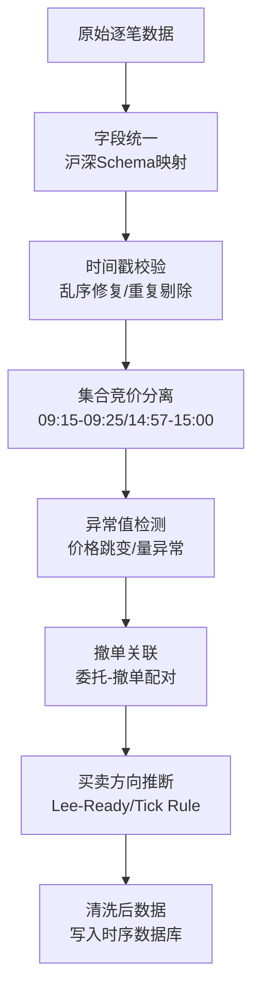
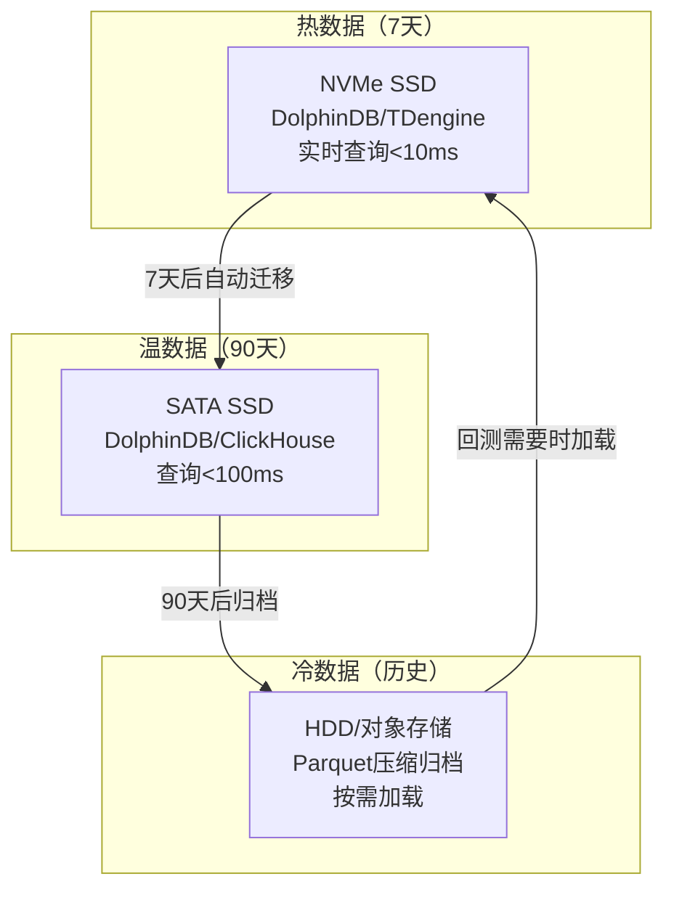

# Level-2数据清洗与存储方案

> - 全市场L2数据日增量约**50GB**（逐笔成交~15GB + 逐笔委托~30GB + 快照~5GB），年化存储**12-15TB**（压缩后）
> - 沪深两所L2数据字段编码差异极大——深交所逐笔委托**全量实时发布**、上交所**部分发布**（全额即时成交不发布），统一Schema是数据工程首要任务
> - 存储首选**DolphinDB**（日期VALUE + 股票HASH分区，毫秒级查询万亿行）或**TDengine**（写入QPS最高，压缩率1:10+）
> - 订单簿重建（LOB Reconstruction）从逐笔委托+逐笔成交增量构建，是高频因子计算的基础
> - 数据回放引擎需支持多股票时间对齐、精确时间戳回放、与回测引擎无缝对接

---

## 一、L2数据源获取

### 1.1 获取渠道

| 渠道 | 费用 | 数据质量 | 延迟 | 适用场景 |
|------|------|---------|------|---------|
| 交易所直连 | 3-10万/年 | 最高（原始） | <1ms | 机构实盘 |
| Wind万得 | 10-30万/年 | 高（标准化） | ~100ms | 研究+回测 |
| 恒生聚源 | 5-15万/年 | 高 | ~100ms | 机构研究 |
| 通达信(pytdx) | 免费 | 中（仅快照） | ~3s | 个人研究 |
| DolphinDB MarketData | 包含在企业版 | 高 | ~10ms | DolphinDB用户 |

### 1.2 数据量估算

| 数据类型 | 日均记录数 | 日增量(未压缩) | 日增量(压缩) |
|---------|-----------|-------------|-------------|
| 逐笔成交 | 3-5亿条 | ~15GB | ~2GB |
| 逐笔委托 | 8-15亿条 | ~30GB | ~4GB |
| 快照(3秒) | ~2000万条 | ~5GB | ~0.5GB |
| **合计** | **11-20亿条** | **~50GB** | **~6.5GB** |

年化存储：50GB × 250天 = 12.5TB（未压缩）/ ~1.6TB（压缩后）

---

## 二、沪深字段统一

### 2.1 逐笔成交字段映射

| 统一字段 | 上交所(SSE) | 深交所(SZSE) | 说明 |
|---------|------------|-------------|------|
| trade_time | TradeTime | TradeTime | 时间戳精度：沪3位ms/深3位ms |
| trade_index | TradeIndex | TradeIndex | 成交序号 |
| trade_channel | TradeChannel | ChannelNo | 通道号 |
| stock_code | SecurityID | SecurityID | 证券代码 |
| trade_price | TradePrice | LastPx | 成交价格 |
| trade_volume | TradeVolume | LastQty | 成交量（股） |
| trade_amount | TradeAmount | — | 成交金额（深交所需自行计算） |
| trade_bs_flag | TradeBSFlag(B/S/N) | ExecType(F/4) | **核心差异**：沪=买卖方向/深=成交vs撤销 |
| bid_order_id | BidApplSeqNum | BidApplSeqNum | 买方委托序号 |
| ask_order_id | OfferApplSeqNum | OfferApplSeqNum | 卖方委托序号 |

**关键差异**：
- 上交所`TradeBSFlag`: B=外盘(主动买), S=内盘(主动卖), N=未知
- 深交所`ExecType`: F=成交, 4=撤销（方向需从委托关联推断）

### 2.2 逐笔委托字段映射

| 统一字段 | 上交所(SSE) | 深交所(SZSE) | 说明 |
|---------|------------|-------------|------|
| order_time | OrderTime | TransactTime | 委托时间 |
| order_index | OrderIndex | ApplSeqNum | 委托序号 |
| stock_code | SecurityID | SecurityID | 证券代码 |
| order_price | OrderPrice | Price | 委托价格 |
| order_volume | OrderVolume | OrderQty | 委托数量 |
| order_type | OrdType(A/D) | OrderType(1/2/U) | **核心差异** |
| side | Side(B/S) | Side(1/2) | 买卖方向 |

**关键差异**：
- 上交所`OrdType`: A=新增委托, D=撤销委托（**仅发布新增和撤销，全额即时成交不发布**）
- 深交所`OrderType`: 1=市价, 2=限价, U=本方最优（**全量实时发布**）

### 2.3 快照字段映射

| 统一字段 | 上交所 | 深交所 | 说明 |
|---------|--------|--------|------|
| snapshot_time | UpdateTime | TransactTime | 快照时间（3秒间隔） |
| last_price | LastPx | LastPx | 最新价 |
| bid_price[1-10] | BidPrice1-10 | BidPrice1-10 | 买一至买十价 |
| bid_volume[1-10] | BidVolume1-10 | BidOrderQty1-10 | 买一至买十量 |
| ask_price[1-10] | OfferPrice1-10 | OfferPrice1-10 | 卖一至卖十价 |
| ask_volume[1-10] | OfferVolume1-10 | OfferOrderQty1-10 | 卖一至卖十量 |
| total_volume | TotalVolumeTrade | NumTrades | 累计成交量 |
| total_amount | TotalValueTrade | TotalValueTrade | 累计成交额 |
| iopv | IOPV | IOPV | ETF实时估值（仅ETF） |

---

## 三、逐笔数据清洗

### 3.1 清洗Pipeline



### 3.2 Python清洗器

```python
import pandas as pd
import numpy as np
from typing import Optional

class TickDataCleaner:
    """逐笔数据清洗器"""
    
    def __init__(self, price_jump_threshold=0.05, 
                 volume_outlier_std=5.0):
        self.price_jump_threshold = price_jump_threshold
        self.volume_outlier_std = volume_outlier_std
    
    def unify_schema(self, df: pd.DataFrame, 
                     exchange: str) -> pd.DataFrame:
        """沪深字段统一"""
        if exchange == 'SSE':
            col_map = {
                'TradePrice': 'trade_price',
                'TradeVolume': 'trade_volume',
                'TradeBSFlag': 'trade_bs_flag',
                'TradeTime': 'trade_time',
            }
            df = df.rename(columns=col_map)
            # 沪市方向直接可用: B/S/N
            df['is_buy'] = df['trade_bs_flag'] == 'B'
            
        elif exchange == 'SZSE':
            col_map = {
                'LastPx': 'trade_price',
                'LastQty': 'trade_volume',
                'ExecType': 'exec_type',
                'TradeTime': 'trade_time',
            }
            df = df.rename(columns=col_map)
            # 深市需过滤撤单记录
            df = df[df['exec_type'] == 'F'].copy()
            # 方向需从委托关联推断
            df['is_buy'] = np.nan  # 后续Lee-Ready补充
        
        df['trade_amount'] = df['trade_price'] * df['trade_volume']
        return df
    
    def fix_timestamps(self, df: pd.DataFrame) -> pd.DataFrame:
        """时间戳修复：排序+去重"""
        df = df.sort_values('trade_time')
        # 去除完全重复的记录
        df = df.drop_duplicates(
            subset=['trade_time', 'trade_price', 'trade_volume'],
            keep='first'
        )
        return df
    
    def separate_auction(self, df: pd.DataFrame) -> tuple:
        """分离集合竞价数据"""
        time = df['trade_time']
        # 开盘集合竞价 09:15-09:25
        open_auction = df[
            (time >= '09:15:00') & (time < '09:25:00')
        ]
        # 收盘集合竞价 14:57-15:00
        close_auction = df[
            (time >= '14:57:00') & (time <= '15:00:00')
        ]
        # 连续竞价
        continuous = df[
            (time >= '09:30:00') & (time < '14:57:00') |
            ((time >= '09:25:00') & (time < '09:30:00'))  # 撮合期
        ]
        return continuous, open_auction, close_auction
    
    def detect_anomalies(self, df: pd.DataFrame) -> pd.DataFrame:
        """异常值检测"""
        # 价格跳变检测
        price_return = df['trade_price'].pct_change()
        price_jump = abs(price_return) > self.price_jump_threshold
        
        # 成交量异常（超过均值+N倍标准差）
        vol_mean = df['trade_volume'].rolling(100).mean()
        vol_std = df['trade_volume'].rolling(100).std()
        vol_outlier = df['trade_volume'] > (
            vol_mean + self.volume_outlier_std * vol_std
        )
        
        df['is_price_anomaly'] = price_jump
        df['is_volume_anomaly'] = vol_outlier
        df['is_clean'] = ~(price_jump | vol_outlier)
        
        return df
    
    def lee_ready_classify(self, trades: pd.DataFrame, 
                           quotes: pd.DataFrame) -> pd.DataFrame:
        """Lee-Ready算法推断买卖方向"""
        # 合并最近的买卖报价
        trades = pd.merge_asof(
            trades.sort_values('trade_time'),
            quotes[['trade_time', 'bid_price1', 'ask_price1']].sort_values('trade_time'),
            on='trade_time',
            direction='backward'
        )
        
        midpoint = (trades['bid_price1'] + trades['ask_price1']) / 2
        
        # Quote Rule
        trades['is_buy'] = np.where(
            trades['trade_price'] > midpoint, True,
            np.where(trades['trade_price'] < midpoint, False, np.nan)
        )
        
        # Tick Rule for midpoint trades
        mask = trades['is_buy'].isna()
        price_diff = trades['trade_price'].diff()
        trades.loc[mask, 'is_buy'] = price_diff[mask] > 0
        
        return trades
```

---

## 四、订单簿重建

### 4.1 增量LOB重建算法

```python
from collections import defaultdict
from sortedcontainers import SortedDict

class LimitOrderBook:
    """从逐笔数据增量重建订单簿"""
    
    def __init__(self, stock_code: str):
        self.stock_code = stock_code
        # SortedDict: 价格 -> {order_id: volume}
        self.bids = SortedDict()   # 买方（降序取）
        self.asks = SortedDict()   # 卖方（升序取）
        self.orders = {}           # order_id -> {price, volume, side}
    
    def add_order(self, order_id, price, volume, side):
        """新增委托"""
        self.orders[order_id] = {
            'price': price, 'volume': volume, 'side': side
        }
        book = self.bids if side == 'B' else self.asks
        if price not in book:
            book[price] = {}
        book[price][order_id] = volume
    
    def cancel_order(self, order_id, cancel_volume=None):
        """撤单"""
        if order_id not in self.orders:
            return
        order = self.orders[order_id]
        book = self.bids if order['side'] == 'B' else self.asks
        price = order['price']
        
        if price in book and order_id in book[price]:
            if cancel_volume and cancel_volume < book[price][order_id]:
                book[price][order_id] -= cancel_volume
                order['volume'] -= cancel_volume
            else:
                del book[price][order_id]
                if not book[price]:
                    del book[price]
                del self.orders[order_id]
    
    def execute_trade(self, bid_id, ask_id, trade_volume):
        """成交：更新买卖双方订单"""
        for oid in [bid_id, ask_id]:
            if oid in self.orders:
                order = self.orders[oid]
                book = self.bids if order['side'] == 'B' else self.asks
                price = order['price']
                
                if price in book and oid in book[price]:
                    book[price][oid] -= trade_volume
                    order['volume'] -= trade_volume
                    if book[price][oid] <= 0:
                        del book[price][oid]
                        if not book[price]:
                            del book[price]
                        del self.orders[oid]
    
    def get_snapshot(self, levels=10):
        """获取N档盘口快照"""
        snapshot = {'bid': [], 'ask': []}
        
        # 买方：价格从高到低
        for price in reversed(list(self.bids.keys())[-levels:]):
            total_vol = sum(self.bids[price].values())
            snapshot['bid'].append((price, total_vol))
        
        # 卖方：价格从低到高
        for price in list(self.asks.keys())[:levels]:
            total_vol = sum(self.asks[price].values())
            snapshot['ask'].append((price, total_vol))
        
        return snapshot
    
    def process_message(self, msg):
        """处理逐笔消息（统一后格式）"""
        if msg['type'] == 'order':
            self.add_order(
                msg['order_id'], msg['price'],
                msg['volume'], msg['side']
            )
        elif msg['type'] == 'cancel':
            self.cancel_order(msg['order_id'], msg.get('volume'))
        elif msg['type'] == 'trade':
            self.execute_trade(
                msg['bid_id'], msg['ask_id'], msg['volume']
            )
```

---

## 五、存储架构设计

### 5.1 四方案对比

| 维度 | DolphinDB | TDengine | ClickHouse | Parquet文件 |
|------|-----------|---------|------------|------------|
| 写入QPS | 500万行/s | 800万行/s | 200万行/s | 50万行/s |
| 查询延迟(单股单日) | <10ms | <20ms | <50ms | 200-500ms |
| 压缩率 | 5-10x | 10-15x | 5-15x | 3-10x |
| 分区策略 | VALUE+HASH | 超级表+子表 | 分区表 | 文件分片 |
| 分布式 | 原生支持 | 原生支持 | 原生支持 | 手动管理 |
| 回放函数 | replay()内置 | 无（需自建） | 无 | 无 |
| 价格 | 企业版10-50万/年 | 社区版免费 | 完全免费 | 完全免费 |
| 推荐场景 | 高频研究(首选) | 实时行情存储 | 日频/分钟级分析 | 个人研究<100GB |

### 5.2 DolphinDB分区方案

```
// 逐笔成交表分区：日期VALUE + 股票代码HASH(50)
db = database("dfs://tick_trade",
    COMPO,
    [VALUE, HASH],
    [2020.01.01..2026.12.31, INT:50]
)

// 建表
schema = table(
    TIMESTAMP as trade_time,
    SYMBOL as stock_code,
    DOUBLE as trade_price,
    INT as trade_volume,
    DOUBLE as trade_amount,
    CHAR as trade_bs_flag,
    LONG as bid_order_id,
    LONG as ask_order_id
)

db.createPartitionedTable(schema, "tick_trade",
    partitionColumns=["trade_time", "stock_code"])
```

### 5.3 冷热数据分层



---

## 六、数据回放引擎

```python
import heapq
from datetime import datetime
from typing import Callable, List

class MarketDataReplayer:
    """多股票时间对齐回放引擎"""
    
    def __init__(self, speed_multiplier=1.0):
        self.speed_multiplier = speed_multiplier
        self.callbacks = []  # [(event_type, callback)]
        self._heap = []      # 优先队列：(timestamp, seq, event)
    
    def register_callback(self, event_type: str, 
                          callback: Callable):
        self.callbacks.append((event_type, callback))
    
    def load_data(self, stock_code: str, 
                  trades: pd.DataFrame,
                  orders: pd.DataFrame = None,
                  snapshots: pd.DataFrame = None):
        """加载单只股票的回放数据"""
        seq = 0
        for _, row in trades.iterrows():
            heapq.heappush(self._heap, (
                row['trade_time'], seq, 
                {'type': 'trade', 'stock': stock_code, **row.to_dict()}
            ))
            seq += 1
        
        if orders is not None:
            for _, row in orders.iterrows():
                heapq.heappush(self._heap, (
                    row['order_time'], seq,
                    {'type': 'order', 'stock': stock_code, **row.to_dict()}
                ))
                seq += 1
        
        if snapshots is not None:
            for _, row in snapshots.iterrows():
                heapq.heappush(self._heap, (
                    row['snapshot_time'], seq,
                    {'type': 'snapshot', 'stock': stock_code, **row.to_dict()}
                ))
                seq += 1
    
    def replay(self):
        """按时间戳顺序回放"""
        event_count = 0
        while self._heap:
            timestamp, _, event = heapq.heappop(self._heap)
            
            for event_type, callback in self.callbacks:
                if event['type'] == event_type or event_type == '*':
                    callback(timestamp, event)
            
            event_count += 1
            if event_count % 1000000 == 0:
                print(f"Replayed {event_count:,} events, "
                      f"current time: {timestamp}")
        
        print(f"Replay complete: {event_count:,} total events")
```

---

## 七、数据质量监控

```python
class Level2QualityMonitor:
    """L2数据质量监控"""
    
    def __init__(self, expected_stocks=5000):
        self.expected_stocks = expected_stocks
    
    def check_completeness(self, df: pd.DataFrame, 
                           date: str) -> dict:
        """完整性检查"""
        actual_stocks = df['stock_code'].nunique()
        trade_count = len(df)
        
        # 预期范围
        expected_min_trades = 200_000_000  # 2亿条最低
        expected_max_trades = 600_000_000  # 6亿条最高
        
        return {
            'date': date,
            'stock_coverage': actual_stocks / self.expected_stocks,
            'trade_count': trade_count,
            'count_in_range': (expected_min_trades <= trade_count 
                              <= expected_max_trades),
            'status': 'OK' if (
                actual_stocks >= self.expected_stocks * 0.95 and
                expected_min_trades <= trade_count
            ) else 'ALERT'
        }
    
    def check_consistency(self, trades: pd.DataFrame, 
                          snapshots: pd.DataFrame,
                          stock_code: str) -> dict:
        """一致性检查：逐笔聚合 vs 快照"""
        # 从逐笔计算日成交额
        tick_amount = trades[
            trades['stock_code'] == stock_code
        ]['trade_amount'].sum()
        
        # 从最后一条快照获取累计成交额
        snap_amount = snapshots[
            snapshots['stock_code'] == stock_code
        ]['total_amount'].iloc[-1]
        
        deviation = abs(tick_amount - snap_amount) / snap_amount
        
        return {
            'stock_code': stock_code,
            'tick_amount': tick_amount,
            'snap_amount': snap_amount,
            'deviation': deviation,
            'status': 'OK' if deviation < 0.001 else 'ALERT'
        }
```

---

## 八、参数速查表

### 硬件配置推荐

| 场景 | CPU | 内存 | 存储 | 网络 | 年成本 |
|------|-----|------|------|------|--------|
| 个人研究(历史回测) | 8核 | 32GB | 2TB NVMe | 千兆 | ~1万 |
| 小型团队(日频更新) | 16核 | 64GB | 4TB NVMe | 千兆 | ~3万 |
| 专业机构(实时+回测) | 64核 | 256GB | 50TB NVMe阵列 | 万兆 | ~30万 |
| 生产级(全市场实时) | 128核+ | 512GB+ | 100TB+分布式 | 万兆 | ~100万+ |

### 压缩方案对比

| 算法 | 压缩率 | 压缩速度 | 解压速度 | 推荐场景 |
|------|--------|---------|---------|---------|
| LZ4 | 3-4x | 最快(500MB/s) | 最快(1.5GB/s) | 实时写入/热数据 |
| Snappy | 3-5x | 快(250MB/s) | 快(500MB/s) | 通用场景 |
| ZSTD | 5-8x | 中(100MB/s) | 快(400MB/s) | 温数据/归档 |
| ZSTD(level 19) | 8-12x | 慢(10MB/s) | 快(400MB/s) | 冷数据归档 |

---

## 九、常见误区

| 误区 | 真相 |
|------|------|
| "沪深逐笔数据格式一样" | 字段编码差异极大，上交所逐笔委托不含全额即时成交，深交所ExecType含撤销记录需过滤 |
| "快照数据足以做高频研究" | 快照3秒间隔丢失大量盘中信息，订单流因子(VPIN/OFI)必须用逐笔数据 |
| "LOB重建用快照差值就行" | 快照间的委托变化包含新增/撤单/成交多种事件，简单差值会产生虚假订单 |
| "所有数据都存热存储" | 热数据NVMe成本约3元/GB/月，50GB/天×250天=12.5TB，年成本45万；冷热分层可降至5万 |
| "压缩率越高越好" | LZ4压缩率低但解压速度最快(1.5GB/s)，实时场景优先选LZ4，归档选ZSTD |
| "集合竞价数据可以混用" | 集合竞价期间无连续竞价，VWAP/OIR等因子计算需严格分离09:15-09:25和14:57-15:00 |
| "逐笔数据没有乱序" | 网络传输和交易所发布延迟可导致时间戳乱序，必须排序后再处理 |
| "DolphinDB只用日期分区" | 单日逐笔数据量太大，必须加股票代码HASH二级分区(推荐50子分区)，否则查询性能急剧下降 |

---

## 十、相关笔记

- [[量化数据工程实践]] — 日频数据清洗、复权处理、PIT数据库
- [[高频因子与日内数据挖掘]] — L2数据驱动的高频因子计算
- [[A股市场微观结构深度研究]] — 撮合机制、订单簿结构、Tick数据定义
- [[A股量化数据源全景图]] — L2数据获取渠道对比
- [[量化研究Python工具链搭建]] — DolphinDB/ClickHouse连接配置
- [[量化策略的服务器部署与自动化]] — 数据服务器部署与自动化更新
- [[A股交易制度全解析]] — 集合竞价规则、涨跌停制度
- [[A股量化交易平台深度对比]] — 各平台L2数据支持

---

## 来源参考

1. 上海证券交易所FAST/Binary行情协议文档 — 沪市L2数据字段定义
2. 深圳证券交易所Binary行情协议文档 — 深市L2数据字段定义
3. DolphinDB官方文档《金融高频数据处理最佳实践》 — 分区方案/replay函数
4. TDengine官方文档《时序数据最佳实践》 — 超级表设计/写入优化
5. 华泰证券《高频数据基础设施建设》 — 数据量估算/存储架构
6. Hasbrouck, J. "Empirical Market Microstructure" — 订单簿重建理论
7. Lee, C. & Ready, M. (1991). "Inferring Trade Direction" — Lee-Ready分类算法
