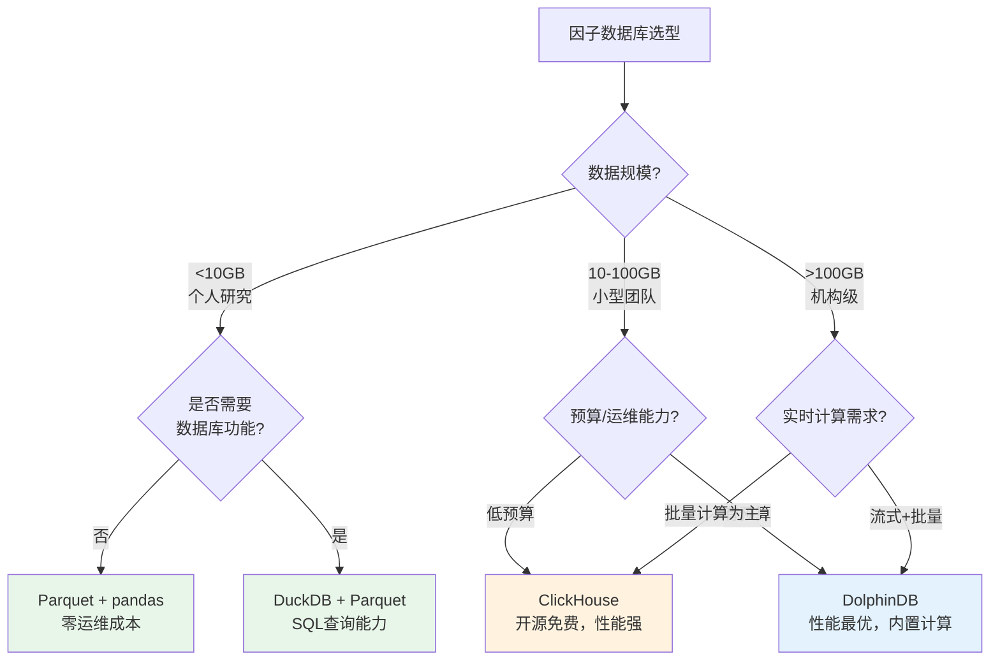
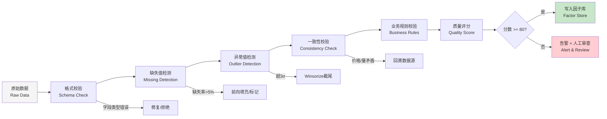

# 量化数据工程实践

> **定位**：量化交易的"地基工程"——数据质量直接决定策略回测的可信度和实盘的稳定性。本文覆盖行情数据清洗、财务数据对齐、因子数据库设计、数据质量监控四大核心模块。

## 核心要点

| 维度 | 关键结论 | 量化指标 |
|------|----------|----------|
| 复权选择 | 回测用**后复权**计算收益率，实时交易用**前复权** | 前复权长周期(>5年)误差可达30%+ |
| 停牌处理 | 前向填充(ffill)收盘价，收益率标记为0 | A股日均停牌率约2%-5% |
| PIT数据库 | 必须按**实际披露日**而非报告期对齐财务数据 | 年报披露滞后30-120天 |
| 因子存储 | DolphinDB性能最优，Parquet为轻量首选 | DolphinDB比Parquet快50-200倍 |
| 数据质量 | 综合质量分 = 完整率*0.4 + 一致率*0.3 + 合理率*0.3 | 阈值 < 80分触发告警 |

## 在知识体系中的位置

```
L1: 市场基础设施与数据工程
├── [[A股交易制度全解析]]          ← 交易规则约束（涨跌停、T+1）
├── [[A股市场微观结构深度研究]]    ← 市场结构影响数据特征
├── [[A股量化数据源全景图]]        ← 数据从哪里来
├── 量化数据工程实践（本文）        ← 数据怎么处理 ★
│   ├── 行情数据清洗
│   ├── 财务数据对齐（PIT）
│   ├── 因子数据库设计
│   └── 数据质量监控
└── → L2: 因子研究与信号体系       ← 清洗后的数据供因子计算使用
```

---

## 一、行情数据清洗

### 1.1 复权处理：前复权/后复权/不复权的选择策略

#### 基本概念

**除权除息**（Ex-Rights & Ex-Dividend）是指上市公司送股、配股、分红导致股价在除权日出现跳空缺口。复权的本质是消除这种人为价格断裂，还原真实涨跌。

- **不复权**（Raw）：原始交易价格，保留真实成交记录
- **前复权**（Forward Adjusted）：以最新价格为基准，向前调整历史价格，使历史价格与当前价格可比
- **后复权**（Backward Adjusted）：以上市首日价格为基准，向后调整后续价格，保持历史价格不变

#### 复权因子计算公式

```
复权价格 = 不复权价格 × 复权因子

单次除权因子 pfactor = (除权前收盘价 - 每股现金分红) / (除权前收盘价 × (1 + 送股比例 + 配股比例) + 配股价 × 配股比例)

累计前复权因子：昨日cp_f = 今日cp_f × 今日pfactor
累计后复权因子：今日cp_b = 昨日cp_b / 今日pfactor
```

#### 选择策略决策表

| 场景 | 推荐复权方式 | 原因 |
|------|-------------|------|
| **策略回测（计算收益率）** | 后复权 | 历史价格基准稳定，累计收益率准确 |
| **实时交易信号** | 前复权 | 最新价格真实，便于挂单/止损 |
| **短周期技术指标（<1年）** | 前复权 | 近期价格准确，指标计算误差小 |
| **长周期回测（>5年）** | 后复权 | 前复权可能出现负值或严重失真 |
| **成交量分析** | 不复权 | 成交量反映真实交投活跃度 |
| **存储基础数据** | 不复权 + 复权因子 | 灵活，可按需计算任意复权方式 |

> [!important] 最佳实践
> **存储不复权数据 + 每日更新的复权因子表**，在计算时按需生成前复权或后复权价格。这样避免历史数据因新的除权事件而需要全量重算。

#### Python 复权计算实现

```python
import pandas as pd
import numpy as np

def compute_adjust_factors(raw_df: pd.DataFrame, dividend_df: pd.DataFrame) -> pd.DataFrame:
    """
    基于不复权日线数据和分红送配数据，计算前复权/后复权因子。

    Parameters
    ----------
    raw_df : DataFrame
        columns: ['trade_date', 'code', 'open', 'high', 'low', 'close', 'volume']
    dividend_df : DataFrame
        columns: ['code', 'ex_date', 'cash_div', 'stock_div', 'allot_ratio', 'allot_price']
        cash_div: 每股现金分红; stock_div: 每股送转股数;
        allot_ratio: 每股配股比例; allot_price: 配股价

    Returns
    -------
    DataFrame with additional columns: 'fwd_factor', 'bwd_factor'
    """
    result = raw_df.sort_values(['code', 'trade_date']).copy()
    result['fwd_factor'] = 1.0
    result['bwd_factor'] = 1.0

    for code in result['code'].unique():
        code_mask = result['code'] == code
        code_div = dividend_df[dividend_df['code'] == code].sort_values('ex_date')

        if code_div.empty:
            continue

        # 计算每个除权日的单次因子
        for _, div in code_div.iterrows():
            ex_date = div['ex_date']
            # 获取除权前一日收盘价
            pre_close_series = result.loc[
                code_mask & (result['trade_date'] < ex_date), 'close'
            ]
            if pre_close_series.empty:
                continue
            pre_close = pre_close_series.iloc[-1]

            # 单次除权因子
            denominator = pre_close * (1 + div['stock_div'] + div['allot_ratio']) \
                          + div['allot_price'] * div['allot_ratio']
            if denominator == 0:
                continue
            pfactor = (pre_close - div['cash_div']) / denominator

            # 前复权：除权日之前的数据乘以pfactor
            before_ex = code_mask & (result['trade_date'] < ex_date)
            result.loc[before_ex, 'fwd_factor'] *= pfactor

            # 后复权：除权日及之后的数据除以pfactor
            on_or_after_ex = code_mask & (result['trade_date'] >= ex_date)
            result.loc[on_or_after_ex, 'bwd_factor'] /= pfactor

    return result


def apply_adjust(df: pd.DataFrame, method: str = 'forward') -> pd.DataFrame:
    """应用复权因子到OHLCV数据"""
    factor_col = 'fwd_factor' if method == 'forward' else 'bwd_factor'
    price_cols = ['open', 'high', 'low', 'close']

    result = df.copy()
    for col in price_cols:
        result[f'{col}_adj'] = (result[col] * result[factor_col]).round(2)

    # 成交量反向调整（前复权时放大历史成交量）
    if method == 'forward':
        result['volume_adj'] = (result['volume'] / result[factor_col]).round(0)
    else:
        result['volume_adj'] = (result['volume'] * result[factor_col]).round(0)

    return result
```

### 1.2 停牌处理

A股停牌原因包括重大资产重组、异常波动（连续3日累计涨跌幅偏离值达到 ±30%）、信息披露等。停牌期间无交易数据，需要合理填充。

#### 处理规则

| 数据字段 | 处理方法 | 说明 |
|----------|---------|------|
| 收盘价/OHLC | 前向填充（ffill） | 用停牌前最后一个交易日的收盘价填充 |
| 成交量/成交额 | 填充为 0 | 停牌期间无交易 |
| 日收益率 | 填充为 0 | 停牌期间无涨跌 |
| 换手率 | 填充为 0 | 停牌期间无交易 |
| 因子值 | 视因子类型决定 | 价量因子填0/NaN，基本面因子正常计算 |

#### 复牌日特殊处理

```python
def handle_suspension(df: pd.DataFrame) -> pd.DataFrame:
    """
    处理停牌数据。
    df columns: ['trade_date', 'code', 'close', 'volume', 'is_suspended']
    """
    df = df.sort_values(['code', 'trade_date']).copy()

    # 1. 价格前向填充
    df['close_filled'] = df.groupby('code')['close'].ffill()

    # 2. 停牌期间成交量/收益率置零
    df.loc[df['is_suspended'] == 1, 'volume'] = 0

    # 3. 收益率计算（停牌期间为0，复牌日用复牌价vs停牌前价格）
    df['ret'] = df.groupby('code')['close_filled'].pct_change()
    df.loc[df['is_suspended'] == 1, 'ret'] = 0.0

    # 4. 标记复牌日（前一日停牌，当日不停牌）
    df['prev_suspended'] = df.groupby('code')['is_suspended'].shift(1)
    df['is_resumption'] = (df['prev_suspended'] == 1) & (df['is_suspended'] == 0)

    return df
```

> [!warning] 复牌日涨跌幅异常
> 长期停牌后复牌可能出现连续涨停或跌停（如借壳上市后复牌），收益率可达 +100% 以上。回测时需决定是否将复牌日收益纳入策略绩效计算。

### 1.3 ST 标记处理

ST（Special Treatment）股票实行 ±5% 涨跌幅限制（主板），交易活跃度低，基本面异常。

#### 处理策略

| 策略类型 | 推荐处理方式 | 理由 |
|----------|-------------|------|
| 多因子选股 | **剔除 ST/\*ST 股票** | 财务数据异常，因子失效 |
| 事件驱动 | **保留但标记** | ST 摘帽是重要事件信号 |
| 全市场统计 | **保留但单独分组** | 避免污染整体统计量 |

```python
def mark_st_stocks(df: pd.DataFrame) -> pd.DataFrame:
    """标记并处理ST股票"""
    # ST标记识别：股票简称包含 ST、*ST、S*ST、SST
    st_pattern = r'(?:S?\*?ST|SST)'
    df['is_st'] = df['stock_name'].str.contains(st_pattern, na=False)

    # 多因子场景：直接剔除
    # df_clean = df[~df['is_st']].copy()

    # 统计场景：保留但标记
    df['st_group'] = df['is_st'].map({True: 'ST', False: 'Normal'})

    return df
```

### 1.4 退市股处理与幸存者偏差

**幸存者偏差**（Survivorship Bias）是量化回测中最隐蔽的陷阱之一：如果只用当前存活的股票数据进行回测，会系统性高估策略收益率。

#### 退市股处理规则

1. **数据获取**：使用支持退市股历史数据的数据源（如 Tushare `list_status='D'`、Wind 退市股库）
2. **退市日截断**：退市日后数据标记为 NaN，不参与后续计算
3. **退市收益模拟**：退市最后交易日后，假设亏损 100%（强制退市）或按退市整理期价格计算
4. **回测宇宙构建**：每个回测日的选股池应为**当日实际可交易的全部股票**

```python
def build_tradable_universe(all_stocks_df: pd.DataFrame, trade_date: str) -> list:
    """
    构建某一交易日的可交易股票池（避免幸存者偏差）。
    all_stocks_df columns: ['code', 'list_date', 'delist_date', 'is_st']
    """
    mask = (
        (all_stocks_df['list_date'] <= trade_date) &  # 已上市
        (
            (all_stocks_df['delist_date'].isna()) |    # 未退市
            (all_stocks_df['delist_date'] > trade_date) # 退市日在当日之后
        ) &
        (~all_stocks_df['is_st'])                       # 非ST（可选）
    )
    return all_stocks_df.loc[mask, 'code'].tolist()
```

---

## 二、财务数据对齐与 Point-in-Time 数据库

### 2.1 核心问题：报告期 vs 披露日

A股财报存在**报告期**与**实际披露日**的时间差，这是未来函数（Look-Ahead Bias）的最大来源。

#### A股定期报告披露时间规则

| 报告类型 | 报告期 | 披露截止日 | 典型滞后 |
|----------|--------|-----------|---------|
| 一季报 | 3月31日 | 4月30日 | 15-30天 |
| 半年报 | 6月30日 | 8月31日 | 30-60天 |
| 三季报 | 9月30日 | 10月31日 | 15-30天 |
| 年报 | 12月31日 | 次年4月30日 | 60-120天 |

> [!danger] 经典未来函数陷阱
> 假设用"2025年报告期=12月31日"的ROE数据在2026年1月1日做选股——但该年报要到2026年3-4月才披露！在1月1日时，市场上这个数据根本不存在。

### 2.2 Point-in-Time（PIT）数据库设计

PIT数据库的核心是为每条财务数据记录**两个时间维度**：

- **报告期**（Report Period）：财务数据所属的会计期间
- **披露日**（Announce Date）：数据实际对外公布的日期

#### 数据库表结构设计

```sql
CREATE TABLE pit_financial (
    code          VARCHAR(10),    -- 股票代码
    report_period DATE,           -- 报告期（如 2025-12-31）
    announce_date DATE,           -- 实际披露日（如 2026-03-28）
    field_name    VARCHAR(50),    -- 财务指标名称
    field_value   DECIMAL(20,4),  -- 指标值
    revision_no   INT DEFAULT 0,  -- 修订版本号（0=首次披露，1=一次修订...）
    update_time   TIMESTAMP,      -- 数据入库时间
    PRIMARY KEY (code, report_period, field_name, revision_no)
);

-- PIT查询：获取某日可用的最新财务数据
-- 关键约束：announce_date <= query_date
CREATE INDEX idx_pit_lookup ON pit_financial(code, field_name, announce_date);
```

#### Python PIT 查询实现

```python
import pandas as pd
from typing import Optional

class PITDatabase:
    """Point-in-Time 财务数据查询引擎"""

    def __init__(self, pit_df: pd.DataFrame):
        """
        pit_df columns:
            code, report_period, announce_date, field_name, field_value, revision_no
        """
        self.data = pit_df.sort_values(
            ['code', 'field_name', 'announce_date', 'revision_no']
        )

    def query(self, code: str, field: str, query_date: str,
              n_periods: int = 1) -> pd.DataFrame:
        """
        PIT查询：返回在query_date时点可获得的最新n个报告期数据。

        Parameters
        ----------
        code : 股票代码
        field : 财务指标名（如 'roe', 'revenue'）
        query_date : 查询日期（模拟投资者在该日的信息集）
        n_periods : 返回最近n个报告期

        Returns
        -------
        DataFrame: 包含报告期、指标值、披露日
        """
        mask = (
            (self.data['code'] == code) &
            (self.data['field_name'] == field) &
            (self.data['announce_date'] <= query_date)  # 核心约束：只用已披露数据
        )
        available = self.data[mask].copy()

        # 每个报告期取最新修订版本
        latest = available.groupby('report_period').apply(
            lambda x: x.nlargest(1, 'revision_no')
        ).reset_index(drop=True)

        # 返回最近n个报告期
        return latest.nlargest(n_periods, 'report_period')[
            ['code', 'report_period', 'announce_date', 'field_value']
        ]

    def get_pit_snapshot(self, query_date: str, field: str) -> pd.DataFrame:
        """
        获取全市场在query_date时点的PIT快照。
        用于横截面因子计算。
        """
        mask = (
            (self.data['field_name'] == field) &
            (self.data['announce_date'] <= query_date)
        )
        available = self.data[mask].copy()

        # 每只股票取最新报告期的最新修订版
        snapshot = (
            available
            .sort_values(['code', 'report_period', 'revision_no'])
            .groupby('code')
            .last()
            .reset_index()
        )
        return snapshot[['code', 'report_period', 'announce_date', 'field_value']]


# 使用示例
# pit = PITDatabase(pit_df)
# 2026年1月15日查询贵州茅台的ROE（只能看到2025Q3及之前的数据）
# result = pit.query('600519.SH', 'roe_ttm', '2026-01-15', n_periods=4)
```

### 2.3 财务数据对齐的实践细节

#### TTM（Trailing Twelve Months）计算

```python
def calc_ttm(pit_db: PITDatabase, code: str, field: str, query_date: str) -> Optional[float]:
    """
    基于PIT数据计算TTM值。
    TTM = 最近四个季度之和（需处理年报/季报组合）

    常用方法：TTM = 最新年报值 + 最新季报累计值 - 去年同期季报累计值
    """
    periods = pit_db.query(code, field, query_date, n_periods=5)
    if periods.empty:
        return None

    latest = periods.iloc[0]
    latest_period = str(latest['report_period'])

    # 判断最新报告期是哪个季度
    month = int(latest_period[5:7])

    if month == 12:
        # 年报数据本身就是全年，直接返回
        return float(latest['field_value'])
    else:
        # 需要找到上一年年报和上一年同期季报
        # TTM = 当期累计值 + 上年年报值 - 上年同期累计值
        year = int(latest_period[:4])
        last_annual_period = f"{year-1}-12-31"
        last_same_period = f"{year-1}-{latest_period[5:]}"

        annual = periods[periods['report_period'] == last_annual_period]
        same_q = periods[periods['report_period'] == last_same_period]

        if annual.empty or same_q.empty:
            return None

        ttm = (float(latest['field_value'])
               + float(annual.iloc[0]['field_value'])
               - float(same_q.iloc[0]['field_value']))
        return ttm
```

---

## 三、因子数据库设计

### 3.1 存储架构选型：列存储 vs 行存储

量化因子数据的访问模式决定了**列存储**是天然最优选择：

- **典型查询**：取全市场某一因子在某时间段的值（按列读取）
- **数据形态**：宽表（5000+股票 × 数百因子 × 数千交易日）
- **写入模式**：批量追加（每日收盘后更新）

### 3.2 存储方案选型对比

#### 参数速查表

| 方案 | 类型 | 写入速度 | 读取速度 | 压缩率 | 并发查询 | 运维成本 | 适用规模 |
|------|------|---------|---------|--------|---------|---------|---------|
| **Parquet** | 文件 | 中等 | 快（列裁剪） | 高（Snappy/ZSTD，3-10x） | 无原生支持 | 极低 | <100GB |
| **HDF5** | 文件 | 快 | 快（内存映射） | 中等（GZIP，2-5x） | 写锁限制 | 低 | <50GB |
| **ClickHouse** | OLAP数据库 | 快（批量） | 极快（列式+向量化） | 高（LZ4/ZSTD，5-15x） | 高 | 中等 | 100GB-10TB |
| **DolphinDB** | 时序数据库 | 极快 | 极快（内置计算） | 高（LZ4，5-10x） | 高 | 中高 | 10GB-100TB |
| **Pickle** | 文件 | 快 | 快（内存） | 无 | 无 | 极低 | <10GB |
| **CSV** | 文件 | 慢 | 极慢 | 无 | 无 | 极低 | <1GB |

#### 性能实测参考（42个CSV文件导入）

| 操作 | DolphinDB | ClickHouse | Python+Parquet |
|------|-----------|------------|----------------|
| 数据导入 | 10分28秒 | 28分5秒 | 远慢50-200x |
| 复杂聚合查询 | 基准1x | 2-2.5x慢 | 50-200x慢 |
| 窗口函数 | 丰富，原生支持 | 有限支持 | 需pandas手写 |
| 自动并行 | 是 | 是 | 需multiprocessing |

### 3.3 存储方案选型决策树



### 3.4 Parquet 因子库实现（推荐入门方案）

```python
import pandas as pd
import pyarrow as pa
import pyarrow.parquet as pq
from pathlib import Path
from datetime import datetime

class ParquetFactorStore:
    """
    基于Parquet的因子数据库，适合个人/小型团队。

    目录结构：
    factor_store/
    ├── daily/
    │   ├── 2025/
    │   │   ├── 202501.parquet    # 按月分区
    │   │   ├── 202502.parquet
    │   │   └── ...
    │   └── 2026/
    ├── factor_meta.parquet        # 因子元数据
    └── universe.parquet           # 股票池历史
    """

    def __init__(self, root_dir: str):
        self.root = Path(root_dir)
        self.root.mkdir(parents=True, exist_ok=True)
        (self.root / 'daily').mkdir(exist_ok=True)

    def write_daily(self, df: pd.DataFrame, trade_date: str):
        """
        写入单日因子数据。
        df columns: ['code', 'factor_1', 'factor_2', ..., 'factor_n']
        """
        year = trade_date[:4]
        month = trade_date[:6]

        year_dir = self.root / 'daily' / year
        year_dir.mkdir(exist_ok=True)

        df['trade_date'] = trade_date
        parquet_path = year_dir / f'{month}.parquet'

        if parquet_path.exists():
            existing = pd.read_parquet(parquet_path)
            # 去重：同一天同一股票只保留最新
            combined = pd.concat([existing, df]).drop_duplicates(
                subset=['trade_date', 'code'], keep='last'
            )
            combined.to_parquet(parquet_path, index=False, compression='snappy')
        else:
            df.to_parquet(parquet_path, index=False, compression='snappy')

    def read_factor(self, factor_name: str,
                    start_date: str, end_date: str,
                    codes: list = None) -> pd.DataFrame:
        """
        读取指定因子的时间序列数据。
        利用Parquet列裁剪，只读取需要的列。
        """
        frames = []
        for parquet_file in sorted(self.root.rglob('daily/**/*.parquet')):
            df = pd.read_parquet(
                parquet_file,
                columns=['trade_date', 'code', factor_name]
            )
            df = df[(df['trade_date'] >= start_date) & (df['trade_date'] <= end_date)]
            if codes:
                df = df[df['code'].isin(codes)]
            frames.append(df)

        if not frames:
            return pd.DataFrame()
        return pd.concat(frames, ignore_index=True).sort_values(['trade_date', 'code'])

    def read_cross_section(self, trade_date: str,
                           factor_names: list = None) -> pd.DataFrame:
        """读取某日横截面数据（所有股票、指定因子）"""
        year = trade_date[:4]
        month = trade_date[:6]
        parquet_path = self.root / 'daily' / year / f'{month}.parquet'

        if not parquet_path.exists():
            return pd.DataFrame()

        columns = ['trade_date', 'code'] + (factor_names or [])
        df = pd.read_parquet(parquet_path, columns=columns)
        return df[df['trade_date'] == trade_date]
```

---

## 四、数据质量监控

### 4.1 数据清洗 Pipeline 流程



### 4.2 缺失值检测

```python
import pandas as pd
import numpy as np
from typing import Dict, Tuple

class DataQualityMonitor:
    """A股量化数据质量监控系统"""

    def __init__(self, alert_threshold: float = 80.0):
        self.alert_threshold = alert_threshold
        self.report = {}

    def check_missing(self, df: pd.DataFrame,
                      critical_cols: list = None) -> Dict[str, float]:
        """
        缺失值检测。

        Returns: {列名: 缺失率%}
        """
        missing_rates = (df.isnull().sum() / len(df) * 100).to_dict()

        # 关键列缺失率检查
        if critical_cols:
            for col in critical_cols:
                rate = missing_rates.get(col, 0)
                if rate > 5.0:
                    print(f"[ALERT] 关键列 '{col}' 缺失率 {rate:.2f}% 超过5%阈值")

        self.report['missing'] = missing_rates
        return missing_rates

    def check_outliers(self, df: pd.DataFrame,
                       numeric_cols: list = None,
                       method: str = 'iqr') -> Dict[str, int]:
        """
        异常值检测。

        Parameters
        ----------
        method: 'iqr' (四分位距法) 或 'zscore' (3σ法) 或 'mad' (中位数绝对偏差)
        """
        if numeric_cols is None:
            numeric_cols = df.select_dtypes(include=[np.number]).columns.tolist()

        outlier_counts = {}
        for col in numeric_cols:
            series = df[col].dropna()
            if len(series) == 0:
                continue

            if method == 'iqr':
                q1, q3 = series.quantile([0.25, 0.75])
                iqr = q3 - q1
                outliers = ((series < q1 - 1.5 * iqr) | (series > q3 + 1.5 * iqr)).sum()
            elif method == 'zscore':
                from scipy import stats
                z = np.abs(stats.zscore(series))
                outliers = (z > 3).sum()
            elif method == 'mad':
                median = series.median()
                mad = np.median(np.abs(series - median))
                modified_z = 0.6745 * (series - median) / (mad + 1e-10)
                outliers = (np.abs(modified_z) > 3.5).sum()

            outlier_counts[col] = int(outliers)

        self.report['outliers'] = outlier_counts
        return outlier_counts

    def check_consistency(self, df: pd.DataFrame) -> Dict[str, any]:
        """
        数据一致性校验（A股业务规则）。
        """
        checks = {}

        # 1. 价格一致性：high >= low, high >= open, high >= close
        if all(c in df.columns for c in ['high', 'low', 'open', 'close']):
            price_valid = (
                (df['high'] >= df['low']) &
                (df['high'] >= df['open']) &
                (df['high'] >= df['close']) &
                (df['low'] <= df['open']) &
                (df['low'] <= df['close'])
            )
            checks['price_consistency'] = price_valid.mean() * 100

        # 2. 成交量为0时，OHLC应相等（集合竞价除外）
        if 'volume' in df.columns:
            zero_vol = df[df['volume'] == 0]
            if len(zero_vol) > 0:
                ohlc_equal = (
                    (zero_vol['open'] == zero_vol['close']) &
                    (zero_vol['high'] == zero_vol['low'])
                ).mean() * 100
                checks['zero_vol_price_consistency'] = ohlc_equal

        # 3. 涨跌幅限制检查（主板 ±10%，科创板/创业板 ±20%，北交所 ±30%）
        if 'pct_change' in df.columns and 'board' in df.columns:
            limit_map = {'main': 10, 'gem': 20, 'star': 20, 'bse': 30}
            violations = 0
            for board, limit in limit_map.items():
                board_df = df[df['board'] == board]
                violations += (board_df['pct_change'].abs() > limit + 0.5).sum()
            checks['price_limit_violations'] = violations

        # 4. 重复数据检查
        if 'trade_date' in df.columns and 'code' in df.columns:
            dup_count = df.duplicated(subset=['trade_date', 'code']).sum()
            checks['duplicates'] = int(dup_count)
            checks['duplicate_rate'] = dup_count / len(df) * 100

        self.report['consistency'] = checks
        return checks

    def compute_quality_score(self) -> float:
        """
        综合质量评分。
        分数 = 完整率 * 0.4 + 一致率 * 0.3 + 合理率 * 0.3
        """
        # 完整率
        if 'missing' in self.report:
            avg_missing = np.mean(list(self.report['missing'].values()))
            completeness = 100 - avg_missing
        else:
            completeness = 100

        # 一致率
        if 'consistency' in self.report:
            consistency_vals = [
                v for k, v in self.report['consistency'].items()
                if isinstance(v, (int, float)) and 'rate' in k
            ]
            consistency = 100 - np.mean(consistency_vals) if consistency_vals else 100
        else:
            consistency = 100

        # 合理率（无异常值比例）
        if 'outliers' in self.report:
            total_outliers = sum(self.report['outliers'].values())
            # 粗估总数据点
            reasonableness = max(0, 100 - total_outliers * 0.01)
        else:
            reasonableness = 100

        score = completeness * 0.4 + consistency * 0.3 + reasonableness * 0.3

        if score < self.alert_threshold:
            print(f"[CRITICAL ALERT] 数据质量分 {score:.1f} 低于阈值 {self.alert_threshold}")

        return round(score, 2)

    def generate_report(self) -> str:
        """生成质量报告摘要"""
        score = self.compute_quality_score()
        lines = [
            f"=== 数据质量报告 ===",
            f"综合评分: {score}",
            f"完整性: 平均缺失率 {np.mean(list(self.report.get('missing', {}).values())):.2f}%",
            f"异常值: {sum(self.report.get('outliers', {}).values())} 个",
            f"一致性: {self.report.get('consistency', {})}",
        ]
        return '\n'.join(lines)
```

### 4.3 异常值处理方法

| 方法 | 公式 | 适用场景 | A股注意事项 |
|------|------|---------|------------|
| **Winsorize截尾** | 超出[1%, 99%]分位数的值替换为边界值 | 因子值标准化前 | 最常用，保留数据量 |
| **MAD法** | 偏离中位数 > 3.5 × MAD | 因子值异常检测 | 比Z-score更稳健 |
| **IQR法** | 超出 [Q1-1.5×IQR, Q3+1.5×IQR] | 描述性统计 | 涨跌停不视为异常 |
| **行业内Z-score** | 按行业分组后3σ剔除 | 横截面因子 | 避免行业间差异误判 |

```python
def winsorize_factor(series: pd.Series, lower: float = 0.01, upper: float = 0.99) -> pd.Series:
    """因子Winsorize截尾处理"""
    q_low = series.quantile(lower)
    q_high = series.quantile(upper)
    return series.clip(lower=q_low, upper=q_high)

def mad_filter(series: pd.Series, threshold: float = 3.5) -> pd.Series:
    """MAD法异常值处理：异常值替换为中位数"""
    median = series.median()
    mad = np.median(np.abs(series - median))
    modified_z = 0.6745 * (series - median) / (mad + 1e-10)
    result = series.copy()
    result[np.abs(modified_z) > threshold] = median
    return result

def industry_neutralize_winsorize(df: pd.DataFrame, factor_col: str,
                                   industry_col: str = 'industry') -> pd.Series:
    """行业内Winsorize：避免跨行业差异被误判为异常"""
    return df.groupby(industry_col)[factor_col].transform(
        lambda x: winsorize_factor(x, 0.025, 0.975)
    )
```

---

## 五、硬性规则与软性建议

### 硬性规则（必须遵守）

1. **绝对禁止未来函数**：财务数据必须按披露日（而非报告期）对齐，使用PIT数据库
2. **必须包含退市股**：回测宇宙每日动态构建，使用当日实际可交易股票池
3. **复权因子每日更新**：新的除权事件会影响前复权因子，不复权数据+因子表是唯一正确的存储方式
4. **停牌股不可交易**：回测中停牌日不得买入/卖出，组合权重需重新归一化
5. **涨跌停不可交易**：涨停无法买入，跌停无法卖出（参见 [[A股交易制度全解析]]）

### 软性建议（推荐遵循）

1. **数据双源校验**：至少用两个数据源交叉验证关键数据（如 Tushare + 东方财富）
2. **增量更新优于全量重算**：日频数据追加写入，仅在复权因子变化时重算历史
3. **数据血缘追踪**：记录每条数据的来源、清洗步骤、版本号
4. **定时监控**：每个交易日收盘后自动运行数据质量检查，异常邮件告警
5. **分层存储**：热数据（近3年）用内存/SSD，冷数据（历史）用 Parquet 归档

---

## 六、常见误区

### 误区1：回测用前复权价格计算收益率

> **错误**：前复权因子会随新的除权事件而变化，导致历史价格"漂移"——上周回测的结果和本周可能不同。
>
> **正确做法**：回测收益率计算使用后复权价格或直接使用不复权价格+复权因子即时计算。

### 误区2：用报告期日期作为财务数据可用时间

> **错误**：在2026年1月1日使用2025年12月31日报告期的年报数据。
>
> **正确做法**：必须使用PIT数据库，以实际披露日为准。2025年年报最早在2026年2-3月才可用。

### 误区3：忽略财报修订（Restatement）

> **错误**：只存储财报首次披露值，忽略后续修正。
>
> **正确做法**：PIT数据库需记录修订版本号（revision_no），查询时取指定时点的最新版本。

### 误区4：停牌期间按0收益处理后不调整持仓

> **错误**：停牌期间因子信号变化但无法调仓，忽略这一限制。
>
> **正确做法**：停牌股在组合中"锁定"，剩余可交易股票按比例重新分配权重。

### 误区5：认为数据源提供的复权数据一定正确

> **错误**：直接信任单一数据源的复权价格。
>
> **正确做法**：存储不复权数据 + 复权因子表，自行计算并与数据源交叉验证。不同数据源对配股、特殊分红的处理可能不同。

---

## 七、选型决策指南

### 按团队规模选型

| 团队规模 | 数据量 | 推荐方案 | 预算 | 备注 |
|----------|--------|---------|------|------|
| **个人研究者** | <10GB | Parquet + pandas + DuckDB | 0元 | 零运维，Python生态友好 |
| **小型团队(2-5人)** | 10-50GB | ClickHouse（单机） | 0元 | 开源免费，SQL查询 |
| **中型团队(5-20人)** | 50-500GB | DolphinDB（社区版） | 0-数万元/年 | 内置金融函数，性能强 |
| **机构级** | >500GB | DolphinDB集群 / KDB+ | 数十万元/年+ | 实时计算，低延迟 |

### 按数据类型选型

| 数据类型 | 特点 | 推荐存储 |
|----------|------|---------|
| 日频行情 | 5000股 × 250天 ≈ 125万行/年 | Parquet（按年/月分区） |
| 分钟频行情 | 5000股 × 240分钟 × 250天 ≈ 3亿行/年 | ClickHouse / DolphinDB |
| Tick数据 | 日均10亿+记录 | DolphinDB（流批一体） |
| 因子值（日频） | 5000股 × 500因子 × 250天 | Parquet（按因子分区）或 ClickHouse |
| 财务数据（PIT） | 季频更新，版本管理 | PostgreSQL / ClickHouse |

---

## 八、与本知识库其他笔记的关联

- [[A股交易制度全解析]]：涨跌停板、T+1制度直接影响回测中的可交易性判断
- [[A股市场微观结构深度研究]]：集合竞价、连续竞价机制影响数据特征和清洗规则
- [[A股量化数据源全景图]]：各数据源的覆盖范围和质量差异是数据工程的输入约束
- [[因子评估方法论]]：因子库设计需支持IC/IR计算、分层回测等评估需求
- [[A股回测框架实战与避坑指南]]：数据工程是回测框架的数据层，PIT对齐确保回测无未来函数

---

## 来源参考

1. 复权因子计算详解. cnblogs.com/whiteBear. 2020.
2. 前复权与后复权的区别与应用. sigmagu.com. 2023.
3. A股量化数据清洗实践. CSDN Quant. 2023.
4. DolphinDB vs ClickHouse 性能对比. GitHub/yjhmelody. 2023.
5. DolphinDB 量化因子计算最佳实践. 掘金. 2023.
6. Point-in-Time Financial Data. vbase.com. 2024.
7. Point-in-Time Data in Alternative Data. eaglealpha.com. 2024.
8. StarQube PIT Data Architecture. starqube.com. 2024.
9. A股财报披露规则. 证券时报. 2025.
10. 数据质量监控体系设计. 帆软BI. 2024.
11. pandas数据质量检查实战. 阿里云开发者. 2024.
12. 量化回测的致命陷阱：生存偏差. technologynova.org. 2024.
