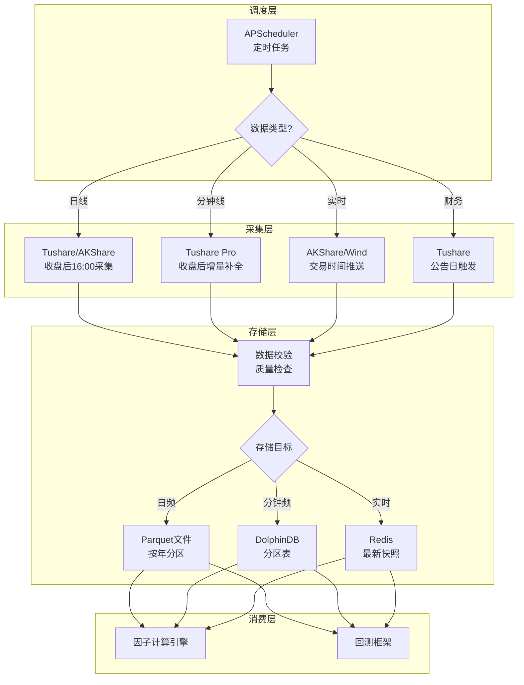
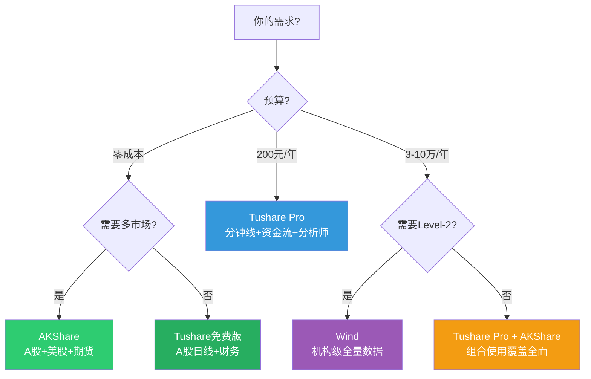

# A股数据源接入实战

## 概述

数据是量化交易的燃料。本文提供Tushare Pro、AKShare、Wind三大主流A股数据源的接入代码模板、性能实测、数据质量对比和最佳实践。从零成本的AKShare到机构级的Wind，覆盖不同预算和场景的选型路径。

**核心结论**：
- 个人/回测首选 **Tushare Pro**（免费版基础够用，Pro版性价比高）
- 零成本/开源场景选 **AKShare**（完全免费，多市场覆盖）
- 机构/高频场景选 **Wind**（数据最全最稳，但成本高）
- Tushare Pro日线数据与Wind完全一致（实测差异为0）

> 相关笔记：[[A股量化数据源全景图]] | [[量化数据工程实践]] | [[量化研究Python工具链搭建]]

---

## 数据源全景对比

| 维度 | Tushare Pro | AKShare | Wind | JQData(聚宽) |
|------|-------------|---------|------|-------------|
| **价格** | 免费/200元年 | 完全免费 | 3-10万/年 | 免费(限量)/付费 |
| **A股日线** | ✅ | ✅ | ✅ | ✅ |
| **分钟K线** | ✅(Pro) | ✅ | ✅ | ✅ |
| **Level-2** | ❌ | ❌ | ✅ | ❌ |
| **实时行情** | ✅(延迟) | ✅ | ✅(实时) | ✅(延迟) |
| **财务数据** | ✅ | ✅ | ✅(最全) | ✅ |
| **资金流向** | ✅(Pro) | ✅ | ✅ | ✅ |
| **指数数据** | ✅ | ✅ | ✅ | ✅ |
| **期货/期权** | ✅ | ✅ | ✅ | ✅ |
| **港股/美股** | ✅(延迟) | ✅ | ✅ | ❌ |
| **限频** | 每分钟200次 | 无硬限制(建议<60) | 无(本地客户端) | 有 |
| **数据质量** | 高(与Wind一致) | 良好(多源) | 最高 | 高 |
| **Python包** | `tushare` | `akshare` | `WindPy` | `jqdatasdk` |

---

## Tushare Pro 详解

### 初始化与认证

```python
import tushare as ts
import pandas as pd

# 初始化（注册后获取token: https://tushare.pro）
ts.set_token('your_token_here')
pro = ts.pro_api()

# 验证连接
df = pro.trade_cal(exchange='SSE', start_date='20260101', end_date='20260131')
print(f"交易日历获取成功，共{len(df)}条记录")
```

### 行情数据

```python
# === 日线行情（含复权）===
def get_daily_data(ts_code: str, start: str, end: str, adj: str = 'qfq') -> pd.DataFrame:
    """
    获取日线行情

    Parameters
    ----------
    ts_code : 股票代码（如'600519.SH'）
    adj : 复权类型 - 'qfq'前复权, 'hfq'后复权, None不复权
    """
    df = pro.daily(ts_code=ts_code, start_date=start, end_date=end, adj=adj)
    df['trade_date'] = pd.to_datetime(df['trade_date'])
    df = df.sort_values('trade_date').set_index('trade_date')
    return df

# 示例
kline = get_daily_data('600519.SH', '20240101', '20261231', adj='qfq')

# === 分钟K线 ===
def get_minute_data(ts_code: str, freq: str = '5min', start: str = '', end: str = '') -> pd.DataFrame:
    """获取分钟级K线（需Pro权限，单次限5000条）"""
    df = pro.stk_mins(ts_code=ts_code, freq=freq, start_date=start, end_date=end)
    return df
```

### 财务数据

```python
# === 财务报表 ===
def get_financial_data(ts_code: str, period: str = '') -> dict:
    """获取三大财务报表"""
    income = pro.income(ts_code=ts_code, period=period)     # 利润表
    balance = pro.balancesheet(ts_code=ts_code, period=period)  # 资产负债表
    cashflow = pro.cashflow(ts_code=ts_code, period=period)    # 现金流量表

    return {'income': income, 'balance': balance, 'cashflow': cashflow}

# === 财务指标 ===
def get_fina_indicator(ts_code: str) -> pd.DataFrame:
    """获取财务指标（ROE/ROA/EPS等）"""
    df = pro.fina_indicator(ts_code=ts_code)
    return df

# === 分析师预期 ===
def get_analyst_forecast(ts_code: str) -> pd.DataFrame:
    """获取分析师盈利预测"""
    df = pro.forecast(ts_code=ts_code)
    return df
```

### 批量数据采集（多线程）

```python
import concurrent.futures
import time

def batch_fetch_daily(
    stock_list: list,
    start_date: str,
    end_date: str,
    max_workers: int = 5,
    sleep_interval: float = 0.3
) -> pd.DataFrame:
    """
    批量采集日线数据（含限频控制）

    Tushare限频: Pro版每分钟200次
    """
    all_data = []

    def fetch_single(ts_code):
        time.sleep(sleep_interval)  # 限频保护
        try:
            df = pro.daily(ts_code=ts_code, start_date=start_date,
                          end_date=end_date, adj='qfq')
            df['ts_code'] = ts_code
            return df
        except Exception as e:
            print(f"失败 {ts_code}: {e}")
            return pd.DataFrame()

    with concurrent.futures.ThreadPoolExecutor(max_workers=max_workers) as executor:
        results = list(executor.map(fetch_single, stock_list))

    all_data = pd.concat([r for r in results if not r.empty], ignore_index=True)
    return all_data

# 获取全市场股票列表
stock_list = pro.stock_basic(
    exchange='', list_status='L', fields='ts_code'
)['ts_code'].tolist()

# 批量采集（100只约42秒）
daily_data = batch_fetch_daily(stock_list[:100], '20260101', '20260324')
```

---

## AKShare 详解

### 初始化

```python
import akshare as ak

# AKShare无需认证，直接使用
# 安装: pip install akshare
```

### 行情数据

```python
# === 个股日线 ===
def ak_daily(symbol: str, start: str, end: str, adjust: str = 'qfq') -> pd.DataFrame:
    """
    AKShare获取日线（东方财富数据源）

    Parameters
    ----------
    symbol : 股票代码（纯数字如'600519'）
    adjust : 'qfq'前复权, 'hfq'后复权, ''不复权
    """
    df = ak.stock_zh_a_hist(
        symbol=symbol, period='daily',
        start_date=start, end_date=end, adjust=adjust
    )
    df['日期'] = pd.to_datetime(df['日期'])
    df = df.set_index('日期')
    return df

# 示例
kline = ak_daily('600519', '20240101', '20261231')

# === 实时行情快照 ===
def ak_realtime_snapshot() -> pd.DataFrame:
    """获取A股全市场实时快照"""
    df = ak.stock_zh_a_spot_em()
    return df

# === ETF行情 ===
def ak_etf_daily(symbol: str, start: str, end: str) -> pd.DataFrame:
    """获取ETF日线"""
    df = ak.fund_etf_hist_em(symbol=symbol, period='daily',
                              start_date=start, end_date=end, adjust='qfq')
    return df
```

### 特色数据

```python
# === 资金流向 ===
def ak_money_flow(symbol: str) -> pd.DataFrame:
    """个股资金流向"""
    df = ak.stock_individual_fund_flow(stock=symbol, market='sh')
    return df

# === 龙虎榜 ===
def ak_lhb(date: str) -> pd.DataFrame:
    """龙虎榜数据"""
    df = ak.stock_lhb_detail_em(start_date=date, end_date=date)
    return df

# === 融资融券 ===
def ak_margin(symbol: str) -> pd.DataFrame:
    """融资融券数据"""
    df = ak.stock_margin_detail_szse(date='20260324')
    return df

# === 北向资金 ===
def ak_north_flow() -> pd.DataFrame:
    """北向资金流入数据"""
    df = ak.stock_hsgt_north_net_flow_in_em(symbol='北上')
    return df
```

---

## Wind API 详解

### 初始化

```python
from WindPy import w

# Wind需要本地安装客户端并登录
w.start()

# 验证连接
status = w.isconnected()
print(f"Wind连接状态: {status}")
```

### 行情数据

```python
# === 日线行情（前复权）===
def wind_daily(code: str, start: str, end: str) -> pd.DataFrame:
    """
    Wind获取日线

    Parameters
    ----------
    code : 万得代码（如'600519.SH'）
    """
    data = w.wsd(code, "open,high,low,close,volume,amt",
                 start, end, "Fill=Previous;PriceAdj=F")  # F=前复权
    df = pd.DataFrame(data.Data, index=data.Fields, columns=data.Times).T
    df.index.name = 'date'
    return df

# === 分钟K线 ===
def wind_minute(code: str, start: str, end: str, bar_size: int = 5) -> pd.DataFrame:
    """Wind分钟级数据"""
    data = w.wsi(code, "open,high,low,close,volume",
                 f"{start} 09:30:00", f"{end} 15:00:00",
                 f"BarSize={bar_size}")
    df = pd.DataFrame(data.Data, index=data.Fields, columns=data.Times).T
    return df

# === 实时快照 ===
def wind_snapshot(codes: list) -> pd.DataFrame:
    """Wind实时快照"""
    data = w.wsq(",".join(codes), "rt_last,rt_vol,rt_amt,rt_bid1,rt_ask1")
    df = pd.DataFrame(data.Data, index=data.Fields, columns=data.Codes).T
    return df
```

### 高级数据

```python
# === 行业分类（申万）===
def wind_industry(date: str) -> pd.DataFrame:
    """获取全市场申万行业分类"""
    data = w.wset("sectorconstituent",
                  f"date={date};sectorid=a]001010100000000")
    return pd.DataFrame(data.Data, index=data.Fields).T

# === 一致预期 ===
def wind_consensus(code: str) -> pd.DataFrame:
    """获取分析师一致预期"""
    data = w.wsd(code,
                 "est_eps_fy1,est_eps_fy2,est_pe_fy1,est_roe_fy1",
                 "ED-1Y", "today", "")
    df = pd.DataFrame(data.Data, index=data.Fields, columns=data.Times).T
    return df
```

---

## 数据质量陷阱

### 常见问题与解决方案

| 问题 | 影响 | 解决方案 |
|------|------|---------|
| **复权方式不一致** | 不同数据源复权价格不同 | 统一使用前复权(qfq)，并验证基准日 |
| **停牌处理差异** | 有的填充前值，有的填NaN | 显式处理：停牌日标记+前值填充 |
| **财务数据时间戳** | 报告期 vs 公告日 | 必须用公告日(Point-in-Time)避免前视偏差 |
| **除权除息日错位** | 不同源除权日可能差1天 | 以交易所公告为准 |
| **指数成分股历史** | 当前成分股 vs 历史成分股 | 使用历史成分股数据，避免幸存者偏差 |
| **ST/退市股缺失** | 某些源不含已退市股票 | 使用包含退市股的数据源 |

### 数据校验代码

```python
def validate_data_quality(df: pd.DataFrame, source: str) -> dict:
    """数据质量检查"""
    checks = {
        'total_rows': len(df),
        'null_pct': df.isnull().mean().to_dict(),
        'duplicate_dates': df.index.duplicated().sum(),
        'zero_volume_days': (df['volume'] == 0).sum() if 'volume' in df else 0,
        'price_jumps': 0,  # 涨跌幅异常
        'source': source,
    }

    # 检查异常涨跌幅（> 11%非ST，> 21%ST/新股）
    if 'close' in df.columns:
        returns = df['close'].pct_change()
        checks['price_jumps'] = (returns.abs() > 0.11).sum()

    # 检查OHLC一致性
    if all(col in df.columns for col in ['open', 'high', 'low', 'close']):
        inconsistent = (
            (df['high'] < df['low']) |
            (df['high'] < df['open']) |
            (df['high'] < df['close']) |
            (df['low'] > df['open']) |
            (df['low'] > df['close'])
        )
        checks['ohlc_inconsistent'] = inconsistent.sum()

    return checks

# 交叉验证：对比两个数据源
def cross_validate(df1: pd.DataFrame, df2: pd.DataFrame,
                   col: str = 'close') -> pd.DataFrame:
    """两个数据源的收盘价交叉验证"""
    merged = df1[[col]].join(df2[[col]], lsuffix='_src1', rsuffix='_src2')
    merged['diff'] = (merged[f'{col}_src1'] - merged[f'{col}_src2']).abs()
    merged['diff_pct'] = merged['diff'] / merged[f'{col}_src1'] * 100

    print(f"最大差异: {merged['diff_pct'].max():.4f}%")
    print(f"平均差异: {merged['diff_pct'].mean():.6f}%")
    print(f"差异>0.01%的天数: {(merged['diff_pct'] > 0.01).sum()}")

    return merged
```

---

## 增量采集架构



### 增量采集代码

```python
import os
from datetime import datetime, timedelta

class IncrementalFetcher:
    """增量数据采集器"""

    def __init__(self, data_dir: str = './data'):
        self.data_dir = data_dir
        os.makedirs(data_dir, exist_ok=True)

    def get_last_date(self, ts_code: str) -> str:
        """获取本地数据的最后日期"""
        filepath = os.path.join(self.data_dir, f"{ts_code}.parquet")
        if os.path.exists(filepath):
            df = pd.read_parquet(filepath)
            return df['trade_date'].max()
        return '20200101'  # 默认起始日

    def fetch_incremental(self, ts_code: str) -> pd.DataFrame:
        """增量采集：只获取新数据"""
        last_date = self.get_last_date(ts_code)
        start = (pd.Timestamp(last_date) + timedelta(days=1)).strftime('%Y%m%d')
        end = datetime.now().strftime('%Y%m%d')

        if start > end:
            return pd.DataFrame()  # 已是最新

        new_data = pro.daily(ts_code=ts_code, start_date=start,
                            end_date=end, adj='qfq')
        if not new_data.empty:
            self.append_data(ts_code, new_data)

        return new_data

    def append_data(self, ts_code: str, new_data: pd.DataFrame):
        """追加数据到本地存储"""
        filepath = os.path.join(self.data_dir, f"{ts_code}.parquet")
        if os.path.exists(filepath):
            existing = pd.read_parquet(filepath)
            combined = pd.concat([existing, new_data]).drop_duplicates(
                subset=['trade_date'], keep='last'
            )
        else:
            combined = new_data

        combined.to_parquet(filepath, index=False)
```

---

## 数据源选型决策树



---

## 参数速查表

| 参数 | Tushare Pro | AKShare | Wind |
|------|-------------|---------|------|
| **安装** | `pip install tushare` | `pip install akshare` | 本地客户端+WindPy |
| **认证** | Token(注册) | 无需 | 本地登录 |
| **限频** | 200次/分钟(Pro) | 建议<60次/分钟 | 无(本地) |
| **日线代码** | `pro.daily()` | `ak.stock_zh_a_hist()` | `w.wsd()` |
| **复权参数** | `adj='qfq'` | `adjust='qfq'` | `PriceAdj=F` |
| **股票代码格式** | `600519.SH` | `600519` | `600519.SH` |
| **单次限量** | 5000条 | 无硬限制 | 无 |
| **数据延迟** | 收盘后~30分钟 | 实时(快照) | 实时 |
| **多线程安全** | 是(需限频) | 是(需间隔) | 否(单线程) |
| **100只股票批量耗时** | ~42秒 | ~60秒 | ~68秒 |

---

## 常见误区

| 误区 | 真相 |
|------|------|
| 免费数据不如付费数据 | Tushare Pro日线与Wind完全一致（实测差异0），日频回测够用 |
| 一个数据源够用 | 建议Tushare+AKShare组合：互为备份，覆盖更广 |
| 实时行情直接用AKShare | AKShare实时数据有延迟且不稳定，生产环境用券商行情源或Wind |
| 不需要校验数据 | 必须校验：停牌处理、复权日、退市股等差异可导致严重回测偏差 |
| 多线程越多越快 | Tushare有限频（200/min），过多线程会被封禁，5-10线程最优 |
| Wind可以部署在服务器 | Wind需要GUI客户端登录，纯命令行服务器需特殊配置或WindR替代 |

---

## 相关链接

- [[A股量化数据源全景图]] — 数据源全景概述与评级
- [[量化数据工程实践]] — 数据清洗与存储工程
- [[量化研究Python工具链搭建]] — Python环境与依赖管理
- [[A股量化交易平台深度对比]] — 平台内置数据源对比
- [[Level-2数据清洗与存储方案]] — 高频数据工程
