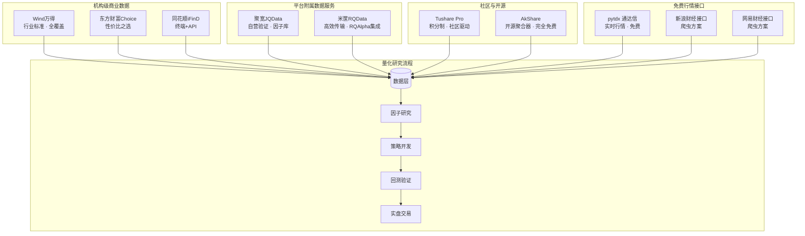
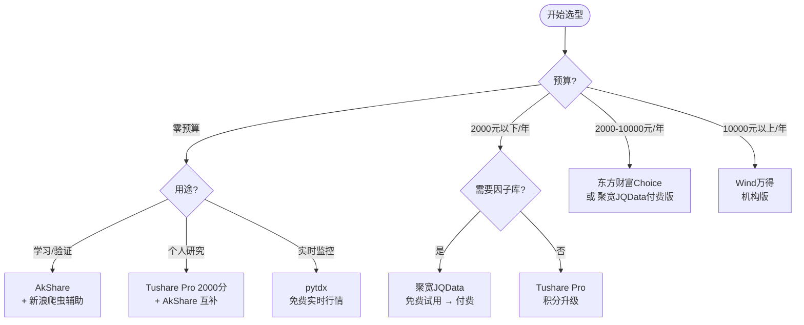

# A股量化数据源全景图

> [!abstract] 核心要点
> A股量化交易的数据源生态可划分为四大梯队：机构级商业数据（Wind万得、东方财富Choice）、平台附属数据服务（聚宽JQData、米筐RQData）、社区驱动的积分/开源方案（Tushare Pro、AkShare）、以及免费的行情软件接口与网页爬虫（pytdx通达信、新浪/网易财经）。选型的核心考量维度包括：数据覆盖范围、历史深度、更新频率、API限流策略、价格和数据质量。个人量化研究者推荐以 AkShare + Tushare Pro 为主力免费方案，中小私募可考虑聚宽JQData或米筐RQData，机构级用户则以 Wind万得为行业标配。

## 在知识体系中的位置

本笔记属于 **L1: 市场基础设施与数据工程** 层级中的 **数据源与API** 模块，是量化交易全链路的起点。数据源的选择直接决定了因子研究（L2）的广度与深度、策略回测（L3）的可靠性，以及实盘部署（L4）的可行性。高质量的数据是一切量化研究的地基——"Garbage in, garbage out"在量化领域尤为致命。

## 关键知识点

### Tushare Pro

**概述**：Tushare Pro 是国内最早也是最知名的Python金融数据接口之一，由社区开发者"挖地兔"创建。采用独特的**积分制度**控制数据访问权限，兼具免费入门与付费高级两种模式。

**积分制度详解**：
- **注册即得**：新用户注册获得100积分，完善资料再得20积分，合计120积分
- **免费获取途径**：推荐有效用户（50分/人）、提交Bug（5-50分）、贡献代码（100-500分）、发表文章（100-1000分）、在校学生/高校教师发布数据案例
- **付费获取**：捐助比例约 100元 = 1000积分；加入微信专业群送5000积分；QQ会员群200元
- **积分有效期**：一年，一年内不消耗不扣减

**积分与数据权限对应关系**：

| 积分等级 | 可用接口 | 典型数据 |
|----------|----------|----------|
| 120分（免费） | 基础接口 | 股票列表(stock_basic)、交易日历(trade_cal)、日线OHLCV(daily) |
| 2000分 | 中级接口 | 分钟线(stk_mins)、每日指标(daily_basic含PE/PB/市值)、资金流向(moneyflow) |
| 5000分 | 高级接口 | 龙虎榜席位数据、深度财务指标(fina_indicator)、复权因子(adj_factor) |

**数据覆盖**：
- 行情数据：Tick级到月线的完整频率光谱，覆盖沪深主板、科创板、创业板
- 财务数据：利润表、资产负债表、现金流量表、财务指标（ROE、毛利率等）
- 特色数据：涵盖退市股票历史数据（避免幸存者偏差）、上榜股票席位数据
- 宏观数据：GDP、CPI、M2等宏观经济指标

**API限流**：
- QPS（每秒查询数）与积分挂钩，基础用户约1-2次/秒，高积分用户可达10+次/秒
- 权限不足时返回"没有访问该接口的权限"错误
- 数据总量不设上限（在权限范围内）

**代码示例**：
```python
import tushare as ts

# 设置Token（注册后在个人主页获取）
ts.set_token('your_token_here')
pro = ts.pro_api()

# 获取股票列表
df_stocks = pro.stock_basic(exchange='', list_status='L',
                             fields='ts_code,symbol,name,area,industry,list_date')

# 获取日线行情
df_daily = pro.daily(ts_code='000001.SZ', start_date='20240101', end_date='20241231')

# 获取财务指标
df_fina = pro.fina_indicator(ts_code='000001.SZ', start_date='20200101',
                              fields='ts_code,ann_date,roe,grossprofit_margin')

# 通用行情接口（自动复权）
df_bar = ts.pro_bar(ts_code='000001.SZ', adj='qfq',
                     start_date='20240101', end_date='20241231')
```

**优势**：社区活跃、文档完善、Python生态友好、退市股票数据完整
**劣势**：高级数据需积分门槛、数据更新偶有延迟（T+1）、无实时行情推送

---

### AkShare

**概述**：AkShare 是一个完全开源免费的Python金融数据接口库，由"Albert King"主导开发，采用 Apache 2.0 开源协议。其核心设计理念是整合多个公开数据源（东方财富、同花顺、新浪财经等），提供统一的Pandas DataFrame输出格式。

**数据源架构**：AkShare 本身不是数据提供商，而是一个**数据聚合器**，底层对接：
- 东方财富（em后缀函数）—— 主力数据源
- 同花顺（ths后缀函数）
- 新浪财经（sina后缀函数）
- 网易财经
- 中国人民银行、国家统计局等官方源

**数据覆盖**：
- **股票**：日线/分钟线行情、板块概念、龙虎榜、融资融券、限售股解禁
- **基金**：ETF/LOF/开放式基金净值、持仓、规模
- **期货**：国内四大交易所日线行情、持仓排名
- **债券**：国债收益率曲线、可转债数据
- **指数**：沪深指数、中证指数、申万行业指数
- **宏观**：中国及全球宏观经济指标
- **另类数据**：板块轮动分析、资金流向、新股申购

**API限流**：
- 无官方限流（依赖底层数据源限制）
- 东方财富源：建议间隔0.5-1秒
- 同花顺源：反爬较严，需控制频率
- 建议批量获取时添加 `time.sleep(1)` 避免IP封禁

**代码示例**：
```python
import akshare as ak

# 获取A股实时行情（东方财富源）
df_realtime = ak.stock_zh_a_spot_em()

# 获取个股日K线（东方财富源，自动复权）
df_daily = ak.stock_zh_a_hist(symbol="000001", period="daily",
                               start_date="20240101", end_date="20241231",
                               adjust="qfq")

# 获取概念板块列表
df_concept = ak.stock_board_concept_name_em()

# 获取期货日线
df_futures = ak.futures_zh_daily_sina(symbol="RB0")

# 获取宏观数据 - CPI
df_cpi = ak.macro_china_cpi_yearly()

# 获取基金净值
df_fund = ak.fund_etf_hist_em(symbol="510300", period="daily",
                                start_date="20240101", end_date="20241231")
```

**优势**：完全免费开源、无需注册Token、覆盖面广、更新活跃（几乎每周更新）、社区文档好
**劣势**：依赖第三方网站稳定性、接口命名不够统一、部分数据源反爬后失效需等待修复、无SLA保障

---

### Wind万得

**概述**：Wind万得是中国金融市场的**事实标准**数据终端，地位类似于海外的Bloomberg。几乎所有公募基金、券商研究所、银行资管部门都以Wind作为主要数据来源。其量化API接口分为个人版（Wind金融终端附带）和机构版（Wind DataFeed / WDS）。

**产品线与价格**：

| 产品 | 价格（年费估算） | 适用对象 |
|------|------------------|----------|
| Wind金融终端（个人版） | 约 2-4万元/年 | 个人研究者、小型团队 |
| Wind机构版 | 约 10-30万元/年 | 私募、券商、公募 |
| Wind DataFeed（Server API） | 数十万元/年 | 量化团队、系统集成 |
| Wind学生版 | 免费（功能受限） | 在校学生 |

**数据覆盖**：
- 全球800万+金融指标，数百万独立数据源
- A股全市场：Level-1/Level-2行情、财务报表（原始+调整）、一致预期、分析师评级
- 债券：信用评级、YTM、利差、发行条款
- 宏观：EDB宏观数据库，中国及全球主要经济体
- 因子：Wind自有因子库（Barra风格因子、行业因子）
- 另类：ESG评分、舆情数据、供应链关系

**API接口（Python WindPy）**：
```python
from WindPy import w

# 启动Wind接口
w.start()

# 获取实时行情
data = w.wsq("000001.SZ", "rt_last,rt_vol,rt_amt")

# 获取历史日线
data = w.wsd("000001.SZ", "open,high,low,close,volume",
              "2024-01-01", "2024-12-31", "PriceAdj=F")

# 获取截面数据
data = w.wss("000001.SZ,600000.SH", "pe_ttm,pb_lf,mkt_cap_ard",
              "tradeDate=20241231")

# 获取财务数据
data = w.wsd("000001.SZ", "roe_ttm,grossmargin",
              "2020-01-01", "2024-12-31", "rptType=1;Period=Q")

# 获取宏观数据（EDB）
data = w.edb("M0001384", "2020-01-01", "2024-12-31")  # GDP

w.stop()
```

**数据质量**：
- 业界公认最高质量，有专业数据清洗和审核团队
- 财务数据经过人工审核校验，一致性好
- 支持千万级并发查询，核心系统稳定性高
- 历史数据深度：A股上市以来全部数据

**优势**：数据质量最高、覆盖最全、行业标准、技术支持好
**劣势**：价格昂贵、个人用户门槛高、部分接口使用需Excel插件

---

### 聚宽JoinQuant本地数据

**概述**：聚宽（JoinQuant）是国内领先的量化交易平台之一，其本地数据服务 JQData 通过 `jqdatasdk` Python包提供，允许用户在本地环境（非平台内）调用全市场数据。聚宽自营百亿级基金使用同一套数据，确保了数据质量的内在驱动力。

**版本与价格**：

| 版本 | 每日查询条数 | 价格 | 有效期 |
|------|-------------|------|--------|
| 免费试用版 | ~3,000条/天 | 免费 | 半年试用期 |
| 付费个人版 | 300万条/天 | ~1,998元/年起 | 一年 |
| 企业版 | 定制 | 需咨询 | 定制 |

**数据覆盖**：
- 股票：A股全市场行情（日线、分钟线至1min）、前/后复权
- 财务：valuation（估值）、indicator（财务指标）、balance（资产负债表）、income（利润表）、cash_flow（现金流量表），2005年至今，每交易日24:00更新
- 因子：Alpha因子库、CNE5/CNE6 Barra风险模型因子
- 其他：分钟级资金流、行业分类、指数成分、融资融券

**API限制**：
- 免费版每日3,000条查询上限（一次get_price返回多行算多条）
- 付费版300万条/天，基本满足日常研究
- 阿里云部署，5ms响应速度，带宽节省40%

**代码示例**：
```python
import jqdatasdk as jq

# 认证登录（注册 joinquant.com 获取账号）
jq.auth('your_phone', 'your_password')

# 获取股票日线行情
df = jq.get_price('000001.XSHE',
                   start_date='2024-01-01',
                   end_date='2024-12-31',
                   frequency='daily',
                   fields=['open', 'close', 'high', 'low', 'volume'])

# 获取财务数据
from jqdatasdk import query, valuation, indicator
q = query(valuation.code, valuation.pe_ratio, valuation.pb_ratio,
          indicator.roe).filter(valuation.code == '000001.XSHE')
df_fin = jq.get_fundamentals(q, date='2024-12-31')

# 获取行业分类
df_ind = jq.get_industry('000001.XSHE', date='2024-12-31')

# 查看剩余查询额度
print(jq.get_query_count())
```

**优势**：数据质量高（自营基金验证）、统一API设计简洁、因子库丰富、响应速度快
**劣势**：免费额度极少（3000条/天）、付费后仍有每日上限、半年试用期后必须付费

---

### 米筐RQData

**概述**：米筐（Ricequant）是国内知名量化平台，其数据服务RQData通过`rqdatac` Python客户端提供。技术架构上采用MessagePack序列化和TCP长连接，数据传输效率高。与自家开源回测框架RQAlpha无缝集成。

**技术特点**：
- **高效协议**：MessagePack二进制序列化，传输流量约为实际数据量的1/3
- **TCP长连接**：流式传输，避免HTTP开销
- **客户端-服务端架构**：数据服务独立于量化SDK

**数据覆盖**：
- 股票行情：日线、分钟线（1min/5min/15min/30min/60min）
- 财务数据：三大报表 + 衍生财务指标
- 衍生品：期货、期权完整行情
- 基金：公募/私募基金净值、持仓
- 风险因子：Barra风格因子、行业因子
- 宏观经济：国内外宏观指标
- 另类数据：新闻舆情、ESG评分
- **无实时行情推送**：仅支持查询模式，盘后数据合成计算

**价格**：未公开定价，需在ricequant.com申请试用或正式账户。据社区反馈，个人版约2,000-3,000元/年，机构版更高。有免费试用期。

**API限制**：每日流量配额限制（可通过API查询剩余额度），具体额度与账户等级挂钩。

**代码示例**：
```python
import rqdatac

# 初始化（使用License文件或账密）
rqdatac.init()

# 获取日线行情
df = rqdatac.get_price('000001.XSHE',
                        start_date='2024-01-01',
                        end_date='2024-12-31',
                        frequency='1d',
                        fields=['open', 'close', 'high', 'low', 'volume'],
                        adjust_type='pre')

# 获取财务数据
df_fin = rqdatac.get_fundamentals(
    rqdatac.query(rqdatac.fundamentals.eod_derivative_indicator.pe_ratio),
    entry_date='2024-12-31',
    interval='1q',
    report_quarter=True
)

# 获取指数成分
components = rqdatac.index_components('000300.XSHG', date='2024-12-31')

# 查看流量使用情况
print(rqdatac.get_quota())
```

**优势**：传输协议高效、与RQAlpha回测框架无缝对接、数据质量好、API设计清晰
**劣势**：价格不透明、无实时推送、社区活跃度不如聚宽

---

### 通达信/同花顺数据接口

#### pytdx（通达信数据接口）

**概述**：pytdx 是纯Python实现的通达信行情数据读取接口，通过连接通达信公共行情服务器获取数据。完全免费，无需注册，但依赖公共服务器稳定性。

**数据覆盖**：
- 实时行情：Level-1行情（买一卖一）
- K线数据：日线、周线、月线、1/5/15/30/60分钟线
- 分笔成交：逐笔成交明细
- 基本面：有限的财务摘要信息
- **不覆盖**：完整财务报表、因子数据、宏观数据

**公共服务器**：
```
119.147.212.81:7709  (上海)
120.76.152.91:7709   (深圳)
```

**代码示例**：
```python
from pytdx.hq import TdxHq_API

api = TdxHq_API()

with api.connect('119.147.212.81', 7709):
    # 获取实时行情
    data = api.get_security_quotes([(0, '000001'), (1, '600000')])

    # 获取日K线（最近800根）
    data = api.get_security_bars(9, 0, '000001', 0, 800)
    # 9=日线, 8=1分钟, 0=5分钟, 1=15分钟, 2=30分钟, 3=60分钟

    # 获取分笔成交
    data = api.get_transaction_data(0, '000001', 0, 2000)

    # 获取股票列表
    data = api.get_security_list(0, 0)  # 0=深圳, 1=上海
```

**优势**：完全免费、无需注册、实时行情直接获取、纯Python无依赖
**劣势**：公共服务器不稳定、数据深度有限（K线最多约800根）、无财务数据、无官方维护保障

#### 同花顺（Funcat）

**概述**：Funcat库允许在Python中使用同花顺/通达信公式语法，主要用于技术指标移植，而非直接的数据获取接口。

```python
# pip install funcat
from funcat import *

# 移植同花顺公式
# MA5 = MA(CLOSE, 5)
set_data_backend(AkShareDataBackend())
T("20241231")
S("000001")
print(MA(CLOSE, 5))
```

#### 同花顺iFinD

同花顺也提供机构级数据终端iFinD，功能类似Wind，价格约1-3万元/年，提供Python API（iFinDPy），但市场占有率远低于Wind。

---

### 东方财富Choice数据

**概述**：东方财富旗下的Choice金融终端提供量化API接口（EMQuantAPI），支持Python、R、C++、C#等多语言，可在Mac/Linux/Windows运行。作为东方财富的数据产品线，与其庞大的互联网用户基础形成协同。

**核心API函数**：

| 函数 | 功能 | 说明 |
|------|------|------|
| `c.css()` | 截面数据 | 获取某一时点的多标的多字段数据 |
| `c.csd()` | 时间序列 | 获取时间段内的历史数据 |
| `c.edb()` | 宏观指标 | 获取EDB宏观经济数据库 |
| `c.cfn()`/`c.cnq()` | 资讯查询 | 公告、研报、新闻 |
| `c.cps()` | 板块成分 | 获取板块内证券列表 |

**价格**：未公开，需联系东方财富销售团队。据社区反馈，个人版约5,000-10,000元/年，机构版更高。比Wind便宜但覆盖面略窄。

**代码示例**：
```python
from EmQuantAPI import c
import pandas as pd

# 登录
c.start()

# 获取截面数据（股票名称、上市日期）
data = c.css("000001.SZ,600000.SH", "NAME,LISTDATE", "")
if data.ErrorMsg == "success":
    df = pd.DataFrame(data.Data).T
    df.columns = data.Indicators
    print(df)

# 获取时间序列数据（收盘价）
data = c.csd("000001.SZ", "CLOSE", "2024-01-01", "2024-12-31",
              "Period=1,AdjustFlag=1")

# 获取宏观指标
data = c.edb("EMM00087117", "2020-01-01", "2024-12-31")  # GDP

# 登出
c.stop()
```

**优势**：东方财富生态协同、API设计规范、多语言支持、数据覆盖较全
**劣势**：价格不透明、市场认可度不如Wind、Python社区文档不如Tushare/AkShare丰富

---

### 新浪/网易财经爬虫方案

> [!warning] 风险提示
> 爬虫方案依赖非官方接口，存在随时失效的风险，且可能违反网站服务条款。仅建议作为辅助验证数据源，不宜作为生产环境主力数据源。

#### 新浪财经接口

**可用接口**：
- **实时行情**：`http://hq.sinajs.cn/list=sh601006`（GBK编码，逗号分隔）
- **K线数据**：`http://money.finance.sina.com.cn/quotes_service/api/json_v2.php/CN_MarketData.getKLineData?symbol=sz000001&scale=60&ma=no&datalen=1023`
- **历史成交明细**：XLS格式下载

**限制**：历史K线最多**1023个节点**；无官方文档；JSON格式需手动处理注释干扰；需添加User-Agent防反爬。

```python
import requests
import json

# 实时行情
url = "http://hq.sinajs.cn/list=sh600000"
headers = {'User-Agent': 'Mozilla/5.0'}
resp = requests.get(url, headers=headers).content.decode('GBK')
fields = resp.split('="')[1].rstrip('";').split(',')
print(f"名称: {fields[0]}, 开盘: {fields[1]}, 当前价: {fields[3]}")

# K线数据（60分钟线，最多1023根）
url = ("http://money.finance.sina.com.cn/quotes_service/api/json_v2.php/"
       "CN_MarketData.getKLineData?symbol=sz000001&scale=60&ma=no&datalen=1023")
data = json.loads(requests.get(url, headers=headers).text)
for bar in data[:3]:
    print(f"时间: {bar['day']}, 开: {bar['open']}, 收: {bar['close']}")
```

#### 网易财经接口

**可用接口**：
- **分时图**：`http://img1.money.126.net/data/feed/0/today/0601857.json`（0=沪市，1=深市）
- **历史成交明细**：`http://quotes.money.163.com/cjmx/2024/20240115/0601857.xls`（限近5日）

**限制**：无分钟线数据；历史成交仅5日内；建议闭市后爬取。

```python
import requests
import pandas as pd

# 网易历史日线（CSV格式，覆盖完整历史）
url = ("http://quotes.money.163.com/service/chddata.html?"
       "code=0000001&start=20240101&end=20241231"
       "&fields=TCLOSE;HIGH;LOW;TOPEN;LCLOSE;CHG;PCHG;TURNOVER;VOTURNOVER;VATURNOVER")
df = pd.read_csv(url, encoding='GBK')
print(df.head())
```

**优势**：完全免费、无需注册、实时行情获取方便
**劣势**：无SLA保障、接口随时可能变更或封禁、数据覆盖有限、需自行处理数据清洗

---

## 数据源对比矩阵

| 数据源 | 类型 | 价格 | 数据覆盖 | 历史深度 | 更新频率 | API限流 | 数据质量 | 适合人群 |
|--------|------|------|----------|----------|----------|---------|----------|----------|
| **Tushare Pro** | 社区积分制 | 免费(基础)/200-500元(高级) | 股票/财务/宏观/指数 | 上市以来 | T+1(日线) | QPS与积分挂钩(1-10次/秒) | 中等偏上 | 个人研究者/入门 |
| **AkShare** | 开源免费 | 完全免费 | 股票/期货/基金/债券/宏观 | 依赖底层源 | 实时+日线 | 无官方限流(需自控) | 中等 | 个人/学习/验证 |
| **Wind万得** | 商业机构级 | 2-30万元/年 | 全市场全品种(800万+指标) | 上市以来 | 实时+盘后 | 高并发支持 | 最高(行业标准) | 机构/专业团队 |
| **聚宽JQData** | 平台附属 | 免费(半年)/1998元/年 | 股票/财务/因子/风险模型 | 2005年至今 | T+0(盘后24:00) | 3000条/天(免费)/300万条/天(付费) | 高(自营验证) | 量化研究者 |
| **米筐RQData** | 平台附属 | ~2000-3000元/年 | 股票/期货/期权/因子/ESG | 上市以来 | T+0(盘后) | 日流量配额制 | 高 | 量化研究者/RQAlpha用户 |
| **pytdx(通达信)** | 开源免费 | 完全免费 | 行情/K线/分笔(无财务) | ~800根K线 | 实时 | 依赖公共服务器 | 中等(Level-1) | 行情监控/辅助 |
| **东方财富Choice** | 商业 | ~5000-10000元/年 | 股票/基金/宏观/资讯 | 上市以来 | 实时+盘后 | 账户级别限制 | 较高 | 中小机构/研究 |
| **新浪/网易爬虫** | 免费爬虫 | 完全免费 | 行情/K线(有限) | 新浪1023根/网易5日明细 | 实时(非官方) | IP频率限制 | 低(无保障) | 临时/验证/学习 |

## 参数速查表

| 参数 | 说明 | 典型值 |
|------|------|--------|
| Tushare Token | 个人API密钥 | 注册后在用户中心获取，40位字符串 |
| Tushare基础积分 | 免费获取 | 120分（注册100+资料20） |
| AkShare安装 | pip命令 | `pip install akshare --upgrade` |
| JQData免费额度 | 每日查询条数 | 3,000条/天 |
| JQData付费额度 | 每日查询条数 | 300万条/天 |
| pytdx服务器 | 公共行情服务器 | 119.147.212.81:7709 |
| 新浪K线上限 | 单次请求最大数据量 | 1,023个节点 |
| Wind API启动 | Python调用 | `from WindPy import w; w.start()` |
| Choice API启动 | Python调用 | `from EmQuantAPI import c; c.start()` |
| RQData初始化 | Python调用 | `import rqdatac; rqdatac.init()` |

## 示意图

### A股量化数据源生态全景



### 数据源选型决策流程



## 选型决策指南

> [!example] 条件 → 选择
>
> | 条件/场景 | 推荐方案 | 排除/避免 | 原因 |
> |-----------|----------|-----------|------|
> | 零预算 + 初学者 | AkShare | Wind/Choice | 完全免费、无注册门槛、覆盖面广 |
> | 零预算 + 需要财务数据 | Tushare Pro（积分提升至2000） | 新浪/网易爬虫 | 爬虫无财务数据，Tushare有完整三大报表 |
> | 零预算 + 需要实时行情 | pytdx + AkShare | JQData免费版 | pytdx直连通达信服务器获取实时行情 |
> | 个人研究（年预算2000元内） | Tushare Pro 5000积分 + AkShare | Wind | 性价比最高组合，互补覆盖 |
> | 量化回测为主 | 聚宽JQData付费版 或 米筐RQData | 新浪爬虫 | 数据质量有保障，与回测框架集成好 |
> | 中小私募（年预算1-5万） | 东方财富Choice 或 聚宽JQData企业版 | 免费方案 | 需要SLA保障和数据完整性 |
> | 机构级/公募基金 | Wind万得机构版 | 其他所有 | 行业标准，合规审计认可 |
> | 期货/衍生品为主 | 米筐RQData | Tushare(期货弱) | RQData期货期权数据更完整 |
> | AI/机器学习因子挖掘 | 聚宽JQData（CNE5/CNE6因子） | pytdx/爬虫 | 需要现成因子库和风险模型 |
> | 多数据源交叉验证 | AkShare + Tushare Pro + pytdx | 单一来源 | 免费组合实现多源验证 |

## Python接入代码模板

### 统一数据获取封装示例

```python
"""
A股量化数据源统一封装 —— Hello World模板
覆盖主流数据源的最小可用代码
"""

# ============================================================
# 1. Tushare Pro
# ============================================================
def demo_tushare():
    """Tushare Pro: 注册 tushare.pro 获取Token"""
    import tushare as ts
    ts.set_token('your_token_here')
    pro = ts.pro_api()

    # 日线行情
    df = pro.daily(ts_code='000001.SZ',
                    start_date='20240101', end_date='20241231')
    print(f"[Tushare] 获取 {len(df)} 条日线数据")
    return df


# ============================================================
# 2. AkShare
# ============================================================
def demo_akshare():
    """AkShare: 无需注册，pip install akshare"""
    import akshare as ak

    # A股日线（东方财富源，前复权）
    df = ak.stock_zh_a_hist(symbol="000001", period="daily",
                             start_date="20240101", end_date="20241231",
                             adjust="qfq")
    print(f"[AkShare] 获取 {len(df)} 条日线数据")
    return df


# ============================================================
# 3. Wind万得（需安装Wind终端）
# ============================================================
def demo_wind():
    """Wind: 需安装Wind金融终端并登录"""
    from WindPy import w
    w.start()

    data = w.wsd("000001.SZ", "open,high,low,close,volume",
                  "2024-01-01", "2024-12-31", "PriceAdj=F")
    print(f"[Wind] 获取 {len(data.Data[0])} 条日线数据")

    w.stop()
    return data


# ============================================================
# 4. 聚宽 JQData
# ============================================================
def demo_jqdata():
    """聚宽: 注册 joinquant.com 获取账号"""
    import jqdatasdk as jq
    jq.auth('your_phone', 'your_password')

    df = jq.get_price('000001.XSHE',
                       start_date='2024-01-01', end_date='2024-12-31',
                       frequency='daily')
    print(f"[JQData] 获取 {len(df)} 条日线数据")
    print(f"[JQData] 剩余额度: {jq.get_query_count()}")
    return df


# ============================================================
# 5. 米筐 RQData
# ============================================================
def demo_rqdata():
    """米筐: 注册 ricequant.com 获取License"""
    import rqdatac
    rqdatac.init()

    df = rqdatac.get_price('000001.XSHE',
                            start_date='2024-01-01', end_date='2024-12-31',
                            frequency='1d', adjust_type='pre')
    print(f"[RQData] 获取 {len(df)} 条日线数据")
    return df


# ============================================================
# 6. pytdx（通达信）
# ============================================================
def demo_pytdx():
    """pytdx: 无需注册，pip install pytdx"""
    from pytdx.hq import TdxHq_API
    import pandas as pd

    api = TdxHq_API()
    with api.connect('119.147.212.81', 7709):
        # 获取日K线（最近100根）
        data = api.get_security_bars(9, 0, '000001', 0, 100)
        df = api.to_df(data)
        print(f"[pytdx] 获取 {len(df)} 条日线数据")
        return df


# ============================================================
# 7. 东方财富 Choice
# ============================================================
def demo_choice():
    """Choice: 需安装EMQuantAPI"""
    from EmQuantAPI import c
    c.start()

    data = c.csd("000001.SZ", "CLOSE,VOLUME",
                  "2024-01-01", "2024-12-31", "Period=1,AdjustFlag=1")
    print(f"[Choice] 状态: {data.ErrorMsg}")

    c.stop()
    return data


# ============================================================
# 8. 新浪财经爬虫
# ============================================================
def demo_sina():
    """新浪: 无需注册，直接HTTP请求"""
    import requests
    import json

    # 实时行情
    url = "http://hq.sinajs.cn/list=sh600000"
    headers = {'User-Agent': 'Mozilla/5.0', 'Referer': 'http://finance.sina.com.cn'}
    resp = requests.get(url, headers=headers).content.decode('GBK')
    fields = resp.split('="')[1].rstrip('";').split(',')
    print(f"[新浪] {fields[0]} 当前价: {fields[3]}")

    # K线数据
    url = ("http://money.finance.sina.com.cn/quotes_service/api/json_v2.php/"
           "CN_MarketData.getKLineData?symbol=sh600000&scale=240&ma=no&datalen=100")
    data = json.loads(requests.get(url, headers=headers).text)
    print(f"[新浪] 获取 {len(data)} 条K线数据")
    return data


# ============================================================
# 主程序：逐一测试
# ============================================================
if __name__ == '__main__':
    # 按可用性依次测试（免费源优先）
    for name, func in [
        ('AkShare', demo_akshare),
        ('pytdx', demo_pytdx),
        ('新浪', demo_sina),
        # 以下需要账号/付费
        # ('Tushare', demo_tushare),
        # ('JQData', demo_jqdata),
        # ('RQData', demo_rqdata),
        # ('Wind', demo_wind),
        # ('Choice', demo_choice),
    ]:
        try:
            func()
        except Exception as e:
            print(f"[{name}] 失败: {e}")
```

## 常见误区

1. **误区：免费数据源质量一定差**
   事实：AkShare和Tushare Pro的日线行情数据质量已足够满足大部分因子研究需求。数据质量的差异主要体现在财务数据的一致性处理、复权算法的准确性以及异常值清洗上。

2. **误区：有了Wind就不需要其他数据源**
   事实：即使是Wind数据也可能存在错误（如某些小盘股的财务数据异常）。专业量化团队通常使用2-3个数据源进行交叉验证。

3. **误区：爬虫方案可以替代正规数据源**
   事实：新浪/网易等爬虫接口缺乏SLA保障，接口随时可能变更。历史数据深度有限（新浪仅1023根K线），不适合作为生产环境的主力数据源。

4. **误区：积分越高Tushare数据越准**
   事实：Tushare的积分制度控制的是数据**访问权限**而非数据质量。同一个接口返回的数据质量是一致的，积分决定的是能访问哪些接口。

5. **误区：Level-2数据对所有策略都有价值**
   事实：Level-2深度行情（十档盘口、逐笔委托）主要对日内高频策略有价值。对于日频及以上的中低频策略，Level-1数据完全够用，无需为此支付额外费用。

6. **误区：数据量越大越好**
   事实：对于A股回测，2010年以后的数据更具参考价值（2010年前市场制度差异大）。过长的历史数据反而可能引入制度变迁噪音（如涨跌停板制度变化、T+1制度确立等）。

7. **误区：AkShare可以获取实时Tick数据**
   事实：AkShare的"实时行情"实际上是3秒级快照（东方财富源），并非真正的逐笔Tick数据。真正的Tick数据需要Level-2行情订阅。

## 与其他主题的关联

- **上游依赖**：数据源是整个量化研究链路的起点，数据质量直接影响因子有效性和策略回测可靠性
- **下游影响**：数据存储方案（MySQL/ClickHouse/HDF5）的选择需与数据源的输出格式匹配
- **交叉验证**：多数据源交叉比对是提升数据质量的关键手段，建议至少使用两个独立数据源
- **成本优化**：数据源成本是量化团队的主要固定开支之一，选型需兼顾当前需求和未来扩展

## 相关主题

- [[A股交易制度全解析]] — 理解交易制度（T+1、涨跌停、集合竞价）是正确解读行情数据的前提
- [[A股市场微观结构深度研究]] — 市场微观结构决定了不同数据频率（Tick/分钟/日线）的信息含量
- [[量化数据工程实践]] — 从数据源获取的原始数据需经过清洗、对齐、存储才能用于研究
- [[多因子模型构建实战]] — 因子研究对数据的时间对齐、复权处理、缺失值填充有严格要求
- [[A股回测框架实战与避坑指南]] — 数据源的选择需与回测框架（RQAlpha/Backtrader/Zipline）兼容
- [[交易成本建模与执行优化]] — 数据源成本是量化交易总成本的重要组成部分
- [[量化研究Python工具链搭建]] — 各数据源SDK的安装配置是开发环境搭建的核心步骤

## 来源参考

1. Tushare Pro 官方文档 — https://tushare.pro/document/1
2. AkShare 官方文档 — https://akshare.akfamily.xyz/
3. Wind万得官网 — https://www.wind.com.cn
4. 聚宽JQData SDK — https://github.com/JoinQuant/jqdatasdk
5. 米筐RQData文档 — https://www.ricequant.com/doc/rqdata/python/
6. pytdx GitHub仓库 — https://gitee.com/nbgxl/pytdx
7. 东方财富Choice量化API — https://quantapi.eastmoney.com/
8. 新浪财经数据接口逆向整理 — https://blog.sina.com.cn/s/blog_543e73a80102yg3k.html
