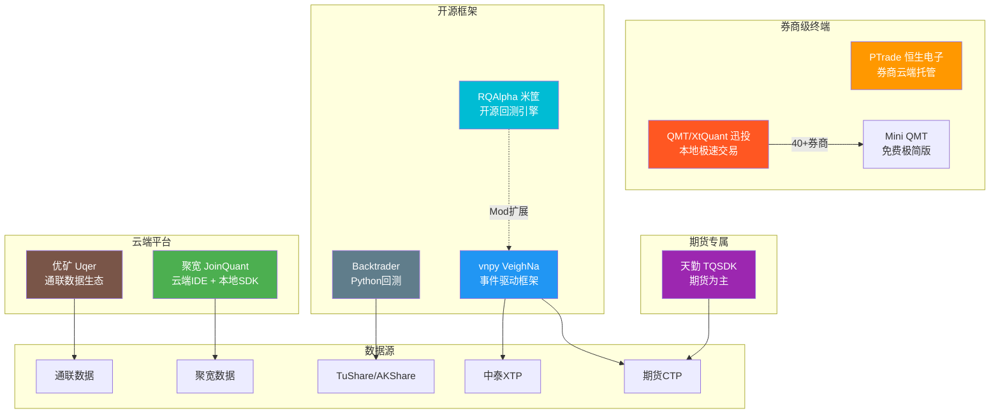
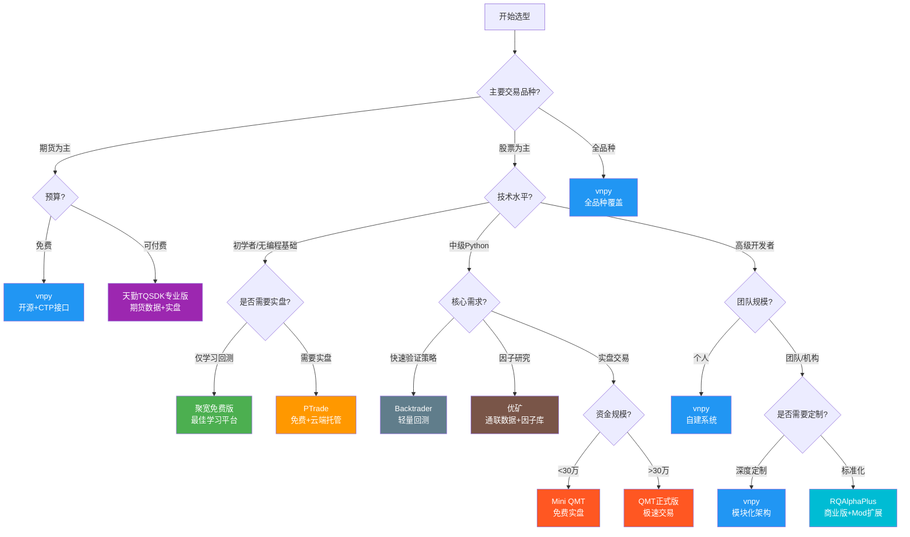

# A股量化交易平台深度对比

## 核心要点

> [!summary] 关键结论
> 1. **没有完美平台**：每个平台都有明确的适用场景，选型核心在于匹配自身需求阶段
> 2. **券商级 vs 开源级**：PTrade/QMT 拥有原生券商通道优势，vnpy/Backtrader 拥有灵活性优势
> 3. **云端 vs 本地**：聚宽/优矿云端易上手但受限，QMT/vnpy本地部署灵活但需运维能力
> 4. **实盘是分水岭**：回测人人能做，但实盘接入能力差异巨大，这是平台选型的核心考量
> 5. **2024-2025趋势**：AI量化模块成为标配（vnpy 4.0 Alpha模块、优矿ML集成），Mini QMT免费化降低门槛

## 一、聚宽 JoinQuant

### 平台定位
面向量化爱好者和中小机构的一站式云端量化平台，国内最大的量化交易社区。4500+金融机构使用。

### 核心功能
- **在线IDE**：基于Jupyter的云端研究环境，支持Python 2/3
- **本地SDK（jqdatasdk）**：本地Python环境调用聚宽数据API，支持70+接口
- **回测引擎**：支持日级和分钟级回测，结果实时显示
- **实盘交易**：与第一创业证券合作推出实盘（一创聚宽量化投研平台）
- **数据覆盖**：A股、期货、期权、基金、宏观数据，含2005年至今完整Level-2数据
- **量化课堂**：100+节课程，从编程基础到策略实例

### 产品线
| 产品 | 说明 |
|------|------|
| 多因子选股 | 综合多因子构建投资组合 |
| T0策略 | 基于底仓做T+0，多家头部券商采购 |
| 算法交易 | 主动拆单算法，降低冲击成本 |
| CTA策略 | 期货趋势策略 |

### 费用模式
- **免费版**：在线回测（有频次限制）、社区访问、量化课堂
- **SDK试用**：申请后免费使用jqdatasdk，有每日调用限额
- **机构版**：实盘交易、私有化部署，需商务洽谈

### 优缺点

**优点**：
- 社区最活跃，中文文档最丰富，新手最友好
- 数据质量高，覆盖面广，含停复牌、复权等专业清洗
- 本地SDK可脱离网页环境独立使用
- Docker隔离、HTTPS传输，安全性较高

**缺点**：
- 免费版回测限时，高级功能需付费
- 实盘仅限合作券商（第一创业），通道有限
- 云端策略存在泄露风险
- 不开源，无法自定义底层引擎

### 适用场景
量化学习入门、因子研究、策略原型开发、中小机构研究

### Hello World 代码示例

```python
# === 聚宽在线IDE策略示例 ===
def initialize(context):
    """初始化函数，设置基准和标的"""
    set_benchmark('000300.XSHG')  # 沪深300基准
    set_option('use_real_price', True)
    g.security = '000001.XSHE'  # 平安银行

def handle_data(context, data):
    """每日调用的交易逻辑"""
    security = g.security
    # 获取最近5日收盘价
    close_data = get_bars(security, count=5, unit='1d', fields=['close'])
    # 简单均线策略：5日均线上穿买入
    MA5 = close_data['close'].mean()
    current_price = close_data['close'][-1]

    cash = context.portfolio.available_cash
    if current_price > MA5:
        order_value(security, cash)  # 满仓买入
    elif current_price < MA5 and security in context.portfolio.positions:
        order_target(security, 0)  # 清仓卖出

# === 本地SDK数据获取示例 ===
import jqdatasdk
jqdatasdk.auth('your_username', 'your_password')

# 获取平安银行日线数据
df = jqdatasdk.get_price(
    "000001.XSHE",
    start_date='2024-01-01',
    end_date='2024-12-31',
    frequency='daily'
)
print(df.head())
```

---

## 二、米筐 RiceQuant / RQAlpha

### 平台定位
RQAlpha是米筐科技开发的开源Python回测框架，RiceQuant是其云端平台。商业版RQAlphaPlus提供更丰富的数据和分析能力。

### 核心功能
- **RQAlpha（开源）**：日级别回测引擎，Mod Hook插件化架构
- **RQAlphaPlus（商业）**：分钟/Tick数据、GUI、实时风控
- **RQData**：行情、基本面、财务数据接口
- **RQSDK**：一站式本地量化开发套件

### 技术特点
- **Mod机制**：通过Hook接口扩展第三方库（撮合逻辑、风控模块、API扩展）
- **性能**：RQAlpha 2.0回测速度提升5倍，部分数据调用提升20倍
- **混合策略**：支持期货/股票混合策略回测
- **报告输出**：图形化报告和CSV导出

### 费用模式
- **RQAlpha开源版**：完全免费（GitHub），日级别数据
- **RQAlphaPlus**：商业授权，支持分钟/Tick数据
- **RQData**：数据服务付费订阅
- **RQSDK**：一站式套件付费

### 优缺点

**优点**：
- 开源版完全免费，代码透明可审计
- Mod插件化设计，扩展性极强（可对接vnpy实盘）
- Python 2/3兼容，测试覆盖率>80%
- 适合机构定制化开发

**缺点**：
- 开源版仅支持日级别数据，分钟/Tick需商业版
- 社区活跃度近年下降，GitHub更新频率降低
- 实盘功能依赖扩展Mod，非开箱即用
- 中文文档相比聚宽偏少

### 适用场景
策略研究、机构定制开发、因子回测、需要深度定制的团队

### Hello World 代码示例

```python
# === RQAlpha 策略示例 ===
# 保存为 strategy.py，命令行运行：
# rqalpha run -f strategy.py -s 2024-01-01 -e 2024-12-31
#   --account stock 100000 --benchmark 000300.XSHG --plot

def init(context):
    """初始化"""
    context.stock = "000001.XSHE"
    context.fired = False

def handle_bar(context, bar_dict):
    """每日K线回调"""
    if not context.fired:
        # 满仓买入平安银行
        order_percent(context.stock, 1.0)
        context.fired = True

def before_trading(context):
    """每日开盘前"""
    pass

def after_trading(context):
    """每日收盘后"""
    pass
```

---

## 三、优矿 Uqer

### 平台定位
通联数据旗下云端量化研究平台，以高质量金融大数据和企业级因子库为核心竞争力。

### 核心功能
- **数据优势**：通联数据提供深度清洗的财务数据（Point-in-Time特性），行业概念分类
- **免费因子库**：200+量价/基本面因子
- **机器学习集成**：内置scikit-learn等ML库，支持因子挖掘和模型训练
- **回测框架**：日线/全A股回测，支持多因子组合构建
- **版本分级**：标准版云端、专业版本地客户端（Windows/Mac/Linux）

### 费用模式
| 版本 | 价格 | 关键能力 |
|------|------|----------|
| 免费版 | 免费 | 云端回测（1G内存），T+1数据延迟 |
| 专业版 | 付费 | 本地客户端（8G+内存），实时数据，ML支持 |
| 机构版 | 商务洽谈 | 私有化部署，API无限制 |

### 优缺点

**优点**：
- 财务数据质量业界领先（通联数据底层支持）
- Point-in-Time数据避免前视偏差（look-ahead bias）
- 免费200+因子开箱即用
- 机器学习工具链完整

**缺点**：
- 免费版内存仅1G，复杂回测受限
- 无期货/期权回测能力
- 新手友好度不如聚宽
- 社区活跃度偏低，近年更新节奏放缓

### 适用场景
基本面因子研究、财务数据分析、机器学习量化、机构级因子库建设

### Hello World 代码示例

```python
# === 优矿平台策略示例 ===
start = '2024-01-01'
end = '2024-12-31'
benchmark = 'HS300'
universe = DynamicUniverse('HS300')
capital_base = 1000000
freq = 'd'
refresh_rate = 20  # 每20个交易日调仓

def initialize(account):
    pass

def handle_data(account):
    """调仓逻辑：按PE选股"""
    # 获取因子数据
    universe = account.universe
    pe_data = DataAPI.MktStockFactorsOneDayGet(
        secID=universe,
        field=['secID', 'PE']
    )
    # 选PE最低的20只
    pe_data = pe_data.sort_values('PE').head(20)
    target_stocks = pe_data['secID'].tolist()

    # 等权配置
    weight = 1.0 / len(target_stocks)
    for stock in target_stocks:
        order_pct_to(stock, weight)
```

---

## 四、恒生电子 PTrade

### 平台定位
恒生电子开发的券商级量化交易平台，面向股票场景，策略运行在券商云端服务器。

### 核心功能
- **云端运行**：策略托管在券商服务器，无需本地开机
- **支持品种**：普通股票、两融、ETF申赎、可转债
- **回测能力**：分钟/日线级回测，提供收益曲线、每日盈亏、Alpha等报告
- **AI增强（2024+）**：自然语言编程、零代码策略、AI纠错
- **安全性**：券商级安全保障，Docker隔离

### 费用模式
- **免费**：指定券商开户即可使用（如国金证券、华鑫证券等）
- **门槛**：部分券商要求一定资金量
- **无额外软件费用**

### 优缺点

**优点**：
- 免费使用（券商开户即可），零成本入门
- 云端运行，策略托管无需本地运维
- API与聚宽类似，易上手迁移
- 券商LDP极速通道，交易速度快
- AI功能降低编程门槛

**缺点**：
- 不支持Tick级回测和参数优化
- 品种有限（无期权、期货）
- 策略需上传至券商服务器，存在泄露风险
- 外网访问受限，无法自由调用外部数据
- 不支持本地文件直读，需手动上传
- 实盘策略个数受限

### 适用场景
股票中低频策略、散户入门实盘、ETF量化、可转债策略

### Hello World 代码示例

```python
# === PTrade 策略示例 ===
def initialize(context):
    """初始化"""
    g.security = '000001.SZ'
    set_universe([g.security])
    set_benchmark('000300.SZ')

def handle_data(context, data):
    """每分钟/每日回调"""
    security = g.security
    # 获取历史数据
    hist = data.attribute_history(security, 20, '1d', ['close'])
    ma20 = hist['close'].mean()
    current = data.current(security, 'close')

    cash = context.portfolio.cash
    positions = context.portfolio.positions

    if current > ma20 and security not in positions:
        order_value(security, cash * 0.95)
    elif current < ma20 and security in positions:
        order_target(security, 0)

def before_trading_start(context, data):
    """盘前处理"""
    pass
```

---

## 五、迅投 QMT / XtQuant

### 平台定位
迅投科技开发的专业级量化交易终端，支持QMT正式版（全功能）和Mini QMT（极简免费版），40+券商通道支持。

### QMT正式版 vs Mini QMT 对比

| 维度 | QMT正式版 | Mini QMT（免费版） |
|------|-----------|-------------------|
| 界面 | 完整（行情+交易+研究+风控） | 极简（行情/交易置灰） |
| 策略语言 | Python + VBA | Python + C++（xtquant外部调用） |
| 回测 | 内置极速回测 | 无内置回测 |
| 行情 | 全市场五档+Tick+盘口回放 | 简化行情 |
| 风控 | 多层次并行风控 | 无内置风控 |
| 延迟 | 单笔<1ms | 低延迟报单 |
| 费用 | 需券商开通，有资金门槛 | 免费 |
| Python版本 | 内置Python环境 | Python 3.6-3.11 |

### 核心优势
- **低延迟**：单笔委托<1ms，全内存极速交易
- **多券商**：40+券商通道，市场覆盖最广
- **本地运行**：策略本地加密运行，安全性高
- **全品种**：股票、期货、期权、可转债
- **智能拆单（2024新增）**：算法交易降低冲击

### 费用模式
- **Mini QMT**：免费，极简模式
- **QMT正式版**：券商开通，通常需30-50万资金门槛
- **各券商政策不同**，部分券商（如国金、华鑫）门槛较低

### 优缺点

**优点**：
- 实盘能力最强，延迟最低
- 多券商支持，不绑定单一券商
- 本地运行安全可控
- Mini QMT免费降低入门门槛
- xtquant支持外部Python调用，灵活性高

**缺点**：
- 正式版资金门槛高
- Mini QMT无内置回测和风控
- 学习曲线陡峭，文档质量参差
- 需要本地电脑持续开机运行
- Mini QMT功能显著弱于正式版

### 适用场景
中高频交易、多券商管理、专业个人投资者、私募基金

### Hello World 代码示例

```python
# === Mini QMT + xtquant 行情获取示例 ===
from xtquant import xtdata
import time

# 下载平安银行日线历史数据
xtdata.download_history_data("000001.SZ", period="1d", incrementally=True)

# 获取历史行情
history = xtdata.get_market_data_ex(
    [], ["000001.SZ"], period="1d", count=20
)
print(history["000001.SZ"].tail())

# 订阅实时行情
xtdata.subscribe_quote("000001.SZ", period="1d", count=-1)
time.sleep(1)
realtime = xtdata.get_market_data_ex([], ["000001.SZ"], period="1d")
print(realtime["000001.SZ"].tail())

# === xtquant 交易下单示例 ===
from xtquant import xttrader
from xtquant.xttrader import XtQuantTrader, StockAccount, xtconstant

path = r'D:\迅投极速交易终端\userdata_mini'
session_id = 123456

xt_trader = XtQuantTrader(path, session_id)
connect_result = xt_trader.connect()
print(f"连接结果: {connect_result}")  # 0=成功

account = StockAccount('your_account_id')

# 限价买入 平安银行 1000股 @ 10.50元
order_id = xt_trader.order_stock_async(
    account, '000001.SZ', xtconstant.STOCK_BUY, 1000,
    xtconstant.FIX_PRICE, 10.50, 'my_strategy', 'order_001'
)
print(f"委托ID: {order_id}")
```

---

## 六、天勤 TQSDK

### 平台定位
信易科技开发的Python量化交易SDK，以期货为主但支持股票/ETF期权。强调"一行代码切换回测/模拟/实盘"。

### 核心功能
- **Tick级回测**：高精度回测引擎，支持多品种跨周期
- **实盘交易**：对接130+期货公司，支持多账户/多策略隔离
- **数据服务**：期货2016年起、股票2018年起完整Tick/K线数据
- **净持仓工具**：TargetPosTask自动调整仓位
- **复盘模式**：时间驱动复盘，还原历史盘面

### 费用模式
| 版本 | 价格 | 关键能力 |
|------|------|----------|
| 免费版 | 免费 | 基础回测/模拟，主流期货公司 |
| 专业版 | 14,888元/年 | 3个实盘账户、100+期货公司、股票模拟、1对1支持 |

### 优缺点

**优点**：
- 期货领域数据质量和覆盖度最好
- 一行代码切换回测/模拟/实盘，API设计优雅
- 开源（GitHub），低环境依赖
- Tick级回测精度高
- 多账户/多策略隔离设计

**缺点**：
- 股票支持为辅，非核心品种
- 专业版价格偏高（14,888元/年）
- 免费版无股票实时行情
- 组合合约回测仅支持Tick，不支持K线
- 每次wait_update仅推进一行情，极高速测试受限

### 适用场景
期货CTA策略、期货现货套利、期权交易、跨品种策略

### Hello World 代码示例

```python
# === TQSDK 期货策略示例 ===
from tqsdk import TqApi, TqAuth, TqBacktest
from datetime import date

# 回测模式（一行切换）
api = TqApi(
    backtest=TqBacktest(start_dt=date(2024, 1, 1), end_dt=date(2024, 6, 30)),
    auth=TqAuth("your_username", "your_password")
)

# 获取螺纹钢主力合约
quote = api.get_quote("KQ.m@SHFE.rb")
klines = api.get_kline_serial("KQ.m@SHFE.rb", 60 * 60 * 24)  # 日K线

# 目标持仓工具
from tqsdk import TargetPosTask
target_pos = TargetPosTask(api, "KQ.m@SHFE.rb")

while True:
    api.wait_update()
    if api.is_changing(klines.iloc[-1], "close"):
        ma5 = klines["close"].iloc[-5:].mean()
        if klines["close"].iloc[-1] > ma5:
            target_pos.set_target_volume(1)   # 做多1手
        else:
            target_pos.set_target_volume(-1)  # 做空1手

# 切换到实盘只需去掉 backtest 参数：
# api = TqApi(auth=TqAuth("user", "pass"))
```

---

## 七、vnpy（VeighNa）

### 平台定位
国内最知名的开源量化交易框架，基于Python事件驱动架构，600+机构使用。2024年发布4.0版本，引入AI量化模块。

### 核心功能
- **事件驱动引擎**：高并发异步IO，支持跨进程RPC通信
- **20+模块**：CTA策略、价差交易、期权定价、算法交易（TWAP/Iceberg）
- **多Gateway**：XTP（股票）、CTP（期货）等接口
- **数据库适配**：SQLite/MySQL/DolphinDB/MongoDB
- **AI模块（4.0新增）**：vnpy.alpha集成Alpha 158因子库、Lasso/LightGBM/MLP算法
- **跨平台**：Windows/Linux/macOS，Python 3.10-3.13

### 费用模式
- **完全免费开源**（MIT License）
- 商业培训/咨询另计
- 数据源需自行对接（如[[A股量化数据源全景图]]中的各类数据源）

### 优缺点

**优点**：
- 完全开源免费，代码透明
- 事件驱动架构，适合低延迟实盘
- 模块化设计，组件丰富
- 社区活跃，更新频繁
- 4.0版AI量化模块前沿
- 支持全品种（股票、期货、期权）

**缺点**：
- 学习曲线陡峭，需较强编程能力
- 部分模块混合C++，环境配置复杂
- 无内置数据源，需自行对接
- GUI基于PyQt，界面较朴素
- 文档以中文为主，部分模块文档不完整

### 适用场景
自建量化交易系统、期货CTA、统计套利、多品种对冲、机构自用系统

### Hello World 代码示例

```python
# === vnpy CTA策略示例 ===
from vnpy_ctastrategy import (
    CtaTemplate,
    StopOrder,
    TickData,
    BarData,
    TradeData,
    OrderData,
    BarGenerator,
    ArrayManager
)

class DemoStrategy(CtaTemplate):
    """双均线策略示例"""
    author = "vnpy_demo"

    fast_window = 5
    slow_window = 20
    fixed_size = 1

    fast_ma = 0.0
    slow_ma = 0.0

    parameters = ["fast_window", "slow_window", "fixed_size"]
    variables = ["fast_ma", "slow_ma"]

    def __init__(self, cta_engine, strategy_name, vt_symbol, setting):
        super().__init__(cta_engine, strategy_name, vt_symbol, setting)
        self.bg = BarGenerator(self.on_bar)
        self.am = ArrayManager()

    def on_init(self):
        self.write_log("策略初始化")
        self.load_bar(10)

    def on_start(self):
        self.write_log("策略启动")

    def on_bar(self, bar: BarData):
        self.am.update_bar(bar)
        if not self.am.inited:
            return

        self.fast_ma = self.am.sma(self.fast_window)
        self.slow_ma = self.am.sma(self.slow_window)

        if self.fast_ma > self.slow_ma:
            if self.pos == 0:
                self.buy(bar.close_price, self.fixed_size)
            elif self.pos < 0:
                self.cover(bar.close_price, abs(self.pos))
                self.buy(bar.close_price, self.fixed_size)
        elif self.fast_ma < self.slow_ma:
            if self.pos == 0:
                self.short(bar.close_price, self.fixed_size)
            elif self.pos > 0:
                self.sell(bar.close_price, abs(self.pos))
                self.short(bar.close_price, self.fixed_size)
```

---

## 八、Backtrader

### 平台定位
纯Python实现的开源事件驱动回测框架，以灵活性和扩展性著称。国际社区活跃，但非A股专属。

### 核心功能
- **Cerebro架构**：统筹数据加载、策略执行、订单处理、性能分析
- **多数据源**：CSV、Pandas DataFrame、在线数据源
- **内置指标**：集成TA-Lib技术指标库
- **参数优化**：自动化参数搜索
- **多时间框架**：支持多周期混合策略
- **分析集成**：pyfolio、alphalens风险分析

### 费用模式
- **完全免费开源**
- `pip install backtrader` 即装即用

### 优缺点

**优点**：
- 纯Python，安装简单，无依赖地狱
- 文档完整，示例丰富，国际社区活跃
- 参数优化功能强大
- pyfolio集成提供专业风险分析
- 架构清晰，代码可读性高

**缺点**：
- 无A股原生支持，需自行处理停牌、分红、涨跌停等规则
- 无内置实盘交易接口（仅IB/Oanda）
- 纯Python实现，大数据集性能不如C++框架
- 无内置中国市场数据源
- 项目维护更新缓慢（核心开发者活跃度下降）

### 适用场景
策略原型快速验证、学术研究、技术指标回测、跨市场策略开发

### Hello World 代码示例

```python
# === Backtrader A股回测示例 ===
import backtrader as bt
import akshare as ak
import pandas as pd

class SmaStrategy(bt.Strategy):
    """简单均线策略"""
    params = (('period', 20),)

    def __init__(self):
        self.sma = bt.indicators.SimpleMovingAverage(
            self.data.close, period=self.params.period
        )

    def next(self):
        if not self.position:
            if self.data.close[0] > self.sma[0]:
                self.buy(size=1000)
        else:
            if self.data.close[0] < self.sma[0]:
                self.sell(size=1000)

# 获取A股数据（通过akshare）
df = ak.stock_zh_a_hist(
    symbol="000001", period="daily",
    start_date="20240101", end_date="20241231"
)
df['date'] = pd.to_datetime(df['日期'])
df.set_index('date', inplace=True)
df.rename(columns={
    '开盘': 'open', '最高': 'high', '最低': 'low',
    '收盘': 'close', '成交量': 'volume'
}, inplace=True)

# 回测引擎
cerebro = bt.Cerebro()
data = bt.feeds.PandasData(dataframe=df[['open','high','low','close','volume']])
cerebro.adddata(data)
cerebro.addstrategy(SmaStrategy, period=20)
cerebro.broker.setcash(100000)
cerebro.broker.setcommission(commission=0.0003)  # A股万三佣金

print(f'初始资金: {cerebro.broker.getvalue():.2f}')
cerebro.run()
print(f'最终资金: {cerebro.broker.getvalue():.2f}')
cerebro.plot()
```

---

## 平台对比矩阵

### 核心维度对比

| 维度 | 聚宽 | 米筐/RQAlpha | 优矿 | PTrade | QMT/XtQuant | 天勤TQSDK | vnpy | Backtrader |
|------|------|-------------|------|--------|-------------|-----------|------|------------|
| **类型** | 云平台+SDK | 开源框架+商业版 | 云平台 | 券商终端 | 券商终端 | SDK | 开源框架 | 开源框架 |
| **回测速度** | ★★★ | ★★★★ | ★★★ | ★★★ | ★★★★★ | ★★★★ | ★★★★ | ★★★ |
| **数据质量** | ★★★★★ | ★★★★ | ★★★★★ | ★★★★ | ★★★★ | ★★★★（期货） | ★★★（需自接） | ★★（需自接） |
| **策略容量** | 中 | 高（可定制） | 中 | 低 | 高 | 中 | 极高 | 中 |
| **实盘支持** | ★★★ | ★★（需扩展） | ★★ | ★★★★ | ★★★★★ | ★★★★（期货） | ★★★★ | ★（仅IB） |
| **API稳定性** | ★★★★★ | ★★★★ | ★★★★ | ★★★★ | ★★★ | ★★★★ | ★★★★ | ★★★★★ |
| **社区活跃度** | ★★★★★ | ★★★ | ★★ | ★★★ | ★★★★ | ★★★ | ★★★★★ | ★★★★ |
| **学习难度** | 低 | 中 | 中 | 低 | 高 | 中 | 高 | 中 |
| **A股适配** | ★★★★★ | ★★★★ | ★★★★ | ★★★★★ | ★★★★★ | ★★★（期货优先） | ★★★★ | ★★ |

### 费用对比

| 平台 | 免费使用 | 付费门槛 | 隐性成本 |
|------|----------|----------|----------|
| 聚宽 | 在线回测+SDK试用 | 实盘/高级数据需付费 | 社区版功能受限 |
| RQAlpha | 开源版完全免费 | RQAlphaPlus/RQData付费 | 分钟数据需商业版 |
| 优矿 | 标准版免费（1G内存） | 专业版付费 | ML场景需专业版 |
| PTrade | 券商开户免费 | 无额外费用 | 需在指定券商开户 |
| QMT正式版 | - | 30-50万资金门槛 | 需持续开机 |
| Mini QMT | 完全免费 | 无 | 无回测/风控 |
| TQSDK | 基础免费 | 专业版14,888元/年 | 股票功能受限 |
| vnpy | 完全免费 | 无 | 需自建数据源和环境 |
| Backtrader | 完全免费 | 无 | 需自行处理A股规则 |

### 实盘支持对比

| 平台 | 实盘方式 | 券商通道 | 延迟 | 品种覆盖 |
|------|----------|----------|------|----------|
| 聚宽 | 合作券商云端 | 第一创业 | 中 | 股票/ETF |
| RQAlpha | Mod扩展 | 需自行对接 | 依赖扩展 | 股票/期货 |
| 优矿 | 商业版 | 需自行对接 | 中 | 股票 |
| PTrade | 券商云端 | 指定券商（国金等） | 低（LDP通道） | 股票/两融/ETF/可转债 |
| QMT | 本地直连 | 40+券商 | 极低（<1ms） | 全品种 |
| TQSDK | SDK直连 | 130+期货公司 | 低 | 期货/期权/股票 |
| vnpy | Gateway接口 | XTP/CTP等 | 低 | 全品种 |
| Backtrader | 第三方扩展 | IB/Oanda | 高 | 非A股原生 |

---

## 平台生态关系图



## 选型决策流程图



---

## 选型决策指南

### 场景一：量化新手入门学习
**推荐**：聚宽 JoinQuant
- 理由：社区最活跃，100+课程，文档最友好，零配置开箱即用
- 路径：聚宽学习 → Backtrader本地练习 → PTrade实盘

### 场景二：散户低成本实盘
**推荐**：PTrade + Mini QMT
- PTrade：免费云端托管，适合中低频股票策略
- Mini QMT：免费本地交易，适合Python脚本自动化
- 注意：参考[[A股交易制度全解析]]中的T+1、涨跌停等规则

### 场景三：个人量化开发者
**推荐**：vnpy + Backtrader
- vnpy做实盘引擎，Backtrader做快速回测验证
- 完全免费，灵活度最高
- 需投入时间搭建环境和对接数据（参考[[A股量化数据源全景图]]）

### 场景四：私募/机构量化团队
**推荐**：QMT正式版 + vnpy
- QMT：极速交易通道，多券商支持
- vnpy：自建策略引擎，定制化程度最高
- 也可考虑RQAlphaPlus做研究端

### 场景五：期货/CTA策略
**推荐**：天勤TQSDK或vnpy
- TQSDK：期货数据质量最好，TargetPosTask好用
- vnpy：CTA模块成熟，支持更多策略类型

### 场景六：因子研究/学术研究
**推荐**：优矿 + 聚宽
- 优矿：通联数据质量高，Point-in-Time财务数据
- 聚宽：200+因子+本地SDK数据获取便捷
- 配合[[A股市场微观结构深度研究]]中的市场结构理解

### 场景七：高频交易
**推荐**：QMT正式版
- 唯一提供<1ms延迟的平台
- 本地运行，全内存处理
- 需充足资金（30-50万+）

---

## 常见误区

### 误区一：追求"最好的"平台
**真相**：没有最好的平台，只有最合适的。一个期货CTA交易者用PTrade就是错配，一个纯小白用vnpy也是错配。核心是匹配自身需求阶段。

### 误区二：回测好=实盘好
**真相**：回测框架的选择和实盘表现关系不大。关键在于回测中是否正确处理了[[A股交易制度全解析]]中提到的T+1制度、涨跌停限制、停牌处理、分红除权等A股特有规则。任何平台的回测都可能因忽略这些因素而过于乐观。

### 误区三：开源=免费无成本
**真相**：vnpy和Backtrader虽然软件免费，但需要投入大量时间成本进行环境搭建、数据对接、Bug调试。对于非技术背景的投资者，PTrade或聚宽的"付费省时间"模式可能总成本更低。

### 误区四：Mini QMT等于QMT
**真相**：Mini QMT是极简版，无内置回测、无行情界面、无风控模块。它本质上是一个交易执行通道+数据获取接口，需要自己搭建完整的策略和风控体系。把Mini QMT当成QMT正式版使用会导致严重功能缺失。

### 误区五：云端平台不安全
**真相**：聚宽和PTrade都采用Docker隔离、HTTPS加密等安全措施，安全性在正常使用场景下是足够的。但如果策略涉及核心商业机密（如私募核心Alpha），本地部署（vnpy/QMT）确实更安全。关键是根据策略价值选择适当的安全级别。

### 误区六：一个平台解决所有问题
**真相**：成熟的量化团队通常组合使用多个平台。典型配置：聚宽/优矿做研究 + Backtrader做快速回测 + QMT/vnpy做实盘。不同阶段用不同工具才是最优解。

---

## 技术架构对比

### 运行模式
| 模式 | 代表平台 | 优点 | 缺点 |
|------|----------|------|------|
| **云端托管** | 聚宽、优矿、PTrade | 免运维、开箱即用 | 灵活性受限、策略泄露风险 |
| **本地运行** | QMT、vnpy、Backtrader | 安全可控、灵活定制 | 需自行运维、依赖本地硬件 |
| **SDK调用** | jqdatasdk、xtquant、TQSDK | 兼顾便利和灵活 | 需网络、API限制 |

### 编程语言支持
| 平台 | Python | VBA | C++ | 其他 |
|------|--------|-----|-----|------|
| 聚宽 | 2/3 | - | - | - |
| RQAlpha | 2/3 | - | - | - |
| 优矿 | 3 | - | - | - |
| PTrade | 3 | - | - | - |
| QMT | 3 | VBA | - | - |
| Mini QMT | 3.6-3.11 | - | C++ | - |
| TQSDK | 3 | - | - | - |
| vnpy | 3.10-3.13 | - | C++扩展 | - |
| Backtrader | 3 | - | - | - |

---

## 相关笔记

- [[A股交易制度全解析]] — 理解T+1、涨跌停等规则对回测的影响
- [[A股市场微观结构深度研究]] — 市场微观结构影响策略设计和执行
- [[A股量化数据源全景图]] — 各平台数据源选择和对接方案

---

## 来源参考

1. 聚宽官网 - https://www.joinquant.com
2. 聚宽jqdatasdk GitHub - https://github.com/JoinQuant/jqdatasdk
3. 米筐RQAlpha GitHub - https://github.com/ricequant/rqalpha
4. 米筐官网 - https://www.ricequant.com
5. 迅投QMT文档 - https://dict.thinktrader.net
6. Mini QMT社区 - https://miniqmt.com
7. 恒生电子PTrade - https://www.hs.net
8. vnpy官网 - https://www.vnpy.com
9. vnpy GitHub - https://github.com/vnpy/vnpy
10. 天勤TQSDK官网 - https://www.shinnytech.com
11. 天勤TQSDK GitHub - https://github.com/shinnytech/tqsdk-python
12. Backtrader官方文档 - https://www.backtrader.com
