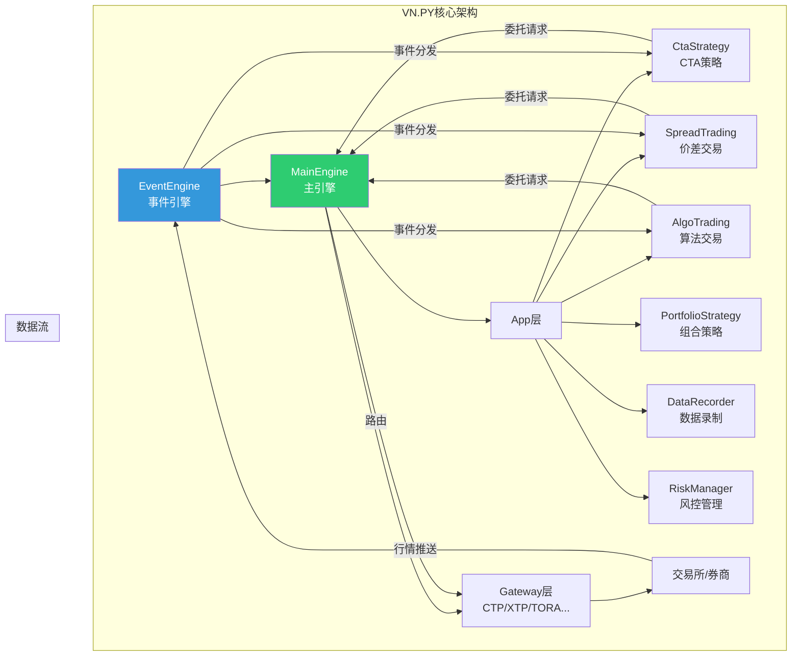
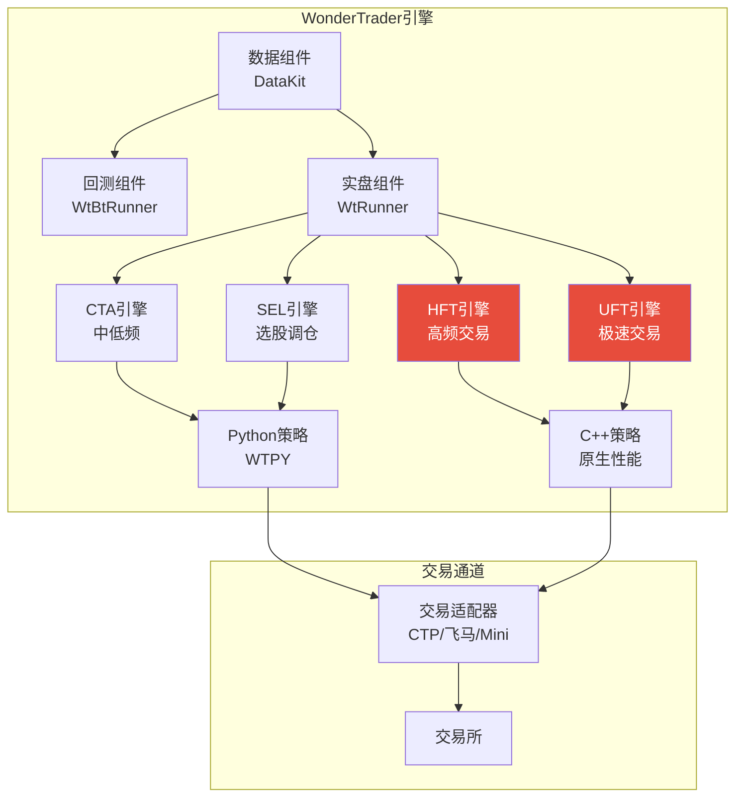
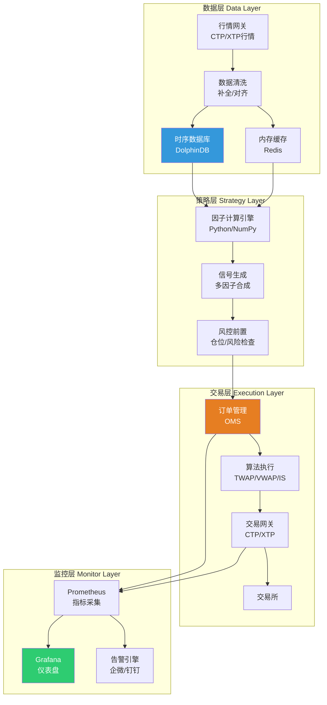
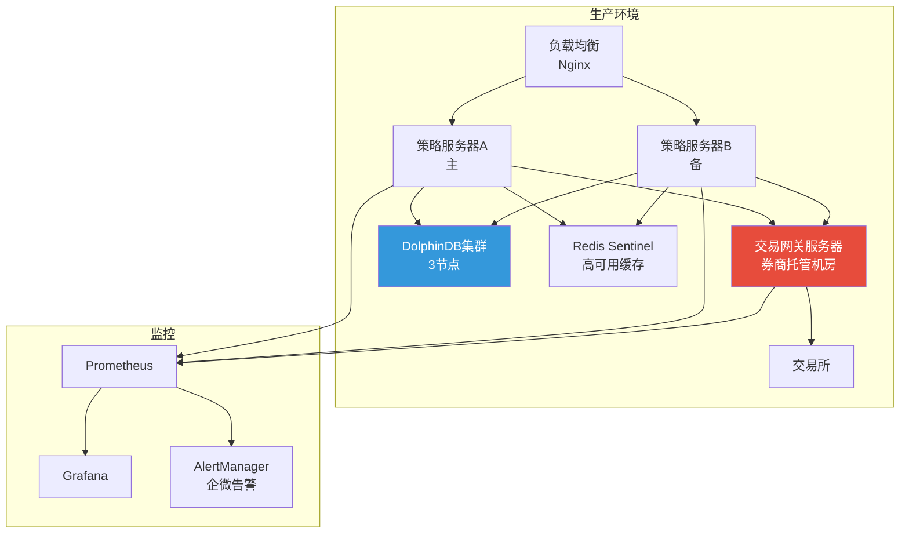

# A股量化平台选型与自建交易系统架构

## 概述

量化交易系统是策略从研究到实盘的桥梁。本文从开源框架深度对比（VN.PY/WonderTrader/WTPY）出发，详解自建交易系统的架构设计、技术栈选择、核心模块设计和低延迟优化技术，为量化团队提供从"选框架"到"自建系统"的完整技术路线图。

**核心结论**：
- 中小团队推荐 **VN.PY**（生态最完善，Python友好，149家期货公司CTP支持）
- 高频/极速需求推荐 **WonderTrader**（C++开发，支持HFT/UFT引擎）
- 自建系统核心选型：**Python+C++混合** + **ZeroMQ消息** + **DolphinDB时序库**
- FPGA硬件加速可实现订单处理延迟 < 5μs

> 相关笔记：[[A股量化交易平台深度对比]] | [[A股量化实盘接入方案]] | [[量化系统监控与运维]]

---

## 开源框架深度对比

### VN.PY vs WonderTrader vs 其他

| 维度 | VN.PY | WonderTrader | QMT(迅投) | Backtrader |
|------|-------|-------------|-----------|------------|
| **语言** | Python | C++/Python | Python | Python |
| **定位** | 全栈量化框架 | 高性能交易引擎 | 券商集成平台 | 纯回测框架 |
| **交易接口** | CTP/XTP/TORA等20+ | CTP/飞马/CTPMini | 恒生UFT直连 | 无实盘 |
| **回测** | ✅(Tick级) | ✅(高性能) | ✅(分钟级) | ✅(日线为主) |
| **实盘** | ✅ | ✅ | ✅ | ❌ |
| **策略引擎** | CTA/价差/算法 | CTA/SEL/HFT/UFT | 内置模板 | 自定义 |
| **GUI** | ✅(Qt) | ❌(命令行) | ✅(完善) | ❌ |
| **社区** | 最活跃(1.5万+星) | 活跃(3000+星) | 券商支持 | 很活跃 |
| **学习曲线** | 中等 | 较陡(C++) | 低 | 低 |
| **适用场景** | 中频全品种 | 高频期货/股票 | 券商客户 | 学习/回测 |

### VN.PY 架构



### WonderTrader 架构



---

## 自建系统架构设计

### 整体架构（四层模型）



### 技术栈选择

| 组件 | 推荐方案 | 备选 | 选择理由 |
|------|---------|------|---------|
| **策略开发** | Python 3.11+ | Python+C++混合 | 生态丰富，开发效率高 |
| **高频核心** | C++17/Rust | C++20 | 极致性能，零开销抽象 |
| **消息中间件** | ZeroMQ | Kafka/Redis Streams | 低延迟(μs级)，无需broker |
| **时序数据库** | DolphinDB | ClickHouse/TimescaleDB | A股生态好，分布式计算 |
| **缓存** | Redis | Memcached | 支持复杂数据结构 |
| **任务调度** | APScheduler | Celery/Airflow | 轻量级，Python原生 |
| **监控** | Prometheus+Grafana | Datadog | 开源免费，生态成熟 |
| **日志** | structlog+ELK | Loki | 结构化日志，便于搜索 |
| **容器化** | Docker Compose | Kubernetes | 中小规模够用 |

### 消息中间件选型

| 中间件 | 延迟 | 吞吐量 | 持久化 | 适用 |
|--------|------|--------|--------|------|
| **ZeroMQ** | ~10μs | 极高 | 需自建 | 进程间通信/高频 |
| **Kafka** | ~1ms | 极高 | ✅ | 数据管道/日志 |
| **Redis Streams** | ~100μs | 高 | ✅ | 缓存+消息一体 |
| **RabbitMQ** | ~200μs | 中 | ✅ | 可靠投递 |

### 数据库选型

| 数据库 | 写入性能 | 查询性能 | A股生态 | 成本 |
|--------|---------|---------|---------|------|
| **DolphinDB** | 极高(100万行/s) | 极高(分布式) | ✅(专为金融) | 社区版免费 |
| **ClickHouse** | 高(50万行/s) | 高(列存) | 一般 | 开源免费 |
| **TimescaleDB** | 中(10万行/s) | 中 | 一般 | 开源免费 |
| **QuestDB** | 高 | 高 | 较少 | 开源免费 |

---

## 核心模块设计

### 策略引擎（Strategy Container）

```python
from abc import ABC, abstractmethod
from dataclasses import dataclass
from typing import Optional
import zmq

@dataclass
class TickData:
    symbol: str
    datetime: str
    last_price: float
    volume: int
    bid_price1: float
    ask_price1: float
    bid_volume1: int
    ask_volume1: int

@dataclass
class OrderRequest:
    symbol: str
    direction: str     # 'BUY' / 'SELL'
    order_type: str    # 'LIMIT' / 'MARKET'
    volume: int
    price: float = 0.0

class BaseStrategy(ABC):
    """策略基类——所有策略继承此类"""

    def __init__(self, name: str, engine: 'StrategyEngine'):
        self.name = name
        self.engine = engine
        self.positions: dict = {}
        self.active = False

    @abstractmethod
    def on_tick(self, tick: TickData):
        """行情回调"""
        pass

    @abstractmethod
    def on_bar(self, bar: dict):
        """K线回调"""
        pass

    def send_order(self, req: OrderRequest) -> str:
        """发送委托（经过风控检查）"""
        if not self.active:
            return ''
        return self.engine.send_order(req, self.name)

    def cancel_order(self, order_id: str):
        """撤单"""
        self.engine.cancel_order(order_id)


class StrategyEngine:
    """策略引擎——管理多个策略实例"""

    def __init__(self):
        self.strategies: dict[str, BaseStrategy] = {}
        self.risk_manager = RiskManager()

        # ZeroMQ进程间通信
        self.context = zmq.Context()
        self.md_socket = self.context.socket(zmq.SUB)  # 行情订阅
        self.td_socket = self.context.socket(zmq.PUSH)  # 交易发送

    def add_strategy(self, strategy: BaseStrategy):
        self.strategies[strategy.name] = strategy

    def send_order(self, req: OrderRequest, strategy_name: str) -> str:
        """风控前置 + 委托路由"""
        # 风控检查
        if not self.risk_manager.check(req, strategy_name):
            return ''
        # 发送到交易网关
        self.td_socket.send_json(req.__dict__)
        return f"ORDER_{strategy_name}_{id(req)}"

    def on_tick(self, tick: TickData):
        """分发行情到所有活跃策略"""
        for strategy in self.strategies.values():
            if strategy.active:
                strategy.on_tick(tick)
```

### 交易网关设计

```python
class TradingGateway:
    """交易网关——多账户管理 + 断线重连 + 委托状态机"""

    def __init__(self):
        self.accounts: dict = {}
        self.active_orders: dict = {}
        self.connected: bool = False

    def connect(self, account_config: dict):
        """连接交易接口"""
        pass  # CTP/XTP具体实现

    def send_order(self, order: OrderRequest, account_id: str) -> str:
        """发送委托"""
        # 1. 选择账户
        account = self.accounts[account_id]
        # 2. 构建委托
        # 3. 发送到柜台
        # 4. 记录活跃委托
        pass

    def on_order_update(self, order_data: dict):
        """委托状态更新回调"""
        order_id = order_data['order_id']
        new_status = order_data['status']

        # 状态机校验
        if order_id in self.active_orders:
            old_status = self.active_orders[order_id]['status']
            if not self._valid_transition(old_status, new_status):
                raise ValueError(f"非法状态转移: {old_status} -> {new_status}")

        self.active_orders[order_id] = order_data

    def _valid_transition(self, old: str, new: str) -> bool:
        transitions = {
            'SUBMITTING': {'NOT_TRADED', 'REJECTED'},
            'NOT_TRADED': {'PART_TRADED', 'ALL_TRADED', 'CANCELLED'},
            'PART_TRADED': {'ALL_TRADED', 'CANCELLED'},
        }
        return new in transitions.get(old, set())
```

### 风控模块

```python
from collections import defaultdict
import time

class RiskManager:
    """实时风控管理器"""

    def __init__(self):
        self.config = {
            'max_order_value': 1_000_000,      # 单笔最大金额
            'max_position_pct': 0.10,           # 单股最大持仓占比
            'max_daily_turnover': 5_000_000,    # 日最大成交额
            'max_orders_per_second': 100,       # 秒级限速
            'max_drawdown_pct': 0.05,           # 最大回撤止损
        }
        self.daily_turnover = defaultdict(float)
        self.second_orders = []

    def check(self, req: OrderRequest, strategy: str) -> bool:
        """综合风控检查"""
        checks = [
            self._check_order_value(req),
            self._check_position_limit(req),
            self._check_daily_turnover(req),
            self._check_order_frequency(),
            self._check_drawdown(strategy),
        ]
        return all(checks)

    def _check_order_value(self, req: OrderRequest) -> bool:
        value = req.volume * req.price
        return value <= self.config['max_order_value']

    def _check_order_frequency(self) -> bool:
        now = time.time()
        self.second_orders = [t for t in self.second_orders if now - t < 1.0]
        if len(self.second_orders) >= self.config['max_orders_per_second']:
            return False
        self.second_orders.append(now)
        return True

    def _check_position_limit(self, req: OrderRequest) -> bool:
        # 检查单股持仓不超过总资产的10%
        return True  # 简化实现

    def _check_daily_turnover(self, req: OrderRequest) -> bool:
        return True  # 简化实现

    def _check_drawdown(self, strategy: str) -> bool:
        return True  # 简化实现
```

---

## 低延迟优化技术

### 优化层次

| 层次 | 技术 | 延迟改善 | 成本 |
|------|------|---------|------|
| **应用层** | 减少GC/对象分配 | 10-30% | 低 |
| **网络层** | kernel bypass(DPDK) | 50-70% | 中 |
| **协议层** | 二进制协议替代FIX | 20-40% | 低 |
| **OS层** | CPU亲和性/isolcpus | 20-50% | 低 |
| **内存层** | 共享内存/NUMA绑定 | 30-50% | 低 |
| **硬件层** | FPGA加速 | 90%+ | 高(50万+/年) |

### Python层优化

```python
import numpy as np
from functools import lru_cache

# 1. 使用NumPy避免Python循环
def fast_factor_calc(prices: np.ndarray, window: int = 20) -> np.ndarray:
    """向量化因子计算（比Python循环快100倍）"""
    # 滚动均值
    cumsum = np.cumsum(prices)
    cumsum[window:] = cumsum[window:] - cumsum[:-window]
    ma = cumsum[window - 1:] / window

    # 滚动标准差
    ma2 = np.convolve(prices**2, np.ones(window)/window, mode='valid')
    std = np.sqrt(ma2 - ma**2)

    return (prices[window-1:] - ma) / std  # Z-Score

# 2. 预分配内存
class TickBuffer:
    """预分配tick数据缓冲区，避免动态分配"""

    def __init__(self, capacity: int = 100_000):
        self.prices = np.zeros(capacity, dtype=np.float64)
        self.volumes = np.zeros(capacity, dtype=np.int64)
        self.idx = 0
        self.capacity = capacity

    def push(self, price: float, volume: int):
        if self.idx >= self.capacity:
            self.idx = 0  # 环形缓冲
        self.prices[self.idx] = price
        self.volumes[self.idx] = volume
        self.idx += 1
```

---

## 容灾设计

### 主备切换架构

| 故障场景 | 应对方案 | 切换时间 |
|---------|---------|---------|
| 策略进程崩溃 | Supervisor自动重启 | < 3秒 |
| 交易接口断线 | 自动重连+持仓同步 | < 10秒 |
| 数据库不可用 | 内存缓存降级运行 | 即时 |
| 服务器宕机 | 备机自动接管(Keepalived) | < 30秒 |
| 机房网络中断 | 多机房部署+DNS切换 | < 60秒 |

### 数据一致性保障

```python
class OrderJournal:
    """委托日志——确保宕机恢复后不重复下单"""

    def __init__(self, journal_path: str):
        self.journal_path = journal_path
        self.sent_orders: set = set()
        self._load_journal()

    def _load_journal(self):
        """启动时加载已发送委托记录"""
        if os.path.exists(self.journal_path):
            with open(self.journal_path, 'r') as f:
                self.sent_orders = set(line.strip() for line in f)

    def record_order(self, order_id: str):
        """记录已发送委托"""
        self.sent_orders.add(order_id)
        with open(self.journal_path, 'a') as f:
            f.write(f"{order_id}\n")

    def is_duplicate(self, order_id: str) -> bool:
        """检查是否重复委托"""
        return order_id in self.sent_orders
```

---

## 部署方案



---

## 参数速查表

| 参数 | 推荐值 | 说明 |
|------|--------|------|
| VN.PY版本 | 3.x | 最新稳定版 |
| Python版本 | 3.11+ | 性能优化显著 |
| ZeroMQ模式 | PUB/SUB(行情) + PUSH/PULL(交易) | 不同场景不同模式 |
| DolphinDB分区 | 按日期+股票代码 | COMPO分区 |
| Redis内存 | 16GB+ | 缓存全市场最新快照 |
| 策略进程数 | 1策略1进程 | 隔离故障域 |
| 风控检查延迟 | < 100μs | 不应成为瓶颈 |
| 心跳间隔 | 3秒 | 断线检测 |
| 日志级别 | INFO(生产) / DEBUG(测试) | 生产环境控制日志量 |
| 回测数据量 | 5-10年日频 / 1-2年分钟频 | 确保样本充分 |

---

## 常见误区

| 误区 | 真相 |
|------|------|
| Python不能做实盘 | VN.PY支撑大量中频策略实盘，仅纳秒级高频才需C++ |
| 一定要自建系统 | 中小团队用VN.PY/QMT即可，自建系统ROI需要3-5人团队 |
| 越低延迟越好 | 中低频策略（月频/周频）对延迟不敏感，过度优化浪费资源 |
| Kafka适合交易系统 | Kafka延迟~1ms，不适合高频；进程间通信用ZeroMQ(~10μs) |
| DolphinDB只能做数据库 | DolphinDB内置向量计算引擎，可直接做因子计算 |
| 容灾=冗余 | 容灾核心是数据一致性（委托日志），不只是多开机器 |

---

## 相关链接

- [[A股量化交易平台深度对比]] — 平台功能横向对比
- [[A股量化实盘接入方案]] — 实盘接入全流程
- [[A股实盘交易接口与协议详解]] — 交易接口技术细节
- [[量化系统监控与运维]] — 运维保障体系
- [[量化策略的服务器部署与自动化]] — 服务器部署方案
- [[量化研究Python工具链搭建]] — Python环境搭建
