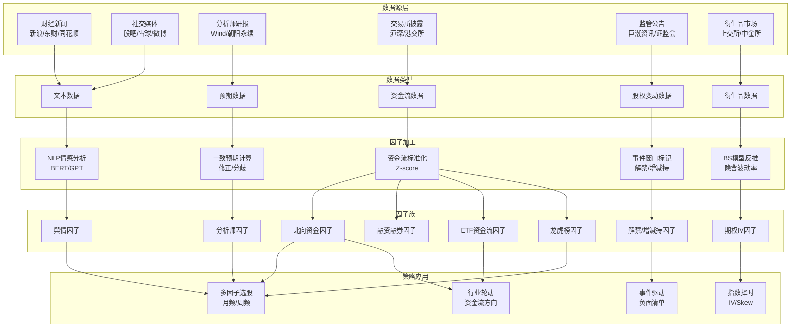
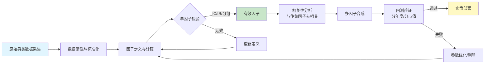

# A股另类数据与另类因子

## 核心要点

- **另类数据（Alternative Data）** 指传统量价与财务数据之外的信息源，包括舆情文本、分析师预期、资金流向、股权变动、衍生品数据等，在A股散户占比高、信息传导慢的市场中具有独特的Alpha挖掘价值
- 另类因子与传统因子（价值、动量、质量）的**相关性普遍低于0.2**，是多因子模型中重要的增量信息来源
- A股另类因子有效性受**市场制度**（T+1、涨跌停、两融标的限制）和**信息披露节奏**（定期报告、临时公告）深度影响
- 数据获取渠道以 **Wind、Choice、Tushare Pro、AKShare** 为主，部分数据需自建爬虫或购买商业NLP服务
- 因子衰减普遍较快（多数在5-20个交易日内），适合**周频至月频**调仓策略

---

## 一、舆情因子（Sentiment Factor）

### 1.1 数据来源与获取方法

| 数据源 | 内容 | 更新频率 | 获取方式 |
|--------|------|----------|----------|
| 财经新闻（新浪/东财/同花顺） | 上市公司相关新闻标题与正文 | 实时 | Wind舆情数据、BigQuant、自建爬虫 |
| 东方财富股吧 | 个股讨论帖、评论、浏览量 | 实时 | 东方财富API、AKShare、爬虫 |
| 雪球 | 讨论帖、关注人数、讨论热度 | 实时 | 雪球API（需授权）、爬虫 |
| 微博财经 | 财经大V观点、话题热度 | 实时 | 微博API |
| 研报摘要 | 分析师研报文本 | 日频 | Wind、朝阳永续、萝卜投研 |

### 1.2 因子定义与构建

**新闻情感因子**：对个股相关新闻进行NLP情感分类（正面/中性/负面），加权汇总得到情感得分。

$$\text{Sentiment}_{i,t} = \sum_{k=1}^{N} w_k \cdot s_k \cdot \text{decay}(t - t_k)$$

其中 $s_k \in \{-1, 0, 1\}$ 为第k篇新闻情感标签，$w_k$ 为新闻权重（来源权威性），$\text{decay}$ 为时间衰减函数（常用30日线性衰减）。

**社交媒体情绪因子**：
- **整体情绪**：积极帖占比 = 正面帖数 / 总帖数
- **情绪一致性**：积极帖占比的标准差，衡量分歧度
- **关注度**：帖子总数 / 流通市值（标准化）
- **情绪波动**：情绪得分的滚动标准差

### 1.3 NLP技术栈

```
传统方法：词典匹配（知网情感词典/自建金融词典）→ 正负词频统计
深度学习：BERT-wwm-ext → Fine-tune金融情感分类 → Softmax输出三分类概率
前沿方法：GPT/ChatGLM → Few-shot Prompt → 情感+事件联合抽取
```

### 1.4 因子有效性

| 因子名称 | RankIC均值 | ICIR | 适用域 | 调仓频率 | 衰减周期 |
|----------|-----------|------|--------|----------|----------|
| 新闻情感和（改进版） | 6.13% | ~1.8 | 沪深300 | 月频 | 20-30日 |
| 论坛整体情绪 | 3.86% | ~1.2 | 全市场 | 周频 | 5-10日 |
| BERT情感因子 | 4.5%-7.0% | ~2.0 | 中证500 | 周频 | 10-20日 |
| 积极一致性 | -2.5%（反向） | ~1.0 | 全市场 | 周频 | 5-10日 |

**关键发现**：
- 大市值股票月频新闻情感正效持续；小市值存在**情绪反转**效应
- 高情绪一致性（一致看好）往往预示短期反转，IC为负
- 多空年化收益：改进版新闻情感因子在沪深300内达**18.73%**
- 与传统因子相关性低，适合作为多因子模型补充

### 1.5 Python实现

```python
import pandas as pd
import numpy as np
from transformers import BertTokenizer, BertForSequenceClassification
import torch

# ========== 1. BERT情感分类 ==========
class SentimentClassifier:
    """基于BERT的金融新闻情感分类器"""
    def __init__(self, model_path='bert-base-chinese'):
        self.tokenizer = BertTokenizer.from_pretrained(model_path)
        self.model = BertForSequenceClassification.from_pretrained(
            model_path, num_labels=3  # 负面/中性/正面
        )

    def predict(self, texts: list) -> np.ndarray:
        """批量预测情感 返回: array of {-1, 0, 1}"""
        inputs = self.tokenizer(texts, padding=True, truncation=True,
                                max_length=128, return_tensors='pt')
        with torch.no_grad():
            logits = self.model(**inputs).logits
        labels = torch.argmax(logits, dim=-1).numpy() - 1  # 0,1,2 -> -1,0,1
        return labels

# ========== 2. 舆情因子计算 ==========
def calc_sentiment_factor(news_df: pd.DataFrame,
                          decay_days: int = 30) -> pd.Series:
    """
    计算新闻情感因子

    Parameters
    ----------
    news_df : DataFrame
        columns: ['stock_code', 'date', 'sentiment', 'source_weight']
        sentiment: -1(负面), 0(中性), 1(正面)
        source_weight: 新闻来源权重(权威媒体=1.5, 普通=1.0)
    decay_days : int
        衰减天数

    Returns
    -------
    Series: index=stock_code, value=sentiment_score
    """
    today = news_df['date'].max()
    news_df = news_df.copy()

    # 线性时间衰减
    news_df['days_ago'] = (today - news_df['date']).dt.days
    news_df['decay'] = np.maximum(0, 1 - news_df['days_ago'] / decay_days)

    # 加权情感得分
    news_df['weighted_score'] = (news_df['sentiment']
                                  * news_df['source_weight']
                                  * news_df['decay'])

    factor = news_df.groupby('stock_code')['weighted_score'].sum()
    return factor

# ========== 3. 股吧情绪因子 ==========
def calc_forum_sentiment(forum_df: pd.DataFrame) -> pd.DataFrame:
    """
    计算股吧/社交媒体情绪因子

    Parameters
    ----------
    forum_df : DataFrame
        columns: ['stock_code', 'date', 'sentiment', 'views']

    Returns
    -------
    DataFrame: columns=['positive_ratio', 'attention', 'sentiment_std']
    """
    grouped = forum_df.groupby('stock_code')

    result = pd.DataFrame({
        'positive_ratio': grouped.apply(
            lambda x: (x['sentiment'] == 1).mean()
        ),
        'attention': grouped['views'].sum(),
        'sentiment_std': grouped['sentiment'].std(),
    })

    # 标准化
    for col in result.columns:
        result[col] = (result[col] - result[col].mean()) / result[col].std()

    return result
```

---

## 二、分析师因子（Analyst Factor）

### 2.1 数据来源与获取方法

| 数据源 | 内容 | 更新频率 | 获取方式 |
|--------|------|----------|----------|
| Wind一致预期 | EPS/净利润/营收一致预期 | 日频更新 | Wind API（AConsensusData） |
| 朝阳永续 | 分析师个人预测明细 | 日频 | 朝阳永续API |
| Choice | 分析师评级/目标价 | 日频 | 东方财富Choice |
| Tushare Pro | 分析师一致预期 | 周频 | tushare.pro（积分制） |

### 2.2 因子定义与构建

**一致预期修正因子（REC - Revision of Earnings Consensus）**：

$$\text{REC}_{i,t} = \frac{\text{EPS}_{consensus,t} - \text{EPS}_{consensus,t-k}}{\left| \text{EPS}_{consensus,t-k} \right| + \epsilon}$$

聚焦同一分析师对盈利预期的上调/下调幅度，而非横截面比较。

**分析师覆盖度因子**：

$$\text{Coverage}_{i} = \text{近12个月覆盖该股的分析师人数}$$

**目标价偏离度因子**：

$$\text{TP\_Deviation}_{i} = \frac{\text{一致目标价} - \text{当前股价}}{\text{当前股价}}$$

**预期分歧度因子**：

$$\text{Dispersion}_{i} = \frac{\text{std(各分析师EPS预测)}}{\left| \text{mean(各分析师EPS预测)} \right| + \epsilon}$$

### 2.3 因子有效性

| 因子名称 | RankIC均值 | ICIR | 多空年化 | 胜率 | 适用域 |
|----------|-----------|------|----------|------|--------|
| 一致预期修正(REC) | 3.5% | 3.02 | 14.8% | 82.8% | 全A |
| 评级上调事件 | - | - | 超额3.25%(20日) | - | 全A |
| 目标价偏离度 | 2.5%-4.0% | ~1.5 | 8%-12% | ~65% | 沪深300 |
| 预期分歧度(反向) | -2.0% | ~1.0 | 5%-8% | ~60% | 全A |
| 分析师覆盖度 | 1.5%-2.5% | ~1.2 | - | - | 中小盘 |

**关键发现**：
- REC因子自2010年以来表现稳健，与常见一致预期指标独立性高
- 分析师评级上调前20日即有超额收益（动量效应），T日至T+60日alpha显著
- A股分析师普遍乐观偏差，负面评级信息量更大
- 因子与动量正相关、与价值负相关

### 2.4 Python实现

```python
import pandas as pd
import numpy as np

def calc_analyst_factors(consensus_df: pd.DataFrame,
                         detail_df: pd.DataFrame,
                         price_df: pd.DataFrame) -> pd.DataFrame:
    """
    计算分析师因子族

    Parameters
    ----------
    consensus_df : DataFrame
        Wind一致预期数据
        columns: ['stock_code', 'date', 'eps_consensus', 'target_price',
                   'rating', 'analyst_count']
    detail_df : DataFrame
        分析师个人预测明细
        columns: ['stock_code', 'date', 'analyst_id', 'eps_forecast']
    price_df : DataFrame
        columns: ['stock_code', 'date', 'close']

    Returns
    -------
    DataFrame: 分析师因子集
    """
    factors = {}

    # 1. 一致预期修正因子 (REC) - 近30日变化
    latest = consensus_df.groupby('stock_code').last()
    prev = consensus_df.groupby('stock_code').apply(
        lambda x: x.iloc[-min(22, len(x))]  # 约1个月前
    )
    eps = 1e-8
    factors['rec'] = (
        (latest['eps_consensus'] - prev['eps_consensus'])
        / (prev['eps_consensus'].abs() + eps)
    )

    # 2. 分析师覆盖度
    recent_detail = detail_df[
        detail_df['date'] >= detail_df['date'].max() - pd.Timedelta(days=365)
    ]
    factors['coverage'] = recent_detail.groupby('stock_code')['analyst_id'].nunique()

    # 3. 目标价偏离度
    latest_price = price_df.groupby('stock_code')['close'].last()
    factors['tp_deviation'] = (
        (latest['target_price'] - latest_price) / latest_price
    )

    # 4. 预期分歧度
    latest_detail = detail_df[
        detail_df['date'] >= detail_df['date'].max() - pd.Timedelta(days=90)
    ]
    grouped = latest_detail.groupby('stock_code')['eps_forecast']
    factors['dispersion'] = grouped.std() / (grouped.mean().abs() + eps)

    result = pd.DataFrame(factors)

    # Z-score标准化
    for col in result.columns:
        result[col] = (result[col] - result[col].mean()) / result[col].std()

    return result

# ========== Wind数据获取示例 ==========
def fetch_consensus_from_wind(stock_list, date):
    """从Wind获取一致预期数据（需Wind终端）"""
    from WindPy import w
    w.start()

    fields = [
        "west_eps_FY1",         # FY1 EPS一致预期
        "west_targetprice",      # 一致目标价
        "west_netprofit_FY1",    # FY1 净利润一致预期
        "west_num",              # 覆盖分析师数
    ]

    data = w.wss(stock_list, fields, f"tradeDate={date}")
    df = pd.DataFrame(data.Data, index=fields, columns=stock_list).T
    return df
```

---

## 三、北向资金因子（Northbound Capital Factor）

### 3.1 数据来源与获取方法

| 数据源 | 内容 | 更新频率 | 获取方式 |
|--------|------|----------|----------|
| 沪深交易所 | 陆股通每日成交/十大活跃股 | 日频（盘后） | 交易所官网、Wind |
| 港交所 | 陆股通持股明细 | 日频（T+1披露） | 港交所CCASS |
| Wind | 北向资金净买入、持股变动 | 日频 | Wind API |
| Tushare Pro | 北向资金流向 | 日频 | hsgt_top10/moneyflow_hsgt |
| AKShare | 沪深港通资金流 | 日频 | ak.stock_hsgt_north_net_flow_in_em() |

### 3.2 因子定义与构建

**净买入金额因子**：

$$\text{NetBuy}_{i,t} = \frac{\text{北向净买入额}_{i,t}}{\text{成交额}_{i,t}}$$

**持股占比变动因子**：

$$\Delta\text{Holding\%}_{i,t} = \frac{\text{北向持股数}_{i,t}}{\text{流通A股}_{i,t}} - \frac{\text{北向持股数}_{i,t-k}}{\text{流通A股}_{i,t-k}}$$

**持股集中度变动因子**：

$$\text{Concentration}_{i,t} = \frac{\text{北向持股市值}_{i,t}}{\sum_j \text{北向持股市值}_{j,t}}$$

### 3.3 因子有效性

| 因子名称 | RankIC均值 | 衰减周期 | 适用域 | 调仓频率 |
|----------|-----------|----------|--------|----------|
| 净买入额/成交额 | 4%-6% | 10-20日 | 陆股通标的 | 周频/月频 |
| 持股占比变动(月) | 3%-5% | 20-40日 | 全A | 月频 |
| 持股集中度变动 | 2%-4% | 20-30日 | 全A | 月频 |

**关键发现**：
- 北向资金偏好大盘价值风格（消费、金融、高ROE标的）
- 2025Q4数据：持股市值2.59万亿，加仓超1600只股票
- 部分个股外资持股超20%（汇川技术、福耀玻璃），需关注"禁买线"效应
- 近年调仓频率加快，短期信号噪音增大，建议使用5-20日均值平滑

### 3.4 Python实现

```python
import pandas as pd
import numpy as np
import akshare as ak

# ========== 1. 数据获取 ==========
def fetch_northbound_data():
    """获取北向资金数据（AKShare）"""
    # 沪股通+深股通 每日净买入
    flow = ak.stock_hsgt_north_net_flow_in_em()
    # 北向持股明细（需Wind或Choice）
    return flow

def fetch_northbound_holding_wind(date):
    """从Wind获取北向持股明细"""
    from WindPy import w
    w.start()
    data = w.wset("shconnectholddetail",
                  f"date={date};exchange=all")
    df = pd.DataFrame(data.Data, index=data.Fields).T
    return df

# ========== 2. 因子计算 ==========
def calc_northbound_factors(holding_df: pd.DataFrame,
                             trade_df: pd.DataFrame,
                             lookback: int = 20) -> pd.DataFrame:
    """
    计算北向资金因子族

    Parameters
    ----------
    holding_df : DataFrame
        columns: ['stock_code', 'date', 'north_shares', 'free_shares']
    trade_df : DataFrame
        columns: ['stock_code', 'date', 'net_buy_amount', 'turnover']
    lookback : int
        回看天数

    Returns
    -------
    DataFrame: 北向资金因子集
    """
    factors = {}

    # 1. 净买入占比因子（lookback日均值）
    trade_df['net_buy_ratio'] = trade_df['net_buy_amount'] / trade_df['turnover']
    recent = trade_df.groupby('stock_code').tail(lookback)
    factors['net_buy_ratio'] = recent.groupby('stock_code')['net_buy_ratio'].mean()

    # 2. 持股占比变动因子
    holding_df['holding_pct'] = holding_df['north_shares'] / holding_df['free_shares']
    latest = holding_df.groupby('stock_code').last()
    prev = holding_df.groupby('stock_code').apply(
        lambda x: x.iloc[-min(lookback, len(x))]
    )
    factors['holding_pct_chg'] = latest['holding_pct'] - prev['holding_pct']

    # 3. 持股集中度
    total_value = latest['north_shares'].sum()  # 简化：用股数代替市值
    factors['concentration'] = latest['north_shares'] / total_value

    result = pd.DataFrame(factors)

    # Z-score标准化
    for col in result.columns:
        result[col] = (result[col] - result[col].mean()) / result[col].std()

    return result
```

---

## 四、融资融券因子（Margin Trading Factor）

### 4.1 数据来源与获取方法

| 数据源 | 内容 | 更新频率 | 获取方式 |
|--------|------|----------|----------|
| 沪深交易所 | 融资融券交易汇总 | 日频（T+1） | 交易所官网 |
| Wind | 个股融资融券明细 | 日频 | Wind API（AShareMarginTrade） |
| Tushare Pro | 两融每日交易 | 日频 | margin_detail |
| AKShare | 融资融券汇总 | 日频 | ak.stock_margin_detail_szse_em() |

### 4.2 因子定义与构建

**融资余额变动因子**：

$$\Delta\text{MarginBal}_{i,t} = \frac{\text{融资余额}_{i,t} - \text{融资余额}_{i,t-k}}{\text{融资余额}_{i,t-k}}$$

**融资买入占比因子**：

$$\text{MarginBuyRatio}_{i,t} = \frac{\text{融资买入额}_{i,t}}{\text{成交额}_{i,t}}$$

**融券余额占比因子**：

$$\text{ShortRatio}_{i,t} = \frac{\text{融券余额}_{i,t}}{\text{流通市值}_{i,t}}$$

**两融比率因子**：

$$\text{MarginRatio}_{i,t} = \frac{\text{融资余额}_{i,t}}{\text{融券余额}_{i,t} + \epsilon}$$

### 4.3 因子有效性

| 因子名称 | RankIC均值 | 预测方向 | 适用域 | 调仓频率 |
|----------|-----------|----------|--------|----------|
| 融券余额占比 | -3%~-5% | 负向（高融券→低收益） | 中证500/1000 | 日频/周频 |
| 融资买入占比 | -2%~-4% | 负向（高融资→低收益） | 两融标的 | 日频/周频 |
| 融资余额变动率 | -1.5%~-3% | 负向 | 全市场 | 周频 |
| 两融比率 | 1%~2% | 正向（弱） | 全市场 | 月频 |

**关键发现**：
- 融资融券因子的预测效果为**负面导向**——融资买入/融券卖出占比越高，未来收益越弱
- 融券余额占比因子和融资买入额占融资余额比因子在中证500和中证1000表现突出
- 扣除千五手续费后仍可获超额收益，但手续费敏感
- 全市场范围单调性欠佳，在特定股票池表现更好

### 4.4 Python实现

```python
import pandas as pd
import numpy as np

def calc_margin_factors(margin_df: pd.DataFrame,
                         trade_df: pd.DataFrame,
                         lookback: int = 20) -> pd.DataFrame:
    """
    计算融资融券因子族

    Parameters
    ----------
    margin_df : DataFrame
        columns: ['stock_code', 'date', 'margin_balance', 'margin_buy',
                   'short_balance', 'free_market_cap']
    trade_df : DataFrame
        columns: ['stock_code', 'date', 'turnover']
    lookback : int
        变动计算回看天数

    Returns
    -------
    DataFrame: 融资融券因子集
    """
    factors = {}

    latest = margin_df.groupby('stock_code').last()
    prev = margin_df.groupby('stock_code').apply(
        lambda x: x.iloc[-min(lookback, len(x))]
    )
    eps = 1e-8

    # 1. 融资余额变动率
    factors['margin_bal_chg'] = (
        (latest['margin_balance'] - prev['margin_balance'])
        / (prev['margin_balance'] + eps)
    )

    # 2. 融资买入占比（近N日均值）
    merged = margin_df.merge(trade_df, on=['stock_code', 'date'])
    merged['buy_ratio'] = merged['margin_buy'] / (merged['turnover'] + eps)
    recent = merged.groupby('stock_code').tail(lookback)
    factors['margin_buy_ratio'] = recent.groupby('stock_code')['buy_ratio'].mean()

    # 3. 融券余额占比
    factors['short_ratio'] = (
        latest['short_balance'] / (latest['free_market_cap'] + eps)
    )

    # 4. 两融比率
    factors['margin_short_ratio'] = (
        latest['margin_balance'] / (latest['short_balance'] + eps)
    )

    result = pd.DataFrame(factors)

    # Z-score标准化
    for col in result.columns:
        result[col] = (result[col] - result[col].mean()) / result[col].std()

    return result

# ========== AKShare数据获取 ==========
def fetch_margin_data_akshare(date: str):
    """获取融资融券数据"""
    import akshare as ak
    # 沪市融资融券
    sh = ak.stock_margin_detail_sse(date=date)
    # 深市融资融券
    sz = ak.stock_margin_detail_szse(date=date)
    return pd.concat([sh, sz], ignore_index=True)
```

---

## 五、限售股解禁因子（Lock-up Expiry Factor）

### 5.1 数据来源与获取方法

| 数据源 | 内容 | 更新频率 | 获取方式 |
|--------|------|----------|----------|
| Wind | 限售股解禁明细 | 日频（预告制） | Wind API（AShareFreeFloatCalendar） |
| Tushare Pro | 解禁计划 | 日频 | share_float |
| Choice | 解禁日历 | 日频 | Choice API |
| 巨潮资讯 | 限售股上市流通公告 | 公告日 | cninfo.com.cn |

### 5.2 因子定义与构建

**解禁占比因子**：

$$\text{UnlockRatio}_{i,t} = \frac{\text{解禁股数}_{i}}{\text{流通A股总数}_{i,t}}$$

**解禁倒计时因子**：

$$\text{DaysToUnlock}_{i,t} = \text{解禁日} - t \quad (\text{仅取未来60日内})$$

**解禁类型因子**（分类变量）：
- 首发原股东解禁
- 定向增发解禁
- 股权激励解禁
- 股权分置解禁

### 5.3 因子有效性

| 因子名称 | 预测方向 | 影响窗口 | 效应强度 |
|----------|----------|----------|----------|
| 定增解禁 | 强负面 | 前60日~后60日持续跑输 | IC ~ -0.05~-0.10 |
| 首发原股东解禁 | 负面 | 前10日跑输，后60日反弹 | 中等 |
| 高占比解禁 | 强负面 | 占比越高跌幅越大 | 强 |
| 基金参与的解禁 | 负面 | 前5日跌幅大 | 中强 |
| 高盈亏比解禁 | 负面 | 盈利越多抛压越大 | 中等 |

**关键发现**：
- 解禁效应整体偏负面，适合作为**负面清单**过滤信号
- 定向增发解禁前后持续跑输基准，是最强的负面信号
- 解禁前半年有减持记录的个股，解禁效应更显著
- 在成长股策略中剔除解禁股，可显著提升超额收益

---

## 六、大股东增减持因子（Major Shareholder Trading Factor）

### 6.1 数据来源与获取方法

| 数据源 | 内容 | 更新频率 | 获取方式 |
|--------|------|----------|----------|
| 巨潮资讯 | 增减持公告 | 公告日（T+1） | cninfo.com.cn、Wind |
| Wind | 大股东增减持明细 | 日频 | AShareInsiderTrade |
| Tushare Pro | 股东增减持 | 日频 | stk_holdertrade |
| AKShare | 大宗交易数据 | 日频 | ak.stock_dzjy_mrtj() |

### 6.2 因子定义与构建

**减持金额占比因子**：

$$\text{SellRatio}_{i,t} = \frac{\sum \text{近N日减持金额}_{i}}{\text{流通市值}_{i,t}}$$

**增持信号因子**（事件型）：

$$\text{BuySignal}_{i,t} = \begin{cases} 1 & \text{近N日有增持公告} \\ 0 & \text{否则} \end{cases}$$

**净增减持比例因子**：

$$\text{NetTrade}_{i,t} = \frac{\text{增持金额} - \text{减持金额}}{\text{流通市值}_{i,t}}$$

### 6.3 因子有效性

- 大股东**增持**通常为正面信号，短期超额收益显著（5-20日）
- 大股东**减持**为负面信号，但市场已部分Price-in（公告后效应弱于公告前）
- 结合解禁因子使用效果更佳：解禁后有减持记录的个股，后续表现更差
- 员工持股计划到期抛压相对较小

### 6.4 Python实现

```python
import pandas as pd
import numpy as np

def calc_unlock_shareholder_factors(
    unlock_df: pd.DataFrame,
    holder_trade_df: pd.DataFrame,
    price_df: pd.DataFrame,
    forward_days: int = 60
) -> pd.DataFrame:
    """
    计算解禁+大股东增减持因子

    Parameters
    ----------
    unlock_df : DataFrame
        columns: ['stock_code', 'unlock_date', 'unlock_shares',
                   'unlock_type', 'free_shares']
    holder_trade_df : DataFrame
        columns: ['stock_code', 'date', 'direction', 'amount',
                   'free_market_cap']
        direction: 'buy' or 'sell'
    price_df : DataFrame
        columns: ['stock_code', 'date', 'close']

    Returns
    -------
    DataFrame: 解禁+增减持因子集
    """
    today = price_df['date'].max()
    factors = {}

    # ---- 解禁因子 ----
    # 未来60日内有解禁的股票
    upcoming = unlock_df[
        (unlock_df['unlock_date'] > today) &
        (unlock_df['unlock_date'] <= today + pd.Timedelta(days=forward_days))
    ].copy()

    if len(upcoming) > 0:
        upcoming['unlock_ratio'] = upcoming['unlock_shares'] / upcoming['free_shares']
        upcoming['days_to_unlock'] = (upcoming['unlock_date'] - today).dt.days

        factors['unlock_ratio'] = upcoming.groupby('stock_code')['unlock_ratio'].sum()
        factors['days_to_unlock'] = upcoming.groupby('stock_code')['days_to_unlock'].min()

    # ---- 大股东增减持因子 ----
    recent_trade = holder_trade_df[
        holder_trade_df['date'] >= today - pd.Timedelta(days=30)
    ]
    eps = 1e-8

    buy_amt = recent_trade[recent_trade['direction'] == 'buy'].groupby(
        'stock_code')['amount'].sum()
    sell_amt = recent_trade[recent_trade['direction'] == 'sell'].groupby(
        'stock_code')['amount'].sum()

    mktcap = recent_trade.groupby('stock_code')['free_market_cap'].last()

    factors['net_trade_ratio'] = (buy_amt.fillna(0) - sell_amt.fillna(0)) / (mktcap + eps)
    factors['sell_ratio'] = sell_amt.fillna(0) / (mktcap + eps)

    result = pd.DataFrame(factors)
    return result
```

---

## 七、ETF资金流因子（ETF Flow Factor）

### 7.1 数据来源与获取方法

| 数据源 | 内容 | 更新频率 | 获取方式 |
|--------|------|----------|----------|
| Wind | ETF申赎数据、份额变动 | 日频 | Wind API（AShareETF） |
| Choice | ETF资金流入流出 | 日频 | Choice API |
| 彭博 | 海外A股ETF持仓穿透 | 日频/季频 | Bloomberg Terminal |
| AKShare | ETF实时行情 | 日频 | ak.fund_etf_fund_daily_em() |

### 7.2 因子定义与构建

**ETF资金流穿透因子**：将ETF层面的净申赎金额按持仓权重分配到成分股。

$$\text{ETFFlow}_{i,t} = \sum_{e \in \text{ETFs}} w_{i,e} \cdot \text{NetFlow}_{e,t}$$

其中 $w_{i,e}$ 为股票i在ETF e中的权重，$\text{NetFlow}_{e,t}$ 为ETF e在t日的净申赎金额。

**行业ETF资金流因子**：

$$\text{SectorFlow}_{j,t} = \sum_{e \in \text{行业ETF}_j} \text{NetFlow}_{e,t}$$

### 7.3 因子有效性

- ETF资金流与北向资金高度相关（2017年起一致性高），可作为北向资金因子的替代/补充
- 偏好大盘价值风格，行业配置信号有效（消费、金融ETF净流入→行业超额）
- 被动化浪潮下，ETF资金流对个股定价影响日益增大
- 海外A股ETF（如前25名覆盖72.83%）的资金流具有前瞻性

---

## 八、龙虎榜因子（Top Trader List Factor）

### 8.1 数据来源与获取方法

| 数据源 | 内容 | 更新频率 | 获取方式 |
|--------|------|----------|----------|
| 沪深交易所 | 龙虎榜买卖明细 | 日频（盘后） | 交易所官网 |
| Wind | 龙虎榜数据（AShareMoneyFlow） | 日频 | Wind API |
| Choice | 龙虎榜营业部明细 | 日频 | Choice API |
| Tushare Pro | 龙虎榜每日明细 | 日频 | top_list |
| AKShare | 龙虎榜数据 | 日频 | ak.stock_lhb_detail_daily_sina() |

### 8.2 因子定义与构建

**机构净买入因子**：

$$\text{InstNetBuy}_{i,t} = \frac{\text{机构买入额} - \text{机构卖出额}}{\text{当日成交额}}$$

**游资活跃度因子**：

$$\text{HotMoney}_{i,t} = \frac{\text{知名游资营业部买入额}}{\text{当日成交额}}$$

**龙虎榜上榜频率因子**：

$$\text{ListFreq}_{i,t} = \text{近N日上榜次数}$$

### 8.3 因子有效性

| 因子名称 | RankIC均值 | 预测方向 | 适用域 | 说明 |
|----------|-----------|----------|--------|------|
| 机构净买入 | 3%-5% | 正向 | 龙虎榜股票 | 机构买入后续超额显著 |
| 小单流入（反向） | -9.9% | 负向 | 全市场 | 与成交额高度相关需正交化 |
| 龙虎榜上榜频率 | -2%~-3% | 负向 | 龙虎榜股票 | 频繁上榜预示炒作尾声 |

**关键发现**：
- 龙虎榜基础资金流因子有57个，衍生因子可达153个
- 小单流入额IC高达-9.9%，但与成交额高度相关，需OLS正交化处理
- 机构席位净买入为正面信号，游资席位信号需结合市场环境判断
- 事件型使用（龙虎榜出现后N日的超额收益）比截面因子更有效

---

## 九、期权隐含波动率因子（Implied Volatility Factor）

### 9.1 数据来源与获取方法

| 数据源 | 内容 | 更新频率 | 获取方式 |
|--------|------|----------|----------|
| 上交所 | 50ETF期权/沪深300ETF期权行情 | 实时/日频 | 上交所官网 |
| 中金所 | 沪深300/中证1000股指期权 | 实时/日频 | 中金所官网 |
| Wind | 期权隐含波动率/Greeks | 日频 | Wind API |
| Tushare Pro | 期权日线数据 | 日频 | opt_daily |
| AKShare | 期权行情数据 | 日频 | ak.option_cffex_hs300_spot_em() |

### 9.2 因子定义与构建

**ATM隐含波动率因子**：

$$\text{IV}_{ATM,t} = \frac{\text{IV}_{call,ATM} + \text{IV}_{put,ATM}}{2}$$

取近月+次近月平均，Delta接近0.5的合约。

**波动率偏斜因子（Skew）**：

$$\text{Skew}_{t} = \text{IV}_{OTM\ Put}(\Delta=0.1) - \text{IV}_{OTM\ Call}(\Delta=0.9)$$

衡量市场对下行风险的定价程度，正值越大表示市场恐慌情绪越强。

**IV分位数因子（IV Rank）**：

$$\text{IVRank}_{t} = \frac{\text{IV}_{ATM,t} - \text{IV}_{min,252d}}{\text{IV}_{max,252d} - \text{IV}_{min,252d}}$$

**期限结构因子**：

$$\text{TermStructure}_{t} = \text{IV}_{近月} - \text{IV}_{远月}$$

正值（Backwardation）通常表示短期恐慌。

### 9.3 因子有效性

- 期权IV因子主要用于**指数级别择时**和**行业轮动**，个股层面受限于A股期权品种较少
- IV Rank高位（>80%）时，标的指数未来1-3月下行概率较高
- Skew因子可捕捉尾部风险定价，与市场回撤高度相关
- 可作为波动率因子的替代/补充，与历史波动率形成信息互补

### 9.4 Python实现

```python
import numpy as np
import pandas as pd
from scipy.stats import norm
from scipy.optimize import brentq

# ========== 1. 隐含波动率计算 ==========
def bs_call_price(S, K, T, r, sigma):
    """Black-Scholes看涨期权定价"""
    d1 = (np.log(S/K) + (r + 0.5*sigma**2)*T) / (sigma*np.sqrt(T))
    d2 = d1 - sigma*np.sqrt(T)
    return S * norm.cdf(d1) - K * np.exp(-r*T) * norm.cdf(d2)

def bs_put_price(S, K, T, r, sigma):
    """Black-Scholes看跌期权定价"""
    d1 = (np.log(S/K) + (r + 0.5*sigma**2)*T) / (sigma*np.sqrt(T))
    d2 = d1 - sigma*np.sqrt(T)
    return K * np.exp(-r*T) * norm.cdf(-d2) - S * norm.cdf(-d1)

def implied_vol(market_price, S, K, T, r, option_type='call'):
    """Newton-Raphson法计算隐含波动率"""
    func = bs_call_price if option_type == 'call' else bs_put_price
    try:
        iv = brentq(lambda sigma: func(S, K, T, r, sigma) - market_price,
                     0.001, 5.0, xtol=1e-6)
    except ValueError:
        iv = np.nan
    return iv

# ========== 2. IV因子计算 ==========
def calc_iv_factors(option_df: pd.DataFrame,
                     hist_iv: pd.Series) -> dict:
    """
    计算期权隐含波动率因子族

    Parameters
    ----------
    option_df : DataFrame
        当日期权链数据
        columns: ['strike', 'expiry', 'type', 'price', 'delta',
                   'underlying_price', 'risk_free_rate', 'T']
    hist_iv : Series
        近252日ATM IV历史序列

    Returns
    -------
    dict: IV因子集
    """
    S = option_df['underlying_price'].iloc[0]
    r = option_df['risk_free_rate'].iloc[0]

    # 计算每个合约的IV
    option_df['iv'] = option_df.apply(
        lambda row: implied_vol(
            row['price'], S, row['strike'], row['T'], r, row['type']
        ), axis=1
    )

    # 近月合约
    near_month = option_df[option_df['T'] == option_df['T'].min()]

    # ATM IV (Delta最接近0.5)
    atm_call = near_month[near_month['type'] == 'call']
    atm_iv_call = atm_call.iloc[(atm_call['delta'].abs() - 0.5).abs().argsort()[:1]]['iv'].values[0]
    atm_put = near_month[near_month['type'] == 'put']
    atm_iv_put = atm_put.iloc[(atm_put['delta'].abs() - 0.5).abs().argsort()[:1]]['iv'].values[0]
    atm_iv = (atm_iv_call + atm_iv_put) / 2

    # Skew: OTM Put IV - OTM Call IV
    otm_put = near_month[(near_month['type'] == 'put') &
                          (near_month['delta'].abs() < 0.25)]
    otm_call = near_month[(near_month['type'] == 'call') &
                           (near_month['delta'].abs() < 0.25)]
    skew = otm_put['iv'].mean() - otm_call['iv'].mean() if len(otm_put) > 0 and len(otm_call) > 0 else np.nan

    # IV Rank (252日分位)
    iv_min = hist_iv.min()
    iv_max = hist_iv.max()
    iv_rank = (atm_iv - iv_min) / (iv_max - iv_min + 1e-8)

    # 期限结构
    far_month = option_df[option_df['T'] == option_df['T'].unique()[1]] if len(option_df['T'].unique()) > 1 else None
    if far_month is not None:
        far_atm = far_month.iloc[(far_month['strike'] - S).abs().argsort()[:2]]
        term_structure = atm_iv - far_atm['iv'].mean()
    else:
        term_structure = np.nan

    return {
        'atm_iv': atm_iv,
        'skew': skew,
        'iv_rank': iv_rank,
        'term_structure': term_structure,
    }
```

---

## 另类因子有效性排行

基于A股实证研究文献和券商研报综合评估：

| 排名 | 因子类别 | 代表因子 | RankIC范围 | ICIR | 数据频率 | 衰减周期 | 综合评价 |
|------|----------|----------|-----------|------|----------|----------|----------|
| 1 | 分析师因子 | 一致预期修正(REC) | 3%-5% | 2.0-3.0 | 日频 | 20-60日 | 最稳健，增量信息大 |
| 2 | 舆情因子 | BERT新闻情感 | 4%-7% | 1.5-2.0 | 日频 | 10-30日 | IC高但波动大 |
| 3 | 北向资金因子 | 持股占比变动 | 3%-6% | 1.5-2.5 | 日频 | 10-40日 | 大盘股有效 |
| 4 | 限售解禁因子 | 定增解禁占比 | -5%~-10% | 1.5-2.0 | 事件型 | 60日+窗口 | 负面清单首选 |
| 5 | 大股东增减持 | 净减持比例 | -3%~-5% | 1.0-1.5 | 事件型 | 20-60日 | 结合解禁更佳 |
| 6 | 龙虎榜因子 | 机构净买入 | 3%-5% | 1.0-1.5 | 日频 | 5-20日 | 需正交化处理 |
| 7 | 融资融券因子 | 融券余额占比 | -3%~-5% | 1.0-1.5 | 日频 | 5-20日 | 负向因子，手续费敏感 |
| 8 | ETF资金流因子 | 穿透净流入 | 2%-4% | 1.0-1.5 | 日频 | 10-30日 | 与北向高度相关 |
| 9 | 期权IV因子 | IV Rank/Skew | - | - | 日频 | 5-20日 | 择时为主，个股受限 |

---

## 数据获取方案汇总表

| 因子类别 | 免费方案 | 商业方案 | 推荐频率 | 关键字段 |
|----------|----------|----------|----------|----------|
| 舆情因子 | AKShare(有限)+自建爬虫 | Wind舆情/BigQuant/同花顺iFind | 日频 | 新闻文本、情感标签 |
| 分析师因子 | Tushare Pro(积分制) | Wind一致预期/朝阳永续 | 日频 | EPS预期、目标价、评级 |
| 北向资金 | AKShare/Tushare Pro | Wind/Choice | 日频 | 持股数量、净买入额 |
| 融资融券 | AKShare/Tushare Pro | Wind/Choice | 日频 | 融资余额、融券余额 |
| 限售解禁 | Tushare Pro/巨潮公告 | Wind/Choice | 事件型 | 解禁日、解禁股数、类型 |
| 大股东增减持 | Tushare Pro/巨潮公告 | Wind/Choice | 事件型 | 增减持方向、金额 |
| ETF资金流 | AKShare | Wind/Choice/彭博 | 日频 | 份额变动、净申赎 |
| 龙虎榜 | AKShare/Tushare Pro | Wind/Choice | 日频 | 买卖营业部、金额 |
| 期权IV | AKShare/交易所 | Wind/Choice | 日频 | 期权价格、行权价、到期日 |

---

## 另类数据生态图



## 因子挖掘流程



---

## 常见误区与注意事项

### 误区一：舆情因子等于"看多做多"
- **错误**：高正面情绪直接做多
- **正确**：高情绪一致性（一致看好）往往是反转信号，小市值尤甚。应关注情绪变化方向而非绝对水平

### 误区二：北向资金是"聪明钱"可无脑跟
- **错误**：北向净买入就买入
- **正确**：近年北向资金调仓频率加快，短期信号噪音大。需使用5-20日均值平滑，且区分配置盘（稳定）与交易盘（高频）

### 误区三：融资余额增加是利好
- **错误**：融资增加代表看好，应做多
- **正确**：实证表明融资买入占比越高，未来收益反而越低（过度杠杆 → 抛压积累）。融资融券因子为**负向因子**

### 误区四：解禁必跌
- **错误**：所有解禁都做空
- **正确**：不同类型解禁效应差异大。定增解禁最强，首发原股东解禁后可能反弹。需区分解禁类型、占比和股东行为

### 误区五：龙虎榜数据直接可用
- **错误**：直接用龙虎榜原始资金流数据做因子
- **正确**：龙虎榜资金流因子与成交额高度相关，必须进行**正交化处理**（OLS回归去除成交额影响），否则实际是在做流动性因子

### 误区六：另类因子可以高频使用
- **错误**：日频调仓最大化另类因子Alpha
- **正确**：多数另类因子衰减虽快但交易成本侵蚀严重。融资融券因子扣除千五手续费后收益显著下降，推荐**周频至月频**调仓

### 误区七：忽视数据时效性
- **错误**：使用当日数据计算当日因子
- **正确**：许多另类数据有披露延迟（如北向持股T+1、解禁公告提前N日）。因子计算必须严格对齐**可用时间点**，避免未来信息泄露

### 误区八：单一另类因子独立建仓
- **错误**：仅用一个另类因子构建策略
- **正确**：另类因子IC波动大、容量有限，应与传统因子（价值、动量、质量）复合使用，利用低相关性提升组合稳定性

---

## 相关笔记

- [[A股交易制度全解析]] — 涨跌停、T+1制度对另类因子衰减的影响
- [[A股市场微观结构深度研究]] — 市场微观结构与另类因子有效性的关系
- [[A股量化数据源全景图]] — 另类数据获取渠道的完整参考
- [[A股量化交易平台深度对比]] — 各平台对另类数据的支持情况
- [[量化数据工程实践]] — 另类数据清洗、存储与因子计算工程化实践
- [[A股市场参与者结构与资金流分析]] — 北向资金、两融资金的市场结构背景
- [[A股衍生品市场与对冲工具]] — 期权市场与隐含波动率因子的基础
- [[量化研究Python工具链搭建]] — NLP模型部署与因子计算工具链
- [[A股指数体系与基准构建]] — 因子回测中基准选择的参考
- [[高频因子与日内数据挖掘]] — L2数据驱动的订单流因子与另类因子的互补
- [[A股机器学习量化策略]] — NLP/BERT模型在舆情因子中的深度学习应用

---

## 来源参考

1. 华泰人工智能系列37：舆情因子和BERT情感分类模型 — 新闻情感因子构建与IC分析
2. 中信因子深度研究系列13：分析师预期调整事件增强选股策略 — REC因子定义与实证
3. 中信证券量化策略专题：A股另类数据，挖掘低相关蓝海Alpha收益 — 另类因子分类与有效性排行
4. BigQuant研究院：融资融券因子全市场实证 — 两融因子构建与正交化
5. BigQuant研究院：限售股解禁效应多维度分析 — 解禁因子分类与事件窗口
6. 东方证券：ETF资金流透视——被动化浪潮下行业与个股的演进 — ETF穿透因子
7. BigQuant研究院：资金流因子挖掘——寻找聪明钱 — 龙虎榜因子正交化与153因子衍生
8. 上海财经大学金融学刊：期权波动率偏斜与A股市场预测 — IV Skew因子实证
9. Wind一致预期修正因子REC研究报告 — 分析师因子IC/IR/胜率数据
10. AKShare官方文档 — 各类另类数据Python获取接口
