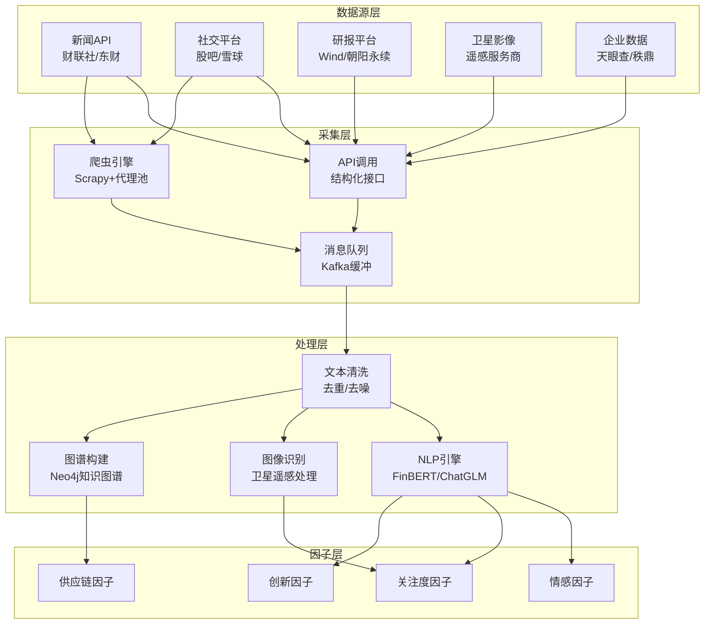
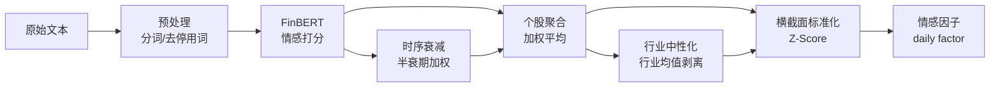

# A股另类数据采集与NLP因子构建

## 概述

另类数据（Alternative Data）是指传统价量和财务数据之外的信息源，包括新闻舆情、社交媒体、卫星遥感、供应链图谱、招聘数据等。这些数据与传统因子相关性低，能提供"蓝海Alpha"。2024-2025年，AI大模型（FinBERT中文版、ChatGLM金融微调）显著降低了NLP因子的构建门槛，另类因子在A股多因子模型中的权重持续提升。

**核心结论**：
- 新闻情感因子与基本面因子相关性低，Alpha空间较高
- 专利数据因子在大盘成长股选股IC突出，覆盖60%+ A股
- 建议多因子融合（LightGBM排序学习）以最大化横截面收益

> 相关笔记：[[A股另类数据与另类因子]] | [[因子评估方法论]] | [[多因子模型构建实战]]

---

## 另类数据源分类与采集

### 数据源全景

| 数据类型 | 代表数据源 | 更新频率 | 成本 | A股覆盖度 | 典型因子 |
|---------|-----------|---------|------|----------|---------|
| **新闻舆情** | 东方财富、新浪财经、财联社 | 实时 | 低-中 | 高(>95%) | 情感得分、关注度 |
| **社交媒体** | 东方财富股吧、雪球、微博财经 | 实时 | 低 | 高(>90%) | 散户情绪、讨论热度 |
| **分析师研报** | Wind、朝阳永续、萝卜投研 | 日频 | 中-高 | 中(60-80%) | 文本情感、观点变化 |
| **卫星遥感** | 商汤科技、珈和科技 | 周-月频 | 高 | 低(10-20%) | 工厂开工率、港口吞吐 |
| **供应链图谱** | 秩鼎、天眼查、企查查 | 月频 | 中 | 中(40-60%) | 供应链中心性、传导 |
| **招聘数据** | 前程无忧、Boss直聘 | 周频 | 中 | 中(30-50%) | 扩张信号、人才需求 |
| **专利数据** | 国家知识产权局、Google Patents | 月频 | 低 | 中(60%+) | 创新能力、技术壁垒 |
| **互动平台** | 上证e互动、深交所互动易 | 日频 | 免费 | 高(>90%) | 高管信心、信息披露 |

### 数据采集架构



### 采集代码示例

```python
import akshare as ak
import pandas as pd
from datetime import datetime, timedelta

# 1. 东方财富股吧情感数据采集
def fetch_guba_sentiment(stock_code: str, pages: int = 5) -> pd.DataFrame:
    """采集股吧帖子并标注情感倾向"""
    posts = []
    for page in range(1, pages + 1):
        try:
            df = ak.stock_comment_detail_zlkp_jgcyd_em(symbol=stock_code)
            posts.append(df)
        except Exception as e:
            print(f"采集失败 page={page}: {e}")
    return pd.concat(posts, ignore_index=True) if posts else pd.DataFrame()

# 2. 个股新闻采集
def fetch_stock_news(stock_code: str) -> pd.DataFrame:
    """通过AKShare获取个股新闻"""
    try:
        df = ak.stock_news_em(symbol=stock_code)
        df['publish_time'] = pd.to_datetime(df['发布时间'])
        return df[['新闻标题', '新闻内容', 'publish_time']]
    except Exception:
        return pd.DataFrame()

# 3. 分析师评级变化
def fetch_analyst_ratings(stock_code: str) -> pd.DataFrame:
    """获取分析师评级数据"""
    try:
        df = ak.stock_profit_forecast_em(symbol=stock_code)
        return df
    except Exception:
        return pd.DataFrame()
```

---

## NLP因子构建流程

### 中文金融NLP技术栈

| 模型 | 基座 | 特点 | 适用场景 | 推理速度 |
|------|------|------|---------|---------|
| **FinBERT-Chinese** | BERT-base | 金融语料预训练 | 情感分类 | 快(~5ms/条) |
| **ChatGLM-Finance** | GLM-6B | 金融指令微调 | 研报摘要/问答 | 中(~200ms) |
| **Qwen-Finance** | Qwen-7B | 通义千问金融版 | 多任务 | 中 |
| **TextCNN** | CNN | 轻量级 | 大批量情感分类 | 极快(~1ms) |
| **SnowNLP** | 朴素贝叶斯 | 零依赖 | 快速原型 | 极快 |

### 情感因子构建流程



### 情感因子构建代码

```python
import torch
from transformers import BertTokenizer, BertForSequenceClassification
import numpy as np
import pandas as pd

class FinancialSentimentEngine:
    """基于FinBERT的A股金融情感分析引擎"""

    def __init__(self, model_path: str = "yiyanghkust/finbert-tone"):
        self.tokenizer = BertTokenizer.from_pretrained(model_path)
        self.model = BertForSequenceClassification.from_pretrained(model_path)
        self.model.eval()
        self.labels = ['negative', 'neutral', 'positive']

    def predict_sentiment(self, texts: list[str]) -> list[dict]:
        """批量预测文本情感"""
        results = []
        for text in texts:
            inputs = self.tokenizer(
                text, return_tensors="pt",
                max_length=512, truncation=True, padding=True
            )
            with torch.no_grad():
                outputs = self.model(**inputs)
                probs = torch.softmax(outputs.logits, dim=-1)[0]

            sentiment_score = float(probs[2] - probs[0])  # positive - negative
            results.append({
                'text': text[:50],
                'score': sentiment_score,
                'label': self.labels[probs.argmax()],
                'confidence': float(probs.max()),
            })
        return results

    def build_daily_factor(
        self, news_df: pd.DataFrame, half_life: int = 5
    ) -> pd.Series:
        """构建日频情感因子（含时间衰减）"""
        # 情感打分
        sentiments = self.predict_sentiment(news_df['title'].tolist())
        news_df['sentiment'] = [s['score'] for s in sentiments]

        # 时间衰减权重（指数衰减）
        days_ago = (pd.Timestamp.now() - news_df['publish_time']).dt.days
        decay_weight = np.exp(-np.log(2) / half_life * days_ago)

        # 加权平均
        factor_value = np.average(
            news_df['sentiment'], weights=decay_weight
        )
        return factor_value
```

---

## 各类另类因子详解

### 1. 新闻情感因子

**构建方法**：
- 采集个股相关新闻（标题+摘要），经FinBERT打分得到[-1, 1]情感值
- 5日指数衰减加权聚合为日频因子
- 行业中性化处理后入多因子模型

**A股实证**：
- 与基本面因子（EP/ROE）相关性 < 0.1，Alpha空间大
- 华泰证券实证：FinBERT处理分析师研报，捕捉相似动量与文本利好信号
- 在公告事件窗口（[-1, +5]日）预测力最强

### 2. 社交媒体情绪因子

**构建方法**：
- 股吧发帖量（关注度因子）、评论情感（散户情绪因子）
- 雪球组合持仓变动（聪明散户信号）
- 微博财经KOL观点聚合

**注意事项**：
- 散户情绪常为反向指标（极端乐观→见顶信号）
- 需区分"噪音"与"信息"——高关注度不等于正面信号

### 3. 分析师研报文本因子

**构建方法**：
- 研报标题/摘要情感分析 → 分析师信心因子
- 评级变化方向（上调/下调比例差）→ 预期修正因子
- 盈利预测修正幅度 → SUE相关因子

**实证表现**：
- 高信息性股票（分析师覆盖充分）中IC显著，Alpha达1.51
- 与[[A股财务质量与盈利预期因子|盈利预期因子]]协同效果好

### 4. 卫星遥感因子

**适用行业**：钢铁（高炉开工率）、化工（储罐液位）、港口（船舶密度）、地产（施工进度）

**数据处理流程**：
1. 卫星影像获取（Sentinel-2/商业卫星）
2. 图像识别（工厂热力图/停车场计数）
3. 时序对比（环比变化）
4. 与行业营收增速交叉验证

**A股案例**：博时智选量化模型率先纳入卫星遥感因子，结合产业链招投标信息，适用于震荡市多因子策略。

### 5. 供应链图谱因子

**构建方法**：
1. 构建企业供应链知识图谱（Neo4j/NetworkX）
2. 计算图谱特征：度中心性、PageRank、聚类系数
3. 供应链传导因子：上游企业营收变化 → 下游股价预测

```python
import networkx as nx
import pandas as pd

def build_supply_chain_factor(relations_df: pd.DataFrame) -> pd.DataFrame:
    """基于供应链图谱构建中心性因子"""
    # 构建有向图
    G = nx.DiGraph()
    for _, row in relations_df.iterrows():
        G.add_edge(
            row['supplier_code'], row['customer_code'],
            weight=row['transaction_amount']
        )

    # 计算图谱特征
    pagerank = nx.pagerank(G, weight='weight')
    degree_centrality = nx.degree_centrality(G)
    betweenness = nx.betweenness_centrality(G, weight='weight')

    factor_df = pd.DataFrame({
        'stock_code': list(pagerank.keys()),
        'pagerank': list(pagerank.values()),
        'degree_centrality': list(degree_centrality.values()),
        'betweenness': list(betweenness.values()),
    })
    return factor_df
```

### 6. 专利与创新因子

**A股实证**：覆盖60%+ A股公司，在大盘成长股选股IC突出
- 专利申请数量增速 → 创新动量因子
- 专利被引次数 → 技术壁垒因子
- 发明专利占比 → 创新质量因子

---

## 因子有效性实证

| 因子类别 | 代表因子 | IC均值 | ICIR | 半衰期 | 换手率 | 最佳适用 |
|---------|---------|--------|------|--------|-------|---------|
| 新闻情感 | FinBERT情感得分 | 0.03-0.05 | 0.3-0.5 | 3-7天 | 高 | 事件窗口 |
| 股吧热度 | 发帖量Z-Score | 0.02-0.04 | 0.2-0.3 | 1-3天 | 极高 | 反向指标 |
| 研报情感 | 研报文本极性 | 0.04-0.06 | 0.4-0.6 | 5-15天 | 中 | 中大盘股 |
| 分析师修正 | 评级变化方向 | 0.05-0.08 | 0.5-0.8 | 15-30天 | 中低 | 覆盖充分股 |
| 卫星遥感 | 工厂开工率变化 | 0.03-0.06 | 0.3-0.5 | 30-90天 | 低 | 周期行业 |
| 供应链中心性 | PageRank | 0.02-0.04 | 0.2-0.4 | 60-180天 | 极低 | 长期持有 |
| 专利创新 | 专利申请增速 | 0.03-0.05 | 0.3-0.5 | 90-180天 | 极低 | 成长股 |

---

## 合规边界

| 风险点 | 法规依据 | 建议 |
|--------|---------|------|
| **爬虫采集** | 《个人信息保护法》《数据安全法》 | 仅采集公开数据，遵守robots.txt |
| **股吧数据** | 《计算机信息网络国际联网安全保护管理办法》 | 不采集用户个人信息，仅聚合统计 |
| **内幕信息** | 《证券法》第五十三条 | 确保数据来源合法，不使用未公开信息 |
| **卫星遥感** | 《测绘法》《遥感影像公开使用管理规定》 | 使用正规商业卫星服务商 |
| **研报使用** | 券商研报版权 | 付费获取授权，不全文存储 |

---

## 参数速查表

| 参数 | 推荐值 | 说明 |
|------|--------|------|
| 情感模型 | FinBERT-Chinese | 金融领域中文情感分析首选 |
| 文本最大长度 | 512 tokens | BERT输入上限 |
| 时间衰减半衰期 | 5天（新闻）/ 15天（研报） | 指数衰减权重 |
| 行业中性化 | 申万一级行业 | 剥离行业效应 |
| 因子标准化 | MAD去极值 + Z-Score | 横截面标准化 |
| 最小新闻条数 | 5条/股/周 | 低于此阈值的因子值不可靠 |
| 情感阈值 | ±0.3 | 低于阈值判为中性 |
| 批量推理batch_size | 32-64 | GPU推理效率优化 |
| 图谱更新频率 | 月频 | 供应链关系变化缓慢 |
| 专利数据滞后 | 3-6个月 | 专利公开有延迟 |

---

## 常见误区

| 误区 | 真相 |
|------|------|
| 另类数据越多越好 | 数据质量 > 数量，垃圾数据只会增加噪声 |
| 情感因子直接用于选股 | 需先行业中性化和标准化，原始分数不可比 |
| 股吧情绪是正向指标 | 散户极端乐观往往是反向信号，需区分使用 |
| FinBERT直接用英文版 | 中文金融语境差异大，必须用中文金融语料微调版本 |
| 卫星遥感适用所有行业 | 仅适用于有实物资产的周期行业，TMT/金融无效 |
| 知识图谱构建一次就够 | 供应链关系持续变化，需月频以上更新 |
| 另类因子可替代传统因子 | 另类因子是补充而非替代，与传统因子组合效果最佳 |

---

## 相关链接

- [[A股另类数据与另类因子]] — 另类数据全景概述
- [[因子评估方法论]] — IC/ICIR评估框架
- [[A股基本面因子体系]] — 传统基本面因子参照
- [[多因子模型构建实战]] — 多因子模型融合方法
- [[A股量化数据源全景图]] — 数据源选型指南
- [[A股机器学习量化策略]] — ML模型在因子中的应用
