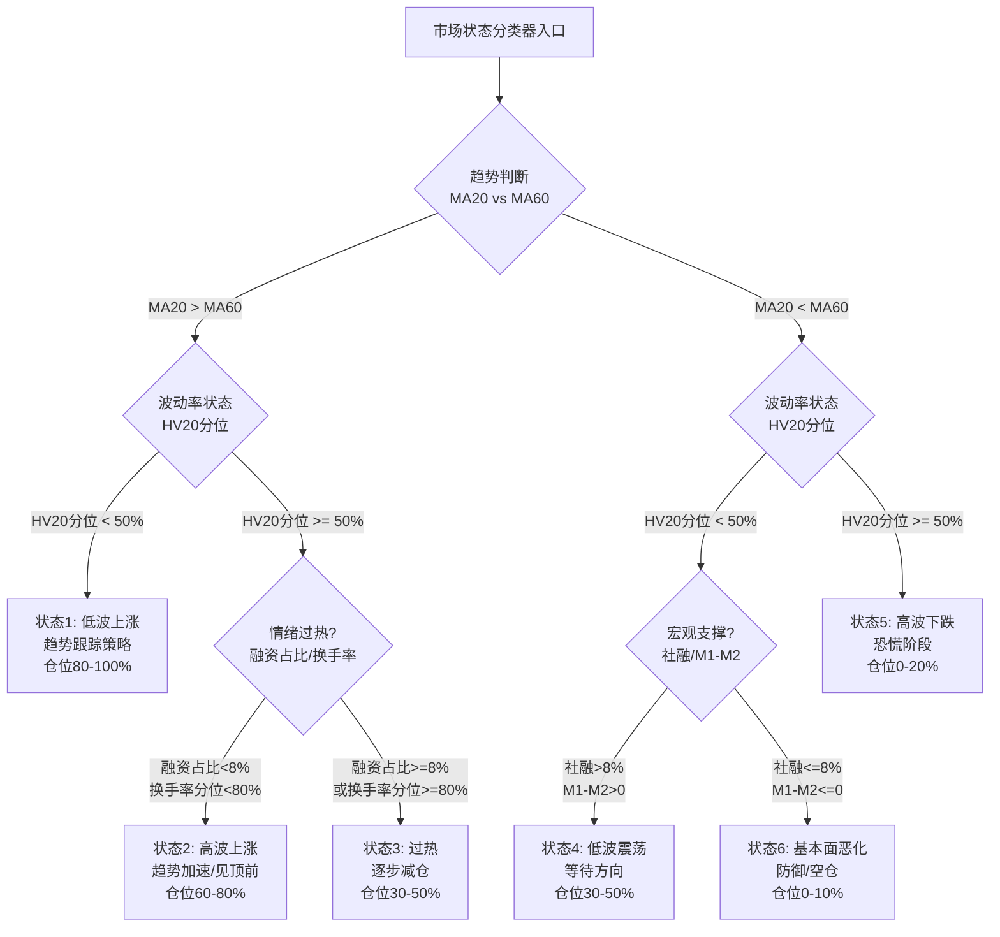
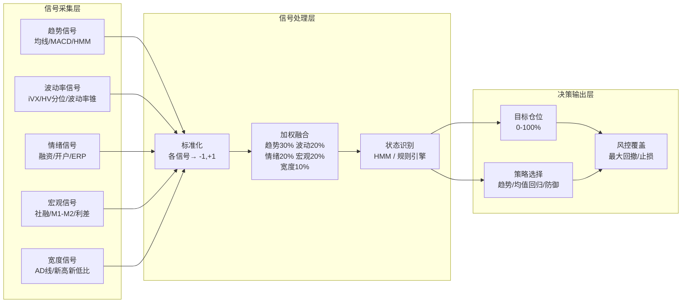

# A股市场状态识别与择时因子

## 核心要点

> [!summary] 一句话概括
> 市场状态识别与择时是将**趋势识别**（均线系统/MACD/海龟通道）、**波动率状态**（iVX/波动率锥/历史波动率分位）、**情绪指标**（融资买入占比/股债收益差/基金发行热度等）、**宏观择时**（社融/M1-M2剪刀差/信用利差/期限利差）和**技术面宽度**（涨跌比/新高新低比/AD线）五大维度信号进行融合，从"预测涨跌"转向"识别状态"，在不同市场 regime 下动态调整仓位与策略。

择时的核心范式转变：
1. **从预测到分类** — 不预测明日涨跌，而是识别当前处于哪种市场状态（趋势上涨/震荡/趋势下跌）
2. **从单信号到多维融合** — 任何单一择时指标胜率有限（通常50%-60%），多维信号投票可将信息比率提升50%以上
3. **从固定规则到自适应** — 不同市场状态下切换策略参数，而非用固定阈值硬切

---

## 一、趋势识别与均线系统

### 1.1 移动均线系统（Moving Average System）

移动均线是最经典的趋势跟踪工具，A股常用参数组合：

| 均线组合 | 适用场景 | 信号规则 | A股特征 |
|----------|----------|----------|---------|
| MA5/MA20 | 短线趋势 | 金叉买入/死叉卖出 | 震荡市假信号多，需过滤 |
| MA20/MA60 | 中线趋势 | 20日上穿60日=中期多头 | 适合波段操作 |
| MA60/MA250 | 长线牛熊 | 60日上穿250日=牛市确认 | 年线（250日）为"牛熊分界线" |
| MA120/MA250 | 大级别趋势 | 半年线与年线交叉 | 信号稀缺但可靠性高 |

**双均线交叉策略优化要点：**
- **滞后性修正**：加入价格突破确认（收盘价需连续N日位于均线之上）
- **假突破过滤**：要求交叉幅度>均线值的0.5%-1%
- **成交量确认**：金叉时要求成交量放大至20日均量的1.2倍以上

### 1.2 MACD（Moving Average Convergence Divergence）

MACD在A股应用广泛，标准参数（12,26,9）及优化方向：

**经典信号：**
- **零轴之上金叉**：DIF上穿DEA且均在零轴上方 → 强势买入信号
- **零轴之下死叉**：DIF下穿DEA且均在零轴下方 → 强势卖出信号
- **底背离**：价格创新低但MACD未创新低 → 趋势反转信号
- **顶背离**：价格创新高但MACD未创新高 → 见顶警告

**A股优化参数：**
- 短周期（6,13,5）：适合题材股、高波动环境
- 长周期（19,39,9）：适合蓝筹、低波动稳定趋势
- 周线MACD零轴金叉：中长期择时可靠性较高，A股历史上周线MACD零轴上方金叉后持有30个交易日胜率约65%

### 1.3 自适应均线（Adaptive Moving Average, AMA）

Kaufman自适应均线（KAMA）根据市场噪声自动调整平滑系数：

$$AMA_t = AMA_{t-1} + SC_t \times (Price_t - AMA_{t-1})$$

其中 $SC_t$（平滑常数）= $[ER_t \times (fast - slow) + slow]^2$

- $ER$（效率比率）= |方向变动| / 总波动路径
- $fast = 2/(2+1) = 0.6667$，$slow = 2/(30+1) = 0.0645$

**A股适用性**：AMA在震荡市中收敛为慢速均线（减少假信号），在趋势市中扩展为快速均线（减少滞后），比固定参数均线更适合A股频繁切换的牛熊震荡格局。

### 1.4 海龟通道（Donchian Channel / Turtle Trading）

海龟交易系统的核心——唐奇安通道突破：

| 参数 | 经典值 | A股优化值 | 说明 |
|------|--------|-----------|------|
| 入场通道 | 20日最高价突破 | 20-25日 | 突破N日最高价做多 |
| 离场通道 | 10日最低价跌破 | 10-15日 | 跌破N日最低价平仓 |
| ATR周期 | 20日 | 20日 | 仓位管理基准 |
| 单位头寸 | 1%账户净值/ATR | 0.5%-1% | A股波动大，可适当缩小 |

**A股适配修改：**
- T+1制度下无法当日止损，需设置更宽的通道参数或隔夜止损规则
- 涨跌停板可能导致无法按信号执行，需预留流动性缓冲
- 建议结合成交量突破确认，过滤假突破

### 1.5 隐马尔科夫模型（HMM）状态识别

HMM将市场划分为不可观测的隐藏状态，通过可观测序列（收益率、波动率）推断：

**四状态模型（推荐）：**
- **状态1：趋势上涨** — 胜率高、正收益、波动适中
- **状态2：震荡上涨** — 概率最大（约34%-65%时间），窄幅波动
- **状态3：震荡下跌** — 收益微负，波动收敛
- **状态4：趋势下跌** — 负收益、高波动

**观测变量选择：**
- 10日涨跌幅 + 10日ATR变化率
- 90天滚动窗口动态阈值
- 映射为6种观测状态（宽幅震荡/窄幅震荡/趋势上涨/趋势下跌等）

**HMM择时逻辑：** 通过状态转移矩阵估计次日状态概率，当趋势上涨概率>阈值时持仓，趋势下跌概率上升时减仓。结合"宏观-资金情绪-市场状态"三维调制矩阵，可解决HMM静态假设的缺陷。

---

## 二、波动率状态识别

### 2.1 iVX：中国版VIX

iVX（China Volatility Index，原代码000188）基于上证50ETF期权隐含波动率编制，衡量市场未来30天预期波动幅度。

**计算方法（参考CBOE VIX白皮书）：**

$$\sigma^2 = \frac{2}{T} \sum_i \frac{\Delta K_i}{K_i^2} e^{rT} Q(K_i) - \frac{1}{T} \left( \frac{F}{K_0} - 1 \right)^2$$

其中：$T$ 为到期时间，$Q(K_i)$ 为期权中间价，$F$ 为远期价格，$r$ 为无风险利率（SHIBOR）。

最终 iVX = 100 × σ × √(30/365)

**历史规律与择时阈值：**

| iVX水平 | 历史分位 | 市场状态 | 择时含义 |
|---------|---------|---------|---------|
| <15% | <20%分位 | 极度平静 | 警惕突破行情，可布局期权多头波动率 |
| 15%-20% | 20%-50%分位 | 正常偏低 | 适合趋势跟踪策略 |
| 20%-30% | 50%-80%分位 | 波动放大 | 缩小仓位，增加对冲 |
| >30% | >80%分位 | 恐慌状态 | 逆向买入信号（极端恐慌后均值回归） |
| >40% | >95%分位 | 极度恐慌 | 历史大底附近，如2015年股灾、2020年疫情 |

**数据获取：** 上交所2015年首发后停发，万得（Wind）自2019年起发布CIVIX（走势一致）。GitHub开源工具（如 calculate_ivix）可基于Tushare期权数据复现。

### 2.2 历史波动率分位数

将当前已实现波动率置于历史分布中定位：

**计算方法：**
```
HV_N = std(log_returns, window=N) × √252 × 100
Percentile = rank(HV_N_current, HV_N_history) / len(HV_N_history)
```

**常用窗口与A股经验：**
- HV20（20日）：短期波动状态，快速响应
- HV60（60日）：中期波动趋势
- HV120（120日）：长期波动中枢

**分位数择时规则：**
- HV20分位 < 10%：波动率极低，"暴风雨前的宁静"，常预示大行情
- HV20分位 > 90%：波动率极高，通常在急跌末期，均值回归概率大
- HV20 > HV60 > HV120：波动率期限结构倒挂，市场处于异常状态

### 2.3 波动率锥（Volatility Cone）

波动率锥将不同期限的历史波动率分位数绘制在同一图表，形成锥形结构：

**构建方法：**
1. 对每个期限N（10/20/30/60/90日），计算滚动历史波动率序列
2. 统计各期限的5%/25%/50%/75%/95%分位数
3. 将当前隐含波动率（iVX对应期限）叠加在锥上比较

**择时应用：**
- 隐含波动率位于锥体上沿（>75%分位）→ 市场过度恐慌，做空波动率/逆向买入
- 隐含波动率位于锥体下沿（<25%分位）→ 市场过度平静，做多波动率/警惕黑天鹅
- 波动率锥收窄 → 各期限波动率趋同，市场处于稳态
- 波动率锥扩张 → 短期波动率远高于长期，市场处于应激状态

---

## 三、市场情绪指标

### 3.1 融资买入占比

**定义：** 两融账户融资买入额 / 全市场成交额

| 阈值区间 | 含义 | 择时信号 |
|----------|------|---------|
| <5% | 杠杆资金低迷 | 市场偏冷，关注底部信号 |
| 5%-8% | 正常水平 | 中性 |
| 8%-10% | 杠杆偏热 | 情绪偏热，警惕回调 |
| >10% | 过度杠杆 | 强烈的顶部信号（2015年牛市顶部约12%） |

**数据源：** 交易所每日公布融资融券余额与交易数据，Wind/Choice/Tushare均可获取。

### 3.2 新开户数

**逻辑：** 散户入场的同步/滞后指标，新开户数激增通常出现在牛市中后期。

| 指标变化 | 历史经验 | 信号强度 |
|----------|---------|---------|
| 周开户数 < 10万 | 市场冷淡期 | 中长期底部区域 |
| 周开户数 10-30万 | 正常活跃 | 中性 |
| 周开户数 > 50万 | 过热信号 | 2007年、2015年牛市顶部前兆 |
| 周开户数 > 100万 | 极度疯狂 | 强烈的顶部信号 |

### 3.3 基金发行热度

**逻辑：** 基金发行规模是居民资金入市的重要渠道，发行热度与市场情绪高度正相关。

**量化方法：**
- 月度偏股型基金发行份额（亿份）
- 爆款基金（首日募集超100亿）出现频率
- 基金发行/赎回净值比

**经验规则：** 单月偏股基金发行超2000亿份为过热信号（2021年1月曾超4000亿份），月度发行低于200亿份为冷淡期（底部区域）。

### 3.4 封闭式基金折价率

**逻辑：** 封闭式基金折价率反映市场对未来预期的悲观/乐观程度。

| 折价率水平 | 含义 | 择时参考 |
|-----------|------|---------|
| >20% | 深度折价 | 市场极度悲观，历史上对应底部区域 |
| 10%-20% | 正常折价 | 中性偏悲观 |
| 5%-10% | 低折价 | 情绪偏乐观 |
| 折价转溢价 | 极度乐观 | 2007年、2015年牛市末期特征 |

### 3.5 股债收益差（Fed Model / 股权风险溢价 ERP）

**定义：** 万得全A市盈率倒数（E/P） - 10年期国债收益率

$$ERP = \frac{1}{PE_{万得全A}} - Y_{10年国债}$$

**择时阈值（基于均值±标准差）：**
- ERP > 均值+2σ：股票极度低估（如2018年底、2022年10月），强烈买入
- ERP > 均值+1σ：股票相对低估，逐步建仓
- 均值-1σ < ERP < 均值+1σ：中性区域
- ERP < 均值-1σ：股票相对高估，逐步减仓
- ERP < 均值-2σ：股票极度高估（如2015年6月），强烈卖出

**历史有效性：** 股债收益差是A股最具长期有效性的择时指标之一，2006-2024年间的主要顶部和底部均可被±2σ信号捕获。

### 3.6 换手率历史分位

**计算：** 全市场日均换手率的N日滚动分位数

| 换手率分位 | 市场状态 | 择时含义 |
|-----------|---------|---------|
| <10%分位 | 地量 | "地量见地价"，底部信号 |
| 10%-30%分位 | 偏低 | 筑底或阴跌阶段 |
| 30%-70%分位 | 正常 | 中性 |
| 70%-90%分位 | 偏高 | 趋势加速或接近过热 |
| >90%分位 | 天量 | "天量见天价"，顶部预警 |

**A股经验：** 日成交额连续破万亿（2020年后常态化需动态调整基准），换手率需结合流通市值增长做归一化处理。

### 3.7 其他情绪辅助指标

- **涨停板数量与连板高度**：涨停家数>100为情绪偏热，最高连板>10为极度亢奋
- **股票型ETF净申赎**：大额净申购常出现在下跌途中（聪明钱），大额净赎回出现在上涨途中
- **期权PCR（Put/Call Ratio）**：看跌/看涨期权成交比，>1.2为过度悲观，<0.6为过度乐观

---

## 四、宏观择时因子

### 4.1 社融增速

**逻辑：** 社会融资规模是实体经济获取资金的总量指标，增速领先A股盈利周期约2-3个季度。

| 社融增速 | 择时信号 | 历史经验 |
|----------|---------|---------|
| >10%且加速 | 强烈看多 | 流动性充裕+经济改善，如2020年H1 |
| 8%-10%稳定 | 温和看多 | 正常扩张期 |
| 5%-8%且减速 | 谨慎偏空 | 信用收缩初期 |
| <5% | 防御 | 经济下行压力大，如2022年 |

**领先性验证：** 社融增速拐点平均领先沪深300约2-4个月。

### 4.2 M1-M2剪刀差

**定义：** M1同比增速 - M2同比增速

**经济含义：** M1代表企业活期存款（经营活跃度），M2代表广义货币（含定期）。剪刀差为正，说明资金从定期转为活期，企业/居民投资意愿增强。

| M1-M2剪刀差 | 择时信号 | 阈值参考 |
|-------------|---------|---------|
| > +5% | 强牛信号 | 资金极度活跃，2006年、2009年行情启动 |
| +2% ~ +5% | 看多 | 经济活跃期 |
| 0% ~ +2% | 中性偏多 | 温和改善 |
| -2% ~ 0% | 中性偏空 | 资金趋于保守 |
| < -2% | 看空 | 资金沉淀为储蓄，风险偏好低 |

**注意事项：** 2024年后央行调整M1统计口径（纳入个人活期、非银支付机构备付金），导致历史序列出现跳变，需做口径调整后方可使用。

### 4.3 信用利差

**定义：** AA级企业债收益率 - 同期限国债收益率

| 信用利差 | 市场环境 | 择时信号 |
|----------|---------|---------|
| <80bp且收窄 | 信用扩张、风险偏好高 | 进攻性配置（成长/小盘） |
| 80-120bp | 正常水平 | 中性 |
| >120bp且走扩 | 信用收缩、避险情绪 | 防御性配置（价值/大盘） |
| >150bp | 信用危机 | 大幅降低权益仓位 |

### 4.4 期限利差

**定义：** 10年期国债收益率 - 2年期国债收益率（或1年期）

| 期限利差 | 经济含义 | 择时信号 |
|----------|---------|---------|
| >60bp（陡峭） | 经济复苏预期强 | 支持权益资产，偏好周期 |
| 30-60bp | 正常 | 中性 |
| <30bp（平坦化） | 经济放缓预期 | 偏防御 |
| <0bp（倒挂） | 衰退预警 | 历史上2-4个季度后经济下行，减仓 |

### 4.5 美债收益率对A股的传导

**传导路径：** 美债收益率↑ → 全球无风险利率上行 → 中美利差收窄/倒挂 → 资本外流压力 + A股估值承压

| 美债10Y水平 | 对A股影响 | 配置建议 |
|------------|----------|---------|
| <3.5% | 外部环境友好 | 正常配置 |
| 3.5%-4.5% | 温和压制 | 关注中美利差 |
| >4.5% | 显著压制 | 降低权益仓位，尤其外资重仓股 |
| >5% | 严重冲击 | 历史罕见，全面防御 |

**综合宏观择时阈值矩阵：**

| 信号组合 | 看多条件 | 看空条件 |
|----------|---------|---------|
| 流动性组合 | 社融>8% + M1-M2>+3% | 社融<5% + M1-M2<0 |
| 风险偏好组合 | 信用利差<80bp + 期限利差>60bp | 信用利差>120bp + 期限利差<20bp |
| 全球联动组合 | 美债<4% + 社融>10% | 美债>4.5% + 社融<6% |

---

## 五、技术面择时（市场宽度指标）

### 5.1 涨跌比（Advance-Decline Ratio / AD Line）

**定义：** 上涨家数 / 下跌家数（或其累积线）

**AD线构建：** $AD_t = AD_{t-1} + (上涨家数_t - 下跌家数_t)$

**择时信号：**
- **AD线与指数同步创新高**：趋势健康，继续持有
- **指数创新高但AD线未创新高（宽度背离）**：仅少数权重股拉升，趋势即将结束
- **AD线率先走强**：市场宽度改善，底部信号
- A股特征：由于权重股与中小盘分化显著，宽度背离在A股频繁出现且具较好预测力

### 5.2 新高新低比

**定义：** 创N日新高家数 / (创N日新高家数 + 创N日新低家数)

常用N=20日或52周（250日）。

| 新高新低比 | 市场状态 | 信号 |
|-----------|---------|------|
| >0.8 | 普涨 | 趋势强劲 |
| 0.5-0.8 | 偏强 | 正常上涨 |
| 0.2-0.5 | 分化 | 谨慎 |
| <0.2 | 普跌 | 趋势下跌 |
| 从<0.1回升至>0.3 | 反转信号 | 底部确认 |

### 5.3 创新高天数占比

华泰证券10大最佳技术择时指标之一：过去20日中创阶段新高的天数占比。

- 占比>50%：趋势加速阶段，正向择时信号
- 占比<10%：趋势极弱，反向择时或等待
- 与ADX（平均趋向指标）配合：ADX>25确认趋势存在 + 新高天数占比>40%确认方向

### 5.4 华泰证券技术择时10大指标体系

基于五维度（价格/量能/趋势/波动/拥挤）构建综合打分：

| 维度 | 指标 | 信号方向 |
|------|------|---------|
| 价格 | 20日价格乖离率 | 正向（偏离越大趋势越强） |
| 价格 | 20日布林带突破 | 上轨买/下轨卖 |
| 量能 | 20日换手率乖离率 | 正向 |
| 量能 | 60日换手率乖离率 | 正向 |
| 趋势 | 20日ADX | 趋势强度 |
| 趋势 | 20日创新高天数占比 | 正向 |
| 波动 | 期权隐含波动率 | 反向（高波动率=风险） |
| 波动 | 60日换手率波动 | 不稳定性 |
| 拥挤 | 涨停占比5日均值 | 拥挤度 |
| 拥挤 | 期权持仓量PCR均值 | 看空比例 |

**综合打分：** 每个指标归一化为[-1, +1]，等权投票。覆盖率>0.7时信号有效（万得全A、沪深300表现>1）。特征："震荡小亏、趋势多赚"。

---

## 六、参数速查表

> [!info] 各维度择时指标阈值与信号速查

### 6.1 趋势识别

| 指标 | 看多信号 | 看空信号 | 参数 |
|------|---------|---------|------|
| 双均线 | MA20上穿MA60 | MA20下穿MA60 | 20/60日 |
| MACD | 零轴上方金叉 | 零轴下方死叉 | (12,26,9) |
| KAMA | 价格站上AMA且AMA上行 | 价格跌破AMA且AMA下行 | ER=10, fast=2, slow=30 |
| 海龟通道 | 突破20日最高价 | 跌破10日最低价 | 20/10日 |
| HMM状态 | P(趋势上涨)>0.5 | P(趋势下跌)>0.3 | 4状态,90日滚动 |

### 6.2 波动率状态

| 指标 | 低波信号 | 高波信号 | 极端阈值 |
|------|---------|---------|---------|
| iVX | <15%（过低，警惕突破） | >30%（恐慌，逆向买入） | >40%极度恐慌 |
| HV20分位 | <10%（即将爆发） | >90%（均值回归） | — |
| 波动率锥位置 | <25%分位 | >75%分位 | — |

### 6.3 情绪指标

| 指标 | 底部信号 | 顶部信号 | 数据频率 |
|------|---------|---------|---------|
| 融资买入占比 | <5% | >10% | 日频 |
| 新开户数 | <10万/周 | >50万/周 | 周频 |
| 基金发行 | <200亿份/月 | >2000亿份/月 | 月频 |
| 封基折价率 | >20% | 折价转溢价 | 周频 |
| 股债收益差 | >均值+2σ | <均值-2σ | 日频 |
| 换手率分位 | <10% | >90% | 日频 |

### 6.4 宏观择时

| 指标 | 看多阈值 | 看空阈值 | 领先期 |
|------|---------|---------|--------|
| 社融增速 | >10%加速 | <5%减速 | 2-4个月 |
| M1-M2剪刀差 | >+3% | <0% | 1-3个月 |
| 信用利差 | <80bp收窄 | >120bp走扩 | 同步-1个月 |
| 期限利差 | >60bp | <0bp（倒挂） | 2-4个季度 |
| 美债10Y | <3.5% | >4.5% | 同步 |

---

## 七、市场状态分类器决策树与择时信号集成流程

### 7.1 市场状态分类器决策树



### 7.2 择时信号集成流程



---

## 八、Python实现

### 8.1 MarketStateClassifier 类

```python
"""
市场状态分类器 — 融合趋势/波动率/情绪/宏观/宽度五维信号
依赖: numpy, pandas, scipy, hmmlearn (可选)
数据源: [[A股量化数据源全景图]] 中的 Tushare / AKShare / Wind
"""

import numpy as np
import pandas as pd
from dataclasses import dataclass, field
from typing import Dict, Tuple, Optional, List
from enum import IntEnum
from scipy import stats


class MarketState(IntEnum):
    """市场状态枚举"""
    TREND_UP_LOW_VOL = 1      # 低波上涨
    TREND_UP_HIGH_VOL = 2     # 高波上涨
    OVERHEAT = 3              # 过热
    RANGE_BOUND = 4           # 低波震荡
    TREND_DOWN_HIGH_VOL = 5   # 高波下跌
    FUNDAMENTAL_WEAK = 6      # 基本面恶化


@dataclass
class TimingSignal:
    """单个择时信号"""
    name: str
    value: float           # 原始值
    score: float           # 标准化得分 [-1, +1]
    weight: float          # 权重
    category: str          # 类别: trend/vol/sentiment/macro/breadth
    timestamp: pd.Timestamp = None


@dataclass
class MarketRegime:
    """市场状态识别结果"""
    state: MarketState
    confidence: float              # 置信度 [0, 1]
    target_position: float         # 目标仓位 [0, 1]
    composite_score: float         # 综合得分 [-1, +1]
    signals: List[TimingSignal] = field(default_factory=list)
    strategy_hint: str = ""        # 策略建议


class MarketStateClassifier:
    """
    市场状态分类器

    五大维度:
    1. 趋势识别 (30%): MA系统, MACD, 海龟通道
    2. 波动率状态 (20%): 历史波动率分位, iVX (如可用)
    3. 情绪指标 (20%): 融资占比, 股债收益差, 换手率分位
    4. 宏观因子 (20%): 社融增速, M1-M2, 信用利差, 期限利差
    5. 市场宽度 (10%): AD线, 新高新低比
    """

    # 权重配置
    WEIGHTS = {
        'trend': 0.30,
        'volatility': 0.20,
        'sentiment': 0.20,
        'macro': 0.20,
        'breadth': 0.10,
    }

    # 仓位映射表
    POSITION_MAP = {
        MarketState.TREND_UP_LOW_VOL: (0.8, 1.0),
        MarketState.TREND_UP_HIGH_VOL: (0.6, 0.8),
        MarketState.OVERHEAT: (0.3, 0.5),
        MarketState.RANGE_BOUND: (0.3, 0.5),
        MarketState.TREND_DOWN_HIGH_VOL: (0.0, 0.2),
        MarketState.FUNDAMENTAL_WEAK: (0.0, 0.1),
    }

    STRATEGY_MAP = {
        MarketState.TREND_UP_LOW_VOL: "趋势跟踪: 持有多头, 逢回调加仓",
        MarketState.TREND_UP_HIGH_VOL: "趋势跟踪+止盈: 持有但设置移动止盈",
        MarketState.OVERHEAT: "逐步减仓: 分批止盈, 增加对冲",
        MarketState.RANGE_BOUND: "均值回归: 高抛低吸, 等待方向",
        MarketState.TREND_DOWN_HIGH_VOL: "防御: 轻仓或空仓, 等待恐慌见底",
        MarketState.FUNDAMENTAL_WEAK: "全面防御: 空仓或持有现金/债券",
    }

    def __init__(self, lookback: int = 250):
        self.lookback = lookback

    # ── 趋势信号 ──────────────────────────────────────────────

    @staticmethod
    def calc_ma_signal(close: pd.Series, fast: int = 20, slow: int = 60) -> TimingSignal:
        """双均线信号: MA_fast vs MA_slow"""
        ma_fast = close.rolling(fast).mean()
        ma_slow = close.rolling(slow).mean()
        diff_pct = (ma_fast.iloc[-1] - ma_slow.iloc[-1]) / ma_slow.iloc[-1]
        # 归一化到 [-1, 1], 以 ±5% 为满分
        score = np.clip(diff_pct / 0.05, -1, 1)
        return TimingSignal(
            name=f"MA{fast}/{slow}",
            value=diff_pct,
            score=score,
            weight=0.4,
            category='trend',
        )

    @staticmethod
    def calc_macd_signal(close: pd.Series,
                         fast: int = 12, slow: int = 26, signal: int = 9
                         ) -> TimingSignal:
        """MACD信号: DIF与DEA的相对位置"""
        ema_fast = close.ewm(span=fast, adjust=False).mean()
        ema_slow = close.ewm(span=slow, adjust=False).mean()
        dif = ema_fast - ema_slow
        dea = dif.ewm(span=signal, adjust=False).mean()
        histogram = dif - dea
        # 标准化
        hist_std = histogram.rolling(60).std()
        score_raw = histogram.iloc[-1] / hist_std.iloc[-1] if hist_std.iloc[-1] > 0 else 0
        score = np.clip(score_raw / 2, -1, 1)
        return TimingSignal(
            name="MACD",
            value=histogram.iloc[-1],
            score=score,
            weight=0.3,
            category='trend',
        )

    @staticmethod
    def calc_donchian_signal(high: pd.Series, low: pd.Series, close: pd.Series,
                             entry_period: int = 20, exit_period: int = 10
                             ) -> TimingSignal:
        """海龟通道信号"""
        upper = high.rolling(entry_period).max()
        lower = low.rolling(exit_period).min()
        channel_width = upper.iloc[-1] - lower.iloc[-1]
        position_in_channel = (close.iloc[-1] - lower.iloc[-1]) / channel_width if channel_width > 0 else 0.5
        score = np.clip((position_in_channel - 0.5) * 2, -1, 1)
        return TimingSignal(
            name=f"Donchian({entry_period}/{exit_period})",
            value=position_in_channel,
            score=score,
            weight=0.3,
            category='trend',
        )

    # ── 波动率信号 ─────────────────────────────────────────────

    @staticmethod
    def calc_hv_percentile_signal(close: pd.Series,
                                  hv_window: int = 20,
                                  lookback: int = 250
                                  ) -> TimingSignal:
        """历史波动率分位数信号"""
        log_ret = np.log(close / close.shift(1))
        hv = log_ret.rolling(hv_window).std() * np.sqrt(252) * 100
        hv_current = hv.iloc[-1]
        hv_history = hv.iloc[-lookback:]
        percentile = stats.percentileofscore(hv_history.dropna(), hv_current) / 100
        # 高波动率给负分(风险高), 极低波动率也给负分(暴风雨前宁静)
        if percentile < 0.1:
            score = -0.3  # 极低波动, 警惕
        elif percentile < 0.5:
            score = 0.5 * (1 - percentile * 2)  # 低波正面
        else:
            score = -1.0 * (percentile - 0.5) * 2  # 高波负面
        return TimingSignal(
            name=f"HV{hv_window}_Percentile",
            value=percentile,
            score=np.clip(score, -1, 1),
            weight=0.6,
            category='volatility',
        )

    @staticmethod
    def calc_ivx_signal(ivx_value: float, ivx_history: pd.Series) -> TimingSignal:
        """iVX (中国波指) 信号 — 需要期权数据"""
        percentile = stats.percentileofscore(ivx_history.dropna(), ivx_value) / 100
        # iVX作为恐惧指标, 极高值反而是逆向买入
        if percentile > 0.9:
            score = 0.5   # 极度恐慌 → 逆向看多
        elif percentile > 0.8:
            score = -0.5  # 高恐慌 → 偏空
        elif percentile < 0.2:
            score = -0.3  # 极低波动 → 警惕
        else:
            score = 0.3 * (0.5 - percentile) * 2
        return TimingSignal(
            name="iVX",
            value=ivx_value,
            score=np.clip(score, -1, 1),
            weight=0.4,
            category='volatility',
        )

    # ── 情绪信号 ──────────────────────────────────────────────

    @staticmethod
    def calc_margin_ratio_signal(margin_buy: pd.Series,
                                 total_amount: pd.Series
                                 ) -> TimingSignal:
        """融资买入占比信号"""
        ratio = (margin_buy / total_amount * 100).iloc[-1]
        if ratio > 10:
            score = -1.0
        elif ratio > 8:
            score = -0.5
        elif ratio < 5:
            score = 0.5
        else:
            score = 0.0
        return TimingSignal(
            name="融资买入占比",
            value=ratio,
            score=score,
            weight=0.25,
            category='sentiment',
        )

    @staticmethod
    def calc_erp_signal(pe_series: pd.Series, bond_yield: pd.Series,
                        lookback: int = 750) -> TimingSignal:
        """股债收益差(ERP)信号"""
        erp = 1 / pe_series * 100 - bond_yield  # E/P - 国债收益率
        erp_current = erp.iloc[-1]
        erp_hist = erp.iloc[-lookback:]
        mu, sigma = erp_hist.mean(), erp_hist.std()
        z_score = (erp_current - mu) / sigma if sigma > 0 else 0
        # ERP高 = 股票便宜 = 看多; ERP低 = 股票贵 = 看空
        score = np.clip(z_score / 2, -1, 1)
        return TimingSignal(
            name="股债收益差(ERP)",
            value=erp_current,
            score=score,
            weight=0.35,
            category='sentiment',
        )

    @staticmethod
    def calc_turnover_percentile_signal(turnover: pd.Series,
                                        lookback: int = 250
                                        ) -> TimingSignal:
        """换手率历史分位信号"""
        current = turnover.iloc[-1]
        percentile = stats.percentileofscore(
            turnover.iloc[-lookback:].dropna(), current) / 100
        # 极高换手 = 过热顶部; 极低换手 = 底部
        if percentile > 0.9:
            score = -0.8
        elif percentile < 0.1:
            score = 0.6
        else:
            score = 0.3 * (0.5 - percentile) * 2
        return TimingSignal(
            name="换手率分位",
            value=percentile,
            score=np.clip(score, -1, 1),
            weight=0.2,
            category='sentiment',
        )

    # ── 宏观信号 ──────────────────────────────────────────────

    @staticmethod
    def calc_social_financing_signal(sf_growth: float) -> TimingSignal:
        """社融增速信号"""
        if sf_growth > 10:
            score = 1.0
        elif sf_growth > 8:
            score = 0.5
        elif sf_growth > 5:
            score = -0.3
        else:
            score = -1.0
        return TimingSignal(
            name="社融增速",
            value=sf_growth,
            score=score,
            weight=0.3,
            category='macro',
        )

    @staticmethod
    def calc_m1m2_signal(m1_growth: float, m2_growth: float) -> TimingSignal:
        """M1-M2剪刀差信号"""
        spread = m1_growth - m2_growth
        if spread > 5:
            score = 1.0
        elif spread > 2:
            score = 0.6
        elif spread > 0:
            score = 0.2
        elif spread > -2:
            score = -0.3
        else:
            score = -0.8
        return TimingSignal(
            name="M1-M2剪刀差",
            value=spread,
            score=score,
            weight=0.25,
            category='macro',
        )

    @staticmethod
    def calc_credit_spread_signal(credit_spread_bp: float) -> TimingSignal:
        """信用利差信号 (bp)"""
        if credit_spread_bp < 80:
            score = 0.8
        elif credit_spread_bp < 120:
            score = 0.0
        elif credit_spread_bp < 150:
            score = -0.5
        else:
            score = -1.0
        return TimingSignal(
            name="信用利差",
            value=credit_spread_bp,
            score=score,
            weight=0.25,
            category='macro',
        )

    @staticmethod
    def calc_term_spread_signal(term_spread_bp: float) -> TimingSignal:
        """期限利差信号 (10Y-2Y, bp)"""
        if term_spread_bp > 60:
            score = 0.8
        elif term_spread_bp > 30:
            score = 0.3
        elif term_spread_bp > 0:
            score = -0.3
        else:
            score = -1.0  # 倒挂
        return TimingSignal(
            name="期限利差",
            value=term_spread_bp,
            score=score,
            weight=0.2,
            category='macro',
        )

    # ── 市场宽度信号 ──────────────────────────────────────────

    @staticmethod
    def calc_ad_line_signal(advances: pd.Series,
                            declines: pd.Series
                            ) -> TimingSignal:
        """涨跌比(AD线)信号"""
        ad_ratio = advances.iloc[-1] / declines.iloc[-1] if declines.iloc[-1] > 0 else 1
        ad_ratio_ma5 = (advances / declines).rolling(5).mean().iloc[-1]
        score = np.clip((ad_ratio_ma5 - 1.0) * 2, -1, 1)
        return TimingSignal(
            name="涨跌比(AD)",
            value=ad_ratio,
            score=score,
            weight=0.5,
            category='breadth',
        )

    @staticmethod
    def calc_new_high_low_signal(new_highs: pd.Series,
                                 new_lows: pd.Series
                                 ) -> TimingSignal:
        """新高新低比信号"""
        total = new_highs.iloc[-1] + new_lows.iloc[-1]
        ratio = new_highs.iloc[-1] / total if total > 0 else 0.5
        score = np.clip((ratio - 0.5) * 4, -1, 1)
        return TimingSignal(
            name="新高新低比",
            value=ratio,
            score=score,
            weight=0.5,
            category='breadth',
        )

    # ── 信号融合与状态判断 ────────────────────────────────────

    def aggregate_signals(self, signals: List[TimingSignal]) -> float:
        """
        加权融合所有信号, 返回综合得分 [-1, +1]

        两层加权:
        1. 类别内: 按 signal.weight 加权
        2. 类别间: 按 WEIGHTS 加权
        """
        category_scores = {}
        for cat in self.WEIGHTS:
            cat_signals = [s for s in signals if s.category == cat]
            if cat_signals:
                total_w = sum(s.weight for s in cat_signals)
                cat_score = sum(s.score * s.weight for s in cat_signals) / total_w
                category_scores[cat] = cat_score
            else:
                category_scores[cat] = 0.0

        composite = sum(
            category_scores.get(cat, 0) * w
            for cat, w in self.WEIGHTS.items()
        )
        return np.clip(composite, -1, 1)

    def classify_state(self, signals: List[TimingSignal]) -> MarketRegime:
        """
        根据信号集合判断市场状态

        决策逻辑:
        1. 提取趋势方向 (均线信号得分均值)
        2. 提取波动率水平 (HV分位)
        3. 提取情绪热度 (融资占比/换手率)
        4. 综合打分 → 映射到6种状态
        """
        composite = self.aggregate_signals(signals)

        # 提取各维度均值
        trend_score = np.mean([s.score for s in signals if s.category == 'trend'] or [0])
        vol_score = np.mean([s.score for s in signals if s.category == 'volatility'] or [0])
        sent_score = np.mean([s.score for s in signals if s.category == 'sentiment'] or [0])
        macro_score = np.mean([s.score for s in signals if s.category == 'macro'] or [0])

        # 状态分类规则引擎
        if trend_score > 0.2:  # 趋势向上
            if vol_score > 0:  # 低波动
                state = MarketState.TREND_UP_LOW_VOL
            elif sent_score < -0.3:  # 情绪过热
                state = MarketState.OVERHEAT
            else:
                state = MarketState.TREND_UP_HIGH_VOL
        elif trend_score < -0.2:  # 趋势向下
            if macro_score < -0.3:  # 基本面恶化
                state = MarketState.FUNDAMENTAL_WEAK
            else:
                state = MarketState.TREND_DOWN_HIGH_VOL
        else:  # 无明确趋势
            state = MarketState.RANGE_BOUND

        # 目标仓位
        pos_range = self.POSITION_MAP[state]
        # 在区间内按 composite_score 线性插值
        t = (composite + 1) / 2  # [0, 1]
        target_position = pos_range[0] + t * (pos_range[1] - pos_range[0])
        target_position = np.clip(target_position, 0, 1)

        # 置信度: 信号一致性越高, 置信度越高
        scores = [s.score for s in signals]
        confidence = 1 - np.std(scores) if scores else 0
        confidence = np.clip(confidence, 0, 1)

        return MarketRegime(
            state=state,
            confidence=confidence,
            target_position=round(target_position, 2),
            composite_score=round(composite, 4),
            signals=signals,
            strategy_hint=self.STRATEGY_MAP.get(state, ""),
        )


# ── 使用示例 ──────────────────────────────────────────────────

def demo_market_state_classifier():
    """
    演示: 从原始数据到市场状态识别
    实际使用中, 数据来自 Tushare / AKShare / Wind
    参见 [[A股量化数据源全景图]]
    """
    # 模拟数据 (实际中替换为真实数据)
    np.random.seed(42)
    n = 500
    dates = pd.date_range('2024-01-01', periods=n, freq='B')
    close = pd.Series(
        (1 + np.random.randn(n) * 0.015).cumprod() * 3000,
        index=dates, name='close'
    )
    high = close * (1 + abs(np.random.randn(n)) * 0.005)
    low = close * (1 - abs(np.random.randn(n)) * 0.005)

    classifier = MarketStateClassifier(lookback=250)

    # 1. 采集各维度信号
    signals = []

    # 趋势
    signals.append(classifier.calc_ma_signal(close, fast=20, slow=60))
    signals.append(classifier.calc_macd_signal(close))
    signals.append(classifier.calc_donchian_signal(high, low, close))

    # 波动率
    signals.append(classifier.calc_hv_percentile_signal(close))

    # 情绪 (模拟输入)
    signals.append(TimingSignal("融资买入占比", 7.5, 0.0, 0.25, 'sentiment'))
    signals.append(TimingSignal("股债收益差(ERP)", 3.2, 0.4, 0.35, 'sentiment'))
    signals.append(TimingSignal("换手率分位", 0.55, 0.0, 0.20, 'sentiment'))

    # 宏观 (模拟输入)
    signals.append(classifier.calc_social_financing_signal(sf_growth=9.5))
    signals.append(classifier.calc_m1m2_signal(m1_growth=5.0, m2_growth=7.5))
    signals.append(classifier.calc_credit_spread_signal(credit_spread_bp=95))
    signals.append(classifier.calc_term_spread_signal(term_spread_bp=45))

    # 宽度 (模拟)
    signals.append(TimingSignal("涨跌比(AD)", 1.2, 0.3, 0.5, 'breadth'))
    signals.append(TimingSignal("新高新低比", 0.6, 0.4, 0.5, 'breadth'))

    # 2. 分类
    regime = classifier.classify_state(signals)

    print(f"═══ 市场状态识别结果 ═══")
    print(f"状态: {regime.state.name}")
    print(f"置信度: {regime.confidence:.2f}")
    print(f"综合得分: {regime.composite_score}")
    print(f"目标仓位: {regime.target_position:.0%}")
    print(f"策略建议: {regime.strategy_hint}")
    print(f"\n各信号明细:")
    for s in regime.signals:
        print(f"  [{s.category:>10}] {s.name:<20} "
              f"值={s.value:>8.2f}  得分={s.score:>+.2f}")

    return regime


if __name__ == '__main__':
    demo_market_state_classifier()
```

### 8.2 择时信号集成框架

```python
"""
择时信号集成框架 — 支持回测验证
配合 [[多因子模型构建实战]] 中的因子框架使用
"""

import pandas as pd
import numpy as np
from typing import Dict, Callable, List


class TimingSignalRegistry:
    """
    择时信号注册与管理
    支持动态注册新信号, 统一接口计算
    """

    def __init__(self):
        self._registry: Dict[str, Dict] = {}

    def register(self, name: str, func: Callable,
                 category: str, weight: float = 1.0,
                 description: str = ""):
        """注册一个择时信号计算函数"""
        self._registry[name] = {
            'func': func,
            'category': category,
            'weight': weight,
            'description': description,
        }

    def compute_all(self, data: Dict[str, pd.Series]) -> pd.DataFrame:
        """
        计算所有已注册信号

        Parameters
        ----------
        data : dict
            包含所有需要的原始数据序列,
            如 {'close': ..., 'volume': ..., 'margin_buy': ..., ...}

        Returns
        -------
        pd.DataFrame
            columns = 信号名, values = [-1, +1] 标准化得分
        """
        results = {}
        for name, meta in self._registry.items():
            try:
                results[name] = meta['func'](data)
            except Exception as e:
                print(f"[WARN] 信号 {name} 计算失败: {e}")
                results[name] = pd.Series(0, index=data.get('close', pd.Series()).index)
        return pd.DataFrame(results)


class TimingBacktester:
    """
    择时策略回测引擎

    支持:
    - 单信号回测
    - 多信号等权/加权投票
    - 仓位连续调整 (非0/1二值)
    - 交易成本扣除
    """

    def __init__(self,
                 cost_rate: float = 0.0015,   # 单边交易成本 (佣金+印花税+滑点)
                 min_hold_days: int = 1):      # 最小持仓天数 (T+1)
        self.cost_rate = cost_rate
        self.min_hold_days = min_hold_days

    def run(self,
            returns: pd.Series,
            position: pd.Series,
            benchmark_returns: pd.Series = None
            ) -> pd.DataFrame:
        """
        回测执行

        Parameters
        ----------
        returns : pd.Series
            标的日收益率
        position : pd.Series
            目标仓位 [0, 1], 与 returns 对齐
        benchmark_returns : pd.Series
            基准收益率 (如万得全A)

        Returns
        -------
        pd.DataFrame
            包含策略净值、基准净值、超额净值
        """
        # T+1: 信号产生后次日生效
        actual_pos = position.shift(1).fillna(0)

        # 换手成本
        turnover = actual_pos.diff().abs()
        cost = turnover * self.cost_rate

        # 策略收益
        strategy_ret = actual_pos * returns - cost

        result = pd.DataFrame({
            'strategy_return': strategy_ret,
            'position': actual_pos,
            'turnover': turnover,
        })

        if benchmark_returns is not None:
            result['benchmark_return'] = benchmark_returns
            result['excess_return'] = strategy_ret - benchmark_returns

        # 净值序列
        result['strategy_nav'] = (1 + result['strategy_return']).cumprod()
        if 'benchmark_return' in result:
            result['benchmark_nav'] = (1 + result['benchmark_return']).cumprod()
            result['excess_nav'] = result['strategy_nav'] / result['benchmark_nav']

        return result

    @staticmethod
    def calc_metrics(nav: pd.Series, freq: int = 252) -> Dict[str, float]:
        """
        计算绩效指标

        参见 [[因子评估方法论]] 中的绩效评估框架
        """
        returns = nav.pct_change().dropna()
        total_return = nav.iloc[-1] / nav.iloc[0] - 1
        years = len(returns) / freq
        ann_return = (1 + total_return) ** (1 / years) - 1 if years > 0 else 0
        ann_vol = returns.std() * np.sqrt(freq)
        sharpe = ann_return / ann_vol if ann_vol > 0 else 0

        # 最大回撤
        cummax = nav.cummax()
        drawdown = (nav - cummax) / cummax
        max_dd = drawdown.min()

        # Calmar比率
        calmar = ann_return / abs(max_dd) if max_dd != 0 else 0

        # 胜率
        win_rate = (returns > 0).mean()

        return {
            'total_return': round(total_return, 4),
            'annual_return': round(ann_return, 4),
            'annual_vol': round(ann_vol, 4),
            'sharpe': round(sharpe, 2),
            'max_drawdown': round(max_dd, 4),
            'calmar': round(calmar, 2),
            'win_rate': round(win_rate, 4),
        }

    @staticmethod
    def composite_position(signal_df: pd.DataFrame,
                           weights: Dict[str, float] = None,
                           method: str = 'weighted_average'
                           ) -> pd.Series:
        """
        多信号融合为目标仓位

        Parameters
        ----------
        signal_df : pd.DataFrame
            各信号得分 [-1, +1]
        weights : dict
            信号权重, None则等权
        method : str
            'weighted_average' — 加权平均后映射到 [0, 1]
            'majority_vote' — 多数投票, >50%看多则满仓
        """
        if weights is None:
            weights = {col: 1.0 / len(signal_df.columns) for col in signal_df.columns}

        if method == 'weighted_average':
            composite = sum(
                signal_df[col] * weights.get(col, 0)
                for col in signal_df.columns
            )
            # [-1, +1] 映射到 [0, 1]
            position = (composite + 1) / 2
            return position.clip(0, 1)

        elif method == 'majority_vote':
            bullish_count = (signal_df > 0).sum(axis=1)
            total = signal_df.shape[1]
            return (bullish_count / total).clip(0, 1)

        else:
            raise ValueError(f"未知的融合方法: {method}")
```

---

## 九、常见误区与注意事项

> [!warning] 择时研究中的常见陷阱

### 误区1：过度拟合历史阈值
固定阈值（如"MA20上穿MA60就买入"）在回测中表现良好，但市场结构变化后可能完全失效。A股经历了散户主导→机构化→量化化的结构变迁，2015年前有效的参数未必适用于当前。**对策：** 使用滚动窗口动态阈值，而非固定参数。

### 误区2：忽视T+1和涨跌停的影响
回测时按信号当日执行，但A股T+1制度下只能次日执行。涨跌停导致无法按理想价格成交。**对策：** 信号delay一天，加入涨跌停过滤和流动性约束。

### 误区3：将相关信号视为独立信号
融资买入占比、换手率分位、新开户数本质上衡量的是同一件事——市场热度。将高度相关的信号叠加使用只是增加了噪声。**对策：** PCA降维或只选每个维度的代表性指标。

### 误区4：宏观数据的发布滞后
社融、M1/M2等宏观数据月频发布且有15-20天滞后。如果回测时使用未来数据（look-ahead bias），会严重高估策略表现。**对策：** 严格使用信号产生时已公开的数据，宏观数据至少delay一个月。

### 误区5：混淆择时与选股
择时（beta管理）和选股（alpha获取）是两个不同的问题。很多投资者试图用择时因子做选股，或反过来。择时因子的评估标准应该是对整体市场方向的预测能力，而非截面上的选股能力。

### 误区6：低估择时的难度
学术研究普遍认为择时极其困难——单一指标胜率很难超过55%。即使多信号融合，年化夏普比率能达到0.5-0.8已属优秀。**对策：** 将择时定位为仓位管理工具（0.3-1.0），而非全进全出的开关。

### 误区7：忽视制度性变化
A股注册制、T+0讨论、量化交易限制等政策变化会改变市场微观结构，使历史规律失效。2024年M1口径调整直接影响M1-M2剪刀差的历史可比性。**对策：** 持续监控政策变化，对受影响的指标做口径调整。

---

## 十、与其他笔记的关联

- [[A股技术面因子与量价特征]] — 趋势因子（动量/均线/MACD）的截面选股视角，与本文的时间序列择时互补
- [[因子评估方法论]] — 择时因子同样需要IC分析和分层回测验证，评估框架通用
- [[多因子模型构建实战]] — 择时信号可作为多因子模型的beta暴露调节层
- [[A股基本面因子体系]] — 宏观择时因子（社融/M1-M2）与基本面因子的宏观驱动逻辑一致
- [[A股另类数据与另类因子]] — 情绪类另类数据（舆情/基金发行）为情绪择时提供增量信息
- [[A股交易制度全解析]] — T+1、涨跌停等制度约束直接影响择时策略的可执行性
- [[A股衍生品市场与对冲工具]] — iVX基于50ETF期权计算，波动率交易依赖期权工具
- [[A股市场参与者结构与资金流分析]] — 融资买入占比、新开户数等情绪指标的微观基础
- [[A股量化数据源全景图]] — 各择时指标的数据获取渠道
- [[量化研究Python工具链搭建]] — 代码实现所需的开发环境
- [[A股行业轮动与风格轮动因子]] — 市场状态识别驱动风格轮动策略的切换逻辑
- [[A股市场微观结构深度研究]] — 换手率、成交量等微观结构数据为宽度指标提供底层支撑

---

## 来源参考

1. 华泰证券. 《A股技术面选时10大最佳指标体系》. 2025.12. — 五维度技术择时框架与10大指标筛选
2. HMM在A股市场状态识别中的应用. 新浪财经. 2025.08. — 四状态隐马尔科夫模型与三维调制框架
3. 基于HMM的上证指数预测研究. 汉斯出版社. 2024. — HMM-OHLC改进方法
4. iVX (中国波指) 计算与应用. GitHub (coolgan/calculate_ivix). — 基于50ETF期权复现VIX
5. 万得CIVIX波动率指数说明. 东方财富证券. 2019.06. — iVX历史走势与市场恐慌对应关系
6. 2026年A股宏观择时展望. 东方财富/华安基金. 2025.12-2026.02. — 社融/M1-M2/信用利差择时框架
7. 商品择时多信号融合回测. 新浪财经/凤凰财经. 2025.09. — 多信号融合年化18.4%
8. 集思录股债平衡策略实证. 集思录. 2020-2025. — 5年实盘年化4-10%
9. Pepperstone VIX教学文档. — 波动率锥与隐含波动率状态识别方法论
