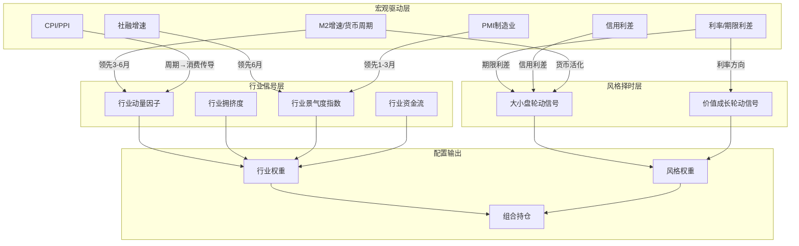
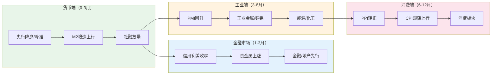

# A股行业轮动与风格轮动因子

## 核心要点

> [!summary] 一句话总结
> 行业轮动与风格轮动因子是中观层面的 Alpha 来源，通过行业动量、拥挤度、宏观驱动信号、风格择时和高频景气度跟踪五大维度，构建自上而下的行业配置体系，核心逻辑是"**宏观周期决定方向，动量与拥挤度决定节奏，景气度验证持续性**"。

- **行业动量因子**：横截面动量（跨行业相对强弱排序）和时序动量（单行业趋势延续）均在 A 股有效，最优窗口 120-240 交易日，成交量调整动量（VolumeRet）表现最佳
- **行业拥挤度**：融合估值分位、换手率分位、PCA 吸收比率等维度，高拥挤行业短期强势但中期面临均值回归，是重要的反向指标
- **宏观驱动轮动**：社融增速领先 A 股约 6 个月，M1-M2 剪刀差领先约 6 个月，PMI 领先 1-3 个月；货币-信用框架（宽货币→宽信用→紧货币→紧信用）驱动行业轮动的核心节奏
- **风格择时**：大小盘轮动与价值成长轮动受信用周期、利率周期、货币活化程度和风格动量四维度信号驱动，趋势共振策略样本内年化 37%
- **景气度跟踪**：30+ 高频指标（水泥价格、螺纹钢、快递量等）通过 PCA 合成行业景气指数，领先财报 1-2 个月

---

## 一、行业动量因子

### 1.1 横截面动量（Cross-Sectional Momentum）

横截面动量的核心逻辑：**在同一时点对所有行业按过去收益率排序，买入强势行业、卖出弱势行业**。

**因子构建方法**：

| 动量变体 | 计算方式 | 最优窗口 | 特点 |
|----------|----------|----------|------|
| **原始动量（RawRet）** | 过去 N 日累计涨跌幅 | 60/120/240 日 | 基础排序，有效但稳定性差 |
| **路径动量（RankRet）** | 日收益率排名的均值 | 120/240 日 | 考虑价格路径，降低极端值影响 |
| **成交量调整动量（VolumeRet）** | (日收益/成交量) 均值 / 标准差 | **240 日最优** | 表现最佳，信噪比高 |
| **加权动量** | 换手率加权 / 指数衰减加权收益 | 60/120 日 | 近期信息权重更高 |

**实证结果**：
- 分层回测（申万一级行业分 5 层）：Top 组年化收益 24.25%，胜率 63.6%
- 价量因子（BIAS、CMO、COPP、POS、TSI、REG）分层效果显著，Group 1 跑赢基准
- 复合价量策略累计收益 221.15%，优于行业等权基准

### 1.2 时序动量（Time-Series Momentum）

时序动量关注**单个行业自身的趋势延续性**：

- 过去 3 年历史分位数 > 80% 视为强势信号
- 120 交易日平滑行业轮动速度，捕捉中期趋势
- IC 均值约 4%，ICIR 较低但信息增益显著

### 1.3 行业资金流动量

- **北向资金流入模型**：结合需求弹性预测股价，北向资金连续流入的行业后续超额收益显著
- **融资融券余额变化**：融资净买入额的行业排序具有短期（1-2 周）预测力
- **主力资金流向**：大单净流入金额的行业排序，需结合 [[A股市场参与者结构与资金流分析]] 中的资金分类体系

---

## 二、行业拥挤度因子

### 2.1 拥挤度度量体系

行业拥挤度从**持仓维度**和**交易维度**两个角度度量：

**持仓拥挤度**（影响中长期）：
- 公募基金行业持仓比例（如食品饮料曾达 16.78%）
- 相对基准的超配比例
- 机构持仓集中度变化率

**交易拥挤度**（影响短期）：
- **换手率分位数**：行业换手率在过去 N 年（通常 3-5 年）的历史分位，> 80 分位视为拥挤
- **换手率乖离率**：当前换手率偏离均值的程度
- **估值分位数**：行业 PE/PB 在历史分位中的位置，> 80 分位视为高估
- **波动率分位数**：行业波动率的历史分位
- **量价相关系数**：价格与成交量的相关性，高相关意味着趋势交易拥挤
- **收益率峰度**：高峰度暗示极端收益频发，交易拥挤

### 2.2 PCA 吸收比率法

这是量化拥挤度的经典方法：

1. 构建申万 28 个一级行业日收益率矩阵
2. 使用 **125 日半衰期加权**和市值加权
3. 对收益率矩阵做 PCA，提取前 2 个主成分
4. 计算**吸收比率**（前 N 主成分解释的方差占比），反映行业同涨同跌程度
5. 高吸收比率 = 高拥挤度，IC = 0.0523

### 2.3 拥挤度因子应用

| 策略组合 | 逻辑 | 年化收益 | 说明 |
|----------|------|----------|------|
| 高集中度 + 高估值 | 动量延续 | 19.47% | 2017 年起优于沪深 300 |
| 高拥挤度 + 低估值 | 价值修复 | — | 逆向配置，适合长期 |
| 拥挤度反转 | 高拥挤后回调 | — | 短期（1-2 月）反转效应 |

> [!warning] 拥挤度陷阱
> 高拥挤度并不意味着立刻下跌，趋势可能延续。需结合催化剂（政策变化、业绩不及预期）判断拐点，单独使用拥挤度因子的择时效果有限。

---

## 三、宏观驱动的行业轮动

### 3.1 货币-信用四象限框架

这是 A 股行业轮动最重要的宏观分析框架，也是对美林时钟（Merrill Lynch Investment Clock）的中国本土化改进：

| 象限 | 货币 | 信用 | 经济阶段 | 优势行业 | 典型时期 |
|------|------|------|----------|----------|----------|
| **宽货币 + 宽信用** | 宽松 | 扩张 | 复苏早期 | 金融、地产、基建（周期） | 2009H1, 2015H1, 2020H2 |
| **紧货币 + 宽信用** | 收紧 | 仍扩张 | 过热期 | 上游资源、消费（涨价链） | 2010H1, 2017H1 |
| **紧货币 + 紧信用** | 收紧 | 收缩 | 滞胀/衰退初期 | 防御（医药、公用事业） | 2011H2, 2018 |
| **宽货币 + 紧信用** | 宽松 | 尚未扩张 | 衰退中后期 | 成长（TMT）、债券 | 2012, 2014H2, 2022 |

### 3.2 宏观指标领先滞后关系参数速查表

> [!important] 核心参数表
> 以下为实证研究中宏观指标对 A 股市场/行业表现的领先滞后关系。

| 宏观指标 | 领先对象 | 领先期 | 信号含义 | 数据来源/频率 |
|----------|----------|--------|----------|---------------|
| **社融增速** | 沪深 300 / 全 A | **~6 个月** | 社融上行→股市回暖 | 央行/月频 |
| **社融增速** | 名义 GDP | **2-4 个季度（6-12 个月）** | 融资需求先于产出 | 央行/月频 |
| **M1-M2 剪刀差** | A 股整体 | **~6 个月** | 正剪刀差→资金活化→股市上行 | 央行/月频 |
| **M2 增速** | 周期行业启动 | **3-6 个月** | 宽货币先于实体复苏 | 央行/月频 |
| **PMI（制造业）** | A 股行业收益 | **1-3 个月** | PMI > 50 → 工业品/周期行业走强 | 统计局/月频 |
| **PMI 新订单-库存差** | 工业企业利润 | **2-3 个月** | 去库存尾声信号 | 统计局/月频 |
| **信用利差** | 大小盘风格 | **3-6 个月** | 信用利差收窄→小盘占优 | 中债/日频 |
| **期限利差（10Y-1Y）** | 风格切换 | **3-6 个月** | 期限利差走阔→价值占优 | 中债/日频 |
| **PPI 同比** | 周期→消费轮动 | **3-6 个月** | PPI 转正→CPI 跟随→消费起 | 统计局/月频 |
| **房地产销售面积** | 地产链行业 | **1-3 个月** | 销售回暖→建材/家电/家居 | 统计局/月频 |
| **汽车销量** | 汽车产业链 | **1-2 个月** | 终端需求传导至零部件 | 中汽协/月频 |
| **出口增速** | 出口链行业 | **1-2 个月** | 出口订单→机电/纺织 | 海关/月频 |

### 3.3 "货币→工业→消费"轮动路径

A 股存在清晰的周期轮动传导链条：

| 阶段 | 领先信号 | 领先行业 | 距宽松起点 | 滞后行业 |
|------|----------|----------|-----------|----------|
| **第一阶段：贵金属** | 社融/M2 上行、降息 | 黄金、白银 | 0-3 个月 | — |
| **第二阶段：工业金属** | PMI 回升、社融企业贷款多增 | 铜、铝、有色 | 3-6 个月 | 消费 |
| **第三阶段：能源化工** | PPI 转正、油价上涨 | 石油、化工、煤炭 | 6-9 个月 | 成长 |
| **第四阶段：消费** | CPI 走强、消费数据改善 | 白酒、食品、家电 | 9-12 个月 | 周期见顶 |

---

## 四、风格因子时序择时

### 4.1 大小盘轮动信号体系

大小盘轮动受**宏观环境信号**和**市场信号**共同驱动：

**宏观环境信号**：

| 信号维度 | 小盘偏好条件 | 大盘偏好条件 |
|----------|-------------|-------------|
| 货币周期 | 宽松初期，流动性充裕 | 紧缩期，资金回归确定性 |
| 信用利差 | 信用利差收窄 | 信用利差走阔 |
| 货币活化（M1/M2） | M1/M2 下降 | M1/M2 上升 |
| 期限利差 | 期限利差收窄 | 期限利差走阔 |
| 外资流入 | 外资偏好大盘，间接利空小盘 | 北向资金持续流入 |

**市场信号**：
- **风格动量**：过去 N 月大/小盘相对收益的延续性
- **相对波动**：小盘波动率 / 大盘波动率，比值过高时小盘风险累积

**历史轮动规律**（2004-2021）：
- 三轮完整大小盘轮动周期
- 小盘优势期平均持续约 **95 个月**，大盘优势期约 **50 个月**
- 小盘盈利增速超过大盘时（增速差扩大），小盘占优

### 4.2 价值成长轮动信号

价值与成长风格的切换核心驱动因素：

| 环境 | 价值占优 | 成长占优 |
|------|----------|----------|
| 利率 | 利率上行期 | 利率下行期 |
| 经济增长 | 经济复苏/过热 | 经济衰退/宽松 |
| 盈利预期 | 盈利分化收敛 | 盈利分化扩大 |
| 风险偏好 | 低风险偏好 | 高风险偏好 |
| 资金面 | 存量博弈 | 增量资金入场 |

### 4.3 趋势共振择时模型

综合上述多维信号构建趋势共振策略：

- **信号合成**：将货币周期、信用利差、货币活化、期限利差、外资、风格动量、相对波动等 7 个维度信号标准化为 0/1
- **共振判断**：多数信号指向同一方向时，确认风格切换
- **实证表现**：样本内年化收益 37.22%，换手率 32.58 倍；样本外年化 12.01%
- **调仓频率**：月度或季度，信号变化时触发

---

## 五、行业景气度跟踪

### 5.1 高频景气指标体系

利用高频数据构建行业景气指数，领先财报数据 1-2 个月：

| 高频指标 | 对应行业 | 数据频率 | 量化方法 |
|----------|----------|----------|----------|
| **水泥价格指数** | 建材/基建 | 周频 | 季节调整 + Min-Max 标准化 → PCA 合成基建子指数 |
| **螺纹钢价格** | 钢铁/工业 | 日频 | Z-score 标准化，分产量/价格维度 PCA |
| **电影票房** | 影视/文化消费 | 周频 | 月频降采样，Granger 因果检验验证 |
| **快递业务量** | 物流/电商 | 月频 | PCA 动态权重更新，与净利润分布趋同 |
| **挖掘机销量** | 工程机械/基建 | 月频 | 产量/销量维度，结合下游需求子维度 |
| **发电量** | 电力/工业 | 月频 | 实时高频 + 季调 + PCA，核心供给指标 |
| **乘用车销量** | 汽车产业链 | 周频 | 批发/零售口径分离，库存周期辅助判断 |
| **半导体销售额** | 电子/半导体 | 月频 | 全球/中国口径分离，同比增速拐点跟踪 |
| **光伏装机量** | 新能源 | 月频 | 国内/海外需求分离 |
| **航空客运量** | 航空/旅游 | 周频 | 季节调整后同比，与出行消费共振 |

### 5.2 景气指数构建方法

**PCA 合成法**（主流方法）：

1. **指标筛选**：从 30+ 高频指标中筛选代表性和时效性强的指标
2. **标准化**：季节调整 → Min-Max 或 Z-score 标准化
3. **PCA 降维**：5 年滚动窗口，提取前 N 个主成分（方差解释率 > 80%）
4. **权重合成**：PCA 特征值确定权重，指数平滑（参数 alpha）更新
5. **滚动回归**：合成指数对行业营业利润增速做滚动回归，验证预测力

**实证效果**：
- 景气指数滞后 1-2 个月有效预测财报业绩
- 与制造业 PMI、行业营业利润高度相关
- 回测胜率 > 50%

---

## 轮动信号体系总览



## 宏观-行业传导链



---

## Python 代码实现

### 行业轮动信号计算

```python
"""
行业轮动信号计算模块
包含：行业动量、行业拥挤度、宏观驱动轮动信号
依赖：pandas, numpy, scipy, sklearn
数据源：详见 [[A股量化数据源全景图]]
"""

import numpy as np
import pandas as pd
from scipy import stats
from sklearn.decomposition import PCA


# ============================================================
# 1. 行业动量因子
# ============================================================

def calc_industry_momentum(industry_returns: pd.DataFrame,
                           windows: list = [20, 60, 120, 240],
                           method: str = 'volume_adjusted') -> pd.DataFrame:
    """
    计算行业动量因子

    Parameters
    ----------
    industry_returns : pd.DataFrame
        行业日收益率，index=日期, columns=行业名称
    windows : list
        回看窗口（交易日）
    method : str
        'raw' - 原始累计收益
        'rank' - 路径动量（日收益率排名均值）
        'volume_adjusted' - 成交量调整动量（需额外传入成交量）

    Returns
    -------
    pd.DataFrame : 各窗口的行业动量因子值
    """
    results = {}

    for w in windows:
        if method == 'raw':
            # 原始动量：过去w日累计收益
            mom = industry_returns.rolling(w).apply(
                lambda x: (1 + x).prod() - 1, raw=True
            )
        elif method == 'rank':
            # 路径动量：日收益率横截面排名的均值
            ranked = industry_returns.rank(axis=1, pct=True)
            mom = ranked.rolling(w).mean()
        else:
            # 原始动量作为默认
            mom = industry_returns.rolling(w).apply(
                lambda x: (1 + x).prod() - 1, raw=True
            )

        results[f'mom_{w}d'] = mom

    return pd.concat(results, axis=1)


def calc_volume_adjusted_momentum(industry_returns: pd.DataFrame,
                                   industry_volume: pd.DataFrame,
                                   window: int = 240) -> pd.DataFrame:
    """
    成交量调整动量（VolumeRet）—— 实证中表现最佳的动量变体

    VolumeRet = mean(daily_ret / daily_volume) / std(daily_ret / daily_volume)
    """
    vol_adj_ret = industry_returns / industry_volume.replace(0, np.nan)
    mom = vol_adj_ret.rolling(window).mean() / vol_adj_ret.rolling(window).std()
    return mom


def momentum_signal(momentum_df: pd.DataFrame,
                    top_n: int = 5,
                    bottom_n: int = 5) -> pd.DataFrame:
    """
    根据动量因子值生成多空信号

    Returns
    -------
    pd.DataFrame : 1=做多, -1=做空, 0=不持有
    """
    signal = pd.DataFrame(0, index=momentum_df.index,
                          columns=momentum_df.columns)

    for date in momentum_df.index:
        row = momentum_df.loc[date].dropna()
        if len(row) < top_n + bottom_n:
            continue
        top = row.nlargest(top_n).index
        bottom = row.nsmallest(bottom_n).index
        signal.loc[date, top] = 1
        signal.loc[date, bottom] = -1

    return signal


# ============================================================
# 2. 行业拥挤度因子
# ============================================================

def calc_crowding_pca(industry_returns: pd.DataFrame,
                      window: int = 125,
                      n_components: int = 2,
                      halflife: int = 125) -> pd.Series:
    """
    PCA吸收比率法计算行业拥挤度

    Parameters
    ----------
    industry_returns : 行业日收益率矩阵
    window : 滚动窗口（交易日）
    n_components : PCA提取的主成分数
    halflife : 指数衰减半衰期

    Returns
    -------
    pd.Series : 吸收比率时间序列（越高越拥挤）
    """
    # 指数衰减权重
    weights = np.exp(-np.log(2) / halflife * np.arange(window)[::-1])
    weights /= weights.sum()

    absorption_ratio = pd.Series(index=industry_returns.index, dtype=float)

    for i in range(window, len(industry_returns)):
        data = industry_returns.iloc[i - window:i].dropna(axis=1)
        if data.shape[1] < n_components + 1:
            continue

        # 加权协方差矩阵
        weighted_data = data.values * np.sqrt(weights[:, None])
        pca = PCA(n_components=n_components)
        pca.fit(weighted_data)

        # 吸收比率 = 前N主成分解释方差占比
        absorption_ratio.iloc[i] = pca.explained_variance_ratio_.sum()

    return absorption_ratio


def calc_turnover_percentile(industry_turnover: pd.DataFrame,
                              lookback_years: int = 3) -> pd.DataFrame:
    """
    计算行业换手率历史分位数

    Parameters
    ----------
    industry_turnover : 行业日换手率
    lookback_years : 回看年数

    Returns
    -------
    pd.DataFrame : 换手率分位数（0-1）
    """
    lookback_days = lookback_years * 252
    percentile = industry_turnover.rolling(lookback_days, min_periods=126).apply(
        lambda x: stats.percentileofscore(x[:-1], x[-1]) / 100,
        raw=True
    )
    return percentile


def calc_valuation_percentile(industry_pe: pd.DataFrame,
                               lookback_years: int = 5) -> pd.DataFrame:
    """
    计算行业估值（PE）历史分位数

    Parameters
    ----------
    industry_pe : 行业PE时间序列
    lookback_years : 回看年数

    Returns
    -------
    pd.DataFrame : PE分位数（0-1），>0.8为高估
    """
    lookback_days = lookback_years * 252
    percentile = industry_pe.rolling(lookback_days, min_periods=252).apply(
        lambda x: stats.percentileofscore(x[:-1], x[-1]) / 100,
        raw=True
    )
    return percentile


def crowding_composite(turnover_pct: pd.DataFrame,
                       valuation_pct: pd.DataFrame,
                       vol_pct: pd.DataFrame = None,
                       weights: dict = None) -> pd.DataFrame:
    """
    合成拥挤度综合指标

    weights: {'turnover': 0.4, 'valuation': 0.3, 'volatility': 0.3}
    """
    if weights is None:
        weights = {'turnover': 0.5, 'valuation': 0.5}

    composite = (turnover_pct * weights.get('turnover', 0) +
                 valuation_pct * weights.get('valuation', 0))

    if vol_pct is not None and 'volatility' in weights:
        composite += vol_pct * weights['volatility']

    return composite


# ============================================================
# 3. 宏观驱动行业轮动信号
# ============================================================

def macro_credit_cycle(m2_yoy: pd.Series,
                       sf_yoy: pd.Series,
                       threshold_m2: float = 0.0,
                       threshold_sf: float = 0.0) -> pd.Series:
    """
    货币-信用四象限判断

    Parameters
    ----------
    m2_yoy : M2同比增速的一阶差分（边际变化）
    sf_yoy : 社融存量同比增速的一阶差分

    Returns
    -------
    pd.Series : 'wide_money_wide_credit' / 'tight_money_wide_credit' /
                'tight_money_tight_credit' / 'wide_money_tight_credit'
    """
    m2_delta = m2_yoy.diff()
    sf_delta = sf_yoy.diff()

    conditions = [
        (m2_delta > threshold_m2) & (sf_delta > threshold_sf),
        (m2_delta <= threshold_m2) & (sf_delta > threshold_sf),
        (m2_delta <= threshold_m2) & (sf_delta <= threshold_sf),
        (m2_delta > threshold_m2) & (sf_delta <= threshold_sf),
    ]
    labels = [
        'wide_money_wide_credit',    # 宽货币+宽信用 → 周期/金融
        'tight_money_wide_credit',   # 紧货币+宽信用 → 资源/消费
        'tight_money_tight_credit',  # 紧货币+紧信用 → 防御
        'wide_money_tight_credit',   # 宽货币+紧信用 → 成长/TMT
    ]

    result = pd.Series(index=m2_yoy.index, dtype=str)
    for cond, label in zip(conditions, labels):
        result[cond] = label

    return result


def macro_lead_lag_signal(macro_series: pd.Series,
                          lead_months: int,
                          threshold_up: float = 0.0,
                          threshold_down: float = 0.0) -> pd.Series:
    """
    宏观指标领先信号生成器

    Parameters
    ----------
    macro_series : 宏观指标月度时间序列（如社融同比增速）
    lead_months : 领先月数（正数=宏观领先行业）
    threshold_up : 上行阈值
    threshold_down : 下行阈值

    Returns
    -------
    pd.Series : 1=看多, -1=看空, 0=中性
    """
    delta = macro_series.diff()
    signal = pd.Series(0, index=macro_series.index)
    signal[delta > threshold_up] = 1
    signal[delta < threshold_down] = -1

    # 前移lead_months个月（即领先信号）
    signal = signal.shift(-lead_months)
    return signal


def m1_m2_scissor(m1_yoy: pd.Series,
                  m2_yoy: pd.Series,
                  lead_months: int = 6) -> pd.Series:
    """
    M1-M2剪刀差信号

    M1增速 > M2增速 → 资金活化 → 看多A股（领先约6个月）
    """
    scissor = m1_yoy - m2_yoy
    signal = pd.Series(0, index=scissor.index)
    signal[scissor > 0] = 1      # 正剪刀差 → 看多
    signal[scissor < -2] = -1    # 大幅负剪刀差 → 看空

    return signal.shift(-lead_months)


# ============================================================
# 4. 行业轮动路径映射
# ============================================================

# 经济周期→行业映射表
CYCLE_INDUSTRY_MAP = {
    'wide_money_wide_credit': {
        'overweight': ['银行', '非银金融', '房地产', '建筑装饰', '建筑材料'],
        'underweight': ['医药生物', '公用事业', '食品饮料'],
        'description': '复苏早期：宽货币宽信用，金融地产先行',
    },
    'tight_money_wide_credit': {
        'overweight': ['有色金属', '钢铁', '煤炭', '石油石化', '化工', '食品饮料'],
        'underweight': ['计算机', '传媒', '通信'],
        'description': '过热期：紧货币宽信用，上游资源+消费涨价链',
    },
    'tight_money_tight_credit': {
        'overweight': ['医药生物', '公用事业', '交通运输'],
        'underweight': ['房地产', '建筑装饰', '有色金属'],
        'description': '衰退初期：紧货币紧信用，防御板块',
    },
    'wide_money_tight_credit': {
        'overweight': ['计算机', '电子', '传媒', '通信', '电力设备'],
        'underweight': ['银行', '煤炭', '钢铁'],
        'description': '衰退后期：宽货币紧信用，成长/TMT占优',
    },
}
```

### 风格择时模型

```python
"""
风格择时模型：大小盘轮动 + 价值成长轮动
基于趋势共振策略框架
"""

import numpy as np
import pandas as pd


class StyleTimingModel:
    """
    风格择时模型

    信号维度：
    - 货币周期（M2增速边际变化）
    - 信用利差（AA-AAA信用利差变化）
    - 货币活化（M1/M2比值变化）
    - 期限利差（10Y-1Y国债利差变化）
    - 外资流入（北向资金净买入额趋势）
    - 风格动量（过去N月大/小盘相对收益）
    - 相对波动（小盘/大盘波动率比值）
    """

    def __init__(self,
                 momentum_window: int = 60,
                 volatility_window: int = 60,
                 rebalance_freq: str = 'M'):
        """
        Parameters
        ----------
        momentum_window : 风格动量回看窗口（交易日）
        volatility_window : 相对波动率窗口（交易日）
        rebalance_freq : 调仓频率 'M'=月度, 'Q'=季度
        """
        self.momentum_window = momentum_window
        self.volatility_window = volatility_window
        self.rebalance_freq = rebalance_freq

    def size_timing_signal(self,
                           large_cap_ret: pd.Series,
                           small_cap_ret: pd.Series,
                           m2_yoy: pd.Series,
                           credit_spread: pd.Series,
                           m1_m2_ratio: pd.Series,
                           term_spread: pd.Series,
                           northbound_flow: pd.Series) -> pd.DataFrame:
        """
        大小盘择时信号

        Returns
        -------
        pd.DataFrame : columns=['signal', 'score']
            signal: 1=小盘, -1=大盘, 0=中性
            score: 综合得分（-7 ~ +7）
        """
        signals = {}

        # 1. 货币周期：M2增速上行 → 小盘
        m2_delta = m2_yoy.diff()
        signals['monetary'] = (m2_delta > 0).astype(int) * 2 - 1

        # 2. 信用利差：收窄 → 小盘
        cs_delta = credit_spread.diff()
        signals['credit_spread'] = -(cs_delta > 0).astype(int) * 2 + 1

        # 3. 货币活化：M1/M2上升 → 大盘（资金流向主板蓝筹）
        m1m2_delta = m1_m2_ratio.diff()
        signals['monetary_activation'] = -(m1m2_delta > 0).astype(int) * 2 + 1

        # 4. 期限利差：走阔 → 大盘/价值
        ts_delta = term_spread.diff()
        signals['term_spread'] = -(ts_delta > 0).astype(int) * 2 + 1

        # 5. 北向资金：持续流入 → 大盘
        nb_ma = northbound_flow.rolling(20).mean()
        signals['northbound'] = -(nb_ma > 0).astype(int) * 2 + 1

        # 6. 风格动量：过去N日相对收益
        rel_ret = (small_cap_ret - large_cap_ret).rolling(
            self.momentum_window).sum()
        signals['style_momentum'] = (rel_ret > 0).astype(int) * 2 - 1

        # 7. 相对波动：小盘波动率/大盘波动率过高 → 大盘
        small_vol = small_cap_ret.rolling(self.volatility_window).std()
        large_vol = large_cap_ret.rolling(self.volatility_window).std()
        rel_vol = small_vol / large_vol
        signals['relative_vol'] = -(rel_vol > rel_vol.rolling(252).median()
                                     ).astype(int) * 2 + 1

        # 合成
        signal_df = pd.DataFrame(signals)
        score = signal_df.sum(axis=1)

        result = pd.DataFrame(index=score.index)
        result['score'] = score
        result['signal'] = 0
        result.loc[score >= 3, 'signal'] = 1     # 多数信号指向小盘
        result.loc[score <= -3, 'signal'] = -1   # 多数信号指向大盘

        return result

    def value_growth_signal(self,
                            value_ret: pd.Series,
                            growth_ret: pd.Series,
                            interest_rate: pd.Series,
                            pmi: pd.Series,
                            earnings_dispersion: pd.Series = None
                            ) -> pd.DataFrame:
        """
        价值成长轮动信号

        Parameters
        ----------
        value_ret : 价值风格指数收益率
        growth_ret : 成长风格指数收益率
        interest_rate : 10年期国债收益率
        pmi : 制造业PMI
        earnings_dispersion : 盈利分化度（可选）

        Returns
        -------
        pd.DataFrame : signal (1=价值, -1=成长)
        """
        signals = {}

        # 1. 利率方向：上行 → 价值
        ir_trend = interest_rate.rolling(60).apply(
            lambda x: 1 if x[-1] > x[0] else -1, raw=True
        )
        signals['interest_rate'] = ir_trend

        # 2. PMI方向：上行 → 经济复苏 → 价值
        pmi_delta = pmi.diff()
        signals['pmi'] = (pmi_delta > 0).astype(int) * 2 - 1

        # 3. 风格动量
        rel_ret = (value_ret - growth_ret).rolling(
            self.momentum_window).sum()
        signals['style_momentum'] = (rel_ret > 0).astype(int) * 2 - 1

        # 4. 盈利分化（可选）
        if earnings_dispersion is not None:
            ed_delta = earnings_dispersion.diff()
            # 盈利分化扩大 → 成长
            signals['earnings'] = -(ed_delta > 0).astype(int) * 2 + 1

        signal_df = pd.DataFrame(signals)
        score = signal_df.sum(axis=1)

        result = pd.DataFrame(index=score.index)
        result['score'] = score
        result['signal'] = 0
        threshold = 2 if earnings_dispersion is not None else 1
        result.loc[score >= threshold, 'signal'] = 1     # 价值
        result.loc[score <= -threshold, 'signal'] = -1   # 成长

        return result


# ============================================================
# 5. 行业景气度指数构建
# ============================================================

class IndustryProsperityTracker:
    """
    基于高频数据的行业景气度跟踪器

    方法：PCA合成法
    1. 高频指标筛选与标准化
    2. 滚动PCA提取主成分
    3. 特征值加权合成景气指数
    """

    def __init__(self,
                 rolling_window_years: int = 5,
                 n_components: int = 3,
                 smooth_alpha: float = 0.3):
        self.rolling_window = rolling_window_years * 12  # 月频
        self.n_components = n_components
        self.smooth_alpha = smooth_alpha

    def standardize(self, data: pd.DataFrame,
                    method: str = 'zscore') -> pd.DataFrame:
        """季节调整 + 标准化"""
        if method == 'zscore':
            return (data - data.rolling(self.rolling_window).mean()) / \
                   data.rolling(self.rolling_window).std()
        elif method == 'minmax':
            roll_min = data.rolling(self.rolling_window).min()
            roll_max = data.rolling(self.rolling_window).max()
            return (data - roll_min) / (roll_max - roll_min + 1e-8)
        return data

    def build_prosperity_index(self,
                               indicators: pd.DataFrame) -> pd.Series:
        """
        构建行业景气指数

        Parameters
        ----------
        indicators : 多个高频指标的月度时间序列
                     columns = 各指标名称

        Returns
        -------
        pd.Series : 合成景气指数
        """
        std_data = self.standardize(indicators)
        prosperity_index = pd.Series(index=indicators.index, dtype=float)

        for i in range(self.rolling_window, len(std_data)):
            window_data = std_data.iloc[i - self.rolling_window:i].dropna(
                axis=1, how='any'
            )
            if window_data.shape[1] < self.n_components:
                continue

            pca = PCA(n_components=self.n_components)
            pca.fit(window_data.values)

            # 用最新一期数据投影
            latest = window_data.iloc[-1:].values
            scores = pca.transform(latest)

            # 特征值加权
            weights = pca.explained_variance_ratio_
            composite = (scores[0] * weights).sum()

            # 指数平滑
            if not np.isnan(prosperity_index.iloc[i - 1]):
                composite = (self.smooth_alpha * composite +
                             (1 - self.smooth_alpha) *
                             prosperity_index.iloc[i - 1])

            prosperity_index.iloc[i] = composite

        return prosperity_index


# ============================================================
# 使用示例
# ============================================================

if __name__ == '__main__':
    # --- 示例：行业动量信号 ---
    # 假设 industry_ret 是申万一级行业日收益率 DataFrame
    # mom = calc_industry_momentum(industry_ret, windows=[60, 120, 240])
    # signal = momentum_signal(mom['mom_120d'], top_n=5)

    # --- 示例：宏观信号 ---
    # cycle = macro_credit_cycle(m2_yoy, sf_yoy)
    # 根据 cycle 查 CYCLE_INDUSTRY_MAP 获取行业配置建议

    # --- 示例：风格择时 ---
    # model = StyleTimingModel(momentum_window=60)
    # size_sig = model.size_timing_signal(
    #     large_cap_ret=hs300_ret, small_cap_ret=csi500_ret,
    #     m2_yoy=m2, credit_spread=cs, m1_m2_ratio=m1m2,
    #     term_spread=ts, northbound_flow=nb
    # )

    print("行业轮动与风格轮动信号计算模块加载完成")
```

---

## 常见误区

> [!danger] 误区一：将行业动量等同于个股动量
> 行业动量与个股动量的逻辑不同。A 股个股层面存在显著的**短期反转效应**（1 个月内），但行业层面的**中期动量效应**（3-12 个月）较为稳健。直接将个股动量参数套用到行业动量会导致信号失效。

> [!danger] 误区二：忽视拥挤度的时变性
> 拥挤度阈值并非固定值。牛市中 80 分位的换手率可能是正常水平，熊市中 60 分位就可能已经拥挤。必须使用**滚动分位数**而非绝对阈值，且需区分持仓拥挤度和交易拥挤度的不同影响时效。

> [!danger] 误区三：宏观信号的"领先期"是精确值
> 社融领先 6 个月、PMI 领先 1-3 个月等参数是**统计均值**，每轮周期的实际领先期可能有 2-3 个月的偏差。特别是政策强干预时期（如 2020 年疫情），传导链条会被压缩或拉长。建议使用**区间估计**而非点估计。

> [!danger] 误区四：单一宏观指标决定行业配置
> 货币-信用框架是简化模型，实际中 M2、社融、PMI、CPI/PPI 等指标可能发出矛盾信号（如 M2 上行但社融下行，2022 年即出现）。需要**多信号共振**确认，而非依赖单一指标。M2-社融背离时期应降低信号置信度。

> [!danger] 误区五：景气度指标的"幸存者偏差"
> 高频景气指标的有效性会随时间变化。例如挖掘机销量在基建驱动时代（2008-2017）是极好的先行指标，但在经济转型后预测力下降。需要定期检验指标与行业业绩的 Granger 因果关系，淘汰失效指标。

> [!danger] 误区六：风格择时频率过高
> 大小盘和价值成长的风格周期通常以**年**为单位（小盘优势期平均 95 个月），月度甚至周度的风格切换很多是噪音。过度交易会吞噬风格择时收益。建议**季度调仓**为基础频率，仅在强共振信号出现时临时调整。

> [!danger] 误区七：混淆行业轮动与行业选择
> 行业轮动强调**时序上的切换**（何时从 A 行业切换到 B 行业），行业选择强调**截面上的优劣**（在同一时点选出最优行业）。两者的因子、频率和评价方法不同，不应混为一谈。

---

## 相关笔记

- [[A股基本面因子体系]] — 基本面因子为行业景气度提供底层支撑
- [[A股技术面因子与量价特征]] — 行业动量因子的技术面基础
- [[A股另类数据与另类因子]] — 高频景气度数据属于另类数据范畴
- [[A股市场参与者结构与资金流分析]] — 行业资金流动量的资金分类体系
- [[A股交易制度全解析]] — 涨跌停、T+1 等制度对行业动量的影响
- [[A股量化数据源全景图]] — 宏观数据与行业高频数据的获取渠道
- [[A股指数体系与基准构建]] — 行业指数与风格指数的编制方法
- [[量化数据工程实践]] — 高频景气数据的清洗、标准化与存储
- [[量化研究Python工具链搭建]] — 代码实现的工具链依赖
- [[A股市场微观结构深度研究]] — 行业拥挤度与市场微观结构的关联
- [[A股衍生品市场与对冲工具]] — 行业轮动策略的对冲工具选择

---

## 来源参考

1. 东方证券 - 社融与货币增速对宏观经济的预测研究（2019）
2. 华泰证券 - 行业景气度跟踪系列研报
3. 长江证券 - 风格轮动策略：大盘vs小盘、成长vs价值框架构建
4. 方正证券 - 行业景气度量化跟踪方法论
5. BigQuant - 行业轮动策略量化实现（多因子框架）
6. 信达证券 - 多视角揭秘A股红利资产拥挤度（2024）
7. 太平洋证券 - 北向资金流入与行业配置模型
8. 国盛证券 - 高频经济指数构建：30个指标的PCA合成框架
9. Hans Open Journal - A股价量因子行业轮动策略实证（累计收益221.15%）
10. 美林投资时钟（Merrill Lynch Investment Clock）经典框架及中国"双时钟"本土化改进
