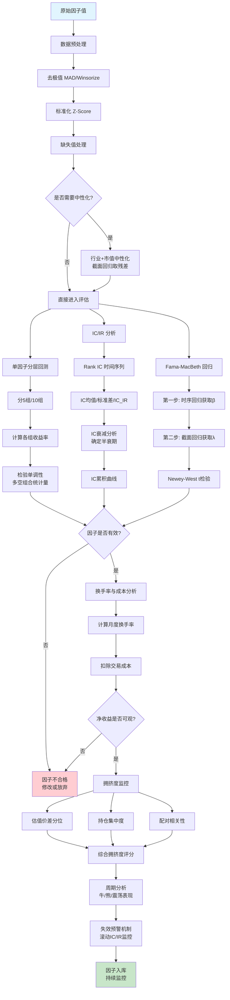

# 因子评估方法论

## 核心要点

> [!summary] 一句话概括
> 因子评估是量化投资的质量关卡——通过**分层回测**验证单调性、**IC/IR分析**检验预测力与稳定性、**Fama-MacBeth回归**估计因子溢价、**换手率与成本分析**确认可执行性、**拥挤度监控**规避尾部风险、**周期分析与失效预警**保障策略持续有效。

因子评估的核心目标是回答三个问题：
1. **有没有用？** — IC/分层回测检验预测能力
2. **能不能做？** — 换手率/交易成本检验可执行性
3. **会不会失效？** — 拥挤度/周期分析/预警机制检验可持续性

---

## 一、单因子分层回测

### 1.1 基本方法

单因子分层回测（Quantile Portfolio Test）是因子评估最直观的方法，核心思路是按因子值排序分组，观察各组收益是否呈现**单调递增/递减**关系。

**标准流程：**
1. 在每个调仓日（通常月末），对全部股票按因子值从小到大排序
2. 等分为 N 组（常用 5 组或 10 组），第 1 组因子值最小，第 N 组最大
3. 分别计算各组下一持仓期的组合收益率（等权或流通市值加权）
4. 构造多空组合（Top-Bottom 或 H-L）：做多因子值最大组，做空因子值最小组
5. 统计各组年化收益、波动率、Sharpe、最大回撤、多空组合 t 检验等

**分组方式对比：**

| 分组方式 | 优点 | 缺点 | 适用场景 |
|---------|------|------|---------|
| **分 10 组** | 区分度高，能观察细致的单调性 | 每组股票数少，噪声大 | 全 A 股（4000+标的） |
| **分 5 组** | 每组样本量充足，统计更稳健 | 区分度不如 10 组 | 中小股票池（500~1000） |
| **行业市值中性化后分层** | 剔除行业和市值干扰，测试因子"纯alpha" | 实现复杂，可能过度剥离 | 精确评估因子独立贡献 |

### 1.2 行业市值中性化分层

行业市值中性化的目的是消除因子中隐含的行业暴露和市值暴露，测试因子的**纯截面选股能力**。

**中性化步骤：**
1. **截面回归法**：在每个截面上，将因子值对行业哑变量 + ln(市值) 做回归，取残差作为中性化后的因子值

$$f_{i,t}^{neutral} = f_{i,t} - \hat{\alpha}_t - \sum_{k} \hat{\beta}_{k,t} \cdot D_{i,k} - \hat{\gamma}_t \cdot \ln(MV_{i,t})$$

2. **行业内排序法**：在每个行业内部独立排序分组，再合并各行业对应分位的股票
3. 中性化后重新分层，观察多空组合是否仍然显著

### 1.3 分层回测关键指标

| 指标 | 好 | 中 | 差 |
|------|---|---|---|
| **多空年化收益** | > 15% | 5%~15% | < 5% |
| **多空 Sharpe** | > 1.5 | 0.8~1.5 | < 0.8 |
| **多空最大回撤** | < 15% | 15%~30% | > 30% |
| **单调性**（分组收益递增/递减） | 严格单调 | 大致单调 | 非单调 |
| **多空 t 统计量** | > 3.0 | 2.0~3.0 | < 2.0 |
| **Top组超额收益**（vs基准） | > 8% | 3%~8% | < 3% |
| **Newey-West t** | > 2.5 | 1.96~2.5 | < 1.96 |

---

## 二、IC/IR 分析

### 2.1 IC（Information Coefficient，信息系数）

IC 衡量因子值与未来收益率的截面相关性，是评估因子预测力最核心的指标。

**普通 IC（Pearson IC）：**

$$IC_t = \text{Corr}(F_{i,t},\ R_{i,t+1})$$

- $F_{i,t}$：股票 $i$ 在 $t$ 期的因子值
- $R_{i,t+1}$：股票 $i$ 在 $t+1$ 期的收益率
- 对异常值敏感，受极端因子值或收益率影响大

**Rank IC（Spearman 秩相关系数）：**

$$RankIC_t = \text{Corr}(\text{Rank}(F_{i,t}),\ \text{Rank}(R_{i,t+1}))$$

- 使用排名而非原始值，对异常值更鲁棒
- **实务中 Rank IC 是主流选择**，A 股因子评估几乎均采用 Rank IC

### 2.2 IC 评估标准

| 指标 | 好 | 中 | 差 |
|------|---|---|---|
| **\|Mean IC\|**（月度） | > 0.05 | 0.03~0.05 | < 0.03 |
| **IC > 0 占比** | > 60% | 50%~60% | < 50% |
| **IC Std** | < 0.10 | 0.10~0.15 | > 0.15 |
| **\|IC_IR\|**（= Mean IC / IC Std） | > 0.5 | 0.3~0.5 | < 0.3 |
| **IC t统计量**（= IC_IR × √T） | > 2.0 | 1.5~2.0 | < 1.5 |

> [!tip] IC 的直觉理解
> 月度 Rank IC = 0.05 意味着因子对下月截面收益排序的解释力约为 0.25%（$R^2 \approx IC^2$），看似很小但在 4000+ 股票的大截面上已经具备显著的统计和经济意义。

### 2.3 IC 衰减分析（IC Decay）

IC 衰减分析检验因子预测能力随时间的持续性，是确定**最优调仓频率**和**因子半衰期**的核心工具。

**计算方法：**
- 计算因子值 $F_{i,t}$ 与未来第 1、2、3、...、N 期收益 $R_{i,t+k}$ 的 Rank IC
- 绘制 IC 随滞后期数 $k$ 的衰减曲线

**衰减特征解读：**

| IC 衰减模式 | 含义 | 建议调仓频率 |
|------------|------|------------|
| 1~3 期显著，4 期后归零 | 短期预测因子 | 周频或双周 |
| 1~12 期缓慢衰减 | 中期预测因子 | 月频 |
| 12 期以上仍显著 | 长期结构因子 | 季频 |
| 首期 IC 低但持续不衰减 | 慢变量因子 | 低频+长持仓 |

**因子半衰期：** IC 衰减到首期 IC 一半的期数。半衰期越长，因子越稳健，换手率越低。

### 2.4 IC_IR 时间序列检验

**IC_IR 的时间序列稳定性**比绝对值更重要。评估方法：

1. **滚动 IC_IR**：计算过去 12/24 个月的滚动 IC_IR，观察是否持续为正
2. **分年度 IC_IR**：将样本期按年切割，检查每年 IC_IR 是否稳定
3. **IC 累积曲线**：绘制月度 IC 的累积和（Cumulative IC），斜率向上且波动小为佳
4. **IC 的自相关性**：计算 IC 序列的 ACF（自相关函数），若 IC 有正自相关，说明因子在持续发挥作用

---

## 三、因子收益率回归

### 3.1 Fama-MacBeth 截面回归

Fama-MacBeth（1973）是估计因子风险溢价（Factor Risk Premium）的经典方法，分**两步**进行：

**第一步：时间序列回归（获取因子暴露 β）**

对每只股票 $i$，用滚动窗口（通常 60 个月或 250 个交易日）回归：

$$R_{i,t} = \alpha_i + \beta_{i,1} f_{1,t} + \beta_{i,2} f_{2,t} + \cdots + \beta_{i,K} f_{K,t} + \varepsilon_{i,t}$$

得到每只股票在每个因子上的暴露 $\hat{\beta}_{i,k}$。

**第二步：截面回归（估计因子收益率 λ）**

在每个时间截面 $t$，用第一步得到的 $\hat{\beta}$ 对当期股票收益做截面回归：

$$R_{i,t} = \lambda_{0,t} + \lambda_{1,t} \hat{\beta}_{i,1} + \lambda_{2,t} \hat{\beta}_{i,2} + \cdots + \lambda_{K,t} \hat{\beta}_{i,K} + \eta_{i,t}$$

重复 $T$ 次，得到因子收益率时间序列 $\{\lambda_{k,t}\}_{t=1}^{T}$。

**第三步：统计检验**

$$\bar{\lambda}_k = \frac{1}{T} \sum_{t=1}^{T} \lambda_{k,t}, \quad t\text{-stat} = \frac{\bar{\lambda}_k}{\text{se}(\lambda_{k,t})}$$

其中标准误建议使用 **Newey-West 调整**（处理时序自相关和异方差）：

$$\text{se}_{NW} = \sqrt{\hat{\Gamma}_0 + 2\sum_{j=1}^{L}\left(1-\frac{j}{L+1}\right)\hat{\Gamma}_j}$$

$L$ 为滞后阶数，通常取 $\lfloor T^{1/3} \rfloor$。

### 3.2 纯因子组合法（时序回归）

另一种估计因子收益率的方法是直接构造**纯因子组合**（Pure Factor Portfolio）：

1. 对全部股票按因子值排序，构造多空组合（Long Top - Short Bottom）
2. 该组合的收益率即为因子收益率的一个估计
3. 时序回归用于检验因子收益率是否被已知风险因子（如 Fama-French 三因子）解释

$$R_{HML,t} = \alpha + \beta_{MKT} R_{MKT,t} + \beta_{SMB} R_{SMB,t} + \varepsilon_t$$

若 $\alpha$ 显著不为零，则因子具有独立定价能力。

### 3.3 回归方法对比

| 方法 | 优点 | 缺点 | 适用场景 |
|------|------|------|---------|
| **Fama-MacBeth** | 天然处理截面相关性；可容纳时变 β | 对时序相关需 NW 调整；两步误差传递 | 因子溢价估计、多因子模型检验 |
| **纯因子组合** | 直观，收益可观察 | 受极端值影响大；多因子正交性差 | 单因子收益率估计、归因 |
| **WLS 回归**（市值加权） | 反映实际可投资容量 | 大市值股票主导结果 | 机构级策略评估 |

---

## 四、因子换手率与交易成本分析

### 4.1 换手率计算

因子组合换手率（Turnover）衡量调仓时持仓变动幅度：

**单边换手率：**

$$Turnover_t = \frac{1}{2} \sum_{i=1}^{N} |w_{i,t} - w_{i,t-1}^{+}|$$

其中 $w_{i,t}$ 为调仓后权重，$w_{i,t-1}^{+}$ 为调仓前（漂移后）权重。

**分层组合换手率：**

$$GroupTurnover_t = \frac{\text{新进入该组的股票数}}{\text{该组总股票数}}$$

### 4.2 交易成本影响

| 成本项 | A 股典型值 | 备注 |
|--------|----------|------|
| 佣金（单边） | 0.02%~0.03% | 机构费率 |
| 印花税（卖出） | 0.05% | 2023 年减半后 |
| 冲击成本（单边） | 0.10%~0.30% | 取决于市值和流动性 |
| **单边总成本** | **0.15%~0.35%** | — |
| **双边总成本** | **0.30%~0.70%** | — |

**成本调整后收益：**

$$R_{net} = R_{gross} - 2 \times Turnover \times Cost_{one\_way}$$

### 4.3 换手率评估标准

| 指标 | 好 | 中 | 差 |
|------|---|---|---|
| **月度单边换手率** | < 20% | 20%~50% | > 50% |
| **成本侵蚀比**（成本/毛收益） | < 20% | 20%~40% | > 40% |
| **净收益 Sharpe**（扣费后） | > 1.0 | 0.5~1.0 | < 0.5 |

> [!warning] A 股特殊注意
> A 股 T+1 交易制度（参见 [[A股交易制度全解析]]）意味着日内反转类因子无法直接执行。高换手因子需额外考虑流动性冲击，尤其对小市值股票。

---

## 五、因子拥挤度度量

因子拥挤度（Factor Crowding）衡量某一因子被市场资金过度追逐的程度。高拥挤度预示因子未来收益下降和回撤放大。

### 5.1 拥挤度度量指标

#### （1）因子收益回撤法
- 计算因子多空组合的**累积收益回撤**
- 回撤深度 > 历史 90 分位 → 预警信号
- 连续回撤超过 2 个标准差 → 可能进入拥挤反转期

#### （2）因子估值分位法
- 计算因子 Top 组和 Bottom 组的估值指标（如 PE、PB）中位数之差
- 将该差值放入历史分位数（过去 5~10 年）
- **估值价差分位 > 80%** → 拥挤风险高（Top 组相对 Bottom 组太贵）
- **估值价差分位 < 20%** → 因子被低估，可能存在机会

#### （3）持仓集中度法
- 基于机构持仓数据，统计因子 Top 组股票的**机构持仓比例**
- 持仓集中度 = Top 组平均机构持仓 / 全市场平均机构持仓
- 比值 > 1.5 → 高拥挤

#### （4）配对相关性法
- 计算因子 Top 组（或 Bottom 组）股票之间的**平均成对相关系数**
- 高相关 → 同质化交易严重 → 拥挤度高

#### （5）因子波动率法
- 因子收益的**已实现波动率 / 市场波动率**
- 比值异常升高 → 拥挤度增加

### 5.2 综合拥挤度评分

参考 MSCI 模型，将多个指标标准化后加权：

$$Crowding\_Score_t = \sum_{k} w_k \cdot Z_k(Indicator_{k,t})$$

| 拥挤度评分 | 含义 | 建议 |
|-----------|------|------|
| > +1.0 | 高拥挤 | 减配该因子，提高防御 |
| -1.0 ~ +1.0 | 正常 | 维持配置 |
| < -1.0 | 低拥挤（冷门） | 可考虑加配 |

> [!important] 拥挤度与因子收益的关系
> 实证研究表明，因子拥挤度与**未来 7~12 个月的因子收益率**呈显著负相关。高拥挤期因子回撤概率约为低拥挤期的 2~3 倍。

---

## 六、因子有效性周期分析

### 6.1 市场环境分类

| 市场状态 | 定义标准（常用） | 典型特征 |
|---------|----------------|---------|
| **牛市** | 宽基指数 60 日均线斜率 > 0 且 RSI > 60 | 成交放量、风险偏好高 |
| **熊市** | 宽基指数 60 日均线斜率 < 0 且 RSI < 40 | 缩量下跌、避险情绪 |
| **震荡市** | 其余情况 | 区间波动、板块轮动 |

### 6.2 主要因子的周期表现

| 因子类别 | 牛市表现 | 熊市表现 | 震荡市表现 | A 股特征 |
|---------|---------|---------|----------|---------|
| **价值因子**（低 PE/PB） | 较弱 | **较强**（防御性） | 中等 | 近 10 年整体弱化，但高股息子因子熊市突出 |
| **动量因子** | **较强**（顺周期） | 较弱（反转多） | 中等偏弱 | 受涨跌停制度影响，改进版（如 52 周高）更稳 |
| **市值因子**（小盘） | **强**（投机氛围） | 较弱（流动性撤退） | 中等 | A 股小盘效应长期显著但波动大 |
| **质量因子**（ROE/盈利） | 中等 | **较强** | 较强 | 全周期较稳健，是"全天候因子" |
| **低波因子** | 较弱 | **强**（避险） | 较强 | 与高股息有一定重叠 |
| **换手率因子**（低换手） | 中等 | **较强** | 较强 | A 股流动性因子表现突出 |

### 6.3 周期分析方法

1. **条件分析**：将样本期按市场状态分段，分别计算各状态下的因子 IC、分层收益
2. **交互回归**：加入市场状态哑变量与因子的交互项
3. **Regime-Switching 模型**：用 Markov 链划分市场状态，检验因子在不同状态下的转换概率和收益分布

---

## 七、因子失效预警机制

### 7.1 预警指标体系

| 预警指标 | 计算方式 | 黄色预警 | 红色预警 |
|---------|---------|---------|---------|
| **滚动 IC 均值**（12 个月） | 过去 12 月 IC 均值 | < 0.02 | < 0 或连续 3 月 < 0 |
| **滚动 IC_IR**（12 个月） | 过去 12 月 IC_IR | < 0.3 | < 0 |
| **IC 的 t 统计量** | IC 均值 / (IC 标准差 / √T) | < 1.96 | < 1.0 |
| **因子多空组合回撤** | 当前回撤 / 历史最大回撤 | > 50% | > 80% |
| **拥挤度评分** | 综合拥挤度 Z-score | > 1.0 | > 1.5 |
| **月度 IR**（滚动 6 月） | 年化因子收益 / 年化波动 | < 0.5 | < 0 |
| **IC 衰减斜率变化** | 近期半衰期 / 历史半衰期 | < 0.7 | < 0.5 |

### 7.2 预警响应机制

```
Level 0（正常）: 所有指标正常 → 维持当前配置
Level 1（关注）: 1~2个黄色预警 → 降低该因子权重 20%
Level 2（预警）: 3+个黄色或1个红色 → 降低权重 50%，启动因子诊断
Level 3（停用）: 2+个红色预警 → 暂停使用该因子，进入观察期
```

### 7.3 因子失效的典型原因

| 失效原因 | 典型表现 | 应对策略 |
|---------|---------|---------|
| **因子拥挤** | 拥挤度评分持续 > 1 | 减配或等待拥挤消化 |
| **市场结构变化** | IC 方向反转 | 重新评估因子逻辑 |
| **政策冲击** | IC 突然跳变 | 判断是暂时还是永久性变化 |
| **过拟合** | 样本外 IC 远低于样本内 | 增加正则化，简化因子 |
| **数据质量问题** | IC 异常波动 | 检查数据源和清洗逻辑 |

---

## 参数速查表

> [!info] 因子评估核心指标判断阈值一览

| 指标 | 好 | 中 | 差 | 备注 |
|------|---|---|---|------|
| **\|Mean Rank IC\|**（月频） | > 0.05 | 0.03~0.05 | < 0.03 | 实务主流指标 |
| **IC > 0 占比** | > 60% | 50%~60% | < 50% | 稳定性指标 |
| **\|IC_IR\|** | > 0.5 | 0.3~0.5 | < 0.3 | = Mean IC / IC Std |
| **IC t-stat** | > 2.0 | 1.5~2.0 | < 1.5 | = IC_IR × √T |
| **多空年化收益** | > 15% | 5%~15% | < 5% | Top-Bottom |
| **多空 Sharpe** | > 1.5 | 0.8~1.5 | < 0.8 | 风险调整收益 |
| **多空最大回撤** | < 15% | 15%~30% | > 30% | 尾部风险 |
| **多空 t-stat** | > 3.0 | 2.0~3.0 | < 2.0 | Newey-West 调整 |
| **月度单边换手率** | < 20% | 20%~50% | > 50% | 可执行性 |
| **成本侵蚀比** | < 20% | 20%~40% | > 40% | 成本/毛收益 |
| **因子半衰期** | > 12 期 | 6~12 期 | < 6 期 | IC 衰减速度 |
| **拥挤度 Z-score** | < 0.5 | 0.5~1.0 | > 1.0 | 综合拥挤度评分 |
| **Fama-MacBeth λ t-stat** | > 2.5 | 1.96~2.5 | < 1.96 | NW 调整后 |

---

## 因子评估完整流程图



---

## Python 代码：因子评估框架

以下代码实现 Alphalens 风格的因子评估框架，涵盖 IC/分层/换手率/衰减分析。

```python
"""
因子评估框架 —— Alphalens风格实现
覆盖: IC/Rank IC、分层回测、换手率、IC衰减、Fama-MacBeth回归
"""

import numpy as np
import pandas as pd
from scipy import stats
from typing import Optional, Dict, Tuple


class FactorEvaluator:
    """
    单因子评估框架

    Parameters
    ----------
    factor : pd.DataFrame
        因子值, index=日期, columns=股票代码
    returns : pd.DataFrame
        收益率, index=日期, columns=股票代码 (与factor对齐)
    n_quantiles : int
        分层组数, 默认10
    industry : pd.DataFrame, optional
        行业分类, index=日期, columns=股票代码, values=行业代码
    mktcap : pd.DataFrame, optional
        流通市值, 用于中性化和加权
    """

    def __init__(
        self,
        factor: pd.DataFrame,
        returns: pd.DataFrame,
        n_quantiles: int = 10,
        industry: Optional[pd.DataFrame] = None,
        mktcap: Optional[pd.DataFrame] = None,
    ):
        self.factor = factor
        self.returns = returns
        self.n_quantiles = n_quantiles
        self.industry = industry
        self.mktcap = mktcap

        # 对齐日期和股票
        common_dates = factor.index.intersection(returns.index)
        common_stocks = factor.columns.intersection(returns.columns)
        self.factor = factor.loc[common_dates, common_stocks]
        self.returns = returns.loc[common_dates, common_stocks]

    # ========== 数据预处理 ==========

    def neutralize(self, method: str = "regression") -> pd.DataFrame:
        """
        行业+市值中性化
        method: 'regression' 截面回归法 | 'rank' 行业内排序法
        """
        if self.industry is None or self.mktcap is None:
            raise ValueError("行业和市值数据是中性化的必要输入")

        neutralized = pd.DataFrame(
            index=self.factor.index, columns=self.factor.columns, dtype=float
        )

        for date in self.factor.index:
            f = self.factor.loc[date].dropna()
            ind = self.industry.loc[date].reindex(f.index).dropna()
            cap = np.log(self.mktcap.loc[date].reindex(f.index).dropna())

            common = f.index.intersection(ind.index).intersection(cap.index)
            if len(common) < 30:
                continue

            f_c, ind_c, cap_c = f[common], ind[common], cap[common]

            if method == "regression":
                # 构造行业哑变量 + ln(市值) 做回归, 取残差
                dummies = pd.get_dummies(ind_c, drop_first=True).astype(float)
                X = pd.concat([dummies, cap_c.rename("lnmv")], axis=1)
                X = X.assign(const=1.0)

                try:
                    beta = np.linalg.lstsq(X.values, f_c.values, rcond=None)[0]
                    residual = f_c.values - X.values @ beta
                    neutralized.loc[date, common] = residual
                except np.linalg.LinAlgError:
                    continue

            elif method == "rank":
                # 行业内排序标准化
                grouped = f_c.groupby(ind_c)
                for _, grp in grouped:
                    ranks = grp.rank(pct=True) - 0.5
                    neutralized.loc[date, grp.index] = ranks.values

        self.factor = neutralized.astype(float)
        return neutralized

    # ========== IC / Rank IC 分析 ==========

    def calc_ic(
        self, method: str = "rank", forward_periods: list = [1]
    ) -> Dict[int, pd.Series]:
        """
        计算IC时间序列
        method: 'rank' (Spearman) | 'pearson'
        forward_periods: 前瞻期列表, 如[1,3,6,12]
        """
        ic_dict = {}
        for fp in forward_periods:
            fwd_ret = self.returns.shift(-fp)  # 未来第fp期收益
            ic_series = pd.Series(index=self.factor.index, dtype=float)

            for date in self.factor.index:
                f = self.factor.loc[date].dropna()
                r = fwd_ret.loc[date].reindex(f.index).dropna()
                common = f.index.intersection(r.index)

                if len(common) < 30:
                    continue

                if method == "rank":
                    corr, _ = stats.spearmanr(f[common], r[common])
                else:
                    corr, _ = stats.pearsonr(f[common], r[common])

                ic_series[date] = corr

            ic_dict[fp] = ic_series.dropna()

        return ic_dict

    def ic_summary(self, ic_series: pd.Series) -> Dict[str, float]:
        """IC统计摘要"""
        ic = ic_series.dropna()
        T = len(ic)
        mean_ic = ic.mean()
        std_ic = ic.std()
        ic_ir = mean_ic / std_ic if std_ic > 0 else 0
        t_stat = ic_ir * np.sqrt(T)
        pos_ratio = (ic > 0).mean()

        return {
            "Mean IC": round(mean_ic, 4),
            "IC Std": round(std_ic, 4),
            "IC_IR": round(ic_ir, 4),
            "t-stat": round(t_stat, 2),
            "IC>0占比": round(pos_ratio, 4),
            "观测数": T,
            "判定": "好" if abs(ic_ir) > 0.5 else ("中" if abs(ic_ir) > 0.3 else "差"),
        }

    def ic_decay(self, max_lag: int = 12) -> pd.DataFrame:
        """
        IC衰减分析: 计算因子与未来1~max_lag期收益的IC
        返回: DataFrame, index=lag, columns=['Mean_IC', 'IC_IR', 't_stat']
        """
        ic_dict = self.calc_ic(method="rank", forward_periods=list(range(1, max_lag + 1)))

        results = []
        for lag, ic_series in ic_dict.items():
            summary = self.ic_summary(ic_series)
            results.append({
                "Lag": lag,
                "Mean_IC": summary["Mean IC"],
                "IC_IR": summary["IC_IR"],
                "t_stat": summary["t-stat"],
            })

        df = pd.DataFrame(results).set_index("Lag")

        # 计算半衰期
        first_ic = abs(df["Mean_IC"].iloc[0])
        half_life = None
        for lag in df.index:
            if abs(df.loc[lag, "Mean_IC"]) < first_ic / 2:
                half_life = lag
                break

        df.attrs["half_life"] = half_life
        return df

    # ========== 分层回测 ==========

    def quantile_returns(
        self, weighting: str = "equal"
    ) -> Tuple[pd.DataFrame, pd.DataFrame]:
        """
        分层回测
        weighting: 'equal' 等权 | 'mktcap' 流通市值加权

        Returns
        -------
        group_returns : pd.DataFrame, index=日期, columns=组号(1~n_quantiles)
        group_cum_returns : 累计净值
        """
        group_returns = pd.DataFrame(
            index=self.factor.index,
            columns=range(1, self.n_quantiles + 1),
            dtype=float,
        )

        for date in self.factor.index:
            f = self.factor.loc[date].dropna()
            r_date = self.returns.shift(-1).loc[date] if date != self.factor.index[-1] else None
            if r_date is None:
                continue
            r = r_date.reindex(f.index).dropna()
            common = f.index.intersection(r.index)

            if len(common) < self.n_quantiles * 5:
                continue

            f_c, r_c = f[common], r[common]

            # 分组 (1=最小, n=最大)
            try:
                groups = pd.qcut(f_c, self.n_quantiles, labels=False, duplicates="drop") + 1
            except ValueError:
                continue

            for g in range(1, self.n_quantiles + 1):
                mask = groups == g
                if mask.sum() == 0:
                    continue

                if weighting == "equal":
                    group_returns.loc[date, g] = r_c[mask].mean()
                elif weighting == "mktcap" and self.mktcap is not None:
                    w = self.mktcap.loc[date].reindex(r_c[mask].index).dropna()
                    if len(w) > 0:
                        w = w / w.sum()
                        group_returns.loc[date, g] = (r_c[mask].reindex(w.index) * w).sum()

        group_returns = group_returns.dropna(how="all").astype(float)
        group_cum_returns = (1 + group_returns).cumprod()

        return group_returns, group_cum_returns

    def long_short_stats(self, group_returns: pd.DataFrame) -> Dict[str, float]:
        """多空组合统计"""
        ls = group_returns[self.n_quantiles] - group_returns[1]
        ls = ls.dropna()

        ann_ret = ls.mean() * 12  # 月频年化
        ann_vol = ls.std() * np.sqrt(12)
        sharpe = ann_ret / ann_vol if ann_vol > 0 else 0
        cum = (1 + ls).cumprod()
        max_dd = (cum / cum.cummax() - 1).min()
        t_stat = ls.mean() / (ls.std() / np.sqrt(len(ls)))

        return {
            "年化收益": f"{ann_ret:.2%}",
            "年化波动": f"{ann_vol:.2%}",
            "Sharpe": round(sharpe, 2),
            "最大回撤": f"{max_dd:.2%}",
            "t统计量": round(t_stat, 2),
            "判定": "好" if sharpe > 1.5 else ("中" if sharpe > 0.8 else "差"),
        }

    # ========== 换手率分析 ==========

    def calc_turnover(self) -> pd.Series:
        """计算分层组合的换手率 (Top组)"""
        top_holdings = {}
        turnover = pd.Series(index=self.factor.index, dtype=float)

        for date in self.factor.index:
            f = self.factor.loc[date].dropna()
            if len(f) < self.n_quantiles * 5:
                continue

            try:
                groups = pd.qcut(f, self.n_quantiles, labels=False, duplicates="drop") + 1
            except ValueError:
                continue

            current_top = set(groups[groups == self.n_quantiles].index)

            if top_holdings:
                prev_top = top_holdings["stocks"]
                if len(prev_top) > 0 and len(current_top) > 0:
                    new_in = len(current_top - prev_top)
                    turnover[date] = new_in / max(len(current_top), 1)

            top_holdings = {"stocks": current_top}

        return turnover.dropna()

    # ========== Fama-MacBeth 回归 ==========

    def fama_macbeth(
        self,
        other_factors: Optional[Dict[str, pd.DataFrame]] = None,
        nw_lags: Optional[int] = None,
    ) -> Dict[str, float]:
        """
        Fama-MacBeth截面回归

        Parameters
        ----------
        other_factors : dict, 其他控制因子 {name: DataFrame}
        nw_lags : Newey-West滞后阶数, 默认T^(1/3)
        """
        lambdas = []

        for i, date in enumerate(self.factor.index[:-1]):
            next_date = self.factor.index[i + 1]

            f = self.factor.loc[date].dropna()
            r = self.returns.loc[next_date].reindex(f.index).dropna()
            common = f.index.intersection(r.index)

            if len(common) < 30:
                continue

            # 构造X矩阵
            X_dict = {"target_factor": f[common]}
            if other_factors:
                for name, fdf in other_factors.items():
                    if date in fdf.index:
                        X_dict[name] = fdf.loc[date].reindex(common).fillna(0)

            X = pd.DataFrame(X_dict)
            X["const"] = 1.0
            y = r[common]

            # 截面OLS
            try:
                beta = np.linalg.lstsq(X.values, y.values, rcond=None)[0]
                lambdas.append(dict(zip(X.columns, beta)))
            except np.linalg.LinAlgError:
                continue

        if not lambdas:
            return {"error": "回归失败, 有效截面不足"}

        lambda_df = pd.DataFrame(lambdas)
        T = len(lambda_df)

        # Newey-West标准误
        if nw_lags is None:
            nw_lags = int(T ** (1 / 3))

        results = {}
        for col in lambda_df.columns:
            series = lambda_df[col].values
            mean_val = np.mean(series)

            # Newey-West SE
            gamma_0 = np.var(series, ddof=1)
            nw_var = gamma_0
            for j in range(1, nw_lags + 1):
                gamma_j = np.cov(series[j:], series[:-j])[0, 1]
                weight = 1 - j / (nw_lags + 1)
                nw_var += 2 * weight * gamma_j

            nw_se = np.sqrt(nw_var / T)
            t_stat = mean_val / nw_se if nw_se > 0 else 0

            results[col] = {
                "mean_lambda": round(mean_val, 6),
                "nw_t_stat": round(t_stat, 2),
                "显著性": "***" if abs(t_stat) > 2.58 else (
                    "**" if abs(t_stat) > 1.96 else (
                        "*" if abs(t_stat) > 1.65 else "不显著"
                    )
                ),
            }

        return results

    # ========== 综合评估报告 ==========

    def full_evaluation(self) -> Dict:
        """运行完整评估流程"""
        report = {}

        # 1. IC分析
        print(">>> 计算IC...")
        ic_dict = self.calc_ic(method="rank", forward_periods=[1])
        ic1 = ic_dict[1]
        report["IC_Summary"] = self.ic_summary(ic1)

        # 2. IC衰减
        print(">>> IC衰减分析...")
        report["IC_Decay"] = self.ic_decay(max_lag=12)

        # 3. 分层回测
        print(">>> 分层回测...")
        grp_ret, grp_cum = self.quantile_returns(weighting="equal")
        report["Long_Short_Stats"] = self.long_short_stats(grp_ret)
        report["Group_Returns"] = grp_ret
        report["Group_CumReturns"] = grp_cum

        # 4. 换手率
        print(">>> 换手率...")
        turnover = self.calc_turnover()
        report["Avg_Turnover"] = round(turnover.mean(), 4)
        report["Turnover_Verdict"] = (
            "好" if turnover.mean() < 0.2 else
            ("中" if turnover.mean() < 0.5 else "差")
        )

        # 5. Fama-MacBeth
        print(">>> Fama-MacBeth回归...")
        report["FamaMacBeth"] = self.fama_macbeth()

        print(">>> 评估完成")
        return report


# ========== 使用示例 ==========

def example_usage():
    """
    示例: 使用AkShare获取数据并评估PE因子
    注意: 需安装 akshare, 实际使用请替换数据源
    """
    # 模拟数据 (实际应从akshare/tushare获取)
    dates = pd.date_range("2018-01-31", "2023-12-31", freq="ME")
    stocks = [f"stock_{i:04d}" for i in range(500)]

    np.random.seed(42)
    factor_data = pd.DataFrame(
        np.random.randn(len(dates), len(stocks)),
        index=dates, columns=stocks,
    )
    returns_data = pd.DataFrame(
        np.random.randn(len(dates), len(stocks)) * 0.05,
        index=dates, columns=stocks,
    )

    # 初始化评估器
    evaluator = FactorEvaluator(
        factor=factor_data,
        returns=returns_data,
        n_quantiles=10,
    )

    # 运行完整评估
    report = evaluator.full_evaluation()

    # 打印结果
    print("\n" + "=" * 60)
    print("IC Summary:", report["IC_Summary"])
    print("Long-Short Stats:", report["Long_Short_Stats"])
    print(f"Avg Turnover: {report['Avg_Turnover']:.2%} ({report['Turnover_Verdict']})")
    print("IC Decay:\n", report["IC_Decay"])
    print("Fama-MacBeth:", report["FamaMacBeth"])


if __name__ == "__main__":
    example_usage()
```

---

## 常见误区

> [!danger] 因子评估中的常见陷阱

### 误区一：只看 IC 均值，忽略 IC_IR
Mean IC = 0.08 但 IC Std = 0.20（IC_IR = 0.4）的因子，远不如 Mean IC = 0.04 但 IC Std = 0.05（IC_IR = 0.8）的因子稳健。**IC_IR 比 IC 绝对值更重要。**

### 误区二：忽略前视偏差（Look-ahead Bias）
使用当期公布的财务数据构造因子时，必须考虑**财报发布滞后**。例如年报数据最晚 4 月 30 日发布，因此 Q4 财务因子最早只能在次年 5 月使用。参见 [[A股基本面因子体系]] 中的时间对齐规则。

### 误区三：分层回测不考虑交易成本
毛收益 15% 的因子若月度换手率 80%，扣除双边 0.5% 交易成本后净收益仅 15% - 80%×2×0.5%×12 = 5.4%，实际 Sharpe 大幅缩水。

### 误区四：在全样本上评估后直接上线
必须做**样本外检验**：将数据分为训练集（如 2010~2019）和测试集（如 2020~2024），只有样本外 IC_IR > 训练集的 60% 才可考虑上线。

### 误区五：忽略因子间相关性
单独看都有效的因子可能高度相关（如 EP 与 BP 相关系数 > 0.7），合成多因子模型时必须检查共线性，参见 [[A股基本面因子体系]] 的因子正交化处理。

### 误区六：牛市期间高估因子能力
牛市中几乎所有因子的多头组合都赚钱，需要关注**相对收益**（vs 基准）而非绝对收益，并在完整牛熊周期中评估。

### 误区七：用 IC 衡量非线性因子
IC 衡量的是**线性相关性**，对于 U 形或倒 U 形关系的因子（如适度杠杆最优），IC 可能接近 0 但分层回测仍有效。应结合分层回测和 IC 共同判断。

### 误区八：忽略小样本期的统计显著性
IC_IR = 0.6 在 120 个月样本中 t = 6.6（极显著），但在 12 个月样本中 t = 2.1（勉强显著）。**短样本期的结论要谨慎。**

---

## 相关笔记

- [[A股基本面因子体系]] — 基本面因子定义与计算方法
- [[A股技术面因子与量价特征]] — 技术面因子与量价因子构造
- [[A股另类数据与另类因子]] — 另类数据源与另类因子
- [[A股交易制度全解析]] — T+1、涨跌停等制度对因子执行的影响
- [[A股市场微观结构深度研究]] — 市场微观结构对因子的影响机制
- [[A股市场参与者结构与资金流分析]] — 资金流因子与拥挤度的关联
- [[量化数据工程实践]] — 因子数据清洗、存储与计算流水线
- [[量化研究Python工具链搭建]] — Alphalens/Pyfolio 等工具配置
- [[A股量化数据源全景图]] — 因子计算所需的底层数据源
- [[A股量化交易平台深度对比]] — 各平台因子评估功能对比
- [[高频因子与日内数据挖掘]] — 高频因子的IC衰减特征与日频聚合评估方法
- [[A股机器学习量化策略]] — ML因子合成中的过拟合检测与特征重要性评估

---

## 来源参考

1. Fama, E.F. & MacBeth, J.D. (1973). "Risk, Return, and Equilibrium: Empirical Tests." *Journal of Political Economy*, 81(3), 607-636.
2. Newey, W.K. & West, K.D. (1987). "A Simple, Positive Semi-definite, Heteroskedasticity and Autocorrelation Consistent Covariance Matrix." *Econometrica*, 55(3), 703-708.
3. Barra, MSCI. "Factor Crowding: Measurement and Implications." MSCI Research Insight.
4. 海通证券. 选股因子系列研究第42期: 因子失效预警——因子拥挤. 海通证券研究所.
5. 海通证券. 选股因子系列研究第44期: 因子拥挤度的扩展. 海通证券研究所.
6. S&P Global. "Examining Factor Strategies in China A-Share Market." S&P Dow Jones Indices Research.
7. BigQuant Wiki. 因子评估方法论与 IC/IR 分析教程. https://bigquant.com/wiki/
8. Quantopian/Alphalens. "A Performance Analysis Tool for Predictive Alpha Factors." GitHub.
9. 华泰证券. 因子拥挤度度量方法及 A 股实证. 华泰证券金融工程研究.
