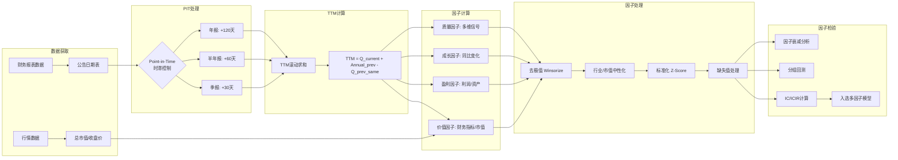

# A股基本面因子体系

## 核心要点

> [!abstract] 一句话总结
> A股基本面因子体系以Fama-French五因子模型为理论骨架，覆盖价值、成长、质量、分红四大类因子，其中**EP/BP/ROE**是IC最高且最稳定的因子（月度IC 0.04-0.07），但因子计算必须严格遵守**财报时滞规则**（季报30天/半年报60天/年报120天）以避免前瞻偏差。

> [!tip] 关键参数速记
> - 价值因子（EP/BP）月度IC：0.03-0.06，ICIR：0.5-1.0
> - 盈利因子（ROE/ROA）月度IC：0.04-0.07，ICIR：0.6-1.2
> - 成长因子月度IC：0.02-0.04，ICIR偏弱，需择时
> - 质量因子在大/中盘显著，小盘因流动性受限
> - 股息率因子（预期法）IC最高，红利低波策略长期年化超额3-5%

## 知识体系位置

```
L2: 因子研究与信号体系
├── 基本面因子 ← 本文
│   ├── 价值因子（EP/BP/SP/CFP）
│   ├── 盈利因子（ROE/ROA/毛利率/资产周转率/杠杆率）
│   ├── 成长因子（营收增速/净利润增速/PEG）
│   ├── 质量因子（应计利润/盈余质量/F-Score）
│   └── 分红因子（股息率/分红稳定性）
├── 技术面因子
├── 另类因子
├── 因子评估
└── 多因子模型
```

---

## 一、Fama-French模型A股适用性验证

### 1.1 三因子模型（FF3）

Fama-French三因子模型核心方程：

$$R_i - R_f = \alpha_i + \beta_i (R_m - R_f) + s_i \cdot SMB + h_i \cdot HML + \epsilon_i$$

| 因子 | 含义 | A股显著性 | 风险溢价方向 |
|------|------|-----------|-------------|
| $R_m - R_f$ | 市场超额收益 | **非常显著**（$\beta \approx 1$） | 正 |
| SMB | 小市值-大市值 | **显著** | 正（小盘溢价） |
| HML | 高BM-低BM | **显著** | 正（价值溢价） |

**A股实证结论**：三因子模型对A股截面收益解释力显著，$R^2$ 普遍在0.85以上。市场因子占主导地位（尤其2005年股改前），规模因子在A股尤为突出——小市值股票长期跑赢大市值。

### 1.2 五因子模型（FF5）

$$R_i - R_f = \alpha_i + \beta_i (R_m - R_f) + s_i \cdot SMB + h_i \cdot HML + r_i \cdot RMW + c_i \cdot CMA + \epsilon_i$$

新增因子：

| 因子 | 定义 | A股有效性 | 备注 |
|------|------|-----------|------|
| RMW（盈利因子） | 高盈利-低盈利 | **股改后显著**（2005年后） | 全样本经三因子调整后显著 |
| CMA（投资因子） | 保守投资-激进投资 | **股改后显著** | 低投资率公司未来收益更高 |

**关键发现**：
1. 五因子模型 $R^2$ 提升至0.97附近，截距项 $\alpha$ 更接近0，通过GRS检验
2. 股改前（2005年前）：市场风险因子主导，盈利/投资因子冗余
3. 股改后（2005年后）：五因子全部显著，反转效应替代动量效应
4. 五因子 > 三因子 > CAPM > 单因子模型（以GRS统计量排序）

### 1.3 A股特殊现象

| 现象 | 与美股差异 | 原因分析 |
|------|-----------|---------|
| 小盘股溢价持续更强 | 美股近年小盘溢价消失 | 壳价值、散户偏好、IPO制度 |
| 动量效应弱/反转效应强 | 美股动量显著 | 散户主导、涨跌停板、T+1制度 |
| 价值因子周期性强 | 美股相对稳定 | 政策驱动、板块轮动剧烈 |
| 盈利因子大盘有效 | 全市场有效 | 小盘财务数据噪声大 |

---

## 二、价值因子详解

### 2.1 EP — 盈利收益率（市盈率倒数）

**定义公式**：

$$EP = \frac{\text{归母净利润}_{TTM}}{\text{总市值}}$$

变体 $EP_2$（扣非）：

$$EP_2 = \frac{\text{扣非归母净利润}_{TTM}}{\text{总市值}}$$

**Python计算代码**：

```python
import pandas as pd
import numpy as np

def calc_ep(df: pd.DataFrame) -> pd.Series:
    """
    计算EP因子（盈利收益率）

    Parameters
    ----------
    df : DataFrame
        必须包含列: net_profit_ttm (归母净利润TTM), total_mv (总市值)
        可选列: net_profit_deducted_ttm (扣非归母净利润TTM)

    Returns
    -------
    Series: EP因子值
    """
    ep = df['net_profit_ttm'] / df['total_mv']
    # 剔除负值（亏损股EP无经济含义）
    ep = ep.where(ep > 0, np.nan)
    return ep

def calc_ep_deducted(df: pd.DataFrame) -> pd.Series:
    """EP2: 使用扣非净利润"""
    ep2 = df['net_profit_deducted_ttm'] / df['total_mv']
    return ep2.where(ep2 > 0, np.nan)
```

**A股IC/IR统计**：

| 指标 | 数值范围 | 备注 |
|------|---------|------|
| 月度Rank IC均值 | 0.04 ~ 0.06 | 正相关，高EP组合跑赢 |
| ICIR | 0.6 ~ 1.0 | 中等稳定性 |
| 因子衰减半衰期 | 1-2个月 | 建议月度调仓 |
| IC胜率 | ~60% | 约60%的月份IC为正 |

**A股特殊处理**：EP2（扣非）在A股有效性通常优于EP1，因为A股上市公司非经常性损益（政府补贴、资产处置收益）占比较高。

### 2.2 BP — 账面市值比（市净率倒数）

**定义公式**：

$$BP = \frac{\text{归母净资产}_{MRQ}}{\text{总市值}}$$

注意：分子用**最新报告期（MRQ）**的净资产，而非TTM。

```python
def calc_bp(df: pd.DataFrame) -> pd.Series:
    """
    计算BP因子（账面市值比）

    Parameters
    ----------
    df : DataFrame
        必须包含列: equity_mrq (归母净资产MRQ), total_mv (总市值)
    """
    bp = df['equity_mrq'] / df['total_mv']
    return bp.where(bp > 0, np.nan)
```

| 指标 | 数值范围 | 备注 |
|------|---------|------|
| 月度Rank IC均值 | 0.03 ~ 0.05 | FF-HML因子的核心 |
| ICIR | 0.5 ~ 0.9 | 长周期稳定 |
| 因子衰减半衰期 | 2-3个月 | 衰减较慢，季度调仓可行 |
| 分组年化多空收益 | ~10% | 高BP组年化超额约10% |

### 2.3 SP — 营收收益率（市销率倒数）

$$SP = \frac{\text{营业收入}_{TTM}}{\text{总市值}}$$

```python
def calc_sp(df: pd.DataFrame) -> pd.Series:
    """计算SP因子（营收收益率）"""
    sp = df['revenue_ttm'] / df['total_mv']
    return sp.where(sp > 0, np.nan)
```

| 指标 | 数值范围 |
|------|---------|
| 月度Rank IC均值 | 0.03 ~ 0.05 |
| ICIR | 0.5 ~ 0.8 |
| 因子衰减半衰期 | 1-2个月 |

**优势**：SP不受利润操纵影响，营收造假难度远高于利润。在2006-2015年A股回测中，SP表现优于EP和BP。

### 2.4 CFP — 现金流收益率（市现率倒数）

$$CFP = \frac{\text{经营活动现金流净额}_{TTM}}{\text{总市值}}$$

```python
def calc_cfp(df: pd.DataFrame) -> pd.Series:
    """计算CFP因子（现金流收益率）"""
    cfp = df['ocf_ttm'] / df['total_mv']
    return cfp.where(cfp > 0, np.nan)
```

| 指标 | 数值范围 |
|------|---------|
| 月度Rank IC均值 | 0.03 ~ 0.05 |
| ICIR | 0.5 ~ 0.8 |
| 因子衰减半衰期 | 1-2个月 |

**A股特别说明**：CFP对识别"纸面盈利"公司（高利润但现金流差）极为有效。建议与EP联合使用，EP高+CFP低的公司往往是盈余质量陷阱。

---

## 三、盈利能力因子详解

### 3.1 ROE — 净资产收益率

$$ROE_{TTM} = \frac{\text{归母净利润}_{TTM}}{\text{平均归母净资产}}$$

```python
def calc_roe_ttm(df: pd.DataFrame) -> pd.Series:
    """
    计算ROE_TTM

    Parameters
    ----------
    df : DataFrame
        必须包含: net_profit_ttm, equity_begin (期初净资产), equity_end (期末净资产)
    """
    avg_equity = (df['equity_begin'] + df['equity_end']) / 2
    roe = df['net_profit_ttm'] / avg_equity
    return roe.where(avg_equity > 0, np.nan)
```

| 指标 | 数值范围 | 备注 |
|------|---------|------|
| 月度Rank IC均值 | **0.05 ~ 0.07** | **A股最有效因子之一** |
| ICIR | **0.7 ~ 1.2** | 高稳定性 |
| 因子衰减半衰期 | 1个月 | 季度披露，更新即衰减 |
| 多空年化收益 | 12-18% | 需行业中性化 |

**A股特殊处理**：
- 使用**扣非ROE**剔除非经常性损益
- 金融行业（银行/券商/保险）ROE水平系统性高于非金融，必须行业中性化
- 季度ROE需年化处理：$ROE_{年化} = ROE_{单季} \times \frac{4}{Q}$（Q为第几季度）

### 3.2 ROA — 总资产收益率

$$ROA_{TTM} = \frac{\text{净利润}_{TTM}}{\text{平均总资产}}$$

```python
def calc_roa_ttm(df: pd.DataFrame) -> pd.Series:
    """计算ROA_TTM"""
    avg_assets = (df['total_assets_begin'] + df['total_assets_end']) / 2
    roa = df['net_profit_ttm'] / avg_assets
    return roa.where(avg_assets > 0, np.nan)
```

| 指标 | 数值范围 |
|------|---------|
| 月度Rank IC均值 | 0.04 ~ 0.06 |
| ICIR | 0.6 ~ 1.0 |
| 因子衰减半衰期 | 1-2个月 |

### 3.3 毛利率

$$\text{毛利率} = \frac{\text{营业收入}_{TTM} - \text{营业成本}_{TTM}}{\text{营业收入}_{TTM}}$$

```python
def calc_gross_margin(df: pd.DataFrame) -> pd.Series:
    """计算毛利率"""
    gm = (df['revenue_ttm'] - df['cost_ttm']) / df['revenue_ttm']
    return gm.where(df['revenue_ttm'] > 0, np.nan)
```

| 指标 | 数值范围 |
|------|---------|
| 月度Rank IC均值 | 0.03 ~ 0.05 |
| ICIR | 0.5 ~ 0.8 |
| 因子衰减半衰期 | 1个月 |

**注意**：毛利率行业间差异极大（软件>80% vs 贸易<10%），**必须行业中性化后使用**。

### 3.4 资产周转率

$$\text{资产周转率}_{TTM} = \frac{\text{营业收入}_{TTM}}{\text{平均总资产}}$$

```python
def calc_asset_turnover(df: pd.DataFrame) -> pd.Series:
    """计算资产周转率"""
    avg_assets = (df['total_assets_begin'] + df['total_assets_end']) / 2
    at = df['revenue_ttm'] / avg_assets
    return at.where(avg_assets > 0, np.nan)
```

| 指标 | 数值范围 |
|------|---------|
| 月度Rank IC均值 | 0.02 ~ 0.04 |
| ICIR | 0.4 ~ 0.7 |
| 因子衰减半衰期 | 1个月 |

IC偏低，单独使用效果有限，但在DuPont分解框架中与ROE互补。

### 3.5 杠杆率（资产负债率）

$$\text{杠杆率} = \frac{\text{总负债}_{MRQ}}{\text{总资产}_{MRQ}}$$

```python
def calc_leverage(df: pd.DataFrame) -> pd.Series:
    """计算杠杆率（反向因子：低杠杆为正方向）"""
    leverage = df['total_liabilities_mrq'] / df['total_assets_mrq']
    # 反向：低杠杆更优
    return -leverage
```

**注意**：杠杆率是**反向因子**——低杠杆公司未来收益更高。但金融行业天然高杠杆，必须剔除或中性化。

---

## 四、成长因子详解

### 4.1 营收增速

$$g_{revenue} = \frac{\text{营业收入}_{TTM} - \text{营业收入}_{TTM,去年同期}}{\text{营业收入}_{TTM,去年同期}}$$

```python
def calc_revenue_growth(df: pd.DataFrame) -> pd.Series:
    """计算营收同比增速"""
    growth = (df['revenue_ttm'] - df['revenue_ttm_ly']) / df['revenue_ttm_ly'].abs()
    # Winsorize极端值
    growth = growth.clip(-1, 5)  # 限制在-100%到500%
    return growth
```

| 指标 | 数值范围 | 备注 |
|------|---------|------|
| 月度Rank IC均值 | 0.02 ~ 0.04 | IC偏弱，方向正 |
| ICIR | 0.3 ~ 0.6 | 不稳定，受周期影响大 |
| 因子衰减半衰期 | 1个月 | 季报更新后快速衰减 |

### 4.2 净利润增速

$$g_{profit} = \frac{\text{归母净利润}_{TTM} - \text{归母净利润}_{TTM,去年同期}}{\left|\text{归母净利润}_{TTM,去年同期}\right|}$$

```python
def calc_profit_growth(df: pd.DataFrame) -> pd.Series:
    """
    计算净利润同比增速
    注意：分母取绝对值，处理去年亏损转盈利的情况
    """
    growth = (df['net_profit_ttm'] - df['net_profit_ttm_ly']) / df['net_profit_ttm_ly'].abs()
    growth = growth.clip(-1, 10)
    return growth
```

| 指标 | 数值范围 |
|------|---------|
| 月度Rank IC均值 | 0.02 ~ 0.04 |
| ICIR | 0.3 ~ 0.6 |
| 因子衰减半衰期 | 1个月 |

**A股特殊处理**：扣非净利润增速有效性优于净利润增速。分母为负时使用绝对值，避免增速方向反转。

### 4.3 PEG — 市盈率相对盈利增长比率

$$PEG = \frac{PE_{TTM}}{g_{profit} \times 100}$$

其中 $g_{profit}$ 为预期/实际净利润增速（百分比形式）。

```python
def calc_peg(df: pd.DataFrame) -> pd.Series:
    """
    计算PEG因子

    注意：PEG仅对PE>0且增速>0的股票有意义
    低PEG（价格合理的成长股）为正方向
    """
    pe = df['total_mv'] / df['net_profit_ttm']
    growth_pct = ((df['net_profit_ttm'] - df['net_profit_ttm_ly'])
                  / df['net_profit_ttm_ly'].abs() * 100)

    peg = pe / growth_pct
    # 仅保留PE>0且增速>0的合理值
    valid = (pe > 0) & (growth_pct > 5)  # 增速至少5%
    peg = peg.where(valid, np.nan)
    # 反向：低PEG更优
    return -peg
```

| 指标 | 数值范围 | 备注 |
|------|---------|------|
| 月度Rank IC均值 | 0.02 ~ 0.04 | 仅在盈利上行期有效 |
| ICIR | 0.3 ~ 0.5 | 低稳定性 |
| 因子衰减半衰期 | 1个月 | |

**GARP策略**（Growth at a Reasonable Price）：PEG<1且净利润增速>30%且PE<40的A股组合，2019年后受注册制改革驱动表现较好。

---

## 五、质量因子详解

### 5.1 应计利润因子（Accruals）

$$Accrual = \frac{\text{净利润}_{TTM} - \text{经营活动现金流净额}_{TTM}}{\text{平均总资产}}$$

低应计（即现金利润占比高）的公司未来收益更高——这是经典的**应计利润异象（Accruals Anomaly）**。

```python
def calc_accruals(df: pd.DataFrame) -> pd.Series:
    """
    计算应计利润因子

    反向因子：低应计（高现金流质量）为正方向
    """
    avg_assets = (df['total_assets_begin'] + df['total_assets_end']) / 2
    accrual = (df['net_profit_ttm'] - df['ocf_ttm']) / avg_assets
    # 反向：低应计更优
    return -accrual
```

| 指标 | 数值范围 | 备注 |
|------|---------|------|
| 月度Rank IC均值 | 0.03 ~ 0.05 | 反向因子 |
| ICIR | 0.5 ~ 0.8 | |
| 因子衰减半衰期 | 2-3个月 | 衰减较慢 |

### 5.2 Piotroski F-Score

F-Score 由9个二元信号（0/1）加总而成，总分0-9：

| 类别 | 编号 | 指标 | 得分条件（=1） |
|------|------|------|---------------|
| **盈利能力** | F1 | ROA | ROA > 0 |
| | F2 | CFO | 经营现金流 > 0 |
| | F3 | $\Delta$ROA | 本期ROA > 上期ROA |
| | F4 | ACCRUAL | CFO/总资产 > ROA（现金流质量） |
| **财务杠杆** | F5 | $\Delta$LEVER | 长期负债/总资产 下降 |
| | F6 | $\Delta$LIQUID | 流动比率 上升 |
| | F7 | EQ_OFFER | 无新股发行（股本未稀释） |
| **经营效率** | F8 | $\Delta$MARGIN | 毛利率 上升 |
| | F9 | $\Delta$TURN | 资产周转率 上升 |

```python
def calc_fscore(df: pd.DataFrame) -> pd.Series:
    """
    计算Piotroski F-Score（0-9分）

    Parameters
    ----------
    df : DataFrame
        必须包含当期和上期(_prev)的财务数据列:
        roa, ocf, total_assets, net_profit,
        lt_debt_ratio, current_ratio, shares_outstanding,
        gross_margin, asset_turnover
        以及对应的 _prev 后缀列
    """
    scores = pd.DataFrame(index=df.index)

    # 盈利能力
    scores['f1'] = (df['roa'] > 0).astype(int)
    scores['f2'] = (df['ocf'] > 0).astype(int)
    scores['f3'] = (df['roa'] > df['roa_prev']).astype(int)
    # CFO/总资产 > ROA => 现金流质量好
    scores['f4'] = ((df['ocf'] / df['total_assets']) > df['roa']).astype(int)

    # 财务杠杆与流动性
    scores['f5'] = (df['lt_debt_ratio'] < df['lt_debt_ratio_prev']).astype(int)
    scores['f6'] = (df['current_ratio'] > df['current_ratio_prev']).astype(int)
    scores['f7'] = (df['shares_outstanding'] <= df['shares_outstanding_prev']).astype(int)

    # 经营效率
    scores['f8'] = (df['gross_margin'] > df['gross_margin_prev']).astype(int)
    scores['f9'] = (df['asset_turnover'] > df['asset_turnover_prev']).astype(int)

    return scores.sum(axis=1)
```

| 指标 | 数值范围 | 备注 |
|------|---------|------|
| 月度Rank IC均值 | 0.03 ~ 0.05 | F-Score≥7做多、≤3做空 |
| ICIR | 0.5 ~ 0.8 | 大/中盘更有效 |
| 因子衰减半衰期 | 2-3个月 | 季报更新周期 |
| 适用域 | 大盘 > 中盘 >> 小盘 | 小盘财报噪声大 |

**A股实证**：F-Score高分组（7-9分）在熊市和震荡市中防御性显著，年化Alpha正。但在单边牛市中跟涨能力有限。与BP因子结合（高BP+高F-Score）可构造增强版价值策略。

### 5.3 盈余质量综合因子

$$EQ = w_1 \cdot (-Accrual) + w_2 \cdot \frac{CFO}{NI} + w_3 \cdot \text{盈余稳定性}$$

其中盈余稳定性 = 过去5年ROE标准差的倒数。

```python
def calc_earnings_quality(df: pd.DataFrame) -> pd.Series:
    """
    综合盈余质量因子

    Parameters
    ----------
    df : DataFrame
        必须包含: accrual_factor (已计算的应计因子, 反向后),
                  cfo_to_ni (经营现金流/净利润),
                  roe_std_5y (过去5年ROE标准差)
    """
    # 归一化各子因子到 [0, 1]
    def rank_normalize(s):
        return s.rank(pct=True)

    eq = (0.4 * rank_normalize(df['accrual_factor']) +
          0.3 * rank_normalize(df['cfo_to_ni']) +
          0.3 * rank_normalize(1 / df['roe_std_5y'].clip(lower=0.01)))
    return eq
```

---

## 六、分红因子详解

### 6.1 股息率因子

**三种计算方式**：

$$\text{股息率}_{LYR} = \frac{\text{最近年度现金分红总额}}{\text{总市值}}$$

$$\text{股息率}_{TTM} = \frac{\text{最近12个月现金分红总额}}{\text{总市值}}$$

$$\text{股息率}_{预期} = \frac{\text{净利润}_{TTM} \times \text{近3年平均分红率}}{\text{总市值}}$$

```python
def calc_dividend_yield(df: pd.DataFrame, method='ttm') -> pd.Series:
    """
    计算股息率因子

    Parameters
    ----------
    df : DataFrame
        method='lyr': 需要 div_annual (最近年度分红), total_mv
        method='ttm': 需要 div_ttm (近12月分红), total_mv
        method='expected': 需要 net_profit_ttm, avg_payout_3y, total_mv
    method : str
        'lyr', 'ttm', 'expected'
    """
    if method == 'lyr':
        dy = df['div_annual'] / df['total_mv']
    elif method == 'ttm':
        dy = df['div_ttm'] / df['total_mv']
    elif method == 'expected':
        # 预期股息率 = 净利润TTM × 近3年平均分红率 / 市值
        expected_div = df['net_profit_ttm'] * df['avg_payout_3y']
        dy = expected_div.where(expected_div > 0, 0) / df['total_mv']

    return dy.where(dy >= 0, np.nan)
```

| 计算方式 | IC均值 | 优劣 |
|---------|--------|------|
| LYR（静态） | 0.03-0.04 | 滞后性强，一年更新一次 |
| TTM（滚动） | 0.04-0.05 | 及时性好，但可能突变 |
| 预期法 | **0.05-0.07** | **IC最高**，前瞻性强 |

### 6.2 分红稳定性因子

$$\text{分红稳定性} = \frac{\text{过去N年连续分红次数}}{N}$$

```python
def calc_div_stability(df: pd.DataFrame, years=5) -> pd.Series:
    """
    计算分红稳定性（过去N年连续分红比率）

    Parameters
    ----------
    df : DataFrame
        需要 div_year_1 ... div_year_N (过去N年每年分红金额)
    years : int
        回溯年数
    """
    div_cols = [f'div_year_{i}' for i in range(1, years + 1)]
    # 每年是否有分红
    div_flags = df[div_cols].gt(0).astype(int)
    stability = div_flags.sum(axis=1) / years
    return stability
```

**红利低波策略**：在股息率基础上叠加低波动率筛选——$\text{Score} = \frac{\text{股息率}}{\text{过去1年日收益波动率}}$。该策略在A股长期年化超额3-5%，最大回撤显著低于市场。

---

## 七、因子参数速查表

| 因子分类 | 因子名称 | 月度IC均值 | ICIR | 衰减半衰期 | 调仓频率建议 | 方向 |
|---------|---------|-----------|------|-----------|------------|------|
| **价值** | EP | 0.04-0.06 | 0.6-1.0 | 1-2月 | 月度 | 正（高EP好） |
| | EP2（扣非） | 0.04-0.06 | 0.7-1.0 | 1-2月 | 月度 | 正 |
| | BP | 0.03-0.05 | 0.5-0.9 | 2-3月 | 月/季度 | 正（高BP好） |
| | SP | 0.03-0.05 | 0.5-0.8 | 1-2月 | 月度 | 正 |
| | CFP | 0.03-0.05 | 0.5-0.8 | 1-2月 | 月度 | 正 |
| **盈利** | ROE | **0.05-0.07** | **0.7-1.2** | 1月 | 月度 | 正（高ROE好） |
| | ROA | 0.04-0.06 | 0.6-1.0 | 1-2月 | 月度 | 正 |
| | 毛利率 | 0.03-0.05 | 0.5-0.8 | 1月 | 月度 | 正 |
| | 资产周转率 | 0.02-0.04 | 0.4-0.7 | 1月 | 月度 | 正 |
| | 杠杆率 | 0.02-0.04 | 0.4-0.6 | 2-3月 | 季度 | **负**（低杠杆好） |
| **成长** | 营收增速 | 0.02-0.04 | 0.3-0.6 | 1月 | 月度 | 正 |
| | 净利润增速 | 0.02-0.04 | 0.3-0.6 | 1月 | 月度 | 正 |
| | PEG | 0.02-0.04 | 0.3-0.5 | 1月 | 月度 | **负**（低PEG好） |
| **质量** | 应计利润 | 0.03-0.05 | 0.5-0.8 | 2-3月 | 季度 | **负**（低应计好） |
| | F-Score | 0.03-0.05 | 0.5-0.8 | 2-3月 | 季度 | 正（高分好） |
| | 盈余质量 | 0.03-0.05 | 0.5-0.8 | 2-3月 | 季度 | 正 |
| **分红** | 股息率(TTM) | 0.04-0.05 | 0.6-0.9 | 3-6月 | 半年 | 正 |
| | 股息率(预期) | **0.05-0.07** | **0.7-1.1** | 3-6月 | 半年 | 正 |
| | 分红稳定性 | 0.03-0.05 | 0.5-0.8 | 6-12月 | 年度 | 正 |

> [!warning] 数值说明
> 以上IC/ICIR为A股2010-2024年间多家券商研究报告（华泰、东方、国盛等）的综合参考区间，具体数值因股票池（全A/沪深300/中证500）、中性化方式、样本期而异。实盘应用务必自行回测验证。

---

## 八、因子分类体系图

```mermaid
graph TB
    A[A股基本面因子体系] --> B[价值因子]
    A --> C[盈利因子]
    A --> D[成长因子]
    A --> E[质量因子]
    A --> F[分红因子]

    B --> B1["EP (盈利收益率)<br/>IC: 0.04-0.06"]
    B --> B2["BP (账面市值比)<br/>IC: 0.03-0.05"]
    B --> B3["SP (营收收益率)<br/>IC: 0.03-0.05"]
    B --> B4["CFP (现金流收益率)<br/>IC: 0.03-0.05"]

    C --> C1["ROE<br/>IC: 0.05-0.07 ⭐"]
    C --> C2["ROA<br/>IC: 0.04-0.06"]
    C --> C3["毛利率<br/>IC: 0.03-0.05"]
    C --> C4["资产周转率<br/>IC: 0.02-0.04"]
    C --> C5["杠杆率(反向)<br/>IC: 0.02-0.04"]

    D --> D1["营收增速<br/>IC: 0.02-0.04"]
    D --> D2["净利润增速<br/>IC: 0.02-0.04"]
    D --> D3["PEG(反向)<br/>IC: 0.02-0.04"]

    E --> E1["应计利润(反向)<br/>IC: 0.03-0.05"]
    E --> E2["F-Score<br/>IC: 0.03-0.05"]
    E --> E3["盈余质量<br/>IC: 0.03-0.05"]

    F --> F1["股息率(预期)<br/>IC: 0.05-0.07 ⭐"]
    F --> F2["股息率(TTM)<br/>IC: 0.04-0.05"]
    F --> F3["分红稳定性<br/>IC: 0.03-0.05"]

    style A fill:#1a1a2e,color:#fff
    style B fill:#16213e,color:#fff
    style C fill:#0f3460,color:#fff
    style D fill:#533483,color:#fff
    style E fill:#e94560,color:#fff
    style F fill:#2b9348,color:#fff
```



## 九、因子计算Pipeline



---

## 十、A股因子计算硬性规则

### 10.1 财务数据时滞（Point-in-Time）

> [!danger] 必须遵守的时滞规则
> 违反时滞规则 = 引入前瞻偏差 = 回测结果不可信

| 报表类型 | 报告期截止 | 法定披露截止 | 最保守时滞 | PIT方法 |
|---------|-----------|------------|-----------|---------|
| 一季报 | 3月31日 | 4月30日 | **+30天** | 以公告日为准 |
| 半年报 | 6月30日 | 8月31日 | **+60天** | 以公告日为准 |
| 三季报 | 9月30日 | 10月31日 | **+30天** | 以公告日为准 |
| 年报 | 12月31日 | 次年4月30日 | **+120天** | 以公告日为准 |

**两种实现方式**：

```python
from datetime import timedelta

# 方式一：固定时滞法（保守但简单）
REPORT_LAGS = {
    'Q1': 30,   # 一季报30天
    'Q2': 60,   # 半年报60天
    'Q3': 30,   # 三季报30天
    'Q4': 120,  # 年报120天
}

def available_with_fixed_lag(report_date, report_type, calc_date):
    """判断某报表在计算日是否可用"""
    lag = REPORT_LAGS[report_type]
    return report_date + timedelta(days=lag) <= calc_date

# 方式二：PIT方法（精确但需公告日数据）
def available_with_pit(announcement_date, calc_date):
    """Point-in-Time: 以实际公告日为准"""
    return announcement_date <= calc_date
```

### 10.2 合并报表 vs 母公司报表

| 场景 | 推荐报表 | 原因 |
|------|---------|------|
| 营收/利润/现金流 | **合并报表** | 反映集团整体经营状况 |
| 净资产（BP因子） | **合并报表** | 归母净资产已剔除少数股东权益 |
| 分红能力分析 | **母公司报表** | 分红来源于母公司可分配利润 |
| 杠杆率分析 | **合并报表** | 反映集团真实负债水平 |

**A股惯例**：量化因子计算默认使用**合并报表**，取"归母"口径数据（归属于母公司股东的净利润、归属于母公司股东的净资产）。

### 10.3 非经常性损益扣除

```python
def calc_deducted_profit(df: pd.DataFrame) -> pd.Series:
    """
    扣非净利润 = 净利润 - 非经常性损益

    常见非经常性损益项目（A股）:
    - 政府补助
    - 非流动资产处置损益
    - 委托投资/理财收益
    - 债务重组损益
    - 资产减值（非经营性）
    """
    return df['net_profit'] - df['non_recurring_items']
```

> [!tip] 扣非净利润的重要性
> A股上市公司非经常性损益占净利润比例中位数约8-15%，部分公司（如获得大额政府补贴的新能源企业）可达30-50%。使用扣非净利润计算EP、ROE等因子可显著提高IC。

### 10.4 TTM计算公式

$$\text{指标}_{TTM} = \text{指标}_{最新累计} + \text{指标}_{上年年报} - \text{指标}_{上年同期累计}$$

```python
def calc_ttm(current_cumulative, last_annual, last_same_cumulative):
    """
    TTM计算

    示例：当前为2026Q1
    TTM净利润 = 2026Q1累计 + 2025年报 - 2025Q1累计

    示例：当前为2025年报
    TTM净利润 = 2025年报（直接使用）
    """
    ttm = current_cumulative + last_annual - last_same_cumulative
    return ttm
```

---

## 十一、常见误区与避坑指南

> [!warning] 误区1：不做行业中性化直接用因子排序
> 毛利率、ROE等因子行业间差异极大。软件行业毛利率80%与钢铁行业15%不具可比性。**所有基本面因子都应先行业中性化**，否则实质上是在做行业暴露而非因子暴露。

> [!warning] 误区2：用已知全年数据回测年中
> 例如4月1日时使用12月31日年报数据——该年报可能5月才披露。**必须用PIT或固定时滞法**确保数据在调仓时点确实可获得。

> [!warning] 误区3：忽略财务数据的季节性
> 一季报利润可能仅占全年10-30%（周期股尤甚），直接用单季利润计算ROE会严重失真。**必须使用TTM数据**。

> [!warning] 误区4：对成长因子不做Winsorize
> 净利润从-100万到+1000万，增速"1000%"——这种极端值会严重扭曲因子截面分布。建议**clip到[-100%, 500%]或用Rank**。

> [!warning] 误区5：混淆合并报表与母公司报表
> 用合并报表的净利润除以母公司报表的净资产计算ROE，会导致分子分母口径不一致。**分子分母必须来自同一张报表**。

> [!warning] 误区6：忽视金融行业特殊性
> 银行ROE 10-15%、资产负债率90%+，与非金融企业不具可比性。因子研究中通常**剔除金融行业**或**单独建模**。

> [!warning] 误区7：仅看IC均值忽视ICIR
> IC=0.05但标准差=0.10（ICIR=0.5）的因子，不如IC=0.04但标准差=0.03（ICIR=1.3）的因子稳定。**ICIR > 0.5方可入选多因子模型**。

---

## 十二、选型决策指南

### 场景化因子选择

| 策略目标 | 推荐因子组合 | 预期IC | 备注 |
|---------|------------|--------|------|
| 稳健价值 | EP2 + BP + ROE | 0.06+ | 经典三因子组合 |
| 高质量价值 | BP + F-Score + 应计 | 0.05+ | 防御型，熊市超额 |
| 成长投资 | 净利润增速 + PEG + ROE变化 | 0.04 | 牛市弹性大，需择时 |
| 红利收益 | 预期股息率 + 分红稳定性 + ROE | 0.06+ | 低波动，适合长期持有 |
| 全面基本面 | EP2 + ROE + 应计 + 营收增速 + 股息率 | 0.07+ | 多维覆盖，IC提升 |

### 因子组合优化原则

1. **低相关性**：选择相关系数<0.3的因子组合（EP与ROE相关~0.4需注意）
2. **高ICIR优先**：ICIR>0.5的因子才纳入复合因子
3. **等权 vs IC加权**：样本内IC加权优于等权，但需滚动窗口避免过拟合
4. **行业中性化**：所有因子先中性化再合成
5. **因子衰减匹配调仓频率**：基本面因子月度/季度调仓即可，过高频率增加交易成本无显著收益提升

---

## 十三、完整因子计算Pipeline代码

```python
"""
A股基本面因子计算完整Pipeline
依赖: pandas, numpy
数据源: tushare / akshare / wind 等
"""
import pandas as pd
import numpy as np
from datetime import datetime, timedelta
from typing import Optional


class FundamentalFactorPipeline:
    """基本面因子计算Pipeline"""

    # 财报时滞配置
    REPORT_LAGS = {'Q1': 30, 'Q2': 60, 'Q3': 30, 'Q4': 120}

    def __init__(self, fin_data: pd.DataFrame, market_data: pd.DataFrame):
        """
        Parameters
        ----------
        fin_data : DataFrame
            财务数据, 需包含: stock_code, report_date, ann_date,
            net_profit, net_profit_deducted, revenue, cost, ocf,
            total_assets, equity, total_liabilities, lt_debt,
            current_assets, current_liabilities, shares,
            gross_margin, dividends
        market_data : DataFrame
            行情数据, 需包含: stock_code, trade_date, total_mv, close
        """
        self.fin = fin_data.copy()
        self.mkt = market_data.copy()

    # ---- PIT & TTM ----
    def get_pit_data(self, calc_date: str, use_pit: bool = True) -> pd.DataFrame:
        """获取Point-in-Time可用的最新财务数据"""
        if use_pit:
            available = self.fin[self.fin['ann_date'] <= calc_date]
        else:
            # 固定时滞法
            available = self.fin.copy()
            for q, lag in self.REPORT_LAGS.items():
                mask = available['report_quarter'] == q
                available.loc[mask, 'avail_date'] = (
                    pd.to_datetime(available.loc[mask, 'report_date'])
                    + timedelta(days=lag)
                )
            available = available[available['avail_date'] <= calc_date]

        # 每只股票取最新报告期
        latest = available.sort_values('report_date').groupby('stock_code').last()
        return latest

    def calc_ttm(self, df: pd.DataFrame, col: str) -> pd.Series:
        """TTM = 最新累计 + 上年年报 - 上年同期累计"""
        return df[f'{col}_cum'] + df[f'{col}_annual_prev'] - df[f'{col}_cum_prev']

    # ---- 价值因子 ----
    def value_factors(self, df: pd.DataFrame) -> pd.DataFrame:
        """计算全部价值因子"""
        result = pd.DataFrame(index=df.index)
        result['EP'] = df['net_profit_ttm'] / df['total_mv']
        result['EP2'] = df['net_profit_deducted_ttm'] / df['total_mv']
        result['BP'] = df['equity_mrq'] / df['total_mv']
        result['SP'] = df['revenue_ttm'] / df['total_mv']
        result['CFP'] = df['ocf_ttm'] / df['total_mv']
        # 剔除无意义值
        for col in result.columns:
            result[col] = result[col].where(result[col] > 0, np.nan)
        return result

    # ---- 盈利因子 ----
    def profitability_factors(self, df: pd.DataFrame) -> pd.DataFrame:
        result = pd.DataFrame(index=df.index)
        avg_equity = (df['equity_begin'] + df['equity_end']) / 2
        avg_assets = (df['assets_begin'] + df['assets_end']) / 2

        result['ROE'] = df['net_profit_deducted_ttm'] / avg_equity
        result['ROA'] = df['net_profit_ttm'] / avg_assets
        result['GROSS_MARGIN'] = (df['revenue_ttm'] - df['cost_ttm']) / df['revenue_ttm']
        result['ASSET_TURNOVER'] = df['revenue_ttm'] / avg_assets
        result['LEVERAGE'] = -(df['total_liabilities'] / df['total_assets'])  # 反向
        return result

    # ---- 成长因子 ----
    def growth_factors(self, df: pd.DataFrame) -> pd.DataFrame:
        result = pd.DataFrame(index=df.index)
        result['REV_GROWTH'] = (
            (df['revenue_ttm'] - df['revenue_ttm_ly'])
            / df['revenue_ttm_ly'].abs()
        ).clip(-1, 5)
        result['PROFIT_GROWTH'] = (
            (df['net_profit_deducted_ttm'] - df['net_profit_deducted_ttm_ly'])
            / df['net_profit_deducted_ttm_ly'].abs()
        ).clip(-1, 10)
        # PEG
        pe = df['total_mv'] / df['net_profit_ttm']
        g = result['PROFIT_GROWTH'] * 100
        peg = pe / g
        valid = (pe > 0) & (g > 5)
        result['PEG'] = -peg.where(valid, np.nan)  # 反向
        return result

    # ---- 质量因子 ----
    def quality_factors(self, df: pd.DataFrame) -> pd.DataFrame:
        result = pd.DataFrame(index=df.index)
        avg_assets = (df['assets_begin'] + df['assets_end']) / 2
        # 应计利润(反向)
        result['ACCRUALS'] = -(
            (df['net_profit_ttm'] - df['ocf_ttm']) / avg_assets
        )
        # F-Score
        result['FSCORE'] = self._calc_fscore(df)
        return result

    def _calc_fscore(self, df: pd.DataFrame) -> pd.Series:
        s = pd.DataFrame(index=df.index)
        s['f1'] = (df['roa'] > 0).astype(int)
        s['f2'] = (df['ocf'] > 0).astype(int)
        s['f3'] = (df['roa'] > df['roa_prev']).astype(int)
        s['f4'] = ((df['ocf'] / df['total_assets']) > df['roa']).astype(int)
        s['f5'] = (df['lt_debt_ratio'] < df['lt_debt_ratio_prev']).astype(int)
        s['f6'] = (df['current_ratio'] > df['current_ratio_prev']).astype(int)
        s['f7'] = (df['shares'] <= df['shares_prev']).astype(int)
        s['f8'] = (df['gross_margin'] > df['gross_margin_prev']).astype(int)
        s['f9'] = (df['asset_turnover'] > df['asset_turnover_prev']).astype(int)
        return s.sum(axis=1)

    # ---- 分红因子 ----
    def dividend_factors(self, df: pd.DataFrame) -> pd.DataFrame:
        result = pd.DataFrame(index=df.index)
        result['DIV_YIELD_TTM'] = df['div_ttm'] / df['total_mv']
        result['DIV_YIELD_EXP'] = (
            df['net_profit_ttm'] * df['avg_payout_3y'] / df['total_mv']
        ).clip(lower=0)
        result['DIV_STABILITY'] = df['div_continuous_years'] / 5
        return result

    # ---- 因子后处理 ----
    @staticmethod
    def winsorize(s: pd.Series, lower=0.025, upper=0.975) -> pd.Series:
        """去极值（分位数截断）"""
        lo, hi = s.quantile([lower, upper])
        return s.clip(lo, hi)

    @staticmethod
    def neutralize(factor: pd.Series, industry: pd.Series,
                   ln_mv: pd.Series) -> pd.Series:
        """行业+市值中性化（截面回归取残差）"""
        import statsmodels.api as sm

        ind_dummies = pd.get_dummies(industry, prefix='ind', drop_first=True)
        X = pd.concat([ln_mv.rename('ln_mv'), ind_dummies], axis=1)
        X = sm.add_constant(X)

        valid = factor.notna() & ln_mv.notna() & industry.notna()
        if valid.sum() < 30:
            return factor

        model = sm.OLS(factor[valid], X[valid], missing='drop').fit()
        residuals = factor.copy()
        residuals[valid] = model.resid
        return residuals

    @staticmethod
    def standardize(s: pd.Series) -> pd.Series:
        """Z-Score标准化"""
        return (s - s.mean()) / s.std()
```

---

## 十四、相关笔记链接

- [[A股交易制度全解析]] — 涨跌停板、T+1等制度对因子效果的影响
- [[A股市场微观结构深度研究]] — 市场微观结构影响因子衰减速度
- [[A股量化数据源全景图]] — 财务数据获取渠道（Wind/Tushare/AKShare）
- [[A股量化交易平台深度对比]] — 各平台的因子计算支持
- [[A股指数体系与基准构建]] — 因子组合的基准选择
- [[量化数据工程实践]] — PIT数据库建设与ETL流程
- [[A股市场参与者结构与资金流分析]] — 散户/机构占比影响因子效能
- [[量化研究Python工具链搭建]] — Alphalens因子检验工具
- [[A股衍生品市场与对冲工具]] — 多空策略的对冲执行

---

## 来源参考

1. Fama, E. F., & French, K. R. (2015). A five-factor asset pricing model. *Journal of Financial Economics*, 116(1), 1-22.
2. 赵胜民, 闫红蕾, 张凯 (2016). Fama-French五因子模型比三因子模型更优吗——来自中国A股市场的经验证据. *南开经济研究*, (2), 41-59.
3. Piotroski, J. D. (2000). Value investing: The use of historical financial statement information to separate winners from losers. *Journal of Accounting Research*, 38, 1-41.
4. 华泰金工多因子系列报告 — 单因子有效性检验框架
5. 东方证券金工 — 多因子模型的基石：单因子有效性检验 (2019)
6. 国盛证券 — 寻找财务数据中的Alpha (多因子系列6)
7. S&P Global — Examining Factor Strategies in China A-Share Market (2015)
8. 华证指数 — 新风格体系篇：华证新质量因子的构建与应用
9. 清华大学金融研究中心 — Factor Momentum in Chinese A-Share Market

---

> [!note] 更新日志
> - 2026-03-24：初始版本，覆盖FF模型验证、五大类因子详解、完整计算Pipeline
