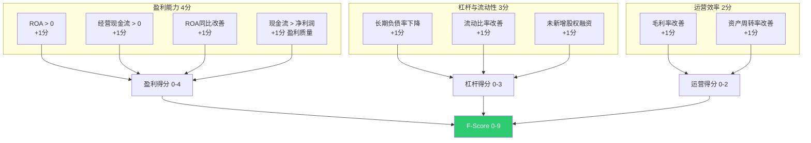
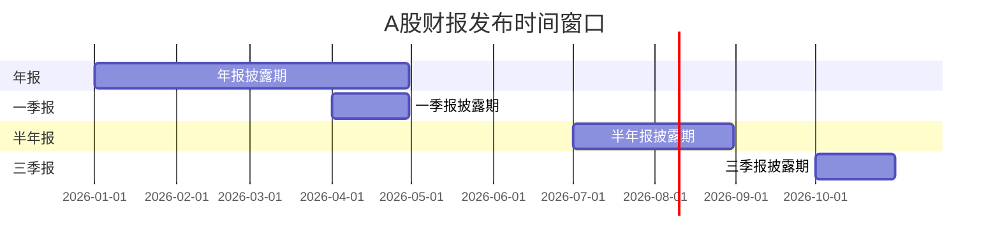

# A股财务质量与盈利预期因子

## 概述

基本面因子体系中，财务质量因子和盈利预期因子是区分"好公司"与"财务粉饰公司"的关键工具。本文深入分析SUE（标准化未预期盈利）、分析师预期修正、Piotroski F-Score、Beneish M-Score、Accrual因子等进阶基本面因子在A股的实证表现，涵盖IC/ICIR/半衰期等量化指标，并提供完整的Python实现代码。

**核心结论**：
- SUE因子在A股十分组月度超额收益单调递增，是盈余公告后漂移（PEAD）策略的核心因子
- A股分析师预期修正与股票回报正相关（与美国市场相反），高修正股票年超额达20%
- Piotroski F-Score与Beneish M-Score组合可有效过滤财务粉饰公司

> 相关笔记：[[A股基本面因子体系]] | [[因子评估方法论]] | [[多因子模型构建实战]] | [[A股事件驱动策略]]

---

## SUE因子（Standardized Unexpected Earnings）

### 定义与计算

SUE衡量实际盈利与市场预期的偏离程度，是PEAD（Post-Earnings Announcement Drift，盈余公告后漂移）效应的核心因子。

**计算公式**：

$$SUE = \frac{EPS_{actual} - EPS_{expected}}{σ_{forecast}}$$

其中：
- $EPS_{actual}$：实际每股收益
- $EPS_{expected}$：分析师一致预期EPS（或季节性随机游走预期）
- $σ_{forecast}$：预期标准差（至少3家分析师覆盖）

### A股实证表现

| 指标 | 数值 | 说明 |
|------|------|------|
| IC均值 | 0.05-0.08 | 月度横截面IC |
| ICIR | 0.6-1.0 | 稳定性高 |
| 十分组多空 | 8-15%/年 | 做多高SUE、做空低SUE |
| 半衰期 | 30-60天 | 公告后漂移持续1-2个月 |
| 最佳窗口 | 公告后[0, +60]天 | PEAD效应窗口 |

**关键发现**：A股SUE十分组月度超额收益单调递增，做多高SUE组年化超额显著。

### Python实现

```python
import pandas as pd
import numpy as np

def calculate_sue(
    actual_eps: pd.Series,
    expected_eps: pd.Series,
    eps_std: pd.Series,
    min_analysts: int = 3,
    analyst_count: pd.Series = None
) -> pd.Series:
    """
    计算SUE因子

    Parameters
    ----------
    actual_eps : 实际EPS
    expected_eps : 一致预期EPS
    eps_std : 预期标准差
    min_analysts : 最小分析师覆盖数
    analyst_count : 分析师覆盖数量
    """
    sue = (actual_eps - expected_eps) / eps_std.replace(0, np.nan)

    # 过滤覆盖不足的股票
    if analyst_count is not None:
        sue = sue.where(analyst_count >= min_analysts)

    return sue

def sue_seasonal_random_walk(
    quarterly_eps: pd.DataFrame,
    lookback_quarters: int = 8
) -> pd.Series:
    """
    季节性随机游走模型计算SUE（无需分析师预期数据）

    用同期历史EPS的均值和标准差估算预期
    """
    # 计算同季度历史EPS的均值和标准差
    eps_mean = quarterly_eps.rolling(lookback_quarters, min_periods=4).mean()
    eps_std = quarterly_eps.rolling(lookback_quarters, min_periods=4).std()

    # 当期SUE = (当期EPS - 历史同期均值) / 历史同期标准差
    sue = (quarterly_eps - eps_mean) / eps_std.replace(0, np.nan)
    return sue
```

---

## 分析师预期修正因子

### 定义

分析师预期修正因子衡量市场对公司盈利预期的边际变化方向和幅度。

**核心指标**：
- **FY1 EPS修正比例**：上调家数 / (上调 + 下调)，> 0.5为正向修正
- **EPS修正幅度**：(最新一致预期 - 30天前一致预期) / |30天前一致预期|
- **目标价修正**：分析师目标价的中位数变化方向

### A股特殊性

| 维度 | A股 | 美股 |
|------|-----|------|
| 修正方向与回报 | **正相关** | 负相关 |
| 乐观偏差 | 显著 | 较小 |
| 年超额收益 | ~20%（高修正组） | ~10% |
| 信息效率 | 较低（机会更多） | 较高 |

**解释**：A股分析师乐观偏差严重，但正向修正仍包含增量信息——当分析师在普遍乐观环境中进一步上调，说明基本面确实超预期。

### Python实现

```python
def analyst_revision_factor(
    consensus_df: pd.DataFrame,
    lookback_days: int = 30
) -> pd.DataFrame:
    """
    计算分析师预期修正因子

    Parameters
    ----------
    consensus_df : 包含 stock_code, date, fy1_eps, num_up, num_down 的DataFrame
    lookback_days : 回看天数
    """
    df = consensus_df.sort_values(['stock_code', 'date'])

    # EPS修正幅度
    df['eps_prev'] = df.groupby('stock_code')['fy1_eps'].shift(lookback_days)
    df['eps_revision'] = (
        (df['fy1_eps'] - df['eps_prev']) / df['eps_prev'].abs().replace(0, np.nan)
    )

    # 上调比例因子
    df['revision_ratio'] = (
        df['num_up'] / (df['num_up'] + df['num_down']).replace(0, np.nan)
    )

    # 综合修正因子（标准化后等权合成）
    for col in ['eps_revision', 'revision_ratio']:
        df[f'{col}_zscore'] = df.groupby('date')[col].transform(
            lambda x: (x - x.mean()) / x.std()
        )

    df['composite_revision'] = (
        df['eps_revision_zscore'] + df['revision_ratio_zscore']
    ) / 2

    return df[['stock_code', 'date', 'eps_revision', 'revision_ratio',
               'composite_revision']]
```

---

## Piotroski F-Score

### 定义

Joseph Piotroski于2000年提出，通过9项财务指标评估公司财务健康度，得分0-9分。

### 九项指标



### Python实现

```python
def piotroski_f_score(fin: pd.Series, fin_prev: pd.Series) -> int:
    """
    计算Piotroski F-Score

    Parameters
    ----------
    fin : 当期财务数据（dict-like）
    fin_prev : 上期财务数据（dict-like）
    """
    score = 0

    # --- 盈利能力（4分）---
    score += 1 if fin['roa'] > 0 else 0
    score += 1 if fin['cfo'] > 0 else 0
    score += 1 if fin['roa'] > fin_prev['roa'] else 0
    score += 1 if fin['cfo'] > fin['net_income'] else 0  # 盈利质量

    # --- 杠杆与流动性（3分）---
    score += 1 if fin['long_debt_ratio'] < fin_prev['long_debt_ratio'] else 0
    score += 1 if fin['current_ratio'] > fin_prev['current_ratio'] else 0
    score += 1 if fin['shares_outstanding'] <= fin_prev['shares_outstanding'] else 0

    # --- 运营效率（2分）---
    score += 1 if fin['gross_margin'] > fin_prev['gross_margin'] else 0
    score += 1 if fin['asset_turnover'] > fin_prev['asset_turnover'] else 0

    return score

def batch_f_score(financial_df: pd.DataFrame) -> pd.DataFrame:
    """批量计算全市场F-Score"""
    df = financial_df.sort_values(['stock_code', 'report_date'])

    results = []
    for code, group in df.groupby('stock_code'):
        for i in range(1, len(group)):
            curr = group.iloc[i]
            prev = group.iloc[i - 1]
            score = piotroski_f_score(curr, prev)
            results.append({
                'stock_code': code,
                'report_date': curr['report_date'],
                'f_score': score,
            })

    return pd.DataFrame(results)
```

### A股实证

| F-Score范围 | 财务状况 | 选股建议 | 占比 |
|-------------|---------|---------|------|
| 0-2 | 差（高风险） | 回避或做空 | ~15% |
| 3-5 | 一般 | 需结合其他因子 | ~55% |
| 6-7 | 良好 | 候选池 | ~25% |
| 8-9 | 优秀 | 重点关注 | ~5% |

---

## Beneish M-Score

### 定义

Messod Beneish于1999年提出，通过8个财务比率识别盈余操纵（Earnings Manipulation）。M-Score > -1.78 表示有操纵嫌疑。

### 八大变量

| 变量 | 名称 | 计算 | 含义 |
|------|------|------|------|
| DSRI | 应收账款周转天数指数 | DSR_t / DSR_{t-1} | >1暗示虚增收入 |
| GMI | 毛利率指数 | GM_{t-1} / GM_t | >1毛利恶化 |
| AQI | 资产质量指数 | 非流动资产占比变化 | 资产膨胀信号 |
| SGI | 营收增长指数 | Rev_t / Rev_{t-1} | 高增长常伴随操纵 |
| DEPI | 折旧率指数 | Dep_{t-1} / Dep_t | >1折旧放缓 |
| SGAI | 销管费用指数 | SGA_t/Rev_t 变化 | 费用控制异常 |
| LVGI | 杠杆指数 | Leverage_t / Leverage_{t-1} | 杠杆上升 |
| TATA | 应计项目/总资产 | (NI - CFO) / TA | 高值=低质量 |

```python
def beneish_m_score(fin: dict, fin_prev: dict) -> float:
    """
    计算Beneish M-Score

    M > -1.78 → 盈余操纵嫌疑
    """
    # 各变量计算
    dsri = (fin['receivables'] / fin['revenue']) / \
           (fin_prev['receivables'] / fin_prev['revenue'])
    gmi = fin_prev['gross_margin'] / max(fin['gross_margin'], 1e-10)
    aqi = (1 - (fin['current_assets'] + fin['ppe']) / fin['total_assets']) / \
          (1 - (fin_prev['current_assets'] + fin_prev['ppe']) / fin_prev['total_assets'])
    sgi = fin['revenue'] / fin_prev['revenue']
    depi = fin_prev['depreciation_rate'] / max(fin['depreciation_rate'], 1e-10)
    sgai = (fin['sga'] / fin['revenue']) / \
           (fin_prev['sga'] / fin_prev['revenue'])
    lvgi = fin['leverage'] / fin_prev['leverage']
    tata = (fin['net_income'] - fin['cfo']) / fin['total_assets']

    # M-Score公式
    m_score = (
        -4.84 + 0.920 * dsri + 0.528 * gmi + 0.404 * aqi
        + 0.892 * sgi + 0.115 * depi - 0.172 * sgai
        + 4.679 * tata - 0.327 * lvgi
    )
    return m_score
```

---

## Accrual因子（应计异常因子）

### 定义

Accrual因子衡量公司盈利中非现金部分的占比。高应计意味着盈利质量低——利润主要来自应计调整而非真实现金流。

**计算公式**：

$$Accrual = \frac{Net Income - CFO}{Total Assets}$$

### A股实证

- IC：-0.03 ~ -0.05（负值，说明低应计对应高回报）
- ICIR：0.3-0.5
- 半衰期：60-120天
- Fama-MacBeth横截面回归显著

```python
def accrual_factor(
    net_income: pd.Series,
    cfo: pd.Series,
    total_assets: pd.Series
) -> pd.Series:
    """计算Accrual因子"""
    accrual = (net_income - cfo) / total_assets.replace(0, np.nan)
    return accrual  # 负值（低应计）为好信号

def modified_jones_accrual(
    total_accruals: pd.Series,
    delta_revenue: pd.Series,
    delta_receivables: pd.Series,
    ppe: pd.Series,
    total_assets_prev: pd.Series
) -> pd.Series:
    """修正Jones模型计算异常应计"""
    # 正常应计 = α(1/TA) + β1(ΔRev - ΔRec)/TA + β2(PPE/TA)
    # 异常应计 = 实际应计 - 正常应计
    # 此处简化为直接使用total_accruals/TA作为近似
    return total_accruals / total_assets_prev.replace(0, np.nan)
```

---

## 季报效应与事件窗口

### 盈余公告日历



### 事件窗口交易策略

| 策略 | 窗口 | 核心因子 | 年化超额 |
|------|------|---------|---------|
| PEAD做多 | 公告后[0, +60]天 | SUE > 2σ | 8-15% |
| 预期修正跟踪 | 研报发布后[0, +30]天 | 上调比例 > 0.7 | 10-20% |
| 业绩预告套利 | 预告后[-1, +5]天 | 预告增幅 > 50% | 5-10% |
| 财务粉饰回避 | 年报期全程 | M-Score > -1.78 | 风控用途 |

```python
def pead_signal(
    sue_df: pd.DataFrame,
    threshold: float = 1.5,
    holding_days: int = 60
) -> pd.DataFrame:
    """
    PEAD交易信号生成

    Parameters
    ----------
    sue_df : 含 stock_code, announce_date, sue 的DataFrame
    threshold : SUE阈值（标准差倍数）
    holding_days : 持有天数
    """
    signals = sue_df.copy()

    # 做多信号：SUE > threshold
    signals['long_signal'] = signals['sue'] > threshold
    # 做空信号：SUE < -threshold
    signals['short_signal'] = signals['sue'] < -threshold

    # 持有截止日
    signals['exit_date'] = (
        pd.to_datetime(signals['announce_date'])
        + pd.Timedelta(days=holding_days)
    )

    return signals[signals['long_signal'] | signals['short_signal']]
```

---

## 因子有效性汇总

| 因子 | IC均值 | ICIR | 半衰期 | 换手率 | 适用域 | 数据要求 |
|------|--------|------|--------|-------|--------|---------|
| **SUE** | 0.05-0.08 | 0.6-1.0 | 30-60天 | 中 | 全市场 | 分析师预期/财报 |
| **预期修正** | 0.05-0.08 | 0.5-0.8 | 15-30天 | 中低 | 覆盖充分股 | 分析师数据(≥3家) |
| **F-Score** | 0.03-0.05 | 0.3-0.5 | 90-180天 | 低 | 价值股 | 财报数据 |
| **M-Score** | 反向过滤 | N/A | 年度 | 极低 | 风控过滤 | 详细财务数据 |
| **Accrual** | -0.03~-0.05 | 0.3-0.5 | 60-120天 | 低 | 全市场 | 财报+现金流 |
| **盈利质量(CFO/NI)** | 0.02-0.04 | 0.2-0.4 | 90-180天 | 低 | 全市场 | 财报数据 |

---

## 参数速查表

| 参数 | 推荐值 | 说明 |
|------|--------|------|
| SUE分析师最低覆盖 | ≥ 3家 | 低于此阈值SUE不可靠 |
| SUE持仓窗口 | 60天 | PEAD效应持续期 |
| SUE阈值 | ±1.5σ | 超预期/低于预期判定 |
| 预期修正回看期 | 30天 | 计算修正幅度的基准 |
| F-Score买入阈值 | ≥ 7 | 筛选财务优秀公司 |
| F-Score卖出阈值 | ≤ 2 | 回避财务恶化公司 |
| M-Score警戒线 | -1.78 | 大于此值有操纵嫌疑 |
| Accrual标准化 | MAD + Z-Score | 横截面标准化 |
| 财报数据Point-in-Time | 必须 | 避免未来函数偏差 |
| 财报滞后处理 | 公告日而非报告期 | 使用实际可获得时间 |

---

## 常见误区

| 误区 | 真相 |
|------|------|
| 直接用报告期数据回测 | 必须用Point-in-Time数据（公告日），否则产生前视偏差 |
| F-Score越高越好直接买入 | F-Score适合与价值因子（低PB/PE）组合使用，单独使用效果有限 |
| M-Score可以精确判断财务造假 | M-Score是统计模型，有假阳性，应作为风控过滤器而非定性依据 |
| SUE对所有股票有效 | 分析师覆盖不足的小盘股SUE噪声大，建议限制分析师覆盖≥3家 |
| 分析师预期修正在A股是反向指标 | 与美股相反，A股预期修正是正向因子，买入高修正组有超额 |
| 季报公告后信息立即被反映 | A股PEAD效应持续60天以上，市场对盈余信息反应缓慢 |

---

## 相关链接

- [[A股基本面因子体系]] — 基本面因子全景概述
- [[因子评估方法论]] — IC/ICIR评估方法
- [[多因子模型构建实战]] — 因子组合与模型构建
- [[A股事件驱动策略]] — 盈余公告事件策略
- [[A股量化数据源全景图]] — 财务数据获取渠道
- [[因子库工程化：构建与管理实践]] — 因子工程化管理
