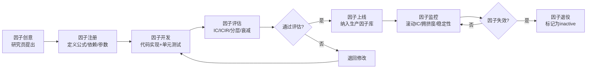

# 因子库工程化：构建与管理实践

> - 因子库是量化团队的核心资产——从研究到生产的因子全生命周期管理，包含**注册、计算、存储、评估、退役**五个阶段
> - 因子DAG（有向无环图）调度是工程化的核心：原始数据→中间变量→因子值→截面标准化→持久化，Airflow/Prefect管理依赖与调度
> - 增量计算是性能关键：每日只计算当天新增数据的因子值，避免全量重算（从小时级降至分钟级）
> - 因子元数据管理：每个因子需记录名称、公式、数据依赖、作者、版本、IC统计、状态（活跃/衰减/退役）
> - DolphinDB因子库：5000股×500因子×10年日频 ≈ 62.5亿条，DolphinDB查询<1秒

---

## 一、因子生命周期



---

## 二、因子注册中心

### 2.1 元数据Schema

```python
from dataclasses import dataclass, field
from typing import List, Optional
from datetime import datetime
from enum import Enum

class FactorStatus(Enum):
    DRAFT = "draft"           # 开发中
    TESTING = "testing"       # 评估中
    ACTIVE = "active"         # 生产使用
    DECAYING = "decaying"     # 衰减中
    RETIRED = "retired"       # 已退役

@dataclass
class FactorMeta:
    """因子元数据"""
    # 基本信息
    factor_id: str               # 唯一ID: "tech_turnover_20d"
    name: str                    # 显示名: "20日换手率"
    category: str                # 类别: "technical/liquidity"
    description: str             # 描述
    formula: str                 # 公式(LaTeX/文本)
    
    # 数据依赖
    data_dependencies: List[str] # ["daily_quotes.volume", "daily_quotes.float_shares"]
    factor_dependencies: List[str] = field(default_factory=list)  # 依赖其他因子
    
    # 参数
    params: dict = field(default_factory=dict)  # {"window": 20}
    
    # 评估指标
    mean_ic: Optional[float] = None
    ic_ir: Optional[float] = None
    half_life_days: Optional[int] = None
    turnover_monthly: Optional[float] = None
    
    # 状态
    status: FactorStatus = FactorStatus.DRAFT
    author: str = ""
    created_at: datetime = field(default_factory=datetime.now)
    updated_at: datetime = field(default_factory=datetime.now)
    version: str = "1.0.0"
    
    # 计算配置
    compute_func: str = ""        # 计算函数全路径
    update_frequency: str = "daily"  # daily/weekly/monthly
    lookback_days: int = 250      # 计算需要的历史数据天数


class FactorRegistry:
    """因子注册中心"""
    
    def __init__(self):
        self._factors = {}  # factor_id -> FactorMeta
    
    def register(self, meta: FactorMeta) -> str:
        """注册新因子"""
        if meta.factor_id in self._factors:
            raise ValueError(f"Factor {meta.factor_id} already exists")
        self._factors[meta.factor_id] = meta
        return meta.factor_id
    
    def get(self, factor_id: str) -> FactorMeta:
        return self._factors[factor_id]
    
    def list_active(self) -> List[FactorMeta]:
        return [f for f in self._factors.values() 
                if f.status == FactorStatus.ACTIVE]
    
    def update_stats(self, factor_id: str, 
                     mean_ic: float, ic_ir: float,
                     half_life: int, turnover: float):
        """更新因子评估统计"""
        f = self._factors[factor_id]
        f.mean_ic = mean_ic
        f.ic_ir = ic_ir
        f.half_life_days = half_life
        f.turnover_monthly = turnover
        f.updated_at = datetime.now()
        
        # 自动状态管理
        if abs(ic_ir) < 0.3 and f.status == FactorStatus.ACTIVE:
            f.status = FactorStatus.DECAYING
    
    def retire(self, factor_id: str, reason: str = ""):
        f = self._factors[factor_id]
        f.status = FactorStatus.RETIRED
        f.description += f"\n[退役] {reason}"
    
    def dependency_graph(self) -> dict:
        """生成因子依赖图"""
        graph = {}
        for fid, meta in self._factors.items():
            graph[fid] = {
                'data_deps': meta.data_dependencies,
                'factor_deps': meta.factor_dependencies
            }
        return graph
```

---

## 三、DAG调度引擎

### 3.1 Airflow DAG示例

```python
from airflow import DAG
from airflow.operators.python import PythonOperator
from datetime import datetime, timedelta

default_args = {
    'owner': 'quant_team',
    'depends_on_past': True,
    'start_date': datetime(2020, 1, 1),
    'retries': 2,
    'retry_delay': timedelta(minutes=5),
}

dag = DAG(
    'factor_daily_pipeline',
    default_args=default_args,
    schedule_interval='0 18 * * 1-5',  # 每个交易日18:00
    catchup=False,
    max_active_runs=1,
)

# Task 1: 数据更新
update_daily_quotes = PythonOperator(
    task_id='update_daily_quotes',
    python_callable=update_quotes_from_tushare,
    dag=dag,
)

# Task 2: 基础因子计算（并行）
calc_fundamental = PythonOperator(
    task_id='calc_fundamental_factors',
    python_callable=calc_fundamental_factors,
    dag=dag,
)

calc_technical = PythonOperator(
    task_id='calc_technical_factors',
    python_callable=calc_technical_factors,
    dag=dag,
)

calc_alternative = PythonOperator(
    task_id='calc_alternative_factors',
    python_callable=calc_alternative_factors,
    dag=dag,
)

# Task 3: 因子预处理（依赖基础因子）
preprocess = PythonOperator(
    task_id='factor_preprocess',
    python_callable=run_factor_preprocess,  # 去极值→标准化→中性化
    dag=dag,
)

# Task 4: 因子合成
composite = PythonOperator(
    task_id='factor_composite',
    python_callable=run_factor_composite,
    dag=dag,
)

# Task 5: 因子监控
monitor = PythonOperator(
    task_id='factor_monitor',
    python_callable=run_factor_monitor,
    dag=dag,
)

# DAG依赖关系
update_daily_quotes >> [calc_fundamental, calc_technical, calc_alternative]
[calc_fundamental, calc_technical, calc_alternative] >> preprocess
preprocess >> composite >> monitor
```

### 3.2 调度方案对比

| 方案 | 复杂度 | DAG支持 | 监控UI | 适用规模 |
|------|--------|---------|--------|---------|
| crontab | 低 | ❌ | ❌ | 个人/2-3个因子 |
| APScheduler | 低 | ❌ | 有限 | 小团队/<20因子 |
| Airflow | 高 | ✅ 原生 | ✅ Web UI | 中大团队/100+因子 |
| Prefect | 中 | ✅ | ✅ Cloud | 中型团队/50-200因子 |
| DolphinDB Job | 低 | 有限 | 有限 | DolphinDB用户 |

---

## 四、增量计算引擎

### 4.1 增量 vs 全量

| 维度 | 全量计算 | 增量计算 |
|------|---------|---------|
| 计算范围 | 全历史数据 | 仅新增数据 |
| 耗时(500因子×5000股) | 2-4小时 | 5-15分钟 |
| 适用场景 | 首次建库/修复 | 日常更新 |
| 复杂度 | 低 | 中（需状态管理） |
| 数据一致性 | 高 | 需校验机制 |

### 4.2 增量计算框架

```python
class IncrementalFactorEngine:
    """增量因子计算引擎"""
    
    def __init__(self, registry: FactorRegistry, 
                 db_connector):
        self.registry = registry
        self.db = db_connector
        self.last_calc_date = {}  # factor_id -> last_date
    
    def calc_factor_incremental(self, factor_id: str, 
                                 calc_date: str):
        """增量计算单个因子"""
        meta = self.registry.get(factor_id)
        
        # 获取计算函数
        calc_func = self._load_func(meta.compute_func)
        
        # 获取所需数据（只取lookback窗口）
        start_date = self._offset_date(
            calc_date, -meta.lookback_days)
        data = self.db.query(
            meta.data_dependencies, start_date, calc_date
        )
        
        # 计算因子值
        factor_values = calc_func(data, **meta.params)
        
        # 只保存calc_date当天的结果
        today_values = factor_values[
            factor_values.index.get_level_values('date') == calc_date
        ]
        
        # 写入数据库
        self.db.upsert('factor_values', today_values, 
                       keys=['date', 'stock_code', 'factor_id'])
        
        self.last_calc_date[factor_id] = calc_date
    
    def daily_update(self, calc_date: str):
        """日度批量更新所有活跃因子"""
        active_factors = self.registry.list_active()
        
        # 按依赖拓扑排序
        sorted_factors = self._topological_sort(active_factors)
        
        for meta in sorted_factors:
            try:
                self.calc_factor_incremental(
                    meta.factor_id, calc_date)
                print(f"✅ {meta.factor_id}")
            except Exception as e:
                print(f"❌ {meta.factor_id}: {e}")
    
    def _topological_sort(self, factors):
        """拓扑排序：确保依赖因子先计算"""
        from collections import deque
        
        in_degree = {f.factor_id: 0 for f in factors}
        graph = {f.factor_id: [] for f in factors}
        
        for f in factors:
            for dep in f.factor_dependencies:
                if dep in graph:
                    graph[dep].append(f.factor_id)
                    in_degree[f.factor_id] += 1
        
        queue = deque([fid for fid, d in in_degree.items() if d == 0])
        result = []
        
        while queue:
            fid = queue.popleft()
            result.append(fid)
            for next_fid in graph[fid]:
                in_degree[next_fid] -= 1
                if in_degree[next_fid] == 0:
                    queue.append(next_fid)
        
        id_to_meta = {f.factor_id: f for f in factors}
        return [id_to_meta[fid] for fid in result if fid in id_to_meta]
    
    def _offset_date(self, date_str, offset_days):
        from datetime import datetime, timedelta
        dt = datetime.strptime(date_str, '%Y-%m-%d')
        return (dt + timedelta(days=offset_days)).strftime('%Y-%m-%d')
    
    def _load_func(self, func_path):
        module_path, func_name = func_path.rsplit('.', 1)
        import importlib
        module = importlib.import_module(module_path)
        return getattr(module, func_name)
```

---

## 五、存储方案

### 5.1 因子值存储结构

```sql
-- DolphinDB 因子值表
-- 分区：日期VALUE + 股票代码HASH(50)
CREATE TABLE factor_values (
    date DATE,
    stock_code SYMBOL,
    factor_id SYMBOL,
    factor_value DOUBLE,
    factor_rank DOUBLE,      -- 截面排名
    factor_zscore DOUBLE,    -- 截面Z-Score
    is_neutral BOOL          -- 是否已中性化
)
PARTITIONED BY VALUE(date), HASH([stock_code], 50)
```

### 5.2 存储规模估算

| 维度 | 数值 |
|------|------|
| 股票数 | 5000 |
| 因子数 | 500（活跃200+历史300） |
| 频率 | 日频 |
| 年限 | 10年 |
| 总记录数 | 5000×500×2500 = 62.5亿条 |
| 存储空间(未压缩) | ~500GB |
| 存储空间(DolphinDB压缩) | ~50-100GB |
| 单因子单日查询 | <100ms |
| 全因子单日查询 | <1s |

---

## 六、因子监控仪表盘

### 6.1 监控指标

| 指标 | 计算方式 | 黄色预警 | 红色预警 |
|------|---------|---------|---------|
| 滚动IC(12月) | 月度Rank IC均值 | <0.02 | <0 |
| 滚动IC_IR(12月) | IC均值/IC标准差 | <0.3 | <0 |
| IC连续为负 | 连续N月IC<0 | 2月 | 3月 |
| 拥挤度Z-Score | 因子估值价差分位 | >1.0 | >1.5 |
| 换手率突变 | 月换手率/历史均值 | >2倍 | >3倍 |
| 覆盖率 | 有效因子值/总股票数 | <90% | <80% |

---

## 七、参数速查表

| 参数 | 推荐值 | 说明 |
|------|--------|------|
| 因子更新时间 | 收盘后18:00 | 数据源更新完毕后 |
| 增量窗口 | lookback+5天 | 额外5天缓冲确保完整 |
| 全量重建频率 | 每月一次 | 修正增量累积误差 |
| IC监控窗口 | 12个月 | 太短噪声大，太长反应慢 |
| 因子退役标准 | IC_IR<0连续6月 | 保守，避免误杀 |
| 版本控制 | Git+DVC | 代码Git、大数据DVC |
| 元数据存储 | PostgreSQL/JSON | 结构化+可查询 |
| 因子值存储 | DolphinDB/ClickHouse | 高性能时序查询 |

---

## 八、常见误区

| 误区 | 真相 |
|------|------|
| "因子库就是一张大表" | 因子库是完整的工程系统：注册→计算→存储→评估→监控→退役 |
| "每天全量重算最安全" | 500因子全量重算需数小时，增量计算15分钟即可，月度全量校验足够 |
| "因子计算顺序无所谓" | 有依赖关系的因子必须拓扑排序（如中性化因子依赖原始因子） |
| "因子退役=删除" | 退役因子保留历史数据和元数据，只标记为inactive，便于回溯分析 |
| "一个Python脚本搞定" | 个人研究可以，团队协作必须有注册中心+版本控制+监控告警 |
| "Airflow太重了" | 10个以下因子用APScheduler足够，50+因子Airflow的DAG管理和监控UI物超所值 |

---

## 九、相关笔记

- [[多因子模型构建实战]] — 因子预处理、合成方法、Barra模型
- [[因子评估方法论]] — IC/ICIR/分层回测/衰减分析
- [[量化数据工程实践]] — 数据清洗、存储、PIT数据库
- [[量化研究Python工具链搭建]] — 开发环境、调度工具
- [[量化策略的服务器部署与自动化]] — Airflow/Docker部署
- [[A股基本面因子体系]] — 基本面因子定义与计算
- [[A股技术面因子与量价特征]] — 技术面因子构建
- [[高频因子与日内数据挖掘]] — 高频因子计算引擎

---

## 来源参考

1. Apache Airflow官方文档 — DAG定义、调度策略、监控
2. DolphinDB《因子库最佳实践》 — 因子存储、增量计算
3. 华泰证券《星火多因子系统架构》 — 因子库工程化参考
4. MLflow官方文档 — 模型版本管理与实验追踪
5. Prefect官方文档 — 现代数据工作流编排
