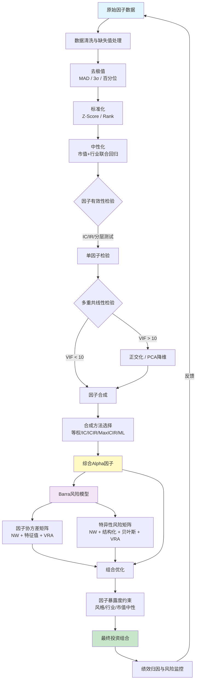

# 多因子模型构建实战

> [!summary] 核心要点
> - **因子预处理三步走**：去极值(MAD/3sigma/百分位) -> 标准化(Z-Score/Rank) -> 中性化(市值/行业/Fama-MacBeth回归残差)，顺序不可颠倒
> - **因子合成**：最大化IC_IR方法实证表现最优（IR可达3.58），压缩协方差估计+T=12窗口为推荐配置
> - **Barra风险模型**：CNE5含10个风格因子+行业因子，CNE6升级为9个风格因子+31个行业因子+1个国家因子，新增Quality/Sentiment/Dividend
> - **风险矩阵估计**：因子协方差需NW自相关调整+特征值调整+波动率偏误调整；特异性风险需NW+结构化+贝叶斯收缩+波动率偏误四步调整
> - **共线性处理**：VIF>10为严重共线性阈值，施密特正交化保留经济含义，PCA降维牺牲可解释性换取稳定性

---

## 一、因子预处理Pipeline

因子预处理是多因子模型的地基。原始因子值存在极端值、量纲不同、受市值和行业系统性偏差污染等问题，必须经过标准化流水线处理后才能进入模型。预处理顺序为：**去极值 -> 缺失值处理 -> 标准化 -> 中性化**。

### 1.1 去极值（Winsorization）

去极值的目的是消除因子截面分布中的极端异常值，防止少数极端观测主导模型结果。

#### MAD法（Median Absolute Deviation）

MAD法基于中位数，对非正态分布更加鲁棒，是A股量化中最推荐的去极值方法。

$$
\text{MAD} = \text{median}(|x_i - \text{median}(x)|)
$$

$$
x_i^{*} = \begin{cases} \text{median} + n \cdot 1.4826 \cdot \text{MAD}, & \text{if } x_i > \text{median} + n \cdot 1.4826 \cdot \text{MAD} \\ \text{median} - n \cdot 1.4826 \cdot \text{MAD}, & \text{if } x_i < \text{median} - n \cdot 1.4826 \cdot \text{MAD} \\ x_i, & \text{otherwise} \end{cases}
$$

其中 $n$ 通常取3或5，$1.4826$ 是使MAD在正态分布下与标准差一致的校正系数。

#### 3sigma法

$$
x_i^{*} = \text{clip}(x_i, \mu - 3\sigma, \mu + 3\sigma)
$$

- 假设因子服从正态分布，对偏态/厚尾分布效果较差
- A股因子值普遍呈厚尾分布，3sigma法可能不够鲁棒

#### 百分位法（Percentile）

$$
x_i^{*} = \text{clip}(x_i, P_{q}, P_{1-q}), \quad q \in \{0.01, 0.025, 0.05\}
$$

- 非参数方法，不依赖分布假设
- 常用百分位：1%/99% 或 2.5%/97.5%

**三种方法对比：**

| 方法 | 鲁棒性 | 分布假设 | 推荐场景 |
|------|--------|----------|---------|
| MAD | 高 | 无 | **首选**，适用于厚尾/偏态分布 |
| 3sigma | 中 | 正态假设 | 因子近似正态时可用 |
| 百分位 | 高 | 无 | 样本量充足时稳定 |

### 1.2 标准化（Standardization）

标准化消除因子间的量纲差异，使不同因子可以在同一尺度上比较和合成。

#### Z-Score标准化

$$
z_i = \frac{x_i - \mu}{\sigma}
$$

- 按截面（同一时间截面所有股票）计算均值和标准差
- 处理后因子均值为0、标准差为1
- 对异常值敏感（需先去极值）

#### Rank标准化（排序标准化）

$$
r_i = \frac{\text{rank}(x_i)}{N+1}
$$

或进一步转换为正态分布：$z_i = \Phi^{-1}(r_i)$

- 非参数方法，完全消除极端值和非线性影响
- 缺点：丢失因子值的绝对大小信息
- 适用于因子分布严重非正态的场景

### 1.3 中性化（Neutralization）

中性化去除因子中被市值、行业等系统性因素所解释的部分，提取因子的"纯净"Alpha信号。

#### 市值中性化

$$
f_i = \alpha + \beta \cdot \ln(\text{MktCap}_i) + \epsilon_i
$$

取残差 $\epsilon_i$ 作为市值中性化后的因子值。

#### 行业中性化

$$
f_i = \sum_{j=1}^{K} \gamma_j \cdot D_{ij} + \epsilon_i
$$

其中 $D_{ij}$ 为行业哑变量（A股常用申万一级行业分类，K=31）。

#### 市值+行业联合中性化

$$
f_i = \alpha + \beta \cdot \ln(\text{MktCap}_i) + \sum_{j=1}^{K} \gamma_j \cdot D_{ij} + \epsilon_i
$$

取残差 $\epsilon_i$，这是实战中最常用的中性化方式。

#### Fama-MacBeth回归残差法

在Fama-MacBeth框架下，每期截面回归：

$$
r_{i,t} = \alpha_t + \sum_{k} \lambda_{k,t} f_{k,i,t} + \epsilon_{i,t}
$$

- 每期得到因子收益率 $\lambda_{k,t}$，对因子收益率序列做统计检验
- 残差可用于构造中性化后的因子暴露
- 优势：天然处理截面相关性问题，是因子有效性检验的"黄金标准"

> [!warning] 预处理顺序不可颠倒
> 必须先去极值再标准化，最后中性化。如果先标准化再去极值，去极值的阈值失去意义；如果先中性化再去极值，中性化回归会被极端值扭曲。

---

## 二、因子合成方法

因子合成（Factor Composition）将同一大类下的多个子因子合成为一个复合因子，或将多个Alpha因子合成为最终的综合选股信号。

### 2.1 等权合成（Equal Weighting）

$$
F_{\text{composite}} = \frac{1}{n} \sum_{k=1}^{n} f_k
$$

- 最简单的基准方法
- 假设所有因子同等重要，忽略因子有效性差异和相关性
- 实战中常作为其他方法的对比基准

### 2.2 IC加权（IC Weighting）

$$
w_k = \frac{\overline{IC}_k}{\sum_{j} |\overline{IC}_j|}
$$

其中 $\overline{IC}_k$ 为因子 $k$ 在滚动窗口内的IC均值，常使用半衰期指数衰减加权：

$$
\overline{IC}_k = \frac{\sum_{t} \lambda^{T-t} \cdot IC_{k,t}}{\sum_{t} \lambda^{T-t}}, \quad \lambda = 2^{-1/\tau}
$$

- 因子IC越高，权重越大
- 捕捉因子预测能力的动态变化
- 缺点：未考虑IC的稳定性

### 2.3 IC_IR加权（ICIR Weighting）

$$
w_k = \frac{ICIR_k}{\sum_{j} |ICIR_j|}, \quad ICIR_k = \frac{\overline{IC}_k}{\sigma(IC_k)}
$$

- 同时考虑因子预测能力（IC均值）和稳定性（IC标准差）
- IC_IR高的因子获得更高权重
- 缺点：权重可能波动较大

### 2.4 最大化IC_IR优化

这是实证中表现最优的合成方法。将因子合成问题转化为均值-方差优化：

$$
\max_{\mathbf{w}} \frac{\mathbf{w}^T \boldsymbol{\mu}_{IC}}{\sqrt{\mathbf{w}^T \boldsymbol{\Sigma}_{IC} \mathbf{w}}}
$$

其中 $\boldsymbol{\mu}_{IC}$ 为各因子IC均值向量，$\boldsymbol{\Sigma}_{IC}$ 为IC协方差矩阵。

解析解：

$$
\mathbf{w}^* = \boldsymbol{\Sigma}_{IC}^{-1} \boldsymbol{\mu}_{IC}
$$

**关键参数：**
- 滚动窗口 $T=12$ 期（月度）为推荐值
- $\boldsymbol{\Sigma}_{IC}$ 建议使用Ledoit-Wolf压缩估计，可将IR提升至3.58
- 可加入权重非负约束或权重上下限约束增强稳健性

### 2.5 机器学习合成

| 方法 | 原理 | 优势 | 劣势 |
|------|------|------|------|
| LASSO/Ridge | 正则化线性回归 | 自动特征选择/收缩 | 线性假设 |
| XGBoost/LightGBM | 梯度提升树 | 捕捉非线性交互 | 过拟合风险 |
| 神经网络 | 深度学习 | 高维非线性拟合 | 黑箱、数据需求大 |
| 强化学习(RRL) | 策略梯度优化 | 端到端优化收益目标 | 训练不稳定 |
| PCA合成 | 提取主成分 | 消除共线性 | 丧失因子含义 |

**五种合成方法综合对比：**

| 方法 | 实证IR | 稳定性 | 复杂度 | 可解释性 | 推荐度 |
|------|--------|--------|--------|----------|--------|
| 等权 | 基准 | 高 | 低 | 高 | 基准 |
| IC加权 | 优于等权 | 中 | 低 | 高 | 中 |
| IC_IR加权 | 优于IC | 中低 | 低 | 高 | 中高 |
| **最大化IC_IR** | **最优(~3.58)** | **高** | **中** | **高** | **首选** |
| 机器学习 | 显著优 | 中 | 高 | 低 | 复杂场景 |

---

## 三、Barra风险模型

Barra模型是全球应用最广泛的多因子风险模型，MSCI针对中国A股市场发布了CNE5和CNE6两代模型。其核心框架为：

$$
r_i = \sum_{k=1}^{K} X_{ik} f_k + u_i
$$

其中 $r_i$ 为股票 $i$ 的收益率，$X_{ik}$ 为股票 $i$ 对因子 $k$ 的暴露度，$f_k$ 为因子 $k$ 的纯因子收益（factor return），$u_i$ 为特异性收益。

### 3.1 CNE5因子定义（10个风格因子）

| 风格因子 | 英文名 | 描述变量 | 计算说明 |
|---------|--------|---------|---------|
| **市值 Size** | Size | LNCAP | 总市值自然对数 $\ln(\text{MktCap})$ |
| **贝塔 Beta** | Beta | BETA, HSIGMA | 个股对市场指数回归Beta（252天窗口，半衰期63天），HSIGMA为残差标准差 |
| **动量 Momentum** | Momentum | RSTR | 过去525个交易日（去掉最近21天）指数衰减加权收益（半衰期126天） |
| **残差波动率** | Residual Volatility | DASTD, CMRA, HSIGMA | DASTD：252天超额收益加权波动率（半衰期42天）；CMRA：月度累计极差；对Beta正交化 |
| **非线性市值** | Non-linear Size | NLSIZE | Size的立方，对Size正交化，捕捉中盘股效应（MIDCAP） |
| **账面市值比** | Book-to-Price | BTOP | 最近报告期净资产/总市值 |
| **流动性** | Liquidity | STOM, STOQ, STOA | 月/季/年换手率的对数，IC胜率约0.7 |
| **盈利收益率** | Earnings Yield | EPFWD, CETOP, ETOP | 预期/现金/历史EP；前瞻EP优先 |
| **成长性** | Growth | EGRLF, EGRSF, EGRO, SGRO | 长期/短期盈利增长预测、历史盈利/营收增长率 |
| **杠杆** | Leverage | MLEV, DTOA, BLEV | 市值杠杆、资产负债率、账面杠杆 |

**CNE5行业因子**：采用中信一级行业分类或申万一级行业分类，约28-31个行业。

### 3.2 CNE6因子定义（9个风格因子 + 31个行业因子 + 1个国家因子）

CNE6于2018年发布，相比CNE5做了重大升级：

| 风格因子 | 英文名 | 描述变量/子因子 | 相比CNE5的变化 |
|---------|--------|----------------|---------------|
| **市值 Size** | Size | LNCAP | 与CNE5一致，合并了Non-linear Size |
| **贝塔 Beta** | Beta | BETA, HSIGMA | 基本一致，年化收益5.86% |
| **价值 Value** | Book-to-Price (BTOP) | 3个二级因子、8个三级因子 | 扩充了估值维度 |
| **成长性 Growth** | Growth | 盈利增长、营收增长 | 基本一致 |
| **动量 Momentum** | Momentum | 短期动量、行业动量（新增） | 加入行业动量因子 |
| **流动性 Liquidity** | Liquidity | 月/季/年换手率、年化交易价值比、ATR（新增） | 新增ATR指标，1个二级4个三级 |
| **质量 Quality** | Quality | 盈余波动、投资质量、盈利能力 | **CNE6新增** |
| **情绪 Sentiment** | Analyst Sentiment (ANASENT) | 分析师预期修正、一致预期变化 | **CNE6新增**，年化收益8.19%，覆盖度65.21% |
| **分红 Dividend** | Dividend Yield | 股息率、分红稳定性 | **CNE6新增**，覆盖度67.54% |

**CNE6关键升级：**
- 描述变量从21个增至**48个**，基础因子从10个增至**20个**
- 新增Quality、Sentiment、Dividend三大风格维度
- Non-linear Size合并入Size因子
- 行业分类采用申万行业分类（31个行业）更适应A股
- 9因子模型R^2均值达**42.33%**；剔除低覆盖度的Sentiment和Dividend后7因子R^2为37.43%

### 3.3 纯因子收益估计（Pure Factor Return）

使用加权最小二乘法（WLS）回归，权重为流通市值平方根：

$$
\mathbf{r} = \mathbf{X} \mathbf{f} + \mathbf{u}
$$

$$
\hat{\mathbf{f}} = (\mathbf{X}^T \mathbf{W} \mathbf{X})^{-1} \mathbf{X}^T \mathbf{W} \mathbf{r}
$$

其中 $\mathbf{W} = \text{diag}(\sqrt{w_1}, \ldots, \sqrt{w_N})$，$w_i$ 为流通市值。

**关键约束：**
- 行业因子收益的市值加权和为零：$\sum_j w_j f_j^{\text{ind}} = 0$
- 国家因子暴露度为1（截距项）

### 3.4 因子协方差矩阵估计与NW调整

因子协方差矩阵 $\boldsymbol{\Sigma}_f$ 的估计经过三步调整：

#### 第一步：Newey-West自相关调整

$$
\hat{\Sigma}_f = \Gamma_0 + \sum_{d=1}^{D} \left(1 - \frac{d}{D+1}\right)(\Gamma_d + \Gamma_d^T)
$$

其中 $\Gamma_d = \frac{1}{T} \sum_{t=d+1}^{T} \lambda^{T-t}(f_t - \bar{f})(f_{t-d} - \bar{f})^T$ 为滞后 $d$ 期的自协方差矩阵，使用Bartlett权重函数 $\left(1 - \frac{d}{D+1}\right)$。

**参数选择：** 样本窗口252天，半衰期 $\tau=90$天，滞后期 $D=5$。

#### 第二步：特征值调整（Eigenfactor Adjustment）

对 $\hat{\Sigma}_f$ 进行特征分解后，通过模拟调整特征值的偏误：

$$
\hat{\Sigma}_f = \mathbf{U} \hat{\mathbf{D}} \mathbf{U}^T
$$

对 $\hat{\mathbf{D}}$ 中的特征值进行Monte Carlo模拟修正，防止最小特征值被低估。

#### 第三步：波动率偏误调整（Volatility Regime Adjustment）

$$
\hat{\Sigma}_f^{\text{adj}} = \hat{\lambda}_F^2 \cdot \hat{\Sigma}_f
$$

用实现波动率与预测波动率的比值进行截面修正，捕捉波动率趋势变化。

### 3.5 特异性风险预测

特异性收益方差矩阵 $\boldsymbol{\Delta} = \text{diag}(\sigma_{u,1}^2, \ldots, \sigma_{u,N}^2)$ 的估计经过四步调整：

| 步骤 | 名称 | 作用 |
|------|------|------|
| 1 | **Newey-West调整** | 修正特异收益的时序自相关 |
| 2 | **结构化模型调整** | $\ln(\sigma_{u,i}) = a_0 + a_1 \cdot \text{Beta}_i + a_2 \cdot \text{Size}_i + \ldots$，用截面信息稳定估计 |
| 3 | **贝叶斯收缩调整** | $\hat{\sigma}_i^2 = v_i \cdot \hat{\sigma}_{i,\text{TS}}^2 + (1-v_i) \cdot \hat{\sigma}_{i,\text{STR}}^2$，时序估计与结构化估计的加权平均 |
| 4 | **波动率偏误调整** | 类似因子协方差的VRA调整 |

### 3.6 完整组合风险模型

$$
\sigma_p^2 = \mathbf{x}_p^T \mathbf{X}^T \hat{\boldsymbol{\Sigma}}_f \mathbf{X} \mathbf{x}_p + \mathbf{x}_p^T \hat{\boldsymbol{\Delta}} \mathbf{x}_p
$$

其中 $\mathbf{x}_p$ 为组合权重向量。第一项为因子（系统性）风险，第二项为特异性风险。

---

## 四、多重共线性处理

因子间的多重共线性会导致回归系数不稳定、因子收益估计失真。

### 4.1 VIF检验

$$
\text{VIF}_k = \frac{1}{1 - R_k^2}
$$

其中 $R_k^2$ 为因子 $k$ 对其他因子回归的决定系数。

| VIF值 | 共线性程度 | 处理建议 |
|-------|-----------|---------|
| 1-5 | 低 | 无需处理 |
| 5-10 | 中等 | 关注监控 |
| >10 | **严重** | **必须处理** |

### 4.2 施密特正交化（Gram-Schmidt Orthogonalization）

对因子 $f_1, f_2, \ldots, f_n$ 依次正交化：

$$
g_1 = f_1
$$
$$
g_k = f_k - \sum_{j=1}^{k-1} \frac{\langle f_k, g_j \rangle}{\langle g_j, g_j \rangle} g_j, \quad k = 2, \ldots, n
$$

- **优点**：保留第一个因子的原始信息，后续因子为条件增量
- **缺点**：结果依赖因子排序，排在前面的因子"优先级"更高
- **实战建议**：按因子重要性排序（如IC_IR从高到低）

### 4.3 对称正交化

$$
\mathbf{G} = \mathbf{F} (\mathbf{F}^T \mathbf{F})^{-1/2}
$$

- 不依赖因子排序，对所有因子同等对待
- 正交化后的因子与原始因子的"距离"最小（Frobenius范数意义下）
- **推荐在因子无明确优先级时使用**

### 4.4 PCA降维

$$
\mathbf{Z} = \mathbf{F} \mathbf{V}_m
$$

其中 $\mathbf{V}_m$ 为前 $m$ 个主成分对应的特征向量矩阵。选择 $m$ 使累计解释方差比 > 85%。

- 完全消除共线性
- 缺点：主成分失去原因子的经济含义
- 适用于机器学习模型的特征输入

### 4.5 因子暴露度约束

在组合优化中直接约束因子暴露：

$$
\min_{\mathbf{x}} \quad \mathbf{x}^T \boldsymbol{\Sigma} \mathbf{x} - \lambda \boldsymbol{\alpha}^T \mathbf{x}
$$
$$
\text{s.t.} \quad |(\mathbf{X} \mathbf{x})_k - b_k| \leq \delta_k, \quad k = 1, \ldots, K
$$

其中 $b_k$ 为基准的因子暴露，$\delta_k$ 为允许的偏离度。

常见约束场景：
- **风格中性**：各风格因子暴露偏离基准不超过0.1-0.3个标准差
- **行业中性**：各行业权重偏离基准不超过2%-5%
- **市值中性**：组合对Size因子的暴露接近0

---

## 五、参数速查表

| 参数 | 推荐值 | 说明 |
|------|--------|------|
| MAD去极值阈值 | $n=3$ 或 $n=5$ | $n \cdot 1.4826 \cdot \text{MAD}$ |
| 百分位去极值 | 1%/99% 或 2.5%/97.5% | 视样本量和分布选择 |
| IC滚动窗口 | 12期（月度） | 最大化IC_IR优化的推荐窗口 |
| IC半衰期 | 3-6期 | IC加权的指数衰减 |
| NW调整窗口 | 252天 | 因子协方差估计的样本窗口 |
| NW半衰期 | $\tau=90$天 | 指数衰减权重 |
| NW滞后期 | $D=5$ | Bartlett权重的最大滞后 |
| VIF阈值 | >10严重，>5警示 | 多重共线性判断标准 |
| PCA累计方差比 | >85% | 主成分选择标准 |
| 风格暴露约束 | $\pm 0.1 \sim 0.3\sigma$ | 偏离基准的上限 |
| 行业暴露约束 | $\pm 2\% \sim 5\%$ | 偏离基准的上限 |
| CNE5行业数 | 28-31个 | 中信/申万一级 |
| CNE6行业数 | 31个 | 申万一级 |
| CNE6 R^2 | 42.33%（9因子） | 截面解释度 |

---

## 六、完整多因子Pipeline流程图



---

## 七、Python实现：完整MultiFactorModel类

```python
"""
多因子模型构建完整Pipeline
包含：因子预处理、因子合成、Barra风险模型
"""

import numpy as np
import pandas as pd
from scipy import stats
from scipy.optimize import minimize
from sklearn.decomposition import PCA
from sklearn.linear_model import LinearRegression
import statsmodels.api as sm
import warnings
warnings.filterwarnings('ignore')


class FactorPreprocessor:
    """因子预处理流水线：去极值 -> 标准化 -> 中性化"""

    @staticmethod
    def mad_winsorize(series: pd.Series, n: float = 3.0) -> pd.Series:
        """MAD去极值法
        Args:
            series: 因子截面数据
            n: MAD倍数阈值，默认3倍
        Returns:
            去极值后的Series
        """
        median = series.median()
        mad = np.median(np.abs(series - median))
        mad_e = 1.4826 * mad  # 正态一致性校正
        upper = median + n * mad_e
        lower = median - n * mad_e
        return series.clip(lower=lower, upper=upper)

    @staticmethod
    def sigma_winsorize(series: pd.Series, n: float = 3.0) -> pd.Series:
        """3sigma去极值法"""
        mu, sigma = series.mean(), series.std()
        return series.clip(lower=mu - n * sigma, upper=mu + n * sigma)

    @staticmethod
    def percentile_winsorize(series: pd.Series, q: float = 0.01) -> pd.Series:
        """百分位去极值法"""
        lower = series.quantile(q)
        upper = series.quantile(1 - q)
        return series.clip(lower=lower, upper=upper)

    @staticmethod
    def zscore_standardize(series: pd.Series) -> pd.Series:
        """Z-Score标准化"""
        mu, sigma = series.mean(), series.std()
        if sigma == 0:
            return pd.Series(0, index=series.index)
        return (series - mu) / sigma

    @staticmethod
    def rank_standardize(series: pd.Series) -> pd.Series:
        """Rank标准化（转正态）"""
        ranked = series.rank(method='average')
        n = len(series)
        # 映射到(0,1)区间再转正态
        uniform = ranked / (n + 1)
        return pd.Series(stats.norm.ppf(uniform), index=series.index)

    @staticmethod
    def neutralize(factor: pd.Series, mktcap: pd.Series,
                   industry: pd.Series) -> pd.Series:
        """市值+行业联合中性化
        Args:
            factor: 因子值
            mktcap: 流通市值（取对数）
            industry: 行业分类（申万一级）
        Returns:
            中性化后的因子残差
        """
        # 构建回归矩阵
        df = pd.DataFrame({
            'factor': factor,
            'ln_mktcap': np.log(mktcap),
        })
        # 行业哑变量
        ind_dummies = pd.get_dummies(industry, prefix='ind', drop_first=True)
        X = pd.concat([df[['ln_mktcap']], ind_dummies], axis=1)
        X = sm.add_constant(X)

        # 处理缺失值
        valid = df['factor'].notna() & X.notna().all(axis=1)
        if valid.sum() < 10:
            return factor

        model = sm.OLS(df.loc[valid, 'factor'], X.loc[valid]).fit()
        residuals = pd.Series(np.nan, index=factor.index)
        residuals.loc[valid] = model.resid
        return residuals

    def pipeline(self, df: pd.DataFrame, factor_cols: list,
                 date_col: str = 'date', mktcap_col: str = 'mktcap',
                 industry_col: str = 'industry',
                 winsorize_method: str = 'mad',
                 standardize_method: str = 'zscore') -> pd.DataFrame:
        """完整预处理Pipeline（按截面处理）"""
        result = df.copy()

        winsorize_fn = {
            'mad': self.mad_winsorize,
            'sigma': self.sigma_winsorize,
            'percentile': self.percentile_winsorize,
        }[winsorize_method]

        standardize_fn = {
            'zscore': self.zscore_standardize,
            'rank': self.rank_standardize,
        }[standardize_method]

        for date, group in result.groupby(date_col):
            idx = group.index
            for col in factor_cols:
                # Step 1: 去极值
                vals = winsorize_fn(group[col])
                # Step 2: 填充缺失值（中位数填充）
                vals = vals.fillna(vals.median())
                # Step 3: 标准化
                vals = standardize_fn(vals)
                # Step 4: 中性化
                vals = self.neutralize(
                    vals, group[mktcap_col], group[industry_col]
                )
                result.loc[idx, col] = vals

        return result


class FactorComposer:
    """因子合成器：支持多种合成方法"""

    def __init__(self, window: int = 12, half_life: int = 6):
        self.window = window
        self.half_life = half_life
        self._ic_history = {}  # {factor_name: [ic_values]}

    def update_ic(self, factor_ic: dict):
        """更新因子IC历史
        Args:
            factor_ic: {factor_name: ic_value}
        """
        for name, ic in factor_ic.items():
            if name not in self._ic_history:
                self._ic_history[name] = []
            self._ic_history[name].append(ic)
            # 保留窗口长度
            if len(self._ic_history[name]) > self.window * 2:
                self._ic_history[name] = \
                    self._ic_history[name][-self.window * 2:]

    def _ewma_weights(self, n: int) -> np.ndarray:
        """指数衰减权重"""
        lam = 2 ** (-1.0 / self.half_life)
        weights = np.array([lam ** (n - 1 - i) for i in range(n)])
        return weights / weights.sum()

    def equal_weight(self, factors: pd.DataFrame) -> pd.Series:
        """等权合成"""
        return factors.mean(axis=1)

    def ic_weight(self, factors: pd.DataFrame) -> pd.Series:
        """IC加权合成"""
        weights = {}
        for col in factors.columns:
            ic_seq = np.array(self._ic_history.get(col, [0])[-self.window:])
            w = self._ewma_weights(len(ic_seq))
            weights[col] = np.dot(w, ic_seq)

        w_arr = np.array([weights[c] for c in factors.columns])
        w_arr = w_arr / np.abs(w_arr).sum()  # 归一化
        return factors @ w_arr

    def icir_weight(self, factors: pd.DataFrame) -> pd.Series:
        """IC_IR加权合成"""
        weights = {}
        for col in factors.columns:
            ic_seq = np.array(self._ic_history.get(col, [0])[-self.window:])
            ic_mean = ic_seq.mean()
            ic_std = ic_seq.std()
            weights[col] = ic_mean / ic_std if ic_std > 0 else 0

        w_arr = np.array([weights[c] for c in factors.columns])
        total = np.abs(w_arr).sum()
        if total > 0:
            w_arr = w_arr / total
        return factors @ w_arr

    def max_icir(self, factors: pd.DataFrame,
                 shrinkage: bool = True) -> pd.Series:
        """最大化IC_IR优化合成（推荐方法）
        Args:
            factors: 因子截面DataFrame
            shrinkage: 是否使用Ledoit-Wolf压缩估计
        """
        n_factors = factors.shape[1]
        ic_matrix = np.zeros((self.window, n_factors))

        for i, col in enumerate(factors.columns):
            ic_seq = self._ic_history.get(col, [0] * self.window)
            ic_seq = ic_seq[-self.window:]
            ic_matrix[:len(ic_seq), i] = ic_seq

        mu_ic = ic_matrix.mean(axis=0)
        sigma_ic = np.cov(ic_matrix.T)

        # Ledoit-Wolf压缩估计
        if shrinkage and n_factors > 1:
            from sklearn.covariance import LedoitWolf
            lw = LedoitWolf().fit(ic_matrix)
            sigma_ic = lw.covariance_

        # 确保正定
        sigma_ic += np.eye(n_factors) * 1e-6

        try:
            w_star = np.linalg.solve(sigma_ic, mu_ic)
            w_star = w_star / np.abs(w_star).sum()
        except np.linalg.LinAlgError:
            w_star = np.ones(n_factors) / n_factors

        return factors @ w_star

    def compose(self, factors: pd.DataFrame,
                method: str = 'max_icir') -> pd.Series:
        """统一合成接口"""
        methods = {
            'equal': self.equal_weight,
            'ic': self.ic_weight,
            'icir': self.icir_weight,
            'max_icir': self.max_icir,
        }
        return methods[method](factors)


class BarraRiskModel:
    """Barra风险模型：因子收益估计、协方差矩阵NW调整、特异性风险"""

    def __init__(self, half_life: int = 90, nw_lags: int = 5,
                 window: int = 252):
        self.half_life = half_life
        self.nw_lags = nw_lags
        self.window = window
        self.factor_returns = []  # 存储历史因子收益
        self.specific_returns = []  # 存储历史特异收益

    def estimate_factor_returns(self, returns: np.ndarray,
                                exposures: np.ndarray,
                                weights: np.ndarray) -> tuple:
        """WLS估计纯因子收益
        Args:
            returns: 股票收益率 (N,)
            exposures: 因子暴露矩阵 (N, K) 含行业哑变量和国家因子
            weights: 市值权重 (N,) 取sqrt
        Returns:
            (factor_returns, specific_returns)
        """
        W = np.diag(np.sqrt(weights))
        X_w = W @ exposures
        r_w = W @ returns

        # WLS: (X'WX)^{-1} X'Wr
        try:
            f_hat = np.linalg.solve(X_w.T @ X_w, X_w.T @ r_w)
        except np.linalg.LinAlgError:
            f_hat = np.linalg.lstsq(X_w, r_w, rcond=None)[0]

        u_hat = returns - exposures @ f_hat

        self.factor_returns.append(f_hat)
        self.specific_returns.append(u_hat)

        return f_hat, u_hat

    def nw_factor_covariance(self) -> np.ndarray:
        """Newey-West调整的因子协方差矩阵"""
        T = min(len(self.factor_returns), self.window)
        if T < 10:
            raise ValueError("因子收益历史不足10期")

        f_matrix = np.array(self.factor_returns[-T:])  # (T, K)
        K = f_matrix.shape[1]

        # 指数衰减权重
        lam = 2 ** (-1.0 / self.half_life)
        exp_weights = np.array([lam ** (T - 1 - t) for t in range(T)])
        exp_weights /= exp_weights.sum()

        f_mean = np.average(f_matrix, axis=0, weights=exp_weights)
        f_demean = f_matrix - f_mean

        # 滞后0的协方差
        gamma_0 = np.zeros((K, K))
        for t in range(T):
            gamma_0 += exp_weights[t] * np.outer(f_demean[t], f_demean[t])

        # NW调整：加入滞后项
        sigma_nw = gamma_0.copy()
        for d in range(1, self.nw_lags + 1):
            bartlett_weight = 1 - d / (self.nw_lags + 1)
            gamma_d = np.zeros((K, K))
            for t in range(d, T):
                gamma_d += exp_weights[t] * np.outer(
                    f_demean[t], f_demean[t - d]
                )
            sigma_nw += bartlett_weight * (gamma_d + gamma_d.T)

        return sigma_nw

    def eigenfactor_adjustment(self, cov_matrix: np.ndarray,
                               n_sim: int = 1000) -> np.ndarray:
        """特征值调整（简化版Monte Carlo）"""
        eigenvalues, eigenvectors = np.linalg.eigh(cov_matrix)

        K = len(eigenvalues)
        simulated_eigenvalues = np.zeros(K)

        for _ in range(n_sim):
            # 生成模拟因子收益
            sim_returns = np.random.multivariate_normal(
                np.zeros(K), cov_matrix, size=self.window
            )
            sim_cov = np.cov(sim_returns.T)
            sim_eig = np.linalg.eigvalsh(sim_cov)
            simulated_eigenvalues += sim_eig

        simulated_eigenvalues /= n_sim
        # 偏误修正
        bias_ratio = eigenvalues / np.clip(simulated_eigenvalues, 1e-10, None)
        adjusted_eigenvalues = eigenvalues * bias_ratio

        return eigenvectors @ np.diag(adjusted_eigenvalues) @ eigenvectors.T

    def specific_risk(self, method: str = 'bayesian_shrink') -> np.ndarray:
        """特异性风险估计
        Returns:
            特异性方差向量 (N,)
        """
        T = min(len(self.specific_returns), self.window)
        u_matrix = np.array(self.specific_returns[-T:])  # (T, N)

        # 指数衰减权重
        lam = 2 ** (-1.0 / self.half_life)
        exp_weights = np.array([lam ** (T - 1 - t) for t in range(T)])
        exp_weights /= exp_weights.sum()

        # Step 1: NW调整的时序方差
        u_mean = np.average(u_matrix, axis=0, weights=exp_weights)
        u_demean = u_matrix - u_mean
        sigma_ts = np.zeros(u_matrix.shape[1])
        for t in range(T):
            sigma_ts += exp_weights[t] * u_demean[t] ** 2

        # NW自相关修正
        for d in range(1, self.nw_lags + 1):
            bartlett = 1 - d / (self.nw_lags + 1)
            auto_cov = np.zeros(u_matrix.shape[1])
            for t in range(d, T):
                auto_cov += exp_weights[t] * u_demean[t] * u_demean[t - d]
            sigma_ts += 2 * bartlett * auto_cov

        sigma_ts = np.clip(sigma_ts, 1e-10, None)

        if method == 'bayesian_shrink':
            # Step 2 & 3: 结构化 + 贝叶斯收缩
            sigma_str = np.median(sigma_ts)  # 简化结构化模型
            # 收缩系数
            v = 0.5  # 可根据截面回归R^2动态调整
            sigma_final = v * sigma_ts + (1 - v) * sigma_str
            return sigma_final

        return sigma_ts

    def portfolio_risk(self, weights: np.ndarray,
                       exposures: np.ndarray) -> dict:
        """计算组合风险分解
        Args:
            weights: 组合权重 (N,)
            exposures: 因子暴露矩阵 (N, K)
        Returns:
            dict with total_risk, factor_risk, specific_risk
        """
        cov_f = self.nw_factor_covariance()
        sigma_u = self.specific_risk()

        # 组合因子暴露
        port_exposure = exposures.T @ weights  # (K,)

        # 因子风险
        factor_var = port_exposure @ cov_f @ port_exposure

        # 特异风险
        specific_var = np.sum(weights ** 2 * sigma_u)

        total_var = factor_var + specific_var

        return {
            'total_risk': np.sqrt(total_var),
            'factor_risk': np.sqrt(factor_var),
            'specific_risk': np.sqrt(specific_var),
            'factor_pct': factor_var / total_var * 100,
        }


class MulticollinearityHandler:
    """多重共线性检测与处理"""

    @staticmethod
    def vif_test(factors: pd.DataFrame) -> pd.Series:
        """VIF检验
        Returns:
            各因子的VIF值
        """
        vif_values = {}
        X = factors.values
        for i, col in enumerate(factors.columns):
            mask = np.ones(X.shape[1], dtype=bool)
            mask[i] = False
            X_other = X[:, mask]
            X_other = sm.add_constant(X_other)
            y = X[:, i]
            valid = ~np.isnan(y) & ~np.isnan(X_other).any(axis=1)
            if valid.sum() > X_other.shape[1]:
                r2 = sm.OLS(y[valid], X_other[valid]).fit().rsquared
                vif_values[col] = 1.0 / (1.0 - r2) if r2 < 1 else np.inf
            else:
                vif_values[col] = np.nan
        return pd.Series(vif_values)

    @staticmethod
    def gram_schmidt_orthogonalize(factors: pd.DataFrame,
                                   priority_order: list = None
                                   ) -> pd.DataFrame:
        """施密特正交化
        Args:
            factors: 因子DataFrame
            priority_order: 因子优先级排序（列名列表）
        """
        if priority_order:
            cols = priority_order
        else:
            cols = list(factors.columns)

        result = pd.DataFrame(index=factors.index)
        orthogonal = []

        for col in cols:
            vec = factors[col].values.copy().astype(float)
            for prev in orthogonal:
                proj = np.nansum(vec * prev) / np.nansum(prev * prev)
                vec = vec - proj * prev
            orthogonal.append(vec)
            result[col] = vec

        return result

    @staticmethod
    def symmetric_orthogonalize(factors: pd.DataFrame) -> pd.DataFrame:
        """对称正交化：F * (F'F)^{-1/2}"""
        F = factors.dropna().values
        cov = F.T @ F / len(F)
        eigenvalues, eigenvectors = np.linalg.eigh(cov)
        eigenvalues = np.clip(eigenvalues, 1e-10, None)
        cov_inv_sqrt = eigenvectors @ np.diag(
            1.0 / np.sqrt(eigenvalues)
        ) @ eigenvectors.T
        G = F @ cov_inv_sqrt
        return pd.DataFrame(G, index=factors.dropna().index,
                            columns=factors.columns)

    @staticmethod
    def pca_reduce(factors: pd.DataFrame,
                   explained_variance_ratio: float = 0.85) -> pd.DataFrame:
        """PCA降维
        Args:
            explained_variance_ratio: 累计解释方差比阈值
        Returns:
            降维后的主成分DataFrame
        """
        clean = factors.dropna()
        pca = PCA()
        pca.fit(clean.values)

        cum_var = np.cumsum(pca.explained_variance_ratio_)
        n_components = np.searchsorted(cum_var, explained_variance_ratio) + 1

        pca_final = PCA(n_components=n_components)
        components = pca_final.fit_transform(clean.values)

        cols = [f'PC{i+1}' for i in range(n_components)]
        return pd.DataFrame(components, index=clean.index, columns=cols)


class MultiFactorModel:
    """多因子模型完整Pipeline"""

    def __init__(self, config: dict = None):
        self.config = config or {
            'winsorize_method': 'mad',
            'standardize_method': 'zscore',
            'compose_method': 'max_icir',
            'ic_window': 12,
            'ic_half_life': 6,
            'nw_lags': 5,
            'nw_half_life': 90,
            'risk_window': 252,
            'vif_threshold': 10,
        }
        self.preprocessor = FactorPreprocessor()
        self.composer = FactorComposer(
            window=self.config['ic_window'],
            half_life=self.config['ic_half_life'],
        )
        self.risk_model = BarraRiskModel(
            half_life=self.config['nw_half_life'],
            nw_lags=self.config['nw_lags'],
            window=self.config['risk_window'],
        )
        self.collinearity = MulticollinearityHandler()

    def run_pipeline(self, df: pd.DataFrame, factor_cols: list,
                     return_col: str = 'ret',
                     date_col: str = 'date',
                     mktcap_col: str = 'mktcap',
                     industry_col: str = 'industry') -> dict:
        """运行完整多因子Pipeline
        Args:
            df: 包含因子、收益、市值、行业的DataFrame
            factor_cols: 因子列名列表
            return_col: 收益率列名
            date_col: 日期列名
            mktcap_col: 市值列名
            industry_col: 行业列名
        Returns:
            dict: 包含预处理结果、合成因子、风险分解等
        """
        results = {}

        # Step 1: 因子预处理
        df_processed = self.preprocessor.pipeline(
            df, factor_cols, date_col, mktcap_col, industry_col,
            self.config['winsorize_method'],
            self.config['standardize_method'],
        )
        results['processed'] = df_processed

        # Step 2: 多重共线性检验与处理
        dates = df_processed[date_col].unique()
        for date in dates:
            mask = df_processed[date_col] == date
            factors = df_processed.loc[mask, factor_cols].dropna()

            if len(factors) < len(factor_cols) + 5:
                continue

            vif = self.collinearity.vif_test(factors)
            results.setdefault('vif_history', []).append(vif)

            # 若存在严重共线性，进行正交化
            if (vif > self.config['vif_threshold']).any():
                factors_orth = self.collinearity.symmetric_orthogonalize(
                    factors
                )
                df_processed.loc[
                    factors_orth.index, factor_cols
                ] = factors_orth.values

        # Step 3: 计算IC并更新
        for date in dates:
            mask = df_processed[date_col] == date
            sub = df_processed.loc[mask]
            ic_dict = {}
            for col in factor_cols:
                valid = sub[col].notna() & sub[return_col].notna()
                if valid.sum() > 30:
                    ic, _ = stats.spearmanr(
                        sub.loc[valid, col], sub.loc[valid, return_col]
                    )
                    ic_dict[col] = ic
            if ic_dict:
                self.composer.update_ic(ic_dict)

        # Step 4: 因子合成
        composite_factors = []
        for date in dates:
            mask = df_processed[date_col] == date
            factors = df_processed.loc[mask, factor_cols]
            alpha = self.composer.compose(
                factors, method=self.config['compose_method']
            )
            composite_factors.append(alpha)

        results['alpha'] = pd.concat(composite_factors)

        return results


# ==================== 使用示例 ====================

if __name__ == '__main__':
    # 模拟数据
    np.random.seed(42)
    n_stocks, n_dates = 500, 60
    dates = pd.date_range('2023-01-01', periods=n_dates, freq='M')

    records = []
    for date in dates:
        for i in range(n_stocks):
            records.append({
                'date': date,
                'stock': f'S{i:04d}',
                'mktcap': np.exp(np.random.normal(23, 1.5)),
                'industry': f'IND{np.random.randint(1, 32):02d}',
                'ep': np.random.normal(0.05, 0.03),
                'bp': np.random.normal(0.3, 0.15),
                'momentum': np.random.normal(0, 0.1),
                'volatility': np.abs(np.random.normal(0.02, 0.01)),
                'turnover': np.abs(np.random.normal(0.05, 0.03)),
                'ret': np.random.normal(0.005, 0.05),
            })

    df = pd.DataFrame(records)
    factor_cols = ['ep', 'bp', 'momentum', 'volatility', 'turnover']

    # 运行Pipeline
    model = MultiFactorModel()
    results = model.run_pipeline(
        df, factor_cols, return_col='ret',
        date_col='date', mktcap_col='mktcap', industry_col='industry'
    )

    print("预处理完成，Alpha因子前5行：")
    print(results['alpha'].head())
    print(f"\nVIF检验（最后一期）：")
    print(results['vif_history'][-1])
```

---

## 八、常见误区与实战建议

> [!danger] 误区1：预处理顺序错误
> 先标准化再去极值，或先中性化再去极值，都会导致处理结果失真。正确顺序：去极值 -> 缺失值填充 -> 标准化 -> 中性化。

> [!danger] 误区2：使用未来信息（Look-ahead Bias）
> IC计算、因子合成权重必须严格使用历史数据。T期的合成权重只能使用T-1及之前的IC历史。

> [!danger] 误区3：忽略因子覆盖度
> Barra CNE6的Sentiment和Dividend因子覆盖度分别只有65.21%和67.54%，直接使用会引入大量缺失值偏差。实战中常使用7因子版本。

> [!danger] 误区4：NW调整滞后期选择不当
> 滞后期D过大会引入噪音，过小则无法充分修正自相关。日频数据推荐D=5，月频数据推荐D=2-3。

> [!danger] 误区5：VIF检验后直接删除因子
> 高VIF不代表因子无用，可能是因子间存在共同信息。应优先考虑正交化处理而非简单删除。

> [!danger] 误区6：因子合成权重不做约束
> 最大化IC_IR优化可能产生极端权重。实战中应加入权重上下限约束（如单因子权重不超过40%）。

> [!danger] 误区7：混淆Alpha因子和Risk因子
> Alpha因子用于预测收益、构建多头信号；Risk因子（如Barra风格因子）用于风险控制和归因。两者功能不同，不应混用。

> [!danger] 误区8：特异性风险直接用时序方差
> 不做结构化调整和贝叶斯收缩的时序方差估计噪音大，尤其对小市值、低流动性股票。Barra四步调整缺一不可。

---

## 九、相关笔记

- [[A股基本面因子体系]] — 基本面因子是多因子模型的核心原材料
- [[A股技术面因子与量价特征]] — 技术面因子的构造与预处理注意事项
- [[A股另类数据与另类因子]] — 另类因子的合成与去噪方法
- [[A股交易制度全解析]] — 涨跌停、T+1等制度对因子计算的影响
- [[A股市场微观结构深度研究]] — 微观结构因子与流动性因子的关系
- [[A股量化交易平台深度对比]] — 各平台对Barra风险模型的支持情况
- [[量化数据工程实践]] — 因子数据存储、更新与质量管理
- [[量化研究Python工具链搭建]] — statsmodels、sklearn等工具的配置
- [[A股指数体系与基准构建]] — 组合优化中的基准选择与行业分类
- [[A股市场参与者结构与资金流分析]] — 市场参与者结构对因子有效性的影响
- [[A股机器学习量化策略]] — XGBoost/LightGBM等ML方法在因子合成中的应用
- [[高频因子与日内数据挖掘]] — 高频因子作为多因子模型的补充Alpha来源

---

## 十、来源参考

1. MSCI Barra CNE5/CNE6 Model Documentation — 官方因子定义与风险模型方法论
2. 华泰证券《星火多因子专题报告》系列 — 因子合成方法实证、Barra模型复现
3. Fama, E.F. & MacBeth, J.D. (1973). "Risk, Return, and Equilibrium: Empirical Tests" — Fama-MacBeth回归框架原始论文
4. Newey, W.K. & West, K.D. (1987). "A Simple, Positive Semi-Definite, Heteroskedasticity and Autocorrelation Consistent Covariance Matrix" — NW调整方法论
5. Ledoit, O. & Wolf, M. (2004). "A Well-conditioned Estimator for Large-dimensional Covariance Matrices" — 压缩协方差估计
6. DolphinDB 多因子风险模型教程 — https://docs.dolphindb.cn/zh/tutorials/multi_factor_risk_model.html
7. BigQuant CNE6因子研究 — https://bigquant.com/wiki/doc/v6npSkYPVr
8. 聚宽社区多因子模型实践 — https://www.joinquant.com/post/9c53511f3a445913730f5d6862d9a3b3
9. 中信建投《Barra风险模型介绍及比较》— 因子正交化与VIF检验实践
10. Axioma Risk Model Handbook — 特征值调整与波动率偏误调整的工业级实现参考
