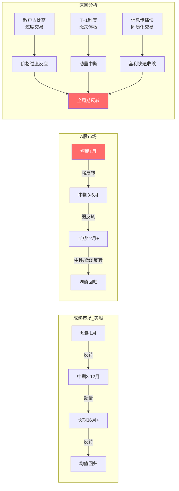

# A股技术面因子与量价特征

## 核心要点

> [!important] A股技术面因子三大核心特征
> 1. **短期反转 >> 动量**：A股全周期呈反转效应（Ret1M IC绝对值约8%），美股仅短期反转后转为动量——散户主导的过度反应是根本原因
> 2. **特质波动率异象显著**：高IVOL股票未来收益更低（每增加1% IVOL，预期收益减少约0.023），低波动率效应在A股比美股更强
> 3. **换手率是A股最强技术因子之一**：Rank IC约9.35%，远超美股同类因子，反映散户交易行为的可预测性

> [!summary] 与成熟市场的关键差异
> - A股技术面Alpha空间远大于美股（技术/流动性因子IC 5-10% vs 美股 1-3%）
> - A股年化换手率超1900%（美股200-400%），流动性因子解释力更强
> - A股波动率约30%（美股约20%），波动率因子区分度更高
> - 涨跌停板+T+1制度抑制动量延续，强化短期反转

---

## 一、动量因子（Momentum Factor）

### 1.1 定义与分类

动量因子基于"过去表现好的股票未来继续表现好"的假设。按时间窗口和方法论分为：

| 类型 | 定义 | 公式 | A股表现 |
|------|------|------|---------|
| **1月动量** | 过去1个月累计收益 | $R_{t-21:t}$ | **强反转**，IC约-8% |
| **3月动量** | 过去3个月累计收益 | $R_{t-63:t}$ | 反转，IC约-4% |
| **6月动量** | 过去6个月累计收益 | $R_{t-126:t}$ | 弱反转，IC约-2% |
| **12月动量** | 过去12个月累计收益 | $R_{t-252:t}$ | 微弱反转/中性 |
| **截面动量** | 股票间过去回报排序（赢家-输家） | $R_i - \bar{R}_{cross}$ | 盈利但不稳定 |
| **时序动量** | 个股自身历史回报信号 | $\text{sign}(R_{t-k:t})$ | 趋势阶段有效 |

### 1.2 截面动量 vs 时序动量

```
截面动量（Cross-Sectional Momentum）
- 逻辑：比较同一时刻不同股票的相对强弱
- 构建：按过去K期收益排序，做多Top组、做空Bottom组
- A股表现：2000-2020正收益显著，截面更稳健
- 风险：回撤较小，因对冲了市场beta

时序动量（Time-Series Momentum）
- 逻辑：个股自身历史回报为正则做多，为负则做空
- 构建：sign(R_{t-k:t}) × 持仓权重
- A股表现：趋势阶段超额显著（如2025年6-8月超额达15%）
- 风险：趋势反转时回撤大（>50%）
```

### 1.3 A股的反转效应——短期反转强于动量的实证

> [!warning] A股动量因子失效的核心逻辑
> A股在1月/3月/6月/12月窗口均呈**反转效应**，与美股"短期反转+中期动量+长期反转"的经典模式截然不同。

**实证数据对比（2005-2023）：**

| 维度 | A股 | 美股 |
|------|-----|------|
| 1月窗口 | 强反转（Ret1M IC = -8.13%） | 弱反转（IC = -0.02%） |
| 3-6月窗口 | 持续反转 | 显著正动量 |
| 12月窗口 | 微弱反转 | 正动量 |
| Alpha空间 | 技术因子IC 5-10% | 技术因子IC 1-3% |
| 主导因子 | 换手率/反转/流动性 | 基本面/估值 |

**行业层面差异（2001-2024申万一级行业）：**
- 动量类行业（传媒、电子）：α动量回望80周有效
- 反转类行业（有色金属、汽车）：长期动量（200周）主导
- 二者均无明显短期反转，与个股层面不同

### 1.4 动量因子Python实现

```python
import pandas as pd
import numpy as np

def calc_momentum_factors(df: pd.DataFrame, price_col: str = 'close') -> pd.DataFrame:
    """
    计算多周期动量/反转因子

    Parameters
    ----------
    df : DataFrame with columns ['trade_date', 'stock_code', 'close']
    price_col : 价格列名

    Returns
    -------
    DataFrame with momentum factors
    """
    df = df.sort_values(['stock_code', 'trade_date'])

    # 各周期动量（实际为反转因子，A股取负号使用）
    for window, name in [(21, 'mom_1m'), (63, 'mom_3m'),
                          (126, 'mom_6m'), (252, 'mom_12m')]:
        df[name] = df.groupby('stock_code')[price_col].pct_change(window)

    # 跳过最近1个月的动量（剥离短期反转）
    df['mom_12m_skip1m'] = (
        df.groupby('stock_code')[price_col].pct_change(252) -
        df.groupby('stock_code')[price_col].pct_change(21)
    )

    # 截面动量：当期收益减去截面均值
    df['mom_cs'] = df.groupby('trade_date')['mom_6m'].transform(
        lambda x: (x - x.mean()) / x.std()
    )

    # 时序动量：个股自身历史信号
    df['mom_ts'] = np.sign(df['mom_6m'])

    return df


def calc_reversal_factor(df: pd.DataFrame, window: int = 21) -> pd.DataFrame:
    """
    短期反转因子（A股最有效的技术因子之一）
    取负的短期收益率，过去涨得多的未来跌
    """
    df = df.sort_values(['stock_code', 'trade_date'])
    df['reversal'] = -df.groupby('stock_code')['close'].pct_change(window)
    return df
```

---

## 二、波动率因子（Volatility Factor）

### 2.1 四类波动率因子

#### （1）历史波动率（Historical Volatility）

$$\sigma_{HV} = \sqrt{\frac{252}{N-1} \sum_{i=1}^{N} (r_i - \bar{r})^2}$$

- 最简单的波动率度量，N通常取20/60/120日
- A股平均年化波动率约30%，美股约20%

#### （2）GARCH波动率

$$\sigma_t^2 = \omega + \alpha \cdot \epsilon_{t-1}^2 + \beta \cdot \sigma_{t-1}^2$$

- 捕捉波动聚类效应（volatility clustering）
- 典型参数：α ≈ 0.05-0.10，β ≈ 0.85-0.98
- α + β ≈ 1 表示高持久性

#### （3）已实现波动率（Realized Volatility）

$$RV_t = \sqrt{\sum_{i=1}^{M} r_{t,i}^2}$$

- 基于日内高频数据（M为日内收益率采样次数）
- 比历史波动率更精确，但需要分钟级数据
- 可分解为连续波动和跳跃波动

#### （4）特质波动率（Idiosyncratic Volatility, IVOL）

$$r_{i,t} = \alpha_i + \beta_i \cdot r_{m,t} + \gamma_i \cdot SMB_t + \delta_i \cdot HML_t + \epsilon_{i,t}$$
$$IVOL_i = \text{Std}(\epsilon_{i,t})$$

- 通过Fama-French三因子模型回归得到残差的标准差
- 衡量个股非系统性风险

### 2.2 特质波动率异象（IVOL Anomaly）

> [!important] A股IVOL异象
> 高IVOL股票未来收益显著更低，低IVOL股票收益更高。每增加1% IVOL，预期收益减少约0.023。低IVOL多空组合年化超额约5%，夏普比率 > 2.0。

**成因分析：**

| 假说 | 机制 | A股证据 |
|------|------|---------|
| 博彩偏好（Lottery Preference） | 散户偏好高波动"彩票股"，导致高IVOL被高估 | A股散户占比高，效应更强 |
| 异质信念（Heterogeneous Beliefs） | 高IVOL伴随高分歧，卖空限制下悲观者退出 | 换手率与IVOL相关系数约0.8 |
| 模糊性（Ambiguity） | IVOL时变性反映信息不确定性 | 高模糊股票系统性高估 |
| 分析师覆盖 | 无分析师覆盖的高IVOL股效应更强 | 显著解释异象 |

### 2.3 波动率因子Python实现

```python
import numpy as np
import pandas as pd
from arch import arch_model

def calc_volatility_factors(df: pd.DataFrame) -> pd.DataFrame:
    """
    计算多种波动率因子
    df: DataFrame with ['trade_date', 'stock_code', 'close', 'high', 'low']
    """
    df = df.sort_values(['stock_code', 'trade_date'])
    df['ret'] = df.groupby('stock_code')['close'].pct_change()

    # 1. 历史波动率（20日/60日）
    df['vol_20d'] = df.groupby('stock_code')['ret'].transform(
        lambda x: x.rolling(20).std() * np.sqrt(252)
    )
    df['vol_60d'] = df.groupby('stock_code')['ret'].transform(
        lambda x: x.rolling(60).std() * np.sqrt(252)
    )

    # 2. 已实现波动率（日频近似，用收益率平方和）
    df['rv_5d'] = df.groupby('stock_code')['ret'].transform(
        lambda x: x.rolling(5).apply(lambda y: np.sqrt(np.sum(y**2)))
    )
    df['rv_20d'] = df.groupby('stock_code')['ret'].transform(
        lambda x: x.rolling(20).apply(lambda y: np.sqrt(np.sum(y**2)))
    )

    # 3. Parkinson波动率（利用最高最低价）
    df['vol_parkinson'] = df.groupby('stock_code').apply(
        lambda g: np.sqrt(
            (1 / (4 * np.log(2))) *
            (np.log(g['high'] / g['low'])**2).rolling(20).mean() * 252
        )
    ).reset_index(level=0, drop=True)

    return df


def calc_ivol(stock_ret: pd.Series, market_ret: pd.Series,
              smb: pd.Series, hml: pd.Series, window: int = 60) -> pd.Series:
    """
    计算特质波动率（基于Fama-French三因子模型残差）

    Parameters
    ----------
    stock_ret : 个股收益率序列
    market_ret : 市场收益率序列
    smb : 规模因子收益
    hml : 价值因子收益
    window : 滚动窗口

    Returns
    -------
    IVOL序列
    """
    from statsmodels.regression.rolling import RollingOLS
    import statsmodels.api as sm

    X = pd.DataFrame({
        'mkt': market_ret, 'smb': smb, 'hml': hml
    })
    X = sm.add_constant(X)

    model = RollingOLS(stock_ret, X, window=window)
    result = model.fit()
    residuals = stock_ret - (result.params * X).sum(axis=1)
    ivol = residuals.rolling(window).std() * np.sqrt(252)

    return ivol


def calc_garch_vol(returns: pd.Series, p: int = 1, q: int = 1) -> pd.Series:
    """
    GARCH(p,q)条件波动率
    """
    scaled_returns = returns * 100  # arch库需要百分比收益率
    model = arch_model(scaled_returns.dropna(), mean='Zero', vol='GARCH', p=p, q=q)
    res = model.fit(disp='off')
    cond_vol = res.conditional_volatility / 100  # 转回小数
    return cond_vol
```

---

## 三、流动性因子（Liquidity Factor）

### 3.1 Amihud非流动性指标（ILLIQ）

$$ILLIQ_{i,t} = \frac{1}{D} \sum_{d=1}^{D} \frac{|r_{i,d}|}{DVOL_{i,d}}$$

- $|r_{i,d}|$：日绝对收益率
- $DVOL_{i,d}$：日成交金额（元）
- $D$：月内交易日数
- ILLIQ越高，流动性越差，预期收益补偿越高（流动性溢价）

**A股实证**：Amihud指标是最优低频流动性代理，与价差/价格冲击相关性最高。

### 3.2 换手率因子（Turnover）

$$TR_{i,t} = \frac{1}{D} \sum_{d=1}^{D} \frac{Volume_{i,d}}{Shares\_Outstanding_i}$$

- A股最强技术面因子之一，Rank IC约9.35%
- 高换手率 → 低未来收益（负相关）
- 机制：过度交易反映散户非理性，价格偏离后回归

### 3.3 其他流动性指标

| 指标 | 公式 | 特点 |
|------|------|------|
| **日均成交额** | $\bar{V} = \frac{1}{D}\sum DVOL_d$ | 绝对流动性，与市值高度相关 |
| **买卖价差** | $Spread = \frac{Ask - Bid}{Mid}$ | 直接度量交易成本，需高频数据 |
| **收盘价差** | 近似价差 | 低频替代，表现好 |
| **零收益天数比** | $\frac{\#(r=0)}{D}$ | 简单有效，适用于小盘股 |

### 3.4 流动性因子Python实现

```python
import pandas as pd
import numpy as np

def calc_liquidity_factors(df: pd.DataFrame) -> pd.DataFrame:
    """
    计算流动性因子
    df: DataFrame with ['trade_date', 'stock_code', 'close', 'volume',
                         'amount', 'total_shares']
    """
    df = df.sort_values(['stock_code', 'trade_date'])
    df['abs_ret'] = df.groupby('stock_code')['close'].pct_change().abs()

    # 1. Amihud ILLIQ（20日）
    df['illiq_ratio'] = df['abs_ret'] / (df['amount'] + 1e-10)
    df['amihud_20d'] = df.groupby('stock_code')['illiq_ratio'].transform(
        lambda x: x.rolling(20).mean()
    )
    # 对数化处理（原始值偏度极大）
    df['amihud_20d_log'] = np.log(df['amihud_20d'] + 1e-12)

    # 2. 换手率（20日均值）
    df['turnover'] = df['volume'] / df['total_shares']
    df['turnover_20d'] = df.groupby('stock_code')['turnover'].transform(
        lambda x: x.rolling(20).mean()
    )

    # 3. 日均成交额（对数）
    df['ln_amount_20d'] = df.groupby('stock_code')['amount'].transform(
        lambda x: np.log(x.rolling(20).mean() + 1)
    )

    # 4. 零收益天数比（20日窗口）
    df['ret'] = df.groupby('stock_code')['close'].pct_change()
    df['zero_ret_pct'] = df.groupby('stock_code')['ret'].transform(
        lambda x: x.rolling(20).apply(lambda y: (y.abs() < 1e-8).sum() / len(y))
    )

    return df
```

---

## 四、量价背离因子（Price-Volume Divergence）

### 4.1 核心逻辑

量价背离衡量价格走势与成交量配合程度。经典技术分析认为"价升量增"为健康趋势，"价升量缩"（背离）预示趋势减弱和反转。

### 4.2 构建方法

#### （1）标准量价相关系数

$$PV\_Corr_{i,t} = -\text{Corr}(VWAP_{t-d:t},\ Volume_{t-d:t})$$

- 取负号使得背离程度越高因子值越大
- 窗口期d通常取10-20日
- 负相关表示量价背离（上涨乏力）

#### （2）分钟级量价背离（华西证券方法）

| 因子 | Rank IC | 年化多空收益 |
|------|---------|-------------|
| 量价相关系数 | 4.66% | 28.62% |
| 振幅量价背离 | 4.10% | 19.66% |
| 成交金额波动 | 5.61% | 32.37% |

#### （3）高频快照量价相关

一周内快照价量相关系数（CorrPV），IC均值 > 3%，日内背离预示次日正收益。

### 4.3 量价背离因子Python实现

```python
import pandas as pd
import numpy as np

def calc_pv_divergence(df: pd.DataFrame, windows: list = [10, 20]) -> pd.DataFrame:
    """
    计算量价背离因子
    df: DataFrame with ['trade_date', 'stock_code', 'close', 'volume', 'amount']
    """
    df = df.sort_values(['stock_code', 'trade_date'])

    # VWAP
    df['vwap'] = df['amount'] / (df['volume'] + 1e-10)

    for w in windows:
        # 量价相关系数（取负值，背离越大因子值越大）
        df[f'pv_corr_{w}d'] = df.groupby('stock_code').apply(
            lambda g: -g['vwap'].rolling(w).corr(g['volume'])
        ).reset_index(level=0, drop=True)

        # 量价rank相关（更稳健）
        df[f'pv_rank_corr_{w}d'] = df.groupby('stock_code').apply(
            lambda g: -g['vwap'].rolling(w).apply(
                lambda x: pd.Series(x).rank().corr(
                    pd.Series(range(len(x))).rank()
                ), raw=False
            ).rolling(w).corr(
                g['volume'].rolling(w).apply(
                    lambda x: pd.Series(x).rank().corr(
                        pd.Series(range(len(x))).rank()
                    ), raw=False
                )
            )
        ).reset_index(level=0, drop=True)

    # 简化版：收盘价与成交量的Pearson相关
    for w in windows:
        df[f'pv_simple_{w}d'] = df.groupby('stock_code').apply(
            lambda g: -g['close'].rolling(w).corr(g['volume'])
        ).reset_index(level=0, drop=True)

    return df
```

---

## 五、资金流因子（Money Flow Factor）

### 5.1 主力净流入

$$MF_{net} = \sum_{j \in \text{大单}} Amount_j^{buy} - \sum_{j \in \text{大单}} Amount_j^{sell}$$

- 大单阈值：通常50-100万元以上单笔成交
- 主力净流入率：$MFR = MF_{net} / \sum Amount_{all}$
- 华泰证券实测因子收益率和t值较高

### 5.2 大单比率

$$BigOrder\_Ratio = \frac{\sum Amount_{\text{大单}}}{\sum Amount_{\text{全部}}}$$

- 大单占比越高，机构参与度越大
- 流出类为反向因子（值乘-1）

### 5.3 局限性与注意事项

> [!caution] 资金流因子的陷阱
> 1. **对敲伪造**：主力可通过对敲制造虚假大单信号
> 2. **冰山订单**：真正的机构资金常拆单成小单，避开大单统计
> 3. **IC排名中等**：单独使用效果一般，需与换手率/动量组合
> 4. **数据质量**：不同数据源对"大单"定义不一致

### 5.4 资金流因子Python实现

```python
import pandas as pd
import numpy as np

def calc_money_flow_factors(df: pd.DataFrame,
                             big_order_threshold: float = 500000) -> pd.DataFrame:
    """
    计算资金流因子（需要逐笔成交数据或Level-2数据）

    df: DataFrame with ['trade_date', 'stock_code', 'price', 'volume',
                         'amount', 'bs_flag', 'order_size']
    bs_flag: 'B'=买入, 'S'=卖出
    """
    df = df.sort_values(['stock_code', 'trade_date'])

    # 标记大单
    df['is_big'] = df['amount'] >= big_order_threshold

    # 主力净流入（日度）
    daily = df.groupby(['trade_date', 'stock_code']).apply(
        lambda g: pd.Series({
            'big_buy': g.loc[(g['bs_flag'] == 'B') & g['is_big'], 'amount'].sum(),
            'big_sell': g.loc[(g['bs_flag'] == 'S') & g['is_big'], 'amount'].sum(),
            'total_amount': g['amount'].sum(),
        })
    ).reset_index()

    daily['net_inflow'] = daily['big_buy'] - daily['big_sell']
    daily['net_inflow_rate'] = daily['net_inflow'] / (daily['total_amount'] + 1e-10)
    daily['big_order_ratio'] = (daily['big_buy'] + daily['big_sell']) / (daily['total_amount'] + 1e-10)

    # 滚动均值（5日/20日）
    for w in [5, 20]:
        daily[f'net_inflow_{w}d'] = daily.groupby('stock_code')['net_inflow_rate'].transform(
            lambda x: x.rolling(w).mean()
        )

    return daily


def calc_money_flow_from_daily(df: pd.DataFrame) -> pd.DataFrame:
    """
    基于日频数据的简化资金流因子（无需逐笔数据）
    利用主动买入/卖出估计

    df: DataFrame with ['trade_date', 'stock_code', 'close', 'open',
                         'high', 'low', 'volume', 'amount']
    """
    df = df.sort_values(['stock_code', 'trade_date'])

    # 典型价格
    df['tp'] = (df['high'] + df['low'] + df['close']) / 3

    # 资金流量 = 典型价格 × 成交量
    df['mf'] = df['tp'] * df['volume']

    # 正/负资金流（收盘>开盘为正）
    df['pos_mf'] = np.where(df['close'] > df['open'], df['mf'], 0)
    df['neg_mf'] = np.where(df['close'] <= df['open'], df['mf'], 0)

    # MFI（资金流指数，类RSI）
    for w in [14, 20]:
        pos_sum = df.groupby('stock_code')['pos_mf'].transform(lambda x: x.rolling(w).sum())
        neg_sum = df.groupby('stock_code')['neg_mf'].transform(lambda x: x.rolling(w).sum())
        df[f'mfi_{w}d'] = 100 - 100 / (1 + pos_sum / (neg_sum + 1e-10))

    return df
```

---

## 六、日内模式因子（Intraday Pattern Factor）

### 6.1 隔夜收益因子（Overnight Return）

$$R_{overnight} = \frac{Open_t}{Close_{t-1}} - 1$$

- 反映隔夜信息（政策、外盘、公告）对开盘的影响
- 高隔夜收益股票常显示动量延续
- A股集合竞价机制使隔夜收益包含更多信息

### 6.2 开盘半小时动量

$$R_{open30} = \frac{Close_{30min}}{Open} - 1$$

- 捕捉开盘缺口跳空和首笔交易异常
- 五分钟交易量分布因子：$FVD = \frac{1}{5}\sum_{i=1}^{5} \frac{V_i}{\sum V_j}$
- 开盘半小时成交占全日比重越高，信息含量越大

### 6.3 尾盘效应

$$TailRatio = \frac{Volume_{14:30-15:00}}{Volume_{13:00-14:30}}$$

- 尾盘放量常与机构调仓、指数跟踪相关
- 尾盘涨幅与次日开盘正相关
- 可结合收盘集合竞价构建因子（参见 [[A股交易制度全解析]]）

### 6.4 日内模式因子Python实现

```python
import pandas as pd
import numpy as np

def calc_intraday_factors(daily_df: pd.DataFrame) -> pd.DataFrame:
    """
    基于日频数据计算日内模式因子
    daily_df: ['trade_date', 'stock_code', 'open', 'close', 'high', 'low',
               'pre_close', 'volume']
    """
    df = daily_df.sort_values(['stock_code', 'trade_date']).copy()

    # 1. 隔夜收益
    df['overnight_ret'] = df['open'] / df['pre_close'] - 1

    # 2. 日内收益（开盘到收盘）
    df['intraday_ret'] = df['close'] / df['open'] - 1

    # 3. 隔夜收益均值（20日）—— 捕捉持续隔夜溢价
    df['overnight_ret_20d'] = df.groupby('stock_code')['overnight_ret'].transform(
        lambda x: x.rolling(20).mean()
    )

    # 4. 上影线比率（卖压指标）
    df['upper_shadow'] = (df['high'] - np.maximum(df['open'], df['close'])) / (df['high'] - df['low'] + 1e-10)

    # 5. 下影线比率（买盘支撑）
    df['lower_shadow'] = (np.minimum(df['open'], df['close']) - df['low']) / (df['high'] - df['low'] + 1e-10)

    # 6. 隔夜-日内收益差（信息非对称性）
    df['on_id_spread'] = df['overnight_ret'] - df['intraday_ret']
    df['on_id_spread_20d'] = df.groupby('stock_code')['on_id_spread'].transform(
        lambda x: x.rolling(20).mean()
    )

    return df


def calc_intraday_factors_minute(minute_df: pd.DataFrame) -> pd.DataFrame:
    """
    基于分钟频数据计算精细日内因子
    minute_df: ['datetime', 'stock_code', 'close', 'volume', 'amount']
               datetime格式: YYYY-MM-DD HH:MM:SS
    """
    df = minute_df.copy()
    df['date'] = pd.to_datetime(df['datetime']).dt.date
    df['time'] = pd.to_datetime(df['datetime']).dt.time

    from datetime import time

    daily_factors = []
    for (date, stock), group in df.groupby(['date', 'stock_code']):
        g = group.sort_values('datetime')
        total_vol = g['volume'].sum()

        # 开盘半小时成交量占比
        morning_30 = g[g['time'] <= time(9, 59)]
        open_30_vol_ratio = morning_30['volume'].sum() / (total_vol + 1e-10)

        # 开盘半小时动量
        if len(morning_30) > 0:
            open_30_mom = morning_30['close'].iloc[-1] / g['close'].iloc[0] - 1
        else:
            open_30_mom = np.nan

        # 尾盘半小时成交量占比
        tail_30 = g[g['time'] >= time(14, 30)]
        tail_vol_ratio = tail_30['volume'].sum() / (total_vol + 1e-10)

        # 上午/下午成交量比
        am = g[g['time'] < time(11, 30)]
        pm = g[g['time'] >= time(13, 0)]
        am_pm_ratio = am['volume'].sum() / (pm['volume'].sum() + 1e-10)

        daily_factors.append({
            'trade_date': date,
            'stock_code': stock,
            'open_30_vol_ratio': open_30_vol_ratio,
            'open_30_mom': open_30_mom,
            'tail_vol_ratio': tail_vol_ratio,
            'am_pm_ratio': am_pm_ratio,
        })

    return pd.DataFrame(daily_factors)
```

---

## 七、因子有效性排行榜（A股实证）

> [!note] 数据基于多家券商研报综合整理（2015-2024样本期）

| 排名 | 因子名称 | Rank IC均值 | ICIR | 方向 | 衰减半衰期 | 适用域 |
|------|----------|-------------|------|------|-----------|--------|
| 1 | 换手率（20日） | -9.35% | -3.2 | 负向 | 20-40日 | 全A |
| 2 | 短期反转（1月） | -8.13% | -2.8 | 负向 | 10-20日 | 全A |
| 3 | 特质波动率（IVOL） | -6.5% | -2.5 | 负向 | 30-60日 | 全A |
| 4 | 成交金额波动 | -5.61% | -2.2 | 负向 | 5-15日 | 中高频 |
| 5 | 量价相关系数（20日） | -4.66% | -1.8 | 负向 | 10-20日 | 全A |
| 6 | Amihud非流动性 | +4.2% | +1.6 | 正向 | 40-60日 | 去微盘 |
| 7 | 3月反转 | -4.0% | -1.5 | 负向 | 20-40日 | 全A |
| 8 | 历史波动率（60日） | -3.8% | -1.4 | 负向 | 30-60日 | 全A |
| 9 | 隔夜收益（20日均） | +3.2% | +1.2 | 正向 | 5-10日 | 中高频 |
| 10 | 主力净流入率 | +2.8% | +1.0 | 正向 | 3-10日 | 中高频 |

**关键观察：**
- 前5名因子均为**负向因子**——A股技术面Alpha的核心是"做空过度交易/过度波动"
- 换手率和短期反转高度相关（散户过度交易 → 价格过度反应 → 反转）
- 衰减半衰期与调仓频率匹配：短期因子（<20日）适合周度调仓，中期因子适合月度

---

## 八、参数速查表

### 8.1 因子计算参数

| 因子 | 推荐窗口 | 数据频率 | 去极值方法 | 中性化 |
|------|---------|---------|-----------|--------|
| 短期反转 | 20日 | 日频 | MAD 5倍 | 行业+市值 |
| 中期反转 | 60日 | 日频 | MAD 5倍 | 行业+市值 |
| 历史波动率 | 20/60日 | 日频 | Winsorize 1%/99% | 市值 |
| IVOL | 60日FF3残差 | 日频 | Winsorize 1%/99% | 行业+市值 |
| GARCH波动率 | GARCH(1,1) | 日频 | 截断 | 市值 |
| 换手率 | 20日均值 | 日频 | 对数化 | 市值 |
| Amihud ILLIQ | 20日 | 日频 | 对数化+Winsorize | 市值 |
| 量价相关 | 10/20日 | 日频/分钟 | MAD 5倍 | 行业+市值 |
| 主力净流入 | 5/20日 | 日频 | MAD 5倍 | 行业+市值+换手率 |
| 隔夜收益 | 20日均值 | 日频 | Winsorize 1%/99% | 市值 |

### 8.2 因子组合推荐权重

| 组合方案 | 换手率 | 反转 | IVOL | 量价背离 | 流动性 | 资金流 |
|---------|--------|------|------|---------|--------|--------|
| 保守型 | 30% | 25% | 20% | 10% | 10% | 5% |
| 均衡型 | 25% | 20% | 20% | 15% | 10% | 10% |
| 高频型 | 15% | 15% | 10% | 25% | 10% | 25% |

---

## 九、因子分类体系

```mermaid
graph TD
    A[A股技术面因子] --> B[动量/反转类]
    A --> C[波动率类]
    A --> D[流动性类]
    A --> E[量价关系类]
    A --> F[日内模式类]

    B --> B1[1月反转 ★★★★★]
    B --> B2[3月反转 ★★★]
    B --> B3[6月/12月动量 ★★]
    B --> B4[截面动量]
    B --> B5[时序动量]

    C --> C1[历史波动率 ★★★]
    C --> C2[GARCH波动率 ★★★]
    C --> C3[已实现波动率 ★★★]
    C --> C4[特质波动率IVOL ★★★★]

    D --> D1[换手率 ★★★★★]
    D --> D2[Amihud ILLIQ ★★★★]
    D --> D3[成交额]
    D --> D4[买卖价差]

    E --> E1[量价相关系数 ★★★★]
    E --> E2[成交金额波动 ★★★★]
    E --> E3[资金流因子 ★★★]

    F --> F1[隔夜收益 ★★★]
    F --> F2[开盘半小时动量 ★★★]
    F --> F3[尾盘效应 ★★]

    style B1 fill:#ff6b6b,color:#fff
    style D1 fill:#ff6b6b,color:#fff
    style C4 fill:#ffa94d,color:#fff
    style E1 fill:#ffa94d,color:#fff
```



## 十、动量-反转转换机制



---

## 十一、综合因子库代码

```python
"""
A股技术面因子综合计算库
============================================
覆盖：动量/反转、波动率、流动性、量价背离、资金流、日内模式
依赖：pandas, numpy, statsmodels, arch
"""

import pandas as pd
import numpy as np
import warnings
warnings.filterwarnings('ignore')


class AShareTechFactors:
    """A股技术面因子计算器"""

    def __init__(self, df: pd.DataFrame):
        """
        Parameters
        ----------
        df : DataFrame
            必须包含列: ['trade_date', 'stock_code', 'open', 'high', 'low',
                         'close', 'pre_close', 'volume', 'amount', 'total_shares']
        """
        self.df = df.sort_values(['stock_code', 'trade_date']).copy()
        self.df['ret'] = self.df.groupby('stock_code')['close'].pct_change()
        self.df['abs_ret'] = self.df['ret'].abs()
        self.df['turnover'] = self.df['volume'] / self.df['total_shares']
        self.df['vwap'] = self.df['amount'] / (self.df['volume'] + 1e-10)

    # ========== 动量/反转因子 ==========
    def momentum(self, windows: list = [21, 63, 126, 252]) -> pd.DataFrame:
        """多周期动量/反转因子"""
        for w in windows:
            self.df[f'mom_{w}d'] = self.df.groupby('stock_code')['close'].pct_change(w)
        # 12月跳1月动量
        self.df['mom_12m_skip1m'] = (
            self.df.groupby('stock_code')['close'].pct_change(252) -
            self.df.groupby('stock_code')['close'].pct_change(21)
        )
        return self.df

    def reversal(self, window: int = 21) -> pd.DataFrame:
        """短期反转因子（取负的短期收益）"""
        self.df[f'reversal_{window}d'] = -self.df.groupby('stock_code')['close'].pct_change(window)
        return self.df

    # ========== 波动率因子 ==========
    def historical_volatility(self, windows: list = [20, 60]) -> pd.DataFrame:
        """历史波动率"""
        for w in windows:
            self.df[f'vol_{w}d'] = self.df.groupby('stock_code')['ret'].transform(
                lambda x: x.rolling(w).std() * np.sqrt(252)
            )
        return self.df

    def realized_volatility(self, windows: list = [5, 20]) -> pd.DataFrame:
        """已实现波动率"""
        for w in windows:
            self.df[f'rv_{w}d'] = self.df.groupby('stock_code')['ret'].transform(
                lambda x: x.rolling(w).apply(lambda y: np.sqrt(np.sum(y**2)))
            )
        return self.df

    def parkinson_volatility(self, window: int = 20) -> pd.DataFrame:
        """Parkinson波动率（基于最高最低价）"""
        hl = np.log(self.df['high'] / self.df['low'])
        self.df[f'vol_pk_{window}d'] = self.df.groupby('stock_code').apply(
            lambda g: np.sqrt(
                (1 / (4 * np.log(2))) *
                (np.log(g['high'] / g['low'])**2).rolling(window).mean() * 252
            )
        ).reset_index(level=0, drop=True)
        return self.df

    # ========== 流动性因子 ==========
    def amihud_illiquidity(self, window: int = 20) -> pd.DataFrame:
        """Amihud非流动性指标"""
        self.df['illiq_ratio'] = self.df['abs_ret'] / (self.df['amount'] + 1e-10)
        self.df[f'amihud_{window}d'] = self.df.groupby('stock_code')['illiq_ratio'].transform(
            lambda x: x.rolling(window).mean()
        )
        self.df[f'amihud_{window}d_log'] = np.log(self.df[f'amihud_{window}d'] + 1e-12)
        return self.df

    def turnover_factor(self, windows: list = [5, 20, 60]) -> pd.DataFrame:
        """换手率因子"""
        for w in windows:
            self.df[f'turnover_{w}d'] = self.df.groupby('stock_code')['turnover'].transform(
                lambda x: x.rolling(w).mean()
            )
            self.df[f'ln_turnover_{w}d'] = np.log(self.df[f'turnover_{w}d'] + 1e-10)
        return self.df

    # ========== 量价背离因子 ==========
    def pv_corr(self, windows: list = [10, 20]) -> pd.DataFrame:
        """量价相关系数"""
        for w in windows:
            self.df[f'pv_corr_{w}d'] = self.df.groupby('stock_code').apply(
                lambda g: -g['vwap'].rolling(w).corr(g['volume'])
            ).reset_index(level=0, drop=True)
        return self.df

    # ========== 日内模式因子 ==========
    def overnight_return(self) -> pd.DataFrame:
        """隔夜收益因子"""
        self.df['overnight_ret'] = self.df['open'] / self.df['pre_close'] - 1
        self.df['intraday_ret'] = self.df['close'] / self.df['open'] - 1
        self.df['overnight_ret_20d'] = self.df.groupby('stock_code')['overnight_ret'].transform(
            lambda x: x.rolling(20).mean()
        )
        self.df['on_id_spread'] = self.df['overnight_ret'] - self.df['intraday_ret']
        return self.df

    # ========== 综合计算 ==========
    def compute_all(self) -> pd.DataFrame:
        """一键计算全部技术面因子"""
        self.momentum()
        self.reversal()
        self.historical_volatility()
        self.realized_volatility()
        self.amihud_illiquidity()
        self.turnover_factor()
        self.pv_corr()
        self.overnight_return()
        return self.df

    # ========== 因子预处理 ==========
    @staticmethod
    def winsorize(series: pd.Series, lower: float = 0.01, upper: float = 0.99) -> pd.Series:
        """Winsorize去极值"""
        lo = series.quantile(lower)
        hi = series.quantile(upper)
        return series.clip(lo, hi)

    @staticmethod
    def mad_filter(series: pd.Series, n: int = 5) -> pd.Series:
        """MAD去极值"""
        median = series.median()
        mad = (series - median).abs().median()
        lo = median - n * 1.4826 * mad
        hi = median + n * 1.4826 * mad
        return series.clip(lo, hi)

    @staticmethod
    def neutralize(factor: pd.Series, industry: pd.Series,
                   market_cap: pd.Series) -> pd.Series:
        """行业+市值中性化"""
        import statsmodels.api as sm

        ind_dummies = pd.get_dummies(industry, drop_first=True)
        X = pd.concat([np.log(market_cap), ind_dummies], axis=1)
        X = sm.add_constant(X)

        mask = factor.notna() & market_cap.notna()
        result = pd.Series(np.nan, index=factor.index)

        if mask.sum() > X.shape[1] + 1:
            model = sm.OLS(factor[mask], X[mask], missing='drop').fit()
            result[mask] = model.resid

        return result


# ========== 使用示例 ==========
if __name__ == '__main__':
    # 假设已有数据
    # import tushare as ts
    # pro = ts.pro_api('YOUR_TOKEN')
    # df = pro.daily(ts_code='000001.SZ', start_date='20200101', end_date='20241231')

    # factors = AShareTechFactors(df)
    # result = factors.compute_all()
    # print(result.columns.tolist())
    pass
```

---

## 十二、常见误区与实战经验

### 误区1：照搬美股动量策略到A股

> [!danger] 经典动量在A股失效
> **原因**：A股散户占比高（换手率是美股5-10倍），价格过度反应后快速反转。涨跌停板中断了动量延续，T+1制度限制了日内追涨杀跌的效率。
>
> **正确做法**：在A股使用**反转因子**替代动量，或仅在行业/因子层面使用动量。

### 误区2：忽视因子间的共线性

换手率、波动率、反转三者高度相关（相关系数0.5-0.8）。直接等权合成会导致：
- 因子暴露集中于"低交易活跃度"一个维度
- 看似多因子实则单因子

**解决方案**：正交化处理（施密特正交或回归残差），或PCA提取独立成分。

### 误区3：高估资金流因子的预测力

主力净流入数据存在严重的**信号失真**问题：
- 大机构拆单交易，真实大单不被统计
- 庄家对敲制造虚假资金流向
- 建议仅作辅助因子，权重不超过10%

### 误区4：忽略因子衰减

| 因子类别 | 衰减特征 | 调仓建议 |
|---------|---------|---------|
| 短期反转/日内模式 | 5-10日后IC降50% | 周度调仓 |
| 量价背离/换手率 | 20-30日半衰期 | 双周/月度 |
| 波动率/流动性 | 40-60日半衰期 | 月度调仓 |

### 误区5：未做市值中性化

A股小盘股天然具有高换手率、高波动率、高反转特征。若不做市值中性化，技术面因子本质上退化为**反向市值因子**。

---

## 相关笔记

- [[A股交易制度全解析]] — T+1、涨跌停板等制度对因子的影响
- [[A股市场微观结构深度研究]] — 市场微观结构与因子定价
- [[A股量化数据源全景图]] — 因子计算所需数据源
- [[A股量化交易平台深度对比]] — 因子回测平台选择
- [[A股指数体系与基准构建]] — 因子基准与行业分类
- [[量化数据工程实践]] — 数据清洗与因子预处理
- [[A股市场参与者结构与资金流分析]] — 散户结构与因子成因
- [[量化研究Python工具链搭建]] — 因子计算工具链
- [[A股衍生品市场与对冲工具]] — 因子对冲策略
- [[高频因子与日内数据挖掘]] — 日频因子的高频延伸：L2订单簿、逐笔成交与日内因子构建

---

## 来源参考

1. 清华大学五道口金融学院CFRC, "Factor Momentum in the Chinese Stock Market", 2000-2020实证
2. 华西证券金融工程专题, "分钟级量价背离因子构建与回测"
3. 湖南理工大学学报, "特质波动率异象与模糊性研究", 2020
4. 北京大学国家发展研究院, "低风险异象与投资者行为"
5. 东方证券金融工程研究, "A股vs美股因子有效性对比", 2024
6. 华泰证券, "资金流因子单因子测试报告", 2018
7. 国金证券Alpha掘金系列, "基于高频快照数据的量价背离选股因子"
8. 上海财经大学学报, "Amihud非流动性指标在中国市场的适用性研究"
9. 社科院金融评论, "中国股票市场短期反转与动量效应实证", 2020
10. S&P Global, "Examining Factor Strategies in China A-Share Market"
