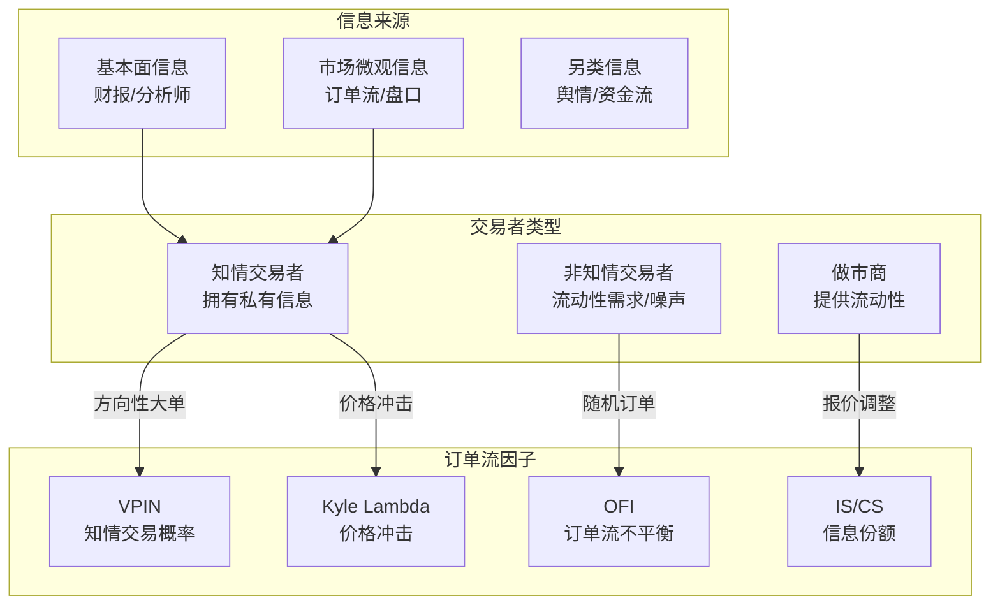

# 订单簿与订单流因子深度研究

> - 订单流因子的理论根基是**信息不对称**：知情交易者的订单模式可从订单簿中识别，为预测短期价格变动提供Alpha
> - **VPIN**（Volume-Synchronized PIN）是闪崩预警的核心指标，VPIN>0.8时未来1小时下跌概率显著升高
> - **OFI**（Order Flow Imbalance）是最实用的订单流因子，Rank IC 3-8%，多档加权版效果优于简单版
> - 订单流因子与传统因子相关性<0.3，可提供**独立增量Alpha**，但衰减极快（半衰期5-10日）
> - A股沪深L2数据差异是最大障碍——深交所逐笔全量发布，上交所部分发布，统一处理是前提

---

## 一、理论基础

### 1.1 微观结构模型对比

| 模型 | 核心思想 | 关键参数 | 适用场景 |
|------|---------|---------|---------|
| Kyle(1985) | 知情交易者最优交易策略：线性定价规则P=μ+λ·(x+u) | λ(价格冲击系数) | 冲击成本估计 |
| Glosten-Milgrom(1985) | 买卖价差反映逆向选择成本 | 知情交易概率μ | 价差建模 |
| PIN(Easley et al.1996) | 知情交易概率的极大似然估计 | PIN=αμ/(αμ+2ε) | 信息事件检测 |
| VPIN(Easley et al.2012) | 成交量同步的PIN近似 | 无需MLE估计 | 实时闪崩预警 |

### 1.2 信息不对称框架



---

## 二、VPIN因子

### 2.1 计算方法

VPIN将交易按**固定成交量桶**（而非固定时间）分组，避免时间采样偏差：

```python
import numpy as np
import pandas as pd

def calc_vpin(trades: pd.DataFrame, 
              bucket_volume: int,
              n_buckets: int = 50) -> pd.Series:
    """
    VPIN计算
    trades: columns=[timestamp, price, volume]
    bucket_volume: 每桶目标成交量（通常=日均成交量/50）
    n_buckets: 滚动窗口桶数
    """
    # 步骤1：BVC分类（Bulk Volume Classification）
    # 用价格变化方向近似买卖分类
    trades = trades.sort_values('timestamp')
    trades['price_change'] = trades['price'].diff()
    trades['sign'] = np.sign(trades['price_change'])
    trades['sign'] = trades['sign'].replace(0, np.nan).ffill().fillna(1)
    
    # BVC: 用正态CDF近似买方成交量占比
    from scipy.stats import norm
    sigma = trades['price_change'].rolling(20).std()
    z = trades['price_change'] / sigma.clip(lower=1e-8)
    trades['buy_pct'] = norm.cdf(z)
    trades['buy_volume'] = trades['volume'] * trades['buy_pct']
    trades['sell_volume'] = trades['volume'] * (1 - trades['buy_pct'])
    
    # 步骤2：按固定成交量分桶
    trades['cum_volume'] = trades['volume'].cumsum()
    trades['bucket_id'] = (trades['cum_volume'] / bucket_volume).astype(int)
    
    bucket_stats = trades.groupby('bucket_id').agg(
        buy_vol=('buy_volume', 'sum'),
        sell_vol=('sell_volume', 'sum'),
        total_vol=('volume', 'sum'),
        timestamp=('timestamp', 'last')
    )
    
    # 步骤3：计算VPIN
    bucket_stats['abs_imbalance'] = abs(
        bucket_stats['buy_vol'] - bucket_stats['sell_vol']
    )
    
    vpin = (bucket_stats['abs_imbalance']
            .rolling(n_buckets).mean() / bucket_volume)
    
    return vpin

# 使用示例
# bucket_volume = daily_volume / 50  # 日均成交量的1/50
# vpin = calc_vpin(trades, bucket_volume=100000, n_buckets=50)
```

### 2.2 VPIN阈值与应用

| VPIN区间 | 含义 | 策略动作 |
|---------|------|---------|
| <0.3 | 低毒性，信息对称 | 正常交易 |
| 0.3-0.5 | 中等毒性 | 提高警惕，收紧止损 |
| 0.5-0.8 | 高毒性，知情交易活跃 | 减仓，降低做市报价 |
| >0.8 | 极高毒性，闪崩预警 | 停止做市，清仓或对冲 |

---

## 三、Kyle Lambda因子

### 3.1 估计方法

Kyle Lambda (λ) 度量单位订单流对价格的冲击：ΔP = λ·ΔQ + ε

```python
from sklearn.linear_model import LinearRegression

def calc_kyle_lambda(trades: pd.DataFrame, 
                     window: int = 120,
                     freq: str = '5min') -> pd.Series:
    """
    Kyle Lambda估计
    trades: columns=[timestamp, price, volume, is_buy]
    window: 滚动窗口（天数）
    freq: 聚合频率
    """
    # 聚合到指定频率
    trades['signed_volume'] = np.where(
        trades['is_buy'], trades['volume'], -trades['volume'])
    
    agg = trades.resample(freq, on='timestamp').agg(
        price_change=('price', lambda x: x.iloc[-1] - x.iloc[0] 
                      if len(x) > 0 else 0),
        net_order_flow=('signed_volume', 'sum')
    ).dropna()
    
    # 滚动回归估计Lambda
    lambdas = []
    dates = agg.index
    
    for i in range(window, len(agg)):
        window_data = agg.iloc[i-window:i]
        X = window_data['net_order_flow'].values.reshape(-1, 1)
        y = window_data['price_change'].values
        
        reg = LinearRegression()
        reg.fit(X, y)
        lambdas.append({
            'timestamp': dates[i],
            'kyle_lambda': reg.coef_[0],
            'r_squared': reg.score(X, y)
        })
    
    return pd.DataFrame(lambdas).set_index('timestamp')
```

### 3.2 与Amihud的关系

- Kyle Lambda是理论最优的价格冲击度量（需高频数据）
- Amihud ILLIQ是Kyle Lambda的低频代理：ILLIQ ≈ λ/σ_u
- 两者相关性约0.6-0.8，但Kyle Lambda在中小盘区分度更高

---

## 四、OFI（Order Flow Imbalance）

### 4.1 多档位OFI

```python
def calc_ofi(snapshots: pd.DataFrame, 
             levels: int = 5,
             weight_scheme: str = 'volume') -> pd.Series:
    """
    多档位加权OFI
    snapshots: 包含bid_price1-10, bid_volume1-10, ask同理
    """
    ofi_total = pd.Series(0.0, index=snapshots.index)
    
    for i in range(1, levels + 1):
        bp = f'bid_price{i}'
        bv = f'bid_volume{i}'
        ap = f'ask_price{i}'
        av = f'ask_volume{i}'
        
        # 买方OFI
        bid_price_up = snapshots[bp] > snapshots[bp].shift(1)
        bid_price_same = snapshots[bp] == snapshots[bp].shift(1)
        bid_price_down = snapshots[bp] < snapshots[bp].shift(1)
        
        delta_bid = np.where(
            bid_price_up, snapshots[bv],
            np.where(bid_price_same, 
                     snapshots[bv] - snapshots[bv].shift(1),
                     -snapshots[bv].shift(1))
        )
        
        # 卖方OFI（方向相反）
        ask_price_up = snapshots[ap] > snapshots[ap].shift(1)
        ask_price_same = snapshots[ap] == snapshots[ap].shift(1)
        ask_price_down = snapshots[ap] < snapshots[ap].shift(1)
        
        delta_ask = np.where(
            ask_price_down, -snapshots[av],
            np.where(ask_price_same,
                     -(snapshots[av] - snapshots[av].shift(1)),
                     snapshots[av].shift(1))
        )
        
        # 档位权重
        if weight_scheme == 'volume':
            w = 1.0 / i  # 越近档位权重越高
        elif weight_scheme == 'equal':
            w = 1.0 / levels
        else:  # 金额加权
            w = (snapshots[bv] * snapshots[bp]).mean()
        
        ofi_total += w * (delta_bid + delta_ask)
    
    return ofi_total
```

### 4.2 OFI因子有效性

| 维度 | 数值 | 说明 |
|------|------|------|
| Rank IC | 3-8% | 大盘3-5%，中小盘5-8% |
| IC_IR | 0.3-0.6 | 中等水平 |
| 半衰期 | 5-10天 | 快速衰减 |
| 月换手率 | 50-100% | 较高 |
| 与动量相关性 | <0.2 | 独立Alpha |
| 与换手率相关性 | <0.3 | 较低 |

---

## 五、成交主动性因子

### 5.1 Lee-Ready分类

```python
def lee_ready_classify(trades: pd.DataFrame,
                       quotes: pd.DataFrame) -> pd.Series:
    """
    Lee-Ready算法：判断成交的主动买卖方向
    Step 1: Quote Rule - 比较成交价与中间价
    Step 2: Tick Rule - 对中间价成交用价格变化方向
    """
    # 合并最近报价
    merged = pd.merge_asof(
        trades.sort_values('timestamp'),
        quotes[['timestamp', 'bid1', 'ask1']].sort_values('timestamp'),
        on='timestamp', direction='backward'
    )
    
    mid = (merged['bid1'] + merged['ask1']) / 2
    
    # Quote Rule
    direction = np.where(
        merged['price'] > mid, 1,   # 主动买
        np.where(merged['price'] < mid, -1,  # 主动卖
                 0)  # 中间价，用Tick Rule
    )
    
    # Tick Rule for midpoint trades
    price_diff = merged['price'].diff()
    tick_dir = np.sign(price_diff).replace(0, np.nan).ffill().fillna(0)
    
    direction = np.where(direction == 0, tick_dir, direction)
    
    return pd.Series(direction, index=trades.index, name='trade_direction')
```

### 5.2 主买主卖比率因子

| 因子 | 计算 | Rank IC | 说明 |
|------|------|---------|------|
| 主买占比 | 主买成交量/总成交量 | 3-5% | 正向因子 |
| 净主买比率 | (主买-主卖)/总成交量 | 3-6% | 更有信息量 |
| 大单主买占比 | 大单主买量/总大单量 | 4-7% | 聚焦知情交易者 |

---

## 六、订单簿形状因子

### 6.1 因子定义

| 因子 | 公式 | 含义 | IC参考 |
|------|------|------|--------|
| 深度不对称 | (BidDepth-AskDepth)/(BidDepth+AskDepth) | 买卖力量对比 | 2-4% |
| 斜率(Slope) | ΔVolume/ΔPrice（买/卖侧） | 订单簿陡峭程度 | 2-4% |
| 凸度 | 中间档位量 vs 首尾档位量 | 订单簿形状 | 1-3% |
| 弹性 | 大单冲击后价格恢复速度 | 市场恢复力 | 3-5% |
| 挂撤比 | 新增委托量/撤单量 | 真实供需 vs 虚假挂单 | 2-4% |

---

## 七、因子有效性对比

| 因子 | Rank IC | IC_IR | 半衰期 | 月换手率 | 扣费后年化 | 数据需求 |
|------|---------|-------|--------|---------|-----------|---------|
| OFI(5档加权) | 3-8% | 0.3-0.6 | 5-10日 | 50-100% | 5-15% | 快照 |
| VPIN | 2-5% | 0.2-0.4 | 3-7日 | 80-150% | 3-8% | 逐笔成交 |
| Kyle Lambda | 2-4% | 0.2-0.4 | 10-20日 | 30-50% | 3-8% | 逐笔成交 |
| 净主买比率 | 3-6% | 0.3-0.5 | 5-10日 | 60-100% | 5-12% | 逐笔成交+报价 |
| 深度不对称 | 2-4% | 0.2-0.3 | 3-7日 | 80-120% | 2-6% | 快照 |
| 订单簿斜率 | 2-4% | 0.2-0.3 | 5-10日 | 50-80% | 3-7% | 快照 |
| PIN | 2-4% | 0.2-0.3 | 10-30日 | 20-40% | 2-6% | 逐笔成交 |

---

## 八、因子聚合与正交化

### 8.1 日频聚合方法

| 聚合方式 | IC稳定性 | 换手率 | 推荐 |
|---------|---------|--------|------|
| 日内均值 | 最高 | 最低 | ✅ 默认推荐 |
| 指数衰减加权(λ=0.9) | 高 | 中 | 强调尾盘信息 |
| 尾盘30分钟均值 | 中 | 高 | 捕捉收盘前信号 |
| 20日滚动平均 | 最高 | 最低 | 平衡IC与换手 |

### 8.2 与传统因子正交化

订单流因子与传统因子相关性低(<0.3)，但仍需正交化避免风格暴露：
- 对市值、换手率、波动率做截面回归
- 取残差作为纯订单流Alpha
- 正交化后IC通常下降10-20%但稳定性提升

---

## 九、参数速查表

| 参数 | 推荐值 | 说明 |
|------|--------|------|
| VPIN桶数量 | 50 | 日内50桶，每桶=日均成交量/50 |
| VPIN滚动窗口 | 50桶 | 约1个交易日 |
| VPIN预警阈值 | 0.8 | >0.8高毒性 |
| Kyle Lambda窗口 | 120天 | 需足够样本 |
| Kyle Lambda聚合频率 | 5分钟 | 太短噪声大，太长信息损失 |
| OFI档位数 | 5-10档 | 5档已捕获80%信息 |
| OFI权重方案 | 金额加权 | 优于等权和简单量加权 |
| Lee-Ready报价延迟 | 0秒(A股) | A股电子盘无需1秒延迟 |
| PIN初始值数量 | >100组 | MLE局部最优风险，需多初值 |

---

## 十、常见误区

| 误区 | 真相 |
|------|------|
| "订单流因子只适合高频" | OFI等因子聚合到日频后IC仍有3-8%，可用于日频/周频策略 |
| "VPIN可以精确预测闪崩" | VPIN是概率指标，>0.8时下跌概率升高但并非确定，假阳性率约40% |
| "Lee-Ready在A股直接可用" | 沪市TradeBSFlag已提供方向(B/S)无需Lee-Ready，深市需Lee-Ready |
| "PIN因子很容易计算" | PIN的MLE优化有严重的局部最优问题，需>100组随机初始值 |
| "订单簿深度越深流动性越好" | 深处挂单可能是策略性的（吸引/恐吓），真实流动性看成交后弹性 |
| "沪深订单流因子可以混算" | 沪市逐笔委托不含全额即时成交，深市全量发布，需分别计算再合并 |

---

## 十一、相关笔记

- [[高频因子与日内数据挖掘]] — L2六大日内因子(OIR/VWAP偏离/PIN/大单/集竞/尾盘)
- [[A股市场微观结构深度研究]] — 撮合机制、订单类型、Tick数据结构
- [[因子评估方法论]] — IC/ICIR/分层回测/Fama-MacBeth回归
- [[A股技术面因子与量价特征]] — 换手率/Amihud等低频流动性因子
- [[多因子模型构建实战]] — 因子正交化、合成方法
- [[A股量化数据源全景图]] — L2数据获取渠道
- [[量化数据工程实践]] — 数据清洗与存储
- [[A股交易制度全解析]] — 沪深交易所制度差异

---

## 来源参考

1. Easley, D., Lopez de Prado, M., & O'Hara, M. (2012). "Flow Toxicity and Liquidity in a High-frequency World" — VPIN模型
2. Kyle, A. (1985). "Continuous Auctions and Insider Trading" — Kyle Lambda理论
3. Easley, D., Kiefer, N., O'Hara, M., & Paperman, J. (1996). "Liquidity, Information, and Infrequently Traded Stocks" — PIN模型
4. Lee, C. & Ready, M. (1991). "Inferring Trade Direction from Intraday Data" — Lee-Ready分类算法
5. Hasbrouck, J. (1995). "One Security, Many Markets: Determining the Contributions to Price Discovery" — IS信息份额
6. 华泰证券《高频因子深度研究系列》 — A股订单流因子实证
7. 中信证券《订单簿微观结构因子》 — OFI、深度不对称因子构建
