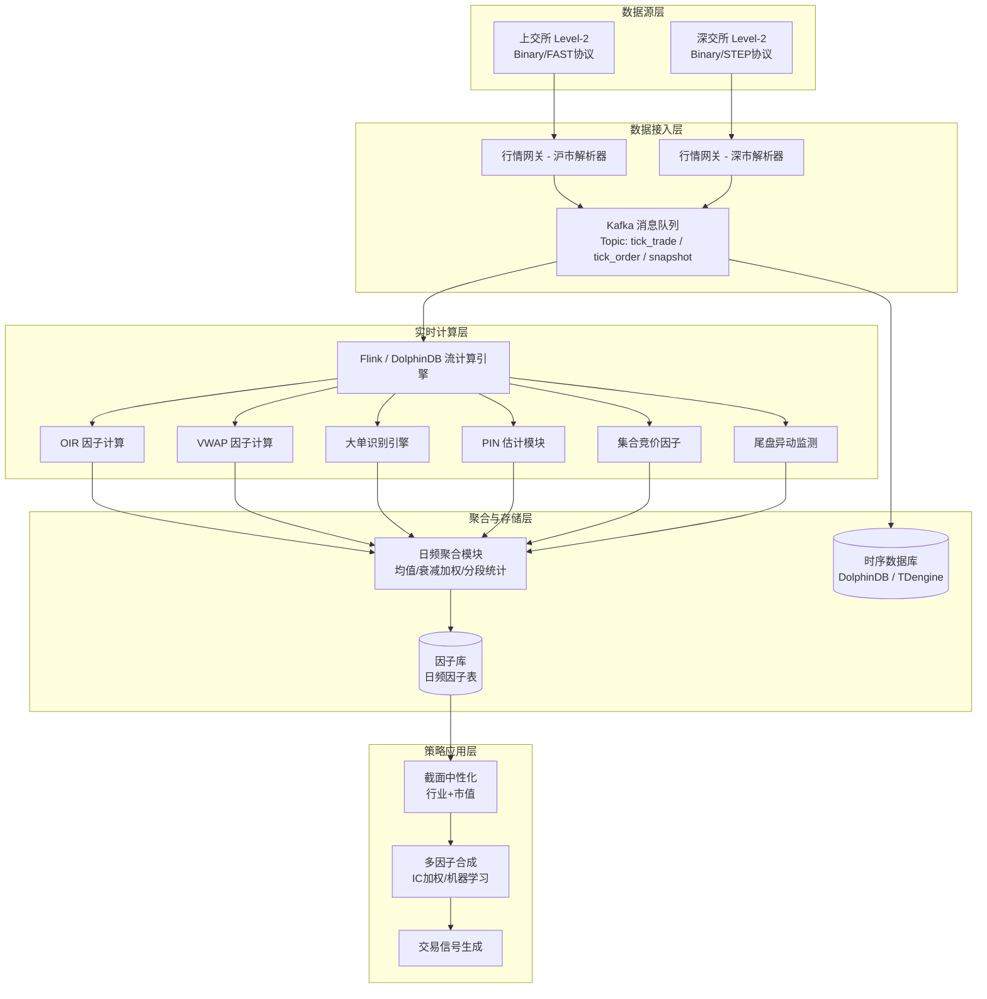
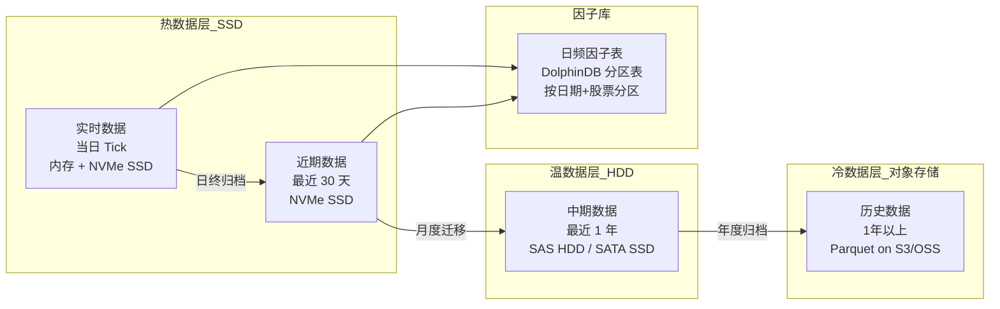

# 高频因子与日内数据挖掘

## 核心要点

- **Level-2 数据**是A股高频因子研究的基石，包含十档盘口快照（3秒）、逐笔成交（毫秒级）、逐笔委托（毫秒级）三大类，沪深交易所字段定义存在差异
- **日内因子**能捕捉传统日频因子无法观测的订单流信息不对称，典型因子包括订单不平衡(OIR)、VWAP偏离、知情交易概率(PIN)、大单净买入、集合竞价因子、尾盘异动因子
- 高频因子的**低拥挤度**是其核心优势——数据获取门槛高、计算复杂度大，天然过滤了大部分竞争者
- 全市场 Tick 数据日均 **1-2 TB**（未压缩），年存储量 PB 级，存储方案选择直接决定研究效率
- 高频因子到日频信号的聚合方法（均值、衰减加权、分段统计）对最终 IC 影响显著，需逐因子回测筛选
- 时序数据库选型中，**DolphinDB** 在金融高频计算场景综合表现最优，**TDengine** 在写入吞吐与压缩率上领先

> [!tip] 与日频因子的本质区别
> 日频因子使用 OHLCV 等聚合后数据，信息已被大幅压缩。高频因子直接使用逐笔级别订单流数据，能观测到买卖双方的博弈细节——谁在买、谁在卖、以什么节奏和规模交易。这是 [[A股市场微观结构深度研究]] 的直接应用。

---

## 一、A股 Level-2 数据结构

Level-2 行情数据由上交所（SSE）和深交所（SZSE）分别发布，是高频因子构建的原材料。相比 Level-1 的五档盘口/3秒快照，Level-2 提供十档深度与逐笔明细，信息量提升一个数量级。详见 [[A股量化数据源全景图]]。

### 1.1 十档盘口快照

每 **3 秒**更新一次，揭示市场深度（Market Depth）。

| 字段 | 深交所名称 | 上交所名称 | 说明 |
|------|-----------|-----------|------|
| 证券代码 | SecurityID | SecurityID | 6位代码 |
| 时间戳 | OrigTime | DataTimeStamp | 精确到毫秒 |
| 买十档价格 | BidPrice[10] | BidPx[10] | 买一至买十 |
| 买十档数量 | BidOrderQty[10] | BidSize[10] | 对应委托量 |
| 卖十档价格 | OfferPrice[10] | OfferPx[10] | 卖一至卖十 |
| 卖十档数量 | OfferOrderQty[10] | OfferSize[10] | 对应委托量 |
| 委买总量 | TotalBidQty | TotalBidQty | 全部买委托量 |
| 委卖总量 | TotalOfferQty | TotalOfferQty | 全部卖委托量 |
| 加权平均委买价 | WeightedAvgBidPx | WeightedAvgBidPx | 金额/数量 |
| 加权平均委卖价 | WeightedAvgOfferPx | WeightedAvgOfferPx | 金额/数量 |
| 成交总量 | TotalVolumeTrade | TotalVolumeTrade | 累计成交股数 |
| 成交总金额 | TotalValueTrade | TotalValueTrade | 累计成交金额 |
| 成交笔数 | NumTrades | NumTrades | 累计笔数 |
| 买一前50笔委托 | BidOrders[50] | OrderQtyB1[50] | 买一挂单明细 |
| 卖一前50笔委托 | OfferOrders[50] | OrderQtyS1[50] | 卖一挂单明细 |

> [!important] 买一/卖一前50笔委托
> 这是 Level-2 相比 Level-1 的独特数据——揭示了最优价位上的**委托分布**。大量小单堆积 vs 少量大单撑盘，市场含义截然不同。

### 1.2 逐笔成交（Tick Trade）

记录每一笔**实际成交**的详细信息，毫秒级时间戳。

| 字段 | 深交所名称 | 上交所名称 | 说明 |
|------|-----------|-----------|------|
| 证券代码 | SecurityID | SecurityID | — |
| 时间戳 | OrigTime | TradeTime | 毫秒精度 |
| 成交价格 | Price | TradePrice | — |
| 成交数量 | TradeQty | TradeQty | 股数 |
| 成交金额 | — | TradeAmount | 上交所独有 |
| 成交类别 | ExecType | TradeBSFlag | **关键差异** |
| 买方委托号 | BidApplSeqNum | BuyNo | 可关联委托 |
| 卖方委托号 | OfferApplSeqNum | SellNo | 可关联委托 |
| 频道代码 | ChannelNo | ChannelNo | 数据分发通道 |

**沪深成交类别差异**：
- **深交所** ExecType：`F` = 成交，`4` = 撤销
- **上交所** TradeBSFlag：`B` = 外盘（主动买），`S` = 内盘（主动卖），`N` = 未知

### 1.3 逐笔委托（Tick Order）

记录每一笔**挂单与撤单**信息，是重建订单簿（Order Book）的基础。

| 字段 | 深交所名称 | 上交所名称 | 说明 |
|------|-----------|-----------|------|
| 证券代码 | SecurityID | SecurityID | — |
| 时间戳 | OrigTime | TransactTime | 毫秒精度 |
| 委托价格 | Price | Price | — |
| 委托数量 | OrderQty | Balance | 股数 |
| 买卖方向 | Side (1买/2卖) | OrderBSFlag (B/S) | 编码不同 |
| 委托类别 | OrderType | OrdType | **关键差异** |
| 委托索引 | ApplSeqNum | OrderNo | 唯一标识 |
| 频道代码 | ChannelNo | ChannelNo | — |
| 业务序号 | — | BizIndex | 上交所，从1连续递增 |

**沪深委托类别差异**：
- **深交所** OrderType：`1` = 市价，`2` = 限价，`U` = 本方最优
- **上交所** OrdType：`A` = 新增委托，`D` = 撤销委托

> [!warning] 沪深数据预处理必须分开
> 由于字段名称、编码方式、数据格式差异显著，实际开发中必须为沪市和深市编写独立的解析器，最终统一为内部标准格式。这是 [[量化数据工程实践]] 中的关键环节。

### 1.4 附加撤单统计字段（快照级）

| 字段 | 说明 |
|------|------|
| WithdrawBuyNumber | 买入撤单笔数 |
| WithdrawBuyAmount | 买入撤单金额 |
| WithdrawBuyQty | 买入撤单数量 |
| WithdrawSellNumber | 卖出撤单笔数 |
| WithdrawSellAmount | 卖出撤单金额 |
| WithdrawSellQty | 卖出撤单数量 |

---

## 二、六大日内因子详解

### 2.1 订单不平衡因子（Order Imbalance Ratio, OIR）

**定义**：衡量买卖订单力量的失衡程度，是微观结构中最经典的高频因子之一。

**公式**：

$$OIR_t = \frac{Q_{bid,t} - Q_{ask,t}}{Q_{bid,t} + Q_{ask,t}}$$

其中 $Q_{bid,t}$ 为 $t$ 时刻买方委托量，$Q_{ask,t}$ 为卖方委托量。取值范围 $[-1, 1]$，正值表示买方强势。

**进阶版本——金额加权 OIR**：

$$OIR_{value,t} = \frac{\sum_{i=1}^{10}(P_{bid,i} \cdot Q_{bid,i}) - \sum_{i=1}^{10}(P_{ask,i} \cdot Q_{ask,i})}{\sum_{i=1}^{10}(P_{bid,i} \cdot Q_{bid,i}) + \sum_{i=1}^{10}(P_{ask,i} \cdot Q_{ask,i})}$$

**IC 参考**：日频均值聚合后 Rank IC 约 **0.03-0.05**，沪深300股票池表现较优。

```python
import numpy as np
import pandas as pd

def calc_order_imbalance(snapshot_df: pd.DataFrame) -> pd.Series:
    """
    计算十档金额加权订单不平衡因子

    Parameters
    ----------
    snapshot_df : DataFrame
        盘口快照数据，包含 BidPrice1-10, BidSize1-10,
        AskPrice1-10, AskSize1-10 列

    Returns
    -------
    Series : OIR 因子值
    """
    bid_value = sum(
        snapshot_df[f'BidPrice{i}'] * snapshot_df[f'BidSize{i}']
        for i in range(1, 11)
    )
    ask_value = sum(
        snapshot_df[f'AskPrice{i}'] * snapshot_df[f'AskSize{i}']
        for i in range(1, 11)
    )
    total = bid_value + ask_value
    oir = np.where(total > 0, (bid_value - ask_value) / total, 0.0)
    return pd.Series(oir, index=snapshot_df.index, name='OIR')
```

### 2.2 成交量加权价格偏离因子（VWAP Deviation）

**定义**：当日收盘价相对于 VWAP 的偏离度，衡量尾盘资金行为方向。

**公式**：

$$VWAP = \frac{\sum_{i=1}^{N} P_i \cdot V_i}{\sum_{i=1}^{N} V_i}$$

$$VWAP\_Dev = \frac{P_{close} - VWAP}{VWAP}$$

其中 $P_i$、$V_i$ 为第 $i$ 笔成交的价格与数量。VWAP_Dev > 0 表示尾盘拉升，< 0 表示尾盘杀跌。

**IC 参考**：Rank IC 约 **-0.04 至 -0.06**（负相关，即尾盘拉升次日倾向回落），是有效的反转因子。

```python
def calc_vwap_deviation(trade_df: pd.DataFrame) -> float:
    """
    计算单只股票单日 VWAP 偏离因子

    Parameters
    ----------
    trade_df : DataFrame
        逐笔成交数据，包含 price, volume 列

    Returns
    -------
    float : VWAP 偏离度
    """
    total_value = (trade_df['price'] * trade_df['volume']).sum()
    total_volume = trade_df['volume'].sum()
    if total_volume == 0:
        return 0.0
    vwap = total_value / total_volume
    close_price = trade_df['price'].iloc[-1]
    return (close_price - vwap) / vwap
```

### 2.3 知情交易概率因子（PIN）

**定义**：基于 Easley-Kiefer-O'Hara-Paperman (EKOP) 模型，估算市场中知情交易者占比。PIN 越高，信息不对称越严重。

**模型参数**：
- $\alpha$：信息事件发生概率
- $\delta$：信息事件为坏消息的概率
- $\mu$：知情交易者订单到达率
- $\epsilon_b$, $\epsilon_s$：噪音买单/卖单到达率

**公式**：

$$PIN = \frac{\alpha \cdot \mu}{\alpha \cdot \mu + \epsilon_b + \epsilon_s}$$

参数通过**最大似然估计（MLE）**从日内买卖订单序列中求解：

$$\mathcal{L} = \sum_{t=1}^{T} \ln\left[\alpha\delta \cdot e^{-(\mu+\epsilon_s)} \frac{(\mu+\epsilon_s)^{S_t}}{S_t!} \cdot e^{-\epsilon_b} \frac{\epsilon_b^{B_t}}{B_t!} + \alpha(1-\delta) \cdot e^{-\epsilon_s} \frac{\epsilon_s^{S_t}}{S_t!} \cdot e^{-(\mu+\epsilon_b)} \frac{(\mu+\epsilon_b)^{B_t}}{B_t!} + (1-\alpha) \cdot e^{-\epsilon_s} \frac{\epsilon_s^{S_t}}{S_t!} \cdot e^{-\epsilon_b} \frac{\epsilon_b^{B_t}}{B_t!}\right]$$

其中 $B_t$、$S_t$ 为第 $t$ 天的买单数和卖单数。

**IC 参考**：Rank IC 约 **0.02-0.04**，在中小盘（中证500/中证1000）效果更显著。

```python
from scipy.optimize import minimize
import numpy as np

def estimate_pin(buy_counts: np.ndarray, sell_counts: np.ndarray) -> float:
    """
    通过 MLE 估计 PIN 值

    Parameters
    ----------
    buy_counts : array, 每日买单数序列 (建议 >= 60 个交易日)
    sell_counts : array, 每日卖单数序列

    Returns
    -------
    float : PIN 估计值
    """
    def neg_log_likelihood(params):
        alpha, delta, mu, eps_b, eps_s = params
        ll = 0.0
        for B, S in zip(buy_counts, sell_counts):
            # 坏消息日: 知情卖
            term1 = (alpha * delta *
                     _poisson_pmf(B, eps_b) *
                     _poisson_pmf(S, mu + eps_s))
            # 好消息日: 知情买
            term2 = (alpha * (1 - delta) *
                     _poisson_pmf(B, mu + eps_b) *
                     _poisson_pmf(S, eps_s))
            # 无信息日
            term3 = ((1 - alpha) *
                     _poisson_pmf(B, eps_b) *
                     _poisson_pmf(S, eps_s))
            ll += np.log(max(term1 + term2 + term3, 1e-300))
        return -ll

    def _poisson_pmf(k, lam):
        """稳定版泊松 PMF"""
        lam = max(lam, 1e-10)
        return np.exp(-lam + k * np.log(lam) - _log_factorial(k))

    def _log_factorial(n):
        return sum(np.log(i) for i in range(1, int(n) + 1)) if n > 0 else 0.0

    # 初始值: 基于买卖单均值启发式
    B_mean, S_mean = buy_counts.mean(), sell_counts.mean()
    x0 = [0.5, 0.5, abs(B_mean - S_mean) + 1, B_mean, S_mean]
    bounds = [(0.01, 0.99), (0.01, 0.99),
              (1, None), (1, None), (1, None)]

    result = minimize(neg_log_likelihood, x0, bounds=bounds, method='L-BFGS-B')
    alpha, delta, mu, eps_b, eps_s = result.x
    pin = (alpha * mu) / (alpha * mu + eps_b + eps_s)
    return pin
```

### 2.4 大单识别与主力行为分析因子

**定义**：识别大单（机构/主力资金）的净买入行为，衡量"聪明钱"的方向。

**大单识别标准**：
- **绝对阈值**：单笔成交金额 > 50万元 或 成交量 > 5倍滚动平均
- **相对阈值**：单笔成交量 > 当日该股平均每笔成交量的 5 倍
- **拆单检测**：通过委托号关联，识别同一委托号拆分成多笔小单的情况

**因子公式**：

$$BigOrder\_NetBuy = \frac{\sum_{big\_buy} Amount_i - \sum_{big\_sell} Amount_j}{TotalAmount}$$

**IC 参考**：Rank IC 约 **0.03-0.05**，在流动性较好的沪深300/中证500中更稳定。参考 [[A股市场参与者结构与资金流分析]]。

```python
def calc_big_order_net_buy(trade_df: pd.DataFrame,
                           threshold_multiplier: float = 5.0) -> float:
    """
    计算大单净买入因子

    Parameters
    ----------
    trade_df : DataFrame
        逐笔成交，含 price, volume, amount, bs_flag ('B'/'S') 列
    threshold_multiplier : float
        大单倍数阈值（相对平均每笔成交量）

    Returns
    -------
    float : 大单净买入占比
    """
    avg_vol = trade_df['volume'].mean()
    threshold = avg_vol * threshold_multiplier

    big_trades = trade_df[trade_df['volume'] >= threshold].copy()

    big_buy_amount = big_trades.loc[
        big_trades['bs_flag'] == 'B', 'amount'
    ].sum()
    big_sell_amount = big_trades.loc[
        big_trades['bs_flag'] == 'S', 'amount'
    ].sum()

    total_amount = trade_df['amount'].sum()
    if total_amount == 0:
        return 0.0
    return (big_buy_amount - big_sell_amount) / total_amount
```

### 2.5 集合竞价因子

**定义**：从开盘集合竞价阶段（9:15-9:25）提取的信号，反映隔夜信息消化与早盘资金意图。A股集合竞价分为**可撤单阶段**（9:15-9:20）和**不可撤单阶段**（9:20-9:25），详见 [[A股交易制度全解析]]。

**核心子因子**：

| 子因子 | 公式 | 含义 |
|--------|------|------|
| 竞价买卖力量比 | $(BidQty - AskQty) / (BidQty + AskQty)$ | > 0 表示抢筹 |
| 竞价成交金额占比 | $AuctionAmount / PrevDayAmount$ | 活跃度指标 |
| 开盘溢价率 | $(OpenPrice - PrevClose) / PrevClose$ | 隔夜信息强度 |
| 可撤阶段撤单率 | $CancelQty_{9:15-9:20} / TotalOrderQty_{9:15-9:20}$ | 试探性挂撤 |
| 不可撤阶段净买入 | $NetBuyQty_{9:20-9:25}$ | 真实意图 |

**IC 参考**：组合使用 Rank IC 约 **0.03-0.06**（深证A指成分股 2019-2024 回测）。

```python
def calc_auction_factors(auction_df: pd.DataFrame,
                         prev_close: float,
                         prev_day_amount: float) -> dict:
    """
    计算集合竞价因子组

    Parameters
    ----------
    auction_df : DataFrame
        9:15-9:25 的逐笔委托数据
        含 time, side ('B'/'S'), qty, cancel_flag, price 列
    prev_close : float
        前收盘价
    prev_day_amount : float
        前日成交金额

    Returns
    -------
    dict : 各集合竞价子因子
    """
    # 可撤阶段 (9:15-9:20)
    phase1 = auction_df[auction_df['time'] < '09:20:00']
    # 不可撤阶段 (9:20-9:25)
    phase2 = auction_df[
        (auction_df['time'] >= '09:20:00') &
        (auction_df['time'] < '09:25:00')
    ]

    # 1. 买卖力量比
    bid_qty = auction_df.loc[auction_df['side'] == 'B', 'qty'].sum()
    ask_qty = auction_df.loc[auction_df['side'] == 'S', 'qty'].sum()
    total_qty = bid_qty + ask_qty
    power_ratio = (bid_qty - ask_qty) / total_qty if total_qty > 0 else 0

    # 2. 竞价成交金额占比 (近似)
    auction_amount = (auction_df['price'] * auction_df['qty']).sum()
    amount_ratio = auction_amount / prev_day_amount if prev_day_amount > 0 else 0

    # 3. 可撤阶段撤单率
    cancel_qty = phase1.loc[phase1['cancel_flag'] == True, 'qty'].sum()
    phase1_total = phase1['qty'].sum()
    cancel_rate = cancel_qty / phase1_total if phase1_total > 0 else 0

    # 4. 不可撤阶段净买入
    p2_buy = phase2.loc[phase2['side'] == 'B', 'qty'].sum()
    p2_sell = phase2.loc[phase2['side'] == 'S', 'qty'].sum()
    net_buy_phase2 = p2_buy - p2_sell

    return {
        'auction_power_ratio': power_ratio,
        'auction_amount_ratio': amount_ratio,
        'auction_cancel_rate': cancel_rate,
        'auction_net_buy_phase2': net_buy_phase2,
    }
```

### 2.6 尾盘异动因子

**定义**：捕捉 14:30-15:00（尤其是 14:57-15:00 收盘集合竞价）的异常交易行为，包括量价突变、大单涌入等。

**核心子因子**：

| 子因子 | 公式 | 含义 |
|--------|------|------|
| 尾盘成交量占比 | $V_{14:30-15:00} / V_{total}$ | > 20% 为异常 |
| 尾盘价格偏离 | $(P_{15:00} - P_{14:30}) / P_{14:30}$ | 尾盘方向 |
| 尾盘大单净买入 | $BigBuy_{tail} - BigSell_{tail}$ | 主力尾盘行为 |
| 收盘竞价撤单率 | $CancelQty_{14:57-15:00} / OrderQty_{14:57-15:00}$ | 收盘博弈 |
| 尾盘波动率跳升 | $\sigma_{14:30-15:00} / \sigma_{intraday}$ | 波动异常 |

**IC 参考**：尾盘成交量占比 Rank IC 约 **-0.04 至-0.06**（负相关，尾盘放量次日多回调），是经典的短期反转信号。与 [[A股技术面因子与量价特征]] 中的量价因子有互补性。

```python
def calc_tail_anomaly_factors(trade_df: pd.DataFrame,
                              intraday_std: float) -> dict:
    """
    计算尾盘异动因子组

    Parameters
    ----------
    trade_df : DataFrame
        全日逐笔成交，含 time, price, volume, amount, bs_flag 列
    intraday_std : float
        日内分钟收益率标准差（用于波动率跳升比较）

    Returns
    -------
    dict : 各尾盘异动子因子
    """
    total_volume = trade_df['volume'].sum()

    # 尾盘区间 14:30-15:00
    tail = trade_df[trade_df['time'] >= '14:30:00']
    tail_volume = tail['volume'].sum()

    # 1. 尾盘成交量占比
    vol_ratio = tail_volume / total_volume if total_volume > 0 else 0

    # 2. 尾盘价格偏离
    if len(tail) > 0:
        p_start = tail['price'].iloc[0]
        p_end = tail['price'].iloc[-1]
        price_dev = (p_end - p_start) / p_start if p_start > 0 else 0
    else:
        price_dev = 0

    # 3. 尾盘大单净买入
    avg_vol = trade_df['volume'].mean()
    big_tail = tail[tail['volume'] >= 5 * avg_vol]
    big_buy = big_tail.loc[big_tail['bs_flag'] == 'B', 'amount'].sum()
    big_sell = big_tail.loc[big_tail['bs_flag'] == 'S', 'amount'].sum()
    total_amount = trade_df['amount'].sum()
    big_net = (big_buy - big_sell) / total_amount if total_amount > 0 else 0

    # 4. 尾盘波动率跳升
    tail_returns = tail['price'].pct_change().dropna()
    tail_std = tail_returns.std() if len(tail_returns) > 1 else 0
    vol_jump = tail_std / intraday_std if intraday_std > 0 else 1.0

    return {
        'tail_volume_ratio': vol_ratio,
        'tail_price_deviation': price_dev,
        'tail_big_order_net': big_net,
        'tail_volatility_jump': vol_jump,
    }
```

---

## 三、高频因子到日频信号的聚合方法

高频因子在 Tick/秒/分钟级别计算后，需要聚合到日频才能用于多数选股策略。聚合方式对因子效果有显著影响。

### 3.1 聚合方法汇总

| 方法 | 公式 | 适用场景 | 优劣 |
|------|------|----------|------|
| **简单均值** | $\bar{f} = \frac{1}{N}\sum_{t=1}^{N} f_t$ | 通用，订单不平衡等 | 最稳健，IC/IR 通常最高 |
| **中位数** | $\text{median}(f_1,...,f_N)$ | 抗异常值 | 略弱于均值 |
| **指数衰减加权** | $\bar{f}_w = \frac{\sum e^{-\lambda(T-t)} f_t}{\sum e^{-\lambda(T-t)}}$ | 时序敏感因子 | 强调尾盘信息 |
| **标准差** | $\sigma(f_1,...,f_N)$ | 波动类因子 | 补充方向信息 |
| **正值比例** | $\frac{\#\{f_t > 0\}}{N}$ | 方向一致性 | 信号稳定性指标 |
| **超均值比例** | $\frac{\#\{f_t > \bar{f}\}}{N}$ | 尾部行为 | 识别异常区间 |
| **分段统计** | 分开盘/盘中/尾盘分别计算 | 时段差异大的因子 | 信息保留最完整 |

### 3.2 多日滚动平均

单日因子噪声较大，通常取 **5-20 日滚动平均** 进一步平滑：

$$f_{smooth,T} = \frac{1}{K}\sum_{d=T-K+1}^{T} f_{daily,d}$$

实证表明 **20 日滚动平均** 在 IC 稳定性和换手率之间取得最佳平衡。

### 3.3 聚合流程

```
Tick级因子 → 分钟级聚合(均值/求和) → 日内统计量(均值/衰减) → 日频因子 → 多日滚动平均 → 截面中性化(行业+市值) → 最终信号
```

> [!tip] 最佳实践
> 1. 先用**简单均值**作为 baseline，再逐一测试其他聚合方式
> 2. 不同因子最优聚合方式不同——OIR 偏均值，尾盘因子偏分段统计
> 3. 聚合后务必做**行业中性化和市值中性化**，避免风格暴露，参考 [[因子评估方法论]] 和 [[多因子模型构建实战]]

---

## 四、Tick 数据存储方案——四大时序数据库对比

全市场 Level-2 数据量巨大，传统 MySQL/PostgreSQL 难以胜任，需要专业时序数据库。以下对比基于金融 Tick 数据场景。

### 4.1 四方案对比表

| 维度 | **DolphinDB** | **TDengine** | **TimescaleDB** | **InfluxDB** |
|------|:---:|:---:|:---:|:---:|
| **写入 QPS** | 极高（LSM-Tree + 列存） | 最高（TDengine 16x InfluxDB） | 中等（百万级） | 中等 |
| **查询延迟** | **毫秒级**（万亿行） | 极低（复杂聚合快 InfluxDB 26x） | 中等（连续聚合优化） | 较高（复杂查询慢） |
| **压缩率** | 高（列存储 + 因子编码） | **最高（1:10+）** | 中等（LZ4/ZSTD, 5:1-10:1） | 中等（大场景 2x 空间） |
| **SQL 兼容** | 自有脚本语言 + SQL 子集 | 类 SQL（TDengine SQL） | **完全 PostgreSQL SQL** | InfluxQL / Flux |
| **流计算** | 内建（响应式/时间触发） | 内建（滑动窗口/会话窗口） | 需配合外部工具 | Kapacitor（有限） |
| **金融因子计算** | **原生支持**（内建金融函数） | 需外部计算 | 需外部计算 | 需外部计算 |
| **分布式架构** | 原生分布式 | 原生分布式 | 多节点（企业版） | 集群版（企业版） |
| **Python API** | dolphindb 包（丰富） | taospy / taos-ws | psycopg2 / SQLAlchemy | influxdb-client |
| **社区生态** | 金融量化社区活跃 | IoT/工业社区为主 | PostgreSQL 大生态 | 监控领域最广泛 |
| **开源协议** | 社区版免费，企业版商业 | AGPL 3.0 开源 | Apache 2.0 + Timescale License | MIT (OSS) / 商业 |
| **参考价格** | 企业版 ~10-50万/年 | 社区版免费，企业版按节点 | 社区版免费，云版按用量 | OSS 免费，Cloud 按用量 |
| **适用场景** | **高频量化首选** | 超大规模写入 + 存储 | 已有 PG 生态的团队 | 轻量级监控/中低频 |

### 4.2 选型建议

- **专业量化团队**：首选 **DolphinDB**——内建金融函数（`wj`/`pivot`/因子计算）、流批一体、毫秒级查询万亿行，A股头部量化机构标配
- **成本敏感/初创团队**：**TDengine** 开源版——压缩率最高、写入性能最强，配合 Python 做因子计算
- **已有 PostgreSQL 基础设施**：**TimescaleDB**——无缝集成现有 SQL 技能和工具链
- **中低频策略/监控告警**：**InfluxDB**——生态最丰富，适合策略监控和运维指标

---

## 五、数据量级估算

### 5.1 单日数据量

| 数据类型 | 全市场单日数据量（未压缩） | 压缩后（估算） | 记录条数 |
|----------|:---:|:---:|:---:|
| 十档盘口快照（3秒） | ~80 GB | ~8-15 GB | ~2000万条 |
| 逐笔成交 | ~150-300 GB | ~15-40 GB | ~3-5亿条 |
| 逐笔委托 | ~500-800 GB | ~50-100 GB | ~8-15亿条 |
| **合计** | **~800 GB - 1.2 TB** | **~80-150 GB** | **~12-20亿条** |

### 5.2 年度与历史累积

| 时间跨度 | 未压缩 | 压缩后（10:1） | 说明 |
|----------|:---:|:---:|------|
| 1 个交易日 | ~1 TB | ~100 GB | ~245 个交易日/年 |
| 1 个月（~22天） | ~22 TB | ~2.2 TB | — |
| 1 年（~245天） | ~245 TB | ~25 TB | 需 TB 级存储规划 |
| 5 年回测数据 | ~1.2 PB | ~125 TB | 企业级存储需求 |

### 5.3 硬件资源估算

| 资源 | 最低配置（研究级） | 推荐配置（生产级） |
|------|:---:|:---:|
| CPU | 16 核 | 64 核+ |
| 内存 | 64 GB | 256 GB+ |
| 存储 | 4 TB NVMe SSD | 50 TB+ NVMe SSD 阵列 |
| 网络 | 万兆局域网 | 万兆 + RDMA |
| 数据库节点 | 单节点 DolphinDB | 3-5 节点 DolphinDB 集群 |

---

## 六、系统架构图

### 6.1 高频因子计算引擎架构



### 6.2 数据存储分层方案



---

## 七、高频因子计算引擎——Python 参考实现

```python
"""
高频因子计算引擎 - A股 Level-2 数据处理框架
依赖: numpy, pandas, scipy
"""
import numpy as np
import pandas as pd
from dataclasses import dataclass
from typing import Dict, List, Optional
from concurrent.futures import ProcessPoolExecutor
import warnings
warnings.filterwarnings('ignore')


@dataclass
class FactorConfig:
    """因子计算配置"""
    big_order_multiplier: float = 5.0       # 大单倍数阈值
    decay_lambda: float = 0.1               # 指数衰减参数
    rolling_window: int = 20                # 滚动平均天数
    auction_start: str = '09:15:00'
    auction_end: str = '09:25:00'
    tail_start: str = '14:30:00'
    continuous_start: str = '09:30:00'
    continuous_end: str = '14:57:00'


class HFFactorEngine:
    """
    高频因子计算引擎

    处理流程:
    1. 加载并标准化沪深 Level-2 数据
    2. 并行计算各高频因子
    3. 聚合到日频
    4. 多日滚动平均
    """

    def __init__(self, config: Optional[FactorConfig] = None):
        self.config = config or FactorConfig()

    def standardize_exchange_data(self,
                                  df: pd.DataFrame,
                                  exchange: str) -> pd.DataFrame:
        """
        统一沪深数据格式为内部标准

        Parameters
        ----------
        df : DataFrame, 原始 Level-2 数据
        exchange : str, 'SSE' 或 'SZSE'
        """
        if exchange == 'SSE':
            col_map = {
                'TradeTime': 'timestamp',
                'TradePrice': 'price',
                'TradeQty': 'volume',
                'TradeAmount': 'amount',
                'TradeBSFlag': 'bs_flag',
                'BuyNo': 'buy_order_no',
                'SellNo': 'sell_order_no',
            }
            df = df.rename(columns=col_map)
            # 统一买卖标记: B -> B, S -> S
        elif exchange == 'SZSE':
            col_map = {
                'OrigTime': 'timestamp',
                'Price': 'price',
                'TradeQty': 'volume',
                'ExecType': 'exec_type',
                'BidApplSeqNum': 'buy_order_no',
                'OfferApplSeqNum': 'sell_order_no',
            }
            df = df.rename(columns=col_map)
            df['amount'] = df['price'] * df['volume']
            # 深交所无直接 B/S flag, 需通过委托号关联推断
            df['bs_flag'] = 'N'  # 需进一步处理
        return df

    def compute_all_factors(self,
                            snapshot_df: pd.DataFrame,
                            trade_df: pd.DataFrame,
                            order_df: pd.DataFrame,
                            stock_code: str) -> Dict[str, float]:
        """
        计算单只股票单日全部高频因子

        Parameters
        ----------
        snapshot_df : 十档盘口快照
        trade_df : 逐笔成交
        order_df : 逐笔委托
        stock_code : 股票代码

        Returns
        -------
        dict : {factor_name: factor_value}
        """
        cfg = self.config
        results = {'stock_code': stock_code}

        # --- 连续竞价区间数据 ---
        cont_trade = trade_df[
            (trade_df['time'] >= cfg.continuous_start) &
            (trade_df['time'] <= cfg.continuous_end)
        ]
        cont_snap = snapshot_df[
            (snapshot_df['time'] >= cfg.continuous_start) &
            (snapshot_df['time'] <= cfg.continuous_end)
        ]

        # 1. 订单不平衡 OIR (十档金额加权均值)
        if len(cont_snap) > 0:
            oir_series = self._calc_oir_series(cont_snap)
            results['oir_mean'] = oir_series.mean()
            results['oir_std'] = oir_series.std()
            results['oir_positive_ratio'] = (oir_series > 0).mean()

        # 2. VWAP 偏离
        if len(cont_trade) > 0:
            results['vwap_deviation'] = self._calc_vwap_dev(cont_trade)

        # 3. 大单净买入
        if len(cont_trade) > 0:
            results['big_order_net_buy'] = self._calc_big_order(
                cont_trade, cfg.big_order_multiplier
            )

        # 4. 尾盘异动
        tail_trade = trade_df[trade_df['time'] >= cfg.tail_start]
        if len(tail_trade) > 0 and len(cont_trade) > 0:
            intraday_std = cont_trade['price'].pct_change().dropna().std()
            tail_factors = self._calc_tail_factors(
                trade_df, tail_trade, intraday_std
            )
            results.update(tail_factors)

        return results

    def aggregate_to_daily(self,
                           intraday_factors: pd.DataFrame,
                           method: str = 'mean') -> pd.Series:
        """
        将分钟级因子聚合到日频

        Parameters
        ----------
        intraday_factors : DataFrame, index=时间, columns=因子
        method : str, 'mean'/'median'/'exp_decay'/'std'/'positive_ratio'
        """
        if method == 'mean':
            return intraday_factors.mean()
        elif method == 'median':
            return intraday_factors.median()
        elif method == 'exp_decay':
            lam = self.config.decay_lambda
            n = len(intraday_factors)
            weights = np.exp(-lam * np.arange(n)[::-1])
            weights /= weights.sum()
            return (intraday_factors.T * weights).T.sum()
        elif method == 'std':
            return intraday_factors.std()
        elif method == 'positive_ratio':
            return (intraday_factors > 0).mean()
        else:
            raise ValueError(f"Unknown method: {method}")

    def rolling_smooth(self,
                       daily_factor: pd.Series,
                       window: int = None) -> pd.Series:
        """多日滚动平均平滑"""
        window = window or self.config.rolling_window
        return daily_factor.rolling(window, min_periods=1).mean()

    def batch_compute(self,
                      stock_data_dict: Dict[str, dict],
                      n_workers: int = 8) -> pd.DataFrame:
        """
        批量并行计算全市场因子

        Parameters
        ----------
        stock_data_dict : {stock_code: {'snapshot': df, 'trade': df, 'order': df}}
        n_workers : int, 并行进程数
        """
        results = []
        with ProcessPoolExecutor(max_workers=n_workers) as executor:
            futures = {}
            for code, data in stock_data_dict.items():
                future = executor.submit(
                    self.compute_all_factors,
                    data['snapshot'], data['trade'],
                    data['order'], code
                )
                futures[future] = code

            for future in futures:
                try:
                    result = future.result(timeout=60)
                    results.append(result)
                except Exception as e:
                    print(f"Error computing {futures[future]}: {e}")

        return pd.DataFrame(results).set_index('stock_code')

    # ---- 内部计算方法 ----

    def _calc_oir_series(self, snap_df: pd.DataFrame) -> pd.Series:
        bid_val = sum(
            snap_df[f'BidPrice{i}'] * snap_df[f'BidSize{i}']
            for i in range(1, 11)
        )
        ask_val = sum(
            snap_df[f'AskPrice{i}'] * snap_df[f'AskSize{i}']
            for i in range(1, 11)
        )
        total = bid_val + ask_val
        return pd.Series(
            np.where(total > 0, (bid_val - ask_val) / total, 0.0),
            index=snap_df.index
        )

    def _calc_vwap_dev(self, trade_df: pd.DataFrame) -> float:
        total_val = (trade_df['price'] * trade_df['volume']).sum()
        total_vol = trade_df['volume'].sum()
        if total_vol == 0:
            return 0.0
        vwap = total_val / total_vol
        close = trade_df['price'].iloc[-1]
        return (close - vwap) / vwap

    def _calc_big_order(self, trade_df: pd.DataFrame,
                        multiplier: float) -> float:
        avg_vol = trade_df['volume'].mean()
        threshold = avg_vol * multiplier
        big = trade_df[trade_df['volume'] >= threshold]
        big_buy = big.loc[big['bs_flag'] == 'B', 'amount'].sum()
        big_sell = big.loc[big['bs_flag'] == 'S', 'amount'].sum()
        total = trade_df['amount'].sum()
        return (big_buy - big_sell) / total if total > 0 else 0.0

    def _calc_tail_factors(self, full_df, tail_df, intraday_std):
        total_vol = full_df['volume'].sum()
        tail_vol = tail_df['volume'].sum()

        tail_ret = tail_df['price'].pct_change().dropna()
        tail_std = tail_ret.std() if len(tail_ret) > 1 else 0

        return {
            'tail_volume_ratio': tail_vol / total_vol if total_vol > 0 else 0,
            'tail_volatility_jump': tail_std / intraday_std if intraday_std > 0 else 1.0,
        }
```

---

## 八、常见误区与注意事项

> [!danger] 误区一：忽略沪深数据差异
> 沪市逐笔成交有 B/S 标记，深市只有 F/4 标记。直接混用会导致内外盘判断错误，OIR 因子完全失效。必须为沪深分别编写解析器。

> [!danger] 误区二：未剔除集合竞价和异常时段
> 9:15-9:30 和 14:57-15:00 的数据特征与连续竞价完全不同。若将集合竞价数据混入连续竞价因子计算，会引入巨大噪声。

> [!danger] 误区三：忽视涨跌停对因子的影响
> 涨停时买盘全部挂在涨停价，OIR 恒为极端正值但无实际交易含义。必须剔除涨跌停股票，或在因子层面做特殊处理。参考 [[A股交易制度全解析]] 中的涨跌停规则。

> [!warning] 误区四：高频因子直接用于低频策略
> 高频因子 IC 衰减极快，T+1 有效性可能骤降。必须通过合理的聚合和滚动平均处理，并严格检验不同持仓周期下的 ICIR。

> [!warning] 误区五：忽略交易成本
> 高频因子选股换手率通常较高（月换手 50-100%）。扣除双边千三成本后，超额收益可能从 15% 降至 5% 甚至为负。必须在回测中纳入真实交易成本，参考 [[A股交易制度全解析]]。

> [!warning] 误区六：存储方案过度设计
> 初期研究阶段，用 Parquet 文件 + 按日期/股票分目录存储即可满足需求。过早引入分布式数据库反而增加运维成本。待数据量增长到单机瓶颈时再迁移。

> [!warning] 误区七：PIN 模型参数估计不收敛
> PIN 的 MLE 求解存在多峰、边界解等问题。建议使用多组随机初始值（>100组），取似然值最大的结果。样本量不足（<60 天）时 PIN 估计极不稳定。

> [!warning] 误区八：对 DolphinDB 脚本语言的学习曲线估计不足
> DolphinDB 虽然金融因子计算能力最强，但其脚本语言与 Python/SQL 有较大差异，团队需要 2-4 周的学习投入。若团队 Python 能力强但无 DolphinDB 经验，初期可考虑 TimescaleDB + Python 方案。

---

## 九、关联笔记

- [[A股市场微观结构深度研究]] — 订单簿动态、价格发现机制，是高频因子的理论基础
- [[A股量化数据源全景图]] — Level-2 数据供应商、API 接入方式
- [[量化数据工程实践]] — 数据清洗、标准化、存储架构
- [[A股交易制度全解析]] — 涨跌停、T+1、集合竞价等规则对因子的影响
- [[A股技术面因子与量价特征]] — 日频量价因子体系，与高频因子互补
- [[因子评估方法论]] — IC/IR/分组回测，因子效果评估标准
- [[多因子模型构建实战]] — 高频因子与其他因子的合成方法
- [[A股市场参与者结构与资金流分析]] — 大单行为、主力资金的宏观背景
- [[量化研究Python工具链搭建]] — 高频计算所需的 Python 环境与工具
- [[A股行业轮动与风格轮动因子]] — 高频因子在不同风格环境下的表现差异

---

## 参考来源

1. DolphinDB Level-2 股票数据处理教程 — https://docs.dolphindb.cn/zh/tutorials/l2_stk_data_proc_2.html
2. 海通证券《选股因子系列研究（六十九）：高频因子的现实与幻想》(2020)
3. 广发证券《高频量价因子在 A 股选股中的应用》
4. Easley, D., Kiefer, N.M., O'Hara, M., Paperman, J.B. (1996). "Liquidity, Information, and Infrequently Traded Stocks". *Journal of Finance*, 51(4).
5. 华泰期货《高频因子聚合方法研究——从 Tick 到日频信号》(2024) — https://htfc.com/
6. TDengine vs InfluxDB vs TimescaleDB 性能对比 — https://www.taosdata.com/
7. 上交所 Level-2 行情接口规范 — https://www.sseinfo.com/
8. 深交所互联网行情接入服务 LDDS 接口说明书
9. alpha-quanter Level-2 集合竞价因子研究 — https://alpha-quanter.com/level2_paper4_single_page.html
10. BigQuant 高频因子研究社区 — https://bigquant.com/wiki/
