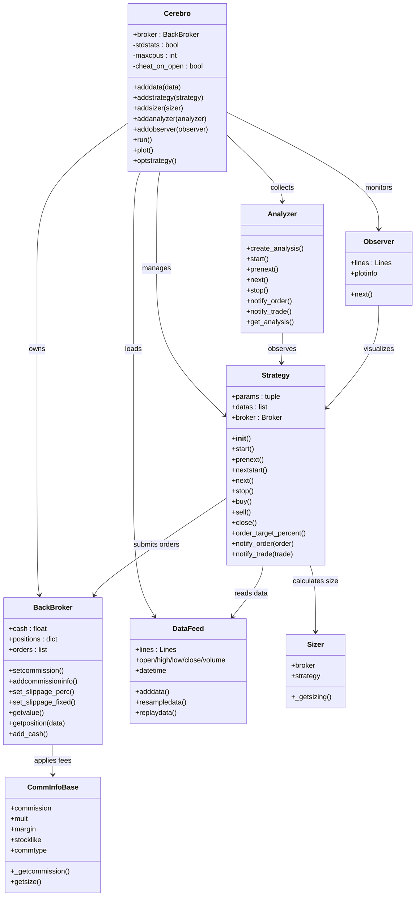
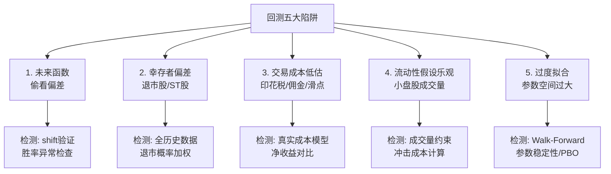
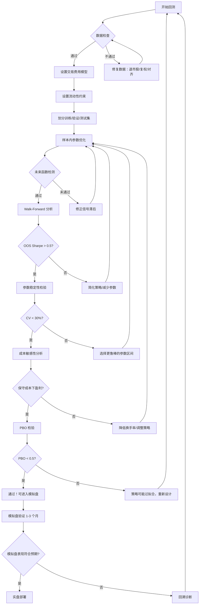

# A股回测框架实战与避坑指南

> **核心要点**：回测是量化策略从想法到实盘的关键验证环节。本文系统讲解 Backtrader 六大核心组件架构、自定义佣金/滑点模型，对比聚宽与 vnpy 回测引擎，深入剖析五大回测陷阱（未来函数、幸存者偏差、交易成本低估、流动性假设乐观、过度拟合）及其检测方法，并提供完整的防过拟合回测框架代码与 20+ 项回测检查清单。

---

## 一、Backtrader 框架完整架构

Backtrader 是 Python 生态中最成熟的开源回测框架之一，采用**事件驱动架构（Event-Driven Architecture）**，将数据加载、策略执行、订单处理、风险管理和绩效分析高度模块化。其核心设计围绕六大组件展开：Cerebro、Strategy、Broker、Data Feed、Analyzer、Observer。

### 1.1 架构总览（Mermaid 类图）



### 1.2 六大核心组件详解

#### （1）Cerebro — 中枢控制器

Cerebro 是整个框架的"大脑"，负责：
- **收集所有输入**：数据源、策略、观察者、分析器
- **创建并管理 Broker** 实例（默认创建 `BackBroker`，初始资金 10,000）
- **执行回测循环**：逐 bar 推进时间，触发策略回调
- **参数优化**：通过 `optstrategy()` + 多核并行加速

```python
import backtrader as bt

cerebro = bt.Cerebro(
    stdstats=True,       # 自动添加默认Observer（Broker价值/买卖点/交易）
    maxcpus=1,           # 优化时CPU核心数，0=全部
    cheat_on_open=False, # 是否允许开盘作弊（用开盘价下单并以开盘价成交）
)
cerebro.broker.setcash(1_000_000)  # 设置初始资金
```

#### （2）Data Feed — 数据源与 Lines 机制

Backtrader 的数据核心是 **Lines 概念**：每条 Line 是一个时间序列向量，标准 OHLCV 数据产生 7 条 Lines（datetime + OHLCV + openinterest）。

```python
# 从 CSV 加载
data = bt.feeds.GenericCSVData(
    dataname='stock_data.csv',
    dtformat='%Y-%m-%d',
    datetime=0, open=1, high=2, low=3, close=4, volume=5,
    openinterest=-1,  # -1 表示不存在
    fromdate=datetime(2020, 1, 1),
    todate=datetime(2025, 12, 31),
)

# 从 Pandas DataFrame 加载（推荐，便于预处理）
import pandas as pd
df = pd.read_csv('stock_data.csv', index_col='date', parse_dates=True)
data = bt.feeds.PandasData(dataname=df, name='000001.SZ')

cerebro.adddata(data)

# 多时间框架：日线重采样为周线
cerebro.resampledata(data, timeframe=bt.TimeFrame.Weeks, compression=1)
```

**数据索引规则**：`self.data.close[0]` 表示当前 bar，`self.data.close[-1]` 表示前一个 bar。

#### （3）Strategy — 策略生命周期

Strategy 的生命周期包含五个阶段：

| 阶段 | 回调方法 | 说明 |
|------|----------|------|
| 出生 | `start()` | 初始化完毕后首次调用 |
| 童年 | `prenext()` | 指标未满足最小周期时反复调用 |
| 过渡 | `nextstart()` | 从 prenext 切换到 next 的瞬间调用一次 |
| **成年** | **`next()`** | **核心交易逻辑，每个满足条件的 bar 调用** |
| 死亡 | `stop()` | 数据处理完毕后调用，输出统计 |

```python
class DualMAStrategy(bt.Strategy):
    params = (
        ('fast_period', 10),
        ('slow_period', 30),
    )

    def __init__(self):
        # 在 __init__ 中定义指标 → 预计算，效率高
        self.fast_ma = bt.indicators.SMA(self.data.close, period=self.p.fast_period)
        self.slow_ma = bt.indicators.SMA(self.data.close, period=self.p.slow_period)
        self.crossover = bt.indicators.CrossOver(self.fast_ma, self.slow_ma)
        self.order = None

    def notify_order(self, order):
        if order.status in [order.Completed]:
            if order.isbuy():
                self.log(f'买入: {order.executed.price:.2f}, 成本: {order.executed.comm:.2f}')
            else:
                self.log(f'卖出: {order.executed.price:.2f}, 成本: {order.executed.comm:.2f}')
        self.order = None

    def next(self):
        if self.order:
            return
        if not self.position:
            if self.crossover > 0:  # 金叉
                self.order = self.buy()
        else:
            if self.crossover < 0:  # 死叉
                self.order = self.sell()
```

#### （4）Broker — 经纪人与订单管理

BackBroker 负责现金管理、订单撮合、持仓跟踪。支持的订单类型：

| 订单类型 | 代码 | 说明 |
|----------|------|------|
| 市价单 | `self.buy()` | 下一个 bar 开盘价成交 |
| 限价单 | `self.buy(exectype=bt.Order.Limit, price=10.0)` | 价格不高于指定价时成交 |
| 止损单 | `self.sell(exectype=bt.Order.Stop, price=9.0)` | 价格跌破指定价时触发 |
| 止损限价单 | `StopLimit` | 先触发止损价，再以限价成交 |
| 括号订单 | `self.buy_bracket(...)` | 主订单 + 止损 + 止盈，三合一 |

**订单状态流转**：Created → Submitted → Accepted → Partial/Completed/Rejected/Cancelled/Expired

#### （5）Analyzer — 绩效分析

Analyzer 收集回测过程中的交易数据，生成绩效指标。

```python
# 添加常用分析器
cerebro.addanalyzer(bt.analyzers.SharpeRatio, _name='sharpe',
                    riskfreerate=0.02, annualize=True)
cerebro.addanalyzer(bt.analyzers.DrawDown, _name='drawdown')
cerebro.addanalyzer(bt.analyzers.TradeAnalyzer, _name='trades')
cerebro.addanalyzer(bt.analyzers.Returns, _name='returns')
cerebro.addanalyzer(bt.analyzers.SQN, _name='sqn')  # System Quality Number
cerebro.addanalyzer(bt.analyzers.VWR, _name='vwr')   # 变异加权收益

results = cerebro.run()
strat = results[0]

sharpe = strat.analyzers.sharpe.get_analysis()
dd = strat.analyzers.drawdown.get_analysis()
print(f"Sharpe Ratio: {sharpe['sharperatio']:.3f}")
print(f"Max Drawdown: {dd['max']['drawdown']:.2f}%")
```

#### （6）Observer — 实时可视化监测

Observer 与 Analyzer 的区别：Observer 用于绘图和实时监测，Analyzer 用于数值计算。

```python
# 内置 Observer
cerebro.addobserver(bt.observers.Broker)      # 账户总价值
cerebro.addobserver(bt.observers.BuySell)      # 买卖信号标记
cerebro.addobserver(bt.observers.DrawDown)     # 实时回撤
cerebro.addobserver(bt.observers.Trades)       # 交易记录

# 自定义 Observer
class CashObserver(bt.Observer):
    lines = ('cash',)
    plotinfo = dict(plot=True, subplot=True)

    def next(self):
        self.lines.cash[0] = self._owner.broker.getcash()
```

---

## 二、自定义 Commission 与滑点模型（A 股适配）

### 2.1 A 股佣金模型

A 股交易费用结构特殊：买入收佣金，卖出收佣金 + 印花税。需要自定义 `CommInfoBase` 来精确模拟。参见 [[A股交易制度全解析]] 中的费用制度。

```python
class AShareCommission(bt.CommInfoBase):
    """A股交易费用模型

    - 佣金：双向收取，万2.5（最低5元）
    - 印花税：仅卖出收取，千分之一
    - 过户费：沪市千分之0.02（2022年4月起沪深统一）
    """
    params = (
        ('commission', 0.00025),   # 佣金费率 万2.5
        ('stamp_duty', 0.001),     # 印花税 千1（仅卖出）
        ('transfer_fee', 0.00002), # 过户费 万0.2
        ('min_commission', 5.0),   # 最低佣金 5 元
        ('stocklike', True),
        ('commtype', bt.CommInfoBase.COMM_PERC),
    )

    def _getcommission(self, size, price, pseudoexec):
        """计算单笔交易佣金"""
        turnover = abs(size) * price

        # 佣金（双向）
        comm = turnover * self.p.commission
        comm = max(comm, self.p.min_commission)

        # 过户费（双向）
        transfer = turnover * self.p.transfer_fee

        # 印花税（仅卖出，size < 0 为卖出）
        stamp = turnover * self.p.stamp_duty if size < 0 else 0

        return comm + transfer + stamp

# 应用到 Cerebro
comminfo = AShareCommission()
cerebro.broker.addcommissioninfo(comminfo)
```

### 2.2 自定义滑点模型

简单的百分比滑点不够真实。A 股中滑点与**流动性**高度相关——小盘股滑点远大于沪深300成分股。参见 [[A股市场微观结构深度研究]] 中的价格冲击模型。

```python
class VolumeAwareSlippage(bt.CommInfoBase):
    """基于成交量的动态滑点模型

    使用平方根市场冲击模型：
    slippage = sigma * sqrt(Q / V)
    其中 sigma 为波动率估计，Q 为订单量，V 为日成交量
    """
    pass


# 方法一：Backtrader 内置滑点设置
cerebro.broker.set_slippage_perc(
    perc=0.001,       # 0.1% 基础滑点
    slip_open=True,   # 开盘价滑点
    slip_match=True,  # 匹配价滑点
    slip_out=True     # 收盘价滑点
)

# 方法二：在策略中实现动态滑点（更灵活）
class SlippageAwareStrategy(bt.Strategy):
    """在下单时根据成交量动态调整"""
    params = (
        ('base_slippage', 0.001),  # 基础滑点 0.1%
        ('volume_impact', 0.02),    # 冲击系数 sigma
        ('max_volume_pct', 0.05),   # 单笔最大占日成交量5%
    )

    def _calc_slippage(self, data, size):
        """计算基于成交量的滑点"""
        daily_vol = data.volume[0]
        if daily_vol <= 0:
            return self.p.base_slippage
        vol_ratio = abs(size) / daily_vol
        # 平方根冲击模型
        impact = self.p.volume_impact * (vol_ratio ** 0.5)
        return max(self.p.base_slippage, impact)

    def _check_liquidity(self, data, size):
        """流动性检查：单笔不超过日成交量的5%"""
        daily_vol = data.volume[0]
        max_size = int(daily_vol * self.p.max_volume_pct)
        if abs(size) > max_size:
            return max_size  # 缩减到可执行量
        return abs(size)
```

---

## 三、聚宽 / vnpy 回测引擎对比

### 3.1 三大框架全面对比

详细的平台对比参见 [[A股量化交易平台深度对比]]。

| 维度 | **Backtrader** | **聚宽（JoinQuant）** | **vnpy** |
|------|---------------|----------------------|----------|
| **部署方式** | 本地 Python 库 | 云端一站式平台 | 本地模块化框架 |
| **数据源** | 需自接（Tushare/AKShare） | JQData 专业清洗数据 | RQData/CTP 等 |
| **回测模式** | 事件驱动，Bar 级 | 事件驱动，分钟/日线 | Bar/Tick 双模式 |
| **回测速度** | 快（纯 Python） | 中等（云端限制） | 快（Rust 加速版 vnpyrs） |
| **A 股适配** | 需自定义 Commission/T+1 | 原生支持（涨跌停/T+1） | 需配置，偏期货 |
| **实盘对接** | 弱（需自行开发 Broker） | 强（QMT 跟单/一键推送） | 强（多券商 API 内置） |
| **参数优化** | 多核并行穷举 | 内置优化 | 穷举 + 遗传算法 |
| **可视化** | matplotlib 内置 plot | Web 交互式报告 | Qt 图形界面 |
| **学习曲线** | 中等 | 低（模板 + 教程 100+ 节） | 高（专业开发者向） |
| **开源** | 是（MIT） | 否（云服务） | 是（MIT） |
| **适用场景** | 策略研究/学术回测 | 新手入门/快速验证 | 期货实盘/高频 CTA |

### 3.2 聚宽回测引擎要点

```python
# 聚宽策略模板
def initialize(context):
    set_benchmark('000300.XSHG')  # 基准：沪深300
    set_option('use_real_price', True)  # 真实价格
    set_order_cost(
        OrderCost(open_tax=0, close_tax=0.001,      # 印花税
                  open_commission=0.00025,             # 买入佣金
                  close_commission=0.00025,            # 卖出佣金
                  min_commission=5),                   # 最低佣金
        type='stock'
    )
    set_slippage(PriceRelatedSlippage(0.002))  # 0.2%滑点
    g.security = '000001.XSHE'

def handle_data(context, data):
    security = g.security
    current_price = data[security].close
    # 交易逻辑...
    order_target_value(security, context.portfolio.total_value * 0.95)
```

**聚宽优势**：
- 数据质量高，经过专业清洗（含退市/ST 标记）
- 从研究到模拟到实盘链路完整
- 社区活跃，策略模板丰富
- 原生处理 A 股特殊制度（涨跌停、停牌、T+1）

**聚宽劣势**：
- 数据付费，高级功能需订阅
- 云端执行，网络延迟不可控
- 策略代码锁定在平台生态

### 3.3 vnpy 回测模块要点

vnpy 的回测通过 `BacktestingEngine` 实现，偏向 CTA/期货策略：

```python
from vnpy_ctabacktester import BacktestingEngine
from datetime import datetime

engine = BacktestingEngine()
engine.set_parameters(
    vt_symbol="IF888.CFFEX",      # 合约代码（含交易所后缀）
    interval="1m",                  # K 线周期
    start=datetime(2024, 1, 1),
    end=datetime(2024, 12, 31),
    rate=2.3e-5,                    # 手续费率
    slippage=0.2,                   # 滑点（点数）
    size=300,                       # 合约乘数
    pricetick=0.2,                  # 最小变动价位
    capital=1_000_000,              # 初始资金
)
engine.add_strategy(DoubleMaStrategy, {"fast_window": 10, "slow_window": 20})
engine.load_data()
engine.run_backtesting()
engine.show_chart()

# 参数优化（遗传算法）
from vnpyrs.trader.optimize import OptimizationSetting
setting = OptimizationSetting()
setting.set_target("sharpe_ratio")
setting.add_parameter("fast_window", 5, 20, 1)
setting.add_parameter("slow_window", 20, 60, 5)
engine.run_ga_optimization(setting)
```

---

## 四、五大回测陷阱深度剖析

### 陷阱概览



### 4.1 陷阱一：未来函数（Look-Ahead Bias / 偷看偏差）

**定义**：在做交易决策时使用了当时尚不可得的信息。这是最隐蔽也最致命的回测陷阱。

**常见形式**：

| 类型 | 具体表现 | 危害程度 |
|------|----------|----------|
| **价格偷看** | 用当日收盘价计算信号，当日开盘下单 | ★★★★★ |
| **财务数据偷看** | 用年报数据但未对齐实际发布日期 | ★★★★☆ |
| **指标偷看** | 使用全样本计算的 z-score 标准化 | ★★★★☆ |
| **信号闪烁** | 指标在 bar 内变化，收盘确认后才稳定 | ★★★☆☆ |
| **除权偷看** | 用后复权价格但信号在除权日之前 | ★★★☆☆ |

**检测方法与代码**：

```python
import pandas as pd
import numpy as np

def detect_lookahead_bias(df: pd.DataFrame, signal_col: str,
                          return_col: str = 'close') -> dict:
    """检测未来函数偷看偏差

    原理：将信号滞后1期，比较使用原始信号vs滞后信号的策略收益。
    若原始信号收益远高于滞后信号收益，则存在未来函数。

    Args:
        df: 含有信号列和价格列的DataFrame
        signal_col: 信号列名（1=做多, -1=做空, 0=空仓）
        return_col: 价格列名

    Returns:
        dict: 包含原始收益、滞后收益、偏差比例
    """
    df = df.copy()
    df['returns'] = df[return_col].pct_change()

    # 原始信号收益（可能含未来函数）
    df['strategy_original'] = df[signal_col] * df['returns']
    cum_original = (1 + df['strategy_original']).cumprod().iloc[-1] - 1

    # 滞后信号收益（排除未来函数）
    df['signal_lagged'] = df[signal_col].shift(1)
    df['strategy_lagged'] = df['signal_lagged'] * df['returns']
    cum_lagged = (1 + df['strategy_lagged']).cumprod().iloc[-1] - 1

    # 偏差比
    if cum_lagged != 0:
        bias_ratio = cum_original / cum_lagged
    else:
        bias_ratio = float('inf')

    result = {
        'cum_return_original': cum_original,
        'cum_return_lagged': cum_lagged,
        'bias_ratio': bias_ratio,
        'has_lookahead': bias_ratio > 1.5,  # 超过50%差异视为有偷看
        'warning': '⚠ 疑似存在未来函数！' if bias_ratio > 1.5 else '✓ 未检测到明显偷看偏差'
    }
    return result


def check_financial_data_alignment(df_price: pd.DataFrame,
                                    df_report: pd.DataFrame) -> pd.DataFrame:
    """检查财务数据是否正确对齐发布日期

    A股年报须在次年4月30日前发布，中报在8月31日前。
    使用 merge_asof 按实际发布日对齐，而非会计期末日。
    """
    # 确保按日期排序
    df_price = df_price.sort_values('trade_date')
    df_report = df_report.sort_values('announce_date')  # 用公告日而非报告期

    # 用公告日对齐（Point-in-Time）
    merged = pd.merge_asof(
        df_price, df_report,
        left_on='trade_date', right_on='announce_date',
        direction='backward'  # 只用已发布的数据
    )
    return merged
```

**规避原则**：
1. 所有信号必须使用 `shift(1)` 滞后，或在 Backtrader 中确保订单在 next bar 执行
2. 财务数据必须用 `announce_date`（公告日）而非 `report_date`（报告期）进行 merge_asof
3. 除权处理使用**前复权**价格序列
4. 因子标准化只能使用**截止当前时点**的滚动窗口数据

### 4.2 陷阱二：幸存者偏差（Survivorship Bias）

**定义**：仅使用当前存续的股票进行回测，忽略了历史上已退市、ST、暂停上市的股票，导致收益虚高。

**A 股退市数据**：
- 2020-2025 年间 A 股累计退市约 200+ 家（注册制改革后加速）
- 退市股在退市前往往连续跌停，持有退市股的损失可能是 100%
- ST 股在被标记前可能已被策略选入，若不处理将高估收益

**检测与处理代码**：

```python
import tushare as ts

def build_survivorship_free_universe(start_date: str, end_date: str,
                                      token: str) -> pd.DataFrame:
    """构建无幸存者偏差的全A股股票池

    包含：当前上市 + 已退市 + ST/PT 标记
    """
    pro = ts.pro_api(token)

    # 获取所有股票（含已退市）
    df_listed = pro.stock_basic(exchange='', list_status='L',
                                 fields='ts_code,name,list_date,delist_date')
    df_delisted = pro.stock_basic(exchange='', list_status='D',
                                    fields='ts_code,name,list_date,delist_date')
    df_paused = pro.stock_basic(exchange='', list_status='P',
                                  fields='ts_code,name,list_date,delist_date')

    df_all = pd.concat([df_listed, df_delisted, df_paused], ignore_index=True)

    return df_all


def filter_tradable_universe(df_all: pd.DataFrame,
                              trade_date: str) -> pd.DataFrame:
    """获取指定交易日的可交易股票池

    排除条件：
    1. 尚未上市的股票
    2. 已退市的股票
    3. 上市不满60个交易日（新股波动大）
    4. ST/PT 股票（可选）
    """
    td = pd.Timestamp(trade_date)

    # 基本筛选
    mask = (
        (pd.to_datetime(df_all['list_date']) <= td) &  # 已上市
        (df_all['delist_date'].isna() | (pd.to_datetime(df_all['delist_date']) > td))  # 未退市
    )
    df_tradable = df_all[mask].copy()

    # 排除次新股（上市 < 60 天）
    df_tradable['days_listed'] = (td - pd.to_datetime(df_tradable['list_date'])).dt.days
    df_tradable = df_tradable[df_tradable['days_listed'] >= 60]

    # 标记 ST（可选排除）
    df_tradable['is_st'] = df_tradable['name'].str.contains(r'ST|\*ST', na=False)

    return df_tradable


def survivorship_bias_impact(returns_with_delisted: pd.Series,
                              returns_survivors_only: pd.Series) -> dict:
    """量化幸存者偏差的影响"""
    annual_with = returns_with_delisted.mean() * 252
    annual_without = returns_survivors_only.mean() * 252
    bias = annual_without - annual_with

    return {
        'annual_return_full': f'{annual_with:.2%}',
        'annual_return_survivors': f'{annual_without:.2%}',
        'survivorship_bias': f'{bias:.2%}',
        'bias_significant': abs(bias) > 0.02  # 超过2%年化视为显著
    }
```

**关键发现**：中信证券实证测试（2024）显示，加入退市股后，小盘股策略年化收益从 22% 降至 14%，偏差达 8 个百分点。

### 4.3 陷阱三：交易成本低估

**定义**：回测中使用的交易成本远低于实际交易成本，导致收益虚高。对于高换手策略影响尤其致命。

**A 股真实交易成本参数表**（2024-2025）：

| 成本类型 | 参数值 | 方向 | 说明 |
|----------|--------|------|------|
| **佣金** | 万 2.5（0.025%） | 双向 | 中等资金量，最低 5 元/笔 |
| **印花税** | 千 1（0.1%） | 仅卖出 | 2023年8月起减半至0.05%后恢复 |
| **过户费** | 万 0.2（0.002%） | 双向 | 2022年4月起沪深统一 |
| **滑点（大盘股）** | 0.05%~0.1% | 双向 | 沪深300成分股 |
| **滑点（中盘股）** | 0.1%~0.3% | 双向 | 中证500成分股 |
| **滑点（小盘股）** | 0.3%~1.0% | 双向 | 日成交额 < 5000万 |
| **冲击成本** | σ×√(Q/V) | 双向 | 大单/低流动性 |

> **经验法则**：单边总成本约 0.15%~0.5%，回测收益 × 0.5 ≈ 实盘预期（含隐性成本）

**成本敏感性分析代码**：

```python
def cost_sensitivity_analysis(gross_returns: pd.Series,
                               turnover_rate: float,
                               cost_scenarios: dict = None) -> pd.DataFrame:
    """交易成本敏感性分析

    Args:
        gross_returns: 日收益率序列（未扣除成本）
        turnover_rate: 日均换手率（双边）
        cost_scenarios: 成本情景 {名称: 单边总成本率}
    """
    if cost_scenarios is None:
        cost_scenarios = {
            '乐观（仅佣金）': 0.0003,
            '标准（佣金+印花税）': 0.0015,
            '保守（含滑点）': 0.003,
            '悲观（小盘股）': 0.006,
            '极端（微盘股）': 0.01,
        }

    results = []
    for name, cost_rate in cost_scenarios.items():
        daily_cost = turnover_rate * cost_rate
        net_returns = gross_returns - daily_cost

        cum_return = (1 + net_returns).cumprod().iloc[-1] - 1
        annual_return = (1 + cum_return) ** (252 / len(net_returns)) - 1
        sharpe = net_returns.mean() / net_returns.std() * np.sqrt(252)
        max_dd = (net_returns.cumsum() - net_returns.cumsum().cummax()).min()

        results.append({
            '成本情景': name,
            '单边成本': f'{cost_rate:.4%}',
            '累计收益': f'{cum_return:.2%}',
            '年化收益': f'{annual_return:.2%}',
            'Sharpe': f'{sharpe:.3f}',
            '最大回撤': f'{max_dd:.2%}',
        })

    return pd.DataFrame(results)
```

更多交易制度细节参见 [[A股交易制度全解析]]。

### 4.4 陷阱四：流动性假设过于乐观

**定义**：回测假设所有交易都能按期望价格和数量完全成交，但实际中小盘股存在严重的流动性约束。

**A 股流动性分层数据**：

| 市值分层 | 代表指数 | 日均成交额中位数 | 可执行订单占比（日成交5%） |
|----------|----------|------------------|--------------------------|
| 大盘（>500亿） | 沪深300 | 5-30 亿 | 2500-15000 万 |
| 中盘（100-500亿） | 中证500 | 1-5 亿 | 500-2500 万 |
| 小盘（30-100亿） | 中证1000 | 0.3-1 亿 | 150-500 万 |
| 微盘（<30亿） | 万得微盘 | 0.05-0.3 亿 | 25-150 万 |

**流动性检查代码**：

```python
def liquidity_feasibility_check(
    target_positions: pd.DataFrame,
    market_data: pd.DataFrame,
    max_participation_rate: float = 0.05,
    max_days_to_execute: int = 3
) -> pd.DataFrame:
    """流动性可执行性检查

    Args:
        target_positions: 目标持仓 DataFrame，含 ['stock', 'target_amount']
        market_data: 市场数据，含 ['stock', 'avg_daily_volume', 'avg_daily_turnover']
        max_participation_rate: 单日最大参与率（占日成交量比例）
        max_days_to_execute: 最大允许执行天数

    Returns:
        DataFrame: 每只股票的可执行性评估
    """
    merged = target_positions.merge(market_data, on='stock')

    # 单日最大可执行金额
    merged['max_daily_executable'] = (
        merged['avg_daily_turnover'] * max_participation_rate
    )

    # 执行天数
    merged['days_to_execute'] = np.ceil(
        merged['target_amount'] / merged['max_daily_executable']
    )

    # 可执行性判定
    merged['is_feasible'] = merged['days_to_execute'] <= max_days_to_execute

    # 需要缩减的金额
    merged['feasible_amount'] = np.minimum(
        merged['target_amount'],
        merged['max_daily_executable'] * max_days_to_execute
    )
    merged['reduction_pct'] = 1 - merged['feasible_amount'] / merged['target_amount']

    # 市场冲击估计（平方根模型）
    sigma = 0.02  # 日波动率估计
    merged['participation_rate'] = (
        merged['target_amount'] / merged['avg_daily_turnover']
    )
    merged['estimated_impact'] = sigma * np.sqrt(merged['participation_rate'])

    return merged[['stock', 'target_amount', 'max_daily_executable',
                    'days_to_execute', 'is_feasible', 'reduction_pct',
                    'estimated_impact']]
```

**规避策略**：
1. 设置**最大参与率**：单笔订单不超过该股日成交量的 5%
2. 设置**最低成交额门槛**：排除日均成交额 < 1000 万的股票
3. 使用**容量加权**：按可容纳资金量调整持仓权重
4. 回测中添加**成交量约束**：`actual_size = min(target_size, daily_volume * 0.05)`

### 4.5 陷阱五：过度拟合（Overfitting）

**定义**：策略在历史数据上过度优化参数，捕捉了数据中的噪声而非真正的市场规律，导致样本外表现远不如样本内。

**过度拟合信号**：
- 参数空间巨大（>1000 种组合），但只选了"最优"一组
- 样本内 Sharpe > 3 但样本外 < 0.5
- 参数微调后绩效剧变（参数敏感）
- 策略逻辑过于复杂，包含大量 if-else 特殊条件
- 回测期越长收益越好（对 regime change 不鲁棒）

因子评估中的过拟合问题详见 [[因子评估方法论]]。

**检测方法 1：Walk-Forward 分析**

```python
from sklearn.model_selection import TimeSeriesSplit

def walk_forward_analysis(
    data: pd.DataFrame,
    strategy_func,
    param_ranges: dict,
    n_splits: int = 5,
    optimize_metric: str = 'sharpe'
) -> dict:
    """Walk-Forward 滚动窗口分析

    将数据分成 n_splits 个连续窗口，
    在前段优化参数，后段验证。

    Args:
        data: 价格数据 DataFrame
        strategy_func: 策略函数，接收 (data, params) 返回绩效指标
        param_ranges: 参数搜索范围 {param_name: [values]}
        n_splits: 分割数量
        optimize_metric: 优化目标

    Returns:
        dict: 样本内/外绩效对比
    """
    tscv = TimeSeriesSplit(n_splits=n_splits)

    in_sample_results = []
    out_sample_results = []
    optimal_params_history = []

    for fold_idx, (train_idx, test_idx) in enumerate(tscv.split(data)):
        train_data = data.iloc[train_idx]
        test_data = data.iloc[test_idx]

        # 样本内参数优化（穷举）
        best_metric = -np.inf
        best_params = None

        from itertools import product
        param_names = list(param_ranges.keys())
        param_values = list(param_ranges.values())

        for combo in product(*param_values):
            params = dict(zip(param_names, combo))
            result = strategy_func(train_data, params)
            if result[optimize_metric] > best_metric:
                best_metric = result[optimize_metric]
                best_params = params

        # 样本外验证（使用样本内最优参数）
        in_result = strategy_func(train_data, best_params)
        out_result = strategy_func(test_data, best_params)

        in_sample_results.append(in_result)
        out_sample_results.append(out_result)
        optimal_params_history.append(best_params)

        print(f"Fold {fold_idx+1}: IS Sharpe={in_result['sharpe']:.3f}, "
              f"OOS Sharpe={out_result['sharpe']:.3f}, Params={best_params}")

    # 汇总
    avg_in_sharpe = np.mean([r['sharpe'] for r in in_sample_results])
    avg_out_sharpe = np.mean([r['sharpe'] for r in out_sample_results])
    degradation = 1 - avg_out_sharpe / avg_in_sharpe if avg_in_sharpe > 0 else None

    return {
        'avg_in_sample_sharpe': avg_in_sharpe,
        'avg_out_sample_sharpe': avg_out_sharpe,
        'degradation_ratio': degradation,
        'is_overfit': degradation is not None and degradation > 0.5,
        'optimal_params_history': optimal_params_history,
        'param_stability': _assess_param_stability(optimal_params_history)
    }


def _assess_param_stability(params_history: list) -> dict:
    """评估最优参数在不同窗口间的稳定性"""
    stability = {}
    if not params_history:
        return stability

    param_names = params_history[0].keys()
    for name in param_names:
        values = [p[name] for p in params_history]
        cv = np.std(values) / np.mean(values) if np.mean(values) != 0 else float('inf')
        stability[name] = {
            'mean': np.mean(values),
            'std': np.std(values),
            'cv': cv,  # 变异系数，越小越稳定
            'is_stable': cv < 0.3  # CV < 30% 视为稳定
        }
    return stability
```

**检测方法 2：PBO（Probability of Backtest Overfitting）**

```python
def calculate_pbo(
    data: pd.DataFrame,
    strategy_func,
    param_grid: list,
    n_partitions: int = 10
) -> float:
    """计算回测过拟合概率 (PBO)

    基于 Lopez de Prado (2015) 的 CSCV 方法。
    将数据分为 S 个子集，取 S/2 个为训练集，其余为测试集，
    遍历所有组合，计算最优参数在样本外的排名。

    Args:
        data: 价格数据
        strategy_func: 策略函数
        param_grid: 参数组合列表
        n_partitions: 数据分区数

    Returns:
        float: PBO值 (0-1)，>0.5 表示策略可能过拟合
    """
    from itertools import combinations

    # 将数据等分为 n_partitions 个子集
    partition_size = len(data) // n_partitions
    partitions = [data.iloc[i*partition_size:(i+1)*partition_size]
                  for i in range(n_partitions)]

    n_train = n_partitions // 2
    all_combos = list(combinations(range(n_partitions), n_train))

    rank_below_median = 0
    total_combos = 0

    for combo in all_combos:
        test_indices = [i for i in range(n_partitions) if i not in combo]

        train_data = pd.concat([partitions[i] for i in combo])
        test_data = pd.concat([partitions[i] for i in test_indices])

        # 在训练集上找最优参数
        train_results = [(p, strategy_func(train_data, p)['sharpe'])
                         for p in param_grid]
        best_param = max(train_results, key=lambda x: x[1])[0]

        # 在测试集上评估所有参数
        test_results = [(p, strategy_func(test_data, p)['sharpe'])
                        for p in param_grid]
        test_results.sort(key=lambda x: x[1], reverse=True)

        # 最优参数在测试集中的排名
        best_rank = next(i for i, (p, _) in enumerate(test_results)
                        if p == best_param)

        # 排名是否低于中位数
        if best_rank > len(param_grid) // 2:
            rank_below_median += 1
        total_combos += 1

    pbo = rank_below_median / total_combos
    return pbo
```

---

## 五、完整防过拟合回测框架

```python
"""
A股防过拟合回测框架
集成：成本模型 + 流动性约束 + Walk-Forward + 幸存者偏差处理
"""
import backtrader as bt
import pandas as pd
import numpy as np
from datetime import datetime
from itertools import product


# ═══════════════════════════════════════════════════════
# 1. A股专用佣金模型
# ═══════════════════════════════════════════════════════
class AShareCommission(bt.CommInfoBase):
    params = (
        ('commission', 0.00025),
        ('stamp_duty', 0.001),
        ('transfer_fee', 0.00002),
        ('min_commission', 5.0),
        ('stocklike', True),
        ('commtype', bt.CommInfoBase.COMM_PERC),
    )

    def _getcommission(self, size, price, pseudoexec):
        turnover = abs(size) * price
        comm = max(turnover * self.p.commission, self.p.min_commission)
        transfer = turnover * self.p.transfer_fee
        stamp = turnover * self.p.stamp_duty if size < 0 else 0
        return comm + transfer + stamp


# ═══════════════════════════════════════════════════════
# 2. 流动性约束策略基类
# ═══════════════════════════════════════════════════════
class LiquidityAwareStrategy(bt.Strategy):
    """带流动性约束的策略基类"""
    params = (
        ('max_participation', 0.05),   # 单笔最大占日成交5%
        ('min_daily_turnover', 1e7),   # 最低日成交额1000万
        ('base_slippage', 0.001),      # 基础滑点 0.1%
    )

    def _get_executable_size(self, data, target_size):
        """计算实际可执行的交易量"""
        daily_vol = data.volume[0]
        if daily_vol <= 0:
            return 0

        max_size = int(daily_vol * self.p.max_participation)
        # A股最小交易单位100股
        executable = min(abs(target_size), max_size)
        executable = (executable // 100) * 100

        return executable if target_size > 0 else -executable

    def _check_tradable(self, data):
        """检查是否可交易（涨跌停/停牌检查）"""
        if data.volume[0] <= 0:
            return False  # 停牌

        daily_turnover = data.close[0] * data.volume[0]
        if daily_turnover < self.p.min_daily_turnover:
            return False  # 成交额过低

        # 涨跌停检查（近似：涨跌幅 > 9.5%）
        if len(data) > 1 and data.close[-1] > 0:
            change = abs(data.close[0] / data.close[-1] - 1)
            if change > 0.095:
                return False  # 涨跌停，不可交易

        return True


# ═══════════════════════════════════════════════════════
# 3. 示例策略：双均线 + 流动性约束
# ═══════════════════════════════════════════════════════
class RobustDualMA(LiquidityAwareStrategy):
    params = (
        ('fast_period', 10),
        ('slow_period', 30),
        ('position_pct', 0.95),
    )

    def __init__(self):
        self.fast_ma = bt.indicators.SMA(self.data.close,
                                          period=self.p.fast_period)
        self.slow_ma = bt.indicators.SMA(self.data.close,
                                          period=self.p.slow_period)
        self.crossover = bt.indicators.CrossOver(self.fast_ma, self.slow_ma)
        self.order = None

    def notify_order(self, order):
        if order.status in [order.Completed, order.Cancelled,
                            order.Margin, order.Rejected]:
            self.order = None

    def next(self):
        if self.order:
            return

        if not self._check_tradable(self.data):
            return

        if not self.position:
            if self.crossover > 0:
                # 计算目标仓位
                cash = self.broker.getcash()
                target_size = int(cash * self.p.position_pct / self.data.close[0])
                target_size = (target_size // 100) * 100  # A股100股整数

                # 流动性约束
                executable = self._get_executable_size(self.data, target_size)
                if executable > 0:
                    self.order = self.buy(size=executable)
        else:
            if self.crossover < 0:
                self.order = self.close()


# ═══════════════════════════════════════════════════════
# 4. 回测执行引擎（含 Walk-Forward）
# ═══════════════════════════════════════════════════════
class RobustBacktester:
    """防过拟合回测执行器"""

    def __init__(self, data: pd.DataFrame, initial_cash: float = 1_000_000):
        self.data = data
        self.initial_cash = initial_cash

    def single_run(self, strategy_class, params: dict) -> dict:
        """单次回测"""
        cerebro = bt.Cerebro()

        # 数据
        bt_data = bt.feeds.PandasData(dataname=self.data)
        cerebro.adddata(bt_data)

        # 策略
        cerebro.addstrategy(strategy_class, **params)

        # A股佣金
        cerebro.broker.addcommissioninfo(AShareCommission())
        cerebro.broker.setcash(self.initial_cash)

        # 滑点
        cerebro.broker.set_slippage_perc(perc=0.001)

        # 分析器
        cerebro.addanalyzer(bt.analyzers.SharpeRatio, _name='sharpe',
                            riskfreerate=0.02, annualize=True)
        cerebro.addanalyzer(bt.analyzers.DrawDown, _name='drawdown')
        cerebro.addanalyzer(bt.analyzers.Returns, _name='returns')
        cerebro.addanalyzer(bt.analyzers.TradeAnalyzer, _name='trades')

        results = cerebro.run()
        strat = results[0]

        # 提取指标
        sharpe_val = strat.analyzers.sharpe.get_analysis().get('sharperatio', 0)
        dd = strat.analyzers.drawdown.get_analysis()
        ret = strat.analyzers.returns.get_analysis()
        trades = strat.analyzers.trades.get_analysis()

        final_value = cerebro.broker.getvalue()
        total_return = final_value / self.initial_cash - 1

        return {
            'sharpe': sharpe_val or 0,
            'total_return': total_return,
            'max_drawdown': dd.get('max', {}).get('drawdown', 0),
            'total_trades': trades.get('total', {}).get('total', 0),
            'final_value': final_value,
        }

    def walk_forward(self, strategy_class, param_ranges: dict,
                     n_splits: int = 5) -> dict:
        """Walk-Forward 防过拟合回测"""
        total_len = len(self.data)
        split_size = total_len // (n_splits + 1)

        in_sample_sharpes = []
        out_sample_sharpes = []
        best_params_list = []

        for i in range(n_splits):
            train_start = 0
            train_end = split_size * (i + 1)
            test_start = train_end
            test_end = min(train_end + split_size, total_len)

            if test_end <= test_start:
                continue

            train_data = self.data.iloc[train_start:train_end]
            test_data = self.data.iloc[test_start:test_end]

            # 训练集参数优化
            best_sharpe = -np.inf
            best_params = None

            param_names = list(param_ranges.keys())
            param_values = list(param_ranges.values())

            for combo in product(*param_values):
                params = dict(zip(param_names, combo))
                try:
                    train_bt = RobustBacktester(train_data, self.initial_cash)
                    result = train_bt.single_run(strategy_class, params)
                    if result['sharpe'] > best_sharpe:
                        best_sharpe = result['sharpe']
                        best_params = params
                except Exception:
                    continue

            if best_params is None:
                continue

            # 测试集验证
            test_bt = RobustBacktester(test_data, self.initial_cash)
            in_result = self.single_run(strategy_class, best_params)
            out_result = test_bt.single_run(strategy_class, best_params)

            in_sample_sharpes.append(best_sharpe)
            out_sample_sharpes.append(out_result['sharpe'])
            best_params_list.append(best_params)

            print(f"Window {i+1}: IS Sharpe={best_sharpe:.3f}, "
                  f"OOS Sharpe={out_result['sharpe']:.3f}, "
                  f"Params={best_params}")

        avg_is = np.mean(in_sample_sharpes) if in_sample_sharpes else 0
        avg_oos = np.mean(out_sample_sharpes) if out_sample_sharpes else 0

        return {
            'avg_in_sample_sharpe': avg_is,
            'avg_out_sample_sharpe': avg_oos,
            'degradation': 1 - avg_oos / avg_is if avg_is > 0 else None,
            'best_params_per_window': best_params_list,
            'is_robust': avg_oos > 0.5 and (avg_is - avg_oos) / avg_is < 0.5,
        }


# ═══════════════════════════════════════════════════════
# 5. 使用示例
# ═══════════════════════════════════════════════════════
if __name__ == '__main__':
    # 加载数据（示例，实际请用 AKShare/Tushare）
    # df = pd.read_csv('000300.csv', index_col='date', parse_dates=True)

    # 单次回测
    # bt_engine = RobustBacktester(df, initial_cash=1_000_000)
    # result = bt_engine.single_run(RobustDualMA,
    #                                {'fast_period': 10, 'slow_period': 30})

    # Walk-Forward 分析
    # wf_result = bt_engine.walk_forward(
    #     RobustDualMA,
    #     param_ranges={
    #         'fast_period': range(5, 25, 5),
    #         'slow_period': range(20, 60, 10),
    #     },
    #     n_splits=5
    # )
    pass
```

---

## 六、回测检查清单（Checklist）

### 回测前检查（7 项）

| # | 检查项 | 要点 | 通过标准 |
|---|--------|------|----------|
| 1 | **数据完整性** | 含退市/ST/停牌数据 | 使用全历史数据库 |
| 2 | **数据质量** | 除权、缺失值、异常值处理 | 前复权 + 缺失值标记 |
| 3 | **时间对齐** | 财务数据用公告日，非报告期 | merge_asof + announce_date |
| 4 | **交易规则** | T+1、涨跌停板、最小 100 股 | 代码中硬编码限制 |
| 5 | **费用设置** | 佣金万2.5 + 印花税千1 + 滑点 | 参见成本参数表 |
| 6 | **样本划分** | 训练集/验证集/测试集 | 至少 60/20/20 比例 |
| 7 | **基准选择** | 与策略可比的基准指数 | 沪深300/中证500/中证1000 |

### 回测中检查（7 项）

| # | 检查项 | 要点 | 通过标准 |
|---|--------|------|----------|
| 8 | **无未来函数** | 信号 shift(1) 验证 | 偏差比 < 1.5 |
| 9 | **流动性约束** | 单笔 < 日成交量 5% | 代码中强制限制 |
| 10 | **涨跌停处理** | 涨停不买、跌停不卖 | 回测中模拟涨跌停 |
| 11 | **停牌处理** | 停牌期间不交易，复牌后处理 | volume=0 时跳过 |
| 12 | **仓位管理** | 不超过总资产 95%（留余地） | 动态仓位检查 |
| 13 | **交易记录** | 记录每笔交易详情 | 可追溯、可复现 |
| 14 | **极端行情** | 2015 股灾、2020 疫情期间表现 | 分段评估 |

### 回测后检查（9 项）

| # | 检查项 | 要点 | 通过标准 |
|---|--------|------|----------|
| 15 | **样本外验证** | OOS Sharpe > 0.5 | 衰减 < 50% |
| 16 | **Walk-Forward** | 滚动窗口前向测试 | 所有窗口正收益 |
| 17 | **参数稳定性** | 参数微调后绩效不剧变 | CV < 30% |
| 18 | **成本敏感性** | 成本翻倍后仍有正收益 | 保守成本下 Sharpe > 0 |
| 19 | **容量评估** | 策略可容纳资金量 | 明确容量上限 |
| 20 | **PBO 检验** | 回测过拟合概率 | PBO < 0.5 |
| 21 | **Deflated Sharpe** | 多重检验修正后的 Sharpe | DSR > 1.0 |
| 22 | **经济直觉** | 策略逻辑是否有经济学解释 | 可解释的 alpha 来源 |
| 23 | **衰减预期** | 预估实盘收益 ≈ 回测×0.5 | 符合预期仍可接受 |

### 回测检查流程图



---

## 七、A 股交易成本参数速查表

| 参数 | 当前值（2024-2025） | Backtrader 设置 | 聚宽设置 |
|------|---------------------|-----------------|----------|
| **佣金** | 万 2.5（0.025%） | `commission=0.00025` | `open_commission=0.00025` |
| **印花税** | 千 1（0.1%，仅卖出） | 自定义 CommInfo | `close_tax=0.001` |
| **过户费** | 万 0.2（0.002%） | 自定义 CommInfo | 含在佣金中 |
| **最低佣金** | 5 元/笔 | 自定义 CommInfo | `min_commission=5` |
| **滑点（大盘）** | 0.05%-0.1% | `set_slippage_perc(0.001)` | `PriceRelatedSlippage(0.001)` |
| **滑点（中盘）** | 0.1%-0.3% | `set_slippage_perc(0.002)` | `PriceRelatedSlippage(0.002)` |
| **滑点（小盘）** | 0.3%-1.0% | `set_slippage_perc(0.005)` | `PriceRelatedSlippage(0.005)` |
| **单边总成本（保守）** | ~0.3% | 综合配置 | 综合配置 |
| **参与率上限** | 日成交量 5% | 策略内限制 | 策略内限制 |
| **最低成交额** | 1000 万/日 | 策略内过滤 | 策略内过滤 |

> 数据获取方面的详细对比参见 [[A股量化数据源全景图]] 和 [[量化数据工程实践]]。

---

## 八、常见误区与最佳实践

| # | 误区 | 正确做法 |
|---|------|----------|
| 1 | 回测收益 = 实盘收益 | 实盘预期 ≈ 回测 × 0.5（含隐性成本和执行差异） |
| 2 | 样本内 Sharpe 越高越好 | 关注 OOS 表现，IS Sharpe > 3 反而是过拟合信号 |
| 3 | 只用收盘价回测 | 应考虑开盘价成交、涨跌停、停牌等真实约束 |
| 4 | 忽略交易成本 | 高频策略中成本可能吃掉全部利润 |
| 5 | 用当前股票池回测历史 | 必须使用**时点股票池**（Point-in-Time），含退市股 |
| 6 | 参数优化只取最优值 | 应选择"参数高原"中间值，确保鲁棒性 |
| 7 | 一次性回测就上实盘 | 必须经过 Walk-Forward → 模拟盘 → 小资金实盘 |
| 8 | 忽略市场容量 | 微盘股策略容量可能只有几百万，无法规模化 |
| 9 | 过度依赖技术指标 | 结合基本面因子提高策略稳健性，参见 [[A股多因子选股策略开发全流程]] |
| 10 | 不做压力测试 | 必须在 2015/2018/2022 等极端行情中验证 |

---

## 九、相关笔记

- [[A股交易制度全解析]] — 交易规则、费用制度、T+1 等基础制度
- [[A股市场微观结构深度研究]] — 价格冲击模型、订单簿、流动性分析
- [[A股量化交易平台深度对比]] — Backtrader/聚宽/vnpy/RiceQuant 等全面对比
- [[量化数据工程实践]] — 数据清洗、存储、前复权处理
- [[A股量化数据源全景图]] — Tushare/AKShare/Wind 等数据源接入
- [[因子评估方法论]] — IC/IR/分层回测，因子过拟合检测
- [[A股多因子选股策略开发全流程]] — 多因子策略构建与回测
- [[A股CTA与趋势跟踪策略]] — CTA 策略回测实践
- [[A股统计套利与配对交易策略]] — 配对交易回测要点
- [[A股事件驱动策略]] — 事件驱动回测中的未来函数陷阱
- [[A股可转债量化策略]] — 可转债T+0回测的特殊处理
- [[A股机器学习量化策略]] — ML策略的Purged Walk-Forward回测方法
- [[量化策略的服务器部署与自动化]] — 从回测到实盘部署的完整上线流程

---

## 来源参考

1. Backtrader 官方文档 — https://www.backtrader.com/docu/
2. Backtrader Broker/Commission 模块 — https://www.backtrader.com/docu/broker/
3. Backtrader Analyzer 模块 — https://www.backtrader.com/docu/analyzers/analyzers/
4. Backtrader Strategy 生命周期 — https://www.backtrader.com/docu/strategy/
5. 聚宽官方文档 — https://www.joinquant.com
6. vnpy CTA 回测模块 — https://www.vnpy.com/docs/cn/community/app/cta_backtester.html
7. vnpy GitHub — https://github.com/vnpy/vnpy_ctabacktester
8. BigQuant 回测系统陷阱 — https://bigquant.com/wiki/doc/Z0tjAS5sWx
9. Lopez de Prado, M. (2015). "The Probability of Backtest Overfitting" — CSCV/PBO 方法论
10. 中信证券（2024）退市股对小盘股策略影响实证研究
11. A 股交易成本模型指南 — https://bigquant.com/wiki/doc/Z0tjAS5sWx
12. Backtrader 滑点模型 — https://blog.csdn.net/gitblog_00447/article/details/152772478
