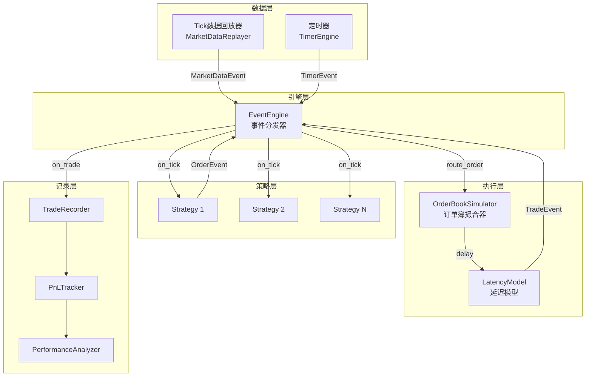

# Tick级回测引擎设计与实现

> - Tick级回测精度远超日频/分钟频，可模拟**部分成交、队列位置、延迟冲击**，是高频策略的必需基础设施
> - 事件驱动架构是核心范式：EventEngine分发MarketData/Order/Trade/Timer四类事件，Handler异步处理
> - 全市场Tick回测数据量巨大（日均11-20亿条），单股票回测性能目标**>100万tick/秒**
> - DolphinDB的`replay()`函数原生支持多表时序回放，是A股Tick回测的首选引擎
> - 回测验证的金标准：**Tick回测PnL vs 实盘PnL偏差<5%**，需逐笔对账

---

## 一、Tick回测 vs 日频/分钟频回测

| 维度 | 日频回测 | 分钟频回测 | Tick级回测 |
|------|---------|-----------|-----------|
| 数据粒度 | 1天 | 1/5/15/30/60分钟 | 逐笔(毫秒级) |
| 日均数据量(单股) | 1条 | 48-240条 | 10万-100万条 |
| 日均数据量(全市场) | 5000条 | 120万-600万条 | 11-20亿条 |
| 撮合精度 | 收盘价/VWAP | 分钟OHLC | 真实盘口+队列 |
| 滑点建模 | 固定/比例 | 基于成交量 | 基于盘口深度 |
| 部分成交 | 不支持 | 简单模拟 | 精确模拟 |
| 延迟建模 | 不适用 | 粗粒度 | 毫秒级精确 |
| 性能需求 | 低(秒级) | 中(分钟级) | 高(小时级) |
| 适用策略 | 多因子/月度调仓 | CTA/日内 | 做市/套利/高频 |
| 存储需求(5年) | <1GB | 10-50GB | 12-125TB |

---

## 二、事件驱动架构

### 2.1 架构设计



### 2.2 EventEngine实现

```python
from collections import defaultdict
from typing import Callable, Any
from dataclasses import dataclass, field
from enum import Enum
import time

class EventType(Enum):
    TICK = "tick"
    ORDER = "order"
    TRADE = "trade"
    CANCEL = "cancel"
    TIMER = "timer"
    SNAPSHOT = "snapshot"

@dataclass
class Event:
    type: EventType
    data: Any
    timestamp: float  # unix timestamp in microseconds

class EventEngine:
    """事件驱动引擎"""
    
    def __init__(self):
        self._handlers = defaultdict(list)
        self._event_queue = []
        self._running = False
        self._event_count = 0
    
    def register(self, event_type: EventType, 
                 handler: Callable):
        self._handlers[event_type].append(handler)
    
    def put(self, event: Event):
        self._event_queue.append(event)
    
    def process(self):
        """处理所有待处理事件"""
        while self._event_queue:
            event = self._event_queue.pop(0)
            for handler in self._handlers.get(event.type, []):
                handler(event)
            self._event_count += 1
    
    @property
    def event_count(self):
        return self._event_count


class TickBacktestEngine:
    """Tick级回测引擎"""
    
    def __init__(self, latency_model=None):
        self.event_engine = EventEngine()
        self.order_book_sim = OrderBookSimulator()
        self.latency_model = latency_model or FixedLatencyModel(1000)
        self.strategies = []
        self.trade_log = []
        self.pnl_tracker = PnLTracker()
        
        # 注册内部事件处理
        self.event_engine.register(
            EventType.ORDER, self._on_order)
        self.event_engine.register(
            EventType.TRADE, self._on_trade)
    
    def add_strategy(self, strategy):
        self.strategies.append(strategy)
        self.event_engine.register(
            EventType.TICK, strategy.on_tick)
        self.event_engine.register(
            EventType.TRADE, strategy.on_trade)
    
    def _on_order(self, event):
        """处理策略提交的订单"""
        order = event.data
        # 注入延迟
        delay = self.latency_model.get_delay()
        order['arrive_time'] = event.timestamp + delay
        # 送入订单簿模拟器
        fills = self.order_book_sim.match(order)
        for fill in fills:
            self.event_engine.put(Event(
                EventType.TRADE, fill, 
                order['arrive_time']
            ))
    
    def _on_trade(self, event):
        self.trade_log.append(event.data)
        self.pnl_tracker.update(event.data)
    
    def run(self, tick_data_iterator):
        """运行回测"""
        t0 = time.time()
        tick_count = 0
        
        for tick in tick_data_iterator:
            event = Event(EventType.TICK, tick, tick['timestamp'])
            self.event_engine.put(event)
            self.event_engine.process()
            
            # 更新订单簿模拟器
            self.order_book_sim.update(tick)
            
            tick_count += 1
            if tick_count % 1_000_000 == 0:
                elapsed = time.time() - t0
                speed = tick_count / elapsed
                print(f"Processed {tick_count:,} ticks "
                      f"({speed:,.0f} ticks/s)")
        
        elapsed = time.time() - t0
        print(f"Backtest complete: {tick_count:,} ticks "
              f"in {elapsed:.1f}s "
              f"({tick_count/elapsed:,.0f} ticks/s)")
        
        return self.pnl_tracker.summary()
```

### 2.3 订单簿模拟器

```python
class OrderBookSimulator:
    """订单簿撮合模拟器"""
    
    def __init__(self):
        self.best_bid = 0.0
        self.best_ask = float('inf')
        self.bid_depth = {}  # price -> volume
        self.ask_depth = {}
        self.queue_position = {}  # order_id -> estimated position
    
    def update(self, tick):
        """用Tick数据更新盘口"""
        if 'bid_price1' in tick:
            self.best_bid = tick['bid_price1']
            self.best_ask = tick['ask_price1']
            # 更新深度
            for i in range(1, 11):
                bp = tick.get(f'bid_price{i}')
                bv = tick.get(f'bid_volume{i}')
                if bp and bv:
                    self.bid_depth[bp] = bv
                ap = tick.get(f'ask_price{i}')
                av = tick.get(f'ask_volume{i}')
                if ap and av:
                    self.ask_depth[ap] = av
    
    def match(self, order) -> list:
        """撮合订单，返回成交列表"""
        fills = []
        
        if order['type'] == 'market':
            # 市价单：立即成交
            if order['side'] == 'buy':
                fill_price = self.best_ask
            else:
                fill_price = self.best_bid
            
            fills.append({
                'order_id': order['id'],
                'price': fill_price,
                'volume': order['volume'],
                'side': order['side'],
                'timestamp': order['arrive_time']
            })
        
        elif order['type'] == 'limit':
            # 限价单：检查是否可立即成交
            if (order['side'] == 'buy' and 
                order['price'] >= self.best_ask):
                # 可成交（可能部分成交）
                available = self.ask_depth.get(
                    self.best_ask, 0)
                fill_vol = min(order['volume'], available)
                if fill_vol > 0:
                    fills.append({
                        'order_id': order['id'],
                        'price': self.best_ask,
                        'volume': fill_vol,
                        'side': 'buy',
                        'timestamp': order['arrive_time']
                    })
            
            elif (order['side'] == 'sell' and 
                  order['price'] <= self.best_bid):
                available = self.bid_depth.get(
                    self.best_bid, 0)
                fill_vol = min(order['volume'], available)
                if fill_vol > 0:
                    fills.append({
                        'order_id': order['id'],
                        'price': self.best_bid,
                        'volume': fill_vol,
                        'side': 'sell',
                        'timestamp': order['arrive_time']
                    })
        
        return fills
```

### 2.4 延迟建模

```python
import numpy as np

class FixedLatencyModel:
    """固定延迟模型"""
    def __init__(self, latency_us=1000):
        self.latency_us = latency_us
    def get_delay(self):
        return self.latency_us

class GaussianLatencyModel:
    """高斯延迟模型"""
    def __init__(self, mean_us=1000, std_us=200):
        self.mean_us = mean_us
        self.std_us = std_us
    def get_delay(self):
        return max(100, np.random.normal(self.mean_us, self.std_us))

class RealisticLatencyModel:
    """真实延迟模型（含网络+处理+队列）"""
    def __init__(self):
        self.network_us = 500    # 网络延迟
        self.process_us = 200    # 策略处理
        self.queue_us = 100      # 队列等待
    
    def get_delay(self):
        network = max(100, np.random.lognormal(
            np.log(self.network_us), 0.3))
        process = max(50, np.random.lognormal(
            np.log(self.process_us), 0.5))
        queue = max(10, np.random.exponential(self.queue_us))
        return network + process + queue


class PnLTracker:
    """PnL追踪器"""
    def __init__(self):
        self.trades = []
        self.position = 0
        self.cash = 0
        self.realized_pnl = 0
    
    def update(self, trade):
        self.trades.append(trade)
        if trade['side'] == 'buy':
            self.position += trade['volume']
            self.cash -= trade['price'] * trade['volume']
        else:
            self.position -= trade['volume']
            self.cash += trade['price'] * trade['volume']
    
    def summary(self):
        return {
            'total_trades': len(self.trades),
            'final_position': self.position,
            'cash': self.cash,
            'realized_pnl': self.realized_pnl
        }
```

---

## 三、开源Tick回测框架对比

| 框架 | 语言 | Tick支持 | A股适配 | 性能 | 社区 |
|------|------|---------|---------|------|------|
| vnpy BacktestingEngine | Python | ✅ Bar+Tick | ✅ 原生 | 中(~10万tick/s) | 大 |
| Nautilus Trader | Python+Rust | ✅ 原生Tick | ❌ 需适配 | 高(>100万tick/s) | 中 |
| LEAN(QuantConnect) | C# | ✅ | ❌ 需适配 | 高 | 大 |
| Zipline-reloaded | Python | ❌ 分钟级 | ❌ | 低 | 小 |
| Backtrader | Python | ✅ 有限 | ❌ 需适配 | 低(~5万tick/s) | 大 |
| DolphinDB replay | DolphinDB脚本 | ✅ 原生 | ✅ 原生 | 极高(>500万tick/s) | 中 |

---

## 四、DolphinDB回测方案

```
// DolphinDB replay() 多表回放
trades = loadTable("dfs://tick_trade", "tick_trade")
orders = loadTable("dfs://tick_order", "tick_order")
snapshots = loadTable("dfs://snapshot", "snapshot")

// 定义回放数据源
ds1 = replayDS(sqlObj=<select * from trades 
    where date=2025.01.02, stock_code="600519">,
    dateColumn="trade_time", timeColumn="trade_time")

ds2 = replayDS(sqlObj=<select * from snapshots
    where date=2025.01.02, stock_code="600519">,
    dateColumn="snapshot_time", timeColumn="snapshot_time")

// 创建输出表
share streamTable(100000:0, schema) as outputTable

// 时序回放（按时间戳交错合并）
replay(inputTables=[ds1, ds2],
       outputTables=[outputTable, outputTable],
       dateColumn=["trade_time", "snapshot_time"],
       timeColumn=["trade_time", "snapshot_time"],
       replayRate=1000000)  // 100万条/秒回放速度
```

---

## 五、回测验证方法

| 验证方法 | 描述 | 通过标准 |
|---------|------|---------|
| PnL一致性 | Tick回测PnL vs 实盘PnL | 偏差<5% |
| 成交明细比对 | 逐笔成交时间/价格/数量 | 匹配率>95% |
| 滑点校验 | 回测滑点分布 vs 实盘滑点分布 | KS检验p>0.05 |
| 延迟验证 | 回测注入延迟 vs 实盘测量延迟 | 分布差异<10% |
| 持仓轨迹 | 日内持仓曲线对比 | 相关系数>0.99 |

---

## 六、参数速查表

| 参数 | 推荐值 | 说明 |
|------|--------|------|
| 回放速度 | 100万tick/s | DolphinDB replay可达500万/s |
| 延迟注入 | 1-5ms | 券商柜台API典型延迟 |
| 队列位置估计 | 按时间序估算 | 无精确方法，可用盘口深度近似 |
| 部分成交比例 | 小盘股30-50% | 流动性差的股票部分成交概率高 |
| 最小回测周期 | 3个月 | 覆盖不同市场状态 |
| 数据预热 | 30分钟 | 订单簿需时间构建 |

---

## 七、常见误区

| 误区 | 真相 |
|------|------|
| "Tick回测一定比分钟回测准" | 如果撮合模型不准确（如忽略队列位置），Tick回测可能给出虚假的精确感 |
| "用收盘快照就能模拟Tick" | 快照3秒间隔丢失盘中微观信息，做市/套利策略必须用逐笔数据 |
| "延迟不重要" | 高频策略中1ms延迟差异可导致年化收益差异5-10%，必须精确建模 |
| "全市场Tick回测是标配" | 全市场日均20亿条Tick，回测一天需数小时；通常只对目标股池做Tick回测 |
| "Python原生就够快" | 纯Python处理Tick数据约5-10万条/s，C++/Rust可达500万+/s；DolphinDB脚本也可达百万级 |
| "订单簿模拟=真实撮合" | 回测无法知道真实队列位置和隐藏订单，模拟器的成交概率始终是估计值 |

---

## 八、相关笔记

- [[A股回测框架实战与避坑指南]] — 日频/分钟频回测框架与避坑
- [[高频因子与日内数据挖掘]] — Tick数据驱动的高频因子
- [[A股市场微观结构深度研究]] — 撮合机制、订单簿结构
- [[量化策略的服务器部署与自动化]] — 回测引擎的服务器部署
- [[交易成本建模与执行优化]] — Tick级滑点与冲击成本模型
- [[A股量化交易平台深度对比]] — 各平台Tick回测能力
- [[量化数据工程实践]] — Tick数据存储与清洗
- [[量化系统监控与运维]] — 回测系统监控

---

## 来源参考

1. DolphinDB官方文档 — replay()函数、流计算引擎
2. Nautilus Trader文档 — 高性能事件驱动回测架构
3. vnpy 4.0源码 — BacktestingEngine Tick模式实现
4. Aldridge, I. "High-Frequency Trading" — Tick级回测方法论
5. 华泰证券《高频策略回测基础设施》 — A股Tick回测实践
6. QuantConnect/LEAN文档 — C#事件驱动回测框架
