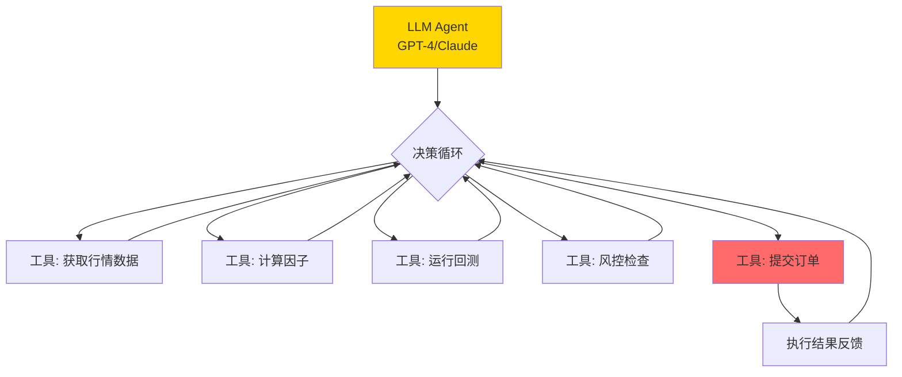

# AI大模型在量化交易中的应用

> - LLM/GPT在量化中的核心价值：**财报文本理解**（PEAD文本因子年化超额29.98%）、**研报摘要与信号提取**、**新闻事件分类**
> - FinBERT/FinGPT等金融领域微调模型在A股情感分类准确率达**85-92%**，显著优于通用模型
> - Agent自动化交易是前沿方向：LLM作为决策核心，调用因子计算/回测/下单工具链，但目前仍处于实验阶段
> - **RAG（检索增强生成）**结合知识库可显著提升研报分析和策略研究效率
> - 多模态因子（K线图识别/图表理解）是新兴方向但A股实证有限，尚未形成稳定Alpha

---

## 一、LLM应用场景矩阵

| 应用场景 | 成熟度 | Alpha贡献 | 代表模型 | A股实证 |
|---------|--------|-----------|---------|---------|
| 财报文本情感 | ✅ 成熟 | IC 4-7% | FinBERT/GPT-3.5 | 华泰文本PEAD年化超额29.98% |
| 新闻事件分类 | ✅ 成熟 | IC 3-6% | BERT-wwm/GPT-4 | 改进版RankIC 6.13% |
| 研报摘要提取 | ✅ 成熟 | 效率提升 | GPT-4/Claude | 人工效率提升5-10倍 |
| 策略代码生成 | 🔄 发展中 | 辅助开发 | GPT-4/Claude Code | 加速原型开发 |
| Agent自动交易 | 🧪 实验 | 不确定 | GPT-4+工具链 | 实验室阶段 |
| 多模态K线识别 | 🧪 实验 | IC 1-3% | Vision模型 | 有限实证 |
| 合规文本解析 | 🔄 发展中 | 风控辅助 | GPT-4/Claude | 监管文件自动解读 |

## 二、金融NLP三代技术演进

| 代际 | 技术 | 代表 | 优劣势 |
|------|------|------|--------|
| 第一代 | 词典+规则 | 正面/负面词典 | 简单但无法处理歧义 |
| 第二代 | 预训练+微调 | BERT-wwm-ext/FinBERT | 高精度(85-92%)但需标注数据 |
| 第三代 | 大模型+提示 | GPT-4/Claude/Qwen | 零样本能力强但成本高 |

## 三、核心应用详解

### 3.1 财报文本情感因子

```python
from transformers import AutoTokenizer, AutoModelForSequenceClassification
import torch

class FinSentimentAnalyzer:
    """金融文本情感分析器"""
    
    def __init__(self, model_name='yiyanghkust/finbert-tone'):
        self.tokenizer = AutoTokenizer.from_pretrained(model_name)
        self.model = AutoModelForSequenceClassification.from_pretrained(
            model_name)
        self.model.eval()
    
    def analyze(self, text: str) -> dict:
        inputs = self.tokenizer(text, return_tensors='pt',
                               truncation=True, max_length=512)
        with torch.no_grad():
            outputs = self.model(**inputs)
        probs = torch.softmax(outputs.logits, dim=1)[0]
        labels = ['negative', 'neutral', 'positive']
        return {l: p.item() for l, p in zip(labels, probs)}
    
    def batch_score(self, texts: list) -> list:
        """批量评分，返回净情感分数(-1到+1)"""
        scores = []
        for text in texts:
            result = self.analyze(text)
            net_score = result['positive'] - result['negative']
            scores.append(net_score)
        return scores
```

### 3.2 LLM研报摘要与信号提取

```python
import openai

class ResearchReportAnalyzer:
    """LLM研报分析器"""
    
    PROMPT_TEMPLATE = """你是一位量化分析师。请从以下研报中提取：
1. 核心观点（看多/看空/中性）
2. 目标价（如有）
3. 关键催化剂
4. 风险因素
5. 量化信号强度（1-5分）

研报内容：
{report_text}

请以JSON格式输出。"""
    
    def __init__(self, api_key, model='gpt-4'):
        self.client = openai.OpenAI(api_key=api_key)
        self.model = model
    
    def analyze_report(self, report_text: str) -> dict:
        response = self.client.chat.completions.create(
            model=self.model,
            messages=[{
                'role': 'user',
                'content': self.PROMPT_TEMPLATE.format(
                    report_text=report_text[:4000])
            }],
            response_format={'type': 'json_object'},
            temperature=0.1
        )
        import json
        return json.loads(response.choices[0].message.content)
```

### 3.3 Agent自动化交易（实验性）



**Agent风险提示**：
- LLM输出不可预测，可能产生灾难性交易决策
- 延迟高（API调用100ms-10s），不适合高频
- 成本高（GPT-4每次决策约$0.01-0.10）
- 目前仅适合低频策略辅助决策，不建议全自动

## 四、常见误区

| 误区 | 真相 |
|------|------|
| "GPT可以直接预测股价" | LLM是语言模型不是时序预测模型，直接预测价格效果差 |
| "大模型取代传统因子" | LLM生成的文本因子IC 4-7%，与传统因子互补而非替代 |
| "Agent可以全自动交易" | 当前LLM的幻觉问题使得全自动交易风险极高，必须有人工监督 |
| "用GPT-4一定比BERT好" | 特定任务(如情感分类)上微调的FinBERT可以媲美甚至超过GPT-4 |
| "多模态=看K线图交易" | K线图识别IC仅1-3%，远低于结构化因子，更适合辅助研究 |

## 五、相关笔记

- [[A股机器学习量化策略]] — 传统ML策略：XGBoost/LSTM/RL
- [[A股另类数据与另类因子]] — 舆情NLP因子、BERT情感因子
- [[A股事件驱动策略]] — 文本PEAD策略
- [[因子评估方法论]] — 文本因子的IC评估
- [[量化研究Python工具链搭建]] — NLP库配置(transformers/torch)

---

## 来源参考

1. 华泰人工智能系列37/51：舆情因子和BERT情感分类/文本PEAD
2. Yang, H. et al. "FinGPT: Open-Source Financial Large Language Models" 2023
3. Araci, D. "FinBERT: Financial Sentiment Analysis with Pre-trained Language Models" 2019
4. OpenAI GPT-4 Technical Report 2023
