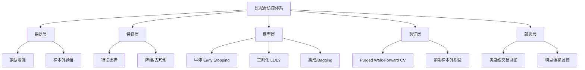
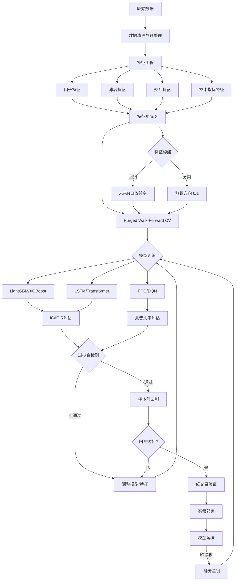
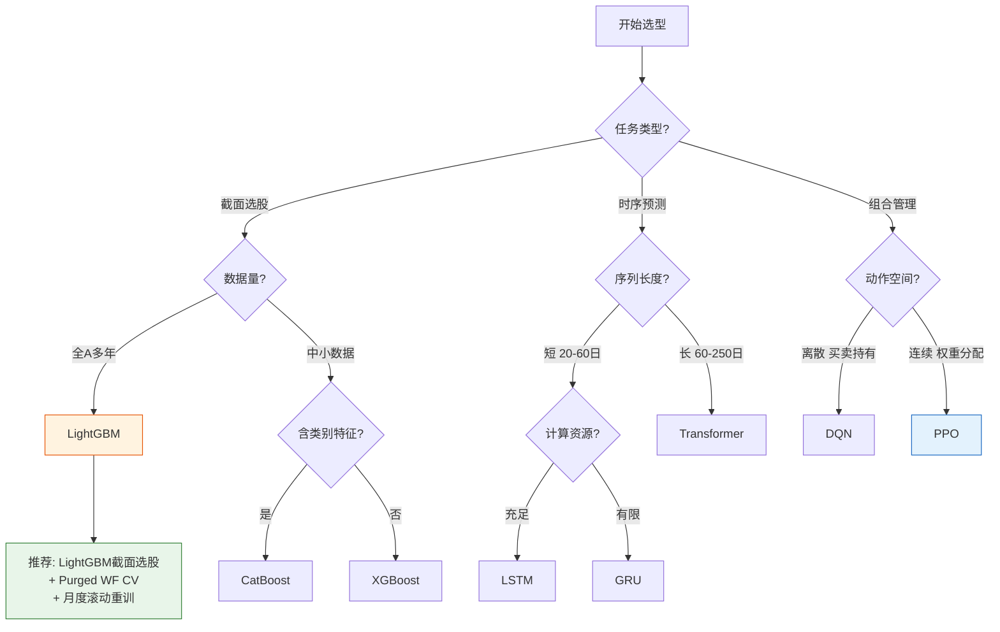

# A股机器学习量化策略

> [!summary] 核心要点
> - **特征工程四类特征**：因子特征（基本面/技术面/另类因子直接作为输入）、滞后特征（过去1-20日收益/量价的shift）、交互特征（因子间乘积/比值捕捉非线性）、技术指标特征（MA/RSI/MACD/布林带等），特征数量通常在100-500维
> - **树模型三剑客**：LightGBM训练速度最快适合大规模A股数据（GOSS+EFB），CatBoost自动处理行业等类别特征（Ordered Boosting防泄漏），XGBoost稳健性最强；A股实证年化超额8%-20%
> - **时序模型局限明确**：LSTM/GRU在A股短序列（<100步）易过拟合，Transformer注意力机制适合长依赖但计算成本高；**必须使用Purged Walk-Forward验证**，普通K折交叉验证在金融时序中完全无效（未来数据泄漏）
> - **强化学习尚在探索期**：PPO在连续动作空间（仓位权重）表现最稳定，DQN适合离散买卖决策，A2C易并行；奖励函数设计用夏普比率比单纯PnL更稳健，但样本效率低、调参困难
> - **过拟合是ML量化的头号杀手**：早停（验证集loss连续N轮不降则停）、L1/L2正则化、特征选择（Permutation Importance筛选）、数据增强（高斯噪声/Bootstrap）、Purged CV缺一不可
> - **模型更新策略**：滚动重训（每周/月用最近N日数据重训）vs 在线增量学习（实时mini-batch更新），需监控概念漂移（Concept Drift），IC/ICIR连续5日低于阈值触发重训

---

## 一、特征工程：从因子到模型输入

特征工程是ML量化策略的地基。好的特征远比复杂的模型重要。A股特征工程需要结合 [[A股基本面因子体系]]、[[A股技术面因子与量价特征]] 和 [[A股另类数据与另类因子]] 中的因子体系，将研究因子转化为模型可消费的特征矩阵。

### 1.1 四类特征体系

| 特征类型 | 说明 | 典型特征 | 数量级 | 注意事项 |
|---------|------|---------|-------|---------|
| **因子特征** | 基本面/技术面/另类因子直接作为模型输入 | EP、BP、ROE、动量、换手率、分析师预期 | 30-80个 | 需标准化（截面Z-Score/Rank） |
| **滞后特征** | 对原始因子做时间滞后（shift） | ret_lag1~lag20、vol_lag1~lag10、turnover_lag5 | 50-200个 | 滞后天数需测试，避免过多引入噪声 |
| **交互特征** | 因子间的乘积、比值、差值 | 动量×波动率、EP/BP、ROE-ROE_lag4 | 20-100个 | 交互爆炸问题，用GBDT自动发现或手动筛选 |
| **技术指标特征** | 经典技术分析指标数值化 | MA5/MA20/MA60、RSI14、MACD、布林带宽度、ATR | 20-50个 | 多周期参数组合会膨胀，需降维 |

### 1.2 特征工程完整Pipeline

```python
import pandas as pd
import numpy as np
import talib

def build_feature_matrix(df: pd.DataFrame) -> pd.DataFrame:
    """
    构建ML量化策略的特征矩阵
    输入df: 包含 open, high, low, close, volume, amount 的日频OHLCV数据
          以及基本面因子列（ep, bp, roe, etc.）
    输出: 带有全部特征的DataFrame，每行对应一个股票-日期观测
    """
    feat = pd.DataFrame(index=df.index)

    # ============ 1. 因子特征（直接使用已有因子值） ============
    factor_cols = ['ep', 'bp', 'roe', 'roa', 'gross_margin',
                   'revenue_growth', 'net_profit_growth',
                   'momentum_1m', 'momentum_3m', 'momentum_6m', 'momentum_12m',
                   'turnover_rate', 'volatility_20d', 'amihud_illiq',
                   'analyst_coverage', 'analyst_revision']
    for col in factor_cols:
        if col in df.columns:
            # 截面标准化（按日期分组Z-Score）
            feat[col] = df.groupby('date')[col].transform(
                lambda x: (x - x.mean()) / (x.std() + 1e-8)
            )

    # ============ 2. 滞后特征 ============
    # 收益率滞后
    for lag in [1, 2, 3, 5, 10, 20]:
        feat[f'ret_lag{lag}'] = df.groupby('stock_code')['close'].pct_change(lag)

    # 成交量滞后（对数化后差分）
    df['log_volume'] = np.log1p(df['volume'])
    for lag in [1, 5, 10, 20]:
        feat[f'vol_ratio_lag{lag}'] = (
            df.groupby('stock_code')['log_volume'].shift(0) -
            df.groupby('stock_code')['log_volume'].shift(lag)
        )

    # 波动率滞后
    for window in [5, 10, 20]:
        feat[f'realized_vol_{window}d'] = (
            df.groupby('stock_code')['close']
            .pct_change()
            .groupby(df['stock_code'])
            .rolling(window).std()
            .reset_index(level=0, drop=True)
        )

    # ============ 3. 交互特征 ============
    # 动量 × 波动率
    if 'momentum_1m' in feat.columns and 'realized_vol_20d' in feat.columns:
        feat['mom1m_x_vol20d'] = feat['momentum_1m'] * feat['realized_vol_20d']

    # 价值 × 质量
    if 'ep' in feat.columns and 'roe' in feat.columns:
        feat['ep_x_roe'] = feat['ep'] * feat['roe']

    # 量价背离
    feat['price_vol_divergence'] = feat.get('ret_lag5', 0) * feat.get('vol_ratio_lag5', 0)

    # 动量加速度（二阶差分）
    if 'ret_lag1' in feat.columns and 'ret_lag5' in feat.columns:
        feat['momentum_acceleration'] = feat['ret_lag1'] - feat['ret_lag5'] / 5

    # ============ 4. 技术指标特征 ============
    # 需要按股票分组计算
    def calc_ta_features(group):
        close = group['close'].values.astype(float)
        high = group['high'].values.astype(float)
        low = group['low'].values.astype(float)
        volume = group['volume'].values.astype(float)

        ta_feat = pd.DataFrame(index=group.index)

        # 均线系统
        for period in [5, 10, 20, 60]:
            ma = talib.SMA(close, timeperiod=period)
            ta_feat[f'ma_ratio_{period}'] = close / (ma + 1e-8) - 1  # 价格偏离度

        # RSI
        ta_feat['rsi_14'] = talib.RSI(close, timeperiod=14)
        ta_feat['rsi_6'] = talib.RSI(close, timeperiod=6)

        # MACD
        macd, signal, hist = talib.MACD(close, fastperiod=12, slowperiod=26, signalperiod=9)
        ta_feat['macd_hist'] = hist
        ta_feat['macd_signal_diff'] = macd - signal

        # 布林带
        upper, middle, lower = talib.BBANDS(close, timeperiod=20, nbdevup=2, nbdevdn=2)
        ta_feat['bb_width'] = (upper - lower) / (middle + 1e-8)
        ta_feat['bb_position'] = (close - lower) / (upper - lower + 1e-8)

        # ATR（平均真实波幅）
        ta_feat['atr_14'] = talib.ATR(high, low, close, timeperiod=14)
        ta_feat['atr_ratio'] = ta_feat['atr_14'] / (close + 1e-8)

        # OBV趋势
        obv = talib.OBV(close, volume)
        ta_feat['obv_slope_10'] = pd.Series(obv, index=group.index).diff(10)

        return ta_feat

    ta_features = df.groupby('stock_code', group_keys=False).apply(calc_ta_features)
    feat = pd.concat([feat, ta_features], axis=1)

    # ============ 5. 后处理 ============
    # 处理无穷值
    feat = feat.replace([np.inf, -np.inf], np.nan)

    # 极端值截断（MAD法，3倍绝对中位差）
    for col in feat.columns:
        median = feat[col].median()
        mad = (feat[col] - median).abs().median()
        feat[col] = feat[col].clip(median - 5 * mad, median + 5 * mad)

    return feat


def build_label(df: pd.DataFrame, horizon: int = 5) -> pd.Series:
    """
    构建预测标签
    horizon: 预测未来N日收益率
    """
    # 未来N日收益率（截面中性化可选）
    future_ret = df.groupby('stock_code')['close'].pct_change(horizon).shift(-horizon)
    return future_ret
```

> [!tip] 特征工程最佳实践
> 1. **先做截面标准化再入模型**：因子原始值量纲不一致，直接输入会导致树模型偏好大数值特征
> 2. **滞后特征的滞后天数本身是超参数**：建议用1/2/3/5/10/20日组合，覆盖短中长周期
> 3. **交互特征不要穷举**：N个因子的两两交互产生 N(N-1)/2 个特征，极易过拟合；优先用GBDT的特征重要性或领域知识筛选
> 4. **技术指标特征需去趋势**：用偏离度（close/MA - 1）而非MA绝对值，保证截面可比性

---

## 二、监督学习：树模型三剑客

树模型（GBDT家族）是当前A股ML量化的主力军，因其天然处理非线性、缺失值、异质特征的能力，在多因子选股中表现稳健。详细的因子评估方法参见 [[因子评估方法论]]。

### 2.1 XGBoost / LightGBM / CatBoost 对比

| 维度 | XGBoost | LightGBM | CatBoost |
|------|---------|----------|----------|
| **核心算法** | 预排序（Pre-sorted）+ 直方图 | GOSS + EFB + Leaf-wise生长 | Ordered Boosting + 对称树 |
| **训练速度** | 基准（1x） | 最快（3-5x） | 中等（0.7-1.2x） |
| **类别特征** | 手动编码（独热/序数） | 内置整数编码 | **自动有序目标编码（防泄漏）** |
| **缺失值** | 自动学习分裂方向 | 自动处理 | 自动处理 |
| **正则化** | L1(alpha) + L2(lambda) | L1 + L2 + min_gain_to_split | L2 + random_strength |
| **A股适用场景** | 中等数据量、需要稳健性 | 大数据量（全A×多年）、速度优先 | 含行业/板块等类别因子、调参少 |
| **过拟合风险** | 中（需仔细调参） | 中高（Leaf-wise易过拟合） | **低（默认参数即可用）** |
| **A股实证超额** | 8%-15%（中证500增强） | 10%-18%（全A选股） | 8%-15%（含行业中性） |

### 2.2 调参指南

**LightGBM 推荐参数范围（A股日频多因子）：**

| 参数 | 推荐范围 | 说明 |
|------|---------|------|
| `num_leaves` | 15-63 | 控制树复杂度，A股建议31起步，防过拟合降至15 |
| `max_depth` | 4-8 | 与num_leaves配合，深度过大易过拟合 |
| `learning_rate` | 0.01-0.05 | 越小越稳但需更多轮次 |
| `n_estimators` | 200-2000 | 配合early_stopping使用 |
| `min_child_samples` | 50-500 | A股截面样本~4000+，建议100-300 |
| `subsample` | 0.6-0.9 | 行采样比例 |
| `colsample_bytree` | 0.5-0.8 | 列采样比例，特征多时降低 |
| `reg_alpha` (L1) | 0-1.0 | 稀疏正则化 |
| `reg_lambda` (L2) | 0-5.0 | 权重衰减 |

### 2.3 完整训练Pipeline

```python
import lightgbm as lgb
import xgboost as xgb
from catboost import CatBoostRegressor, Pool
from sklearn.metrics import mean_squared_error
import numpy as np
import pandas as pd

# =============================================
# 1. 数据准备
# =============================================
def prepare_ml_data(df, feature_cols, label_col='future_ret_5d',
                    train_start='2012-01-01', train_end='2020-12-31',
                    valid_start='2021-01-01', valid_end='2022-12-31',
                    test_start='2023-01-01', test_end='2024-12-31'):
    """
    时间序列严格分割，绝不使用随机分割
    """
    train = df[(df['date'] >= train_start) & (df['date'] <= train_end)]
    valid = df[(df['date'] >= valid_start) & (df['date'] <= valid_end)]
    test  = df[(df['date'] >= test_start)  & (df['date'] <= test_end)]

    X_train, y_train = train[feature_cols], train[label_col]
    X_valid, y_valid = valid[feature_cols], valid[label_col]
    X_test,  y_test  = test[feature_cols],  test[label_col]

    # 删除标签缺失行
    mask_train = y_train.notna()
    mask_valid = y_valid.notna()
    mask_test  = y_test.notna()

    return (X_train[mask_train], y_train[mask_train],
            X_valid[mask_valid], y_valid[mask_valid],
            X_test[mask_test],   y_test[mask_test])


# =============================================
# 2. LightGBM 训练
# =============================================
def train_lightgbm(X_train, y_train, X_valid, y_valid, cat_features=None):
    params = {
        'objective': 'regression',
        'metric': 'rmse',
        'boosting_type': 'gbdt',
        'num_leaves': 31,
        'max_depth': 6,
        'learning_rate': 0.02,
        'n_estimators': 1500,
        'min_child_samples': 200,
        'subsample': 0.8,
        'colsample_bytree': 0.6,
        'reg_alpha': 0.1,        # L1正则
        'reg_lambda': 1.0,       # L2正则
        'verbosity': -1,
        'random_state': 42,
    }

    model = lgb.LGBMRegressor(**params)
    model.fit(
        X_train, y_train,
        eval_set=[(X_valid, y_valid)],
        callbacks=[
            lgb.early_stopping(stopping_rounds=50),
            lgb.log_evaluation(period=100),
        ],
        categorical_feature=cat_features or 'auto',
    )
    return model


# =============================================
# 3. XGBoost 训练
# =============================================
def train_xgboost(X_train, y_train, X_valid, y_valid):
    params = {
        'objective': 'reg:squarederror',
        'eval_metric': 'rmse',
        'booster': 'gbtree',
        'max_depth': 6,
        'learning_rate': 0.02,
        'n_estimators': 1500,
        'min_child_weight': 200,
        'subsample': 0.8,
        'colsample_bytree': 0.6,
        'reg_alpha': 0.1,
        'reg_lambda': 1.0,
        'tree_method': 'hist',    # GPU可用gpu_hist
        'random_state': 42,
    }

    model = xgb.XGBRegressor(**params)
    model.fit(
        X_train, y_train,
        eval_set=[(X_valid, y_valid)],
        verbose=100,
    )
    return model


# =============================================
# 4. CatBoost 训练（自动处理行业等类别特征）
# =============================================
def train_catboost(X_train, y_train, X_valid, y_valid, cat_features=None):
    model = CatBoostRegressor(
        iterations=1500,
        learning_rate=0.02,
        depth=6,
        l2_leaf_reg=3.0,          # L2正则
        random_strength=1.0,      # 随机正则
        min_data_in_leaf=200,
        subsample=0.8,
        colsample_bylevel=0.6,
        early_stopping_rounds=50,
        verbose=100,
        random_seed=42,
        cat_features=cat_features or [],
    )

    model.fit(X_train, y_train, eval_set=(X_valid, y_valid))
    return model


# =============================================
# 5. 随机森林特征重要性分析
# =============================================
from sklearn.ensemble import RandomForestRegressor
from sklearn.inspection import permutation_importance

def analyze_feature_importance(X_train, y_train, X_valid, y_valid, feature_names):
    """
    三种特征重要性方法对比
    """
    rf = RandomForestRegressor(
        n_estimators=500, max_depth=8,
        min_samples_leaf=100, n_jobs=-1, random_state=42
    )
    rf.fit(X_train, y_train)

    # 方法1: 基尼重要性（MDI, Mean Decrease in Impurity）
    # 缺点: 偏向高基数连续特征
    mdi_importance = pd.Series(rf.feature_importances_, index=feature_names)

    # 方法2: Permutation Importance（推荐）
    # 在验证集上置换特征后观察性能下降
    perm_result = permutation_importance(
        rf, X_valid, y_valid,
        n_repeats=10, random_state=42, n_jobs=-1
    )
    perm_importance = pd.Series(perm_result.importances_mean, index=feature_names)

    # 方法3: SHAP值（最精确但最慢）
    try:
        import shap
        explainer = shap.TreeExplainer(rf)
        shap_values = explainer.shap_values(X_valid.iloc[:1000])  # 采样加速
        shap_importance = pd.Series(
            np.abs(shap_values).mean(axis=0), index=feature_names
        )
    except ImportError:
        shap_importance = None

    return {
        'mdi': mdi_importance.sort_values(ascending=False),
        'permutation': perm_importance.sort_values(ascending=False),
        'shap': shap_importance.sort_values(ascending=False) if shap_importance is not None else None,
    }


# =============================================
# 6. 模型评估（IC/ICIR/分层收益）
# =============================================
def evaluate_model(model, X_test, y_test, test_dates, test_stocks):
    """
    评估预测值与真实收益率的截面相关性
    """
    y_pred = model.predict(X_test)

    eval_df = pd.DataFrame({
        'date': test_dates,
        'stock': test_stocks,
        'y_true': y_test,
        'y_pred': y_pred,
    })

    # 逐日计算截面IC（Spearman Rank Correlation）
    daily_ic = eval_df.groupby('date').apply(
        lambda g: g['y_true'].corr(g['y_pred'], method='spearman')
    )

    ic_mean = daily_ic.mean()
    ic_std = daily_ic.std()
    icir = ic_mean / (ic_std + 1e-8)
    ic_positive_ratio = (daily_ic > 0).mean()

    print(f"IC均值: {ic_mean:.4f}")
    print(f"IC标准差: {ic_std:.4f}")
    print(f"ICIR: {icir:.4f}")
    print(f"IC>0比例: {ic_positive_ratio:.2%}")

    # 分层回测（5分组）
    eval_df['quintile'] = eval_df.groupby('date')['y_pred'].transform(
        lambda x: pd.qcut(x, 5, labels=[1, 2, 3, 4, 5], duplicates='drop')
    )
    group_ret = eval_df.groupby(['date', 'quintile'])['y_true'].mean().unstack()

    print(f"\n分层年化收益率:")
    for q in group_ret.columns:
        annual_ret = group_ret[q].mean() * 252
        print(f"  第{q}组: {annual_ret:.2%}")
    print(f"  多空收益: {(group_ret[5].mean() - group_ret[1].mean()) * 252:.2%}")

    return {'ic_mean': ic_mean, 'icir': icir, 'daily_ic': daily_ic}
```

> [!warning] A股树模型关键陷阱
> 1. **绝对不能用随机分割**：金融时序有强自相关，随机train/test分割等于用未来数据预测过去，IC虚高到0.1+全是假象
> 2. **截面预测而非时序预测**：模型输入是「某日所有股票的特征」，输出是「该日所有股票的未来收益预测」，是截面排序任务
> 3. **IC而非MSE才是核心指标**：预测值的绝对精度不重要，排序正确性（选出好股票）才重要
> 4. **行业中性化**：测试时需检查各行业的预测分布，避免模型退化为行业偏好

---

## 三、时序模型：LSTM / GRU / Transformer

时序深度学习模型试图从历史价格/特征序列中提取时间依赖关系。相比树模型处理截面数据，时序模型处理的是每只股票的时间窗口序列。

### 3.1 模型对比

| 维度 | LSTM | GRU | Transformer |
|------|------|-----|-------------|
| **核心机制** | 门控记忆单元（遗忘门/输入门/输出门） | 简化LSTM（重置门/更新门） | 多头自注意力 + 位置编码 |
| **参数量** | 中等 | 较少（约LSTM的75%） | 大（随序列长度平方增长） |
| **长距离依赖** | 中等（梯度消失仍存在） | 中等 | **强（注意力直接建模远距离）** |
| **训练速度** | 慢（无法并行化时间步） | 中等 | **快（全并行）** |
| **A股序列长度** | 20-60日窗口为宜 | 20-60日 | 60-250日可尝试 |
| **实证表现** | R² 0.85-0.95（单股价格预测） | 略优于LSTM | MAE/RMSE比LSTM低约10% |
| **A股主要局限** | 短序列过拟合严重 | 同LSTM | 数据量不足时优势不明显 |

### 3.2 A股时序模型的核心局限

1. **数据量不足**：A股个股历史约6000个交易日（24年），远低于NLP/CV的百万级样本；全A股池化训练可缓解
2. **非平稳性**：市场regime频繁切换（牛市/熊市/震荡），模型在某一regime训练后在另一regime失效
3. **噪声信号比极低**：日频收益率的信噪比约0.05，模型极易拟合噪声而非信号
4. **计算成本高**：Transformer在长序列上的O(n²)复杂度，全A×多年训练需GPU集群
5. **不如树模型稳健**：多数A股实证表明，LightGBM在截面选股上IC高于LSTM 2-5个bp

### 3.3 Purged Walk-Forward 时序交叉验证

**这是金融ML中最重要的验证方法**。标准K折交叉验证在金融时序中完全无效，因为：
- 时间序列有自相关性，相邻样本高度相关
- 标签通常是未来N日收益，训练集和测试集可能共享重叠的标签计算窗口

Purged Walk-Forward 通过「净化期（Purge）」和「禁运期（Embargo）」消除信息泄漏。

```python
import numpy as np
import pandas as pd
from typing import List, Tuple, Generator

class PurgedWalkForwardCV:
    """
    Purged Walk-Forward 交叉验证器

    参数:
        n_splits: 分割数
        train_period: 训练窗口天数
        test_period: 测试窗口天数
        purge_period: 净化期天数（消除标签重叠泄漏）
        embargo_period: 禁运期天数（消除序列自相关泄漏）
    """

    def __init__(self, n_splits: int = 5, train_period: int = 504,
                 test_period: int = 63, purge_period: int = 10,
                 embargo_period: int = 5):
        self.n_splits = n_splits
        self.train_period = train_period       # ~2年
        self.test_period = test_period         # ~3个月
        self.purge_period = purge_period       # ~2周（若标签horizon=5日，purge至少=5）
        self.embargo_period = embargo_period   # ~1周

    def split(self, dates: pd.Series) -> Generator[Tuple[np.ndarray, np.ndarray], None, None]:
        """
        生成训练/测试索引

        dates: 排序后的日期序列（允许重复，即截面数据）
        """
        unique_dates = sorted(dates.unique())
        n_dates = len(unique_dates)

        # 计算每个fold的起始位置
        step = (n_dates - self.train_period - self.test_period) // self.n_splits

        for i in range(self.n_splits):
            # 训练窗口
            train_start_idx = i * step
            train_end_idx = train_start_idx + self.train_period

            # 净化期（purge）：训练集末尾去掉purge_period天
            purged_train_end_idx = train_end_idx - self.purge_period

            # 禁运期（embargo）：测试集起始向后推embargo_period天
            test_start_idx = train_end_idx + self.embargo_period
            test_end_idx = test_start_idx + self.test_period

            if test_end_idx > n_dates:
                break

            # 日期范围
            train_dates = set(unique_dates[train_start_idx:purged_train_end_idx])
            test_dates = set(unique_dates[test_start_idx:test_end_idx])

            # 转换为原始索引
            train_mask = dates.isin(train_dates)
            test_mask = dates.isin(test_dates)

            train_idx = np.where(train_mask)[0]
            test_idx = np.where(test_mask)[0]

            yield train_idx, test_idx

    def __repr__(self):
        return (f"PurgedWalkForwardCV(n_splits={self.n_splits}, "
                f"train={self.train_period}d, test={self.test_period}d, "
                f"purge={self.purge_period}d, embargo={self.embargo_period}d)")


# =============================================
# 使用示例：结合LightGBM
# =============================================
def purged_cv_evaluate(df, feature_cols, label_col, cat_features=None):
    """
    用Purged Walk-Forward CV评估模型稳定性
    """
    cv = PurgedWalkForwardCV(
        n_splits=5,
        train_period=504,    # 2年
        test_period=63,      # 3个月
        purge_period=10,     # 标签horizon=5日 -> purge≥5
        embargo_period=5,
    )

    all_ic = []

    for fold, (train_idx, test_idx) in enumerate(cv.split(df['date'])):
        X_train = df.iloc[train_idx][feature_cols]
        y_train = df.iloc[train_idx][label_col]
        X_test = df.iloc[test_idx][feature_cols]
        y_test = df.iloc[test_idx][label_col]

        # 去除缺失
        mask_tr = y_train.notna()
        mask_te = y_test.notna()

        model = lgb.LGBMRegressor(
            num_leaves=31, max_depth=6, learning_rate=0.02,
            n_estimators=1000, min_child_samples=200,
            subsample=0.8, colsample_bytree=0.6,
            reg_alpha=0.1, reg_lambda=1.0, verbosity=-1,
        )
        model.fit(
            X_train[mask_tr], y_train[mask_tr],
            eval_set=[(X_test[mask_te], y_test[mask_te])],
            callbacks=[lgb.early_stopping(50), lgb.log_evaluation(0)],
            categorical_feature=cat_features or 'auto',
        )

        y_pred = model.predict(X_test[mask_te])

        # 逐日IC
        fold_df = pd.DataFrame({
            'date': df.iloc[test_idx[mask_te.values]]['date'],
            'y_true': y_test[mask_te].values,
            'y_pred': y_pred,
        })
        daily_ic = fold_df.groupby('date').apply(
            lambda g: g['y_true'].corr(g['y_pred'], method='spearman')
        )

        ic_mean = daily_ic.mean()
        all_ic.append(ic_mean)
        print(f"Fold {fold+1}: IC={ic_mean:.4f}, ICIR={ic_mean/(daily_ic.std()+1e-8):.4f}")

    print(f"\n平均IC: {np.mean(all_ic):.4f} ± {np.std(all_ic):.4f}")
    return all_ic
```

### 3.4 LSTM/Transformer 训练代码

```python
import torch
import torch.nn as nn
from torch.utils.data import Dataset, DataLoader
import math

# =============================================
# 数据集：时序窗口
# =============================================
class StockSequenceDataset(Dataset):
    """
    将截面数据转换为时序窗口
    每个样本: (stock_i的过去seq_len日特征) -> (stock_i的未来收益)
    """
    def __init__(self, df, feature_cols, label_col, seq_len=20):
        self.seq_len = seq_len
        self.samples = []

        for stock, group in df.groupby('stock_code'):
            group = group.sort_values('date')
            features = group[feature_cols].values.astype(np.float32)
            labels = group[label_col].values.astype(np.float32)

            for i in range(seq_len, len(group)):
                if not np.isnan(labels[i]):
                    x = features[i-seq_len:i]      # (seq_len, n_features)
                    y = labels[i]                    # scalar
                    if not np.any(np.isnan(x)):
                        self.samples.append((x, y))

    def __len__(self):
        return len(self.samples)

    def __getitem__(self, idx):
        x, y = self.samples[idx]
        return torch.FloatTensor(x), torch.FloatTensor([y])


# =============================================
# LSTM 模型
# =============================================
class LSTMPredictor(nn.Module):
    def __init__(self, input_dim, hidden_dim=128, num_layers=2, dropout=0.3):
        super().__init__()
        self.lstm = nn.LSTM(
            input_dim, hidden_dim, num_layers,
            batch_first=True, dropout=dropout
        )
        self.fc = nn.Sequential(
            nn.Linear(hidden_dim, 64),
            nn.ReLU(),
            nn.Dropout(dropout),
            nn.Linear(64, 1),
        )

    def forward(self, x):
        # x: (batch, seq_len, input_dim)
        lstm_out, (h_n, c_n) = self.lstm(x)
        last_hidden = lstm_out[:, -1, :]   # 取最后时间步
        return self.fc(last_hidden)


# =============================================
# Transformer 模型
# =============================================
class PositionalEncoding(nn.Module):
    def __init__(self, d_model, max_len=500):
        super().__init__()
        pe = torch.zeros(max_len, d_model)
        position = torch.arange(0, max_len).unsqueeze(1).float()
        div_term = torch.exp(torch.arange(0, d_model, 2).float() * (-math.log(10000.0) / d_model))
        pe[:, 0::2] = torch.sin(position * div_term)
        pe[:, 1::2] = torch.cos(position * div_term)
        self.register_buffer('pe', pe.unsqueeze(0))

    def forward(self, x):
        return x + self.pe[:, :x.size(1)]


class TransformerPredictor(nn.Module):
    def __init__(self, input_dim, d_model=128, nhead=8, num_layers=3, dropout=0.3):
        super().__init__()
        self.input_proj = nn.Linear(input_dim, d_model)
        self.pos_encoder = PositionalEncoding(d_model)
        encoder_layer = nn.TransformerEncoderLayer(
            d_model=d_model, nhead=nhead,
            dim_feedforward=d_model * 4,
            dropout=dropout, batch_first=True
        )
        self.transformer = nn.TransformerEncoder(encoder_layer, num_layers=num_layers)
        self.fc = nn.Sequential(
            nn.Linear(d_model, 64),
            nn.ReLU(),
            nn.Dropout(dropout),
            nn.Linear(64, 1),
        )

    def forward(self, x):
        # x: (batch, seq_len, input_dim)
        x = self.input_proj(x)
        x = self.pos_encoder(x)
        x = self.transformer(x)
        x = x[:, -1, :]  # 取最后位置的输出
        return self.fc(x)


# =============================================
# 训练循环
# =============================================
def train_deep_model(model, train_loader, valid_loader,
                     lr=1e-3, epochs=100, patience=10, device='cuda'):
    """
    带早停的深度模型训练
    """
    model = model.to(device)
    optimizer = torch.optim.AdamW(model.parameters(), lr=lr, weight_decay=1e-4)
    scheduler = torch.optim.lr_scheduler.CosineAnnealingLR(optimizer, T_max=epochs)
    criterion = nn.MSELoss()

    best_val_loss = float('inf')
    patience_counter = 0
    best_state = None

    for epoch in range(epochs):
        # 训练
        model.train()
        train_loss = 0
        for X_batch, y_batch in train_loader:
            X_batch, y_batch = X_batch.to(device), y_batch.to(device)
            optimizer.zero_grad()
            pred = model(X_batch)
            loss = criterion(pred, y_batch)
            loss.backward()
            torch.nn.utils.clip_grad_norm_(model.parameters(), max_norm=1.0)  # 梯度裁剪
            optimizer.step()
            train_loss += loss.item()

        # 验证
        model.eval()
        val_loss = 0
        with torch.no_grad():
            for X_batch, y_batch in valid_loader:
                X_batch, y_batch = X_batch.to(device), y_batch.to(device)
                pred = model(X_batch)
                val_loss += criterion(pred, y_batch).item()

        train_loss /= len(train_loader)
        val_loss /= len(valid_loader)
        scheduler.step()

        if epoch % 10 == 0:
            print(f"Epoch {epoch}: train_loss={train_loss:.6f}, val_loss={val_loss:.6f}")

        # 早停
        if val_loss < best_val_loss:
            best_val_loss = val_loss
            patience_counter = 0
            best_state = model.state_dict().copy()
        else:
            patience_counter += 1
            if patience_counter >= patience:
                print(f"早停于 Epoch {epoch}, best_val_loss={best_val_loss:.6f}")
                break

    model.load_state_dict(best_state)
    return model
```

> [!important] 时序模型 vs 树模型的选型建议
> - **截面选股任务（推荐树模型）**：预测「某日所有股票中谁涨得多」，本质是排序问题，LightGBM更稳健
> - **单股趋势预测（可尝试时序模型）**：预测「某股票未来走势」，LSTM/Transformer可捕捉时间模式
> - **混合方案（推荐）**：用LSTM提取时序特征（如隐状态向量），喂入LightGBM做截面排序

---

## 四、强化学习：组合管理

强化学习（RL）将投资组合管理建模为马尔可夫决策过程（MDP），智能体通过与市场环境交互学习最优持仓策略。

### 4.1 MDP建模

| 组件 | 设计 | 说明 |
|------|------|------|
| **状态空间 S** | `[价格特征, 持仓信息, 账户信息]` | 见下方详细设计 |
| **动作空间 A** | 离散：{买入, 卖出, 持有} 或 连续：各资产权重向量 | 离散用DQN，连续用PPO/A2C |
| **转移概率 P** | 由市场环境决定（不可控） | 模拟环境根据历史数据回放 |
| **奖励函数 R** | PnL / 夏普比率 / 风险调整收益 | 核心设计难点 |
| **折扣因子 γ** | 0.99-0.999 | 金融任务需长视野 |

### 4.2 状态空间设计

```python
import numpy as np
import gymnasium as gym
from gymnasium import spaces

class AStockPortfolioEnv(gym.Env):
    """
    A股组合管理强化学习环境
    """

    def __init__(self, df, stock_list, initial_capital=1_000_000,
                 transaction_cost=0.0015, stamp_tax=0.0005):
        super().__init__()

        self.df = df
        self.stock_list = stock_list
        self.n_stocks = len(stock_list)
        self.initial_capital = initial_capital
        self.transaction_cost = transaction_cost  # 佣金（双边）
        self.stamp_tax = stamp_tax                # 印花税（卖出）

        # ====== 状态空间设计 ======
        # 1. 价格特征: 每只股票 × 每个特征
        n_price_features = 10  # 收益率/波动率/RSI/MACD/换手率等
        # 2. 持仓信息: 各股票当前权重
        # 3. 账户信息: 现金比例, 总市值变化率
        state_dim = self.n_stocks * n_price_features + self.n_stocks + 2

        self.observation_space = spaces.Box(
            low=-np.inf, high=np.inf,
            shape=(state_dim,), dtype=np.float32
        )

        # ====== 动作空间设计 ======
        # 连续动作: 各股票的目标权重（经Softmax归一化）
        self.action_space = spaces.Box(
            low=-1.0, high=1.0,
            shape=(self.n_stocks,), dtype=np.float32
        )

        self.reset()

    def _get_state(self):
        """构建状态向量"""
        date = self.dates[self.current_step]
        day_data = self.df[self.df['date'] == date]

        # 价格特征（截面标准化后的因子值）
        price_features = []
        for stock in self.stock_list:
            stock_data = day_data[day_data['stock_code'] == stock]
            if len(stock_data) > 0:
                feats = stock_data[self.feature_cols].values.flatten()
            else:
                feats = np.zeros(len(self.feature_cols))
            price_features.append(feats)
        price_features = np.concatenate(price_features)

        # 持仓权重
        total_value = self.cash + np.sum(self.holdings * self._get_prices())
        weights = (self.holdings * self._get_prices()) / (total_value + 1e-8)

        # 账户信息
        cash_ratio = self.cash / (total_value + 1e-8)
        value_change = total_value / self.prev_total_value - 1

        state = np.concatenate([
            price_features,
            weights,
            [cash_ratio, value_change]
        ]).astype(np.float32)

        return state

    def step(self, action):
        """执行交易动作"""
        # 将动作转为目标权重（Softmax归一化）
        target_weights = np.exp(action) / np.sum(np.exp(action) + 1e-8)

        # 计算调仓交易成本
        current_prices = self._get_prices()
        total_value = self.cash + np.sum(self.holdings * current_prices)
        target_holdings = (target_weights * total_value) / (current_prices + 1e-8)

        # 交易成本
        trade_amounts = np.abs(target_holdings - self.holdings) * current_prices
        buy_cost = np.sum(trade_amounts[target_holdings > self.holdings]) * self.transaction_cost
        sell_amounts = trade_amounts[target_holdings < self.holdings]
        sell_cost = np.sum(sell_amounts) * (self.transaction_cost + self.stamp_tax)

        self.holdings = target_holdings.astype(int)  # A股整手（简化）
        self.cash = total_value - np.sum(self.holdings * current_prices) - buy_cost - sell_cost

        # 前进一步
        self.current_step += 1
        self.prev_total_value = total_value

        # 新的总市值
        new_prices = self._get_prices()
        new_total_value = self.cash + np.sum(self.holdings * new_prices)

        # ====== 奖励函数 ======
        reward = self._compute_reward(new_total_value, total_value)

        done = self.current_step >= len(self.dates) - 1
        truncated = False
        info = {'total_value': new_total_value, 'cash': self.cash}

        return self._get_state(), reward, done, truncated, info

    def _compute_reward(self, new_value, old_value):
        """见4.3节奖励函数设计"""
        # 默认使用风险调整收益
        ret = (new_value - old_value) / (old_value + 1e-8)
        self.returns_history.append(ret)

        if len(self.returns_history) < 20:
            return ret  # 初期用简单收益

        # 滚动夏普比率奖励
        recent_returns = np.array(self.returns_history[-20:])
        sharpe = np.mean(recent_returns) / (np.std(recent_returns) + 1e-8) * np.sqrt(252)

        # 最大回撤惩罚
        cumulative = np.cumprod(1 + recent_returns)
        max_dd = np.min(cumulative / np.maximum.accumulate(cumulative) - 1)

        reward = sharpe + 0.5 * max_dd  # 回撤为负值，起惩罚作用
        return reward

    def reset(self, seed=None, options=None):
        super().reset(seed=seed)
        self.current_step = 0
        self.cash = self.initial_capital
        self.holdings = np.zeros(self.n_stocks)
        self.prev_total_value = self.initial_capital
        self.returns_history = []
        return self._get_state(), {}


### 4.3 奖励函数设计

三种奖励函数的对比：

| 奖励类型 | 公式 | 优点 | 缺点 | 推荐场景 |
|---------|------|------|------|---------|
| **简单PnL** | `r = (V_t - V_{t-1}) / V_{t-1}` | 直观，收敛快 | 鼓励高风险行为，忽略波动 | 快速原型验证 |
| **夏普比率** | `r = mean(R) / std(R) × √252` | 平衡收益与风险 | 短窗口估计不稳定，非即时信号 | 中低频组合管理 |
| **风险调整** | `r = Sharpe + λ × MaxDD` | 综合考虑收益/风险/回撤 | 超参数λ需调优 | **推荐默认方案** |
```

### 4.4 DQN / PPO / A2C 对比

| 维度 | DQN | PPO | A2C |
|------|-----|-----|-----|
| **方法类型** | 基于价值（Value-based） | 策略梯度（Policy Gradient） | 演员-评论家（Actor-Critic） |
| **动作空间** | **离散**（买/卖/持有） | **连续**（目标权重向量） | 连续/离散 |
| **样本效率** | 高（经验回放） | 中等 | 低（on-policy） |
| **稳定性** | 中（需target network） | **高（clip机制限制更新幅度）** | 中（方差较大） |
| **并行训练** | 否 | 是 | **是（多环境并行）** |
| **A股推荐** | 单股择时（3个动作） | **组合管理（权重分配）** | 高频日内（快速并行） |
| **框架** | Stable-Baselines3 | Stable-Baselines3 / RLlib | Stable-Baselines3 |

```python
# PPO训练示例（使用Stable-Baselines3）
from stable_baselines3 import PPO
from stable_baselines3.common.vec_env import DummyVecEnv

# 创建向量化环境
env = DummyVecEnv([lambda: AStockPortfolioEnv(df, stock_list)])

# PPO参数配置
model = PPO(
    "MlpPolicy",
    env,
    learning_rate=3e-4,
    n_steps=2048,           # 每次更新前收集的步数
    batch_size=64,
    n_epochs=10,            # 每批数据的训练轮数
    gamma=0.99,             # 折扣因子
    gae_lambda=0.95,        # GAE参数
    clip_range=0.2,         # PPO裁剪范围
    ent_coef=0.01,          # 熵系数（鼓励探索）
    vf_coef=0.5,            # 价值函数系数
    max_grad_norm=0.5,
    verbose=1,
    tensorboard_log="./rl_logs/",
)

# 训练（100万步）
model.learn(total_timesteps=1_000_000)

# 评估
obs, _ = env.reset()
total_reward = 0
for _ in range(252):  # 一年交易日
    action, _ = model.predict(obs, deterministic=True)
    obs, reward, done, truncated, info = env.step(action)
    total_reward += reward[0]
    if done[0]:
        break
print(f"年度总奖励: {total_reward:.4f}")
```

> [!caution] 强化学习在A股的现实挑战
> 1. **样本效率极低**：需要数百万步交互才能收敛，而A股历史数据有限
> 2. **环境模拟偏差**：回放历史数据假设「交易不影响价格」，与真实市场有gap
> 3. **奖励延迟**：组合管理的收益需数周/月才能体现，信用分配（Credit Assignment）困难
> 4. **超参数敏感**：学习率、clip_range、奖励函数权重微调即可导致策略完全不同
> 5. **尚无A股大规模成功案例**：学术论文多为小样本实验，实盘稳定盈利的RL策略极少公开

---

## 五、过拟合防控：ML量化的头号敌人

过拟合在量化交易中比其他ML领域更危险——模型在回测中看起来年化50%+，实盘一上就亏钱。这与 [[A股回测框架实战与避坑指南]] 中的回测陷阱直接相关。

### 5.1 五层防控体系



### 5.2 各方法详解与代码

#### 方法1: 早停（Early Stopping）

```python
# LightGBM 早停
model = lgb.LGBMRegressor(n_estimators=5000, learning_rate=0.01)
model.fit(
    X_train, y_train,
    eval_set=[(X_valid, y_valid)],
    callbacks=[
        lgb.early_stopping(stopping_rounds=50),  # 50轮不提升即停
        lgb.log_evaluation(100),
    ],
)
print(f"最佳迭代轮数: {model.best_iteration_}")

# PyTorch 早停（通用模板）
class EarlyStopping:
    def __init__(self, patience=10, min_delta=1e-6):
        self.patience = patience
        self.min_delta = min_delta
        self.counter = 0
        self.best_loss = None
        self.should_stop = False

    def __call__(self, val_loss):
        if self.best_loss is None or val_loss < self.best_loss - self.min_delta:
            self.best_loss = val_loss
            self.counter = 0
        else:
            self.counter += 1
            if self.counter >= self.patience:
                self.should_stop = True
        return self.should_stop
```

#### 方法2: 正则化

```python
# L1正则（Lasso）—— 自动特征选择，产生稀疏模型
# L2正则（Ridge）—— 权重趋近0但不精确为0，防止过大权重
# ElasticNet —— L1+L2组合

# 树模型中的正则化参数
lgb_params = {
    'reg_alpha': 0.1,          # L1，值越大越稀疏
    'reg_lambda': 1.0,         # L2，值越大权重越小
    'min_gain_to_split': 0.01, # 最小分裂增益
    'min_child_samples': 200,  # 叶子最少样本数（A股建议200+）
    'max_depth': 6,            # 限制树深度
    'num_leaves': 31,          # 限制叶子数（< 2^max_depth）
}

# 深度模型中的正则化
# 1. Weight Decay（等效L2）
optimizer = torch.optim.AdamW(model.parameters(), lr=1e-3, weight_decay=1e-4)
# 2. Dropout（训练时随机丢弃神经元）
nn.Dropout(p=0.3)  # 30%丢弃率
# 3. Batch Normalization（隐式正则）
nn.BatchNorm1d(hidden_dim)
```

#### 方法3: 特征选择

```python
from sklearn.inspection import permutation_importance
import lightgbm as lgb

def robust_feature_selection(X_train, y_train, X_valid, y_valid, feature_names,
                             n_repeats=5, threshold_quantile=0.5):
    """
    基于多轮Permutation Importance的稳健特征选择
    """
    model = lgb.LGBMRegressor(
        num_leaves=31, max_depth=6, learning_rate=0.02,
        n_estimators=500, min_child_samples=200,
        reg_alpha=0.1, reg_lambda=1.0, verbosity=-1,
    )
    model.fit(X_train, y_train)

    # 在验证集上计算Permutation Importance
    result = permutation_importance(
        model, X_valid, y_valid,
        n_repeats=n_repeats,
        scoring='neg_mean_squared_error',
        random_state=42, n_jobs=-1,
    )

    importance_df = pd.DataFrame({
        'feature': feature_names,
        'importance_mean': result.importances_mean,
        'importance_std': result.importances_std,
    }).sort_values('importance_mean', ascending=False)

    # 筛选：重要性均值 > 中位数，且标准差小于均值（稳定）
    threshold = importance_df['importance_mean'].quantile(threshold_quantile)
    selected = importance_df[
        (importance_df['importance_mean'] > threshold) &
        (importance_df['importance_std'] < importance_df['importance_mean'].abs())
    ]

    print(f"原始特征数: {len(feature_names)}")
    print(f"筛选后特征数: {len(selected)}")
    print(f"\nTop 20特征:")
    print(selected.head(20).to_string())

    return selected['feature'].tolist()
```

#### 方法4: 数据增强

```python
def augment_financial_data(X, y, methods=['noise', 'bootstrap'], noise_std=0.01):
    """
    金融数据增强
    """
    X_aug_list = [X]
    y_aug_list = [y]

    if 'noise' in methods:
        # 高斯噪声注入（模拟微小市场波动）
        noise = np.random.normal(0, noise_std, X.shape)
        X_aug_list.append(X + noise)
        y_aug_list.append(y)

    if 'bootstrap' in methods:
        # 块Bootstrap（保持时间结构的重采样）
        block_size = 20  # 约1个月
        n_blocks = len(X) // block_size
        sampled_blocks = np.random.choice(n_blocks, size=n_blocks, replace=True)
        indices = np.concatenate([
            np.arange(b * block_size, (b + 1) * block_size)
            for b in sampled_blocks
        ])
        indices = indices[indices < len(X)]
        X_aug_list.append(X[indices])
        y_aug_list.append(y[indices])

    if 'mixup' in methods:
        # Mixup（样本插值，alpha=0.2）
        alpha = 0.2
        lam = np.random.beta(alpha, alpha, size=len(X))
        indices = np.random.permutation(len(X))
        lam = lam.reshape(-1, 1)
        X_mix = lam * X + (1 - lam) * X[indices]
        y_mix = lam.flatten() * y + (1 - lam.flatten()) * y[indices]
        X_aug_list.append(X_mix)
        y_aug_list.append(y_mix)

    return np.vstack(X_aug_list), np.concatenate(y_aug_list)
```

#### 方法5: 过拟合检测

```python
def detect_overfitting(train_ic_series, valid_ic_series, test_ic_series=None):
    """
    过拟合检测仪表盘
    """
    results = {}

    # 1. IC衰减比（训练IC vs 验证IC）
    train_ic = train_ic_series.mean()
    valid_ic = valid_ic_series.mean()
    ic_decay = 1 - valid_ic / (train_ic + 1e-8)
    results['ic_decay_ratio'] = ic_decay

    # 2. ICIR衰减
    train_icir = train_ic_series.mean() / (train_ic_series.std() + 1e-8)
    valid_icir = valid_ic_series.mean() / (valid_ic_series.std() + 1e-8)
    results['train_icir'] = train_icir
    results['valid_icir'] = valid_icir

    # 3. 过拟合信号判断
    signals = []
    if ic_decay > 0.5:
        signals.append("严重过拟合: 验证IC衰减超过50%")
    elif ic_decay > 0.3:
        signals.append("中度过拟合: 验证IC衰减30%-50%")

    if valid_icir < 0.3:
        signals.append("警告: 验证集ICIR<0.3，策略不稳定")

    if test_ic_series is not None:
        test_ic = test_ic_series.mean()
        oos_decay = 1 - test_ic / (valid_ic + 1e-8)
        results['oos_ic_decay'] = oos_decay
        if oos_decay > 0.3:
            signals.append("样本外再衰减: 可能存在验证集过拟合")

    # 4. IC序列自相关（高自相关暗示模型在拟合趋势而非Alpha）
    ic_autocorr = valid_ic_series.autocorr(lag=1)
    results['ic_autocorr_lag1'] = ic_autocorr
    if abs(ic_autocorr) > 0.5:
        signals.append("IC序列高自相关: 模型可能拟合了市场趋势")

    results['signals'] = signals

    print("=== 过拟合检测报告 ===")
    print(f"训练IC: {train_ic:.4f}, ICIR: {train_icir:.4f}")
    print(f"验证IC: {valid_ic:.4f}, ICIR: {valid_icir:.4f}")
    print(f"IC衰减比: {ic_decay:.2%}")
    print(f"IC自相关(lag1): {ic_autocorr:.4f}")
    for s in signals:
        print(f"  ⚠ {s}")
    if not signals:
        print("  ✓ 未检测到明显过拟合信号")

    return results
```

> [!abstract] 过拟合防控速查清单
> - [ ] 是否使用了时间序列分割（非随机分割）？
> - [ ] 是否预留了完全独立的测试集（从未参与任何决策）？
> - [ ] 训练IC与验证IC的衰减比是否 < 30%？
> - [ ] 特征数量是否合理（N_features < N_samples / 20）？
> - [ ] 是否有早停机制？
> - [ ] 是否做了正则化（L1/L2/Dropout）？
> - [ ] Purged CV的各fold IC是否稳定（std < mean）？
> - [ ] 样本外收益是否与回测收益在同一量级（衰减 < 50%）？

---

## 六、在线学习与模型更新部署

模型训练完成只是起点。A股市场regime持续变化，模型必须定期更新。这部分与 [[策略绩效评估与统计检验]] 中的动态监控相衔接。

### 6.1 模型更新策略对比

| 策略 | 说明 | 更新频率 | 优点 | 缺点 | 适用场景 |
|------|------|---------|------|------|---------|
| **定期批量重训** | 每周/月用最近N年数据从头训练 | 周/月 | 简单稳健，完全刷新 | 计算成本高，响应慢 | 日频低频策略 |
| **滚动窗口重训** | 固定窗口长度（如2年），滚动前移 | 周/月 | 自适应近期市场状态 | 窗口长度是超参数 | **推荐默认方案** |
| **在线增量学习** | 每日/每批新数据增量更新模型参数 | 日/小时 | 快速适应，资源低 | 灾难性遗忘风险 | 高频/快速变化市场 |
| **集成更新** | 维护多个不同时期训练的模型，加权融合 | 持续 | 稳健，多样化 | 复杂度高 | 大型量化团队 |

### 6.2 概念漂移监控与自动重训

```python
import numpy as np
import pandas as pd
from datetime import datetime, timedelta

class ModelMonitor:
    """
    模型性能监控与自动重训触发器
    """

    def __init__(self, ic_threshold=0.02, icir_threshold=0.3,
                 alert_window=5, retrain_window=10):
        self.ic_threshold = ic_threshold         # IC低于此值报警
        self.icir_threshold = icir_threshold     # ICIR低于此值报警
        self.alert_window = alert_window         # 连续N日触发预警
        self.retrain_window = retrain_window     # 连续N日触发重训
        self.daily_ic_log = []
        self.alerts = []

    def update(self, date, y_true, y_pred):
        """
        每日更新监控指标
        """
        # 计算当日截面IC
        ic = pd.Series(y_true).corr(pd.Series(y_pred), method='spearman')
        self.daily_ic_log.append({'date': date, 'ic': ic})

        # 滚动IC统计
        recent_ic = pd.DataFrame(self.daily_ic_log).tail(20)['ic']
        rolling_ic_mean = recent_ic.mean()
        rolling_icir = rolling_ic_mean / (recent_ic.std() + 1e-8)

        # 检测异常
        alert = {
            'date': date,
            'daily_ic': ic,
            'rolling_ic_mean': rolling_ic_mean,
            'rolling_icir': rolling_icir,
            'status': 'normal',
        }

        # 连续N日IC低于阈值
        recent_n = pd.DataFrame(self.daily_ic_log).tail(self.alert_window)['ic']
        if len(recent_n) >= self.alert_window and (recent_n < self.ic_threshold).all():
            alert['status'] = 'warning'

        recent_m = pd.DataFrame(self.daily_ic_log).tail(self.retrain_window)['ic']
        if len(recent_m) >= self.retrain_window and (recent_m < self.ic_threshold).all():
            alert['status'] = 'retrain_needed'

        self.alerts.append(alert)
        return alert

    def should_retrain(self):
        """是否需要触发重训"""
        if self.alerts and self.alerts[-1]['status'] == 'retrain_needed':
            return True
        return False

    def get_report(self):
        """生成监控报告"""
        df = pd.DataFrame(self.daily_ic_log)
        if len(df) == 0:
            return "无数据"

        report = {
            '监控天数': len(df),
            '平均IC': df['ic'].mean(),
            'IC标准差': df['ic'].std(),
            'ICIR': df['ic'].mean() / (df['ic'].std() + 1e-8),
            'IC>0比例': (df['ic'] > 0).mean(),
            '最近5日IC均值': df.tail(5)['ic'].mean(),
            '预警次数': sum(1 for a in self.alerts if a['status'] == 'warning'),
            '重训触发次数': sum(1 for a in self.alerts if a['status'] == 'retrain_needed'),
        }
        return report


# =============================================
# 滚动重训Pipeline
# =============================================
def rolling_retrain_pipeline(df, feature_cols, label_col,
                             train_window=504, retrain_freq=21,
                             purge_days=10):
    """
    滚动窗口重训Pipeline
    每retrain_freq天用最近train_window天数据重训模型

    参数:
        train_window: 训练窗口（交易日），504≈2年
        retrain_freq: 重训频率（交易日），21≈1个月
        purge_days: 净化期天数
    """
    unique_dates = sorted(df['date'].unique())
    monitor = ModelMonitor()

    all_predictions = []
    current_model = None
    last_retrain_idx = 0

    for i in range(train_window + purge_days, len(unique_dates)):
        today = unique_dates[i]

        # 判断是否需要重训
        need_retrain = (
            current_model is None or
            (i - last_retrain_idx) >= retrain_freq or
            monitor.should_retrain()
        )

        if need_retrain:
            # 训练窗口（含净化期）
            train_end_idx = i - purge_days
            train_start_idx = max(0, train_end_idx - train_window)

            train_dates = unique_dates[train_start_idx:train_end_idx]
            train_data = df[df['date'].isin(train_dates)]

            X_tr = train_data[feature_cols]
            y_tr = train_data[label_col]
            mask = y_tr.notna()

            current_model = lgb.LGBMRegressor(
                num_leaves=31, max_depth=6, learning_rate=0.02,
                n_estimators=500, min_child_samples=200,
                reg_alpha=0.1, reg_lambda=1.0, verbosity=-1,
            )
            current_model.fit(X_tr[mask], y_tr[mask])
            last_retrain_idx = i

        # 当日预测
        today_data = df[df['date'] == today]
        if len(today_data) == 0:
            continue

        X_today = today_data[feature_cols]
        y_pred = current_model.predict(X_today)

        # 记录预测
        pred_df = today_data[['date', 'stock_code']].copy()
        pred_df['y_pred'] = y_pred
        pred_df['y_true'] = today_data[label_col].values
        all_predictions.append(pred_df)

        # 监控更新（用延迟标签，实际中需等标签兑现后才能计算IC）
        mask_valid = pred_df['y_true'].notna()
        if mask_valid.sum() > 10:
            alert = monitor.update(
                today,
                pred_df.loc[mask_valid, 'y_true'].values,
                pred_df.loc[mask_valid, 'y_pred'].values,
            )
            if alert['status'] != 'normal':
                print(f"[{today}] 状态: {alert['status']}, "
                      f"IC={alert['daily_ic']:.4f}, "
                      f"滚动IC={alert['rolling_ic_mean']:.4f}")

    print("\n" + "="*50)
    print("监控报告:")
    for k, v in monitor.get_report().items():
        print(f"  {k}: {v}")

    return pd.concat(all_predictions), monitor
```

---

## 七、参数速查表

### 7.1 模型选型速查

| 场景 | 推荐模型 | 理由 |
|------|---------|------|
| A股截面多因子选股 | **LightGBM** | 速度快、处理高维特征强、IC稳定 |
| 含行业/板块类别因子 | **CatBoost** | 自动处理类别特征，调参少 |
| 特征重要性分析 | **随机森林 + SHAP** | 可解释性强，Permutation Importance可靠 |
| 单股价格预测/时序特征 | **LSTM / GRU** | 捕捉时序依赖，短窗口（20-60日） |
| 长序列时序建模 | **Transformer** | 注意力机制建模长距离依赖 |
| 组合权重优化 | **PPO** | 连续动作空间，训练稳定 |
| 单股买卖择时 | **DQN** | 离散动作，经验回放样本高效 |
| 快速原型验证 | **XGBoost** | 生态最成熟，调参文档最多 |

### 7.2 超参数速查

| 模型 | 关键参数 | A股推荐值 | 备注 |
|------|---------|----------|------|
| LightGBM | num_leaves | 15-31 | 越小越防过拟合 |
| LightGBM | learning_rate | 0.01-0.03 | 配合n_estimators=1000+ |
| LightGBM | min_child_samples | 200-500 | A股截面样本4000+ |
| XGBoost | max_depth | 4-6 | 不宜超过8 |
| CatBoost | l2_leaf_reg | 1.0-5.0 | CatBoost唯一关键参数 |
| LSTM | hidden_dim | 64-256 | 过大易过拟合 |
| LSTM | seq_len | 20-60 | A股日频建议20-40 |
| Transformer | nhead | 4-8 | d_model需整除nhead |
| Transformer | num_layers | 2-4 | A股数据量有限不宜过深 |
| PPO | clip_range | 0.1-0.3 | 默认0.2 |
| PPO | learning_rate | 1e-4 - 3e-4 | 金融任务偏小 |
| 所有树模型 | early_stopping | 30-100 | 必须开启 |
| 所有深度模型 | dropout | 0.2-0.5 | 金融任务偏高 |

### 7.3 验证指标速查

| 指标 | 公式/说明 | 优秀 | 合格 | 不及格 |
|------|----------|------|------|--------|
| **IC均值** | 截面Spearman相关系数 | > 0.05 | 0.03-0.05 | < 0.03 |
| **ICIR** | IC均值 / IC标准差 | > 0.5 | 0.3-0.5 | < 0.3 |
| **IC>0比例** | IC为正的交易日占比 | > 60% | 52%-60% | < 52% |
| **多空年化收益** | Top组 - Bottom组 | > 20% | 10%-20% | < 10% |
| **IC衰减比** | 1 - 验证IC / 训练IC | < 20% | 20%-40% | > 40% |

---

## 八、ML策略全流程Pipeline



### 模型选型决策树



---

## 九、完整端到端示例

以下代码整合全流程，从数据加载到模型训练、评估、监控。

```python
"""
A股机器学习量化策略 —— 端到端示例
模型: LightGBM 截面选股
验证: Purged Walk-Forward CV
部署: 滚动月度重训 + IC监控
"""

import pandas as pd
import numpy as np
import lightgbm as lgb
from pathlib import Path

# ============================================================
# 1. 数据加载（假设已有清洗后的因子宽表）
# ============================================================
# df columns: date, stock_code, open, high, low, close, volume,
#             ep, bp, roe, momentum_1m, turnover_rate, ...
#             industry (类别), future_ret_5d (标签)

# df = pd.read_parquet('factor_wide_table.parquet')

# ============================================================
# 2. 特征工程
# ============================================================
# feature_matrix = build_feature_matrix(df)  # 调用第一节的函数
# df = pd.concat([df, feature_matrix], axis=1)
# feature_cols = feature_matrix.columns.tolist()

# ============================================================
# 3. Purged Walk-Forward 评估
# ============================================================
# ic_scores = purged_cv_evaluate(df, feature_cols, 'future_ret_5d')

# ============================================================
# 4. 特征重要性分析与筛选
# ============================================================
# selected_features = robust_feature_selection(
#     X_train, y_train, X_valid, y_valid, feature_cols
# )

# ============================================================
# 5. 最终训练与评估
# ============================================================
# model = train_lightgbm(X_train, y_train, X_valid, y_valid)
# eval_results = evaluate_model(model, X_test, y_test, test_dates, test_stocks)

# ============================================================
# 6. 滚动重训部署
# ============================================================
# predictions, monitor = rolling_retrain_pipeline(
#     df, selected_features, 'future_ret_5d',
#     train_window=504, retrain_freq=21, purge_days=10
# )

# ============================================================
# 7. 生成选股信号
# ============================================================
def generate_daily_signal(predictions, top_n=50, bottom_n=50):
    """
    根据模型预测生成每日选股信号
    """
    signals = []
    for date, group in predictions.groupby('date'):
        group = group.sort_values('y_pred', ascending=False)

        # 多头组（预测收益最高的top_n只）
        long_stocks = group.head(top_n)['stock_code'].tolist()
        # 空头组（预测收益最低的bottom_n只，融券/对冲用）
        short_stocks = group.tail(bottom_n)['stock_code'].tolist()

        signals.append({
            'date': date,
            'long': long_stocks,
            'short': short_stocks,
            'long_pred_mean': group.head(top_n)['y_pred'].mean(),
            'short_pred_mean': group.tail(bottom_n)['y_pred'].mean(),
        })

    return pd.DataFrame(signals)
```

---

## 十、常见误区与避坑

| 误区 | 正确做法 | 严重程度 |
|------|---------|---------|
| 用随机K折验证金融时序模型 | 必须用Purged Walk-Forward CV | 致命 |
| 用MSE/准确率评估选股模型 | 用IC/ICIR/分层收益评估截面排序能力 | 严重 |
| 特征数量越多越好 | 特征需经过Permutation Importance筛选，N_feat < N_sample/20 | 严重 |
| 追求训练集IC最高 | 关注验证集IC稳定性（ICIR），训练IC高但验证IC低=过拟合 | 严重 |
| LSTM一定比LightGBM好 | 截面选股任务中LightGBM通常优于时序模型 | 中等 |
| 模型训练好后不再更新 | 必须定期重训或在线更新，监控IC漂移 | 严重 |
| 强化学习可以直接实盘 | RL需大量模拟器交互，A股历史数据不足以可靠训练 | 中等 |
| 忽略交易成本 | 高换手率策略的交易成本可吞噬全部Alpha，参见 [[A股多因子选股策略开发全流程]] | 严重 |
| 对标签做截面中性化后仍用原始IC | 中性化标签需配合中性化后的IC计算 | 中等 |
| 用单一时间段的样本外测试判断策略有效性 | 至少在2个以上不同市场regime中验证 | 中等 |

---

## 十一、与其他笔记的关联

- [[A股基本面因子体系]] — 基本面因子作为ML模型的因子特征输入
- [[A股技术面因子与量价特征]] — 技术面因子和量价特征的构建方法
- [[A股另类数据与另类因子]] — 另类因子（舆情/资金流）作为补充特征
- [[多因子模型构建实战]] — 传统多因子模型与ML模型的对比和衔接
- [[因子评估方法论]] — IC/ICIR等评估指标的详细方法论
- [[A股多因子选股策略开发全流程]] — ML选股信号如何接入完整策略Pipeline
- [[策略绩效评估与统计检验]] — 模型预测信号的统计检验与绩效评估
- [[A股回测框架实战与避坑指南]] — 回测中的过拟合陷阱和正确验证方法
- [[组合优化与资产配置]] — ML信号到组合权重的转化
- [[量化研究Python工具链搭建]] — LightGBM/PyTorch等工具的安装与环境配置

---

## 来源参考

1. Marcos Lopez de Prado, *Advances in Financial Machine Learning*, Wiley, 2018 — Purged Walk-Forward CV的原始提出
2. 华泰人工智能系列研究报告 — 随机森林/XGBoost在A股多因子选股中的实证
3. BigQuant量化平台 — 随机森林A股量价因子实证（98因子, 年化63.69%）
4. LightGBM/XGBoost/CatBoost官方文档 — 模型参数与API参考
5. FinRL: Financial Reinforcement Learning (GitHub) — 强化学习量化交易开源框架
6. TradeMaster (西南财经大学) — RL量化交易基准平台
7. PPO-Informer-Future项目 (GitHub) — PPO+Informer期货交易实现
8. Stable-Baselines3文档 — DQN/PPO/A2C算法实现与参数说明
9. SHAP (SHapley Additive exPlanations) — 模型可解释性工具
10. scikit-learn Permutation Importance文档 — 特征重要性评估方法
