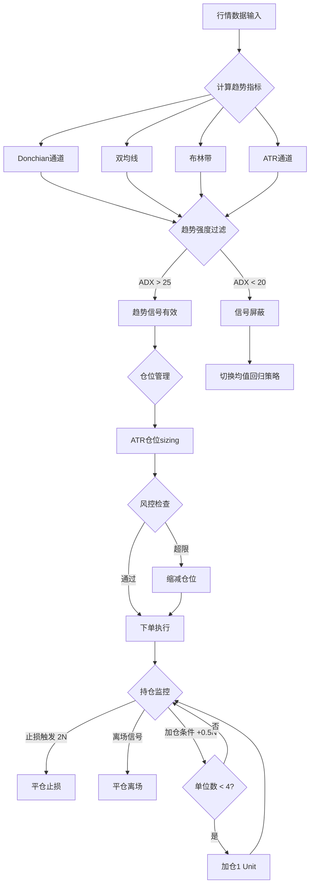
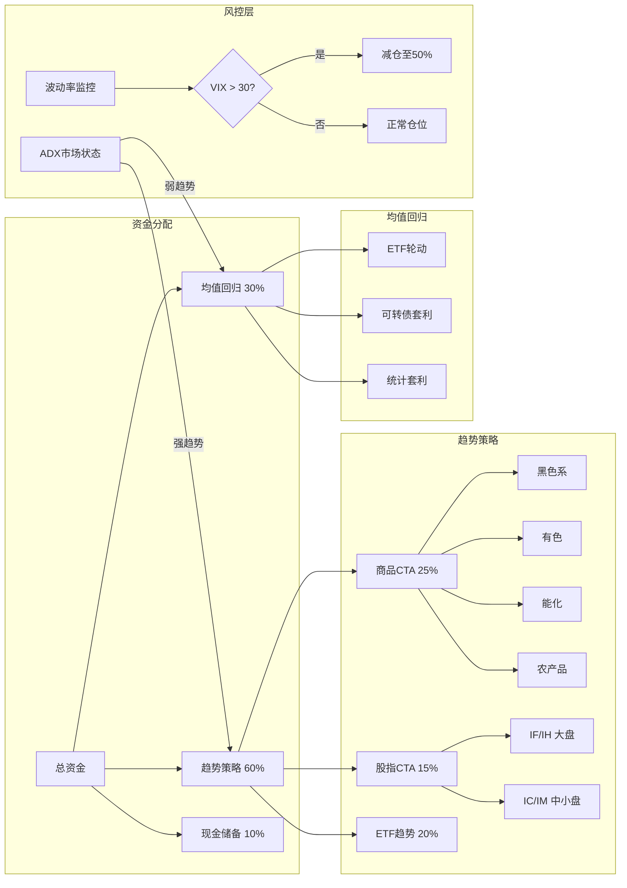

# A股CTA与趋势跟踪策略

## 核心要点

> [!summary]
> - CTA（Commodity Trading Advisor）策略以**趋势跟踪**为核心，在A股期货市场和ETF市场均有广泛应用
> - 经典趋势策略包括双均线交叉、布林带突破、海龟交易法、ATR通道突破、Donchian通道五大类
> - A股T+1制度限制了股票日内趋势交易，但可通过**ETF做T、可转债T+0、期货日内**三条路径变通
> - 趋势策略与均值回归策略的组合配置可显著改善风险收益特征，典型配比为60:40至70:30
> - Walk-Forward分析是防止策略过拟合、实现参数自适应的关键方法论
> - 2025年一季度CTA产品年化收益率中位数达12.40%，Sharpe Ratio 1.03，盈利产品占比66%

## 一、经典趋势策略详解

### 1.1 双均线交叉策略（Dual Moving Average Crossover）

**原理**：快速均线上穿慢速均线产生买入信号（金叉），下穿产生卖出信号（死叉）。

**公式**：
$$MA_{fast}(t) = \frac{1}{n_f}\sum_{i=0}^{n_f-1} C_{t-i}$$
$$MA_{slow}(t) = \frac{1}{n_s}\sum_{i=0}^{n_s-1} C_{t-i}$$

- 买入信号：$MA_{fast}(t) > MA_{slow}(t)$ 且 $MA_{fast}(t-1) \leq MA_{slow}(t-1)$
- 卖出信号：$MA_{fast}(t) < MA_{slow}(t)$ 且 $MA_{fast}(t-1) \geq MA_{slow}(t-1)$

**常用参数**：

| 参数组合 | 快线周期 | 慢线周期 | 适用场景 |
|---------|---------|---------|---------|
| 短线 | 5日 | 20日 | 波段交易 |
| 中线 | 10日 | 60日 | 中期趋势 |
| 长线 | 20日 | 120日 | 长期趋势 |

**变体**：EMA（指数移动平均）交叉、DEMA（双重指数均线）交叉，对近期价格赋予更高权重，信号更灵敏。

```python
import pandas as pd
import numpy as np

def dual_ma_strategy(df, fast_period=5, slow_period=20):
    """双均线交叉策略"""
    df['ma_fast'] = df['close'].rolling(fast_period).mean()
    df['ma_slow'] = df['close'].rolling(slow_period).mean()

    # 信号生成：金叉=1, 死叉=-1
    df['signal'] = 0
    df.loc[(df['ma_fast'] > df['ma_slow']) &
           (df['ma_fast'].shift(1) <= df['ma_slow'].shift(1)), 'signal'] = 1
    df.loc[(df['ma_fast'] < df['ma_slow']) &
           (df['ma_fast'].shift(1) >= df['ma_slow'].shift(1)), 'signal'] = -1

    # 持仓状态
    df['position'] = df['signal'].replace(0, np.nan).ffill().fillna(0)
    df['position'] = df['position'].clip(lower=0)  # A股做多限制
    return df
```

### 1.2 布林带突破策略（Bollinger Band Breakout）

**原理**：价格突破布林带上轨表示强势突破，突破下轨表示弱势，中轨为均值回归参考。

**公式**：
$$Middle = SMA(C, n)$$
$$Upper = Middle + k \times \sigma_n$$
$$Lower = Middle - k \times \sigma_n$$

其中 $\sigma_n$ 为 $n$ 日收盘价标准差，$k$ 通常取2。

**A股优化参数**：

| 参数 | 默认值 | 优化范围 | 说明 |
|------|-------|---------|------|
| 窗口期 $n$ | 20 | 15-25 | 中轨均线周期 |
| 带宽 $k$ | 2.0 | 1.5-2.5 | 标准差倍数 |
| 突破确认 | 收盘价 | - | 避免盘中假突破 |

**交易逻辑**：
- **突破买入**：$Close > Upper$ → 做多（趋势突破模式）
- **回归卖出**：$Close < Middle$ → 平仓
- **均值回归模式**：$Close < Lower$ → 做多（反转交易），$Close > Upper$ → 平仓

```python
def bollinger_breakout(df, window=20, num_std=2):
    """布林带突破策略"""
    df['bb_mid'] = df['close'].rolling(window).mean()
    df['bb_std'] = df['close'].rolling(window).std()
    df['bb_upper'] = df['bb_mid'] + num_std * df['bb_std']
    df['bb_lower'] = df['bb_mid'] - num_std * df['bb_std']

    # 突破模式信号
    df['signal'] = 0
    df.loc[df['close'] > df['bb_upper'], 'signal'] = 1    # 突破上轨做多
    df.loc[df['close'] < df['bb_lower'], 'signal'] = -1   # 跌破下轨平仓

    df['position'] = df['signal'].replace(0, np.nan).ffill().fillna(0)
    df['position'] = df['position'].clip(lower=0)

    # 带宽指标 BandWidth，用于识别波动率收缩（挤压）
    df['bandwidth'] = (df['bb_upper'] - df['bb_lower']) / df['bb_mid']
    return df
```

### 1.3 海龟交易法（Turtle Trading System）

**原理**：Richard Dennis 和 William Eckhardt 于1983年创立。核心使用Donchian通道捕捉趋势突破，ATR管理仓位和风险。

**系统参数**：

| 参数 | 系统1（短线） | 系统2（长线） |
|------|-------------|-------------|
| 入场突破 | 20日最高/最低 | 55日最高/最低 |
| 离场突破 | 10日最低/最高 | 20日最低/最高 |
| ATR周期 | 20日 | 20日 |
| 单位风险 | 账户1% | 账户1% |
| 最大单位 | 4个Unit | 4个Unit |
| 止损 | 2N（2倍ATR） | 2N |
| 加仓间隔 | 0.5N | 0.5N |

**仓位计算**：
$$Unit = \frac{Account \times 1\%}{N \times DollarPerPoint}$$

其中 $N = ATR(20)$，$DollarPerPoint$ 为每点价值（A股股票=1，期货按合约乘数）。

**加仓规则**：
- 首次突破买入1 Unit
- 每上涨0.5N加仓1 Unit
- 最多持有4个Unit
- 所有Unit的止损统一调整至最后买入价 - 2N

```python
class TurtleSystem:
    """海龟交易系统完整实现"""

    def __init__(self, capital=1_000_000, risk_pct=0.01,
                 entry_window=20, exit_window=10, atr_window=20, max_units=4):
        self.capital = capital
        self.risk_pct = risk_pct
        self.entry_window = entry_window
        self.exit_window = exit_window
        self.atr_window = atr_window
        self.max_units = max_units

    def calculate_indicators(self, df):
        """计算ATR和Donchian通道"""
        # True Range
        tr1 = df['high'] - df['low']
        tr2 = (df['high'] - df['close'].shift(1)).abs()
        tr3 = (df['low'] - df['close'].shift(1)).abs()
        df['TR'] = pd.concat([tr1, tr2, tr3], axis=1).max(axis=1)
        df['ATR'] = df['TR'].rolling(self.atr_window).mean()

        # Donchian通道
        df['dc_upper'] = df['high'].rolling(self.entry_window).max().shift(1)
        df['dc_lower'] = df['low'].rolling(self.exit_window).min().shift(1)
        return df

    def calc_unit_size(self, atr, price):
        """计算单位仓位（A股股票按手取整）"""
        unit = int(self.capital * self.risk_pct / atr)
        unit = (unit // 100) * 100  # A股按100股取整
        return max(unit, 100)

    def run(self, df):
        """运行策略"""
        df = self.calculate_indicators(df.copy())

        positions = []
        units_held = 0
        total_shares = 0
        last_buy_price = 0
        entry_prices = []
        cash = self.capital

        for i in range(len(df)):
            row = df.iloc[i]
            atr = row['ATR']

            if pd.isna(atr):
                positions.append(0)
                continue

            price = row['close']

            # 入场信号：突破Donchian上轨
            if units_held == 0 and price > row['dc_upper']:
                unit_size = self.calc_unit_size(atr, price)
                if cash >= unit_size * price:
                    total_shares = unit_size
                    units_held = 1
                    last_buy_price = price
                    entry_prices = [price]
                    cash -= unit_size * price

            # 加仓：上涨0.5N
            elif 0 < units_held < self.max_units:
                if price >= last_buy_price + 0.5 * atr:
                    unit_size = self.calc_unit_size(atr, price)
                    if cash >= unit_size * price:
                        total_shares += unit_size
                        units_held += 1
                        last_buy_price = price
                        entry_prices.append(price)
                        cash -= unit_size * price

                # 止损检查
                stop_price = last_buy_price - 2 * atr
                if price <= stop_price or price < row['dc_lower']:
                    cash += total_shares * price
                    total_shares = 0
                    units_held = 0
                    entry_prices = []

            # 离场信号：跌破Donchian下轨或止损
            elif units_held > 0:
                stop_price = last_buy_price - 2 * atr
                if price <= stop_price or price < row['dc_lower']:
                    cash += total_shares * price
                    total_shares = 0
                    units_held = 0
                    entry_prices = []

            positions.append(total_shares)

        df['shares'] = positions
        df['portfolio_value'] = cash + df['shares'] * df['close']
        df['returns'] = df['portfolio_value'].pct_change()
        df['cum_returns'] = df['portfolio_value'] / self.capital
        return df
```

### 1.4 ATR通道突破策略（ATR Channel Breakout）

**原理**：以均线为中轴，上下各偏移若干倍ATR构建通道，价格突破通道即产生趋势信号。比固定百分比通道更能适应波动率变化。

**公式**：
$$Channel_{upper} = MA(C, n) + k \times ATR(m)$$
$$Channel_{lower} = MA(C, n) - k \times ATR(m)$$

**标准参数**：$n = 20$（均线周期），$m = 14$（ATR周期），$k = 2$（ATR倍数）。

```python
def atr_channel_breakout(df, ma_period=20, atr_period=14, multiplier=2.0):
    """ATR通道突破策略"""
    # ATR计算
    tr1 = df['high'] - df['low']
    tr2 = (df['high'] - df['close'].shift(1)).abs()
    tr3 = (df['low'] - df['close'].shift(1)).abs()
    df['TR'] = pd.concat([tr1, tr2, tr3], axis=1).max(axis=1)
    df['ATR'] = df['TR'].rolling(atr_period).mean()

    # ATR通道
    df['channel_mid'] = df['close'].rolling(ma_period).mean()
    df['channel_upper'] = df['channel_mid'] + multiplier * df['ATR']
    df['channel_lower'] = df['channel_mid'] - multiplier * df['ATR']

    # 信号
    df['signal'] = 0
    df.loc[df['close'] > df['channel_upper'], 'signal'] = 1
    df.loc[df['close'] < df['channel_lower'], 'signal'] = -1

    df['position'] = df['signal'].replace(0, np.nan).ffill().fillna(0)
    df['position'] = df['position'].clip(lower=0)  # A股仅做多
    return df
```

### 1.5 Donchian通道策略（Donchian Channel）

**原理**：由Richard Donchian提出，通道上轨为N日最高价，下轨为N日最低价。海龟交易法的核心组件。

**公式**：
$$DC_{upper}(t) = \max(H_{t-1}, H_{t-2}, \ldots, H_{t-n})$$
$$DC_{lower}(t) = \min(L_{t-1}, L_{t-2}, \ldots, L_{t-n})$$
$$DC_{mid}(t) = \frac{DC_{upper}(t) + DC_{lower}(t)}{2}$$

**参数设置**：

| 周期 | 入场 | 离场 | 应用场景 |
|-----|------|------|---------|
| 短周期 | 20日 | 10日 | 波段交易 |
| 中周期 | 55日 | 20日 | 趋势跟踪 |
| 长周期 | 100日 | 50日 | 长线持仓 |

```python
def donchian_channel(df, entry_period=20, exit_period=10):
    """Donchian通道策略"""
    df['dc_upper'] = df['high'].rolling(entry_period).max().shift(1)
    df['dc_lower'] = df['low'].rolling(exit_period).min().shift(1)
    df['dc_mid'] = (df['dc_upper'] + df['dc_lower']) / 2

    # 信号
    df['signal'] = 0
    position = 0
    signals = [0] * len(df)

    for i in range(1, len(df)):
        if pd.isna(df['dc_upper'].iloc[i]):
            continue
        if position == 0 and df['close'].iloc[i] > df['dc_upper'].iloc[i]:
            position = 1
        elif position == 1 and df['close'].iloc[i] < df['dc_lower'].iloc[i]:
            position = 0
        signals[i] = position

    df['position'] = signals
    return df
```

### 五大策略对比

| 策略 | 信号延迟 | 参数数量 | 趋势适应性 | 震荡市表现 | A股适用性 |
|------|---------|---------|-----------|-----------|----------|
| 双均线交叉 | 较大 | 2 | 中等 | 差（频繁假信号） | 高 |
| 布林带突破 | 中等 | 2 | 较好 | 中（可切换回归模式） | 高 |
| 海龟交易法 | 较大 | 5+ | 优秀 | 差（连续止损） | 中（资金要求高） |
| ATR通道突破 | 中等 | 3 | 优秀（自适应波动率） | 中等 | 高 |
| Donchian通道 | 较大 | 2 | 好 | 差 | 高 |

## 二、趋势强度度量

趋势强度指标是趋势策略的**过滤器**——只在趋势明确时开仓，避免震荡市中频繁交易导致的资金损耗。参见 [[A股技术面因子与量价特征]] 中的技术指标体系。

### 2.1 ADX（Average Directional Index，平均趋向指数）

由 J. Welles Wilder 于1978年提出，衡量趋势强度而不判断方向。

**计算步骤**：
1. 计算方向性运动 +DM 和 -DM
2. 计算真实波幅 TR
3. 平滑得到 +DI 和 -DI（方向性指标）
4. 计算 DX = |+DI - -DI| / (+DI + -DI) × 100
5. ADX = SMA(DX, 14)

**解读**：

| ADX值 | 趋势状态 | 策略建议 |
|-------|---------|---------|
| < 20 | 无趋势/极弱 | 停止趋势策略，可用均值回归 |
| 20-25 | 趋势形成中 | 准备入场，等待确认 |
| 25-50 | 强趋势 | 趋势策略主力区间 |
| 50-75 | 非常强趋势 | 持仓，注意加速见顶 |
| > 75 | 极端趋势 | 警惕反转 |

```python
from ta.trend import ADXIndicator

def calc_adx(df, period=14):
    """ADX趋势强度计算"""
    adx_indicator = ADXIndicator(df['high'], df['low'], df['close'], window=period)
    df['ADX'] = adx_indicator.adx()
    df['DI_pos'] = adx_indicator.adx_pos()  # +DI
    df['DI_neg'] = adx_indicator.adx_neg()  # -DI

    # 趋势状态标注
    df['trend_strength'] = pd.cut(df['ADX'],
                                   bins=[0, 20, 25, 50, 75, 100],
                                   labels=['无趋势', '趋势形成', '强趋势', '极强趋势', '极端'])
    return df
```

### 2.2 Aroon指标（Aroon Indicator）

由 Tushar Chande 于1995年提出，通过计算最高/最低价出现的时间位置判断趋势。

**公式**：
$$Aroon\ Up = \frac{N - periods\ since\ N\text{-}day\ High}{N} \times 100$$
$$Aroon\ Down = \frac{N - periods\ since\ N\text{-}day\ Low}{N} \times 100$$
$$Aroon\ Oscillator = Aroon\ Up - Aroon\ Down$$

**信号解读**：
- Aroon Up > 70 且 Aroon Down < 30 → 强上升趋势
- Aroon Down > 70 且 Aroon Up < 30 → 强下降趋势
- 两线交叉 → 趋势方向改变

```python
def calc_aroon(df, period=25):
    """Aroon趋势指标"""
    df['aroon_up'] = df['high'].rolling(period + 1).apply(
        lambda x: (period - (period - x.argmax())) / period * 100, raw=True)
    df['aroon_down'] = df['low'].rolling(period + 1).apply(
        lambda x: (period - (period - x.argmin())) / period * 100, raw=True)
    df['aroon_osc'] = df['aroon_up'] - df['aroon_down']
    return df
```

### 2.3 趋势得分（Trend Score）

综合多个周期和多个指标的复合趋势评分方法。

```python
def trend_score(df):
    """多维趋势得分（-100 到 +100）"""
    score = pd.Series(0.0, index=df.index)

    # 维度1：多周期均线排列（权重40%）
    for period in [5, 10, 20, 60, 120]:
        ma = df['close'].rolling(period).mean()
        score += (df['close'] > ma).astype(float) * 8  # 5个周期×8 = 40

    # 维度2：ADX强度（权重20%）
    adx = ADXIndicator(df['high'], df['low'], df['close'], 14)
    adx_val = adx.adx()
    di_pos = adx.adx_pos()
    di_neg = adx.adx_neg()
    score += ((adx_val > 25) & (di_pos > di_neg)).astype(float) * 20

    # 维度3：Aroon方向（权重20%）
    df_aroon = calc_aroon(df.copy(), 25)
    score += (df_aroon['aroon_osc'] > 50).astype(float) * 20

    # 维度4：价格vs布林带位置（权重20%）
    bb_mid = df['close'].rolling(20).mean()
    bb_std = df['close'].rolling(20).std()
    bb_upper = bb_mid + 2 * bb_std
    pct_b = (df['close'] - (bb_mid - 2 * bb_std)) / (4 * bb_std)
    score += (pct_b * 20).clip(-20, 20)

    df['trend_score'] = score.clip(-100, 100)
    return df
```

### 趋势强度指标用法汇总

| 指标 | 趋势方向 | 趋势强度 | 最佳周期 | 典型阈值 |
|------|---------|---------|---------|---------|
| ADX | +DI/-DI | ADX值 | 14日 | 25为强弱分界 |
| Aroon | Up/Down交叉 | Oscillator | 25日 | 70/30为强弱区 |
| 趋势得分 | 正/负 | 绝对值 | 多周期 | 60+为强趋势 |

## 三、A股日内趋势策略——T+1限制的变通方案

A股实行T+1交易制度（详见 [[A股交易制度全解析]]），当日买入的股票次日才能卖出，严重限制了日内趋势策略。以下为三条主要变通路径：

### 3.1 ETF做T策略

**可T+0交易的ETF品种**（参见 [[A股衍生品市场与对冲工具]]）：

| ETF类型 | 代表品种 | T+0支持 | 日内策略适用性 |
|---------|---------|---------|-------------|
| 跨境ETF | 中概互联网ETF(513050)、纳指ETF(513100) | 是 | 高 |
| 商品ETF | 黄金ETF(518880)、豆粕ETF(159985) | 是 | 高 |
| 货币ETF | 华宝添益(511990) | 是 | 低（波动小） |
| 债券ETF | 国债ETF(511010) | 是 | 中等 |
| 股票ETF | 沪深300ETF(510300) | 否(T+1) | 需底仓做T |

**股票ETF底仓做T方法**：
1. 持有底仓（如1万份沪深300ETF）
2. 日内判断趋势方向：上涨趋势 → 先买后卖（T日买入新份额，卖出底仓）
3. 下跌趋势 → 先卖后买（T日卖出底仓，低位买回）
4. 保持收盘时仓位不变，赚取日内价差

### 3.2 可转债日内交易

可转债实行**T+0交易**，且无涨跌幅限制（2022年8月起实施20%涨跌幅限制），是A股最灵活的日内趋势交易工具。

**日内策略要点**：
- 选择高流动性品种（日成交额 > 1亿元）
- 关注正股联动性强的可转债
- 利用转股溢价率变化捕捉日内趋势
- 注意：可转债交易佣金和印花税已取消（2023年起），成本优势明显

### 3.3 期货日内趋势

期货天然支持T+0和双向交易，是日内趋势策略的最佳载体。

**股指期货日内策略**：
- IF(沪深300)、IH(上证50)、IC(中证500)、IM(中证1000)
- 典型策略：开盘区间突破（Open Range Breakout），取开盘后前N分钟的高低点构建通道
- EMDT策略（Early Morning Direction Trading）：利用早盘41分钟信号分解判断日内方向

**商品期货日内策略**：
- 活跃品种：螺纹钢(RB)、铁矿石(I)、甲醇(MA)、PTA
- 日内波动率更大，趋势信号更清晰

```python
def intraday_range_breakout(df_min, range_minutes=30):
    """
    开盘区间突破策略（适用于期货分钟线数据）
    df_min: 分钟级别K线，需含 datetime, open, high, low, close
    range_minutes: 开盘后用于确定区间的分钟数
    """
    # 按交易日分组
    df_min['date'] = df_min['datetime'].dt.date

    signals = []
    for date, group in df_min.groupby('date'):
        if len(group) < range_minutes + 1:
            continue

        # 开盘区间
        opening_range = group.iloc[:range_minutes]
        range_high = opening_range['high'].max()
        range_low = opening_range['low'].min()

        # 剩余交易时段
        remaining = group.iloc[range_minutes:]
        position = 0

        for idx, row in remaining.iterrows():
            if position == 0:
                if row['close'] > range_high:
                    position = 1   # 突破上沿做多
                elif row['close'] < range_low:
                    position = -1  # 突破下沿做空
            signals.append({
                'datetime': row['datetime'],
                'position': position,
                'range_high': range_high,
                'range_low': range_low
            })

    return pd.DataFrame(signals)
```

### T+1变通方案对比

| 路径 | 交易方向 | 杠杆 | 资金门槛 | 策略灵活度 | 风险等级 |
|------|---------|------|---------|-----------|---------|
| 跨境/商品ETF | 仅做多 | 无 | 低 | 中 | 低 |
| 股票ETF底仓做T | 做多做空 | 无 | 中（需底仓） | 中 | 低 |
| 可转债T+0 | 仅做多 | 无 | 低 | 高 | 中 |
| 股指期货 | 多空双向 | 有（约12%保证金） | 高（50万+） | 最高 | 高 |
| 商品期货 | 多空双向 | 有（8-15%保证金） | 中（数万元） | 最高 | 高 |

## 四、CTA策略在A股期货市场的应用

### 4.1 商品期货CTA

**策略框架**：

| 策略类型 | 持仓周期 | 核心指标 | 典型品种 |
|---------|---------|---------|---------|
| 趋势跟踪 | 数日-数周 | Donchian/MA/ATR | 黑色系、有色、能化 |
| 动量策略 | 数周-数月 | 横截面动量/时序动量 | 全品种轮动 |
| 期限结构 | 数周-数月 | Contango/Backwardation | 展期收益品种 |
| 基本面量化 | 数月 | 库存/基差/利润 | 产业链品种 |

**2024-2025年表现**：
- 趋势跟踪子策略2024下半年收益约10%，受益于市场有效波动率提升至0.93
- 2025年一季度大宗商品大涨，农产品反弹空间大，CTA整体盈利占比66%
- 黄金、纯碱等品种趋势行情贡献显著

**多品种CTA框架**：

```python
class MultiAssetCTA:
    """多品种CTA策略框架"""

    def __init__(self, symbols, capital=5_000_000):
        self.symbols = symbols
        self.capital = capital
        self.risk_per_trade = 0.01  # 单笔风险1%

    def position_sizing(self, atr, contract_multiplier, margin_ratio):
        """基于ATR的仓位管理"""
        risk_amount = self.capital * self.risk_per_trade
        contracts = int(risk_amount / (atr * contract_multiplier * 2))  # 2N止损
        max_contracts = int(self.capital * 0.2 / (atr * contract_multiplier / margin_ratio))
        return min(contracts, max_contracts)

    def trend_signal(self, df, method='donchian', **params):
        """多策略信号生成"""
        if method == 'donchian':
            return donchian_channel(df, **params)
        elif method == 'dual_ma':
            return dual_ma_strategy(df, **params)
        elif method == 'atr_channel':
            return atr_channel_breakout(df, **params)
        elif method == 'bollinger':
            return bollinger_breakout(df, **params)

    def portfolio_allocation(self, signals_dict):
        """
        品种间资金分配
        - 等风险贡献（Risk Parity）
        - 单品种最大仓位20%
        - 同板块最大仓位40%
        """
        # 按板块分组
        sectors = {
            '黑色': ['RB', 'I', 'J', 'JM', 'HC'],
            '有色': ['CU', 'AL', 'ZN', 'NI'],
            '能化': ['MA', 'TA', 'PP', 'L', 'FU'],
            '农产品': ['M', 'Y', 'P', 'CF', 'SR'],
            '贵金属': ['AU', 'AG'],
        }
        # ... 实际实现需要各品种波动率数据
        pass
```

### 4.2 股指期货CTA

**品种特征**：

| 品种 | 合约乘数 | 最小变动 | 保证金率 | 日均波幅 |
|------|---------|---------|---------|---------|
| IF(沪深300) | 300元/点 | 0.2点 | 12% | 约1.0% |
| IH(上证50) | 300元/点 | 0.2点 | 12% | 约0.9% |
| IC(中证500) | 200元/点 | 0.2点 | 14% | 约1.2% |
| IM(中证1000) | 200元/点 | 0.2点 | 14% | 约1.5% |

**股指CTA策略要点**：
- 日内策略注意尾盘平仓（避免隔夜风险和保证金追加）
- 关注基差变化：贴水环境下做多有天然收益（展期收益）
- IC/IM长期贴水较深，趋势策略+展期收益可增厚收益
- 波动率处于低位（<20%）时趋势策略表现较差，需降低仓位

## 五、趋势策略与均值回归策略的组合配置

趋势跟踪和均值回归是两种互补的策略逻辑。参见 [[A股市场状态识别与择时因子]] 了解市场状态划分方法。

### 5.1 互补性原理

| 市场环境 | 趋势策略 | 均值回归策略 | 互补效果 |
|---------|---------|------------|---------|
| 单边上涨 | 盈利（跟随趋势） | 亏损（过早止盈） | 趋势主导 |
| 单边下跌 | 小亏或不交易 | 亏损（抄底被套） | 均停止交易 |
| 宽幅震荡 | 亏损（反复止损） | 盈利（高抛低吸） | 均值回归补偿 |
| 窄幅震荡 | 不交易 | 小幅盈利 | 低回撤 |

### 5.2 配置方案

**方案一：时间框架分离**
- 长周期（日线/周线）→ 趋势跟踪策略
- 短周期（分钟线/小时线）→ 均值回归策略
- 两套策略独立运行，收益叠加

**方案二：市场状态切换**
- ADX > 25 → 激活趋势策略，暂停均值回归
- ADX < 20 → 激活均值回归，暂停趋势策略
- 20 ≤ ADX ≤ 25 → 两策略各半仓运行

**方案三：固定配比 + 动态调整**

| 配置项 | 保守型 | 平衡型 | 激进型 |
|-------|-------|-------|-------|
| 趋势策略占比 | 40% | 60% | 70% |
| 均值回归占比 | 40% | 30% | 20% |
| 现金/风控 | 20% | 10% | 10% |

**方案四：风险预算法**

```python
def risk_parity_allocation(trend_vol, mr_vol, corr=-0.3):
    """
    风险平价配置趋势/均值回归策略
    trend_vol: 趋势策略年化波动率
    mr_vol: 均值回归策略年化波动率
    corr: 两策略收益相关性
    """
    # 目标：使两策略对组合风险的贡献相等
    # 简化公式（两资产情形）
    w_trend = mr_vol / (trend_vol + mr_vol)
    w_mr = trend_vol / (trend_vol + mr_vol)

    # 考虑相关性的精确解
    cov = corr * trend_vol * mr_vol
    sigma_p = lambda wt, wm: np.sqrt(
        (wt * trend_vol)**2 + (wm * mr_vol)**2 + 2 * wt * wm * cov
    )

    # 数值优化
    from scipy.optimize import minimize
    def risk_contrib_diff(w):
        wt, wm = w[0], 1 - w[0]
        sp = sigma_p(wt, wm)
        rc_t = wt * (wt * trend_vol**2 + wm * cov) / sp
        rc_m = wm * (wm * mr_vol**2 + wt * cov) / sp
        return (rc_t - rc_m)**2

    result = minimize(risk_contrib_diff, [0.5], bounds=[(0.1, 0.9)])
    w_trend_opt = result.x[0]
    w_mr_opt = 1 - w_trend_opt

    return {'趋势权重': round(w_trend_opt, 3), '均值回归权重': round(w_mr_opt, 3)}
```

### 5.3 趋势滤波器在均值回归中的应用

在均值回归策略中加入200日均线滤波器：
- 价格 > MA200 → 只做多方向的均值回归（跌至支撑位买入）
- 价格 < MA200 → 只做空方向的均值回归（涨至阻力位卖出）
- 避免在强趋势中逆势操作

## 六、策略参数自适应方法

### 6.1 Walk-Forward分析（WFA）

**核心思想**：将历史数据分为多段"训练期+测试期"的滚动窗口，在训练期优化参数，在测试期验证效果，模拟真实的策略决策过程。

**标准流程**：

```
|--- 训练期1 ---|-- 测试期1 --|
         |--- 训练期2 ---|-- 测试期2 --|
                  |--- 训练期3 ---|-- 测试期3 --|
                           |--- 训练期4 ---|-- 测试期4 --|
```

**典型参数设置**：
- 训练期：3-5年（A股建议4年覆盖一个牛熊周期）
- 测试期：6-12个月
- 滚动步长：6个月

```python
class WalkForwardAnalyzer:
    """Walk-Forward分析器"""

    def __init__(self, train_years=4, test_months=12, step_months=6):
        self.train_days = train_years * 252
        self.test_days = test_months * 21
        self.step_days = step_months * 21

    def generate_windows(self, df):
        """生成滚动窗口"""
        windows = []
        total_days = len(df)
        start = 0

        while start + self.train_days + self.test_days <= total_days:
            train_start = start
            train_end = start + self.train_days
            test_start = train_end
            test_end = min(train_end + self.test_days, total_days)

            windows.append({
                'train': df.iloc[train_start:train_end].copy(),
                'test': df.iloc[test_start:test_end].copy(),
                'train_dates': (df.index[train_start], df.index[train_end - 1]),
                'test_dates': (df.index[test_start], df.index[test_end - 1])
            })
            start += self.step_days

        return windows

    def optimize_params(self, train_data, param_grid, strategy_func, metric='sharpe'):
        """在训练集上网格搜索最优参数"""
        best_score = -np.inf
        best_params = None

        for params in param_grid:
            result = strategy_func(train_data.copy(), **params)
            returns = result['close'].pct_change() * result['position'].shift(1)

            if metric == 'sharpe':
                score = returns.mean() / returns.std() * np.sqrt(252) if returns.std() > 0 else 0
            elif metric == 'return':
                score = (1 + returns).prod() - 1
            elif metric == 'calmar':
                cum = (1 + returns).cumprod()
                dd = (cum / cum.cummax() - 1).min()
                annual_ret = (1 + returns).prod() ** (252/len(returns)) - 1
                score = annual_ret / abs(dd) if dd != 0 else 0

            if score > best_score:
                best_score = score
                best_params = params

        return best_params, best_score

    def run(self, df, param_grid, strategy_func, metric='sharpe'):
        """执行完整Walk-Forward分析"""
        windows = self.generate_windows(df)
        results = []
        oos_returns = []  # 样本外收益

        for i, window in enumerate(windows):
            # 样本内优化
            best_params, is_score = self.optimize_params(
                window['train'], param_grid, strategy_func, metric)

            # 样本外验证
            test_result = strategy_func(window['test'].copy(), **best_params)
            test_returns = test_result['close'].pct_change() * test_result['position'].shift(1)
            oos_sharpe = test_returns.mean() / test_returns.std() * np.sqrt(252) \
                         if test_returns.std() > 0 else 0

            results.append({
                'window': i + 1,
                'train_period': window['train_dates'],
                'test_period': window['test_dates'],
                'best_params': best_params,
                'in_sample_score': is_score,
                'oos_sharpe': oos_sharpe,
                'oos_return': (1 + test_returns).prod() - 1,
            })
            oos_returns.append(test_returns)

        # 汇总
        all_oos = pd.concat(oos_returns)
        summary = {
            'windows': len(results),
            'avg_oos_sharpe': np.mean([r['oos_sharpe'] for r in results]),
            'total_oos_return': (1 + all_oos).prod() - 1,
            'oos_max_drawdown': ((1 + all_oos).cumprod() /
                                  (1 + all_oos).cumprod().cummax() - 1).min(),
            'param_stability': results,  # 参数变化历程
        }

        # WFA效率比 = 样本外表现 / 样本内表现
        avg_is = np.mean([r['in_sample_score'] for r in results])
        avg_oos = summary['avg_oos_sharpe']
        summary['wfa_efficiency'] = avg_oos / avg_is if avg_is > 0 else 0

        return summary
```

### 6.2 滚动窗口优化（Rolling Window Optimization）

与WFA类似，但每个交易日都重新优化一次参数（计算量更大）。

```python
def rolling_optimization(df, lookback=252, strategy_func=dual_ma_strategy,
                         param_grid=None):
    """逐日滚动优化"""
    if param_grid is None:
        param_grid = [
            {'fast_period': f, 'slow_period': s}
            for f in [5, 10, 15] for s in [20, 40, 60] if f < s
        ]

    daily_params = []

    for i in range(lookback, len(df)):
        window = df.iloc[i - lookback:i].copy()

        best_sharpe = -np.inf
        best_p = param_grid[0]

        for params in param_grid:
            result = strategy_func(window.copy(), **params)
            ret = result['close'].pct_change() * result['position'].shift(1)
            sharpe = ret.mean() / ret.std() * np.sqrt(252) if ret.std() > 0 else 0
            if sharpe > best_sharpe:
                best_sharpe = sharpe
                best_p = params

        daily_params.append({
            'date': df.index[i],
            'params': best_p,
            'lookback_sharpe': best_sharpe
        })

    return pd.DataFrame(daily_params)
```

### 6.3 自适应方法对比

| 方法 | 计算频率 | 训练/测试比 | 防过拟合 | 适用场景 |
|------|---------|-----------|---------|---------|
| 固定参数 | 一次性 | N/A | 差 | 基准测试 |
| Walk-Forward | 低（季度/半年） | 4:1 ~ 5:1 | 好 | 大多数趋势策略 |
| 滚动窗口 | 高（每日） | 取决于lookback | 中等 | 短周期策略 |
| 贝叶斯优化 | 按需 | 灵活 | 较好 | 高维参数空间 |
| 遗传算法 | 按需 | 灵活 | 中等 | 非凸参数空间 |

### 6.4 防止过拟合的关键原则

1. **WFA效率比 > 0.5**：样本外Sharpe至少为样本内的50%
2. **参数稳定性**：相邻窗口最优参数不应剧烈跳变
3. **参数平原**：最优参数周围小幅变动不应导致绩效大幅下降
4. **跨品种验证**：同一参数在多品种上都有效
5. **样本充分性**：训练样本至少包含30次以上交易

## 参数速查表

### 经典趋势策略参数

| 策略 | 核心参数 | A股推荐值 | 备注 |
|------|---------|----------|------|
| 双均线 | fast/slow | 5/20 或 10/60 | EMA优于SMA |
| 布林带 | window/std | 20/2.0 | 窄带宽(<0.1)预示突破 |
| 海龟系统1 | entry/exit/ATR | 20/10/20 | 需100万+资金 |
| 海龟系统2 | entry/exit/ATR | 55/20/20 | 信号更少更可靠 |
| ATR通道 | ma/atr/mult | 20/14/2.0 | 自适应波动率 |
| Donchian | entry/exit | 20/10 | 最简洁 |

### 趋势强度阈值

| 指标 | 强趋势 | 弱/无趋势 | 计算周期 |
|------|--------|----------|---------|
| ADX | > 25 | < 20 | 14日 |
| Aroon Osc | > 50 或 < -50 | -30 ~ 30 | 25日 |
| 趋势得分 | > 60 或 < -60 | -30 ~ 30 | 多周期 |

### 期货CTA参数

| 品种类别 | 趋势周期 | ATR倍数 | 单品种最大风险 |
|---------|---------|---------|-------------|
| 黑色系 | 20-40日 | 2.0-2.5 | 资金2% |
| 有色金属 | 30-60日 | 1.5-2.0 | 资金2% |
| 能源化工 | 20-40日 | 2.0-3.0 | 资金2% |
| 农产品 | 40-80日 | 1.5-2.0 | 资金1.5% |
| 贵金属 | 30-60日 | 1.5-2.0 | 资金2% |
| 股指期货 | 10-30日 | 1.5-2.0 | 资金3% |

## 流程图

### CTA策略信号生成流程



### CTA组合配置框架



## 完整Python代码：海龟+ATR通道+回测框架

```python
"""
A股CTA趋势跟踪策略完整回测框架
包含：海龟交易系统 + ATR通道突破 + 回测引擎 + 绩效评估
依赖：pip install pandas numpy akshare ta matplotlib
"""

import pandas as pd
import numpy as np
import matplotlib.pyplot as plt
from dataclasses import dataclass, field
from typing import Dict, List, Optional
import warnings
warnings.filterwarnings('ignore')


# ============================================================
# 第一部分：数据获取
# ============================================================

def get_stock_data(symbol: str, start_date: str, end_date: str) -> pd.DataFrame:
    """
    获取A股日线数据
    symbol: 股票代码，如 '600519'
    使用 akshare 获取前复权数据
    """
    import akshare as ak
    df = ak.stock_zh_a_hist(
        symbol=symbol, period="daily",
        start_date=start_date, end_date=end_date, adjust="qfq"
    )
    df['日期'] = pd.to_datetime(df['日期'])
    df.set_index('日期', inplace=True)
    df = df[['开盘', '收盘', '最高', '最低', '成交量']].rename(columns={
        '开盘': 'open', '收盘': 'close', '最高': 'high', '最低': 'low', '成交量': 'volume'
    })
    df = df.astype(float)
    return df


def get_futures_data(symbol: str, start_date: str, end_date: str) -> pd.DataFrame:
    """
    获取期货主力连续合约数据
    symbol: 如 'RB0'（螺纹钢主力）
    """
    import akshare as ak
    df = ak.futures_main_sina(symbol=symbol, start_date=start_date, end_date=end_date)
    df.columns = ['date', 'open', 'high', 'low', 'close', 'volume', 'hold']
    df['date'] = pd.to_datetime(df['date'])
    df.set_index('date', inplace=True)
    return df


# ============================================================
# 第二部分：技术指标计算
# ============================================================

def calc_atr(df: pd.DataFrame, period: int = 20) -> pd.Series:
    """计算ATR（Average True Range）"""
    tr1 = df['high'] - df['low']
    tr2 = (df['high'] - df['close'].shift(1)).abs()
    tr3 = (df['low'] - df['close'].shift(1)).abs()
    tr = pd.concat([tr1, tr2, tr3], axis=1).max(axis=1)
    return tr.rolling(period).mean()


def calc_donchian(df: pd.DataFrame, upper_period: int = 20,
                  lower_period: int = 10) -> pd.DataFrame:
    """计算Donchian通道"""
    df['dc_upper'] = df['high'].rolling(upper_period).max().shift(1)
    df['dc_lower'] = df['low'].rolling(lower_period).min().shift(1)
    df['dc_mid'] = (df['dc_upper'] + df['dc_lower']) / 2
    return df


def calc_adx(df: pd.DataFrame, period: int = 14) -> pd.DataFrame:
    """计算ADX趋势强度"""
    from ta.trend import ADXIndicator
    adx = ADXIndicator(df['high'], df['low'], df['close'], window=period)
    df['ADX'] = adx.adx()
    df['DI_pos'] = adx.adx_pos()
    df['DI_neg'] = adx.adx_neg()
    return df


# ============================================================
# 第三部分：海龟交易系统
# ============================================================

@dataclass
class TurtleConfig:
    """海龟系统配置"""
    capital: float = 1_000_000      # 初始资金
    risk_pct: float = 0.01          # 单位风险（账户的1%）
    entry_window: int = 20          # 入场Donchian周期
    exit_window: int = 10           # 离场Donchian周期
    atr_window: int = 20            # ATR计算周期
    max_units: int = 4              # 最大持仓单位
    stop_atr_mult: float = 2.0     # 止损ATR倍数
    add_atr_mult: float = 0.5      # 加仓ATR间距
    is_futures: bool = False        # 是否期货（支持做空）
    contract_mult: float = 1.0     # 合约乘数（期货用）
    lot_size: int = 100             # 最小交易单位（A股=100）


@dataclass
class Position:
    """持仓记录"""
    direction: int = 0          # 1=多, -1=空, 0=无
    units: int = 0              # 当前单位数
    total_size: int = 0         # 总持仓量
    entry_prices: List[float] = field(default_factory=list)
    last_add_price: float = 0   # 最后加仓价
    stop_price: float = 0       # 止损价


class TurtleStrategy:
    """海龟交易系统完整实现"""

    def __init__(self, config: TurtleConfig = None):
        self.config = config or TurtleConfig()
        self.pos = Position()
        self.trades = []
        self.equity_curve = []

    def calc_unit_size(self, atr: float, price: float) -> int:
        """计算单位仓位"""
        risk_amount = self.config.capital * self.config.risk_pct
        dollar_vol = atr * self.config.contract_mult
        unit = int(risk_amount / dollar_vol)
        unit = (unit // self.config.lot_size) * self.config.lot_size
        return max(unit, self.config.lot_size)

    def update_stop(self, current_price: float, atr: float):
        """更新止损价"""
        if self.pos.direction == 1:
            self.pos.stop_price = self.pos.last_add_price - self.config.stop_atr_mult * atr
        elif self.pos.direction == -1:
            self.pos.stop_price = self.pos.last_add_price + self.config.stop_atr_mult * atr

    def open_position(self, price: float, atr: float, direction: int, date):
        """开仓"""
        unit_size = self.calc_unit_size(atr, price)
        cost = unit_size * price * self.config.contract_mult

        if cost > self.config.capital * 0.25:  # 单次不超过25%资金
            return

        self.pos.direction = direction
        self.pos.units = 1
        self.pos.total_size = unit_size
        self.pos.entry_prices = [price]
        self.pos.last_add_price = price
        self.update_stop(price, atr)

        self.trades.append({
            'date': date, 'action': 'OPEN', 'direction': direction,
            'price': price, 'size': unit_size, 'units': 1
        })

    def add_position(self, price: float, atr: float, date):
        """加仓"""
        if self.pos.units >= self.config.max_units:
            return

        unit_size = self.calc_unit_size(atr, price)
        self.pos.units += 1
        self.pos.total_size += unit_size
        self.pos.entry_prices.append(price)
        self.pos.last_add_price = price
        self.update_stop(price, atr)

        self.trades.append({
            'date': date, 'action': 'ADD', 'direction': self.pos.direction,
            'price': price, 'size': unit_size, 'units': self.pos.units
        })

    def close_position(self, price: float, reason: str, date):
        """平仓"""
        pnl = self.pos.direction * (price - np.mean(self.pos.entry_prices)) * \
              self.pos.total_size * self.config.contract_mult

        self.trades.append({
            'date': date, 'action': 'CLOSE', 'reason': reason,
            'price': price, 'size': self.pos.total_size,
            'pnl': pnl
        })

        self.config.capital += pnl
        self.pos = Position()

    def run(self, df: pd.DataFrame) -> pd.DataFrame:
        """运行回测"""
        df = df.copy()
        df['ATR'] = calc_atr(df, self.config.atr_window)
        df = calc_donchian(df, self.config.entry_window, self.config.exit_window)

        equity = []

        for i in range(len(df)):
            row = df.iloc[i]
            date = df.index[i]
            atr = row['ATR']

            if pd.isna(atr) or pd.isna(row.get('dc_upper', np.nan)):
                equity.append(self.config.capital)
                continue

            price = row['close']

            if self.pos.direction == 0:
                # 无持仓 → 检查入场信号
                if price > row['dc_upper']:
                    self.open_position(price, atr, 1, date)
                elif self.config.is_futures and price < row['dc_lower']:
                    self.open_position(price, atr, -1, date)

            elif self.pos.direction == 1:  # 多头持仓
                # 止损
                if price <= self.pos.stop_price:
                    self.close_position(price, 'STOP_LOSS', date)
                # 离场信号
                elif price < row['dc_lower']:
                    self.close_position(price, 'EXIT_SIGNAL', date)
                # 加仓
                elif price >= self.pos.last_add_price + self.config.add_atr_mult * atr:
                    self.add_position(price, atr, date)

            elif self.pos.direction == -1:  # 空头持仓（期货）
                if price >= self.pos.stop_price:
                    self.close_position(price, 'STOP_LOSS', date)
                elif price > row['dc_upper']:
                    self.close_position(price, 'EXIT_SIGNAL', date)
                elif price <= self.pos.last_add_price - self.config.add_atr_mult * atr:
                    self.add_position(price, atr, date)

            # 记录权益
            unrealized = 0
            if self.pos.direction != 0:
                avg_entry = np.mean(self.pos.entry_prices)
                unrealized = self.pos.direction * (price - avg_entry) * \
                             self.pos.total_size * self.config.contract_mult
            equity.append(self.config.capital + unrealized)

        df['equity'] = equity
        df['returns'] = pd.Series(equity).pct_change().values
        df['cum_returns'] = pd.Series(equity).values / equity[0]
        return df


# ============================================================
# 第四部分：ATR通道突破策略
# ============================================================

class ATRChannelStrategy:
    """ATR通道突破策略"""

    def __init__(self, capital=1_000_000, ma_period=20, atr_period=14,
                 multiplier=2.0, risk_pct=0.02, lot_size=100):
        self.capital = capital
        self.initial_capital = capital
        self.ma_period = ma_period
        self.atr_period = atr_period
        self.multiplier = multiplier
        self.risk_pct = risk_pct
        self.lot_size = lot_size

    def run(self, df: pd.DataFrame) -> pd.DataFrame:
        df = df.copy()
        df['ATR'] = calc_atr(df, self.atr_period)
        df['channel_mid'] = df['close'].rolling(self.ma_period).mean()
        df['channel_upper'] = df['channel_mid'] + self.multiplier * df['ATR']
        df['channel_lower'] = df['channel_mid'] - self.multiplier * df['ATR']

        position = 0
        shares = 0
        equity = []
        cash = self.capital

        for i in range(len(df)):
            row = df.iloc[i]
            atr = row['ATR']
            price = row['close']

            if pd.isna(atr) or pd.isna(row['channel_upper']):
                equity.append(cash)
                continue

            # 入场
            if position == 0 and price > row['channel_upper']:
                risk_amount = cash * self.risk_pct
                shares = int(risk_amount / (atr * self.multiplier))
                shares = (shares // self.lot_size) * self.lot_size
                shares = max(shares, self.lot_size)
                if shares * price <= cash * 0.95:
                    cash -= shares * price
                    position = 1

            # 离场
            elif position == 1 and price < row['channel_lower']:
                cash += shares * price
                position = 0
                shares = 0

            equity.append(cash + shares * price)

        df['equity'] = equity
        df['returns'] = pd.Series(equity).pct_change().values
        df['cum_returns'] = pd.Series(equity).values / self.initial_capital
        return df


# ============================================================
# 第五部分：绩效评估
# ============================================================

def evaluate_performance(df: pd.DataFrame, risk_free_rate: float = 0.03) -> Dict:
    """
    策略绩效评估
    参见 [[A股多因子选股策略开发全流程]] 中的回测评估方法
    """
    returns = df['returns'].dropna()
    equity = df['equity']

    # 年化收益率
    total_days = len(returns)
    total_return = equity.iloc[-1] / equity.iloc[0] - 1
    annual_return = (1 + total_return) ** (252 / total_days) - 1

    # 年化波动率
    annual_vol = returns.std() * np.sqrt(252)

    # Sharpe Ratio
    sharpe = (annual_return - risk_free_rate) / annual_vol if annual_vol > 0 else 0

    # 最大回撤
    cummax = equity.cummax()
    drawdown = (equity - cummax) / cummax
    max_dd = drawdown.min()

    # Calmar Ratio
    calmar = annual_return / abs(max_dd) if max_dd != 0 else 0

    # 胜率（按交易日）
    win_rate = (returns > 0).sum() / (returns != 0).sum() if (returns != 0).sum() > 0 else 0

    # 盈亏比
    avg_win = returns[returns > 0].mean() if (returns > 0).any() else 0
    avg_loss = abs(returns[returns < 0].mean()) if (returns < 0).any() else 1
    profit_loss_ratio = avg_win / avg_loss if avg_loss > 0 else 0

    return {
        '总收益率': f'{total_return:.2%}',
        '年化收益率': f'{annual_return:.2%}',
        '年化波动率': f'{annual_vol:.2%}',
        'Sharpe Ratio': f'{sharpe:.2f}',
        '最大回撤': f'{max_dd:.2%}',
        'Calmar Ratio': f'{calmar:.2f}',
        '日胜率': f'{win_rate:.2%}',
        '盈亏比': f'{profit_loss_ratio:.2f}',
        '交易天数': total_days,
    }


def plot_backtest(df: pd.DataFrame, title: str = 'CTA策略回测'):
    """回测结果可视化"""
    fig, axes = plt.subplots(4, 1, figsize=(16, 14),
                              gridspec_kw={'height_ratios': [3, 1, 1, 1]})

    # 1. 权益曲线
    axes[0].plot(df.index, df['cum_returns'], label='策略净值', linewidth=2, color='steelblue')
    benchmark = df['close'] / df['close'].iloc[0]
    axes[0].plot(df.index, benchmark, label='基准(买入持有)', linewidth=1, alpha=0.7, color='gray')
    axes[0].set_title(title, fontsize=14)
    axes[0].legend(fontsize=11)
    axes[0].grid(True, alpha=0.3)
    axes[0].set_ylabel('净值')

    # 2. 回撤
    cummax = df['equity'].cummax()
    drawdown = (df['equity'] - cummax) / cummax
    axes[1].fill_between(df.index, drawdown, 0, alpha=0.4, color='red')
    axes[1].set_ylabel('回撤')
    axes[1].grid(True, alpha=0.3)

    # 3. ATR / 波动率
    if 'ATR' in df.columns:
        axes[2].plot(df.index, df['ATR'], color='orange', linewidth=1)
        axes[2].set_ylabel('ATR')
        axes[2].grid(True, alpha=0.3)

    # 4. ADX（若存在）
    if 'ADX' in df.columns:
        axes[3].plot(df.index, df['ADX'], color='purple', linewidth=1)
        axes[3].axhline(y=25, color='red', linestyle='--', alpha=0.5)
        axes[3].set_ylabel('ADX')
        axes[3].grid(True, alpha=0.3)

    plt.tight_layout()
    plt.savefig('cta_backtest.png', dpi=150, bbox_inches='tight')
    plt.show()


# ============================================================
# 第六部分：使用示例
# ============================================================

if __name__ == '__main__':
    # --- 海龟策略回测（A股股票） ---
    print("=" * 60)
    print("海龟交易系统回测 - 贵州茅台(600519)")
    print("=" * 60)

    df = get_stock_data('600519', '20180101', '20251231')

    turtle_config = TurtleConfig(
        capital=1_000_000,
        entry_window=20,
        exit_window=10,
        atr_window=20,
        max_units=4,
        is_futures=False,
        lot_size=100
    )
    turtle = TurtleStrategy(turtle_config)
    result_turtle = turtle.run(df)

    perf_turtle = evaluate_performance(result_turtle)
    print("\n海龟策略绩效：")
    for k, v in perf_turtle.items():
        print(f"  {k}: {v}")

    print(f"\n交易记录（共{len(turtle.trades)}笔）：")
    for t in turtle.trades[:10]:
        print(f"  {t}")

    # --- ATR通道突破回测 ---
    print("\n" + "=" * 60)
    print("ATR通道突破回测 - 贵州茅台(600519)")
    print("=" * 60)

    atr_strategy = ATRChannelStrategy(
        capital=1_000_000,
        ma_period=20,
        atr_period=14,
        multiplier=2.0
    )
    result_atr = atr_strategy.run(df)

    perf_atr = evaluate_performance(result_atr)
    print("\nATR通道策略绩效：")
    for k, v in perf_atr.items():
        print(f"  {k}: {v}")

    # --- Walk-Forward分析 ---
    print("\n" + "=" * 60)
    print("Walk-Forward分析")
    print("=" * 60)

    wfa = WalkForwardAnalyzer(train_years=3, test_months=12, step_months=6)

    param_grid = [
        {'entry_period': e, 'exit_period': x}
        for e in [15, 20, 25, 30] for x in [5, 10, 15] if e > x
    ]

    wfa_result = wfa.run(df, param_grid, donchian_channel, metric='sharpe')
    print(f"\n  总窗口数: {wfa_result['windows']}")
    print(f"  平均样本外Sharpe: {wfa_result['avg_oos_sharpe']:.2f}")
    print(f"  总样本外收益: {wfa_result['total_oos_return']:.2%}")
    print(f"  WFA效率比: {wfa_result['wfa_efficiency']:.2f}")

    # --- 可视化 ---
    plot_backtest(result_turtle, '海龟交易系统 - 贵州茅台')
```

## 常见误区与注意事项

> [!warning] 常见误区
>
> 1. **过度优化参数**：在样本内反复优化直到曲线完美，实盘表现往往大幅衰减。解决方案：Walk-Forward分析 + WFA效率比 > 0.5
>
> 2. **忽视交易成本**：A股股票单边约万1.5-万3（佣金）+千1（印花税卖出），期货约万0.5-万2（手续费）。趋势策略换手率不高但需纳入回测
>
> 3. **震荡市强行交易**：趋势策略在震荡市（ADX < 20）中反复止损是最大的资金消耗来源。必须加入趋势强度过滤器
>
> 4. **单品种集中持仓**：海龟原版规则要求分散于不相关市场。A股单品种最大不超过总资金的20%
>
> 5. **忽略滑点和流动性**：小盘股和不活跃期货品种的滑点可能吞噬利润。选择日均成交额 > 5亿的标的
>
> 6. **混淆趋势和动量**：趋势策略关注价格方向的持续性，动量策略关注收益率的截面排序。两者相关但不同
>
> 7. **T+1下照搬海外日内策略**：A股股票T+1限制使纯日内策略不可行，必须通过ETF/可转债/期货变通
>
> 8. **回测中的未来函数**：Donchian通道必须使用shift(1)排除当日数据，否则会使用未来信息

## 相关链接

- [[A股交易制度全解析]] — T+1制度、涨跌幅限制等基本规则
- [[A股市场微观结构深度研究]] — 市场微观结构与价格发现机制
- [[A股衍生品市场与对冲工具]] — 期货、期权等衍生品工具详解
- [[A股技术面因子与量价特征]] — 技术指标体系与量价因子
- [[A股市场状态识别与择时因子]] — ADX等指标在市场状态识别中的应用
- [[A股量化交易平台深度对比]] — 回测框架和交易平台选择
- [[量化研究Python工具链搭建]] — Python量化环境和依赖库
- [[A股多因子选股策略开发全流程]] — 多因子框架中的因子评估方法
- [[A股可转债量化策略]] — 可转债T+0日内做T策略，与CTA日内变通路径互补
- [[量化策略的服务器部署与自动化]] — CTA策略7×24小时期货自动化部署方案

## 来源参考

1. Richard Dennis & William Eckhardt, "The Original Turtle Trading Rules" (1983), https://v2ex.com/t/304372
2. J. Welles Wilder, "New Concepts in Technical Trading Systems" (1978) — ADX/ATR原始文献
3. Tushar Chande, "A New Approach to Trend Following" (1995) — Aroon指标
4. John Bollinger, "Bollinger on Bollinger Bands" (2001)
5. 海通期货CTA策略2024年度报告, https://www.htfc.com
6. 新浪财经，"2025年一季度CTA策略表现", https://finance.sina.com.cn/stock/stockzmt/2025-04-01/doc-inerrxpq2966215.shtml
7. 东方财富研报，"主观CTA策略年度表现分析", https://pdf.dfcfw.com
8. BigQuant量化百科，"Walk-Forward分析", https://bigquant.com/wiki/doc/gVpC1nnxVS
9. 上交所ETF投资者教育, https://www.sse.com.cn/assortment/fund/etf/question/
10. technologynova, "从过拟合到适应性：深入量化回测的滑窗分析", https://technologynova.org
