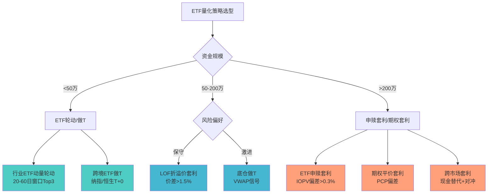
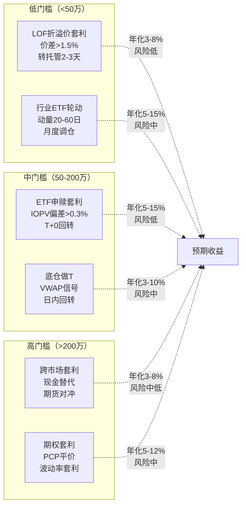

# A股ETF量化策略与套利实战

> - A股ETF市场2025年底规模突破**6万亿元**（1381只），日均成交额约**3000亿元**，流动性充沛，为量化策略提供了丰富载体
> - ETF套利三大类型：**LOF折溢价套利**（价差>1.5%、资金门槛低但转托管慢）、**ETF申赎套利**（T+0回转、门槛50-200万元）、**跨市场套利**（现金替代+延时风险）
> - 行业ETF轮动策略动量窗口20-60日、月度调仓Top3-5等权，年化超额5-15%；做T策略依赖底仓+日内信号
> - 跨境/商品ETF支持直接T+0，股票ETF需底仓做T，可转债ETF同样T+0
> - ETF期权套利（Put-Call Parity）理论无风险但受限于欧式行权和交易成本

---

## 一、ETF市场全景

### 1.1 市场规模（2024-2025）

| 指标 | 2024年底 | 2025年底 |
|------|---------|---------|
| ETF总规模 | 3.7万亿元 | 6.02万亿元（+61.4%） |
| ETF数量 | 1033只 | 1381只（+35.7%） |
| 股票ETF规模 | ~2.3万亿元 | 3.83万亿元 |
| 日均成交额 | ~1357亿元 | ~3000亿元 |
| 沪市ETF全年成交 | ~30万亿元 | ~61万亿元 |

### 1.2 ETF分类与T+0规则

| ETF类型 | 代表品种 | T+0支持 | 日均成交额 |
|---------|---------|---------|-----------|
| 宽基股票ETF | 沪深300ETF(510300) | ❌ 需底仓做T | 50-100亿元 |
| 行业ETF | 半导体ETF(512480) | ❌ 需底仓做T | 5-30亿元 |
| 跨境ETF | 纳指ETF(513100) | ✅ 直接T+0 | 10-50亿元 |
| 商品ETF | 黄金ETF(518880) | ✅ 直接T+0 | 5-20亿元 |
| 货币ETF | 华宝添益(511990) | ✅ T+0 | 50-200亿元 |
| 债券ETF | 国债ETF(511010) | ✅ T+0 | 5-20亿元 |
| 可转债ETF | 可转债ETF(511380) | ✅ T+0 | 1-5亿元 |

---

## 二、ETF轮动策略

### 2.1 行业ETF动量轮动

**核心思路**：基于行业动量效应（A股行业层面动量有效），在行业ETF间轮动配置。

**信号规则**：
1. 计算全部行业ETF过去N日收益率（N=20/40/60日）
2. 按收益率降序排列，选取Top K只（K=3-5）
3. 等权配置，月度/双周调仓
4. 可叠加成交量过滤（剔除日均成交<5000万的ETF）

**参数推荐**：

| 参数 | 保守 | 标准 | 激进 |
|------|------|------|------|
| 动量窗口 | 60日 | 40日 | 20日 |
| 持仓数量 | 5只 | 3只 | 2只 |
| 调仓频率 | 月度 | 双周 | 周度 |
| 成交额门槛 | 1亿元/日 | 5000万/日 | 3000万/日 |

```python
import pandas as pd
import numpy as np

class IndustryETFRotation:
    """行业ETF动量轮动策略"""
    
    def __init__(self, lookback=40, top_k=3, rebalance_freq='M',
                 min_volume=5000_0000):
        self.lookback = lookback
        self.top_k = top_k
        self.rebalance_freq = rebalance_freq
        self.min_volume = min_volume
    
    def generate_signals(self, prices: pd.DataFrame, 
                         volumes: pd.DataFrame) -> pd.DataFrame:
        """
        prices: 行业ETF收盘价 DataFrame (date x etf_code)
        volumes: 日均成交额 DataFrame
        """
        # 计算动量
        momentum = prices.pct_change(self.lookback)
        
        # 流动性过滤
        avg_vol = volumes.rolling(20).mean()
        liquid_mask = avg_vol >= self.min_volume
        momentum_filtered = momentum.where(liquid_mask)
        
        # 月末调仓信号
        if self.rebalance_freq == 'M':
            rebal_dates = prices.resample('ME').last().index
        elif self.rebalance_freq == '2W':
            rebal_dates = prices.resample('2W-FRI').last().index
        else:
            rebal_dates = prices.index
        
        weights = pd.DataFrame(0.0, index=prices.index, 
                               columns=prices.columns)
        
        for date in rebal_dates:
            if date not in momentum_filtered.index:
                continue
            mom = momentum_filtered.loc[date].dropna()
            if len(mom) < self.top_k:
                continue
            top = mom.nlargest(self.top_k).index
            weights.loc[date, top] = 1.0 / self.top_k
        
        # 前向填充权重
        weights = weights.replace(0, np.nan).ffill().fillna(0)
        return weights
    
    def backtest(self, prices: pd.DataFrame, 
                 weights: pd.DataFrame) -> pd.Series:
        """简单回测：日收益率 = sum(weight * return)"""
        returns = prices.pct_change()
        port_returns = (weights.shift(1) * returns).sum(axis=1)
        nav = (1 + port_returns).cumprod()
        return nav
```

### 2.2 宽基ETF大小盘轮动

利用大小盘轮动规律（小盘优势期均95个月、大盘50个月），在沪深300ETF与中证1000ETF之间切换。

**七维信号体系**（来自[[A股行业轮动与风格轮动因子]]）：
1. 货币周期（M2增速 vs 趋势）
2. 信用利差（收窄→小盘，走阔→大盘）
3. 货币活化（M1-M2剪刀差）
4. 期限利差（走阔→价值/大盘）
5. 外资偏好（北向资金流向）
6. 风格动量（过去3月相对收益）
7. 相对波动率

**交易规则**：7维信号投票，≥4票看多小盘→配中证1000ETF，否则配沪深300ETF。

### 2.3 Smart Beta ETF配置

| Smart Beta类型 | 代表ETF | 适用环境 | 年化超额 |
|---------------|---------|---------|---------|
| 红利低波 | 红利ETF(510880) | 熊市/震荡市 | 3-8% |
| 等权 | 等权重ETF | 小盘占优期 | 2-5% |
| 基本面 | 基本面50(510450) | 价值回归期 | 2-6% |
| 质量 | 质量因子ETF | 全天候 | 2-4% |

---

## 三、LOF套利

### 3.1 原理

LOF（Listed Open-Ended Fund）同时在场内交易和场外申赎，存在价格差异时可套利：
- **溢价套利**：场内价格 > 净值 → 场外申购 + 转托管至场内 + 卖出
- **折价套利**：场内价格 < 净值 → 场内买入 + 转托管至场外 + 赎回

### 3.2 关键约束

| 参数 | 数值 |
|------|------|
| 转托管时效 | 2-3个工作日（T+2/T+3到账） |
| 价差阈值 | >1.5%（覆盖交易成本+时间风险） |
| 申购费率 | 0.12%-0.15%（C类份额） |
| 赎回费率 | 0.5%（持有<7天1.5%） |
| 场内佣金 | 万2-万5 |
| 资金门槛 | 1万元起（无最低申赎单位限制） |
| 年化机会 | 约20-40次（折溢价>1.5%） |

### 3.3 风险

- **时间敞口**：转托管2-3天内净值波动可能吞噬价差
- **申赎限额**：大额申赎可能触发基金限购
- **流动性**：场内成交量不足时卖出冲击大

```python
class LOFArbitrage:
    """LOF折溢价套利监控"""
    
    def __init__(self, premium_threshold=0.015, 
                 discount_threshold=-0.015):
        self.premium_threshold = premium_threshold
        self.discount_threshold = discount_threshold
    
    def calc_premium(self, market_price: float, 
                     nav: float) -> float:
        """计算溢价率"""
        return (market_price - nav) / nav
    
    def scan_opportunities(self, lof_data: pd.DataFrame) -> pd.DataFrame:
        """
        lof_data: columns = [code, name, market_price, nav, volume]
        """
        lof_data['premium'] = lof_data.apply(
            lambda x: self.calc_premium(x['market_price'], x['nav']), 
            axis=1
        )
        # 溢价套利机会
        premium_opps = lof_data[
            lof_data['premium'] > self.premium_threshold
        ].copy()
        premium_opps['direction'] = '溢价套利(申购→转托管→卖出)'
        
        # 折价套利机会
        discount_opps = lof_data[
            lof_data['premium'] < self.discount_threshold
        ].copy()
        discount_opps['direction'] = '折价套利(买入→转托管→赎回)'
        
        return pd.concat([premium_opps, discount_opps]).sort_values(
            'premium', key=abs, ascending=False
        )
```

---

## 四、ETF申赎套利

### 4.1 机制

ETF存在一级市场（申赎）与二级市场（买卖）双重定价：
- **IOPV**（盘中参考净值）：交易所每15秒发布，基于成分股实时价格估算
- **溢价套利**：ETF市价 > IOPV → 买入一篮子股票申购ETF → 场内卖出ETF
- **折价套利**：ETF市价 < IOPV → 买入ETF → 赎回获得一篮子股票 → 卖出股票

### 4.2 关键参数

| 参数 | 数值 |
|------|------|
| 最小申赎单位 | 50-100万份（视ETF而定） |
| 资金门槛 | 50-200万元（沪深300ETF约100万元） |
| T+0回转 | 当日申购的ETF份额当日可卖出 |
| 价差阈值 | >0.3-0.5%（覆盖冲击+佣金+印花税） |
| 申赎费用 | 约0.05%（券商收取） |
| 成分股停牌 | 可用现金替代（但有不确定性溢价） |

### 4.3 瞬时套利 vs 延时套利

| 维度 | 瞬时套利 | 延时套利 |
|------|---------|---------|
| 速度要求 | 毫秒级（程序化必需） | 分钟级可操作 |
| 价差空间 | 0.1-0.3% | 0.3-1.0% |
| 风险 | 极低（近乎无风险） | 中等（持有期风险） |
| 竞争 | 极激烈（做市商主导） | 较少 |
| 适合资金 | 千万级+ | 百万级 |
| 频率 | 高频（日内数十次） | 低频（日均1-3次） |

```python
class ETFArbitrage:
    """ETF申赎套利引擎"""
    
    def __init__(self, threshold_premium=0.003, 
                 threshold_discount=-0.003,
                 min_creation_unit=500000):
        self.threshold_premium = threshold_premium
        self.threshold_discount = threshold_discount
        self.min_creation_unit = min_creation_unit
    
    def calc_iopv(self, basket_prices: pd.Series, 
                  basket_shares: pd.Series,
                  cash_component: float,
                  creation_unit: int) -> float:
        """计算IOPV"""
        basket_value = (basket_prices * basket_shares).sum()
        return (basket_value + cash_component) / creation_unit
    
    def detect_opportunity(self, etf_price: float, 
                           iopv: float) -> dict:
        """检测套利机会"""
        premium = (etf_price - iopv) / iopv
        
        if premium > self.threshold_premium:
            return {
                'type': 'premium_arb',
                'action': '买入成分股→申购ETF→卖出ETF',
                'premium': premium,
                'expected_profit_bps': (premium - 0.001) * 10000
            }
        elif premium < self.threshold_discount:
            return {
                'type': 'discount_arb',
                'action': '买入ETF→赎回成分股→卖出成分股',
                'premium': premium,
                'expected_profit_bps': (abs(premium) - 0.001) * 10000
            }
        return {'type': 'no_opportunity', 'premium': premium}
```

---

## 五、跨市场ETF套利

### 5.1 原理

跨市场ETF（如沪深300ETF 510300持有沪深两市股票）申赎涉及跨市场股票交收延迟：
- **沪市版沪深300ETF**：深市成分股通过"现金替代"方式处理
- **深市版沪深300ETF**：沪市成分股同样现金替代

### 5.2 现金替代类型

| 替代类型 | 说明 | 风险 |
|---------|------|------|
| 禁止替代 | 必须用股票申赎 | 无替代风险 |
| 可以替代 | 可选现金或股票 | 退补价差风险 |
| 必须替代 | 停牌/涨跌停强制现金 | 复牌价格不确定 |
| 退补机制 | T+2日结算差价 | 替代溢价/折价 |

### 5.3 敞口管理

- 跨市场套利持有期约T+1至T+2，存在市场风险
- 可用股指期货（IF）对冲系统性风险
- 现金替代部分无法精确对冲→净敞口约5-15%

---

## 六、ETF做T策略

### 6.1 底仓做T路径

A股股票ETF不支持直接T+0，但可通过**底仓+日内交易**实现：

```
持有N份ETF底仓（长期不动）
  ↓
盘中信号看多 → 买入N份ETF → 卖出N份底仓（当日买入不可卖，卖底仓）
  ↓
盘中信号看空 → 卖出N份底仓 → 买入N份ETF补仓
  ↓
收盘时底仓恢复为N份
```

### 6.2 日内信号设计

```python
class ETFDayTrading:
    """ETF底仓做T策略"""
    
    def __init__(self, vwap_threshold=0.003, volume_ratio=1.5,
                 take_profit=0.005, stop_loss=-0.003):
        self.vwap_threshold = vwap_threshold
        self.volume_ratio = volume_ratio
        self.take_profit = take_profit
        self.stop_loss = stop_loss
    
    def calc_vwap(self, prices, volumes):
        """计算分钟级VWAP"""
        return (prices * volumes).cumsum() / volumes.cumsum()
    
    def generate_signal(self, current_price, vwap, 
                        current_volume, avg_volume):
        """
        信号规则：
        - 买入：价格<VWAP*(1-阈值) 且 成交量放大
        - 卖出：价格>VWAP*(1+阈值) 且 成交量放大
        """
        vol_active = current_volume > avg_volume * self.volume_ratio
        
        if current_price < vwap * (1 - self.vwap_threshold) and vol_active:
            return 'BUY'
        elif current_price > vwap * (1 + self.vwap_threshold) and vol_active:
            return 'SELL'
        return 'HOLD'
```

### 6.3 直接T+0的ETF品种

| 品种 | 代表 | 涨跌幅 | 做T难度 |
|------|------|--------|--------|
| 跨境ETF | 纳指ETF(513100)、恒生ETF(159920) | ±10% | 低（直接T+0） |
| 商品ETF | 黄金ETF(518880)、豆粕ETF(159985) | ±10% | 低 |
| 货币ETF | 华宝添益(511990) | 极小 | 极低（无方向） |
| 可转债ETF | 可转债ETF(511380) | ±10% | 中 |

---

## 七、ETF期权套利

### 7.1 Put-Call Parity套利

对于欧式期权，认购-认沽平价关系：

$$C - P = S \cdot e^{-qT} - K \cdot e^{-rT}$$

当市场价格偏离平价关系时存在套利机会：
- **正向套利**：C - P > S - K·e^{-rT} → 卖C + 买P + 买S
- **反向套利**：C - P < S - K·e^{-rT} → 买C + 卖P + 卖S

**A股限制**：ETF期权为欧式+实物交割，需持有到期才能完美套利；提前平仓有Gamma风险。

### 7.2 波动率套利

- **IV vs RV价差**：当IV显著高于RV时，卖出Straddle + Delta对冲
- **Skew交易**：OTM Put IV过高时，卖OTM Put + 买ATM Put
- **期限结构**：近月IV > 远月IV时，卖近月+买远月日历价差

---

## 八、指数增强型ETF策略

### 8.1 框架

在ETF配置的基础上叠加Alpha：

```
基础配置：沪深300ETF 80% + 中证500ETF 20%
  ↓
Alpha叠加：
  - 行业轮动信号 → 行业ETF替代部分宽基ETF
  - 择时信号 → 动态调整股票ETF vs 货币ETF比例
  - 做T收益 → 日内交易底仓增厚收益
  ↓
约束：跟踪误差 < 5%（相对基准组合）
```

---

## 九、量化ETF选基

### 9.1 四维筛选标准

| 维度 | 指标 | 门槛 | 权重 |
|------|------|------|------|
| 流动性 | 日均成交额 | ≥5000万元 | 30% |
| 跟踪精度 | 年化跟踪误差 | <2%（宽基）/<3%（行业） | 25% |
| 费率 | 管理费+托管费 | <0.6%/年（越低越好） | 25% |
| 规模 | 基金净值 | ≥10亿元（宽基）/≥5亿元（行业） | 20% |

### 9.2 ETF费率对比

| ETF类型 | 管理费 | 托管费 | 合计 |
|---------|--------|--------|------|
| 宽基（新发） | 0.15% | 0.05% | 0.20% |
| 宽基（老ETF） | 0.50% | 0.10% | 0.60% |
| 行业ETF | 0.50% | 0.10% | 0.60% |
| 跨境ETF | 0.50-0.80% | 0.15-0.25% | 0.65-1.05% |
| 商品ETF | 0.50-0.60% | 0.10-0.15% | 0.60-0.75% |

---

## 十、策略选型决策树



## 十一、ETF套利类型对比



---

## 十二、参数速查表

### ETF轮动参数

| 参数 | 推荐值 | 说明 |
|------|--------|------|
| 动量窗口 | 40日 | 20日噪声大、60日滞后 |
| 持仓数量 | 3-5只 | 集中vs分散权衡 |
| 调仓频率 | 月度 | 周度成本过高 |
| 成交额门槛 | ≥5000万/日 | 流动性保障 |
| 规模门槛 | ≥5亿元 | 避免迷你ETF |
| 跟踪误差 | <2% | 跟踪精度 |

### 套利参数

| 策略 | 价差阈值 | 资金门槛 | 频率 | 年化收益 |
|------|---------|---------|------|---------|
| LOF溢价套利 | >1.5% | 1万元 | 月均2-3次 | 3-8% |
| ETF申赎套利 | >0.3% | 50-200万 | 日均1-5次 | 5-15% |
| 跨市场套利 | >0.5% | 100-500万 | 日均1-3次 | 3-8% |
| 期权平价套利 | >0.5% | 50-200万 | 月均5-10次 | 5-12% |
| 底仓做T | VWAP±0.3% | 10万元+ | 日均1-3次 | 3-10% |

---

## 十三、常见误区

| 误区 | 真相 |
|------|------|
| "ETF套利无风险" | LOF转托管2-3天有市场风险，跨市场现金替代有退补风险，期权平价需持有到期 |
| "所有ETF都能T+0" | 仅跨境/商品/货币/债券/可转债ETF直接T+0，股票ETF需底仓做T |
| "ETF流动性都很好" | 行业ETF中约40%日均成交<1000万元，买卖价差可达0.3-0.5% |
| "申赎套利人人可做" | 最小申赎单位50-100万份，资金门槛50-200万元，且瞬时套利需专业系统 |
| "LOF套利稳赚" | 折溢价>1.5%看似丰厚，但转托管期间净值波动可能反向吞噬价差 |
| "IOPV等于真实净值" | IOPV基于15秒快照估算，停牌股/涨跌停股导致IOPV偏差 |
| "行业ETF轮动=追涨杀跌" | 轮动策略基于中期动量（40-60日），非短期追涨；需配合成交量和拥挤度过滤 |
| "ETF费率不重要" | 新发宽基ETF费率0.20%/年 vs 老ETF 0.60%，长期持有差异显著 |

---

## 十四、相关笔记

- [[A股交易制度全解析]] — ETF T+0规则、涨跌停、交易时间
- [[A股指数体系与基准构建]] — 沪深300/中证500/中证1000指数编制与成分股
- [[A股衍生品市场与对冲工具]] — ETF期权合约规格、股指期货对冲
- [[A股统计套利与配对交易策略]] — ETF套利与配对交易的理论基础
- [[交易成本建模与执行优化]] — 套利成本估算与最优执行
- [[A股量化交易平台深度对比]] — 各平台ETF策略支持情况
- [[量化数据工程实践]] — ETF净值、IOPV数据处理
- [[组合优化与资产配置]] — ETF组合优化与再平衡
- [[A股回测框架实战与避坑指南]] — ETF策略回测注意事项

---

## 来源参考

1. 上交所2024年ETF市场发展报告 — ETF规模/成交/产品创新数据
2. 深交所2025年市场统计年报 — 深市ETF成交23.17万亿元
3. 华泰证券《ETF套利策略全景图》 — LOF/申赎/跨市场套利机制
4. 国泰君安《行业ETF轮动策略研究》 — 动量因子在行业ETF中的应用
5. 中金公司《ETF做市与套利机制研究》 — IOPV计算、现金替代、做市商行为
6. 证券时报2025年12月31日 — "ETF总规模突破6万亿，产品数量达1381只"
7. 沪深交易所ETF业务规则 — 申赎单位、T+0规则、行权价间距
8. 天风证券《LOF套利实战手册》 — 折溢价套利策略与案例
