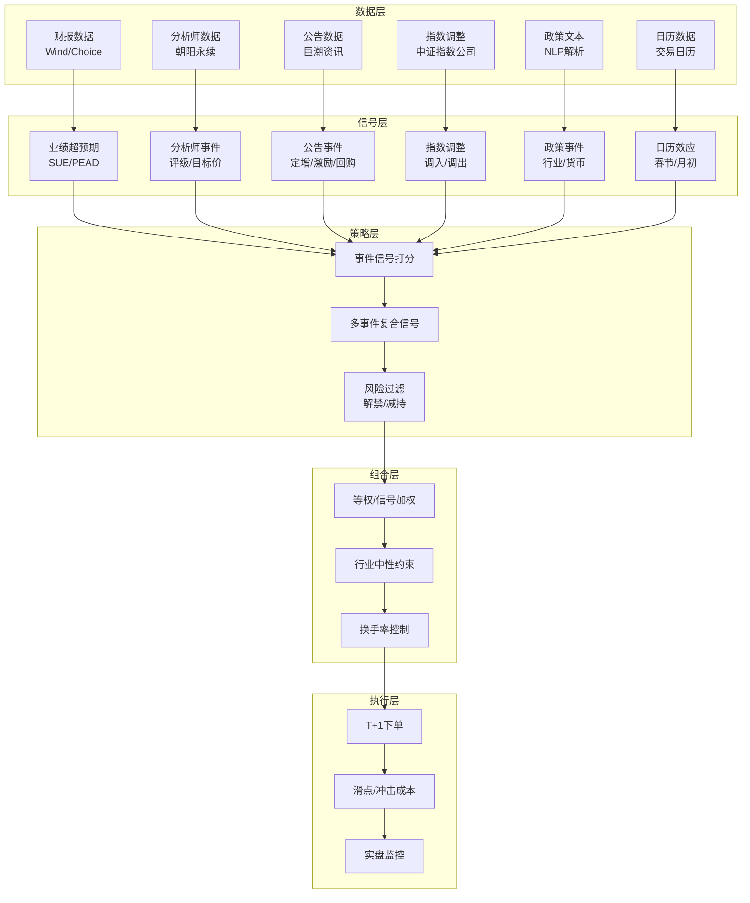
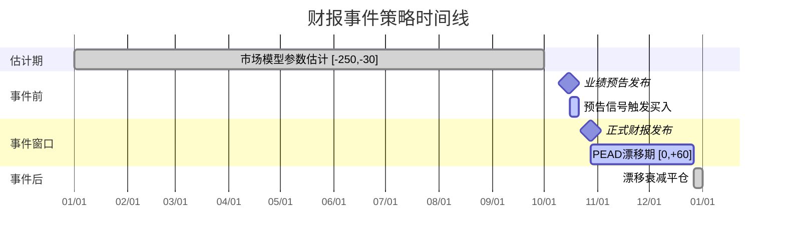

# A股事件驱动策略

## 核心要点

- **事件驱动策略**通过识别特定事件（财报发布、分析师评级变动、公司公告、指数调整、政策发布、日历时点）触发的股价异常波动，捕捉短中期超额收益（Alpha）
- A股市场信息传播效率低于成熟市场，散户占比高、涨跌停限制、T+1 制度等制度特征使事件效应更持久，策略空间更大
- 事件研究法（Event Study）是核心方法论，通过计算 CAR（累计异常收益）和 BHAR（买入持有异常收益）量化事件冲击
- 事件驱动策略可独立运行，也可作为 [[A股多因子选股策略开发全流程|多因子模型]] 的增量 Alpha 来源，叠加后信息比率（IR）提升 0.3~0.5
- 关键风险：事件样本不足导致统计不显著、过拟合、监管政策变化（如高送转限制）使历史规律失效

---

## 一、财报事件策略

### 1.1 业绩超预期策略（SUE / Earnings Surprise）

**事件定义**：上市公司披露定期报告或业绩预告，实际业绩（净利润/EPS）显著高于市场一致预期（Wind 一致预期或自建预测模型）。

**核心机制**：投资者对盈利信息反应不足，导致股价在业绩公告后持续向盈利意外方向漂移——即 PEAD（Post-Earnings Announcement Drift，盈利公告后漂移）效应。

**数据来源**：
- 业绩数据：Wind/Choice 财务数据接口、巨潮资讯公告全文
- 一致预期：Wind 一致预期数据库、朝阳永续分析师预期
- 业绩预告：沪深交易所公告（每年 1/4/7/10 月密集披露）

**信号构建规则**：

| 信号类型 | 计算方法 | 买入条件 | 持有期 |
|---------|---------|---------|--------|
| 标准化超预期（SUE） | (实际EPS - 预期EPS) / 预期EPS标准差 | SUE > 2 | 20~60 个交易日 |
| 净利润断层 | 公告日跳空幅度 + 净利润同比增速 | 跳空 > 3% 且净利润增速 > 30% | 30~90 个交易日 |
| 文本 PEAD（SUE.txt） | XGBoost 对业绩预告文本分类，log-odds 差值 | 文本预测"上涨"概率 > 0.6 | 20~40 个交易日 |
| 业绩预告利好 | 预告净利润下限/上年同期 - 1 | 预告增速 > 50% 且首次预告 | 至正式报告披露 |

**历史超额收益**：

| 策略变体 | 回测区间 | 年化超额（vs 中证500） | 夏普比率 | 来源 |
|---------|---------|----------------------|---------|------|
| 文本 PEAD 增强 | 2013-2021 | 29.98% | 1.57 | 华泰人工智能系列51 |
| 净利润断层 | 2010-2020 | 15~25% | 1.2~1.5 | 新浪财经/券商研报 |
| 传统 SUE 多空 | 2008-2020 | 8~15% | 0.8~1.1 | 学术研究 |

### 1.2 业绩预告利好

**事件定义**：上市公司发布业绩预告（预增/略增/续盈/扭亏），净利润变动幅度超过市场预期。

**信号规则**：
- 预告类型为"预增"或"扭亏"，且预告净利润增速下限 > 50%
- 首次预告优于修正预告（信息增量更大）
- 发布时间越早（如 10 月发次年预告），信号越强

### 1.3 PEAD（财报发布后漂移）

**关键参数**：
- 漂移持续时间：A股约 20~60 个交易日（约 1~3 个月）
- 超预期组 vs 不及预期组的 CAR 差异：事件后 60 日约 6~12%
- 小盘股、低覆盖度个股 PEAD 更显著（信息传播更慢）
- 与 [[A股基本面因子体系|基本面因子]]（如 ROE 改善）叠加效果更好

---

## 二、分析师事件策略

### 2.1 评级上调

**事件定义**：卖方分析师将个股评级从低档（如"中性""减持"）上调至高档（如"买入""增持"）。

**数据来源**：Wind 分析师评级数据库、朝阳永续、东方财富 Choice

**信号规则**：
- 评级从"中性/减持"上调至"买入/增持"
- 优选：多家券商同期上调（一致性信号）
- 过滤：剔除IPO后90日内的首次评级

**历史超额收益**：事件窗口 [0, +20] 日平均 CAR 约 3~7%，效应持续 1~3 个月

### 2.2 目标价上调

**事件定义**：分析师上调个股目标价，且上调幅度显著（> 10%）。

**信号规则**：
- 目标价上调幅度 > 当前股价的 10%
- 隐含上涨空间 = (新目标价 / 当前价) - 1 > 20%
- 叠加盈利预测同步上调更有效

### 2.3 首次覆盖

**事件定义**：分析师首次对某只股票发布深度报告并给出评级。

**信号规则**：
- 首次覆盖报告评级为"买入"或"强烈推荐"
- 发布机构为头部券商（中金、中信、华泰等）权重更高
- 首次覆盖后 20 日平均超额收益约 5~10%

**参数速查**：

| 分析师事件 | 事件窗口 | 平均 CAR | 胜率 | 衰减速度 |
|-----------|---------|----------|------|---------|
| 评级上调 | [0, +20]日 | 3~7% | 55~62% | 20日后衰减 |
| 目标价上调>10% | [0, +20]日 | 4~8% | 58~65% | 30日后衰减 |
| 首次覆盖（买入） | [0, +20]日 | 5~10% | 60~68% | 40日后衰减 |

> 注意：分析师事件存在"选择偏差"——分析师倾向在股价已上涨后发布乐观报告，需控制动量因子后检验净效应。参考 [[因子评估方法论]] 中的 Fama-MacBeth 回归。

---

## 三、公告事件策略

### 3.1 定增预案

**事件定义**：上市公司董事会公告非公开发行股票预案（定向增发）。

**信号逻辑**：
- 定增用于项目投资/资产注入（利好） vs 补充流动资金（中性）
- 折价率 > 10% 信号更强（大股东/机构愿以折价认购，看好未来）
- 定增对象含大股东/管理层认购占比 > 30% 更优

**历史超额收益**：预案公告后 [0, +60] 日平均 CAR 约 5~15%，但审批周期长，需跟踪证监会审核进度

### 3.2 股权激励

**事件定义**：公司公告股权激励计划（限制性股票或股票期权）。

**信号规则**：
- 行权价/授予价折价率 > 20%（管理层获益空间大，有动力做业绩）
- 激励对象覆盖核心技术人员比例 > 50%
- 业绩考核条件（如营收增速 > 20%）反映管理层信心

**历史超额收益**：公告后 [0, +30] 日平均 CAR 约 3~8%

### 3.3 回购

**事件定义**：公司公告以自有资金回购股份（用于注销或股权激励）。

**信号规则**：
- 回购金额/总市值 > 1%（实质性回购）
- 回购目的为"注销"优于"股权激励"
- 大股东同步增持信号更强

### 3.4 大股东增减持

**事件定义**：持股 5% 以上股东或董监高公告增持/减持计划。

**信号规则与历史超额**：

| 事件类型 | 信号条件 | 持有期 | 平均超额收益 | 胜率 |
|---------|---------|--------|-------------|------|
| 大股东增持 | 增持金额 > 5000万 且前20日跌幅 > 3% | 20日 | 2.2~3.3% | 56.5% |
| 大股东增持 | 同上 | 60日 | 3.3~6.5% | 55~60% |
| 大股东减持 | 减持比例 > 1% 且质押率 > 50% | 规避 | -2~-5% | 负面信号 |

> 中金研究显示：公告前 20 日累计超额收益 < -3% 的增持样本，后续超额更显著（均值回复叠加增持信号）。

### 3.5 限售股解禁

**事件定义**：限售股到达解禁日，流通股供应增加。

**信号规则**：
- 解禁市值 / 流通市值 > 20% 为大规模解禁（负面冲击更大）
- 解禁前 10~5 日建立空头或规避
- 首发限售股解禁冲击 > 定增限售股解禁

**历史表现**：大规模解禁前 [-10, 0] 日平均 CAR 约 -2~-5%

---

## 四、指数成分股调整事件

### 4.1 调整机制

[[A股指数体系与基准构建|沪深300与中证500]]指数每半年定期调整成分股（6月和12月），中证指数公司提前约两周公布调整名单。被动指数基金（沪深300 ETF 规模超万亿）必须在生效日前完成调仓。

### 4.2 信号规则

| 操作方向 | 标的 | 建仓时点 | 平仓时点 | 预期超额 |
|---------|------|---------|---------|---------|
| 做多 | 调入股 | 公告后 T+1 | 生效日 T+3 | 3~5% |
| 做空/规避 | 调出股 | 公告后 T+1 | 生效日 T+3 | -2~-4% |
| 跨指数套利 | 沪深300调出→中证500调入 | 公告后 T+1 | 生效日 T+5 | 2~4% |

### 4.3 超额收益统计

| 策略 | 预期年化超额 | 触发频率 | 备注 |
|------|------------|---------|------|
| 调入做多+调出做空 | 5~10% | 每半年1次 | 近年效应弱化，套利者增多 |
| 行业轮动增强 | 8~12% | 叠加行业因子 | 电子/电力设备调入多，医药调出多 |
| 跨指数套利 | 4~7% | 每半年1次 | 需融券做空能力 |

### 4.4 注意事项

- 效应逐年弱化：随着量化资金和 ETF 套利者增多，提前交易压缩了超额空间
- 预测难度：需根据中证指数公司的编制规则（自由流通市值、日均成交额等）提前预测调整名单
- 调整生效后效应消失：长期持有调入股无显著超额

---

## 五、政策事件策略

### 5.1 行业政策

**典型事件**：新能源补贴政策、集采降价政策、房地产调控政策、AI 产业支持政策

**信号框架**：
- 政策方向：利好（补贴/扶持）→ 做多相关行业；利空（限制/调控）→ 规避或做空
- 政策力度：量化财政投入规模、覆盖范围
- 政策预期差：市场已充分预期的政策效应弱，超预期政策效应强

**数据来源**：国务院/各部委官网、[[A股量化数据源全景图|新闻文本数据]]（NLP 情感分析提取政策信号）

### 5.2 货币政策

**典型事件**：降准、降息（LPR 下调）、MLF 利率调整

**历史规律**：
- 降准公告后 5 个交易日：沪深300 平均涨幅 1.5~3%，金融/地产板块弹性最大
- 降息公告后 10 个交易日：成长股（高久期资产）超额收益显著
- 2026年预计 1~2 次降准（0.5~1个百分点）、2 次降息（累计 20~30BP）

### 5.3 监管政策

**典型事件**：IPO 节奏调整、再融资政策收紧/放松、转融通暂停、量化交易监管

**信号逻辑**：监管收紧通常利好壳资源/小盘股（减少供给），放松则利好券商/投行

> 政策事件最大的挑战在于"非结构化"——政策文本需要 NLP 解析，且政策效果存在时滞。参考 [[A股另类数据与另类因子]] 中的新闻舆情因子。

---

## 六、日历效应

### 6.1 日历效应统计表

| 效应名称 | 时间窗口 | 方向 | 平均幅度（沪深300） | 胜率 | 主要驱动因素 |
|---------|---------|------|-------------------|------|-------------|
| **月初效应** | 每月第 1~7 个交易日 | 正向 | +1.0~2.0% | 60~65% | 机构月初建仓、公募基金申购资金到账 |
| **春节效应** | 春节前 5 日 + 后 5 日 | 正向 | +2.0~4.0% | 70~80% | 节前资金回流、节后开工预期、小盘股规模效应叠加 |
| **两会效应** | 3月全国两会期间（~10 个交易日） | 正向偏稳 | +0.5~1.5% | 65~70% | 维稳预期、政策利好预期 |
| **国庆效应** | 国庆前 2 日 + 后 12 日 | 正向 | +1.5~3.0% | 70~75% | 三季报预期、基金年底排名博弈、低 PE 跑赢高 PE |
| **年报披露期效应** | 1~4 月年报季 | 分化 | 超预期 +3~8%，不及预期 -3~-6% | - | 盈利预期调整、PEAD 叠加 |
| **"卖在五月"效应** | 5~9 月 | 负向偏弱 | -0.5~-2.0% | 45~50% | 海外资金季节性流出、业绩真空期 |

### 6.2 日历效应使用建议

1. **不宜单独作为交易信号**——胜率虽高但幅度有限，需叠加其他因子
2. **可用于仓位管理**——春节/国庆前提高仓位，五六月适当降低
3. **小盘股日历效应更显著**——与 [[A股市场参与者结构与资金流分析|散户交易行为]] 高度相关
4. **近年效应弱化趋势**——机构化程度提高后，部分效应（如月初效应）已不稳定

---

## 七、事件研究方法论

### 7.1 CAR（Cumulative Abnormal Return，累计异常收益）

**核心步骤**：
1. **估计期**（Estimation Window）：事件日前 [-250, -30] 日，用市场模型估计个股的 alpha 和 beta
2. **事件窗口**（Event Window）：事件日附近 [-T1, +T2]，计算异常收益
3. **异常收益**：AR_t = R_t - (alpha + beta * R_mt)
4. **累计异常收益**：CAR = SUM(AR_t)，t 从 -T1 到 +T2
5. **显著性检验**：t 检验 / 非参数秩检验

### 7.2 BHAR（Buy-and-Hold Abnormal Return，买入持有异常收益）

$$BHAR = \prod_{t=1}^{T}(1 + R_{it}) - \prod_{t=1}^{T}(1 + R_{mt})$$

- 适用于中长期事件效应评估（30 日以上）
- 避免了 CAR 的每日复合偏差
- 但对极端值更敏感，建议 Winsorize 处理

### 7.3 CAR vs BHAR 对比

| 维度 | CAR | BHAR |
|------|-----|------|
| 适用期限 | 短期（1~30日） | 中长期（30~250日） |
| 计算简便性 | 简单求和 | 需连乘 |
| 偏差 | 短期无偏，长期有正偏 | 对极端值敏感 |
| 统计检验 | 标准 t 检验 | 需 Bootstrap 或非参数检验 |
| A股应用场景 | 公告事件、评级变动 | 定增/股权激励长期效应 |

### 7.4 基准模型选择

| 基准模型 | 公式 | 适用场景 |
|---------|------|---------|
| 市场调整模型 | AR = R_i - R_m | 简单快速，适合初筛 |
| 市场模型（CAPM） | AR = R_i - (alpha + beta * R_m) | 标准方法，控制系统风险 |
| Fama-French 三因子 | AR = R_i - (alpha + beta_m*R_m + beta_s*SMB + beta_v*HML) | 控制规模/价值效应 |
| 行业调整模型 | AR = R_i - R_industry | 控制行业轮动影响 |

---

## 八、参数速查表

### 8.1 各事件类型参数汇总

| 事件类型 | 信号来源 | 事件窗口 | 预期 CAR | 胜率 | 样本频率 | 衰减周期 |
|---------|---------|---------|---------|------|---------|---------|
| 业绩超预期（SUE>2） | 财报/业绩预告 | [0, +60]日 | +6~12% | 55~65% | 季度 | 60日 |
| 净利润断层 | 财报+价格跳空 | [0, +90]日 | +15~25% | 55~60% | 季度 | 90日 |
| 分析师评级上调 | 研报数据库 | [0, +20]日 | +3~7% | 55~62% | 持续 | 20日 |
| 首次覆盖 | 研报数据库 | [0, +20]日 | +5~10% | 60~68% | 持续 | 40日 |
| 定增预案 | 公司公告 | [0, +60]日 | +5~15% | 55~65% | 不定期 | 60日 |
| 股权激励 | 公司公告 | [0, +30]日 | +3~8% | 55~62% | 不定期 | 30日 |
| 回购公告 | 公司公告 | [0, +20]日 | +2~5% | 55~60% | 不定期 | 20日 |
| 大股东增持 | 公司公告 | [0, +60]日 | +2.2~6.5% | 56.5% | 不定期 | 60~120日 |
| 限售股解禁 | 解禁日历 | [-10, 0]日 | -2~-5% | 负面 | 可预测 | 10日 |
| 指数调入 | 中证指数公司 | [公告, 生效+3]日 | +3~5% | 60~70% | 半年1次 | 生效后消失 |
| 指数调出 | 中证指数公司 | [公告, 生效+3]日 | -2~-4% | 负面 | 半年1次 | 生效后消失 |
| 降准公告 | 央行 | [0, +5]日 | +1.5~3% | 65~75% | 年1~2次 | 5~10日 |

### 8.2 关键阈值参数

| 参数 | 推荐值 | 用途 |
|------|--------|------|
| SUE 阈值 | > 2 | 业绩超预期筛选 |
| 净利润断层跳空 | > 3% | 价格跳空确认 |
| 目标价上调幅度 | > 10% | 分析师信号筛选 |
| 定增折价率 | > 10% | 定增质量筛选 |
| 股权激励行权折价 | > 20% | 激励信号筛选 |
| 回购金额/市值 | > 1% | 实质性回购筛选 |
| 增持金额 | > 5000万元 | 大股东增持筛选 |
| 解禁市值/流通市值 | > 20% | 大规模解禁预警 |
| 估计期长度 | 120~250日 | 市场模型参数估计 |
| 事件窗口 | [-5, +60]日 | CAR计算 |

---

## 九、策略框架图

### 9.1 事件驱动策略整体框架



### 9.2 事件时间线（以财报事件为例）



---

## 十、Python 代码

### 10.1 事件研究法核心代码（CAR / BHAR）

```python
"""
事件研究法：CAR 和 BHAR 计算框架
依赖：pandas, numpy, statsmodels, tushare
"""
import pandas as pd
import numpy as np
from statsmodels.api import OLS, add_constant
from scipy import stats


def estimate_market_model(
    stock_ret: pd.Series,
    market_ret: pd.Series,
    est_start: int = -250,
    est_end: int = -30
) -> tuple:
    """
    用估计期数据拟合市场模型，返回 alpha 和 beta

    Parameters
    ----------
    stock_ret : 个股日收益率序列（index为相对事件日的偏移天数）
    market_ret : 市场基准日收益率序列
    est_start, est_end : 估计期起止（相对事件日）
    """
    mask = (stock_ret.index >= est_start) & (stock_ret.index <= est_end)
    y = stock_ret[mask].dropna()
    x = market_ret.reindex(y.index).dropna()
    y = y.reindex(x.index)

    model = OLS(y, add_constant(x)).fit()
    alpha, beta = model.params[0], model.params[1]
    return alpha, beta


def calc_car(
    stock_ret: pd.Series,
    market_ret: pd.Series,
    window: tuple = (-5, 60),
    est_window: tuple = (-250, -30)
) -> pd.DataFrame:
    """
    计算事件窗口内的 CAR

    Returns
    -------
    DataFrame with columns: [day, ar, car]
    """
    alpha, beta = estimate_market_model(
        stock_ret, market_ret, est_window[0], est_window[1]
    )

    mask = (stock_ret.index >= window[0]) & (stock_ret.index <= window[1])
    r_stock = stock_ret[mask]
    r_market = market_ret.reindex(r_stock.index)

    # 异常收益
    ar = r_stock - (alpha + beta * r_market)
    car = ar.cumsum()

    result = pd.DataFrame({
        'day': ar.index,
        'ar': ar.values,
        'car': car.values
    })
    return result


def calc_bhar(
    stock_ret: pd.Series,
    market_ret: pd.Series,
    window: tuple = (0, 60)
) -> float:
    """
    计算买入持有异常收益 BHAR
    """
    mask = (stock_ret.index >= window[0]) & (stock_ret.index <= window[1])
    r_stock = stock_ret[mask]
    r_market = market_ret.reindex(r_stock.index)

    bhar = (1 + r_stock).prod() - (1 + r_market).prod()
    return bhar


def event_study_batch(
    events: pd.DataFrame,
    price_data: pd.DataFrame,
    market_ret: pd.Series,
    window: tuple = (-5, 60),
    est_window: tuple = (-250, -30)
) -> pd.DataFrame:
    """
    批量事件研究

    Parameters
    ----------
    events : DataFrame with columns [stock_code, event_date]
    price_data : 宽表，columns=stock_code, index=trade_date, values=收益率
    market_ret : 市场基准收益率，index=trade_date

    Returns
    -------
    DataFrame: 每日平均 CAR 及 t 检验结果
    """
    all_cars = []

    for _, row in events.iterrows():
        code = row['stock_code']
        evt_date = row['event_date']

        if code not in price_data.columns:
            continue

        # 获取个股收益率并转为相对事件日的偏移
        stock_full = price_data[code].dropna()
        trade_dates = stock_full.index.tolist()

        if evt_date not in trade_dates:
            continue

        evt_idx = trade_dates.index(evt_date)

        # 构造相对日期索引
        rel_start = max(0, evt_idx + est_window[0])
        rel_end = min(len(trade_dates) - 1, evt_idx + window[1])

        sub_ret = stock_full.iloc[rel_start:rel_end + 1].copy()
        sub_ret.index = range(
            est_window[0] + (rel_start - (evt_idx + est_window[0])),
            est_window[0] + (rel_start - (evt_idx + est_window[0])) + len(sub_ret)
        )

        sub_mkt = market_ret.iloc[rel_start:rel_end + 1].copy()
        sub_mkt.index = sub_ret.index

        car_df = calc_car(sub_ret, sub_mkt, window, est_window)
        car_df['stock_code'] = code
        car_df['event_date'] = evt_date
        all_cars.append(car_df)

    if not all_cars:
        return pd.DataFrame()

    combined = pd.concat(all_cars, ignore_index=True)

    # 每日截面平均 CAR 及 t 检验
    summary = combined.groupby('day').agg(
        mean_car=('car', 'mean'),
        std_car=('car', 'std'),
        count=('car', 'count')
    ).reset_index()

    summary['t_stat'] = (
        summary['mean_car'] / (summary['std_car'] / np.sqrt(summary['count']))
    )
    summary['p_value'] = 2 * (1 - stats.t.cdf(
        abs(summary['t_stat']), df=summary['count'] - 1
    ))
    summary['significant'] = summary['p_value'] < 0.05

    return summary
```

### 10.2 各事件数据获取（Tushare）

```python
"""
各类事件数据获取模块
依赖：tushare (需 pro 接口权限), pandas
"""
import tushare as ts
import pandas as pd

# 初始化 tushare
pro = ts.pro_api('YOUR_TOKEN')


# ==================== 1. 财报事件 ====================

def get_earnings_surprise(report_date: str, threshold: float = 0.5) -> pd.DataFrame:
    """
    获取业绩超预期股票

    Parameters
    ----------
    report_date : 报告期，如 '20251231'
    threshold : 超预期阈值（实际/预期 - 1 > threshold）
    """
    # 获取业绩预告
    forecast = pro.forecast(
        ann_date='',
        period=report_date,
        fields='ts_code,ann_date,type,p_change_min,p_change_max'
    )

    # 筛选预增/扭亏
    surprise = forecast[
        (forecast['type'].isin(['预增', '扭亏'])) &
        (forecast['p_change_min'] > threshold * 100)
    ].copy()

    surprise['signal_strength'] = (
        surprise['p_change_min'] + surprise['p_change_max']
    ) / 200

    return surprise.sort_values('signal_strength', ascending=False)


def get_earnings_express(period: str) -> pd.DataFrame:
    """获取业绩快报数据"""
    return pro.express(
        period=period,
        fields='ts_code,ann_date,revenue,operate_profit,n_income,'
               'yoy_net_profit,perf_summary'
    )


# ==================== 2. 分析师事件 ====================

def get_analyst_upgrades(
    start_date: str,
    end_date: str,
    min_upgrade_pct: float = 10.0
) -> pd.DataFrame:
    """
    获取分析师评级上调和目标价上调事件
    注意：完整分析师数据需 Wind/Choice 接口，此处为简化版
    """
    # tushare 分析师评级数据（需较高积分权限）
    ratings = pro.report_rc(
        start_date=start_date,
        end_date=end_date,
        fields='ts_code,report_date,rating,pre_rating,organ'
    )

    # 评级映射
    rating_map = {'买入': 5, '增持': 4, '推荐': 4, '中性': 3, '减持': 2, '卖出': 1}

    if not ratings.empty:
        ratings['cur_score'] = ratings['rating'].map(rating_map)
        ratings['pre_score'] = ratings['pre_rating'].map(rating_map)
        upgrades = ratings[ratings['cur_score'] > ratings['pre_score']].copy()
        return upgrades

    return pd.DataFrame()


# ==================== 3. 公告事件 ====================

def get_share_buyback(start_date: str, end_date: str) -> pd.DataFrame:
    """获取股票回购公告"""
    return pro.repurchase(
        start_date=start_date,
        end_date=end_date,
        fields='ts_code,ann_date,proc,amount,exp_date'
    )


def get_share_pledge(trade_date: str) -> pd.DataFrame:
    """获取股权质押数据（辅助判断减持风险）"""
    return pro.pledge_stat(
        ts_code='',
        end_date=trade_date,
        fields='ts_code,pledge_count,unrest_pledge,rest_pledge,total_share,pledge_ratio'
    )


def get_block_trade(start_date: str, end_date: str) -> pd.DataFrame:
    """获取大宗交易数据（大股东减持常通过大宗交易）"""
    return pro.block_trade(
        start_date=start_date,
        end_date=end_date,
        fields='ts_code,trade_date,price,vol,amount,buyer,seller'
    )


def get_share_float(
    start_date: str,
    end_date: str,
    min_ratio: float = 0.2
) -> pd.DataFrame:
    """
    获取限售股解禁数据

    Parameters
    ----------
    min_ratio : 解禁市值/流通市值最低比例
    """
    float_data = pro.share_float(
        start_date=start_date,
        end_date=end_date,
        fields='ts_code,float_date,float_share,float_ratio,share_type'
    )

    if not float_data.empty:
        float_data = float_data[float_data['float_ratio'] > min_ratio * 100]

    return float_data


def get_stk_holdertrade(
    start_date: str,
    end_date: str,
    trade_type: str = 'IN'
) -> pd.DataFrame:
    """
    获取大股东增减持数据

    Parameters
    ----------
    trade_type : 'IN'=增持, 'DE'=减持
    """
    return pro.stk_holdertrade(
        start_date=start_date,
        end_date=end_date,
        trade_type=trade_type,
        fields='ts_code,ann_date,holder_name,in_de,change_vol,'
               'change_ratio,after_share,after_ratio'
    )


# ==================== 4. 指数调整事件 ====================

def get_index_changes(
    index_code: str = '000300.SH',
    start_date: str = '20250101',
    end_date: str = '20261231'
) -> dict:
    """
    获取指数成分股调整记录
    需对比不同时间点的成分股列表
    """
    # 获取当前成分股
    current = pro.index_weight(
        index_code=index_code,
        start_date=end_date,
        end_date=end_date,
        fields='index_code,con_code,trade_date,weight'
    )

    # 获取历史成分股
    previous = pro.index_weight(
        index_code=index_code,
        start_date=start_date,
        end_date=start_date,
        fields='index_code,con_code,trade_date,weight'
    )

    if current.empty or previous.empty:
        return {'added': [], 'removed': []}

    cur_set = set(current['con_code'])
    pre_set = set(previous['con_code'])

    return {
        'added': list(cur_set - pre_set),     # 调入
        'removed': list(pre_set - cur_set)     # 调出
    }


# ==================== 5. 日历效应辅助 ====================

def get_calendar_events(year: int) -> pd.DataFrame:
    """
    生成日历效应事件日期表
    """
    events = []

    # 月初效应：每月前7个交易日
    trade_cal = pro.trade_cal(
        exchange='SSE',
        start_date=f'{year}0101',
        end_date=f'{year}1231',
        is_open='1'
    )

    trade_dates = trade_cal.sort_values('cal_date')['cal_date'].tolist()

    # 按月分组取前7个交易日
    months = {}
    for d in trade_dates:
        m = d[:6]
        if m not in months:
            months[m] = []
        if len(months[m]) < 7:
            months[m].append(d)
            events.append({
                'date': d,
                'event_type': '月初效应',
                'direction': 'long'
            })

    return pd.DataFrame(events)
```

### 10.3 事件驱动回测框架

```python
"""
事件驱动回测框架（简化版）
支持多事件类型、事件复合信号、T+1 约束
"""
import pandas as pd
import numpy as np
from typing import Dict, List, Callable


class EventDrivenBacktester:
    """A股事件驱动回测引擎"""

    def __init__(
        self,
        price_data: pd.DataFrame,
        market_ret: pd.Series,
        commission: float = 0.0015,     # 单边佣金+印花税
        slippage: float = 0.001,        # 滑点
        max_holding: int = 60,          # 最大持有天数
        max_positions: int = 50         # 最大持仓数
    ):
        """
        Parameters
        ----------
        price_data : 收盘价宽表 (index=trade_date, columns=stock_code)
        market_ret : 市场基准日收益率
        """
        self.price = price_data
        self.ret = price_data.pct_change()
        self.market_ret = market_ret
        self.commission = commission
        self.slippage = slippage
        self.max_holding = max_holding
        self.max_positions = max_positions

        self.trade_dates = price_data.index.tolist()
        self.positions: Dict[str, dict] = {}   # {code: {entry_date, entry_price, hold_days}}
        self.trade_log: List[dict] = []
        self.daily_pnl: List[dict] = []

    def run(self, events: pd.DataFrame) -> pd.DataFrame:
        """
        运行回测

        Parameters
        ----------
        events : DataFrame with columns [stock_code, event_date, signal_strength]
                 event_date 为信号触发日，T+1 买入
        """
        events = events.sort_values('event_date')
        event_dict = events.groupby('event_date').apply(
            lambda x: x.to_dict('records')
        ).to_dict()

        for i, date in enumerate(self.trade_dates):
            # 1. 检查持仓是否到期，平仓
            codes_to_close = []
            for code, pos in self.positions.items():
                pos['hold_days'] += 1
                if pos['hold_days'] >= self.max_holding:
                    codes_to_close.append(code)

            for code in codes_to_close:
                self._close_position(code, date, reason='到期平仓')

            # 2. T+1 买入：昨日触发的事件，今日开盘买入
            if i > 0:
                prev_date = self.trade_dates[i - 1]
                prev_date_str = (
                    prev_date.strftime('%Y%m%d')
                    if hasattr(prev_date, 'strftime')
                    else str(prev_date)
                )

                if prev_date_str in event_dict:
                    new_events = sorted(
                        event_dict[prev_date_str],
                        key=lambda x: x.get('signal_strength', 0),
                        reverse=True
                    )

                    for evt in new_events:
                        if len(self.positions) >= self.max_positions:
                            break
                        code = evt['stock_code']
                        if code not in self.positions and code in self.price.columns:
                            self._open_position(code, date, evt)

            # 3. 记录当日 PnL
            self._record_daily_pnl(date)

        # 清仓
        for code in list(self.positions.keys()):
            self._close_position(code, self.trade_dates[-1], reason='回测结束')

        return self._generate_report()

    def _open_position(self, code: str, date, event: dict):
        """开仓（T+1 买入）"""
        if code in self.price.columns:
            entry_price = self.price.loc[date, code]
            if pd.notna(entry_price) and entry_price > 0:
                cost = entry_price * (1 + self.commission + self.slippage)
                self.positions[code] = {
                    'entry_date': date,
                    'entry_price': cost,
                    'hold_days': 0,
                    'event': event
                }
                self.trade_log.append({
                    'code': code, 'date': date, 'action': 'BUY',
                    'price': cost, 'event_type': event.get('event_type', '')
                })

    def _close_position(self, code: str, date, reason: str = ''):
        """平仓"""
        if code in self.positions and code in self.price.columns:
            exit_price = self.price.loc[date, code]
            if pd.notna(exit_price):
                pos = self.positions.pop(code)
                net_price = exit_price * (1 - self.commission - self.slippage)
                pnl = (net_price / pos['entry_price']) - 1
                self.trade_log.append({
                    'code': code, 'date': date, 'action': 'SELL',
                    'price': net_price, 'pnl': pnl,
                    'hold_days': pos['hold_days'], 'reason': reason
                })

    def _record_daily_pnl(self, date):
        """记录每日组合收益"""
        if not self.positions:
            self.daily_pnl.append({'date': date, 'portfolio_ret': 0.0, 'n_positions': 0})
            return

        rets = []
        for code in self.positions:
            if code in self.ret.columns:
                r = self.ret.loc[date, code]
                if pd.notna(r):
                    rets.append(r)

        avg_ret = np.mean(rets) if rets else 0.0
        self.daily_pnl.append({
            'date': date, 'portfolio_ret': avg_ret,
            'n_positions': len(self.positions)
        })

    def _generate_report(self) -> pd.DataFrame:
        """生成回测报告"""
        pnl_df = pd.DataFrame(self.daily_pnl)
        pnl_df['cum_ret'] = (1 + pnl_df['portfolio_ret']).cumprod() - 1
        pnl_df['market_cum'] = (1 + self.market_ret.reindex(pnl_df['date']).fillna(0).values).cumprod() - 1
        pnl_df['excess_ret'] = pnl_df['cum_ret'] - pnl_df['market_cum']

        # 核心指标
        total_days = len(pnl_df)
        annual_factor = 242 / total_days if total_days > 0 else 1

        total_ret = pnl_df['cum_ret'].iloc[-1] if len(pnl_df) > 0 else 0
        annual_ret = (1 + total_ret) ** annual_factor - 1

        daily_rets = pnl_df['portfolio_ret']
        sharpe = (daily_rets.mean() / daily_rets.std() * np.sqrt(242)
                  if daily_rets.std() > 0 else 0)

        # 最大回撤
        cum = (1 + daily_rets).cumprod()
        max_dd = (cum / cum.cummax() - 1).min()

        trades = pd.DataFrame(self.trade_log)
        win_trades = trades[trades.get('pnl', pd.Series()) > 0] if 'pnl' in trades.columns else pd.DataFrame()
        sell_trades = trades[trades['action'] == 'SELL'] if not trades.empty else pd.DataFrame()
        win_rate = len(win_trades) / len(sell_trades) if len(sell_trades) > 0 else 0

        print(f"{'='*50}")
        print(f"事件驱动策略回测报告")
        print(f"{'='*50}")
        print(f"累计收益率:   {total_ret:.2%}")
        print(f"年化收益率:   {annual_ret:.2%}")
        print(f"夏普比率:     {sharpe:.2f}")
        print(f"最大回撤:     {max_dd:.2%}")
        print(f"胜率:         {win_rate:.2%}")
        print(f"总交易次数:   {len(sell_trades)}")
        print(f"{'='*50}")

        return pnl_df


# ==================== 使用示例 ====================

if __name__ == '__main__':
    # 1. 准备数据（示意）
    # price_data = pd.read_csv('close_prices.csv', index_col=0, parse_dates=True)
    # market_ret = price_data['000300.SH'].pct_change()  # 沪深300作为基准

    # 2. 准备事件表
    # events = pd.DataFrame({
    #     'stock_code': ['000001.SZ', '600036.SH', ...],
    #     'event_date': ['20250415', '20250420', ...],
    #     'event_type': ['earnings_surprise', 'analyst_upgrade', ...],
    #     'signal_strength': [2.5, 1.8, ...]
    # })

    # 3. 运行回测
    # bt = EventDrivenBacktester(
    #     price_data=price_data,
    #     market_ret=market_ret,
    #     commission=0.0015,
    #     max_holding=60,
    #     max_positions=50
    # )
    # result = bt.run(events)

    pass
```

---

## 十一、常见误区

### 误区一：忽略前视偏差（Look-Ahead Bias）
使用公告发布日（ann_date）而非报告期（report_date）作为事件触发时点。A股年报可在次年 4 月 30 日前披露，若使用报告期末日期作为信号日，将引入严重前视偏差。

### 误区二：低估交易成本
事件驱动策略换手率高（年化换手 10~20 倍），佣金+印花税+滑点+冲击成本合计可达单边 0.15~0.30%。回测中需扣除真实交易成本。参考 [[A股交易制度全解析|交易制度]] 中的费率结构。

### 误区三：幸存者偏差
回测样本中需包含已退市股票，否则高估策略收益。特别是在限售股解禁和业绩不及预期策略中，剔除退市股会严重扭曲结果。

### 误区四：忽略 T+1 制度约束
A股 T+1 交易制度意味着事件日当天无法买入并当日卖出。信号触发后最早 T+1 日买入，回测必须严格模拟此约束。

### 误区五：过度拟合事件参数
对事件阈值（如 SUE > 2.3 优于 SUE > 2.0）进行过度优化，导致样本内表现优异但样本外失效。建议使用滚动窗口（Rolling Window）回测验证参数稳定性。

### 误区六：忽略事件间相关性
多个事件（如业绩超预期 + 分析师上调 + 大股东增持）可能同时发生在同一只股票上。需要控制事件间相关性，避免重复计算超额收益。

### 误区七：将日历效应视为"免费午餐"
日历效应的统计显著性可能随时间衰减。春节效应和月初效应在机构化程度提高后有弱化趋势。不宜机械式执行日历策略，需每年重新验证。

### 误区八：忽略政策事件的非线性影响
降准/降息并非总是利好——若市场已充分预期，政策落地可能触发"利好出尽"效应。需区分预期内和超预期的政策事件。

---

## 十二、相关笔记

- [[A股交易制度全解析]] — T+1 制度、涨跌停限制对事件策略执行的影响
- [[A股基本面因子体系]] — SUE、ROE 等盈利因子与 PEAD 策略的关系
- [[A股另类数据与另类因子]] — 新闻舆情 NLP 用于政策事件解析
- [[A股市场参与者结构与资金流分析]] — 散户/机构行为差异与事件效应强度
- [[A股指数体系与基准构建]] — 沪深300/中证500 编制规则与成分股调整机制
- [[因子评估方法论]] — Fama-MacBeth 回归、因子 IC 用于事件因子评估
- [[A股量化数据源全景图]] — Wind/Tushare/Choice 事件数据获取
- [[A股多因子选股策略开发全流程]] — 事件因子纳入多因子组合的方法
- [[A股技术面因子与量价特征]] — 量价因子与事件信号的叠加效应
- [[A股可转债量化策略]] — 可转债下修/强赎事件驱动策略
- [[A股机器学习量化策略]] — NLP文本分析在事件提取与情感分类中的应用

---

## 来源参考

1. 华泰人工智能系列51：文本PEAD选股策略，华泰证券研究所
2. 星火多因子专题报告14：将事件驱动融入因子选股，东方证券研究所
3. 广发证券：事件驱动策略之大股东增减持，广发证券研究所
4. 东方财富研究：A股事件驱动基金超额收益分析，21世纪经济报道
5. 中金公司：大股东增持事件的量化研究，中金研究
6. Ball, R., & Brown, P. (1968). An Empirical Evaluation of Accounting Income Numbers. *Journal of Accounting Research*
7. Bernard, V. L., & Thomas, J. K. (1989). Post-Earnings-Announcement Drift: Delayed Price Response or Risk Premium? *Journal of Accounting Research*
8. 华泰证券：农历效应与A股市场日历异象研究
9. 中证指数公司：沪深300/中证500指数编制方案
10. BigQuant 量化社区：A股日历效应实证研究
