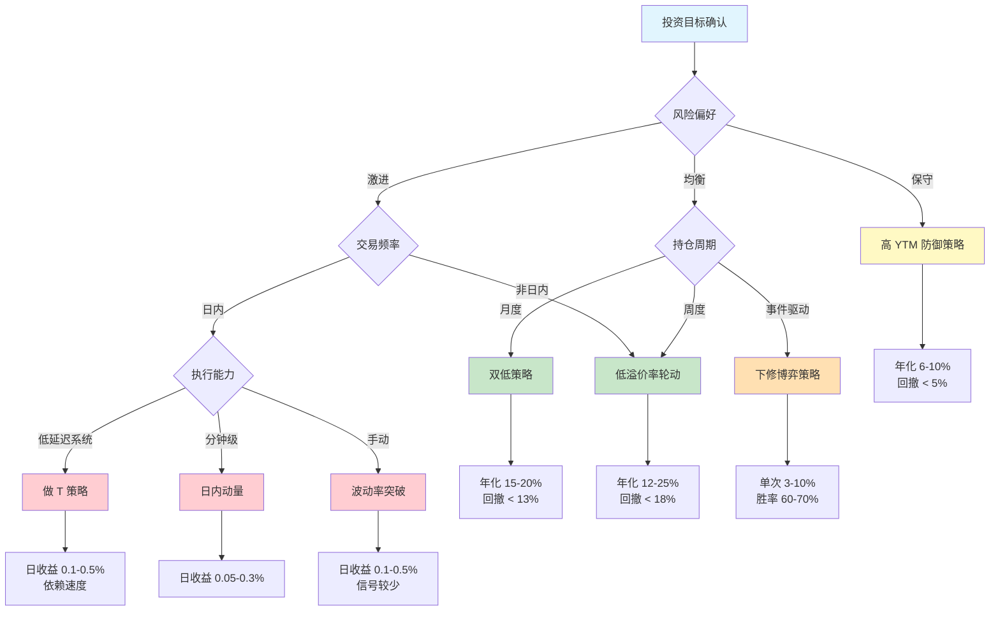
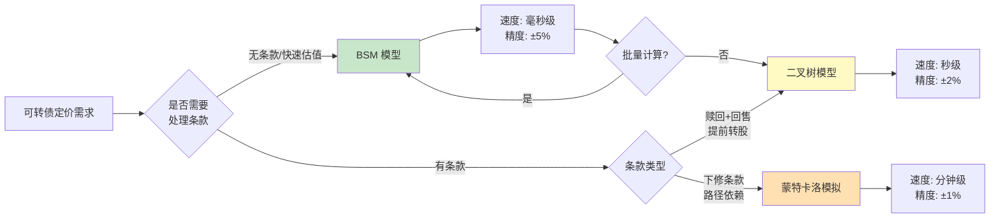

# A股可转债量化策略

## 核心要点

| 维度 | 关键结论 |
|------|----------|
| 品种特性 | 可转债 = 纯债 + 转股期权 + 下修/回售/赎回条款，T+0 交易，涨跌幅限制（上市首日 57.3%/20%，次日起 20%） |
| 定价方法 | BSM（快速估值）、二叉树（美式特征 + 条款）、蒙特卡洛（路径依赖条款），信用利差 0.5%~3% |
| 核心策略 | 双低策略（年化 ~15.8%）、低溢价率轮动、高 YTM 防御、下修博弈（事件驱动） |
| 日内交易 | T+0 做 T、日内动量、波动率突破，依赖正股联动与低延迟执行 |
| 关键因子 | 转股溢价率、YTM、余额、信用评级、正股动量，多因子组合年化可达 30%+ |
| 组合构建 | 等权 20~30 只，单券 < 5%，单行业 < 20%，AA- 以上占比 > 70% |

> [!important] A股可转债独特优势
> 1. **T+0 交易**：当日买入当日可卖，天然适合日内策略（参见 [[A股交易制度全解析]]）
> 2. **债底保护**：纯债价值提供下行安全垫，回撤天然可控
> 3. **条款博弈**：下修/回售/强赎条款创造独特 alpha 来源
> 4. **低门槛**：最低 1 手（10 张 = 1000 元），适合策略分散化

---

## 一、可转债定价模型

可转债价值可分解为：

$$V_{CB} = V_{bond} + V_{option} - V_{issuer\_call} + V_{put} + V_{reset}$$

其中 $V_{bond}$ 为纯债价值，$V_{option}$ 为转股期权价值，$V_{issuer\_call}$ 为发行人赎回权价值，$V_{put}$ 为投资者回售权价值，$V_{reset}$ 为下修条款价值。

### 1.1 BSM 模型（欧式近似）

**适用场景**：快速估值、因子计算、大批量筛选

**核心假设**：将转股权视为欧式看涨期权，忽略美式特征和复杂条款。

```python
import numpy as np
from scipy.stats import norm

def black_scholes_call(S: float, K: float, T: float, r: float, sigma: float) -> float:
    """BSM 欧式看涨期权定价
    Args:
        S: 正股现价
        K: 转股价
        T: 剩余期限（年）
        r: 无风险利率
        sigma: 正股波动率（年化）
    """
    d1 = (np.log(S / K) + (r + 0.5 * sigma**2) * T) / (sigma * np.sqrt(T))
    d2 = d1 - sigma * np.sqrt(T)
    return S * norm.cdf(d1) - K * np.exp(-r * T) * norm.cdf(d2)

def cb_price_bsm(face: float, conv_ratio: float, coupon_rate: float,
                  r: float, T: float, S: float, sigma: float,
                  credit_spread: float = 0.02) -> dict:
    """可转债 BSM 定价
    Args:
        face: 面值（通常 100）
        conv_ratio: 转换比例 = 面值 / 转股价
        coupon_rate: 票面利率
        credit_spread: 信用利差
    Returns:
        dict: 纯债价值、期权价值、理论价格
    """
    eff_r = r + credit_spread  # 纯债折现用 r + spread
    # 纯债现值（逐年付息 + 到期还本，简化为单期）
    bond_value = sum(face * coupon_rate * np.exp(-eff_r * t)
                     for t in range(1, int(T) + 1))
    bond_value += face * np.exp(-eff_r * T)

    # 转股期权价值
    K = face / conv_ratio  # 转股价
    option_value = conv_ratio * black_scholes_call(S, K, T, r, sigma)

    return {
        "bond_value": round(bond_value, 2),
        "option_value": round(option_value, 2),
        "cb_price": round(bond_value + option_value, 2)
    }

# 示例：面值100，转股价10元，票息1.5%，5年期，正股8元，波动率30%
result = cb_price_bsm(100, 10, 0.015, 0.025, 5, 8, 0.30, credit_spread=0.015)
print(result)
# {'bond_value': 87.23, 'option_value': 18.45, 'cb_price': 105.68}
```

### 1.2 二叉树模型（美式特征 + 条款嵌入）

**适用场景**：处理提前转股、赎回条款、路径不依赖的美式特征

```python
def binomial_cb(S0: float, K: float, T: float, r: float, sigma: float,
                n: int = 200, credit_spread: float = 0.0,
                call_price: float = 103, put_price: float = 100,
                face: float = 100) -> float:
    """二叉树可转债定价（含赎回 + 回售条款）
    Args:
        call_price: 赎回价（发行人行权），通常 103
        put_price: 回售价（投资者行权），通常 100~103
    """
    dt = T / n
    u = np.exp(sigma * np.sqrt(dt))
    d = 1 / u
    eff_r = r - credit_spread
    p = (np.exp(eff_r * dt) - d) / (u - d)
    discount = np.exp(-eff_r * dt)

    # 构建股价树
    stock = np.zeros((n + 1, n + 1))
    for i in range(n + 1):
        for j in range(i + 1):
            stock[j, i] = S0 * (u ** (i - j)) * (d ** j)

    # 终端节点：max(转股价值, 面值)
    conv_ratio = face / K
    value = np.zeros((n + 1, n + 1))
    value[:, n] = np.maximum(stock[:, n] * conv_ratio, face)

    # 向后归纳
    for i in range(n - 1, -1, -1):
        for j in range(i + 1):
            hold = discount * (p * value[j, i+1] + (1-p) * value[j+1, i+1])
            convert = stock[j, i] * conv_ratio
            # 投资者选择：max(继续持有, 转股, 回售)
            investor_value = max(hold, convert, put_price)
            # 发行人选择：min(投资者价值, 赎回价) — 但投资者可转股对抗
            issuer_value = min(investor_value, max(call_price, convert))
            value[j, i] = issuer_value

    return round(value[0, 0], 2)

price = binomial_cb(S0=8, K=10, T=5, r=0.025, sigma=0.30,
                    n=500, credit_spread=0.015)
print(f"二叉树定价: {price}")
```

### 1.3 蒙特卡洛模拟（路径依赖条款）

**适用场景**：下修条款（依赖路径上股价是否连续低于阈值）、复杂回售触发

```python
def mc_cb_pricing(S0: float, K: float, T: float, r: float, sigma: float,
                  n_steps: int = 1260, n_paths: int = 50000,
                  credit_spread: float = 0.015, face: float = 100,
                  reset_trigger: float = 0.85, reset_days: int = 15,
                  reset_window: int = 30) -> dict:
    """蒙特卡洛可转债定价（含下修条款模拟）
    Args:
        reset_trigger: 下修触发阈值（股价 / 转股价）
        reset_days: 触发所需天数
        reset_window: 观察窗口天数
    """
    eff_r = r - credit_spread
    dt = T / n_steps
    conv_ratio = face / K

    # GBM 路径生成
    z = np.random.standard_normal((n_paths, n_steps))
    log_returns = (eff_r - 0.5 * sigma**2) * dt + sigma * np.sqrt(dt) * z
    paths = np.zeros((n_paths, n_steps + 1))
    paths[:, 0] = S0
    paths[:, 1:] = S0 * np.exp(np.cumsum(log_returns, axis=1))

    # 模拟下修条款：滚动窗口判断
    effective_K = np.full(n_paths, K)
    days_per_year = n_steps / T
    for i in range(n_paths):
        for t in range(reset_window, n_steps):
            window = paths[i, t-reset_window+1:t+1]
            below = np.sum(window < effective_K[i] * reset_trigger)
            if below >= reset_days:
                # 下修至当前股价（简化：下修到底）
                effective_K[i] = max(paths[i, t], face * 0.5)  # 不低于净资产简化
                break

    # 到期价值
    final_conv_ratio = face / effective_K
    terminal = np.maximum(paths[:, -1] * final_conv_ratio, face)
    cb_price = np.mean(terminal) * np.exp(-eff_r * T)

    return {
        "mc_price": round(cb_price, 2),
        "reset_count": int(np.sum(effective_K < K)),
        "reset_ratio": round(np.mean(effective_K < K), 4)
    }

result = mc_cb_pricing(S0=8, K=10, T=5, r=0.025, sigma=0.30)
print(result)
```

### 1.4 信用利差估计

| 评级 | 典型利差 (bp) | 来源 |
|------|---------------|------|
| AAA | 30~60 | 中债估值曲线 |
| AA+ | 60~120 | 中债估值曲线 |
| AA  | 100~200 | 中债估值曲线 |
| AA- | 150~300 | 中债估值曲线 |
| A+及以下 | 250~500+ | 个券估计 |

**估计方法**：
1. **中债估值法**：直接取中债可转债曲线对应期限与国债收益率之差
2. **正股 CDS 映射**：若正股有 CDS 报价，直接使用
3. **同评级企业债利差**：取同评级、同期限企业债利差作为代理变量
4. **隐含利差**：从市场价反推，`cb_market_price = f(r + spread)` 求解 `spread`

---

## 二、核心量化策略

### 2.1 双低策略（低价格 + 低溢价率）

双低策略是最经典的可转债量化策略，通过同时筛选低价格和低转股溢价率的转债构建组合。

**核心公式**：

$$双低值 = 转债价格 + 转股溢价率 \times 100$$

其中 $转股溢价率 = \frac{转债现价 - 转股价值}{转股价值}$，$转股价值 = \frac{100}{转股价} \times 正股收盘价$

**信号规则**：
- 每月末计算全市场可转债的双低值
- 按双低值升序排列，选取前 20~30 只
- 过滤条件：余额 > 1.5 亿、剩余期限 > 0.5 年、评级 >= AA-
- 等权持有，月度轮动

**回测表现（2018-2025）**：

| 指标 | 传统双低 | 动态阈值优化 | 行业+信用优化 |
|------|----------|--------------|---------------|
| 年化收益 | 15.8% | 18.3% | 20.1% |
| 最大回撤 | -12.5% | -10.2% | -7.4% |
| 夏普比率 | 1.35 | 1.58 | 1.72 |
| 月度胜率 | 65% | 68% | 71% |

```python
import pandas as pd

def dual_low_strategy(cb_data: pd.DataFrame, top_n: int = 20,
                      min_balance: float = 1.5, min_remain: float = 0.5,
                      min_rating: str = "AA-") -> pd.DataFrame:
    """双低策略选债
    Args:
        cb_data: DataFrame 含 columns:
            code, name, price, conv_premium_rate, balance, remain_years, rating
    Returns:
        选中的转债列表
    """
    rating_order = {"AAA": 7, "AA+": 6, "AA": 5, "AA-": 4,
                    "A+": 3, "A": 2, "A-": 1, "BBB+": 0}

    df = cb_data.copy()
    # 基础过滤
    df = df[df["balance"] >= min_balance]
    df = df[df["remain_years"] >= min_remain]
    df = df[df["rating"].map(rating_order) >= rating_order.get(min_rating, 0)]
    # 排除已公告强赎
    if "is_force_redeem" in df.columns:
        df = df[~df["is_force_redeem"]]

    # 计算双低值
    df["dual_low"] = df["price"] + df["conv_premium_rate"] * 100

    # 排序选取
    df = df.sort_values("dual_low").head(top_n)
    df["weight"] = 1.0 / len(df)

    return df[["code", "name", "price", "conv_premium_rate",
               "dual_low", "rating", "weight"]]

# 动态阈值版本：根据市场温度调整
def adaptive_dual_low(cb_data: pd.DataFrame, market_temp: str = "neutral",
                      top_n: int = 20) -> pd.DataFrame:
    """动态双低策略
    Args:
        market_temp: 'bull' / 'neutral' / 'bear'
    """
    thresholds = {
        "bull":    {"max_price": 115, "max_premium": 0.25},
        "neutral": {"max_price": 120, "max_premium": 0.30},
        "bear":    {"max_price": 130, "max_premium": 0.40},
    }
    t = thresholds[market_temp]
    df = cb_data.copy()
    df = df[(df["price"] <= t["max_price"]) &
            (df["conv_premium_rate"] <= t["max_premium"])]
    df["dual_low"] = df["price"] + df["conv_premium_rate"] * 100
    return df.sort_values("dual_low").head(top_n)
```

### 2.2 低溢价率轮动策略

**核心逻辑**：选取转股溢价率最低的转债，最大化正股联动弹性，本质是"用债的壳做股的生意"。

**信号规则**：
- 转股溢价率 < 10%（进攻型）或 < 20%（稳健型）
- 排除价格 > 150 元（已失去债底保护）
- 按溢价率升序排列，选前 10~15 只
- 周度或双周轮动

```python
def low_premium_rotation(cb_data: pd.DataFrame, max_premium: float = 0.10,
                         max_price: float = 150, top_n: int = 15) -> pd.DataFrame:
    """低溢价率轮动策略"""
    df = cb_data.copy()
    df = df[(df["conv_premium_rate"] <= max_premium) &
            (df["price"] <= max_price) &
            (df["balance"] >= 1.0) &
            (df["remain_years"] >= 0.5)]
    df = df.sort_values("conv_premium_rate").head(top_n)
    df["weight"] = 1.0 / len(df)
    return df
```

**特点**：进攻性最强，牛市表现优异（弹性接近正股），但熊市回撤较大（溢价率被动走高）。

### 2.3 高 YTM 防御策略

**核心逻辑**：选取到期收益率（YTM）最高的转债，获取类固收安全垫。

**YTM 计算**：

$$YTM: \sum_{t=1}^{T} \frac{C_t}{(1+y)^t} + \frac{F + \text{补偿利率}}{(1+y)^T} = P$$

其中 $C_t$ 为第 t 年票息，$F$ 为面值（100），$P$ 为当前转债价格。

**信号规则**：
- YTM > 2%（进攻防御兼顾）或 YTM > 0%（纯防御）
- 转债价格 < 105 元
- 评级 >= AA
- 按 YTM 降序排列，选前 15~20 只

```python
from scipy.optimize import brentq

def calc_ytm(price: float, face: float, coupons: list, T: float,
             redemption_premium: float = 0.06) -> float:
    """计算可转债到期收益率
    Args:
        coupons: 各年票息列表 [0.4, 0.6, 1.0, 1.5, 2.0, 2.5]
        redemption_premium: 到期补偿利率
    """
    def npv(y):
        pv = sum(c / (1 + y)**t for t, c in enumerate(coupons, 1))
        pv += (face + face * redemption_premium) / (1 + y)**T
        return pv - price

    try:
        return brentq(npv, -0.5, 1.0)
    except ValueError:
        return np.nan

def high_ytm_strategy(cb_data: pd.DataFrame, min_ytm: float = 0.02,
                      max_price: float = 105, top_n: int = 20) -> pd.DataFrame:
    """高 YTM 防御策略"""
    df = cb_data.copy()
    df = df[(df["ytm"] >= min_ytm) &
            (df["price"] <= max_price) &
            (df["rating"].isin(["AAA", "AA+", "AA"]))]
    df = df.sort_values("ytm", ascending=False).head(top_n)
    df["weight"] = 1.0 / len(df)
    return df
```

**回测表现**：年化 6%~10%，最大回撤 < 5%，适合作为组合底仓。

### 2.4 下修博弈策略

**核心逻辑**：在转债接近下修触发条件时买入，博弈公司下修转股价带来的价值提升。属于事件驱动策略（参见 [[A股事件驱动策略]]）。

**下修条件（典型条款）**：
> 转股期内，正股连续 30 个交易日中至少 15 个交易日收盘价低于当期转股价的 80%~85%

**下修概率评估模型**：

| 因素 | 高概率信号 | 低概率信号 | 权重 |
|------|------------|------------|------|
| 正股/转股价比 | < 0.75 | > 0.85 | 25% |
| 大股东持债比例 | > 10% | < 1% | 20% |
| 面临回售期 | 6 个月内 | > 2 年 | 20% |
| 余额/总资产比 | > 5% | < 1% | 15% |
| 历史下修次数 | >= 1 次 | 0 次 | 10% |
| 净资产约束 | 股价 > 净资产 | 股价 < 净资产 | 10% |

```python
def reset_probability_score(row: dict) -> float:
    """下修概率评分模型（0~100）
    Args:
        row: 含 stock_price, conv_price, holder_ratio, put_distance_months,
             balance_asset_ratio, hist_reset_count, net_asset_per_share
    """
    score = 0
    # 因素1：正股/转股价比（越低越可能下修）
    ratio = row["stock_price"] / row["conv_price"]
    if ratio < 0.70:
        score += 25
    elif ratio < 0.80:
        score += 20
    elif ratio < 0.85:
        score += 10

    # 因素2：大股东持债比例
    if row["holder_ratio"] > 0.10:
        score += 20
    elif row["holder_ratio"] > 0.05:
        score += 12

    # 因素3：回售期距离
    if row["put_distance_months"] <= 6:
        score += 20
    elif row["put_distance_months"] <= 12:
        score += 12

    # 因素4：余额占总资产比
    if row["balance_asset_ratio"] > 0.05:
        score += 15
    elif row["balance_asset_ratio"] > 0.02:
        score += 8

    # 因素5：历史下修次数
    if row["hist_reset_count"] >= 1:
        score += 10

    # 因素6：净资产约束（股价低于净资产则下修空间受限）
    if row["stock_price"] > row["net_asset_per_share"]:
        score += 10
    elif row["stock_price"] > row["net_asset_per_share"] * 0.9:
        score += 5

    return score

def reset_profit_estimate(cb_price: float, conv_price: float,
                          stock_price: float, new_conv_price: float,
                          face: float = 100) -> dict:
    """下修博弈收益测算
    Args:
        cb_price: 当前转债价格
        conv_price: 当前转股价
        new_conv_price: 下修后转股价（下修到底 = stock_price）
    """
    old_conv_value = face / conv_price * stock_price
    new_conv_value = face / new_conv_price * stock_price
    # 假设下修后溢价率压缩至 15%
    expected_price = new_conv_value * 1.15
    profit = (expected_price - cb_price) / cb_price

    return {
        "old_conv_value": round(old_conv_value, 2),
        "new_conv_value": round(new_conv_value, 2),
        "expected_price": round(expected_price, 2),
        "expected_return": f"{profit:.1%}"
    }

# 示例：转债112元，转股价10元，正股7元，下修到底
result = reset_profit_estimate(112, 10, 7, 7)
print(result)
# {'old_conv_value': 70.0, 'new_conv_value': 100.0,
#  'expected_price': 115.0, 'expected_return': '2.7%'}
```

**操作节奏**：

| 阶段 | 行动 | 预期 |
|------|------|------|
| 触发条件临近（10/30 天） | 逐步建仓 | 市场预期推升价格 |
| 董事会提议下修 | 持仓观察 | 次日确定性上涨 |
| 股东大会投票 | 投票通过则止盈 | 利好兑现，短期见顶 |
| 下修不通过/不到位 | 止损离场 | 可能暴跌 3%~8% |

---

## 三、强赎策略应对

### 3.1 强赎触发条件

| 类型 | 条件 | 频率 |
|------|------|------|
| **主动强赎** | 转股期内，连续 30 交易日中 >= 15 日收盘价 >= 转股价 * 130% | 最常见 |
| **被动强赎** | 未转股余额 < 3000 万元 | 较少 |

赎回价格 = 面值（100 元）+ 应计利息（通常 100~103 元），远低于市价。

### 3.2 量化监控信号

```python
def force_redeem_monitor(stock_prices: list, conv_price: float,
                         outstanding_balance: float) -> dict:
    """强赎预警监控
    Args:
        stock_prices: 最近30个交易日正股收盘价
        conv_price: 转股价
        outstanding_balance: 未转股余额（万元）
    """
    threshold = conv_price * 1.30
    days_above = sum(1 for p in stock_prices[-30:] if p >= threshold)

    # 被动强赎
    passive_risk = outstanding_balance < 5000  # 预警线

    # 风险等级
    if days_above >= 15:
        level = "TRIGGERED"  # 已触发
    elif days_above >= 10:
        level = "HIGH"       # 高风险
    elif days_above >= 7:
        level = "MEDIUM"     # 中风险
    else:
        level = "LOW"

    return {
        "days_above_130pct": days_above,
        "risk_level": level,
        "passive_risk": passive_risk,
        "action": {
            "TRIGGERED": "立即卖出或转股",
            "HIGH": "准备卖出，设条件单",
            "MEDIUM": "密切关注，计算转股收益",
            "LOW": "常规监控"
        }[level]
    }
```

### 3.3 应对决策

```
if 转股价值 > 转债价格:
    转股后卖出正股（需有对应板块权限：创业板/科创板）
elif 转股价值 < 转债价格:
    直接卖出转债（优先选择，简单无权限要求）
else:
    比较佣金成本后决策
```

> [!warning] 强赎陷阱
> 历史案例：新星转债最后交易日 186 元，被 100 元赎回，投资者亏损超 40%。公告后转债简称会添加 **"Z"** 标识，务必关注。

---

## 四、T+0 日内交易策略

可转债 T+0 特性使其成为日内交易的天然品种。以下三种策略适用于不同市场环境。

### 4.1 做 T 策略（正股联动套利）

**核心逻辑**：监控正股异动，利用正股与转债的价格联动关系做短线。

```python
def t0_stock_driven_signal(stock_data: dict, cb_data: dict,
                           conv_premium_rate: float) -> dict:
    """正股联动做 T 信号
    Args:
        stock_data: {'price': float, 'change_10s': float,
                     'turnover_rate': float, 'amt_per_sec': float}
        cb_data: {'price': float, 'amt_per_sec': float}
        conv_premium_rate: 转股溢价率
    """
    signal = {"action": "HOLD", "reason": ""}

    # 正股异动条件
    stock_surge = (stock_data["change_10s"] > 0.00125 and    # 10秒涨幅>0.125%
                   stock_data["turnover_rate"] > 0.005 and    # 换手率>0.5%
                   stock_data["amt_per_sec"] > 200000)        # 秒均成交>20万

    # 转债流动性
    cb_liquid = cb_data["amt_per_sec"] > 20000  # 秒均成交>2万

    # 溢价率约束
    premium_ok = conv_premium_rate < 0.15  # 溢价率<15%才有联动

    if stock_surge and cb_liquid and premium_ok:
        signal["action"] = "BUY"
        signal["reason"] = "正股异动+低溢价联动"
        signal["take_profit"] = cb_data["price"] * 1.003  # +0.3%止盈
        signal["stop_loss"] = cb_data["price"] * 0.996    # -0.4%止损
        signal["max_hold_seconds"] = 60  # 最长持有60秒

    return signal
```

### 4.2 日内动量策略

**核心逻辑**：捕捉转债日内短期动量，在突破关键价位时追入。

```python
def intraday_momentum_signal(cb_ticks: pd.DataFrame,
                             lookback: int = 60) -> dict:
    """日内动量信号
    Args:
        cb_ticks: 分钟级行情 DataFrame，columns: [time, price, volume, amount]
        lookback: 回看分钟数
    """
    if len(cb_ticks) < lookback:
        return {"action": "HOLD"}

    recent = cb_ticks.tail(lookback)
    current_price = recent["price"].iloc[-1]

    # 动量指标
    momentum = (current_price - recent["price"].iloc[0]) / recent["price"].iloc[0]
    volume_ratio = recent["volume"].iloc[-5:].mean() / recent["volume"].mean()

    # VWAP
    vwap = (recent["amount"].sum()) / (recent["volume"].sum())

    signal = {"action": "HOLD", "momentum": momentum,
              "volume_ratio": volume_ratio, "vwap": vwap}

    # 买入条件：动量为正 + 放量 + 价格在VWAP上方
    if momentum > 0.005 and volume_ratio > 1.5 and current_price > vwap:
        signal["action"] = "BUY"
        signal["take_profit"] = current_price * 1.008  # +0.8%止盈
        signal["stop_loss"] = current_price * 0.995    # -0.5%止损

    # 卖出条件：动量反转 + 跌破VWAP
    elif momentum < -0.003 and current_price < vwap:
        signal["action"] = "SELL"

    return signal
```

### 4.3 波动率突破策略

**核心逻辑**：利用可转债日内波动率的均值回复特性，在波动率突破阈值时交易。

```python
def volatility_breakout_signal(cb_ticks: pd.DataFrame,
                                vol_window: int = 20,
                                vol_threshold: float = 2.0) -> dict:
    """波动率突破信号
    Args:
        vol_window: 波动率计算窗口（分钟）
        vol_threshold: 突破阈值（标准差倍数）
    """
    if len(cb_ticks) < vol_window * 3:
        return {"action": "HOLD"}

    prices = cb_ticks["price"]
    returns = prices.pct_change().dropna()

    # 滚动波动率
    rolling_vol = returns.rolling(vol_window).std()
    current_vol = rolling_vol.iloc[-1]
    mean_vol = rolling_vol.mean()
    vol_z = (current_vol - mean_vol) / rolling_vol.std()

    # 布林带
    ma = prices.rolling(vol_window).mean().iloc[-1]
    upper = ma + vol_threshold * current_vol * prices.iloc[-1]
    lower = ma - vol_threshold * current_vol * prices.iloc[-1]
    current = prices.iloc[-1]

    signal = {"action": "HOLD", "vol_z": vol_z, "upper": upper, "lower": lower}

    if vol_z > vol_threshold and current > upper:
        signal["action"] = "BUY"  # 波动率突破+价格突破上轨
        signal["take_profit"] = current * 1.01
        signal["stop_loss"] = ma  # 回归均线止损
    elif vol_z > vol_threshold and current < lower:
        signal["action"] = "SELL"  # 下行突破

    return signal
```

**T+0 策略风控要点**：
- 单笔仓位 < 2000 元（10~20 张），最多同时 3 笔
- 开盘前 5 分钟不交易（波动不稳定）
- 严格止损止盈，不留隔夜仓（或仅保留债性强的底仓）
- 手续费敏感：万 0.2 以上需重新评估盈亏比

---

## 五、可转债因子体系

### 5.1 核心因子定义

| 因子 | 计算公式 | 方向 | IC (月度) | 说明 |
|------|----------|------|-----------|------|
| 转股溢价率 | $(P_{cb} - CV) / CV$ | 负向 | -0.08~-0.15 | 低溢价 = 高正股弹性 |
| 到期收益率 YTM | 内部收益率求解 | 正向 | 0.03~0.06 | 高 YTM = 强债底保护 |
| 余额（亿元） | 未转股余额 | 负向 | -0.03~-0.05 | 小余额 = 高弹性但流动性差 |
| 信用评级 | AAA=7...A-=1 | 正向 | 0.02~0.04 | 高评级 = 低违约风险 |
| 正股动量 | 正股过去 20 日收益率 | 正向 | 0.05~0.10 | 正股涨 -> 转股价值升 |
| 双低值 | 价格 + 溢价率*100 | 负向 | -0.10~-0.18 | 综合因子，IC 最强 |
| 正股波动率 | 正股 60 日年化波动率 | 正向 | 0.02~0.05 | 高波动 = 期权价值高 |
| 换手率 | 转债日均换手率 | 视情况 | 不稳定 | 过高为投机信号 |

### 5.2 因子计算代码

```python
def calc_cb_factors(cb_data: pd.DataFrame) -> pd.DataFrame:
    """计算可转债多因子
    Args:
        cb_data: DataFrame 含基础字段
    Returns:
        附加因子列的 DataFrame
    """
    df = cb_data.copy()

    # 转股价值
    df["conv_value"] = 100 / df["conv_price"] * df["stock_price"]

    # 转股溢价率
    df["conv_premium"] = (df["price"] - df["conv_value"]) / df["conv_value"]

    # 双低值
    df["dual_low"] = df["price"] + df["conv_premium"] * 100

    # 纯债价值（简化：YTM 折现）
    df["bond_floor"] = df.apply(
        lambda r: calc_ytm(r["price"], 100, r.get("coupons", [0.5]*6),
                           r["remain_years"]), axis=1)

    # 正股动量（需要历史数据，此处占位）
    # df["stock_momentum_20d"] = ...

    # 因子标准化（截面 z-score）
    factor_cols = ["conv_premium", "dual_low", "price"]
    for col in factor_cols:
        mean = df[col].mean()
        std = df[col].std()
        df[f"{col}_zscore"] = (df[col] - mean) / std

    return df
```

### 5.3 多因子合成

```python
def multi_factor_score(df: pd.DataFrame,
                       weights: dict = None) -> pd.DataFrame:
    """多因子打分合成
    Args:
        weights: 因子权重，如 {"conv_premium": -0.3, "ytm": 0.2,
                               "stock_momentum": 0.2, "dual_low": -0.3}
    """
    if weights is None:
        weights = {
            "conv_premium_zscore": -0.30,  # 低溢价率优先
            "dual_low_zscore": -0.30,      # 低双低值优先
            "price_zscore": -0.20,         # 低价格优先
            # "ytm_zscore": 0.10,          # 高YTM优先
            # "stock_mom_zscore": 0.10,    # 正股强动量优先
        }

    df = df.copy()
    df["composite_score"] = sum(
        df[col] * w for col, w in weights.items() if col in df.columns
    )
    return df.sort_values("composite_score", ascending=False)
```

> [!tip] 因子研究方法论
> 可转债因子评估方法与股票因子类似，可参考 [[A股多因子选股策略开发全流程]] 中的 IC/IR 分析和分组回测方法。核心差异在于可转债因子需考虑债性/股性的非线性切换。

---

## 六、组合构建

### 6.1 组合构建框架

```python
def build_cb_portfolio(cb_data: pd.DataFrame, method: str = "equal_weight",
                       n_select: int = 20, max_single: float = 0.05,
                       max_industry: float = 0.20,
                       min_rating: str = "AA-") -> pd.DataFrame:
    """可转债组合构建
    Args:
        method: 'equal_weight' / 'score_weight' / 'risk_parity'
        max_single: 单券权重上限
        max_industry: 单行业权重上限
    """
    df = cb_data.copy()

    # 基础过滤
    rating_order = {"AAA": 7, "AA+": 6, "AA": 5, "AA-": 4, "A+": 3}
    df = df[df["rating"].map(rating_order) >= rating_order.get(min_rating, 0)]
    df = df[df["balance"] >= 1.0]
    df = df[df["remain_years"] >= 0.5]

    # 因子打分排序选债
    df = multi_factor_score(df)
    selected = df.head(n_select).copy()

    # 权重分配
    if method == "equal_weight":
        selected["weight"] = 1.0 / len(selected)
    elif method == "score_weight":
        # 按因子得分加权
        scores = selected["composite_score"] - selected["composite_score"].min() + 1
        selected["weight"] = scores / scores.sum()
    elif method == "risk_parity":
        # 风险平价（简化：按波动率倒数加权）
        if "volatility" in selected.columns:
            inv_vol = 1.0 / selected["volatility"]
            selected["weight"] = inv_vol / inv_vol.sum()
        else:
            selected["weight"] = 1.0 / len(selected)

    # 权重约束
    selected["weight"] = selected["weight"].clip(upper=max_single)
    # 行业约束
    if "industry" in selected.columns:
        for ind in selected["industry"].unique():
            mask = selected["industry"] == ind
            if selected.loc[mask, "weight"].sum() > max_industry:
                ind_weights = selected.loc[mask, "weight"]
                scale = max_industry / ind_weights.sum()
                selected.loc[mask, "weight"] *= scale

    # 归一化
    selected["weight"] /= selected["weight"].sum()

    return selected

# 组合监控
def portfolio_risk_check(portfolio: pd.DataFrame) -> dict:
    """组合风控检查"""
    checks = {
        "max_single_weight": portfolio["weight"].max(),
        "n_bonds": len(portfolio),
        "avg_price": (portfolio["price"] * portfolio["weight"]).sum(),
        "avg_premium": (portfolio["conv_premium"] * portfolio["weight"]).sum(),
        "aa_minus_above_ratio": portfolio[
            portfolio["rating"].isin(["AAA", "AA+", "AA", "AA-"])
        ]["weight"].sum(),
    }
    checks["pass"] = (
        checks["max_single_weight"] <= 0.05 and
        checks["n_bonds"] >= 15 and
        checks["aa_minus_above_ratio"] >= 0.70
    )
    return checks
```

### 6.2 组合方式对比

| 方式 | 优点 | 缺点 | 适用场景 |
|------|------|------|----------|
| 等权 | 简单、分散、换手低 | 忽视因子强度差异 | 双低策略默认 |
| 因子得分加权 | 因子信号更集中 | 集中度风险 | 多因子复合 |
| 风险平价 | 波动率贡献均衡 | 低波转债权重过高 | 防御型配置 |
| 行业分散化 | 降低行业风险 | 可能牺牲收益 | 机构组合 |

### 6.3 调仓与交易成本

- **调仓频率**：月度（双低/高 YTM）、周度（低溢价率）、日内（T+0）
- **交易成本**：佣金万 0.1~0.2（免印花税）、冲击成本约 0.05%~0.2%（视余额）
- **换手控制**：月度换手 < 50%，避免频繁轮动侵蚀收益

详细组合优化方法参见 [[组合优化与资产配置]]。

---

## 七、参数速查表

| 参数 | 典型值 | 说明 |
|------|--------|------|
| 双低值阈值 | < 130（牛）/ < 150（熊） | 越低越好 |
| 转股溢价率 | < 10%（进攻）/ < 30%（稳健） | 低溢价 = 高弹性 |
| YTM | > 2%（防御）/ > 0%（兼顾） | 正 YTM = 有安全垫 |
| 转债价格 | < 120（双低）/ < 105（YTM） | 低价 = 高安全边际 |
| 余额 | > 1.5 亿 | 流动性保障 |
| 评级 | >= AA- | 信用风险控制 |
| 强赎预警 | 正股连续 10 日 >= 130% 转股价 | 提前卖出 |
| 下修触发 | 正股连续 15/30 日 < 85% 转股价 | 事件博弈入场 |
| 单券权重 | < 5% | 分散风险 |
| 行业权重 | < 20% | 行业分散 |
| T+0 单笔 | < 2000 元 | 日内仓位控制 |
| T+0 止盈 | +0.3%~1.0% | 视策略模式 |
| T+0 止损 | -0.4%~0.5% | 严格执行 |
| 调仓频率 | 月度（双低）/ 周度（低溢价） | 避免高换手 |

---

## 八、策略选型与定价模型决策流程

### 8.1 策略选型决策树



### 8.2 定价模型选择流程



---

## 九、完整回测框架代码

```python
"""
可转债双低策略完整回测框架
依赖: pandas, numpy, matplotlib
数据源: 集思录/Wind/Tushare 可转债数据
"""
import pandas as pd
import numpy as np
from datetime import datetime
import warnings
warnings.filterwarnings("ignore")

class CBBacktester:
    """可转债策略回测引擎"""

    def __init__(self, cb_daily: pd.DataFrame, rebalance_freq: str = "M"):
        """
        Args:
            cb_daily: 可转债日频数据，columns:
                [date, code, name, price, conv_premium_rate, conv_value,
                 ytm, balance, rating, industry, stock_price, conv_price,
                 is_force_redeem]
            rebalance_freq: 'M'(月) / 'W'(周) / 'B'(双周)
        """
        self.data = cb_daily.copy()
        self.data["date"] = pd.to_datetime(self.data["date"])
        self.freq = rebalance_freq
        self.results = None

    def run(self, strategy_func, top_n: int = 20,
            initial_capital: float = 1_000_000,
            cost_rate: float = 0.0003) -> pd.DataFrame:
        """执行回测
        Args:
            strategy_func: 策略选债函数，签名 f(df_snapshot) -> DataFrame with 'weight'
            top_n: 选债数量
            cost_rate: 单边交易成本
        """
        dates = self.data["date"].sort_values().unique()

        # 确定调仓日
        if self.freq == "M":
            rebal_dates = pd.Series(dates).groupby(
                pd.Series(dates).dt.to_period("M")).last().values
        elif self.freq == "W":
            rebal_dates = pd.Series(dates).groupby(
                pd.Series(dates).dt.to_period("W")).last().values
        else:
            rebal_dates = dates[::10]  # 双周

        # 回测循环
        capital = initial_capital
        holdings = {}  # {code: (shares, entry_price)}
        nav_series = []
        turnover_series = []

        for i, date in enumerate(dates):
            snapshot = self.data[self.data["date"] == date]
            if snapshot.empty:
                continue

            # 计算当日持仓市值
            port_value = capital
            for code, (shares, _) in holdings.items():
                row = snapshot[snapshot["code"] == code]
                if not row.empty:
                    port_value += shares * row["price"].iloc[0]

            # 是否调仓
            if date in rebal_dates:
                # 策略选债
                selected = strategy_func(snapshot)
                if selected.empty:
                    nav_series.append({"date": date, "nav": port_value / initial_capital})
                    continue

                # 计算目标持仓
                target = {}
                for _, row in selected.iterrows():
                    target_value = port_value * row["weight"]
                    target[row["code"]] = target_value / row["price"]

                # 计算换手
                old_codes = set(holdings.keys())
                new_codes = set(target.keys())
                turnover = len(old_codes.symmetric_difference(new_codes)) / max(
                    len(old_codes | new_codes), 1)
                turnover_series.append(turnover)

                # 清仓 + 重建（简化）
                sell_proceeds = sum(
                    shares * snapshot[snapshot["code"] == code]["price"].iloc[0]
                    for code, (shares, _) in holdings.items()
                    if not snapshot[snapshot["code"] == code].empty
                )
                capital += sell_proceeds
                capital -= sell_proceeds * cost_rate  # 卖出成本

                holdings = {}
                for code, shares in target.items():
                    row = snapshot[snapshot["code"] == code]
                    if not row.empty:
                        price = row["price"].iloc[0]
                        cost = shares * price * (1 + cost_rate)
                        if cost <= capital:
                            holdings[code] = (shares, price)
                            capital -= cost

            nav_series.append({"date": date, "nav": port_value / initial_capital})

        self.results = pd.DataFrame(nav_series)
        return self.results

    def calc_metrics(self) -> dict:
        """计算绩效指标（参见 [[策略绩效评估与统计检验]]）"""
        if self.results is None:
            raise ValueError("请先运行 run()")

        nav = self.results["nav"]
        returns = nav.pct_change().dropna()

        total_return = nav.iloc[-1] / nav.iloc[0] - 1
        n_years = len(nav) / 252
        annual_return = (1 + total_return) ** (1 / n_years) - 1
        annual_vol = returns.std() * np.sqrt(252)
        sharpe = annual_return / annual_vol if annual_vol > 0 else 0
        max_dd = (nav / nav.cummax() - 1).min()
        calmar = annual_return / abs(max_dd) if max_dd != 0 else 0
        win_rate = (returns > 0).mean()

        return {
            "total_return": f"{total_return:.2%}",
            "annual_return": f"{annual_return:.2%}",
            "annual_volatility": f"{annual_vol:.2%}",
            "sharpe_ratio": round(sharpe, 2),
            "max_drawdown": f"{max_dd:.2%}",
            "calmar_ratio": round(calmar, 2),
            "daily_win_rate": f"{win_rate:.2%}",
        }


# ===== 使用示例 =====
# 假设已加载数据 cb_daily_data (DataFrame)

# 1. 双低策略回测
# bt = CBBacktester(cb_daily_data, rebalance_freq="M")
# results = bt.run(
#     strategy_func=lambda df: dual_low_strategy(df, top_n=20),
#     top_n=20
# )
# print(bt.calc_metrics())

# 2. 高YTM策略回测
# bt_ytm = CBBacktester(cb_daily_data, rebalance_freq="M")
# results_ytm = bt_ytm.run(
#     strategy_func=lambda df: high_ytm_strategy(df, min_ytm=0.02),
# )

# 3. 多因子策略回测
# bt_mf = CBBacktester(cb_daily_data, rebalance_freq="M")
# results_mf = bt_mf.run(
#     strategy_func=lambda df: build_cb_portfolio(
#         multi_factor_score(calc_cb_factors(df)),
#         method="score_weight", n_select=20
#     ),
# )
```

> [!note] 回测注意事项
> 可转债回测的特殊坑点详见 [[A股回测框架实战与避坑指南]]：
> 1. **存续偏差**：已退市转债必须纳入回测样本池
> 2. **停牌处理**：可转债停牌期间无法交易，需在调仓时跳过
> 3. **强赎退市**：触发强赎的转债需在最后交易日前强制平仓
> 4. **余额变动**：转股导致余额持续减少，流动性可能骤降

---

## 十、常见误区与避坑

| 误区 | 正确认知 |
|------|----------|
| "可转债有债底保护所以不会亏" | 债底保护 != 不亏损。信用风险（如搜特转债面值跌破 60）、利率上行均可击穿债底 |
| "双低值越低越好" | 过低的双低值可能对应信用极差或即将退市的转债，需结合评级和余额过滤 |
| "下修一定赚钱" | 2024 年"下修不到位"占比超 40%，且董事会提议可被股东大会否决 |
| "T+0 无风险套利" | 交易成本（万 0.2 单边）+ 滑点 + 延迟可能吞噬全部利润 |
| "高 YTM 一定安全" | 异常高 YTM（> 5%）可能隐含市场对违约的定价 |
| "溢价率低就是好转债" | 低溢价率 + 高价格 = 失去债底保护，下跌无安全垫 |
| "回测收益 = 实盘收益" | 可转债流动性分化严重，小余额转债回测收益严重高估 |
| "不用管条款" | 忽视强赎公告可导致 40%+ 的单笔亏损 |

---

## 十一、与其他策略的协同

可转债策略可与以下量化策略形成互补：

- **[[A股CTA与趋势跟踪策略]]**：正股趋势信号 -> 低溢价转债捕获趋势收益 + 债底保护
- **[[A股多因子选股策略开发全流程]]**：正股因子得分可作为转债选择的辅助因子
- **[[A股统计套利与配对交易策略]]**：可转债与正股之间的价差套利
- **[[A股事件驱动策略]]**：下修/强赎/回售均为典型事件驱动机会
- **[[A股衍生品市场与对冲工具]]**：可转债本身是内嵌期权的混合工具
- **[[A股技术面因子与量价特征]]**：技术面因子可应用于转债日内 T+0 策略
- **[[A股量化数据源全景图]]**：集思录（jisilu.cn）是可转债数据的核心来源
- **[[A股交易制度全解析]]**：T+0、涨跌幅限制等制度直接影响策略设计

---

## 来源参考

1. 集思录可转债量化投资专区 — 双低策略回测与实盘讨论 (jisilu.cn)
2. 海通证券《可转债投资手册之四：可转债多因子策略探究》
3. 中邮证券《深度学习增强的可转债量化策略》(2025)
4. 方正证券《可转债量化投资框架》— 因子 IC 与组合构建
5. BigQuant 可转债多因子策略实证 — 年化 31.99% 回测
6. GitHub: freevolunteer/bondTrader — 可转债 T+0 日内交易开源系统
7. 中债估值曲线 — 信用利差数据来源
8. 东方财富《可转债定价模型与 Python 实现》系列
9. 证券时报《2024 年可转债下修次数创历史新高》— 下修博弈数据
10. 新浪财经《可转债下修博弈实战指南》(2025)
