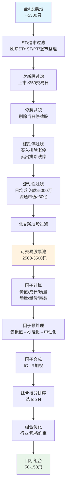
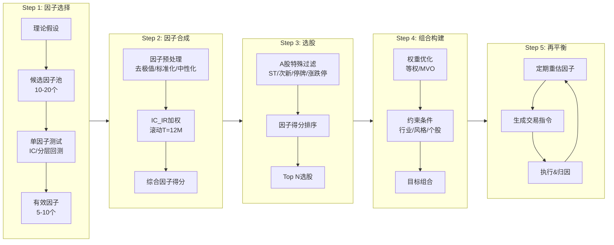

# A股多因子选股策略开发全流程

> [!summary] 核心要点
> - **五步开发流程**：因子选择 -> 因子合成 -> 选股排序 -> 组合构建 -> 定期再平衡，每一步都有A股市场特有的处理要求
> - **六项A股特殊过滤**：ST/\*ST过滤、次新股过滤（上市<250日）、停牌股剔除、涨跌停不可交易处理、成交量/流动性门槛、北交所/退市整理期过滤，保证策略可执行性
> - **调仓频率权衡**：月度调仓年换手率约12-18倍，双周调仓约20-30倍；价值/质量因子衰减慢适合月度，动量/量价因子衰减快适合周度/双周
> - **指数增强分层**：沪深300增强超额5-10%但容量大（百亿级）；中证500增强超额8-15%容量中等（30-80亿）；中证1000增强超额10-20%但容量小（10-40亿）
> - **容量估算公式**：策略容量 = 日均可交易金额 x 参与率上限 x 交易日 / 年换手率，参与率通常限制在10%-20%

---

## 一、策略开发全流程（五步法）

多因子选股策略的开发遵循严格的工程化流程，从因子选择到实盘再平衡，每一步都需要系统验证。以下流程与 [[多因子模型构建实战]] 中的因子预处理Pipeline紧密衔接。

### Step 1: 因子选择与池构建

因子选择是策略的起点，需要兼顾逻辑有效性和统计显著性。

**候选因子分类体系：**

| 因子大类 | 代表因子 | IC均值参考 | 衰减速度 | 详细参考 |
|---------|---------|-----------|---------|---------|
| 价值因子 | EP、BP、SP、EBITDA/EV | 3%-5% | 慢（月度IC稳定） | [[A股基本面因子体系]] |
| 成长因子 | 营收增速、净利润增速、ROE变化 | 2%-4% | 中等 | [[A股基本面因子体系]] |
| 质量因子 | ROE、ROA、毛利率、资产周转率 | 2%-4% | 慢 | [[A股基本面因子体系]] |
| 动量因子 | 过去1M/3M/6M/12M收益率 | 2%-6% | 快（周度衰减明显） | [[A股技术面因子与量价特征]] |
| 量价因子 | 换手率、波动率、非流动性 | 3%-7% | 快 | [[A股技术面因子与量价特征]] |
| 另类因子 | 分析师预期、资金流、舆情 | 1%-5% | 中等 | [[A股另类数据与另类因子]] |

**因子筛选标准：**

- **IC绝对值 > 0.02**（即截面相关性显著）
- **ICIR > 0.3**（IC的稳定性，IR = mean(IC) / std(IC)）
- **多头超额年化 > 5%**（分层回测Top组）
- **因子逻辑可解释**：拒绝纯数据挖掘因子
- **样本外IC不显著衰减**：样本内/外IC差异 < 30%

**数据分期设计：**

```
样本内（In-Sample）:  2010-01 ~ 2019-12  -> 因子开发与参数优化
样本外（Out-of-Sample）: 2020-01 ~ 2023-12  -> 策略验证
模拟盘（Paper Trading）: 2024-01 ~ now       -> 实时验证
```

### Step 2: 因子合成

经过 [[因子评估方法论]] 中的单因子测试后，需要将多个有效因子合成为一个综合得分。

**主流合成方法对比：**

| 合成方法 | 原理 | 优点 | 缺点 | 适用场景 |
|---------|------|------|------|---------|
| 等权合成 | 各因子标准化后简单平均 | 简单稳健，不依赖历史数据 | 忽略因子预测力差异 | 因子数量少（<5个） |
| IC加权 | 按滚动IC均值加权 | 动态适应因子有效性变化 | IC估计噪声大 | 中等因子数（5-15个） |
| IC_IR加权 | 按IC/std(IC)加权 | 兼顾预测力和稳定性，实证最优 | 需要更长历史窗口 | 推荐默认方法 |
| 最优化加权 | 最大化IR的均值-方差优化 | 理论最优 | 过拟合风险高，需收缩估计 | 大型多因子模型 |
| 机器学习 | XGBoost/LightGBM/NN | 捕捉非线性关系 | 黑箱、过拟合风险 | 因子数多（>20个） |

**IC_IR加权推荐配置（参见 [[多因子模型构建实战]]）：**

$$
w_i = \frac{\text{IC\_IR}_i}{\sum_{j=1}^{N} \text{IC\_IR}_j}, \quad \text{IC\_IR}_i = \frac{\overline{IC}_i}{\sigma(IC_i)}
$$

- 滚动窗口 $T = 12$ 个月（月度调仓）
- 协方差矩阵使用Ledoit-Wolf收缩估计
- 每期重新估计权重，允许因子权重动态变化

### Step 3: 选股排序

综合得分计算完成后，按得分排序选股。

**选股规则设计：**

```python
# 综合因子得分排名 -> 选Top N
composite_score = sum(factor_i_std * weight_i for i in factors)
rank = composite_score.rank(ascending=False)  # 得分越高排名越前

# 选股数量确定
n_stocks = max(30, int(total_pool * 0.05))  # 至少30只，或池中前5%
selected = rank[rank <= n_stocks]
```

**选股数量经验法则：**

| 策略类型 | 推荐持仓数 | 理由 |
|---------|-----------|------|
| 沪深300增强 | 50-100只 | 控制跟踪误差，行业偏离<5% |
| 中证500增强 | 80-150只 | 平衡超额与跟踪误差 |
| 中证1000增强 | 100-300只 | 个股权重小，分散化要求高 |
| 全市场选股 | 30-80只 | 集中持仓获取高Alpha |

### Step 4: 组合构建

从选股列表到可执行组合，需要确定权重分配和约束条件。

**权重方案：**

| 权重方法 | 公式/描述 | 适用场景 |
|---------|---------|---------|
| 等权 | $w_i = 1/N$ | 最简单，小盘偏向 |
| 市值加权 | $w_i = \text{MCap}_i / \sum \text{MCap}$ | 大盘增强，低换手 |
| 因子得分加权 | $w_i \propto \text{score}_i$ | 激进Alpha策略 |
| 风险平价 | $w_i \propto 1/\sigma_i$ | 降低波动 |
| 均值-方差优化 | $\min w'\Sigma w \; \text{s.t.} \; w'\alpha \geq \alpha_0$ | 最优化但需鲁棒处理 |

**约束条件（指数增强场景）：**

$$
\begin{aligned}
& \text{行业偏离}: |w_{\text{ind},k} - w_{\text{bench},k}| \leq 5\% \\
& \text{风格暴露}: |X_{\text{style}}' w| \leq 0.3\sigma \\
& \text{个股权重}: w_i \leq 2\% \text{（300增强）} \text{ 或 } 1\% \text{（1000增强）} \\
& \text{换手率}: \text{单期双边换手} \leq 30\%
\end{aligned}
$$

### Step 5: 再平衡（Rebalancing）

定期重新计算因子得分，调整组合持仓。

**再平衡执行流程：**

1. T-1日收盘后：获取最新行情+财务数据，计算因子得分
2. T日开盘前：生成目标组合，与当前持仓对比，生成交易指令
3. T日盘中：执行交易，TWAP/VWAP算法分批下单
4. T日收盘后：核对持仓，记录滑点和成交情况
5. 绩效归因：Brinson分解因子/行业/个股贡献

---

## 二、A股特殊处理清单（选股过滤Pipeline）

A股市场有独特的交易制度（详见 [[A股交易制度全解析]]），量化策略必须处理以下可执行性问题：

### 2.1 ST股/\*ST股过滤

```python
def filter_st(df):
    """过滤ST、*ST、PT股票
    ST股涨跌停±5%，流动性差，退市风险高
    """
    mask = ~df['name'].str.contains('ST|PT', case=False, na=False)
    return df[mask]
```

**规则细节：**
- ST（Special Treatment）：财务异常警告，涨跌停限制为 ±5%
- \*ST：退市风险警示，连续两年亏损
- 部分策略允许做空ST股（需融券标的支持），但多头策略必须过滤

### 2.2 次新股过滤

```python
def filter_sub_new(df, min_listed_days=250):
    """过滤上市不足min_listed_days交易日的次新股
    次新股定价不充分，波动极大，因子模型难以覆盖
    """
    df['listed_days'] = (pd.Timestamp.today() - pd.to_datetime(df['ipo_date'])).dt.days
    return df[df['listed_days'] >= min_listed_days]
```

**经验参数：**
- 保守：上市满 **250个交易日**（约1年）
- 激进：上市满 **120个交易日**（约半年）
- 注册制后新股定价更合理，可适当缩短至180日

### 2.3 停牌股处理

```python
def filter_suspended(df, trade_date):
    """过滤停牌股票
    停牌股无法交易，必须在选股和调仓时剔除
    """
    mask = df['volume'] > 0  # 成交量为0即停牌
    # 或使用交易所停牌标志
    # mask = df['trade_status'] == '交易'
    return df[mask]
```

**关键处理逻辑：**
- 调仓日停牌 -> 该股不纳入目标组合
- 持仓股停牌 -> 保持持仓不动，复牌后第一个交易日处理
- 回测中不能假设停牌期间可以交易（常见回测偏差）

### 2.4 涨跌停不可交易处理

```python
def filter_limit_up_down(df):
    """过滤涨跌停股票
    涨停：无法买入（封板，卖单极少）
    跌停：无法卖出（封板，买单极少）
    """
    # 主板涨跌停±10%，创业板/科创板±20%，ST股±5%
    pct = df['pct_change']

    # 涨停不可买入
    limit_up = (
        ((df['board'] == '主板') & (pct >= 9.9)) |
        ((df['board'].isin(['创业板', '科创板'])) & (pct >= 19.9)) |
        (df['name'].str.contains('ST') & (pct >= 4.9))
    )

    # 跌停不可卖出
    limit_down = (
        ((df['board'] == '主板') & (pct <= -9.9)) |
        ((df['board'].isin(['创业板', '科创板'])) & (pct <= -19.9)) |
        (df['name'].str.contains('ST') & (pct <= -4.9))
    )

    # 买入过滤：排除涨停
    can_buy = ~limit_up
    # 卖出过滤：跌停股无法卖出，需延迟执行
    can_sell = ~limit_down

    return df[can_buy], can_sell
```

**处理策略：**
- 买入信号遇涨停 -> 跳过该股，资金分配给其他标的或等待次日
- 卖出信号遇跌停 -> 挂跌停价排队，次日继续尝试
- 回测中必须模拟涨跌停限制，否则收益严重虚高

### 2.5 成交量/流动性过滤

```python
def filter_liquidity(df, min_amount=5000, min_mv=20):
    """流动性过滤
    min_amount: 最近20日日均成交额（万元）
    min_mv: 最低流通市值（亿元）
    """
    # 日均成交额门槛
    df['avg_amount_20d'] = df.groupby('code')['amount'].transform(
        lambda x: x.rolling(20).mean()
    )
    mask_amount = df['avg_amount_20d'] >= min_amount * 10000

    # 流通市值门槛
    mask_mv = df['circ_mv'] >= min_mv * 1e8

    return df[mask_amount & mask_mv]
```

**参数建议：**

| 策略规模 | 日均成交额门槛 | 流通市值门槛 | 参与率上限 |
|---------|--------------|------------|-----------|
| < 1亿 | 2000万 | 10亿 | 20% |
| 1-10亿 | 5000万 | 30亿 | 15% |
| 10-50亿 | 1亿 | 50亿 | 10% |
| > 50亿 | 3亿 | 100亿 | 5% |

### 2.6 其他过滤项

```python
def filter_other(df):
    """其他必要过滤"""
    # 北交所股票（流动性差，交易制度不同）
    mask_bj = ~df['code'].str.startswith(('8', '43'))

    # 退市整理期
    mask_delist = ~df['name'].str.contains('退', na=False)

    # B股过滤
    mask_b = ~df['code'].str.startswith(('2', '9'))

    return df[mask_bj & mask_delist & mask_b]
```

---

## 三、选股过滤Pipeline（Mermaid图）



---

## 四、策略开发全流程图



---

## 五、调仓频率决策分析

调仓频率直接影响策略的**换手率**（交易成本）和**信号捕获效率**（因子衰减）。

### 5.1 因子衰减特征

不同类型因子的IC随时间衰减速度不同：

| 因子类型 | IC半衰期 | 推荐调仓频率 | 年换手率（双边） |
|---------|---------|------------|--------------|
| 价值因子（EP/BP） | 3-6个月 | 月度/季度 | 8-15倍 |
| 质量因子（ROE） | 2-4个月 | 月度 | 10-18倍 |
| 成长因子（营收增速） | 1-3个月 | 月度 | 12-20倍 |
| 动量因子（过去收益率） | 1-4周 | 周度/双周 | 20-40倍 |
| 量价因子（换手率/波动率） | 1-2周 | 周度 | 30-50倍 |
| 分析师预期修正 | 2-6周 | 双周/月度 | 15-25倍 |

### 5.2 调仓频率对比

| 维度 | 月度调仓 | 双周调仓 | 周度调仓 |
|------|---------|---------|---------|
| **年换手率（双边）** | 12-18倍 | 20-30倍 | 30-50倍 |
| **交易成本（双边0.3%）** | 3.6%-5.4% | 6%-9% | 9%-15% |
| **因子信号捕获** | 价值/质量因子充分 | 动量/预期因子改善 | 量价因子最佳 |
| **月内收益分布** | 前半月强后半月弱 | 更均匀 | 最均匀 |
| **策略容量** | 大（冲击小） | 中等 | 小（冲击大） |
| **运维复杂度** | 低 | 中等 | 高 |

### 5.3 决策框架

```
if 策略以价值/质量因子为主:
    推荐月度调仓（降低成本）
elif 策略包含大量动量/量价因子:
    推荐双周或周度调仓（减少衰减损耗）
elif 策略规模 > 50亿:
    推荐月度调仓（降低市场冲击）
elif 交易成本 < 双边0.2%（融券/量化专用通道）:
    可考虑周度调仓
else:
    月度调仓为稳健默认选择
```

**实证参考（华泰证券研究）：**
- XGBoost选股模型：周度调仓年化超额20.44%，IR=3.77；月度调仓超额20.66%但月内分布不均
- 换手率约束下，双周调仓是性价比最高的折中方案

---

## 六、三大指数增强对比

指数增强策略是多因子选股最重要的应用场景。不同基准指数的增强难度、超额空间和容量差异显著。

### 6.1 核心对比表

| 维度 | 沪深300增强 | 中证500增强 | 中证1000增强 |
|------|-----------|-----------|------------|
| **成分股数** | 300只 | 500只 | 1000只 |
| **平均市值** | ~1500亿 | ~300亿 | ~100亿 |
| **选股范围** | 大盘蓝筹 | 中盘成长 | 小盘成长 |
| **年化超额（中位数）** | 5%-10% | 8%-15% | 10%-20% |
| **超额波动** | 3%-5% | 5%-8% | 8%-12% |
| **信息比率** | 1.5-2.5 | 1.5-3.0 | 1.2-2.5 |
| **策略容量** | 100-500亿 | 30-80亿 | 10-40亿 |
| **增强难度** | 高（机构定价充分） | 中等 | 低（散户定价偏差大） |
| **超额衰减趋势** | 逐年收窄 | 2024年后回升 | 波动大但绝对水平高 |
| **跟踪误差目标** | 3%-5% | 5%-8% | 6%-10% |

### 6.2 超额来源差异

**沪深300增强：**
- 超额主要来源：价值因子（EP/BP）+ 质量因子（ROE）+ 分析师预期
- 大盘股机构覆盖密集，Alpha空间有限
- 2024-2025年基本面因子贡献增加，量价因子效果减弱
- 适合大规模资金配置，跟踪误差要求严格

**中证500增强：**
- 超额主要来源：动量因子 + 成长因子 + 量价因子
- 中盘股信息不对称程度适中，量化模型优势明显
- 是公募量化增强的主战场，竞争趋于激烈
- 2024年后中证A500指数推出，分流部分关注

**中证1000增强：**
- 超额主要来源：量价因子 + 反转因子 + 流动性因子
- 小盘股散户参与度高，定价偏差大，Alpha丰富
- 容量限制明显，超10亿规模后超额显著下降
- 适合中小型私募和个人量化投资者

### 6.3 2024-2025年实盘表现参考

| 策略 | 2024年超额 | 2025年超额 | 代表产品/机构 |
|------|-----------|-----------|-------------|
| 沪深300增强 | 8%-12% | 5%-8% | 大成、海富通、富国 |
| 中证500增强 | 10%-18% | 8%-15% | 国泰、景顺长城 |
| 中证1000增强 | 12%-25% | 10%-20% | 博时、平方和 |
| 中证A500增强 | 8%-15% | 7%-12% | 国金、华泰柏瑞 |

> 注：以上数据来自公开报告和基金季报，具体产品表现差异较大。

---

## 七、策略容量估算

策略容量（Capacity）是指在不显著损耗Alpha的前提下，策略可管理的最大资金规模。详细的市场微观结构分析见 [[A股市场微观结构深度研究]]。

### 7.1 容量估算公式

**基础公式：**

$$
\text{策略容量} = \frac{\sum_{i=1}^{N} \text{ADV}_i \times r_{\text{participation}}}{\text{年换手率}}
$$

其中：
- $\text{ADV}_i$ = 股票 $i$ 的日均成交额（过去20日）
- $r_{\text{participation}}$ = 参与率上限（通常10%-20%）
- $N$ = 持仓股票数量
- 年换手率 = 双边年换手（如月度调仓约15倍）

**考虑冲击成本的修正公式：**

$$
\text{冲击成本} = \alpha \cdot \sigma \cdot \left(\frac{Q}{V}\right)^{\beta}
$$

其中：
- $\alpha$ = 冲击系数（A股经验值约0.5-1.0）
- $\sigma$ = 股票日波动率
- $Q/V$ = 参与率（交易量/日均成交量）
- $\beta$ = 冲击指数（通常0.5-0.6，即平方根模型）

**Alpha净值衰减模型：**

$$
\text{净超额} = \text{毛超额} - \text{交易成本} - \text{冲击成本}(AUM)
$$

当净超额降至某阈值（如3%）时，对应的AUM即为策略容量。

### 7.2 容量估算实例

**以中证500增强为例：**

```python
# 参数假设
n_stocks = 100                    # 持仓100只
avg_adv = 2e8                     # 日均成交额2亿元
participation_rate = 0.15         # 参与率15%
annual_turnover = 15              # 年双边换手15倍
trading_days = 244                # 年交易日

# 基础容量
capacity_basic = n_stocks * avg_adv * participation_rate * trading_days / annual_turnover
# = 100 * 2e8 * 0.15 * 244 / 15
# ≈ 48.8亿元

# 考虑冲击成本后容量约打7折
capacity_adjusted = capacity_basic * 0.7
# ≈ 34.2亿元
```

### 7.3 各指数增强容量参考

| 指数 | 成分股日均成交额 | 参与率 | 换手率 | 估算容量 |
|------|---------------|-------|--------|---------|
| 沪深300 | 5-10亿/只 | 10% | 12倍 | 100-300亿 |
| 中证500 | 1-3亿/只 | 15% | 15倍 | 30-80亿 |
| 中证1000 | 0.5-1.5亿/只 | 15% | 18倍 | 10-40亿 |
| 全市场小盘 | 0.2-0.5亿/只 | 20% | 20倍 | 5-15亿 |

---

## 八、参数速查表

| 参数 | 推荐值 | 说明 |
|------|-------|------|
| 因子数量 | 5-15个 | 过多增加共线性风险 |
| IC阈值 | >0.02 | 月度截面IC绝对值 |
| ICIR阈值 | >0.3 | IC均值/IC标准差 |
| 去极值方法 | MAD 3倍 | 鲁棒性优于3sigma |
| 标准化方法 | Z-Score或Rank | Rank对异常值更鲁棒 |
| 中性化 | 行业+市值 | Fama-MacBeth回归残差 |
| 合成方法 | IC_IR加权 | 滚动窗口T=12M |
| 持仓数量 | 50-150只 | 视基准指数而定 |
| 权重方案 | 等权或优化 | 优化需行业/风格约束 |
| 调仓频率 | 月度/双周 | 视因子类型和规模 |
| 次新股过滤 | 上市≥250日 | 保守参数 |
| 流动性门槛 | 日均成交≥5000万 | 10亿规模策略 |
| 参与率上限 | 10%-20% | 视策略规模 |
| 行业偏离限制 | ≤5% | 指数增强 |
| 个股权重上限 | 1%-3% | 视持仓数量 |
| 回测区间 | ≥5年（≥10年更佳） | 覆盖牛熊周期 |

---

## 九、完整Python代码：多因子选股策略

以下代码实现了完整的多因子选股策略框架，包含A股特殊过滤、因子合成、组合构建和回测，可在本地Python环境运行（依赖Backtrader），也可适配聚宽平台。数据获取可参考 [[A股量化数据源全景图]] 和 [[量化研究Python工具链搭建]]。

```python
"""
A股多因子选股策略 — 完整回测框架
依赖: pip install backtrader pandas numpy scikit-learn akshare
数据源: AkShare / Tushare / 聚宽
"""

import numpy as np
import pandas as pd
from datetime import datetime, timedelta
from sklearn.preprocessing import StandardScaler

# ============================================================
# Part 1: A股选股过滤器
# ============================================================
class AShareFilter:
    """A股可交易性过滤Pipeline"""

    def __init__(self, min_listed_days=250, min_amount_20d=5000e4,
                 min_circ_mv=20e8):
        self.min_listed_days = min_listed_days
        self.min_amount_20d = min_amount_20d  # 日均成交额（元）
        self.min_circ_mv = min_circ_mv        # 流通市值（元）

    def filter(self, df, trade_date):
        """
        完整过滤Pipeline
        df: DataFrame, columns=[code, name, ipo_date, trade_status,
            pct_change, volume, amount, circ_mv, board, ...]
        """
        n0 = len(df)

        # 1. ST / *ST / PT 过滤
        df = df[~df['name'].str.contains('ST|PT|退', case=False, na=False)]

        # 2. 次新股过滤
        df['listed_days'] = (pd.to_datetime(trade_date)
                             - pd.to_datetime(df['ipo_date'])).dt.days
        df = df[df['listed_days'] >= self.min_listed_days]

        # 3. 停牌过滤
        df = df[df['volume'] > 0]

        # 4. 涨跌停过滤（不可买入涨停股）
        limit_pct = df['board'].map({
            '主板': 9.9, '创业板': 19.9, '科创板': 19.9
        }).fillna(9.9)
        df = df[df['pct_change'].abs() < limit_pct]

        # 5. 流动性过滤
        df = df[df['avg_amount_20d'] >= self.min_amount_20d]
        df = df[df['circ_mv'] >= self.min_circ_mv]

        # 6. 北交所 / B股过滤
        df = df[~df['code'].str.startswith(('8', '43', '2', '9'))]

        print(f"过滤: {n0} -> {len(df)} (剔除{n0-len(df)}只)")
        return df


# ============================================================
# Part 2: 因子引擎
# ============================================================
class FactorEngine:
    """多因子计算、预处理与合成"""

    def __init__(self, ic_window=12):
        self.ic_window = ic_window  # IC滚动窗口（月）
        self.factor_names = []
        self.ic_history = {}

    def calculate_factors(self, df):
        """计算候选因子（示例4因子）"""
        # 价值因子: EP (Earnings-to-Price)
        df['f_ep'] = df['net_profit_ttm'] / df['total_mv']

        # 质量因子: ROE
        df['f_roe'] = df['roe_ttm']

        # 成长因子: 营收同比增速
        df['f_revenue_growth'] = df['revenue_yoy']

        # 动量因子: 过去20日收益率（反转在A股更有效，取负）
        df['f_reverse_mom'] = -df['return_20d']

        self.factor_names = ['f_ep', 'f_roe', 'f_revenue_growth',
                             'f_reverse_mom']
        return df

    def preprocess(self, df):
        """因子预处理: 去极值 -> 标准化 -> 中性化"""
        for f in self.factor_names:
            # MAD去极值
            med = df[f].median()
            mad = (df[f] - med).abs().median()
            upper = med + 3 * 1.4826 * mad
            lower = med - 3 * 1.4826 * mad
            df[f] = df[f].clip(lower, upper)

            # Z-Score标准化
            df[f] = (df[f] - df[f].mean()) / (df[f].std() + 1e-8)

            # 行业市值中性化（简化：行业内去均值 + 回归残差）
            if 'industry' in df.columns and 'ln_mv' in df.columns:
                df[f] = df.groupby('industry')[f].transform(
                    lambda x: x - x.mean()
                )
                # 进一步对市值回归取残差
                from numpy.polynomial.polynomial import polyfit
                if df[f].notna().sum() > 10:
                    coef = np.polyfit(
                        df['ln_mv'].fillna(0), df[f].fillna(0), 1
                    )
                    df[f] = df[f] - np.polyval(coef, df['ln_mv'].fillna(0))

        return df

    def compute_ic(self, df, return_col='next_month_return'):
        """计算截面IC（Rank IC）"""
        ic_dict = {}
        for f in self.factor_names:
            ic = df[f].corr(df[return_col], method='spearman')
            ic_dict[f] = ic
            if f not in self.ic_history:
                self.ic_history[f] = []
            self.ic_history[f].append(ic)
        return ic_dict

    def composite_score(self, df, method='ic_ir'):
        """因子合成 -> 综合得分"""
        if method == 'equal':
            weights = {f: 1.0 / len(self.factor_names)
                       for f in self.factor_names}
        elif method == 'ic_ir':
            weights = {}
            for f in self.factor_names:
                ics = self.ic_history.get(f, [0])[-self.ic_window:]
                ic_mean = np.mean(ics) if ics else 0
                ic_std = np.std(ics) if len(ics) > 1 else 1
                weights[f] = ic_mean / (ic_std + 1e-8)
            # 归一化
            w_sum = sum(abs(v) for v in weights.values()) + 1e-8
            weights = {k: v / w_sum for k, v in weights.items()}
        else:
            weights = {f: 1.0 / len(self.factor_names)
                       for f in self.factor_names}

        df['composite_score'] = sum(
            df[f].fillna(0) * w for f, w in weights.items()
        )
        return df, weights


# ============================================================
# Part 3: 组合构建器
# ============================================================
class PortfolioConstructor:
    """组合构建与权重优化"""

    def __init__(self, n_stocks=50, weight_method='equal',
                 max_industry_dev=0.05, max_stock_weight=0.03):
        self.n_stocks = n_stocks
        self.weight_method = weight_method
        self.max_industry_dev = max_industry_dev
        self.max_stock_weight = max_stock_weight

    def select_and_weight(self, df, benchmark_industry_weights=None):
        """选股并分配权重"""
        # 按综合得分排序选Top N
        selected = df.nlargest(self.n_stocks, 'composite_score').copy()

        if self.weight_method == 'equal':
            selected['weight'] = 1.0 / len(selected)
        elif self.weight_method == 'score':
            scores = selected['composite_score'] - selected[
                'composite_score'].min() + 1e-6
            selected['weight'] = scores / scores.sum()
        elif self.weight_method == 'mv':
            selected['weight'] = (selected['circ_mv']
                                  / selected['circ_mv'].sum())

        # 个股权重上限约束
        selected['weight'] = selected['weight'].clip(
            upper=self.max_stock_weight
        )
        selected['weight'] = (selected['weight']
                              / selected['weight'].sum())

        return selected[['code', 'name', 'weight', 'composite_score',
                         'industry']].reset_index(drop=True)


# ============================================================
# Part 4: 回测引擎（简化版，不依赖Backtrader）
# ============================================================
class SimpleBacktester:
    """简化多因子选股回测引擎"""

    def __init__(self, initial_capital=1e7, commission_rate=0.0015,
                 slippage_rate=0.001, rebalance_freq='M'):
        self.initial_capital = initial_capital
        self.commission = commission_rate   # 单边佣金+印花税
        self.slippage = slippage_rate       # 滑点
        self.rebalance_freq = rebalance_freq
        self.nav_history = []
        self.trade_log = []

    def run(self, monthly_data, filter_obj, factor_engine,
            portfolio_constructor):
        """
        monthly_data: dict of {period: DataFrame}
            每个period为一个调仓期的全市场截面数据
        """
        capital = self.initial_capital
        holdings = {}  # {code: (shares, cost_price)}

        periods = sorted(monthly_data.keys())

        for i, period in enumerate(periods):
            df = monthly_data[period].copy()
            trade_date = df['trade_date'].iloc[0]

            # Step 1: 过滤
            df_filtered = filter_obj.filter(df, trade_date)

            # Step 2: 因子计算与预处理
            df_factors = factor_engine.calculate_factors(df_filtered)
            df_factors = factor_engine.preprocess(df_factors)

            # Step 3: 计算IC（用上期收益）
            if i > 0 and 'next_month_return' in df_factors.columns:
                factor_engine.compute_ic(df_factors)

            # Step 4: 因子合成
            df_scored, weights = factor_engine.composite_score(
                df_factors, method='ic_ir' if i >= 12 else 'equal'
            )

            # Step 5: 组合构建
            target = portfolio_constructor.select_and_weight(df_scored)

            # Step 6: 计算调仓交易
            target_dict = dict(zip(target['code'], target['weight']))

            # 卖出不在目标中的持仓
            for code in list(holdings.keys()):
                if code not in target_dict:
                    sell_value = holdings[code]['value']
                    cost = sell_value * (self.commission + self.slippage)
                    capital += sell_value - cost
                    self.trade_log.append({
                        'date': trade_date, 'code': code,
                        'action': 'SELL', 'value': sell_value,
                        'cost': cost
                    })
                    del holdings[code]

            # 买入/调整目标持仓
            total_value = capital + sum(
                h['value'] for h in holdings.values()
            )
            for code, w in target_dict.items():
                target_value = total_value * w
                current_value = holdings.get(code, {}).get('value', 0)
                delta = target_value - current_value

                if abs(delta) > total_value * 0.005:  # 最小交易阈值
                    cost = abs(delta) * (self.commission + self.slippage)
                    if delta > 0:  # 买入
                        capital -= (delta + cost)
                    else:  # 卖出部分
                        capital += (-delta - cost)

                    holdings[code] = {'value': target_value, 'weight': w}
                    self.trade_log.append({
                        'date': trade_date, 'code': code,
                        'action': 'BUY' if delta > 0 else 'REDUCE',
                        'value': abs(delta), 'cost': cost
                    })

            # 记录净值
            total_nav = capital + sum(
                h['value'] for h in holdings.values()
            )
            self.nav_history.append({
                'date': trade_date,
                'nav': total_nav / self.initial_capital,
                'n_holdings': len(holdings),
                'capital_ratio': capital / total_nav
            })

            print(f"[{trade_date}] NAV={total_nav/self.initial_capital:.4f}"
                  f" 持仓={len(holdings)}只 现金比={capital/total_nav:.1%}")

        return pd.DataFrame(self.nav_history)

    def performance_report(self):
        """生成绩效报告"""
        nav_df = pd.DataFrame(self.nav_history)
        nav_df['date'] = pd.to_datetime(nav_df['date'])
        nav_df = nav_df.set_index('date')

        # 收益率序列
        nav_df['return'] = nav_df['nav'].pct_change()

        # 关键指标
        total_return = nav_df['nav'].iloc[-1] - 1
        n_years = (nav_df.index[-1] - nav_df.index[0]).days / 365.25
        annual_return = (1 + total_return) ** (1 / n_years) - 1
        annual_vol = nav_df['return'].std() * np.sqrt(12)  # 月度->年化
        sharpe = (annual_return - 0.025) / (annual_vol + 1e-8)

        # 最大回撤
        cummax = nav_df['nav'].cummax()
        drawdown = (nav_df['nav'] - cummax) / cummax
        max_drawdown = drawdown.min()

        # 换手率
        trade_df = pd.DataFrame(self.trade_log)
        if len(trade_df) > 0:
            total_traded = trade_df['value'].sum()
            avg_nav = nav_df['nav'].mean() * self.initial_capital
            turnover = total_traded / avg_nav / n_years
        else:
            turnover = 0

        report = {
            '总收益率': f'{total_return:.2%}',
            '年化收益率': f'{annual_return:.2%}',
            '年化波动率': f'{annual_vol:.2%}',
            'Sharpe比率': f'{sharpe:.2f}',
            '最大回撤': f'{max_drawdown:.2%}',
            '年化换手率(双边)': f'{turnover:.1f}倍',
            '总交易次数': len(self.trade_log),
            '平均持仓数': f"{nav_df['n_holdings'].mean():.0f}只",
        }

        print("\n" + "="*50)
        print("策略绩效报告")
        print("="*50)
        for k, v in report.items():
            print(f"  {k}: {v}")
        print("="*50)

        return report


# ============================================================
# Part 5: 主程序入口
# ============================================================
def main():
    """
    主程序: 多因子选股策略回测
    实际使用时替换为真实数据源:
    - AkShare: import akshare as ak
    - Tushare: import tushare as ts
    - 聚宽:   from jqdatasdk import *
    """

    # --- 初始化组件 ---
    stock_filter = AShareFilter(
        min_listed_days=250,
        min_amount_20d=5000e4,   # 日均成交5000万
        min_circ_mv=30e8          # 流通市值30亿
    )

    factor_engine = FactorEngine(ic_window=12)

    portfolio = PortfolioConstructor(
        n_stocks=50,
        weight_method='equal',
        max_industry_dev=0.05,
        max_stock_weight=0.03
    )

    backtester = SimpleBacktester(
        initial_capital=1e7,        # 1000万初始资金
        commission_rate=0.0015,     # 单边千一点五
        slippage_rate=0.001,        # 滑点千一
        rebalance_freq='M'          # 月度调仓
    )

    # --- 数据准备（示例：生成模拟数据） ---
    # 实际应替换为:
    #   akshare: ak.stock_zh_a_spot_em()
    #   tushare: pro.daily(trade_date=date)
    #   聚宽:   get_fundamentals(query(...))

    print("请接入真实数据源运行回测。")
    print("示例数据源接入方式：")
    print("  AkShare: pip install akshare")
    print("  Tushare: pip install tushare （需token）")
    print("  聚宽:    pip install jqdatasdk")
    print()
    print("数据需包含以下字段：")
    print("  code, name, ipo_date, trade_date, volume, amount,")
    print("  pct_change, circ_mv, total_mv, net_profit_ttm,")
    print("  roe_ttm, revenue_yoy, return_20d, industry, board")

    # --- 如有数据则运行回测 ---
    # nav_df = backtester.run(monthly_data, stock_filter,
    #                         factor_engine, portfolio)
    # report = backtester.performance_report()


if __name__ == '__main__':
    main()
```

### 聚宽平台适配版（关键代码片段）

```python
# === 聚宽（JoinQuant）平台适配 ===
from jqdata import *

def initialize(context):
    """策略初始化"""
    set_benchmark('000905.XSHG')  # 中证500基准
    set_option('use_real_price', True)
    set_order_cost(
        OrderCost(open_tax=0, close_tax=0.001,
                  open_commission=0.0003, close_commission=0.0003,
                  min_commission=5),
        type='stock'
    )

    # 月度调仓
    run_monthly(rebalance, monthday=1, time='09:35')

    # 策略参数
    g.n_stocks = 50
    g.min_listed_days = 250
    g.factors = ['ep', 'roe', 'revenue_growth', 'reverse_mom']

def rebalance(context):
    """月度再平衡"""
    trade_date = context.current_dt.date()

    # 1. 获取全A股票池
    stocks = get_all_securities(types=['stock'], date=trade_date)
    stock_list = stocks.index.tolist()

    # 2. 过滤
    stock_list = filter_stocks(stock_list, trade_date)

    # 3. 获取因子数据
    q = query(
        valuation.code,
        valuation.pe_ratio,
        valuation.pb_ratio,
        valuation.circulating_market_cap,
        indicator.roe,
        indicator.inc_revenue_year_on_year
    ).filter(valuation.code.in_(stock_list))

    df = get_fundamentals(q, date=trade_date)

    # 4. 计算因子
    df['f_ep'] = 1 / df['pe_ratio']
    df['f_roe'] = df['roe']
    df['f_growth'] = df['inc_revenue_year_on_year']

    # 过去20日收益（反转）
    prices = get_price(stock_list, end_date=trade_date,
                       count=21, fields=['close'])
    ret_20d = prices['close'].iloc[-1] / prices['close'].iloc[0] - 1
    df['f_reverse'] = -ret_20d.reindex(df['code']).values

    # 5. 预处理 + 合成（等权简化版）
    for f in ['f_ep', 'f_roe', 'f_growth', 'f_reverse']:
        df[f] = df[f].rank(pct=True)  # Rank标准化

    df['score'] = df[['f_ep', 'f_roe', 'f_growth', 'f_reverse']].mean(
        axis=1
    )

    # 6. 选Top N
    target = df.nlargest(g.n_stocks, 'score')
    target_list = target['code'].tolist()
    target_weights = {code: 1.0/len(target_list) for code in target_list}

    # 7. 执行调仓
    # 卖出
    for code in context.portfolio.positions:
        if code not in target_weights:
            order_target_value(code, 0)

    # 买入
    total_value = context.portfolio.total_value
    for code, w in target_weights.items():
        order_target_value(code, total_value * w)

def filter_stocks(stock_list, date):
    """A股可交易性过滤"""
    current = get_all_securities(date=date)

    # ST过滤
    st_list = get_extras('is_st', stock_list, end_date=date, count=1)
    st_stocks = [s for s in stock_list
                 if st_list[s].iloc[0] == True]
    stock_list = [s for s in stock_list if s not in st_stocks]

    # 次新股过滤
    stock_list = [s for s in stock_list
                  if (date - current.loc[s, 'start_date']).days >= 365]

    # 停牌过滤
    paused = get_price(stock_list, end_date=date, count=1,
                       fields=['paused'])
    paused_stocks = [s for s in stock_list
                     if paused['paused'][s].iloc[0] == 1]
    stock_list = [s for s in stock_list if s not in paused_stocks]

    # 涨跌停过滤
    prices = get_price(stock_list, end_date=date, count=1,
                       fields=['close', 'high_limit', 'low_limit'])
    limit_stocks = [s for s in stock_list
                    if prices['close'][s].iloc[0] >= prices[
                        'high_limit'][s].iloc[0] * 0.999]
    stock_list = [s for s in stock_list if s not in limit_stocks]

    return stock_list
```

---

## 十、回测报告模板

| 指标 | 目标值 | 说明 |
|------|-------|------|
| **绝对收益** | | |
| 年化收益率 | >15% | 扣费后 |
| 累计收益率 | — | 回测全周期 |
| **风险指标** | | |
| 年化波动率 | <20% | 月度收益率年化 |
| 最大回撤 | <15% | 峰值到谷底 |
| Calmar比率 | >1.0 | 年化收益/最大回撤 |
| **风险调整收益** | | |
| Sharpe比率 | >1.5 | Rf=2.5%（十年国债） |
| Sortino比率 | >2.0 | 仅考虑下行风险 |
| **相对基准** | | |
| 年化超额收益 | >8% | 相对基准指数 |
| 跟踪误差 | 5%-8% | 指数增强场景 |
| 信息比率 | >1.5 | 超额/跟踪误差 |
| **交易特征** | | |
| 年换手率（双边） | 12-20倍 | 月度调仓 |
| 交易成本占比 | <3% | 年化 |
| 胜率（月度） | >55% | 超越基准月份占比 |
| **其他** | | |
| 回测周期 | ≥5年 | 覆盖牛熊 |
| 样本外表现 | 不显著衰减 | 对比样本内 |

---

## 十一、常见误区与避坑指南

### 误区1: 忽略前视偏差（Look-Ahead Bias）
- **错误**：使用年报数据时按报告期而非披露日期对齐
- **正确**：年报披露截止4月30日，中报8月31日，使用Point-in-Time数据库

### 误区2: 未处理幸存者偏差（Survivorship Bias）
- **错误**：仅回测当前存续股票
- **正确**：使用包含退市股的全历史数据库，参见 [[量化数据工程实践]]

### 误区3: 忽略A股涨跌停限制
- **错误**：回测中假设涨停股可以买入、跌停股可以卖出
- **正确**：在调仓日检查涨跌停状态，涨停不买入，跌停延迟卖出

### 误区4: 过度优化参数（过拟合）
- **错误**：在样本内反复调参直到结果满意
- **正确**：严格分样本内/外，参数数量 << 样本量，交叉验证

### 误区5: 忽略交易成本和冲击
- **错误**：回测不扣佣金、印花税、滑点
- **正确**：A股单边总成本约0.15%-0.2%（佣金+印花税+滑点），大资金需额外考虑冲击成本

### 误区6: 因子共线性未处理
- **错误**：同时纳入高度相关的因子（如EP和BP，相关性>0.7）
- **正确**：因子正交化或PCA降维，参见 [[多因子模型构建实战]]

### 误区7: 混淆IC和收益率
- **错误**：IC=5%就认为策略年化收益5%
- **正确**：IC是截面排序相关性，需通过分层回测和组合模拟才能评估实际收益

### 误区8: 忽视策略容量
- **错误**：小盘策略回测年化50%就开始募资100亿
- **正确**：容量 = f(流动性, 参与率, 换手率)，小盘策略容量通常10-40亿

---

## 十二、相关笔记

- [[A股基本面因子体系]] — 价值、成长、质量因子的详细定义与A股实证
- [[A股技术面因子与量价特征]] — 动量、反转、量价因子在A股的特殊表现
- [[A股另类数据与另类因子]] — 分析师预期、资金流、舆情等另类因子
- [[因子评估方法论]] — IC/ICIR/分层回测/Fama-MacBeth回归等评估方法
- [[多因子模型构建实战]] — 因子预处理Pipeline、Barra风险模型、合成方法
- [[A股交易制度全解析]] — T+1、涨跌停、熔断等制度对策略的影响
- [[A股市场微观结构深度研究]] — 订单簿、流动性、市场冲击等微观结构
- [[A股量化数据源全景图]] — Tushare/AkShare/Wind等数据源的对比与接入
- [[量化研究Python工具链搭建]] — Python量化开发环境的搭建指南
- [[量化数据工程实践]] — 数据清洗、存储、Point-in-Time数据库构建
- [[A股指数体系与基准构建]] — 沪深300/中证500/中证1000等基准指数详解
- [[A股行业轮动与风格轮动因子]] — 行业因子、风格轮动与因子择时
- [[A股机器学习量化策略]] — XGBoost/LightGBM选股与因子非线性合成
- [[高频因子与日内数据挖掘]] — 高频因子融入多因子选股提升超额
- [[A股可转债量化策略]] — 可转债多因子选债与双低策略

---

## 来源参考

1. 浙商证券, "多因子量化投资框架梳理", 2024-02
2. 华泰证券, "XGBoost选股模型——调仓频率与因子衰减实证", 2019
3. BigQuant, "多因子选股策略全流程教程", bigquant.com/wiki
4. 聚宽, "量化策略容量估算与市场冲击分析", joinquant.com
5. 澎湃新闻/中金, "量化私募策略容量与交易成本分析", 2021
6. 华安基金, "指数增强策略调仓频率研究", 2025
7. 海富通基金/博时基金, "2025Q4指数增强基金季报"
8. 平方和投资, "沪深300/中证500/A500增强策略对比", 2024-2025
9. 百度智能云, "Python多因子选股策略开发实战", 2024
10. CSDN/掘金, "Backtrader多因子选股回测框架", 2024-2025
