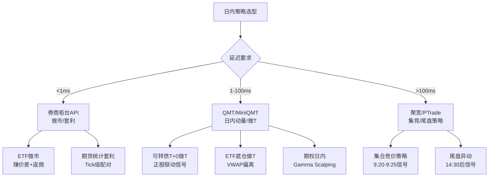

# A股日内与高频交易策略

> - A股T+1制度限制股票日内回转，但**ETF/可转债/期货**支持T+0，底仓做T可变相实现股票日内交易
> - 高频策略三大类：**做市策略**（赚价差+返佣）、**统计套利**（Tick级配对/ETF套利）、**方向性策略**（订单流/动量信号）
> - 2025年程序化交易新规：高频认定≥300笔/秒或≥20,000笔/日，需先报告后交易，差异化收费
> - A股日内U型流动性：开盘30分钟成交占15-20%、午盘最低、收盘集合竞价占8-10%——策略需适配
> - 集合竞价策略（9:20-9:25不可撤阶段）是A股特色高频Alpha来源，Rank IC 3-6%

---

## 一、A股日内交易路径

| 路径 | 标的 | T+0方式 | 涨跌幅 | 流动性 | 适合策略 |
|------|------|---------|--------|--------|---------|
| 跨境ETF做T | 纳指/恒生ETF | 直接T+0 | ±10% | 高 | 日内动量/均值回归 |
| 商品ETF做T | 黄金/豆粕ETF | 直接T+0 | ±10% | 中 | 趋势跟踪 |
| 可转债做T | 双低转债 | 直接T+0 | ±20% | 中 | 日内动量/做T |
| 股票底仓做T | 沪深300成分 | 底仓+日内 | ±10% | 高 | VWAP偏离信号 |
| 期货日内 | IF/IC/IM | 双向T+0 | ±10% | 高 | CTA/套利/做市 |
| ETF期权日内 | 50ETF/300ETF | T+0 | 波动率 | 高 | Delta/Gamma |

## 二、做市策略

### 2.1 原理
在买卖两侧同时挂单，赚取买卖价差（Spread）。

**A股做市约束**：
- 股票无官方做市制度（北交所除外），ETF有做市商
- 高频撤单受限：撤单率≥80%可能被认定为虚假申报
- 日内开仓限制限制期权做市规模

### 2.2 做市策略参数

| 参数 | 数值 | 说明 |
|------|------|------|
| 报价价差 | 1-3个tick | 太窄利润不够，太宽成交率低 |
| 挂单量 | 日均成交量的0.1-0.5% | 控制存货风险 |
| 存货限制 | ±日均成交量的1% | 单边持仓上限 |
| 报价更新频率 | 每3秒(快照间隔) | 与行情刷新对齐 |
| 止损 | 日内亏损>预期日收入3倍 | 熔断当日做市 |

```python
import numpy as np

class SimpleMarketMaker:
    """简易做市策略"""
    
    def __init__(self, spread_ticks=2, max_position=10000,
                 tick_size=0.01):
        self.spread_ticks = spread_ticks
        self.max_position = max_position
        self.tick_size = tick_size
        self.position = 0
    
    def calc_quotes(self, mid_price, volatility, inventory):
        """计算买卖报价（含存货调整）"""
        half_spread = self.spread_ticks * self.tick_size / 2
        
        # Avellaneda-Stoikov存货调整
        inventory_skew = 0.001 * inventory  # 持仓偏移
        
        bid = mid_price - half_spread - inventory_skew
        ask = mid_price + half_spread - inventory_skew
        
        # 取整到tick
        bid = round(bid / self.tick_size) * self.tick_size
        ask = round(ask / self.tick_size) * self.tick_size
        
        # 持仓限制
        bid_size = min(1000, self.max_position - self.position)
        ask_size = min(1000, self.max_position + self.position)
        
        return {
            'bid_price': bid, 'bid_size': max(0, bid_size),
            'ask_price': ask, 'ask_size': max(0, ask_size)
        }
```

## 三、日内动量策略

### 3.1 集合竞价策略

```python
class AuctionStrategy:
    """集合竞价策略（9:20-9:25不可撤阶段）"""
    
    def __init__(self, volume_threshold=1.5, 
                 price_strength_threshold=0.003):
        self.volume_threshold = volume_threshold
        self.price_strength_threshold = price_strength_threshold
    
    def analyze_auction(self, auction_data):
        """
        分析不可撤阶段的订单特征
        auction_data: 9:20-9:25的快照序列
        """
        # 匹配价格趋势（连续上移=强势）
        prices = auction_data['match_price']
        price_trend = (prices.iloc[-1] - prices.iloc[0]) / prices.iloc[0]
        
        # 匹配量变化（放量=确认）
        volumes = auction_data['match_volume']
        volume_ratio = volumes.iloc[-1] / volumes.mean()
        
        # 买卖挂单不平衡
        bid_vol = auction_data['total_bid_volume'].iloc[-1]
        ask_vol = auction_data['total_ask_volume'].iloc[-1]
        imbalance = (bid_vol - ask_vol) / (bid_vol + ask_vol)
        
        signal = 0
        if (price_trend > self.price_strength_threshold and
            volume_ratio > self.volume_threshold and
            imbalance > 0.1):
            signal = 1  # 看多
        elif (price_trend < -self.price_strength_threshold and
              volume_ratio > self.volume_threshold and
              imbalance < -0.1):
            signal = -1  # 看空
        
        return {
            'signal': signal,
            'price_trend': price_trend,
            'volume_ratio': volume_ratio,
            'imbalance': imbalance
        }
```

### 3.2 开盘30分钟动量

开盘30分钟成交占全天15-20%，信息含量最高：

| 信号 | 规则 | IC参考 |
|------|------|--------|
| 开盘缺口 | 开盘价/昨收-1 > 1% | 3-5%（反转） |
| 首30分VWAP偏离 | 当前价/VWAP_30min - 1 | 2-4% |
| 首30分成交量比 | 首30分量/历史均值 | 2-3% |
| 首30分订单流 | 主买-主卖净额 | 3-5% |

### 3.3 尾盘策略

| 信号 | 规则 | IC参考 |
|------|------|--------|
| 尾盘放量 | 最后30分成交>日均20% | -4%~-6%（反转） |
| 尾盘拉升 | 14:30后涨幅>1% | -3%~-5%（次日回落） |
| 收盘集竞不平衡 | 14:57-15:00买卖比 | 3-5% |

## 四、可转债日内策略

### 4.1 T+0做T核心参数

| 参数 | 数值 | 说明 |
|------|------|------|
| 正股10秒涨幅触发 | >0.125% | 联动信号 |
| 换手触发 | >0.5% | 活跃度确认 |
| 秒均成交 | >20万 | 流动性保障 |
| 止盈 | +0.3%~1% | 快进快出 |
| 止损 | -0.4%~0.5% | 严格止损 |
| 单日最大交易次数 | 3-5次 | 避免过度交易 |

## 五、高频监管约束

| 约束 | 阈值 | 后果 |
|------|------|------|
| 高频交易认定 | ≥300笔/秒 或 ≥20,000笔/日 | 先报告后交易 |
| 虚假申报 | 撤单率≥80% | 异常交易监管 |
| 频繁撤单 | 集合竞价占比≥30% | 异常交易监管 |
| 对倒交易 | 自成交占比≥20% | 异常交易监管 |
| 差异化收费 | 高频交易加收手续费 | 成本上升 |
| 日内开仓限制(期权) | 200手/品种/日 | 限制期权做市 |

## 六、策略选型决策树



## 七、参数速查表

| 策略类型 | 标的 | 频率 | 预期日收益 | 延迟要求 | 资金门槛 |
|---------|------|------|-----------|---------|---------|
| ETF做市 | 宽基ETF | 百次/日 | 0.01-0.05% | <1ms | 1000万+ |
| 可转债做T | 双低转债 | 3-5次/日 | 0.05-0.3% | <100ms | 10万+ |
| ETF底仓做T | 300ETF | 1-3次/日 | 0.02-0.1% | <100ms | 50万+ |
| 集合竞价 | 全A股 | 1次/日 | 0.1-0.5% | 不敏感 | 10万+ |
| 尾盘策略 | 中小盘 | 1次/日 | 0.05-0.2% | 不敏感 | 10万+ |
| 期货日内CTA | IF/IC | 3-10次/日 | 0.05-0.3% | <10ms | 50万+ |

## 八、常见误区

| 误区 | 真相 |
|------|------|
| "A股没法做日内" | ETF/可转债/期货支持T+0，股票底仓做T也可实现日内回转 |
| "高频=高收益" | 高频策略容量极小(通常<1亿)，且监管趋严，合规成本不断上升 |
| "做市稳赚价差" | 单边趋势行情时做市商存货风险巨大，2015年股灾做市商巨亏 |
| "撤单率高就是操纵" | 做市策略天然高撤单率，但≥80%可能触发监管，需控制在70%以下 |
| "可转债T+0无限制" | 可转债涨跌幅±20%，极端行情波动巨大；部分小盘转债流动性差 |
| "集合竞价信号最准" | 9:15-9:20可撤单阶段信号不可靠（大量试探性挂撤），9:20-9:25才是真实信号 |

## 九、相关笔记

- [[A股交易制度全解析]] — T+1/T+0规则、集合竞价、涨跌停
- [[A股市场微观结构深度研究]] — 撮合机制、订单簿、日内U型流动性
- [[A股CTA与趋势跟踪策略]] — 期货日内CTA策略
- [[A股可转债量化策略]] — 可转债T+0日内策略
- [[A股ETF量化策略与套利实战]] — ETF做T与套利
- [[A股量化交易合规要求]] — 高频交易认定与异常交易监管
- [[高频因子与日内数据挖掘]] — 集合竞价/尾盘/OIR等日内因子
- [[订单簿与订单流因子深度研究]] — 订单流方向性信号

---

## 来源参考

1. 证监会《证券市场程序化交易管理规定》(2024) — 高频交易认定标准
2. 沪深交易所《程序化交易管理实施细则》(2025) — 异常交易阈值
3. Avellaneda, M. & Stoikov, S. (2008). "High-frequency trading in a limit order book" — 做市策略理论
4. 华泰证券《A股日内交易策略全景》 — 集合竞价/尾盘策略实证
5. 中信证券《可转债日内交易策略》 — T+0做T参数优化
