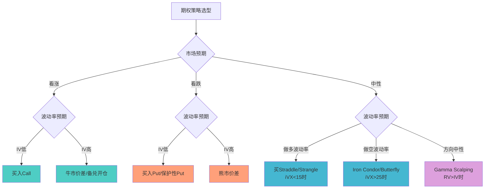

# A股期权量化策略

> - A股场内期权5大品种：50ETF期权/300ETF期权/500ETF期权/创业板ETF期权/沪深300股指期权(IO)，2024年日均成交合计约**400万张**
> - 备兑开仓（Covered Call）年化增强**2-5%**，是机构最常用的收益增强策略；保护性看跌（Protective Put）年化保险成本**3-8%**
> - 波动率交易核心参照iVX（中国波指）：<15极度平静警惕突破、>30恐慌逆向买入、>40极端底部（历史级别）
> - A股期权全部为**欧式行权**（不可提前行权），ETF期权**实物交割**，股指期权**现金交割**
> - 日内开仓限制严格：单品种200手/日、单月合约100手、深度虚值30手——限制了高频期权策略

---

## 一、A股期权市场概览

### 1.1 合约规格对比表

| 维度 | 50ETF期权 | 300ETF期权(沪) | 300ETF期权(深) | 500ETF期权 | 创业板ETF期权 | 沪深300股指期权(IO) |
|------|----------|---------------|---------------|-----------|-------------|-------------------|
| 标的 | 510050 | 510300 | 159919 | 510500 | 159915 | 沪深300指数 |
| 合约单位 | 10000份 | 10000份 | 10000份 | 10000份 | 10000份 | 100元/点 |
| 行权方式 | 欧式 | 欧式 | 欧式 | 欧式 | 欧式 | 欧式 |
| 交割方式 | 实物 | 实物 | 实物 | 实物 | 实物 | 现金 |
| 到期日 | 第四个周三 | 第四个周三 | 第四个周三 | 第四个周三 | 第四个周三 | 第三个周五 |
| 交易时间 | 9:15-11:30,13:00-15:00 | 同左 | 同左 | 同左 | 同左 | 9:30-11:30,13:00-15:00 |
| 涨跌停 | 标的涨跌停幅度 | 同左 | 同左 | 同左 | 同左 | 标的涨跌停幅度 |
| 最小变动 | 0.0001元 | 0.0001元 | 0.0001元 | 0.0001元 | 0.0001元 | 0.2点 |

### 1.2 市场规模（2024年）

| 品种 | 日均成交(万张) | 年底持仓(万张) |
|------|--------------|--------------|
| 50ETF期权 | 138.96 | 130.28 |
| 300ETF期权(沪+深) | ~120.57 | ~113.43 |
| 500ETF期权 | ~60 | ~50 |
| 创业板ETF期权 | ~40 | ~30 |
| IO股指期权 | ~20 | ~15 |

### 1.3 行权价间距规则

| 标的价格区间 | 行权价间距 | 举例 |
|-------------|-----------|------|
| ≤3元 | 0.05元 | 2.50, 2.55, 2.60 |
| 3-5元 | 0.10元 | 3.00, 3.10, 3.20 |
| 5-10元 | 0.25元 | 5.00, 5.25, 5.50 |
| 10-20元 | 0.50元 | 10.00, 10.50, 11.00 |
| 20-50元 | 1.00元 | 20, 21, 22 |
| 50-100元 | 2.50元 | 50.0, 52.5, 55.0 |
| >100元 | 5.00元 | 100, 105, 110 |

---

## 二、BSM定价与Greeks

### 2.1 Black-Scholes-Merton公式

```python
import numpy as np
from scipy.stats import norm
from scipy.optimize import brentq

class BSMOption:
    """欧式期权BSM定价与Greeks计算"""
    
    def __init__(self, S, K, T, r, sigma, q=0.0):
        """
        S: 标的价格
        K: 行权价
        T: 到期时间(年)
        r: 无风险利率
        sigma: 波动率
        q: 连续股息率
        """
        self.S = S
        self.K = K
        self.T = T
        self.r = r
        self.sigma = sigma
        self.q = q
        self._calc_d()
    
    def _calc_d(self):
        self.d1 = (np.log(self.S / self.K) + 
                   (self.r - self.q + 0.5 * self.sigma**2) * self.T) / \
                  (self.sigma * np.sqrt(self.T))
        self.d2 = self.d1 - self.sigma * np.sqrt(self.T)
    
    def call_price(self):
        return (self.S * np.exp(-self.q * self.T) * norm.cdf(self.d1) - 
                self.K * np.exp(-self.r * self.T) * norm.cdf(self.d2))
    
    def put_price(self):
        return (self.K * np.exp(-self.r * self.T) * norm.cdf(-self.d2) - 
                self.S * np.exp(-self.q * self.T) * norm.cdf(-self.d1))
    
    def delta(self, option_type='call'):
        if option_type == 'call':
            return np.exp(-self.q * self.T) * norm.cdf(self.d1)
        return np.exp(-self.q * self.T) * (norm.cdf(self.d1) - 1)
    
    def gamma(self):
        return (np.exp(-self.q * self.T) * norm.pdf(self.d1) / 
                (self.S * self.sigma * np.sqrt(self.T)))
    
    def theta(self, option_type='call'):
        common = -(self.S * np.exp(-self.q * self.T) * norm.pdf(self.d1) * 
                   self.sigma / (2 * np.sqrt(self.T)))
        if option_type == 'call':
            return (common + self.q * self.S * np.exp(-self.q * self.T) * 
                    norm.cdf(self.d1) - self.r * self.K * 
                    np.exp(-self.r * self.T) * norm.cdf(self.d2)) / 365
        return (common - self.q * self.S * np.exp(-self.q * self.T) * 
                norm.cdf(-self.d1) + self.r * self.K * 
                np.exp(-self.r * self.T) * norm.cdf(-self.d2)) / 365
    
    def vega(self):
        return (self.S * np.exp(-self.q * self.T) * 
                norm.pdf(self.d1) * np.sqrt(self.T) / 100)
    
    def rho(self, option_type='call'):
        if option_type == 'call':
            return (self.K * self.T * np.exp(-self.r * self.T) * 
                    norm.cdf(self.d2) / 100)
        return (-self.K * self.T * np.exp(-self.r * self.T) * 
                norm.cdf(-self.d2) / 100)
    
    @staticmethod
    def implied_volatility(market_price, S, K, T, r, q=0.0, 
                           option_type='call'):
        """Newton-Raphson求解隐含波动率"""
        def objective(sigma):
            opt = BSMOption(S, K, T, r, sigma, q)
            if option_type == 'call':
                return opt.call_price() - market_price
            return opt.put_price() - market_price
        
        try:
            iv = brentq(objective, 0.001, 5.0, xtol=1e-8)
            return iv
        except ValueError:
            return np.nan
```

---

## 三、备兑开仓策略（Covered Call）

### 3.1 原理
持有ETF底仓的同时卖出虚值认购期权，用期权金增厚收益。

**盈亏分析**：
- 最大利润 = (K - S₀) + 权利金
- 最大亏损 = S₀ - 权利金（标的跌至0）
- 盈亏平衡 = S₀ - 权利金

### 3.2 参数选择

| 参数 | 保守 | 标准 | 激进 |
|------|------|------|------|
| Delta | -0.15 | -0.25 | -0.35 |
| 虚值程度 | OTM 8-10% | OTM 5-7% | OTM 2-4% |
| 到期月份 | 当月 | 当月/次月 | 次月 |
| 展期时机 | 到期前5天 | 到期前3天 | 到期前1天 |
| 年化增强 | 2-3% | 3-4% | 4-6% |

### 3.3 回测框架

```python
class CoveredCallStrategy:
    """备兑开仓回测"""
    
    def __init__(self, delta_target=-0.25, rollover_days=5):
        self.delta_target = delta_target
        self.rollover_days = rollover_days
    
    def select_strike(self, S, options_chain, target_delta):
        """选择最接近目标Delta的行权价"""
        calls = options_chain[options_chain['type'] == 'call']
        calls = calls[calls['strike'] > S]  # OTM calls
        calls['delta_diff'] = abs(calls['delta'] - abs(target_delta))
        return calls.loc[calls['delta_diff'].idxmin(), 'strike']
    
    def calc_pnl(self, S_entry, S_exit, K, premium):
        """计算备兑组合PnL"""
        # ETF持仓盈亏
        etf_pnl = S_exit - S_entry
        # 期权盈亏（卖出认购）
        option_pnl = premium - max(S_exit - K, 0)
        return etf_pnl + option_pnl
    
    def backtest(self, etf_prices, options_data, 
                 rebalance_dates):
        """
        逐期回测：每期选择OTM Call卖出，到期或展期
        """
        results = []
        for i, date in enumerate(rebalance_dates[:-1]):
            S = etf_prices.loc[date]
            next_date = rebalance_dates[i + 1]
            S_exit = etf_prices.loc[next_date]
            
            # 获取期权链
            chain = options_data.loc[date]
            K = self.select_strike(S, chain, self.delta_target)
            premium = chain[chain['strike'] == K]['price'].iloc[0]
            
            pnl = self.calc_pnl(S, S_exit, K, premium)
            results.append({
                'date': date, 'S': S, 'K': K,
                'premium': premium, 'pnl': pnl,
                'etf_only_pnl': S_exit - S
            })
        return pd.DataFrame(results)
```

---

## 四、保护性看跌（Protective Put）

### 4.1 参数

| 参数 | 推荐值 | 说明 |
|------|--------|------|
| Strike选择 | OTM 5-10% | 平衡保险成本与保护力度 |
| Delta | -0.15~-0.30 | 对应OTM程度 |
| 到期月份 | 2-3个月 | 太短频繁展期成本高 |
| 年化成本 | 3-8% | 取决于IV水平和OTM程度 |
| 适用场景 | 高位持仓不愿卖出 | 如限售股、长期投资 |

### 4.2 成本估算公式
```
年化保险成本 ≈ Put价格 / S × (365 / T) × 100%
```
例：S=4.0元, Put(K=3.6, T=60天)=0.08元 → 年化成本 = 0.08/4.0 × (365/60) = 12.2%

---

## 五、垂直价差策略

### 5.1 四种垂直价差

| 策略 | 构建 | 最大盈利 | 最大亏损 | 适用预期 |
|------|------|---------|---------|---------|
| 牛市认购价差 | 买低K Call + 卖高K Call | (K₂-K₁)-净支出 | 净支出 | 温和看涨 |
| 牛市认沽价差 | 买低K Put + 卖高K Put | 净收入 | (K₂-K₁)-净收入 | 温和看涨 |
| 熊市认购价差 | 卖低K Call + 买高K Call | 净收入 | (K₂-K₁)-净收入 | 温和看跌 |
| 熊市认沽价差 | 买高K Put + 卖低K Put | (K₂-K₁)-净支出 | 净支出 | 温和看跌 |

### 5.2 最优Strike间距
- A股ETF期权行权价间距0.05-0.25元
- 推荐间距2-3档（对应标的约2-5%价差）
- 间距越大→杠杆越低、胜率越高、盈亏比越低

---

## 六、波动率交易策略

### 6.1 策略矩阵

| 策略 | 构建 | 做多/做空波动率 | 最大盈利 | iVX适用区间 |
|------|------|---------------|---------|-----------|
| 买入Straddle | 买ATM Call + 买ATM Put | 做多波动率 | 无限 | iVX<15（低波买入） |
| 卖出Straddle | 卖ATM Call + 卖ATM Put | 做空波动率 | 双倍权利金 | iVX>25（高波卖出） |
| 买入Strangle | 买OTM Call + 买OTM Put | 做多波动率 | 无限 | iVX<15 |
| Iron Condor | 卖OTM Call+Put + 买更OTM Call+Put | 做空波动率 | 净收入 | iVX>20 |
| Butterfly | 买K₁Call + 2卖K₂Call + 买K₃Call | 做空波动率 | K₂-K₁-净支出 | iVX>20 |

### 6.2 iVX择时阈值

| iVX区间 | 市场状态 | 策略建议 |
|---------|---------|---------|
| <15 | 极度平静 | 买入Straddle/Strangle，警惕波动率突破 |
| 15-20 | 正常 | 中性策略（Iron Condor/Calendar Spread） |
| 20-30 | 波动偏高 | 缩减仓位，卖出波动率但控制Gamma风险 |
| >30 | 恐慌 | 逆向买入标的，卖出高IV的Put |
| >40 | 极端恐慌 | 历史级别底部信号，大胆买入 |

---

## 七、Delta中性与Gamma Scalping

### 7.1 原理

持有期权（多Gamma）同时Delta对冲，从标的价格波动中获利：
- **Gamma收益** = 0.5 × Γ × ΔS²（标的每波动一次的收益）
- **Theta成本** = θ × Δt（每天的时间衰减）
- **盈利条件**：已实现波动率(RV) > 隐含波动率(IV)

### 7.2 对冲参数

| 参数 | 保守 | 标准 | 激进 |
|------|------|------|------|
| 对冲频率 | 每日收盘 | 日内2-4次 | Delta偏离>0.1即对冲 |
| 对冲工具 | ETF现货 | ETF现货 | 期货（更低成本） |
| 对冲成本 | 低（2次/日） | 中（4次/日） | 高（10+次/日） |
| Gamma捕获 | 低 | 中 | 高 |

```python
class DeltaHedger:
    """Delta对冲模拟器"""
    
    def __init__(self, rehedge_threshold=0.10, 
                 hedge_instrument='etf'):
        self.rehedge_threshold = rehedge_threshold
        self.hedge_instrument = hedge_instrument
        self.hedge_history = []
    
    def should_rehedge(self, current_delta, target_delta=0.0):
        return abs(current_delta - target_delta) > self.rehedge_threshold
    
    def calc_hedge_shares(self, delta, contract_size=10000, 
                          num_contracts=1):
        """计算需要对冲的ETF份数"""
        return -int(delta * contract_size * num_contracts)
    
    def simulate_gamma_scalping(self, prices, option_greeks, 
                                contract_size=10000):
        """
        模拟Gamma Scalping
        prices: 标的日内价格序列
        option_greeks: DataFrame with [delta, gamma, theta, vega]
        """
        total_pnl = 0
        hedge_position = 0
        
        for i, (price, greeks) in enumerate(
            zip(prices, option_greeks.itertuples())):
            
            # 期权Delta变化
            current_delta = greeks.delta * contract_size
            net_delta = current_delta + hedge_position
            
            if self.should_rehedge(net_delta / contract_size):
                # 调整对冲头寸
                trade_shares = -int(net_delta)
                hedge_position += trade_shares
                
                # 对冲交易成本
                trade_cost = abs(trade_shares) * price * 0.0003
                total_pnl -= trade_cost
                
                self.hedge_history.append({
                    'step': i, 'price': price,
                    'trade': trade_shares, 'cost': trade_cost
                })
            
            # Gamma收益（标的变动）
            if i > 0:
                dS = price - prices[i-1]
                gamma_pnl = 0.5 * greeks.gamma * contract_size * dS**2
                theta_cost = abs(greeks.theta) * contract_size / 252
                total_pnl += gamma_pnl - theta_cost
        
        return total_pnl
```

---

## 八、波动率套利

### 8.1 IV vs RV价差交易

| 条件 | 策略 | 预期收益来源 |
|------|------|------------|
| IV >> RV | 卖出Straddle + Delta对冲 | IV回归均值 + Theta收入 |
| IV << RV | 买入Straddle + Delta对冲 | 标的实际波动 > 期权定价 |
| 判断阈值 | IV - RV > 5% (卖) / < -3% (买) | 波动率均值回归 |

### 8.2 Skew交易
- **正常Skew**：OTM Put IV > ATM IV > OTM Call IV（左偏）
- **Skew过陡**：卖OTM Put + 买ATM Put → 赚Skew收敛
- **Skew变平**：买OTM Put + 卖ATM Put → 赚Skew扩大

### 8.3 期限结构交易
- **Contango**（近月IV < 远月IV，正常）：卖远月 + 买近月
- **Backwardation**（近月IV > 远月IV，恐慌）：买远月 + 卖近月

---

## 九、A股期权特殊约束

### 9.1 限仓与限制

| 约束 | 具体规则 |
|------|---------|
| 日内开仓限制 | 单品种200手/日 |
| 单月合约限制 | 100手/日 |
| 深度虚值限制 | 30手/日 |
| 总持仓限制 | 根据投资者级别：1级1000手、2级2000手、3级5000手 |
| 保证金 | 卖方需缴纳保证金，约合约价值20-30% |
| 行权方式 | 全部欧式（不可提前行权） |
| 开户门槛 | 50万资产 + 模拟交易经验 + 知识测试 |

### 9.2 对策略的影响
- 日内开仓限制200手→高频做市策略受限
- 欧式行权→美式策略失效，Put-Call Parity严格成立
- 实物交割→需准备ETF底仓，现金流管理重要
- 保证金→卖方策略资金效率约3-5倍杠杆

---

## 十、策略选型决策树



## 十一、Greeks对冲流程

```mermaid
graph LR
    A[持有期权组合] --> B{计算组合Greeks}
    B --> C{|Delta| > 阈值?}
    C -->|是| D[买卖ETF/期货<br/>对冲Delta]
    C -->|否| E{Gamma风险可控?}
    D --> E
    E -->|否| F[调整期权头寸<br/>买/卖期权降低Gamma]
    E -->|是| G{Vega暴露?}
    F --> G
    G -->|过大| H[跨期价差<br/>调整Vega]
    G -->|可控| I[维持头寸<br/>监控Theta衰减]
    H --> I
    I --> J{到期前5天?}
    J -->|是| K[展期或平仓]
    J -->|否| B
```

---

## 十二、参数速查表

| 策略 | 标的选择 | Delta范围 | IV条件 | 年化收益 | 年化成本 | 适合资金 |
|------|---------|-----------|--------|---------|---------|---------|
| 备兑开仓 | 50/300ETF | 卖-0.15~-0.35 Call | IV>15% | 2-5% | — | 10万+ |
| 保护性看跌 | 50/300ETF | 买-0.15~-0.30 Put | IV<25% | — | 3-8% | 50万+ |
| 牛市价差 | 任意 | 净正Delta | IV偏高时 | 10-30% | 净支出 | 5万+ |
| Iron Condor | 50/300ETF | 近零 | IV>20% | 8-15% | — | 20万+ |
| Gamma Scalping | 50/300ETF | 0(对冲) | RV>IV | 5-20% | Theta衰减 | 50万+ |
| 波动率套利 | IO指数期权 | 0(对冲) | IV vs RV偏离 | 5-15% | 对冲成本 | 100万+ |

---

## 十三、常见误区

| 误区 | 真相 |
|------|------|
| "卖期权稳赚Theta" | Gamma风险是卖方最大敌人，2020年2月卖Put一天亏50%+的案例不少 |
| "买期权风险有限所以可以重仓" | 买方虽亏损有限但胜率低（约20-30%），连续亏损的期望值为负 |
| "Delta对冲就是无风险" | Delta对冲消除一阶风险，但Gamma/Vega/跳跃风险仍在 |
| "备兑开仓没有风险" | 标的大幅下跌时，权利金远不能弥补ETF亏损 |
| "A股期权可以提前行权" | A股全部为欧式期权，只能到期日行权，不同于美股 |
| "深度虚值期权便宜值得买" | 深度OTM期权时间价值衰减极快，到期价值归零概率>90% |
| "波动率只看iVX就够" | iVX是近月ATM IV的综合，需关注完整波动率曲面(Skew+期限结构) |
| "期权策略不受T+1限制" | 期权本身T+0，但实物交割ETF受T+1限制，行权日需次日才能卖出ETF |

---

## 十四、相关笔记

- [[A股衍生品市场与对冲工具]] — 期权合约规格、BSM定价、Greeks详解
- [[A股交易制度全解析]] — 期权交易时间、涨跌停、T+0规则
- [[A股市场微观结构深度研究]] — 期权隐含波动率与市场微观结构
- [[量化交易风控体系建设]] — 期权组合风控、Greeks敞口限制
- [[A股市场状态识别与择时因子]] — iVX波动率择时信号
- [[交易成本建模与执行优化]] — 期权交易成本与滑点
- [[A股回测框架实战与避坑指南]] — 期权回测的特殊处理
- [[组合优化与资产配置]] — 期权在组合中的对冲与增强
- [[A股量化交易平台深度对比]] — 各平台期权策略支持

---

## 来源参考

1. 上海证券交易所2024年股票期权市场年度报告 — 成交量/持仓量统计
2. 中国金融期货交易所沪深300股指期权合约规则 — IO合约规格
3. Hull, J.C. "Options, Futures, and Other Derivatives" — BSM模型与Greeks理论
4. CBOE "The BuyWrite Index" — 备兑开仓策略收益增强实证
5. 华泰证券《期权策略系列研究》 — A股期权波动率交易实证
6. 国泰君安《iVX择时信号构建》 — 中国波指阈值与策略映射
7. 沪深交易所期权业务规则(2024版) — 限仓/限额/保证金/行权价间距
8. 中信证券《Gamma Scalping实战手册》 — Delta对冲频率与成本分析
