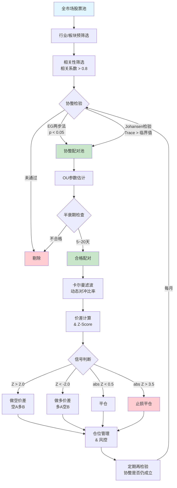
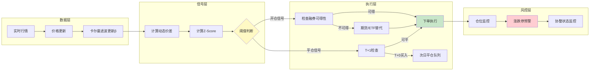

# A股统计套利与配对交易策略

## 核心要点

> [!abstract] 一句话概要
> 配对交易（Pairs Trading）是一种**市场中性**统计套利策略，通过识别具有长期均衡关系（协整）的资产对，在价差偏离均值时反向交易，捕获价差回归收益，天然对冲系统性风险。

**关键数据**：
- A股配对交易实证回测（2016-2021）：年化收益 **6.59%**，夏普比率 **0.52**，最大回撤 **18.31%**
- 累计超额收益率 **44.81%**（相对沪深300），Alpha **0.05**
- 策略在**震荡市**中表现最优，趋势市中需配合止损
- A股特殊约束：T+1 限制、融券券源不足、涨跌停板是核心挑战

> [!tip] 策略定位
> 配对交易属于**相对价值/市场中性**策略大类，与趋势策略互补。在 [[A股多因子选股策略开发全流程]] 中属于 Alpha 与 Beta 分离的重要工具。

---

## 一、配对交易原理

### 1.1 理论基础

配对交易基于两个核心假设：

1. **协整关系**（Cointegration）：两个非平稳价格序列存在某种线性组合使残差平稳，即存在长期均衡关系
2. **价差均值回归**（Mean Reversion）：价差短期偏离均衡后会回归长期均值，偏离越大、回归动力越强

数学表达：若 $P_A(t)$ 和 $P_B(t)$ 为两只股票的价格序列，存在 $\beta$ 使得：

$$\text{Spread}(t) = P_A(t) - \beta \cdot P_B(t)$$

为平稳过程（Stationary Process），则可在 Spread 偏离均值时进行反向交易。

### 1.2 交易逻辑

| 价差状态 | 操作 | 预期 |
|---------|------|------|
| Spread >> 均值（高于上轨） | 做空 A + 做多 B | 价差收敛获利 |
| Spread << 均值（低于下轨） | 做多 A + 做空 B | 价差收敛获利 |
| Spread ≈ 均值 | 平仓 | 利润锁定 |

---

## 二、配对选择方法

### 2.1 四种主要方法

#### 方法一：行业内配对

基于**同行业/同板块**的经济逻辑，选择业务相似、市值接近的股票对。

- **逻辑**：同行业受相同宏观因素驱动，价格联动性强
- **示例**：招商银行 vs 兴业银行、中国平安 vs 中国人寿、贵州茅台 vs 五粮液
- **优点**：经济逻辑清晰，协整关系更稳定
- **缺点**：行业系统性风险无法对冲

```python
# 行业内配对筛选示例
import akshare as ak

# 获取银行板块成分股
bank_stocks = ak.stock_board_industry_cons_em(symbol="银行")
# 按市值排序，选取相近市值的股票对
```

#### 方法二：最小距离法（Minimum Distance / SSD）

计算标准化价格序列之间的**欧氏距离**（Sum of Squared Deviations, SSD），距离最小的配对最相似。

$$D(A,B) = \sum_{t=1}^{T} \left(\tilde{P}_A(t) - \tilde{P}_B(t)\right)^2$$

其中 $\tilde{P}$ 为标准化价格（除以初始价格）。

#### 方法三：Engle-Granger 两步法（详见第三节）

通过 OLS 回归 + ADF 检验残差，验证两序列是否协整。

#### 方法四：扩展距离法（Extended Distance）

结合**相关系数 + 协整检验 + 基本面相似度**的综合评分：

$$\text{Score} = w_1 \cdot \rho + w_2 \cdot (1 - p_{\text{ADF}}) + w_3 \cdot \text{FundSim}$$

### 2.2 方法对比表

| 维度 | 行业内配对 | 最小距离法 | Engle-Granger | 扩展距离法 |
|------|-----------|-----------|---------------|-----------|
| **理论基础** | 经济逻辑 | 统计距离 | 协整理论 | 综合评分 |
| **计算复杂度** | 低 | 中 | 中 | 高 |
| **样本外稳定性** | 高 | 中 | 较高 | 高 |
| **适用范围** | 同行业 | 全市场 | 全市场 | 全市场 |
| **误配率** | 低 | 较高 | 低 | 最低 |
| **A股推荐度** | ⭐⭐⭐⭐⭐ | ⭐⭐⭐ | ⭐⭐⭐⭐ | ⭐⭐⭐⭐ |
| **适合策略** | 基本面驱动 | 量化筛选 | 统计套利 | 机构级策略 |

> [!note] A股实践经验
> 行业内配对 + 协整检验的**两步筛选法**在 A 股最为稳健：先锁定行业缩小范围，再用协整检验确认统计关系。纯统计方法（如最小距离法）在 A 股容易出现"伪配对"。

---

## 三、协整检验

### 3.1 Engle-Granger 两步法

**步骤一**：对两个价格序列做 OLS 回归：

$$P_A(t) = \alpha + \beta \cdot P_B(t) + \epsilon(t)$$

**步骤二**：对残差 $\epsilon(t)$ 进行 ADF 单位根检验：
- $H_0$：残差有单位根（非平稳，即不协整）
- 若 p 值 < 0.05，拒绝 $H_0$，确认协整关系成立

```python
import numpy as np
import pandas as pd
import statsmodels.api as sm
from statsmodels.tsa.stattools import adfuller, coint

def engle_granger_test(price_a: pd.Series, price_b: pd.Series,
                        significance: float = 0.05):
    """
    Engle-Granger 两步法协整检验

    Parameters
    ----------
    price_a, price_b : pd.Series — 两只股票的价格序列
    significance : float — 显著性水平（默认 0.05）

    Returns
    -------
    dict — 包含 beta(对冲比率)、residuals(残差)、adf_stat、p_value、is_cointegrated
    """
    # 步骤一：OLS 回归
    X = sm.add_constant(price_b)
    model = sm.OLS(price_a, X).fit()
    alpha, beta = model.params
    residuals = model.resid

    # 步骤二：ADF 检验残差
    adf_result = adfuller(residuals, maxlag=None, autolag='AIC')
    adf_stat, p_value = adf_result[0], adf_result[1]

    return {
        'alpha': alpha,
        'beta': beta,           # 静态对冲比率
        'residuals': residuals,
        'adf_stat': adf_stat,
        'p_value': p_value,
        'is_cointegrated': p_value < significance
    }

# 使用 statsmodels 内置函数（更简洁）
def quick_coint_test(price_a, price_b):
    """快速协整检验（封装 statsmodels.coint）"""
    score, p_value, crit_values = coint(price_a, price_b)
    return {'score': score, 'p_value': p_value,
            'crit_1pct': crit_values[0], 'crit_5pct': crit_values[1],
            'is_cointegrated': p_value < 0.05}
```

### 3.2 Johansen 检验

Johansen 检验适用于**多变量**系统，可同时检测多个协整向量，基于 VAR 模型的 VECM 表示。

**检验统计量**：
- **Trace 统计量**：$\lambda_{\text{trace}} = -T \sum_{i=r+1}^{n} \ln(1-\hat{\lambda}_i)$
- **最大特征值统计量**：$\lambda_{\max} = -T \ln(1-\hat{\lambda}_{r+1})$

```python
from statsmodels.tsa.vector_ar.vecm import coint_johansen

def johansen_test(prices_df: pd.DataFrame, det_order: int = 0,
                   k_ar_diff: int = 1):
    """
    Johansen 协整检验

    Parameters
    ----------
    prices_df : pd.DataFrame — 多列价格数据
    det_order : int — 确定性趋势（0=常数，1=线性趋势）
    k_ar_diff : int — VAR 模型滞后阶数

    Returns
    -------
    dict — Trace/Max-Eigen 统计量及临界值
    """
    result = coint_johansen(prices_df, det_order, k_ar_diff)

    print("=" * 60)
    print("Johansen 协整检验结果")
    print("=" * 60)

    # Trace 检验
    print("\n[Trace 检验]")
    print(f"{'秩 r':<8} {'Trace统计量':<15} {'5%临界值':<15} {'结论'}")
    for i in range(len(result.trace_stat)):
        reject = "拒绝H0(存在协整)" if result.trace_stat[i] > result.cvt[i, 1] else "不拒绝H0"
        print(f"r={i:<5} {result.trace_stat[i]:<15.4f} {result.cvt[i,1]:<15.4f} {reject}")

    # Max-Eigen 检验
    print("\n[最大特征值检验]")
    for i in range(len(result.max_eig_stat)):
        reject = "拒绝H0" if result.max_eig_stat[i] > result.cvm[i, 1] else "不拒绝H0"
        print(f"r={i:<5} {result.max_eig_stat[i]:<15.4f} {result.cvm[i,1]:<15.4f} {reject}")

    return {
        'trace_stat': result.trace_stat,
        'trace_crit_5pct': result.cvt[:, 1],
        'max_eig_stat': result.max_eig_stat,
        'max_eig_crit_5pct': result.cvm[:, 1],
        'evec': result.evec  # 协整向量
    }
```

### 3.3 两种方法对比

| 特性 | Engle-Granger | Johansen |
|------|--------------|----------|
| 变量数量 | 仅限两变量 | 支持多变量 |
| 协整向量 | 最多 1 个 | 可检测多个 |
| 内生性问题 | 存在（依赖因变量选择） | 不存在 |
| 计算复杂度 | 低 | 高 |
| 小样本表现 | 较好 | 需大样本 |
| A股推荐 | 两股票配对首选 | 多资产篮子配对 |

---

## 四、价差建模：Ornstein-Uhlenbeck 过程

### 4.1 OU 过程定义

OU 过程是描述**均值回归**行为的连续时间随机过程，由随机微分方程（SDE）定义：

$$dX_t = \theta(\mu - X_t)\,dt + \sigma\,dW_t$$

| 参数 | 含义 | 典型范围 |
|------|------|---------|
| $\theta$ | 均值回归速度（mean reversion speed） | 0.1 ~ 50（日频） |
| $\mu$ | 长期均值（long-run mean） | 取决于价差水平 |
| $\sigma$ | 扩散系数/波动率 | > 0 |
| $W_t$ | 维纳过程（标准布朗运动） | — |

### 4.2 关键公式

**半衰期**（价差偏离回归一半所需时间）：

$$t_{1/2} = \frac{\ln 2}{\theta}$$

- 半衰期太短（< 2天）：交易成本可能吃掉利润
- 半衰期太长（> 30天）：资金占用高、回归不确定
- **A股最佳区间**：5~20 个交易日

**条件分布**（$X_t | X_0$）：

$$X_t | X_0 \sim \mathcal{N}\left(\mu + (X_0 - \mu)e^{-\theta t},\; \frac{\sigma^2}{2\theta}(1 - e^{-2\theta t})\right)$$

### 4.3 参数估计（离散化 + OLS）

将 OU 过程离散化为 AR(1) 模型：

$$X_{t+1} - X_t = a + b \cdot X_t + \epsilon_t$$

则参数映射关系为：

$$\theta = -\frac{\ln(1+b)}{\Delta t}, \quad \mu = -\frac{a}{b}, \quad \sigma = \text{std}(\epsilon) \cdot \sqrt{\frac{-2\ln(1+b)}{\Delta t \cdot (1+b)^2 - 1}}$$

```python
def estimate_ou_params(spread: pd.Series, dt: float = 1.0):
    """
    从价差序列估计 OU 过程参数

    Parameters
    ----------
    spread : pd.Series — 价差时间序列
    dt : float — 时间间隔（日频=1）

    Returns
    -------
    dict — theta, mu, sigma, half_life
    """
    spread_lag = spread.shift(1).dropna()
    spread_diff = spread.diff().dropna()

    # 对齐
    spread_lag = spread_lag.iloc[1:]
    spread_diff = spread_diff.iloc[1:]

    # OLS: dX = a + b * X_{t-1}
    X = sm.add_constant(spread_lag)
    model = sm.OLS(spread_diff, X).fit()
    a, b = model.params

    # 参数转换
    theta = -np.log(1 + b) / dt
    mu = -a / b
    sigma_eq = np.std(model.resid) * np.sqrt(-2 * np.log(1 + b) / (dt * ((1 + b)**2 - 1)))
    half_life = np.log(2) / theta if theta > 0 else np.inf

    return {
        'theta': theta,         # 均值回归速度
        'mu': mu,               # 长期均值
        'sigma': sigma_eq,      # 波动率
        'half_life': half_life, # 半衰期（天）
        'b_pvalue': model.pvalues.iloc[1]  # b 的显著性
    }
```

---

## 五、卡尔曼滤波：动态对冲比率

### 5.1 为什么需要动态对冲比率？

静态 OLS 回归假设 $\beta$ 恒定，但实际中对冲比率**随时间变化**（结构变化、市场环境切换）。卡尔曼滤波通过**状态空间模型**实时更新 $\beta_t$，提供更精确的动态对冲。

### 5.2 状态空间模型

**观测方程**（Observation Equation）：

$$y_t = \begin{bmatrix} 1 & x_t \end{bmatrix} \begin{bmatrix} \alpha_t \\ \beta_t \end{bmatrix} + \epsilon_t, \quad \epsilon_t \sim \mathcal{N}(0, R)$$

**状态方程**（State Equation / Transition Equation）：

$$\begin{bmatrix} \alpha_{t+1} \\ \beta_{t+1} \end{bmatrix} = \begin{bmatrix} 1 & 0 \\ 0 & 1 \end{bmatrix} \begin{bmatrix} \alpha_t \\ \beta_t \end{bmatrix} + \nu_t, \quad \nu_t \sim \mathcal{N}(0, Q)$$

其中：
- $y_t$ = 目标资产价格
- $x_t$ = 参考资产价格
- $\alpha_t$ = 动态截距
- $\beta_t$ = **动态对冲比率**（核心输出）
- $R$ = 观测噪声方差
- $Q$ = 状态转移噪声协方差（控制 $\beta$ 变化速度）

### 5.3 卡尔曼滤波递推

**预测步**（Predict）：

$$\hat{x}_{t|t-1} = F \hat{x}_{t-1|t-1}$$
$$P_{t|t-1} = F P_{t-1|t-1} F^T + Q$$

**更新步**（Update）：

$$K_t = P_{t|t-1} H_t^T (H_t P_{t|t-1} H_t^T + R)^{-1}$$
$$\hat{x}_{t|t} = \hat{x}_{t|t-1} + K_t (y_t - H_t \hat{x}_{t|t-1})$$
$$P_{t|t} = (I - K_t H_t) P_{t|t-1}$$

### 5.4 Python 实现

```python
import numpy as np
import pandas as pd

class KalmanFilterHedgeRatio:
    """
    卡尔曼滤波估计动态对冲比率

    状态向量: [alpha_t, beta_t]
    观测方程: y_t = alpha_t + beta_t * x_t + eps_t
    状态方程: state_{t+1} = state_t + nu_t  (随机游走)
    """

    def __init__(self, delta: float = 1e-4, Ve: float = 1e-3):
        """
        Parameters
        ----------
        delta : float — 状态转移噪声系数（越大 beta 变化越快）
        Ve : float — 观测噪声方差初始值
        """
        self.delta = delta
        self.Ve = Ve

    def fit(self, y: np.ndarray, x: np.ndarray):
        """
        执行卡尔曼滤波

        Parameters
        ----------
        y : np.ndarray — 目标资产价格序列
        x : np.ndarray — 参考资产价格序列

        Returns
        -------
        dict — alphas, betas (动态对冲比率), spreads, e (预测误差)
        """
        n = len(y)

        # 初始化
        theta = np.zeros((n, 2))    # 状态: [alpha, beta]
        P = np.zeros((n, 2, 2))     # 状态协方差
        e = np.zeros(n)             # 预测误差
        Q_arr = np.zeros(n)         # 预测误差方差

        # 状态转移矩阵
        F = np.eye(2)
        # 状态噪声协方差
        Wt = self.delta / (1 - self.delta) * np.eye(2)

        # 初始状态
        theta[0] = [0.0, 0.0]
        P[0] = np.eye(2)

        for t in range(1, n):
            # 观测矩阵 H = [1, x_t]
            H = np.array([[1.0, x[t]]])

            # === 预测步 ===
            theta_pred = F @ theta[t-1]
            P_pred = F @ P[t-1] @ F.T + Wt

            # === 更新步 ===
            # 预测误差
            y_pred = H @ theta_pred
            e[t] = y[t] - y_pred[0]

            # 预测误差方差
            Q_arr[t] = (H @ P_pred @ H.T + self.Ve)[0, 0]

            # 卡尔曼增益
            K = P_pred @ H.T / Q_arr[t]

            # 状态更新
            theta[t] = theta_pred + (K @ np.array([[e[t]]])).flatten()
            P[t] = P_pred - K @ H @ P_pred

        alphas = theta[:, 0]
        betas = theta[:, 1]
        spreads = y - betas * x - alphas

        return {
            'alphas': alphas,
            'betas': betas,       # 动态对冲比率
            'spreads': spreads,   # 动态价差
            'errors': e,          # 预测误差
            'Q': Q_arr            # 预测误差方差
        }

# 使用示例
# kf = KalmanFilterHedgeRatio(delta=1e-4, Ve=1e-3)
# result = kf.fit(price_a.values, price_b.values)
# dynamic_beta = result['betas']
# dynamic_spread = result['spreads']
```

> [!important] delta 参数调优
> - `delta` 越大：$\beta_t$ 对新数据越敏感，追踪快但噪声大
> - `delta` 越小：$\beta_t$ 越平滑，滞后但稳定
> - A股日频推荐：`delta` = 1e-5 ~ 1e-3

---

## 六、开平仓信号设计

### 6.1 Z-Score 固定阈值法

将价差标准化为 Z-Score：

$$Z_t = \frac{\text{Spread}_t - \overline{\text{Spread}}}{\sigma_{\text{Spread}}}$$

| 信号 | 条件 | 操作 |
|------|------|------|
| 开多价差 | $Z_t < -z_{\text{open}}$（通常 -2.0） | 做多 A，做空 B |
| 开空价差 | $Z_t > +z_{\text{open}}$（通常 +2.0） | 做空 A，做多 B |
| 平仓 | $|Z_t| < z_{\text{close}}$（通常 0.5） | 全部平仓 |
| 止损 | $|Z_t| > z_{\text{stop}}$（通常 3.5~4.0） | 止损平仓 |

### 6.2 布林带方法

以价差的滚动均值和标准差构建布林带：

$$\text{Upper} = \text{MA}_{n}(\text{Spread}) + k \cdot \text{Std}_{n}(\text{Spread})$$
$$\text{Lower} = \text{MA}_{n}(\text{Spread}) - k \cdot \text{Std}_{n}(\text{Spread})$$

窗口 $n$ 建议取 OU 半衰期的 2~3 倍，$k$ 通常取 1.5~2.5。

### 6.3 自适应阈值方法

根据 OU 过程参数动态调整阈值：

$$z_{\text{open}} = f(\theta, \sigma, \text{cost})$$

核心思想：当均值回归速度 $\theta$ 较高（半衰期短）时，可以使用更窄的阈值；当 $\theta$ 较低时，需要更宽的阈值确保价差有足够回归动力。

```python
def adaptive_threshold(theta: float, sigma: float,
                        transaction_cost: float = 0.003):
    """
    基于 OU 参数的自适应开仓阈值

    Parameters
    ----------
    theta : float — 均值回归速度
    sigma : float — OU 波动率
    transaction_cost : float — 单边交易成本（默认 0.3%）

    Returns
    -------
    float — 最优开仓 Z-Score 阈值
    """
    # 最优阈值 ≈ sqrt(2 * cost * theta) / sigma（简化解析解）
    half_life = np.log(2) / theta

    # 经验法则：半衰期越短，阈值越低
    if half_life < 5:
        z_open = 1.5
    elif half_life < 10:
        z_open = 2.0
    elif half_life < 20:
        z_open = 2.5
    else:
        z_open = 3.0

    # 考虑交易成本：成本高则需更宽阈值
    cost_adjustment = transaction_cost / 0.001  # 基准 0.1%
    z_open *= (1 + 0.1 * (cost_adjustment - 1))

    return z_open
```

### 6.4 信号设计对比

| 方法 | 优点 | 缺点 | A股适用性 |
|------|------|------|----------|
| 固定 Z-Score | 简单直观 | 忽略参数变化 | 入门首选 |
| 布林带 | 自适应窗口 | 窗口选择敏感 | 中等 |
| 自适应阈值 | 理论最优 | 依赖 OU 参数准确性 | 高级策略 |
| 卡尔曼滤波误差 | 天然自适应 | 需调 delta | 机构级 |

---

## 七、A股配对交易的特殊挑战

### 7.1 T+1 限制

**核心影响**：买入股票当日无法卖出，限制了日内多空切换能力。

| 问题 | 影响 | 应对方案 |
|------|------|---------|
| 无法日内平仓 | 隔夜风险暴露 | 开仓时留足安全边际（Z>2.5） |
| 多空不对称 | 多头 T+1，融券可 T+0 | 利用 ETF 代替个股（部分 ETF 支持 T+0 申赎） |
| 开盘卖方主导 | 隔夜负收益效应 | 收盘前建仓，避免次日开盘波动 |
| 信号失效风险 | T 日信号 T+1 可能已回归 | 使用半衰期 > 5 天的配对 |

**ETF 解决方案**：通过 ETF 申赎机制实现变相 T+0：T 日买入 ETF → 当日赎回为一篮子股票 → 卖出股票。参见 [[A股交易制度全解析]]。

### 7.2 融券券源不足

**核心影响**：A 股融券成本高（年化 8%~10%+）、券源有限、经常被收回。

| 问题 | 影响 | 应对方案 |
|------|------|---------|
| 券源稀缺 | 无法建立空头仓位 | 用股指期货空头替代融券 |
| 融券成本高 | 侵蚀套利收益 | 选择利差 > 融券成本的配对 |
| 券源随时收回 | 被迫平仓 | 使用 ETF 或期权合成空头 |
| 限售股无法融出 | 大量股票不可做空 | 限制配对池为融券标的 |

**替代方案优先级**：
1. **股指期货空头**（流动性最好、成本最低）
2. **ETF 融券**（券源相对充足）
3. **期权合成空头**（买入认沽 + 卖出认购）
4. **跨品种对冲**（行业 ETF 对冲个股）

详见 [[A股衍生品市场与对冲工具]]。

### 7.3 涨跌停风险

**核心影响**：价差可能因一方涨/跌停而无法执行交易。

| 问题 | 影响 | 应对方案 |
|------|------|---------|
| 涨停无法买入 | 做多腿无法建仓 | 分批建仓，预留备选配对 |
| 跌停无法卖出 | 做空腿无法平仓 | 设置涨跌停预警，提前操作 |
| 极端价差扩大 | 浮亏急剧放大 | 硬性止损线（如 Z > 4） |
| 停牌风险 | 单边敞口暴露 | 避免小市值股，选流动性好标的 |

**科创板/创业板注意**：涨跌停幅度 ±20%，单日价差波动可达 40%，需额外提高止损阈值。

### 7.4 综合应对框架

```
应对策略优先级：
1. 标的选择层 → 大市值、高流动性、融券可得
2. 工具替代层 → ETF/期货/期权替代融券
3. 信号设计层 → 加大安全边际（Z > 2.5）
4. 风控执行层 → 硬性止损 + 仓位控制（单对 < 10%）
5. 组合分散层 → 同时持有 5~10 对，降低单对风险
```

---

## 八、ETF 套利策略

### 8.1 LOF 套利

**LOF（Listed Open-Ended Fund）** 既可在场内交易，也可场外申赎，存在**折溢价**套利空间。

| 套利方向 | 条件 | 操作流程 | 时效 |
|---------|------|---------|------|
| **溢价套利** | 场内价格 > 净值 | 场外申购 → 转托管至场内 → 卖出 | T+2~T+3 |
| **折价套利** | 场内价格 < 净值 | 场内买入 → 转托管至场外 → 赎回 | T+2~T+3 |

- **优点**：门槛低（数百元即可）、操作简单
- **缺点**：转托管耗时长（通常 2~3 个工作日），期间价差可能消失
- **适用标的**：场内外价差稳定 > 1.5% 的 LOF 品种

### 8.2 ETF 申赎套利（折溢价套利）

利用 ETF 一级市场（申购/赎回）与二级市场（买卖）的价差。

**溢价套利**（场内价格 > IOPV）：
```
买入一篮子成分股 → 申购 ETF 份额 → 卖出 ETF
```

**折价套利**（场内价格 < IOPV）：
```
买入 ETF → 赎回为一篮子成分股 → 卖出成分股
```

| 维度 | 说明 |
|------|------|
| **IOPV** | 参考单位基金净值（Indicative Optimized Portfolio Value），实时计算 |
| **最小申赎单位** | 通常 50 万份或 100 万份（资金门槛约 50~200 万元） |
| **执行速度** | 需秒级完成，通常用程序化交易 |
| **收益空间** | 单次 0.1%~0.5%，年化取决于频率 |
| **核心风险** | 执行延迟（数秒价差消失）、成分股停牌（现金替代） |

### 8.3 跨市场 ETF 套利

针对**同一标的指数**在不同交易所的 ETF 产品价差。

| 套利类型 | 示例 | 操作 |
|---------|------|------|
| **沪深跨市场** | 沪深 300 ETF（上交所）vs 沪深 300 ETF（深交所） | 买低卖高 + 申赎对冲 |
| **跨境 ETF** | 恒生 ETF（A股）vs 恒生指数 ETF（港股） | 利用汇率 + 折溢价 |
| **期现套利** | 股指期货 vs 对应 ETF | 基差收敛获利 |

**跨市场 ETF 特点**：
- 涉及不同交易所的清算规则差异
- 跨境 ETF 受外汇管制影响、存在时区差
- 需要关注 QDII 额度限制

### 8.4 ETF 套利对比表

| 维度 | LOF 套利 | ETF 申赎套利 | 跨市场 ETF 套利 |
|------|---------|-------------|----------------|
| 资金门槛 | 低（千元级） | 高（50万+） | 中高 |
| 时效性 | T+2~T+3 | T+0（实时） | T+0~T+1 |
| 收益空间 | 较大（1%~3%） | 较小（0.1%~0.5%） | 中等 |
| 技术要求 | 低 | 高（程序化） | 高 |
| 频率 | 低频 | 高频 | 中频 |
| 风险 | 时间风险 | 执行风险 | 跨市场风险 |

---

## 九、参数速查表

| 参数 | 推荐值/范围 | 说明 |
|------|------------|------|
| **协整检验 p 值** | < 0.05（严格 < 0.01） | ADF/Johansen 显著性阈值 |
| **对冲比率 β** | 由 OLS 或卡尔曼滤波估计 | 非自行设定 |
| **OU 半衰期** | 5~20 天（日频） | 太短/太长均不适合交易 |
| **Z-Score 开仓** | ±2.0（保守 ±2.5） | A股因 T+1 建议偏保守 |
| **Z-Score 平仓** | ±0.5 ~ 0 | 回归到均值附近 |
| **Z-Score 止损** | ±3.5 ~ ±4.0 | 协整关系可能已破裂 |
| **滚动窗口** | 60~120 天 | 用于计算 Z-Score 均值/标准差 |
| **训练期长度** | 1~2 年 | 协整检验样本期 |
| **协整再检验周期** | 每月或每季度 | 动态验证关系是否仍成立 |
| **卡尔曼 delta** | 1e-5 ~ 1e-3 | 状态噪声系数 |
| **单对仓位上限** | ≤ 10% | 组合分散 |
| **同时持有对数** | 5~10 对 | 降低单对风险 |
| **交易成本（单边）** | 0.1%~0.3% | 含佣金+滑点+冲击成本 |

---

## 十、流程图

### 10.1 配对交易完整流程



### 10.2 信号生成与执行流程



---

## 十一、完整 Python 策略代码

```python
"""
A股配对交易完整策略框架
包含：协整检验 → 卡尔曼滤波动态对冲 → 信号生成 → 回测

依赖: pip install akshare pandas numpy statsmodels matplotlib pykalman
"""

import numpy as np
import pandas as pd
import statsmodels.api as sm
from statsmodels.tsa.stattools import adfuller, coint
from statsmodels.tsa.vector_ar.vecm import coint_johansen
import matplotlib.pyplot as plt
from itertools import combinations
import warnings
warnings.filterwarnings('ignore')


# ==========================================
# Part 1: 数据获取
# ==========================================

def get_stock_data(symbols: list, start_date: str, end_date: str) -> pd.DataFrame:
    """
    获取 A 股日频收盘价数据

    Parameters
    ----------
    symbols : list — 股票代码列表（如 ['600036', '601166']）
    start_date, end_date : str — 日期范围（'20220101'）

    Returns
    -------
    pd.DataFrame — 收盘价 DataFrame，列名为股票代码
    """
    import akshare as ak

    prices = pd.DataFrame()
    for sym in symbols:
        try:
            df = ak.stock_zh_a_hist(
                symbol=sym, period="daily",
                start_date=start_date, end_date=end_date, adjust="qfq"
            )
            df.index = pd.to_datetime(df['日期'])
            prices[sym] = df['收盘']
        except Exception as e:
            print(f"获取 {sym} 失败: {e}")

    return prices.dropna()


# ==========================================
# Part 2: 配对筛选与协整检验
# ==========================================

def find_cointegrated_pairs(prices: pd.DataFrame,
                             significance: float = 0.05) -> list:
    """
    从股票价格矩阵中筛选所有协整配对

    Returns
    -------
    list of dict — 每个元素包含 stock_a, stock_b, p_value, beta
    """
    n = prices.shape[1]
    symbols = prices.columns.tolist()
    pairs = []

    for i, j in combinations(range(n), 2):
        # Engle-Granger 协整检验
        score, p_value, _ = coint(prices.iloc[:, i], prices.iloc[:, j])

        if p_value < significance:
            # 计算对冲比率
            X = sm.add_constant(prices.iloc[:, j])
            model = sm.OLS(prices.iloc[:, i], X).fit()
            beta = model.params.iloc[1]

            # 计算残差的半衰期
            residuals = model.resid
            spread_lag = residuals.shift(1).dropna()
            spread_diff = residuals.diff().dropna()
            idx = spread_lag.index.intersection(spread_diff.index)
            reg = sm.OLS(spread_diff.loc[idx],
                         sm.add_constant(spread_lag.loc[idx])).fit()

            b = reg.params.iloc[1]
            if b < 0:
                half_life = -np.log(2) / np.log(1 + b)
            else:
                half_life = np.inf

            pairs.append({
                'stock_a': symbols[i],
                'stock_b': symbols[j],
                'p_value': p_value,
                'beta': beta,
                'half_life': half_life
            })

    # 按 p 值排序
    pairs.sort(key=lambda x: x['p_value'])
    return pairs


# ==========================================
# Part 3: 卡尔曼滤波动态对冲比率
# ==========================================

class KalmanPairTrader:
    """配对交易卡尔曼滤波 + 回测引擎"""

    def __init__(self, delta=1e-4, Ve=1e-3,
                 z_open=2.0, z_close=0.5, z_stop=3.5,
                 lookback=60):
        self.delta = delta
        self.Ve = Ve
        self.z_open = z_open
        self.z_close = z_close
        self.z_stop = z_stop
        self.lookback = lookback

    def kalman_filter(self, y: np.ndarray, x: np.ndarray):
        """运行卡尔曼滤波，返回动态 alpha, beta, spread"""
        n = len(y)
        theta = np.zeros((n, 2))
        P = np.zeros((n, 2, 2))

        F = np.eye(2)
        Wt = self.delta / (1 - self.delta) * np.eye(2)

        theta[0] = [0.0, 1.0]  # 初始 beta=1
        P[0] = np.eye(2)

        for t in range(1, n):
            H = np.array([[1.0, x[t]]])

            # 预测
            theta_pred = F @ theta[t-1]
            P_pred = F @ P[t-1] @ F.T + Wt

            # 更新
            y_pred = (H @ theta_pred)[0]
            e = y[t] - y_pred
            Q = (H @ P_pred @ H.T + self.Ve)[0, 0]
            K = P_pred @ H.T / Q

            theta[t] = theta_pred + (K * e).flatten()
            P[t] = P_pred - K @ H @ P_pred

        alphas = theta[:, 0]
        betas = theta[:, 1]
        spreads = y - betas * x - alphas

        return alphas, betas, spreads

    def generate_signals(self, spreads: np.ndarray) -> np.ndarray:
        """
        生成交易信号

        Returns
        -------
        np.ndarray — 信号序列: 1=做多价差, -1=做空价差, 0=无仓位
        """
        n = len(spreads)
        signals = np.zeros(n)
        position = 0

        for t in range(self.lookback, n):
            window = spreads[t - self.lookback:t]
            z = (spreads[t] - np.mean(window)) / (np.std(window) + 1e-10)

            if position == 0:
                # 开仓逻辑
                if z < -self.z_open:
                    position = 1    # 做多价差（多A空B）
                elif z > self.z_open:
                    position = -1   # 做空价差（空A多B）
            elif position == 1:
                # 持多仓：平仓或止损
                if z > -self.z_close or z < -self.z_stop:
                    position = 0
            elif position == -1:
                # 持空仓：平仓或止损
                if z < self.z_close or z > self.z_stop:
                    position = 0

            signals[t] = position

        return signals

    def backtest(self, price_a: pd.Series, price_b: pd.Series,
                 initial_capital: float = 1_000_000,
                 cost_rate: float = 0.002):
        """
        配对交易回测

        Parameters
        ----------
        price_a, price_b : pd.Series — 两只股票价格
        initial_capital : float — 初始资金
        cost_rate : float — 单边交易成本（含佣金+滑点）

        Returns
        -------
        dict — 回测结果
        """
        y = price_a.values
        x = price_b.values
        dates = price_a.index

        # 卡尔曼滤波
        alphas, betas, spreads = self.kalman_filter(y, x)

        # 生成信号（T+1 模拟：信号延迟一天执行）
        raw_signals = self.generate_signals(spreads)
        signals = np.zeros_like(raw_signals)
        signals[1:] = raw_signals[:-1]  # T+1 延迟

        # 计算收益
        ret_a = pd.Series(y).pct_change().fillna(0).values
        ret_b = pd.Series(x).pct_change().fillna(0).values

        # 价差收益 = 多A的收益 - beta * 多B的收益
        # signal=1: 多A空B → 收益 = ret_a - beta * ret_b
        # signal=-1: 空A多B → 收益 = -ret_a + beta * ret_b
        strategy_returns = np.zeros(len(y))
        total_cost = 0

        for t in range(1, len(y)):
            if signals[t] != 0:
                spread_ret = signals[t] * (ret_a[t] - betas[t] * ret_b[t])
                strategy_returns[t] = spread_ret

            # 交易成本（开/平仓时）
            if signals[t] != signals[t-1]:
                strategy_returns[t] -= cost_rate
                total_cost += cost_rate

        # 累计净值
        nav = initial_capital * np.cumprod(1 + strategy_returns)

        # 绩效指标
        total_return = nav[-1] / initial_capital - 1
        n_years = len(y) / 252
        annual_return = (1 + total_return) ** (1 / n_years) - 1
        annual_vol = np.std(strategy_returns) * np.sqrt(252)
        sharpe = annual_return / annual_vol if annual_vol > 0 else 0

        # 最大回撤
        peak = np.maximum.accumulate(nav)
        drawdown = (nav - peak) / peak
        max_drawdown = np.min(drawdown)

        # 交易次数
        signal_changes = np.diff(signals)
        n_trades = np.sum(signal_changes != 0)

        results = {
            'nav': pd.Series(nav, index=dates),
            'signals': pd.Series(signals, index=dates),
            'betas': pd.Series(betas, index=dates),
            'spreads': pd.Series(spreads, index=dates),
            'total_return': total_return,
            'annual_return': annual_return,
            'annual_vol': annual_vol,
            'sharpe': sharpe,
            'max_drawdown': max_drawdown,
            'n_trades': n_trades,
            'total_cost': total_cost
        }

        return results

    def plot_results(self, results: dict, title: str = "配对交易回测"):
        """可视化回测结果"""
        fig, axes = plt.subplots(4, 1, figsize=(14, 12), sharex=True)

        # 净值曲线
        axes[0].plot(results['nav'], 'b-', linewidth=1)
        axes[0].set_title(f'{title} | 年化: {results["annual_return"]:.2%} '
                          f'| 夏普: {results["sharpe"]:.2f} '
                          f'| 最大回撤: {results["max_drawdown"]:.2%}')
        axes[0].set_ylabel('净值')

        # 动态 Beta
        axes[1].plot(results['betas'], 'g-', linewidth=0.8)
        axes[1].set_ylabel('动态 β（对冲比率）')

        # 价差与信号
        axes[2].plot(results['spreads'], 'gray', linewidth=0.6, alpha=0.7)
        axes[2].set_ylabel('价差')

        # 仓位
        axes[3].fill_between(results['signals'].index,
                              results['signals'].values,
                              alpha=0.5, color='orange')
        axes[3].set_ylabel('仓位 (1/-1/0)')
        axes[3].set_xlabel('日期')

        plt.tight_layout()
        plt.savefig('pairs_trading_backtest.png', dpi=150)
        plt.show()


# ==========================================
# Part 4: 完整策略执行示例
# ==========================================

def run_pairs_strategy():
    """配对交易策略完整执行流程"""

    # === Step 1: 获取数据 ===
    # 以银行股为例：招商银行(600036) vs 兴业银行(601166)
    symbols = ['600036', '601166']
    prices = get_stock_data(symbols, '20220101', '20241231')

    if prices.empty:
        print("数据获取失败，使用模拟数据...")
        np.random.seed(42)
        n = 500
        x = np.cumsum(np.random.randn(n) * 0.02) + 30
        y = 1.2 * x + 5 + np.cumsum(np.random.randn(n) * 0.01)
        dates = pd.date_range('2022-01-01', periods=n, freq='B')
        prices = pd.DataFrame({'600036': y, '601166': x}, index=dates)

    print(f"数据期间: {prices.index[0]} ~ {prices.index[-1]}")
    print(f"样本量: {len(prices)}")

    # === Step 2: 协整检验 ===
    score, p_value, crit = coint(prices.iloc[:, 0], prices.iloc[:, 1])
    print(f"\n协整检验 p-value: {p_value:.6f}")

    if p_value > 0.05:
        print("警告：协整检验未通过，策略风险较高！")

    # === Step 3: OU 参数估计 ===
    X = sm.add_constant(prices.iloc[:, 1])
    model = sm.OLS(prices.iloc[:, 0], X).fit()
    spread = model.resid

    spread_lag = spread.shift(1).dropna()
    spread_diff = spread.diff().dropna()
    idx = spread_lag.index.intersection(spread_diff.index)
    ou_reg = sm.OLS(spread_diff.loc[idx],
                     sm.add_constant(spread_lag.loc[idx])).fit()
    b = ou_reg.params.iloc[1]
    half_life = -np.log(2) / np.log(1 + b) if b < 0 else np.inf
    print(f"OU 半衰期: {half_life:.1f} 天")

    # === Step 4: 回测 ===
    trader = KalmanPairTrader(
        delta=1e-4,     # 卡尔曼状态噪声
        Ve=1e-3,        # 观测噪声
        z_open=2.0,     # 开仓阈值
        z_close=0.5,    # 平仓阈值
        z_stop=3.5,     # 止损阈值
        lookback=60     # Z-Score 计算窗口
    )

    results = trader.backtest(
        prices.iloc[:, 0], prices.iloc[:, 1],
        initial_capital=1_000_000,
        cost_rate=0.002  # 单边 0.2%
    )

    # === Step 5: 输出结果 ===
    print("\n" + "=" * 50)
    print("配对交易回测结果")
    print("=" * 50)
    print(f"累计收益率:   {results['total_return']:.2%}")
    print(f"年化收益率:   {results['annual_return']:.2%}")
    print(f"年化波动率:   {results['annual_vol']:.2%}")
    print(f"夏普比率:     {results['sharpe']:.2f}")
    print(f"最大回撤:     {results['max_drawdown']:.2%}")
    print(f"交易次数:     {results['n_trades']}")
    print(f"累计交易成本: {results['total_cost']:.2%}")

    # 绘图
    trader.plot_results(results,
                        title=f"{symbols[0]} vs {symbols[1]} 配对交易")

    return results


if __name__ == "__main__":
    results = run_pairs_strategy()
```

---

## 十二、常见误区

> [!warning] 配对交易常见陷阱

| # | 误区 | 正确认知 |
|---|------|---------|
| 1 | **相关性 = 协整** | 相关性是短期联动，协整是长期均衡。高相关不一定协整，协整才是配对交易的理论基础 |
| 2 | **协整关系永久不变** | 协整关系会随时间衰减/消失，必须定期（至少每月）重新检验 |
| 3 | **忽略交易成本** | 统计套利利润微薄，双边交易成本（佣金+滑点+融券费）可能吃掉全部利润 |
| 4 | **不设止损** | 协整关系可能发生结构性断裂（基本面突变），必须设硬性止损 |
| 5 | **忽略 T+1 的影响** | A 股 T+1 使信号执行延迟一天，回测时必须模拟这一延迟，否则高估收益 |
| 6 | **用价格而非对数价格** | 高价股的价差绝对值大但比率未必异常，建议使用对数价格或价格比率 |
| 7 | **过度拟合阈值** | 在训练集上优化 Z-Score 阈值容易过拟合，应使用滚动窗口或样本外验证 |
| 8 | **单对重仓** | 单一配对集中度过高，应同时持有 5~10 对分散风险 |
| 9 | **默认可以做空** | A 股融券极度受限，必须事先确认券源可得性或使用替代工具 |
| 10 | **忽略涨跌停** | 涨跌停导致单边无法执行，回测中应纳入涨跌停限制 |

---

## 十三、与其他笔记的关联

- [[A股交易制度全解析]] — T+1、涨跌停、融券制度等交易规则对配对交易的直接约束
- [[A股市场微观结构深度研究]] — 价格发现机制、买卖价差、流动性对配对交易执行质量的影响
- [[A股衍生品市场与对冲工具]] — 融券替代方案：股指期货、期权合成空头、ETF 对冲工具
- [[A股量化数据源全景图]] — 配对交易所需的行情数据、财务数据、融券数据的获取渠道
- [[A股技术面因子与量价特征]] — 技术面因子可辅助配对筛选与信号增强
- [[因子评估方法论]] — 因子 IC、分层回测等方法可用于评估配对信号的有效性
- [[A股多因子选股策略开发全流程]] — 配对交易作为 Alpha/Beta 分离的市场中性策略的补充
- [[A股量化交易平台深度对比]] — 回测平台选择对配对交易策略实现的影响
- [[量化数据工程实践]] — 配对交易数据清洗、复权处理、缺失值对齐等工程问题
- [[A股指数体系与基准构建]] — ETF 套利中指数跟踪、IOPV 计算的基准构建

---

## 来源参考

1. 基于协整检验与 AT 平台的配对交易策略实证研究（2016-2021），Hans Publishers，年化 6.59%，夏普 0.52
2. QuantStart — Ornstein-Uhlenbeck Simulation with Python，OU 过程建模与参数估计方法
3. Engle, R.F. & Granger, C.W.J. (1987). "Co-integration and Error Correction"，协整理论奠基论文
4. Johansen, S. (1991). "Estimation and Hypothesis Testing of Cointegration Vectors"
5. Gatev, E., Goetzmann, W. & Rouwenhorst, K. (2006). "Pairs Trading: Performance of a Relative Value Arbitrage Rule"，配对交易经典实证
6. BigQuant — 卡尔曼滤波配对交易策略框架
7. 华尔街见闻 — ETF 套利策略详解（2025）
8. Vidyamurthy, G. (2004). *Pairs Trading: Quantitative Methods and Analysis*，配对交易系统性教材
9. Avellaneda, M. & Lee, J.H. (2010). "Statistical Arbitrage in the US Equities Market"
