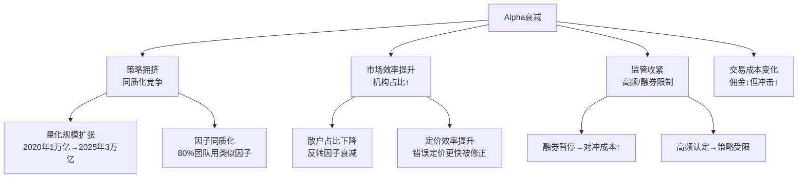

# Alpha衰减与策略生命周期管理

> - A股量化超额收益持续收窄：指数增强超额从2020年的15-25%降至2024-2025年的5-15%，年均衰减约3-5个百分点
> - Alpha衰减三大驱动力：**策略拥挤**（同质化竞争）、**市场适应**（定价效率提升）、**监管变化**（融券/高频限制）
> - 策略生命周期典型4阶段：**发现期**→**收割期**→**拥挤期**→**衰退期**，平均寿命约3-5年
> - 因子拥挤度与未来7-12个月因子收益率**显著负相关**，高拥挤期回撤概率为低拥挤期的2-3倍
> - 多策略组合是对抗衰减的核心手段：单一策略不可持续，需持续迭代+低相关策略组合

---

## 一、A股Alpha衰减实证

### 1.1 超额收益趋势（2020-2025）

| 年份 | 沪深300增强超额 | 中证500增强超额 | 中证1000增强超额 | 市场中性超额 |
|------|---------------|---------------|----------------|------------|
| 2020 | 8-15% | 15-25% | 20-35% | 15-25% |
| 2021 | 5-12% | 10-20% | 15-30% | 10-20% |
| 2022 | 3-8% | 8-15% | 12-25% | 8-15% |
| 2023 | 3-8% | 5-12% | 8-20% | 5-12% |
| 2024 | 2-6% | 5-10% | 5-15% | 3-10% |
| 2025 | 2-5% | 5-12% | 8-18% | 5-15% |

### 1.2 衰减驱动力



## 二、策略生命周期

| 阶段 | 特征 | Alpha | 拥挤度 | 持续时间 |
|------|------|-------|--------|---------|
| 发现期 | 少数团队发现新因子/策略 | 最高(15-30%) | 低 | 6-12个月 |
| 收割期 | 中等数量团队跟进 | 高(10-20%) | 中低 | 1-2年 |
| 拥挤期 | 大量团队涌入 | 快速下降(5-10%) | 高 | 1-2年 |
| 衰退期 | Alpha不足以覆盖成本 | 极低(<5%) | 峰值后回落 | 持续 |

### 半衰期估算
```
Alpha半衰期 ≈ ln(2) / 衰减率
- 高频策略半衰期: 6-12个月（衰减率~60%/年）
- 中频多因子: 2-3年（衰减率~25%/年）
- 低频价值: 5-10年（衰减率~10%/年）
```

## 三、拥挤度监测

| 指标 | 计算方式 | 高拥挤阈值 |
|------|---------|-----------|
| 因子估值价差 | 因子多空组合估值分位数 | >80%分位 |
| 配对相关性 | 同因子策略产品收益相关性 | >0.8 |
| 因子波动率 | 因子收益率波动突变 | >2倍历史 |
| 行业集中度 | Top因子持仓行业HHI | >0.15 |
| 换手率分位 | 因子持仓股票换手率 | >80%分位 |

## 四、策略迭代方法论

1. **因子创新**：寻找新Alpha来源（另类数据/高频/ML）
2. **执行优化**：降低交易成本（智能拆单/暗池/降频）
3. **风格漂移**：从拥挤的中小盘→大盘/行业/主题
4. **跨市场**：A股Alpha衰减→港股/期货/可转债/加密
5. **频率调整**：日频拥挤→周频/月频（换IC稳定性）

## 五、多策略组合

| 策略组合方案 | 相关性 | 预期超额 | 稳定性 |
|-------------|--------|---------|--------|
| 指增+CTA | <0.3 | 8-15% | 高 |
| 指增+市场中性 | 0.3-0.5 | 10-18% | 中高 |
| 多因子+事件驱动 | <0.4 | 8-12% | 高 |
| A股+可转债+商品 | <0.3 | 10-20% | 高 |

## 六、相关笔记

- [[因子评估方法论]] — 因子拥挤度、失效预警
- [[A股行业轮动与风格轮动因子]] — 行业拥挤度PCA吸收比率
- [[策略绩效评估与统计检验]] — PBO/DSR过拟合检验
- [[A股多因子选股策略开发全流程]] — 多因子策略容量估算
- [[A股市场状态识别与择时因子]] — 市场状态对策略的影响

---

## 来源参考

1. 中信证券《量化超额收益的来源与衰减》2024
2. 华泰证券《因子拥挤度监测体系》2023
3. AQR "The Death of Value" and "Reports of Value's Death Have Been Greatly Exaggerated"
4. 私募排排网《2020-2025量化私募业绩归因》
