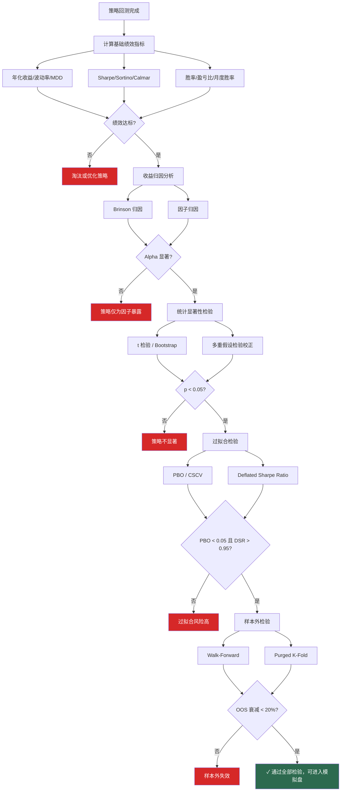
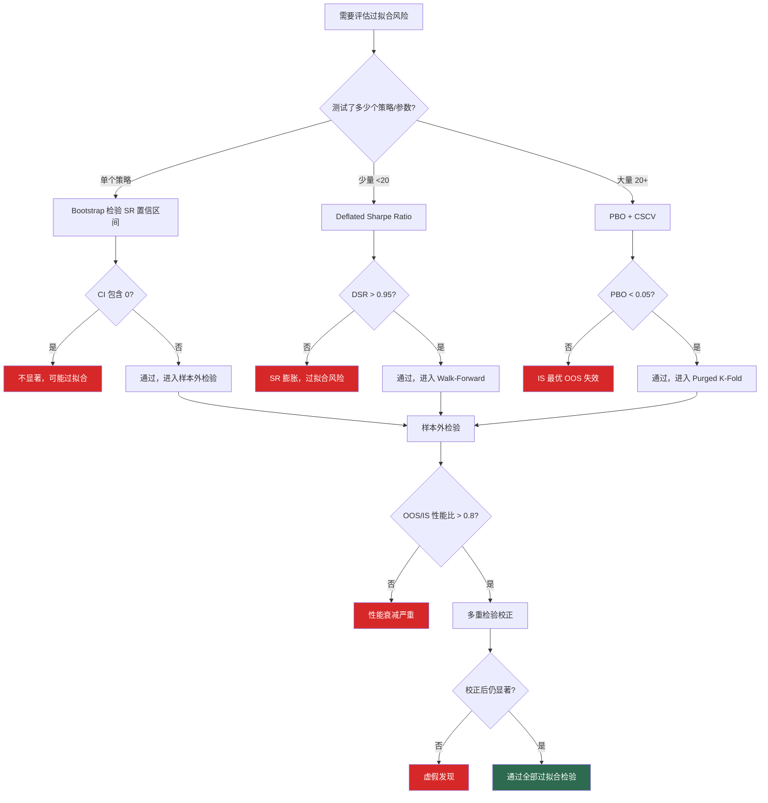

# 策略绩效评估与统计检验

## 核心要点

> [!summary]
> - **绩效评估三层次**：收益指标（年化收益/胜率/盈亏比）-> 风险调整指标（Sharpe/Sortino/Calmar）-> 统计显著性检验（t检验/Bootstrap/FDR校正）
> - **过拟合是量化策略最大威胁**：必须通过 PBO、CSCV、Deflated Sharpe Ratio 量化过拟合概率，PBO > 0.05 即存在过拟合风险
> - **多重假设检验不可忽视**：同时测试多个策略/参数时，必须用 Bonferroni 或 BH-FDR 校正 p 值，否则虚假发现率(False Discovery Rate)将远超预期
> - **样本外检验必须时序感知**：传统 K-Fold 会导致数据泄露，必须使用 Purged K-Fold + Embargo 或 Walk-Forward 分析
> - **A股特殊性**：T+1 制度、涨跌停板、频繁的政策干预使得策略评估需额外关注尾部风险和回撤恢复能力

---

## 一、核心绩效指标

### 1.1 年化收益率（Annualized Return）

$$R_{ann} = \left(\prod_{t=1}^{N}(1 + r_t)\right)^{\frac{252}{N}} - 1$$

- $r_t$：第 $t$ 个交易日的收益率
- $N$：总交易日数
- 252：A股年交易日数（沪深交易所实际约 242-245 天，惯例用 252）

**判断标准**：

| 等级 | 年化收益率 | 说明 |
|------|-----------|------|
| 优秀 | > 20% | 需持续 3 年以上验证 |
| 良好 | 10%-20% | 跑赢沪深300 + 无风险利率 |
| 一般 | 5%-10% | 略高于纯债基金收益 |
| 较差 | < 5% | 不及银行理财 |

### 1.2 年化波动率（Annualized Volatility）

$$\sigma_{ann} = \sigma_{daily} \times \sqrt{252} = \text{std}(r_t) \times \sqrt{252}$$

**判断标准**：A股市场整体波动率约 20%-25%（沪深300），策略波动率 < 15% 为低波动，> 30% 为高波动。

### 1.3 夏普比率（Sharpe Ratio）

$$SR = \frac{R_{ann} - R_f}{\sigma_{ann}}$$

- $R_f$：无风险利率，当前取 1 年期国债收益率约 1.5%-2.0%

**判断标准**：

| 等级 | 夏普比率 | 说明 |
|------|---------|------|
| 卓越 | > 2.0 | 极少见，需警惕过拟合 |
| 优秀 | 1.5-2.0 | 优质量化策略目标 |
| 良好 | 1.0-1.5 | 可接受的风险收益比 |
| 一般 | 0.5-1.0 | 需优化 |
| 较差 | < 0.5 | 风险调整后无吸引力 |

> [!warning] 夏普比率的局限性
> 1. 假设收益正态分布——A股收益存在显著的尖峰厚尾特征
> 2. 对上行波动和下行波动同等惩罚
> 3. 不区分回撤深度与频次
> 4. 受回测周期长度影响，短期回测的 SR 标准误很大

### 1.4 Sortino 比率

$$Sortino = \frac{R_{ann} - R_f}{\sigma_d}$$

$$\sigma_d = \sqrt{\frac{252}{N}\sum_{r_t < 0} r_t^2}$$

- $\sigma_d$：下行偏差（Downside Deviation），仅考虑负收益的波动
- 比 Sharpe 更适合评估非对称收益分布的策略（如趋势跟踪策略）

**判断标准**：Sortino > 2.0 为优秀，> 1.5 为良好。通常 Sortino > Sharpe（因为分母更小）。

### 1.5 Calmar 比率

$$Calmar = \frac{R_{ann}}{|MDD|}$$

- $MDD$：最大回撤（取绝对值）
- 衡量"每承受 1% 的最大回撤能换取多少年化收益"

**判断标准**：Calmar > 2.0 为优秀，> 1.0 为良好，< 0.5 说明回撤控制差。

### 1.6 最大回撤（Maximum Drawdown）

$$MDD = \max_{t \in [0,T]} \left(\frac{\text{Peak}_t - \text{NAV}_t}{\text{Peak}_t}\right)$$

$$\text{Peak}_t = \max_{s \in [0,t]} \text{NAV}_s$$

### 1.7 最大回撤持续时间（Maximum Drawdown Duration）

从净值创新高到恢复到前高的最长时间段（交易日）。

**判断标准**：

| 等级 | MDD | MDD 持续时间 |
|------|-----|-------------|
| 优秀 | < 10% | < 60 个交易日 |
| 良好 | 10%-20% | 60-120 个交易日 |
| 一般 | 20%-30% | 120-250 个交易日 |
| 较差 | > 30% | > 250 个交易日（超过 1 年）|

### 1.8 胜率（Win Rate）

$$\text{Win Rate} = \frac{\text{盈利交易次数}}{\text{总交易次数}} \times 100\%$$

### 1.9 盈亏比（Profit/Loss Ratio）

$$\text{P/L Ratio} = \frac{\text{平均盈利}}{\text{平均亏损}}$$

**胜率 vs 盈亏比的关系**（盈亏平衡条件）：

$$\text{Win Rate}_{BE} = \frac{1}{1 + \text{P/L Ratio}}$$

| 策略类型 | 典型胜率 | 典型盈亏比 | 代表策略 |
|---------|---------|-----------|---------|
| 高胜率低盈亏比 | 60%-80% | 0.5-1.0 | 均值回复、统计套利 |
| 低胜率高盈亏比 | 30%-45% | 2.0-5.0 | CTA 趋势跟踪 |
| 均衡型 | 50%-60% | 1.0-2.0 | 多因子选股 |

### 1.10 月度胜率

$$\text{Monthly Win Rate} = \frac{\text{月度正收益月数}}{\text{总月数}} \times 100\%$$

**判断标准**：月度胜率 > 70% 为优秀，> 60% 为良好。对资金管理人(FOF)配置决策尤为重要。

---

## 二、风险调整收益归因

### 2.1 Brinson 归因模型

Brinson 归因将组合超额收益分解为**三个维度**：资产配置效应、个股选择效应和交互效应。

#### BHB 方案（Brinson-Hood-Beebower, 1986）

$$R_p - R_b = \underbrace{\sum_i (w_{p,i} - w_{b,i}) \cdot R_{b,i}}_{\text{资产配置}} + \underbrace{\sum_i w_{b,i} \cdot (R_{p,i} - R_{b,i})}_{\text{个股选择}} + \underbrace{\sum_i (w_{p,i} - w_{b,i}) \cdot (R_{p,i} - R_{b,i})}_{\text{交互效应}}$$

| 组合 | 权重 | 收益 | 含义 |
|-----|------|------|------|
| 实际组合 | $w_{p,i}$ | $R_{p,i}$ | 组合实际表现 |
| 基准组合 | $w_{b,i}$ | $R_{b,i}$ | 基准表现 |
| 配置虚拟组合 | $w_{p,i}$ | $R_{b,i}$ | 只改权重不改选股 |
| 选择虚拟组合 | $w_{b,i}$ | $R_{p,i}$ | 只改选股不改权重 |

#### BF 方案（Brinson-Fachler, 1985 — 更常用）

将交互效应并入个股选择：

$$R_p - R_b = \underbrace{\sum_i (w_{p,i} - w_{b,i}) \cdot (R_{b,i} - R_b)}_{\text{资产配置}} + \underbrace{\sum_i w_{p,i} \cdot (R_{p,i} - R_{b,i})}_{\text{个股选择（含交互）}}$$

#### 多期 Brinson 归因

单期结果不可简单加总（复利效应），需使用 **GRAP 算法**（Geometric Return Attribution Program）处理多期链接。

#### Python 实现

```python
import numpy as np
import pandas as pd

class BrinsonAttribution:
    """Brinson 绩效归因（BHB + BF 双方案）"""

    def __init__(self, wp, wb, rp, rb):
        """
        wp: 组合各行业权重 (array)
        wb: 基准各行业权重 (array)
        rp: 组合各行业收益率 (array)
        rb: 基准各行业收益率 (array)
        """
        self.wp = np.array(wp)
        self.wb = np.array(wb)
        self.rp = np.array(rp)
        self.rb = np.array(rb)

    def bhb(self):
        """BHB 三维分解"""
        allocation = np.sum((self.wp - self.wb) * self.rb)
        selection = np.sum(self.wb * (self.rp - self.rb))
        interaction = np.sum((self.wp - self.wb) * (self.rp - self.rb))
        total = allocation + selection + interaction
        return {
            '资产配置效应': allocation,
            '个股选择效应': selection,
            '交互效应': interaction,
            '超额收益合计': total
        }

    def bf(self):
        """BF 二维分解（更常用）"""
        rb_total = np.sum(self.wb * self.rb)  # 基准总收益
        allocation = np.sum((self.wp - self.wb) * (self.rb - rb_total))
        selection = np.sum(self.wp * (self.rp - self.rb))
        total = allocation + selection
        return {
            '资产配置效应': allocation,
            '个股选择效应（含交互）': selection,
            '超额收益合计': total
        }

    def detail_by_sector(self):
        """逐行业归因明细"""
        rb_total = np.sum(self.wb * self.rb)
        records = []
        for i in range(len(self.wp)):
            alloc_i = (self.wp[i] - self.wb[i]) * (self.rb[i] - rb_total)
            sel_i = self.wp[i] * (self.rp[i] - self.rb[i])
            records.append({
                '配置效应': alloc_i,
                '选择效应': sel_i,
                '合计': alloc_i + sel_i
            })
        return pd.DataFrame(records)
```

### 2.2 因子归因（Factor Attribution）

基于多因子模型（如 Fama-French 五因子或 Barra CNE6），将策略收益分解为因子收益和特质收益(Alpha)。

$$R_p = \alpha + \sum_{k=1}^{K} \beta_k \cdot F_k + \epsilon$$

| 模型 | 因子 | 适用场景 |
|------|------|---------|
| CAPM | MKT | 单因子，过于简化 |
| Fama-French 三因子 | MKT, SMB, HML | 经典学术模型 |
| Fama-French 五因子 | + RMW, CMA | 加入盈利和投资因子 |
| Barra CNE6 | 10+ 风格因子 + 行业因子 | A股实务标准 |
| 自定义因子模型 | 自研因子 | 针对特定策略 |

```python
import statsmodels.api as sm

def factor_attribution(portfolio_returns, factor_returns, rf=0.0):
    """
    因子归因回归
    portfolio_returns: 策略超额收益序列
    factor_returns: DataFrame, 各因子收益
    """
    excess_returns = portfolio_returns - rf
    X = sm.add_constant(factor_returns)
    model = sm.OLS(excess_returns, X).fit()

    result = {
        'alpha_annualized': model.params['const'] * 252,
        'alpha_tstat': model.tvalues['const'],
        'alpha_pvalue': model.pvalues['const'],
        'r_squared': model.rsquared,
        'adj_r_squared': model.rsquared_adj,
        'factor_betas': model.params.drop('const').to_dict(),
        'factor_tvalues': model.tvalues.drop('const').to_dict()
    }
    return result
```

> [!tip] A股因子归因注意事项
> - 使用 Barra CNE6 做风格归因更贴合A股实际，参见 [[多因子模型构建实战]]
> - Alpha 的 t 统计量 > 2.0 且 p < 0.05 才有统计意义
> - R-squared 过高（> 0.95）可能意味着策略只是因子 beta 暴露，没有真正的 alpha

---

## 三、统计显著性检验

### 3.1 t 检验（策略收益显著性）

检验策略平均收益是否显著异于零：

$$t = \frac{\bar{r}}{\text{SE}(\bar{r})} = \frac{\bar{r}}{s / \sqrt{N}}$$

- $\bar{r}$：日均收益
- $s$：收益标准差
- $N$：观测天数

**夏普比率与 t 统计量的关系**：

$$t = SR \times \sqrt{N / 252}$$

即 SR = 1.0 的策略在 252 个交易日后 $t = 1.0$，需 4 年（1008 天）数据才能达到 $t \approx 2.0$（p < 0.05）。

```python
from scipy import stats

def strategy_t_test(returns, rf_daily=0.0):
    """策略收益 t 检验"""
    excess = returns - rf_daily
    t_stat, p_value = stats.ttest_1samp(excess, 0)
    n = len(returns)
    sharpe_daily = np.mean(excess) / np.std(excess, ddof=1)
    sharpe_annual = sharpe_daily * np.sqrt(252)

    return {
        't_statistic': t_stat,
        'p_value': p_value,
        'p_value_one_tail': p_value / 2,
        'sharpe_annual': sharpe_annual,
        'n_observations': n,
        'significant_5pct': p_value < 0.05,
        'significant_1pct': p_value < 0.01
    }
```

### 3.2 Bootstrap 检验

不依赖正态分布假设，通过重采样构建经验分布：

**算法流程**：
1. 计算原始策略的统计量（如 Sharpe Ratio）$\hat{\theta}$
2. 重复 $B$ 次（通常 $B = 10000$）：有放回抽样 $N$ 个收益率，计算统计量 $\hat{\theta}_b^*$
3. 构建经验分布，计算 p 值和置信区间

$$p = \frac{1}{B}\sum_{b=1}^{B} \mathbf{1}[\hat{\theta}_b^* \leq 0]$$

```python
def bootstrap_test(returns, statistic_func, n_bootstrap=10000,
                   confidence=0.95, seed=42):
    """
    Bootstrap 显著性检验
    statistic_func: 统计量计算函数，如 lambda x: np.mean(x)/np.std(x)*np.sqrt(252)
    """
    np.random.seed(seed)
    observed = statistic_func(returns)
    n = len(returns)

    boot_stats = np.zeros(n_bootstrap)
    for i in range(n_bootstrap):
        sample = np.random.choice(returns, size=n, replace=True)
        boot_stats[i] = statistic_func(sample)

    # p 值：原假设 H0: theta <= 0
    p_value = np.mean(boot_stats <= 0)

    # 置信区间
    alpha = 1 - confidence
    ci_lower = np.percentile(boot_stats, alpha / 2 * 100)
    ci_upper = np.percentile(boot_stats, (1 - alpha / 2) * 100)

    # 标准误
    se = np.std(boot_stats)

    return {
        'observed_statistic': observed,
        'bootstrap_mean': np.mean(boot_stats),
        'bootstrap_se': se,
        'p_value': p_value,
        'ci_lower': ci_lower,
        'ci_upper': ci_upper,
        'significant': ci_lower > 0  # 置信区间不含 0
    }

# 时序 Block Bootstrap（保留自相关结构）
def block_bootstrap_test(returns, statistic_func, block_size=20,
                         n_bootstrap=10000, seed=42):
    """
    分块 Bootstrap：保留收益率时序依赖性
    block_size: 块大小，通常取 sqrt(N) 或 20 个交易日
    """
    np.random.seed(seed)
    observed = statistic_func(returns)
    n = len(returns)
    n_blocks = int(np.ceil(n / block_size))

    boot_stats = np.zeros(n_bootstrap)
    for i in range(n_bootstrap):
        blocks = []
        for _ in range(n_blocks):
            start = np.random.randint(0, n - block_size + 1)
            blocks.append(returns[start:start + block_size])
        sample = np.concatenate(blocks)[:n]
        boot_stats[i] = statistic_func(sample)

    p_value = np.mean(boot_stats <= 0)
    ci_lower = np.percentile(boot_stats, 2.5)
    ci_upper = np.percentile(boot_stats, 97.5)

    return {
        'observed_statistic': observed,
        'p_value': p_value,
        'ci_lower': ci_lower,
        'ci_upper': ci_upper,
        'block_size': block_size
    }
```

### 3.3 多重假设检验（Multiple Hypothesis Testing）

同时检验 $M$ 个策略/参数组合时，虚假发现率急剧上升。

**Bonferroni 校正（控制 FWER）**：

$$\alpha_{adj} = \frac{\alpha}{M}$$

拒绝 $H_0$ 当 $p_i \leq \alpha / M$。特点：**极端保守**，适合策略数量少（< 20）的场景。

**Benjamini-Hochberg 校正（控制 FDR）**：

1. 将 $M$ 个 p 值从小到大排序：$p_{(1)} \leq p_{(2)} \leq \cdots \leq p_{(M)}$
2. 找到最大的 $k$ 使得 $p_{(k)} \leq q \cdot \frac{k}{M}$
3. 拒绝前 $k$ 个假设

- $q$：目标 FDR 水平，通常取 0.05 或 0.10
- 比 Bonferroni 有更高统计功效，**推荐用于大规模策略扫描**

```python
from statsmodels.stats.multitest import multipletests

def multiple_testing_correction(p_values, strategy_names=None, alpha=0.05):
    """
    多重假设检验校正
    同时支持 Bonferroni 和 BH-FDR
    """
    p_values = np.array(p_values)
    m = len(p_values)

    # Bonferroni
    reject_bonf, pvals_bonf, _, _ = multipletests(
        p_values, alpha=alpha, method='bonferroni'
    )

    # Benjamini-Hochberg FDR
    reject_bh, pvals_bh, _, _ = multipletests(
        p_values, alpha=alpha, method='fdr_bh'
    )

    # Holm-Bonferroni（比 Bonferroni 略宽松的 FWER 控制）
    reject_holm, pvals_holm, _, _ = multipletests(
        p_values, alpha=alpha, method='holm'
    )

    results = pd.DataFrame({
        'strategy': strategy_names if strategy_names else range(m),
        'raw_pvalue': p_values,
        'bonferroni_pvalue': pvals_bonf,
        'bonferroni_reject': reject_bonf,
        'bh_fdr_pvalue': pvals_bh,
        'bh_fdr_reject': reject_bh,
        'holm_pvalue': pvals_holm,
        'holm_reject': reject_holm
    }).sort_values('raw_pvalue')

    summary = {
        'total_strategies': m,
        'bonferroni_significant': reject_bonf.sum(),
        'bh_fdr_significant': reject_bh.sum(),
        'holm_significant': reject_holm.sum()
    }

    return results, summary
```

> [!example] 典型场景
> 扫描 1000 个参数组合，其中 50 个 raw p < 0.05。不做校正：认为 50 个显著。做 BH-FDR（q=0.05）：可能只有 5-10 个真正显著。做 Bonferroni：可能仅 1-2 个显著。

---

## 四、过拟合检验方法

### 4.1 PBO — Probability of Backtest Overfitting

**核心思想**：如果在样本内（IS）表现最好的策略在样本外（OOS）表现低于中位数，则存在过拟合。

**算法**（Bailey et al., 2014）：

1. 将 $T$ 期收益矩阵切分为 $S$ 个等长子集
2. 生成所有 $\binom{S}{S/2}$ 种 IS/OOS 组合（CSCV 方法）
3. 对每种组合：
   - 在 IS 中找表现最优的策略 $n^*$
   - 计算 $n^*$ 在 OOS 中的排名 $r_{n^*}$
   - 若 $r_{n^*}$ 低于中位数（即 OOS 排名 < N/2），记为过拟合
4. PBO = 过拟合次数 / 总组合数

$$PBO = \frac{1}{|\Omega|}\sum_{c \in \Omega} \mathbf{1}\left[\text{rank}_{OOS}(n_c^*) \leq \frac{N}{2}\right]$$

**判断标准**：

| PBO 值 | 过拟合风险 | 建议 |
|--------|----------|------|
| < 0.05 | 低 | 可以考虑实盘部署 |
| 0.05-0.25 | 中等 | 需进一步验证 |
| 0.25-0.50 | 高 | 策略可能不可靠 |
| > 0.50 | 极高 | 几乎确定过拟合 |

### 4.2 CSCV — Combinatorially Symmetric Cross-Validation

CSCV 是 PBO 的数据分割方法——无模型假设，通过组合对称分割生成大量 IS/OOS 配对。

**算法**：

1. 将收益矩阵（$T \times N$，$T$ 为时间步，$N$ 为策略数）按时间切为 $S$ 个块
2. 枚举所有从 $S$ 块中选 $S/2$ 块作为 IS 的组合（共 $\binom{S}{S/2}$ 种）
3. 对称地，剩余 $S/2$ 块自动构成 OOS
4. 每次组合中计算 IS 最优策略在 OOS 的表现

**推荐 $S$ 值**：$S = 16$（生成 12870 种组合，统计量充足）

### 4.3 Deflated Sharpe Ratio (DSR)

**核心思想**（Bailey & Lopez de Prado, 2014）：校正因多次试验导致的 Sharpe Ratio 膨胀。

$$DSR = PSR\left[\widehat{SR}^*\right] = \Phi\left(\frac{(\widehat{SR} - \widehat{SR}^*)\sqrt{N-1}}{\sqrt{1 - \hat{\gamma}_3 \cdot \widehat{SR} + \frac{\hat{\gamma}_4 - 1}{4}\widehat{SR}^2}}\right)$$

其中：
- $\widehat{SR}$：观测到的最大夏普比率
- $\widehat{SR}^*$：考虑多次试验后的期望最大 SR（在零假设下）
- $\hat{\gamma}_3$：收益偏度
- $\hat{\gamma}_4$：收益峰度
- $N$：观测数量
- $\Phi$：标准正态 CDF

$$\widehat{SR}^* \approx \sqrt{V[\widehat{SR}]} \cdot \left((1-\gamma)Z^{-1}\left[1 - \frac{1}{M}\right] + \gamma Z^{-1}\left[1 - \frac{1}{M}e^{-1}\right]\right)$$

- $M$：独立试验次数
- $\gamma$：Euler-Mascheroni 常数 $\approx 0.5772$
- $V[\widehat{SR}]$：SR 估计量的方差

**DSR 解读**：DSR 越接近 1，策略越不可能是因多次试验碰巧产生的。**DSR < 0.05 表示策略大概率是过拟合的产物。**

### 4.4 完整 Python 实现

```python
from scipy.stats import norm
from itertools import combinations
import warnings

class OverfitDetector:
    """过拟合检验工具箱：PBO / CSCV / DSR"""

    def __init__(self, returns_matrix):
        """
        returns_matrix: pd.DataFrame, 行=时间步, 列=策略/参数组合
        """
        self.returns = returns_matrix.values
        self.T, self.N = self.returns.shape
        self.strategy_names = returns_matrix.columns.tolist()

    # ---------- CSCV + PBO ----------
    def compute_pbo(self, S=16, metric_func=None, threshold='median'):
        """
        计算 Probability of Backtest Overfitting
        S: 数据切分块数（必须为偶数）
        metric_func: 绩效指标函数，默认为年化夏普
        threshold: 'median' 或具体数值
        """
        if S % 2 != 0:
            raise ValueError("S 必须为偶数")
        if metric_func is None:
            metric_func = lambda x: np.mean(x) / (np.std(x) + 1e-10) * np.sqrt(252)

        # 切分为 S 个块
        block_size = self.T // S
        blocks = []
        for s in range(S):
            start = s * block_size
            end = start + block_size if s < S - 1 else self.T
            blocks.append(self.returns[start:end, :])

        half = S // 2
        combos = list(combinations(range(S), half))

        overfit_count = 0
        is_oos_pairs = []  # (IS 最优 SR, OOS 对应 SR)
        logit_values = []

        for combo in combos:
            oos_indices = [i for i in range(S) if i not in combo]

            # 合并 IS 和 OOS 块
            is_data = np.vstack([blocks[i] for i in combo])
            oos_data = np.vstack([blocks[i] for i in oos_indices])

            # 计算 IS 各策略指标
            is_metrics = np.array([metric_func(is_data[:, j]) for j in range(self.N)])
            oos_metrics = np.array([metric_func(oos_data[:, j]) for j in range(self.N)])

            # IS 最优策略
            best_is = np.argmax(is_metrics)
            best_oos_metric = oos_metrics[best_is]

            # 记录 IS/OOS 配对
            is_oos_pairs.append((is_metrics[best_is], best_oos_metric))

            # 判断是否过拟合
            if threshold == 'median':
                oos_median = np.median(oos_metrics)
                is_overfit = best_oos_metric < oos_median
            else:
                is_overfit = best_oos_metric < threshold

            if is_overfit:
                overfit_count += 1

            # Logit rank
            rank = np.sum(oos_metrics <= best_oos_metric) / self.N
            rank = np.clip(rank, 0.001, 0.999)
            logit_values.append(np.log(rank / (1 - rank)))

        pbo = overfit_count / len(combos)

        return {
            'pbo': pbo,
            'n_combinations': len(combos),
            'overfit_count': overfit_count,
            'is_oos_pairs': is_oos_pairs,
            'logit_distribution': logit_values,
            'degradation': np.mean([p[1] - p[0] for p in is_oos_pairs]),
            'risk_level': (
                '低' if pbo < 0.05 else
                '中等' if pbo < 0.25 else
                '高' if pbo < 0.50 else '极高'
            )
        }

    # ---------- Deflated Sharpe Ratio ----------
    def deflated_sharpe_ratio(self, observed_sr, n_trials, n_obs,
                               skewness=0, kurtosis=3):
        """
        计算 Deflated Sharpe Ratio
        observed_sr: 观测到的最优夏普比率
        n_trials: 总试验次数（参数组合数）
        n_obs: 观测数量
        skewness: 收益偏度
        kurtosis: 收益峰度
        """
        # SR 估计量的方差
        sr_var = (1 - skewness * observed_sr +
                  (kurtosis - 1) / 4 * observed_sr**2) / (n_obs - 1)

        # 期望最大 SR（在零假设下）— 近似公式
        euler_mascheroni = 0.5772156649
        sr_max_expected = np.sqrt(sr_var) * (
            (1 - euler_mascheroni) * norm.ppf(1 - 1.0 / n_trials) +
            euler_mascheroni * norm.ppf(1 - 1.0 / n_trials * np.exp(-1))
        )

        # DSR = PSR[SR*]
        if sr_var > 0:
            dsr = norm.cdf((observed_sr - sr_max_expected) / np.sqrt(sr_var))
        else:
            dsr = 1.0 if observed_sr > sr_max_expected else 0.0

        return {
            'dsr': dsr,
            'observed_sr': observed_sr,
            'expected_max_sr': sr_max_expected,
            'sr_std': np.sqrt(sr_var),
            'n_trials': n_trials,
            'is_significant': dsr > 0.95,
            'interpretation': (
                '策略显著（非过拟合）' if dsr > 0.95 else
                '无法确认显著性' if dsr > 0.50 else
                '大概率过拟合'
            )
        }

    # ---------- Minimum Backtest Length ----------
    @staticmethod
    def min_backtest_length(observed_sr, n_trials, skewness=0, kurtosis=3,
                            alpha=0.05):
        """
        计算达到统计显著所需的最少回测天数
        (MinBTL, Bailey & Lopez de Prado)
        """
        z_alpha = norm.ppf(1 - alpha)
        euler_mascheroni = 0.5772156649
        sr_max_expected_unit = (
            (1 - euler_mascheroni) * norm.ppf(1 - 1.0 / n_trials) +
            euler_mascheroni * norm.ppf(1 - 1.0 / n_trials * np.exp(-1))
        )

        # MinBTL: N 使得 DSR > 0.95
        # 简化：N >= (z_alpha / (SR - E[SR*]))^2 * (1 + ...)
        if observed_sr <= 0:
            return float('inf')

        numerator = (1 - skewness * observed_sr +
                     (kurtosis - 1) / 4 * observed_sr**2)
        denominator = (observed_sr - sr_max_expected_unit)**2

        if denominator <= 0:
            return float('inf')

        min_n = numerator / denominator * z_alpha**2
        return max(int(np.ceil(min_n)), 252)  # 至少一年
```

---

## 五、样本外检验设计

### 5.1 Walk-Forward 分析

将历史数据划分为连续的"训练-测试"窗口，模拟实际交易中的"开发-运行"循环。

**滚动窗口模式**：

```
|-- 训练窗口 (固定长度) --|-- 测试窗口 --|
    |-- 训练窗口 (滚动) --|-- 测试窗口 --|
        |-- 训练窗口 (滚动) --|-- 测试窗口 --|
```

**扩展窗口模式**：

```
|-- 训练窗口 (扩展) --|-- 测试窗口 --|
|---- 训练窗口 (扩展) ----|-- 测试窗口 --|
|------- 训练窗口 (扩展) -------|-- 测试窗口 --|
```

```python
class WalkForwardAnalyzer:
    """Walk-Forward 样本外检验"""

    def __init__(self, returns, train_size=252, test_size=63,
                 expanding=False, step_size=None):
        """
        returns: pd.Series, 日收益率
        train_size: 训练窗口（交易日）
        test_size: 测试窗口（交易日）
        expanding: True=扩展窗口, False=滚动窗口
        step_size: 步进大小，默认等于 test_size
        """
        self.returns = returns
        self.train_size = train_size
        self.test_size = test_size
        self.expanding = expanding
        self.step_size = step_size or test_size

    def generate_splits(self):
        """生成训练/测试时间窗口"""
        n = len(self.returns)
        splits = []
        start = 0

        while start + self.train_size + self.test_size <= n:
            if self.expanding:
                train_start = 0
            else:
                train_start = start

            train_end = start + self.train_size
            test_end = min(train_end + self.test_size, n)

            splits.append({
                'train': (train_start, train_end),
                'test': (train_end, test_end)
            })
            start += self.step_size

        return splits

    def evaluate(self, strategy_func, metric_func=None):
        """
        对每个窗口执行策略并评估
        strategy_func(train_data) -> model/params
        metric_func(test_returns) -> float
        """
        if metric_func is None:
            metric_func = lambda x: np.mean(x) / (np.std(x) + 1e-10) * np.sqrt(252)

        splits = self.generate_splits()
        results = []

        for i, split in enumerate(splits):
            train_data = self.returns.iloc[split['train'][0]:split['train'][1]]
            test_data = self.returns.iloc[split['test'][0]:split['test'][1]]

            # 训练阶段（用户自定义策略逻辑）
            model = strategy_func(train_data)

            # 测试阶段
            oos_metric = metric_func(test_data)
            is_metric = metric_func(train_data)

            results.append({
                'fold': i,
                'train_start': self.returns.index[split['train'][0]],
                'train_end': self.returns.index[split['train'][1] - 1],
                'test_start': self.returns.index[split['test'][0]],
                'test_end': self.returns.index[split['test'][1] - 1],
                'is_metric': is_metric,
                'oos_metric': oos_metric,
                'degradation': oos_metric - is_metric
            })

        results_df = pd.DataFrame(results)

        summary = {
            'n_folds': len(results),
            'avg_is_metric': results_df['is_metric'].mean(),
            'avg_oos_metric': results_df['oos_metric'].mean(),
            'avg_degradation': results_df['degradation'].mean(),
            'oos_positive_pct': (results_df['oos_metric'] > 0).mean(),
            'degradation_ratio': (
                results_df['oos_metric'].mean() /
                (results_df['is_metric'].mean() + 1e-10)
            )
        }

        return results_df, summary
```

### 5.2 Purged K-Fold 交叉验证

**核心改进**：在标准 K-Fold 基础上增加 Purging（清除）和 Embargo（隔离），防止时序数据的信息泄露。

- **Purging**：移除训练集中与测试集标签时间重叠的样本
- **Embargo**：在训练集和测试集之间插入缓冲期，消除序列自相关的影响

```python
class PurgedKFoldCV:
    """
    Purged K-Fold 交叉验证
    适用于时间序列数据，防止前视偏差
    """

    def __init__(self, n_splits=5, purge_window=5, embargo_pct=0.01):
        """
        n_splits: 折数
        purge_window: 清除窗口（交易日）
        embargo_pct: 隔离期占比
        """
        self.n_splits = n_splits
        self.purge_window = purge_window
        self.embargo_pct = embargo_pct

    def split(self, X, y=None, timestamps=None):
        """
        生成训练/测试索引
        X: 特征矩阵
        timestamps: 时间索引（用于排序）
        """
        n = len(X)
        embargo_size = max(1, int(n * self.embargo_pct))
        indices = np.arange(n)
        fold_size = n // self.n_splits

        for i in range(self.n_splits):
            test_start = i * fold_size
            test_end = min((i + 1) * fold_size, n)
            test_idx = indices[test_start:test_end]

            # 训练集：排除测试集 + purge 窗口 + embargo 期
            purge_start = max(0, test_start - self.purge_window)
            embargo_end = min(n, test_end + embargo_size)

            excluded = set(range(purge_start, embargo_end))
            train_idx = np.array([j for j in indices if j not in excluded])

            yield train_idx, test_idx

    def get_n_splits(self):
        return self.n_splits


class CombinatorialPurgedCV:
    """
    组合清洗交叉验证 (Combinatorial Purged Cross-Validation)
    生成 C(S, S/2) 种 IS/OOS 组合，用于 PBO 计算
    """

    def __init__(self, n_groups=16, purge_window=5, embargo_pct=0.01):
        self.n_groups = n_groups
        self.purge_window = purge_window
        self.embargo_pct = embargo_pct

    def split(self, X):
        n = len(X)
        embargo_size = max(1, int(n * self.embargo_pct))
        group_size = n // self.n_groups
        half = self.n_groups // 2

        # 为每个样本分配组
        group_ids = np.repeat(np.arange(self.n_groups), group_size)
        if len(group_ids) < n:
            group_ids = np.concatenate([group_ids,
                np.full(n - len(group_ids), self.n_groups - 1)])

        for test_combo in combinations(range(self.n_groups), half):
            test_groups = set(test_combo)
            test_idx = np.where(np.isin(group_ids, list(test_groups)))[0]

            # Purge + Embargo
            test_min, test_max = test_idx.min(), test_idx.max()
            purge_start = max(0, test_min - self.purge_window)
            embargo_end = min(n, test_max + embargo_size + 1)

            excluded = set(range(purge_start, embargo_end))
            all_test = set(test_idx.tolist())
            excluded = excluded | all_test

            train_idx = np.array([j for j in range(n) if j not in excluded])

            yield train_idx, test_idx
```

---

## 六、参数速查表

### 绩效指标判断标准

| 指标 | 优秀 | 良好 | 一般 | 较差 |
|------|------|------|------|------|
| 年化收益率 | > 20% | 10%-20% | 5%-10% | < 5% |
| 年化波动率 | < 10% | 10%-15% | 15%-25% | > 25% |
| 夏普比率 | > 1.5 | 1.0-1.5 | 0.5-1.0 | < 0.5 |
| Sortino 比率 | > 2.0 | 1.5-2.0 | 1.0-1.5 | < 1.0 |
| Calmar 比率 | > 2.0 | 1.0-2.0 | 0.5-1.0 | < 0.5 |
| 最大回撤 | < 10% | 10%-20% | 20%-30% | > 30% |
| MDD 持续时间 | < 60 天 | 60-120 天 | 120-250 天 | > 250 天 |
| 月度胜率 | > 70% | 60%-70% | 50%-60% | < 50% |
| 日胜率 | > 55% | 50%-55% | 45%-50% | < 45% |

### 统计检验判断标准

| 检验方法 | 通过标准 | 需警惕 | 不通过 |
|---------|---------|--------|-------|
| t 检验 p 值 | < 0.01 | 0.01-0.05 | > 0.05 |
| Bootstrap CI | 不含 0 | 接近 0 | 含 0 |
| PBO | < 0.05 | 0.05-0.25 | > 0.25 |
| DSR | > 0.95 | 0.50-0.95 | < 0.50 |
| WF 衰减比 | > 0.80 | 0.50-0.80 | < 0.50 |

### 多重检验方法选择

| 场景 | 推荐方法 | 原因 |
|------|---------|------|
| 策略数 < 20 | Bonferroni | 保守可靠 |
| 策略数 20-100 | Holm-Bonferroni | 比 Bonferroni 功效更高 |
| 策略数 > 100 | BH-FDR | 控制发现率而非家族错误率 |
| 因子挖掘（千级） | BH-FDR (q=0.05) | 平衡发现与误判 |

---

## 七、评估流程图

### 策略评估完整流程



### 过拟合检验决策树



---

## 八、StrategyEvaluator 完整类

```python
import numpy as np
import pandas as pd
from scipy import stats
from scipy.stats import norm
from statsmodels.stats.multitest import multipletests
from itertools import combinations
import warnings


class StrategyEvaluator:
    """
    A股量化策略绩效评估与统计检验完整工具类

    功能：
    1. 核心绩效指标计算
    2. Brinson 归因
    3. 因子归因
    4. 统计显著性检验（t检验/Bootstrap/多重假设检验）
    5. 过拟合检验（PBO/CSCV/DSR）
    6. 样本外检验（Walk-Forward/Purged K-Fold）
    """

    def __init__(self, returns, benchmark_returns=None, rf_annual=0.02):
        """
        Parameters
        ----------
        returns : pd.Series
            策略日收益率序列，index 为日期
        benchmark_returns : pd.Series, optional
            基准日收益率序列
        rf_annual : float
            无风险年化利率，默认 2%
        """
        self.returns = returns.dropna()
        self.benchmark = benchmark_returns
        self.rf_annual = rf_annual
        self.rf_daily = (1 + rf_annual) ** (1 / 252) - 1
        self.n_days = len(self.returns)

    # ========================
    # 1. 核心绩效指标
    # ========================

    def performance_metrics(self):
        """计算全部核心绩效指标"""
        r = self.returns
        cum = (1 + r).cumprod()

        # 年化收益率
        total_return = cum.iloc[-1] / cum.iloc[0] - 1 if cum.iloc[0] != 0 else 0
        ann_return = (1 + total_return) ** (252 / self.n_days) - 1

        # 年化波动率
        ann_vol = r.std() * np.sqrt(252)

        # 夏普比率
        sharpe = (ann_return - self.rf_annual) / ann_vol if ann_vol > 0 else 0

        # Sortino 比率
        downside = r[r < 0]
        downside_std = np.sqrt(np.mean(downside**2)) * np.sqrt(252) if len(downside) > 0 else 1e-10
        sortino = (ann_return - self.rf_annual) / downside_std

        # 最大回撤
        peak = cum.expanding().max()
        drawdown = (cum - peak) / peak
        mdd = drawdown.min()

        # 最大回撤持续时间
        is_underwater = drawdown < 0
        underwater_periods = []
        current_length = 0
        for underwater in is_underwater:
            if underwater:
                current_length += 1
            else:
                if current_length > 0:
                    underwater_periods.append(current_length)
                current_length = 0
        if current_length > 0:
            underwater_periods.append(current_length)
        mdd_duration = max(underwater_periods) if underwater_periods else 0

        # Calmar 比率
        calmar = ann_return / abs(mdd) if mdd != 0 else np.inf

        # 胜率 & 盈亏比
        wins = r[r > 0]
        losses = r[r < 0]
        win_rate = len(wins) / len(r) if len(r) > 0 else 0
        avg_win = wins.mean() if len(wins) > 0 else 0
        avg_loss = abs(losses.mean()) if len(losses) > 0 else 1e-10
        profit_loss_ratio = avg_win / avg_loss

        # 月度胜率
        monthly_returns = r.resample('ME').apply(lambda x: (1 + x).prod() - 1)
        monthly_win_rate = (monthly_returns > 0).mean()

        return {
            '年化收益率': ann_return,
            '年化波动率': ann_vol,
            '夏普比率': sharpe,
            'Sortino比率': sortino,
            'Calmar比率': calmar,
            '最大回撤': mdd,
            '最大回撤持续时间(天)': mdd_duration,
            '日胜率': win_rate,
            '盈亏比': profit_loss_ratio,
            '月度胜率': monthly_win_rate,
            '累计收益率': total_return,
            '交易天数': self.n_days,
            '偏度': r.skew(),
            '峰度': r.kurtosis() + 3  # excess kurtosis -> raw kurtosis
        }

    # ========================
    # 2. 统计检验
    # ========================

    def t_test(self):
        """策略收益 t 检验（H0: 平均超额收益 = 0）"""
        excess = self.returns - self.rf_daily
        t_stat, p_value = stats.ttest_1samp(excess, 0)
        return {
            't_statistic': t_stat,
            'p_value_two_tail': p_value,
            'p_value_one_tail': p_value / 2,
            'significant_5pct': p_value < 0.05,
            'significant_1pct': p_value < 0.01
        }

    def bootstrap_sharpe(self, n_bootstrap=10000, confidence=0.95,
                          block_size=None, seed=42):
        """
        Bootstrap 夏普比率显著性检验
        block_size: 若不为 None，使用 Block Bootstrap
        """
        np.random.seed(seed)
        r = self.returns.values
        n = len(r)

        def calc_sharpe(x):
            return np.mean(x - self.rf_daily) / (np.std(x, ddof=1) + 1e-10) * np.sqrt(252)

        observed_sr = calc_sharpe(r)
        boot_srs = np.zeros(n_bootstrap)

        if block_size is None:
            # IID Bootstrap
            for i in range(n_bootstrap):
                sample = np.random.choice(r, size=n, replace=True)
                boot_srs[i] = calc_sharpe(sample)
        else:
            # Block Bootstrap
            n_blocks = int(np.ceil(n / block_size))
            for i in range(n_bootstrap):
                blocks = []
                for _ in range(n_blocks):
                    start = np.random.randint(0, n - block_size + 1)
                    blocks.append(r[start:start + block_size])
                sample = np.concatenate(blocks)[:n]
                boot_srs[i] = calc_sharpe(sample)

        alpha = 1 - confidence
        ci_lower = np.percentile(boot_srs, alpha / 2 * 100)
        ci_upper = np.percentile(boot_srs, (1 - alpha / 2) * 100)
        p_value = np.mean(boot_srs <= 0)

        return {
            'observed_sharpe': observed_sr,
            'bootstrap_mean': np.mean(boot_srs),
            'bootstrap_se': np.std(boot_srs),
            'p_value': p_value,
            'ci_lower': ci_lower,
            'ci_upper': ci_upper,
            'significant': ci_lower > 0,
            'block_size': block_size
        }

    @staticmethod
    def multiple_testing(p_values, strategy_names=None, alpha=0.05):
        """
        多重假设检验校正
        返回 Bonferroni / Holm / BH-FDR 三种校正结果
        """
        p_values = np.array(p_values)
        m = len(p_values)
        names = strategy_names if strategy_names else [f'策略{i}' for i in range(m)]

        reject_bonf, pvals_bonf, _, _ = multipletests(p_values, alpha=alpha, method='bonferroni')
        reject_holm, pvals_holm, _, _ = multipletests(p_values, alpha=alpha, method='holm')
        reject_bh, pvals_bh, _, _ = multipletests(p_values, alpha=alpha, method='fdr_bh')

        df = pd.DataFrame({
            '策略': names,
            '原始p值': p_values,
            'Bonferroni校正p值': pvals_bonf,
            'Bonferroni显著': reject_bonf,
            'Holm校正p值': pvals_holm,
            'Holm显著': reject_holm,
            'BH-FDR校正p值': pvals_bh,
            'BH-FDR显著': reject_bh,
        }).sort_values('原始p值')

        return df

    # ========================
    # 3. 过拟合检验
    # ========================

    @staticmethod
    def compute_pbo(returns_matrix, S=16, metric_func=None):
        """
        PBO (Probability of Backtest Overfitting) via CSCV

        Parameters
        ----------
        returns_matrix : pd.DataFrame
            行=时间步, 列=策略/参数组合
        S : int
            数据分块数（偶数）
        metric_func : callable
            绩效指标函数，默认年化 Sharpe
        """
        data = returns_matrix.values
        T, N = data.shape

        if metric_func is None:
            metric_func = lambda x: np.mean(x) / (np.std(x) + 1e-10) * np.sqrt(252)

        block_size = T // S
        blocks = [data[s * block_size:(s + 1) * block_size if s < S - 1 else T, :]
                  for s in range(S)]

        half = S // 2
        combos = list(combinations(range(S), half))

        overfit_count = 0
        is_oos_pairs = []

        for combo in combos:
            oos_idx = [i for i in range(S) if i not in combo]
            is_data = np.vstack([blocks[i] for i in combo])
            oos_data = np.vstack([blocks[i] for i in oos_idx])

            is_metrics = np.array([metric_func(is_data[:, j]) for j in range(N)])
            oos_metrics = np.array([metric_func(oos_data[:, j]) for j in range(N)])

            best_is = np.argmax(is_metrics)
            best_oos = oos_metrics[best_is]
            oos_median = np.median(oos_metrics)

            is_oos_pairs.append((is_metrics[best_is], best_oos))
            if best_oos < oos_median:
                overfit_count += 1

        pbo = overfit_count / len(combos)
        return {
            'pbo': pbo,
            'n_combinations': len(combos),
            'overfit_count': overfit_count,
            'avg_degradation': np.mean([p[1] - p[0] for p in is_oos_pairs]),
            'risk_level': '低' if pbo < 0.05 else '中等' if pbo < 0.25 else '高' if pbo < 0.5 else '极高'
        }

    @staticmethod
    def deflated_sharpe_ratio(observed_sr, n_trials, n_obs,
                               skewness=0, kurtosis=3):
        """
        Deflated Sharpe Ratio

        Parameters
        ----------
        observed_sr : float
            观测到的最优年化夏普比率
        n_trials : int
            总试验/参数组合数
        n_obs : int
            观测数量（交易日数）
        skewness : float
            收益偏度
        kurtosis : float
            收益峰度（原始峰度，正态=3）
        """
        sr_var = (1 - skewness * observed_sr +
                  (kurtosis - 1) / 4 * observed_sr**2) / (n_obs - 1)

        euler = 0.5772156649
        sr_max_expected = np.sqrt(sr_var) * (
            (1 - euler) * norm.ppf(1 - 1.0 / max(n_trials, 2)) +
            euler * norm.ppf(1 - 1.0 / max(n_trials, 2) * np.exp(-1))
        )

        dsr = norm.cdf((observed_sr - sr_max_expected) / np.sqrt(max(sr_var, 1e-10)))

        return {
            'dsr': dsr,
            'observed_sr': observed_sr,
            'expected_max_sr': sr_max_expected,
            'n_trials': n_trials,
            'is_significant': dsr > 0.95,
            'interpretation': '非过拟合' if dsr > 0.95 else '不确定' if dsr > 0.5 else '大概率过拟合'
        }

    # ========================
    # 4. 样本外检验
    # ========================

    def walk_forward(self, strategy_func, train_size=252, test_size=63,
                     expanding=False, metric_func=None):
        """
        Walk-Forward 样本外检验

        Parameters
        ----------
        strategy_func : callable
            strategy_func(train_returns) -> 无副作用，返回任意对象
        train_size : int
            训练窗口大小（交易日）
        test_size : int
            测试窗口大小
        expanding : bool
            是否使用扩展窗口
        """
        if metric_func is None:
            metric_func = lambda x: np.mean(x) / (np.std(x) + 1e-10) * np.sqrt(252)

        r = self.returns
        n = len(r)
        results = []
        start = 0

        while start + train_size + test_size <= n:
            train_start = 0 if expanding else start
            train_end = start + train_size
            test_end = min(train_end + test_size, n)

            train_r = r.iloc[train_start:train_end]
            test_r = r.iloc[train_end:test_end]

            strategy_func(train_r)  # 训练

            results.append({
                'is_metric': metric_func(train_r.values),
                'oos_metric': metric_func(test_r.values)
            })
            start += test_size

        df = pd.DataFrame(results)
        avg_is = df['is_metric'].mean()
        avg_oos = df['oos_metric'].mean()

        return {
            'n_folds': len(results),
            'avg_is_sharpe': avg_is,
            'avg_oos_sharpe': avg_oos,
            'degradation_ratio': avg_oos / (avg_is + 1e-10),
            'oos_positive_pct': (df['oos_metric'] > 0).mean(),
            'detail': df
        }

    def purged_kfold(self, strategy_func, n_splits=5, purge_window=5,
                     embargo_pct=0.01, metric_func=None):
        """
        Purged K-Fold 交叉验证
        """
        if metric_func is None:
            metric_func = lambda x: np.mean(x) / (np.std(x) + 1e-10) * np.sqrt(252)

        r = self.returns
        n = len(r)
        embargo_size = max(1, int(n * embargo_pct))
        fold_size = n // n_splits
        results = []

        for i in range(n_splits):
            test_start = i * fold_size
            test_end = min((i + 1) * fold_size, n)

            purge_start = max(0, test_start - purge_window)
            embargo_end = min(n, test_end + embargo_size)

            excluded = set(range(purge_start, embargo_end))
            train_idx = [j for j in range(n) if j not in excluded]

            train_r = r.iloc[train_idx]
            test_r = r.iloc[test_start:test_end]

            strategy_func(train_r)

            results.append({
                'fold': i,
                'is_metric': metric_func(train_r.values),
                'oos_metric': metric_func(test_r.values)
            })

        df = pd.DataFrame(results)
        avg_is = df['is_metric'].mean()
        avg_oos = df['oos_metric'].mean()

        return {
            'n_folds': n_splits,
            'avg_is_sharpe': avg_is,
            'avg_oos_sharpe': avg_oos,
            'degradation_ratio': avg_oos / (avg_is + 1e-10),
            'oos_positive_pct': (df['oos_metric'] > 0).mean(),
            'detail': df
        }

    # ========================
    # 5. 综合报告
    # ========================

    def full_report(self):
        """生成完整评估报告"""
        report = {}
        report['绩效指标'] = self.performance_metrics()
        report['t检验'] = self.t_test()
        report['Bootstrap检验'] = self.bootstrap_sharpe(n_bootstrap=5000)

        print("=" * 60)
        print("           策略绩效评估综合报告")
        print("=" * 60)

        metrics = report['绩效指标']
        print(f"\n【核心绩效】")
        print(f"  年化收益率:  {metrics['年化收益率']:.2%}")
        print(f"  年化波动率:  {metrics['年化波动率']:.2%}")
        print(f"  夏普比率:    {metrics['夏普比率']:.3f}")
        print(f"  Sortino比率: {metrics['Sortino比率']:.3f}")
        print(f"  Calmar比率:  {metrics['Calmar比率']:.3f}")
        print(f"  最大回撤:    {metrics['最大回撤']:.2%}")
        print(f"  MDD持续:     {metrics['最大回撤持续时间(天)']} 天")
        print(f"  日胜率:      {metrics['日胜率']:.2%}")
        print(f"  盈亏比:      {metrics['盈亏比']:.3f}")
        print(f"  月度胜率:    {metrics['月度胜率']:.2%}")

        t = report['t检验']
        print(f"\n【统计显著性】")
        print(f"  t统计量:     {t['t_statistic']:.3f}")
        print(f"  p值(双尾):   {t['p_value_two_tail']:.4f}")
        print(f"  5%显著:      {'是' if t['significant_5pct'] else '否'}")

        bs = report['Bootstrap检验']
        print(f"\n【Bootstrap 夏普比率】")
        print(f"  观测SR:      {bs['observed_sharpe']:.3f}")
        print(f"  95% CI:      [{bs['ci_lower']:.3f}, {bs['ci_upper']:.3f}]")
        print(f"  p值:         {bs['p_value']:.4f}")
        print(f"  显著:        {'是' if bs['significant'] else '否'}")

        print("=" * 60)
        return report
```

---

## 九、常见误区

> [!danger] 十大常见误区

1. **只看年化收益率不看风险指标**：30% 年化 + 50% 回撤的策略不如 15% 年化 + 10% 回撤
2. **用短期回测评估策略**：SR = 1.5 的策略需至少 4 年数据才能在 5% 水平下显著（$t = SR \times \sqrt{N/252} \geq 2$）
3. **忽略多重假设检验**：测试 100 个参数组合，5 个 p < 0.05 是预期之内的随机结果
4. **样本内外不分离**：所有历史数据都用于参数优化，没有留出真正的样本外
5. **用标准 K-Fold 处理时序数据**：导致"未来信息泄露"，必须使用 Purged K-Fold 或 Walk-Forward
6. **Sharpe Ratio 幸存者偏差**：只展示回测最好的一条曲线，忽略了尝试过的所有失败参数
7. **忽略交易成本和滑点**：A股印花税 0.05%（卖出）+ 佣金 0.025%（双向）+ 冲击成本，高频交易影响巨大
8. **将 Calmar 比率用于短期评估**：Calmar 使用最大回撤，短期内可能尚未经历极端行情，比率虚高
9. **混淆 Sortino 与 Sharpe 的判断标准**：Sortino 分母更小，数值通常大于 Sharpe，不能用同一标准评判
10. **不做 Block Bootstrap**：A股收益存在自相关，IID Bootstrap 低估了 SR 的标准误

---

## 十、关联笔记

- [[A股多因子选股策略开发全流程]] — 多因子策略评估实例
- [[因子评估方法论]] — 因子 IC/IR 等评估指标，与策略评估互补
- [[多因子模型构建实战]] — Barra CNE6 因子归因的基础
- [[A股统计套利与配对交易策略]] — 配对策略的统计检验应用
- [[A股CTA与趋势跟踪策略]] — 低胜率高盈亏比策略的评估特点
- [[A股事件驱动策略]] — 事件驱动策略的样本外检验设计
- [[A股量化交易平台深度对比]] — 各平台内置的回测评估功能对比
- [[A股交易制度全解析]] — T+1/涨跌停等制度对绩效评估的影响
- [[A股指数体系与基准构建]] — Brinson 归因的基准选择
- [[A股机器学习量化策略]] — ML策略过拟合检测PBO/CSCV与样本外验证
- [[A股可转债量化策略]] — 可转债策略绩效评估的特殊指标

---

## 来源参考

1. Bailey, D. H., Borwein, J. M., Lopez de Prado, M., & Zhu, Q. J. (2014). *The Probability of Backtest Overfitting*. Journal of Computational Finance.
2. Bailey, D. H., & Lopez de Prado, M. (2014). *The Deflated Sharpe Ratio: Correcting for Selection Bias, Backtest Overfitting and Non-Normality*. Journal of Portfolio Management.
3. Brinson, G. P., Hood, L. R., & Beebower, G. L. (1986). *Determinants of Portfolio Performance*. Financial Analysts Journal.
4. Benjamini, Y., & Hochberg, Y. (1995). *Controlling the False Discovery Rate*. Journal of the Royal Statistical Society.
5. Lopez de Prado, M. (2018). *Advances in Financial Machine Learning*. Wiley. — PBO/CSCV/Purged K-Fold 的权威参考
6. Harvey, C. R., Liu, Y., & Zhu, H. (2016). *...and the Cross-Section of Expected Returns*. Review of Financial Studies. — 多重假设检验在因子研究中的应用
7. pypbo 库：https://github.com/esvhd/pypbo — PBO/CSCV/DSR 的 Python 实现
8. skfolio 库：https://skfolio.org — Combinatorial Purged CV 的生产级实现
9. statsmodels `multipletests`：https://www.statsmodels.org/dev/generated/statsmodels.stats.multitest.multipletests.html
