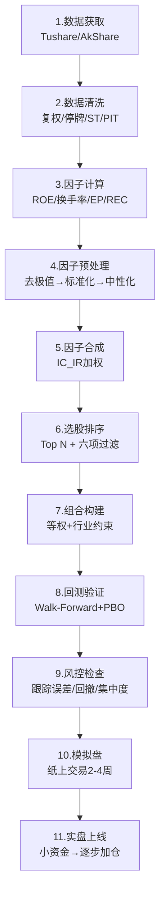

# 量化策略全流程实战案例

> - 本篇以**中证500指数增强策略**为载体，展示从数据获取→因子计算→策略构建→回测→风控→模拟盘的完整可运行Pipeline
> - 目标：年化超额收益8-15%、跟踪误差5-8%、信息比率IR>1.5、最大超额回撤<8%
> - 核心因子组合：ROE(盈利) + 换手率(反转) + EP(价值) + 分析师预期修正(另类)，IC_IR加权合成
> - A股回测必备六项过滤：ST剔除/次新股≥250日/停牌剔除/涨跌停不可交易/流动性≥5000万/北交所过滤
> - 实盘预期收益 ≈ 回测收益 × 0.5（含隐性成本、执行差异、流动性约束）

---

## 一、策略概述

| 维度 | 设定 |
|------|------|
| 基准 | 中证500指数(000905) |
| 股池 | 中证500成分股 + 备选池(中证800-中证500) |
| 因子 | ROE/换手率/EP/分析师REC，IC_IR加权 |
| 调仓 | 月度，每月最后一个交易日 |
| 持仓 | 80-150只 |
| 约束 | 行业偏离±5%、单股≤2%、跟踪误差<8% |
| 成本 | 单边0.3%（佣金万2+印花税千0.5+滑点0.15%） |

---

## 二、完整Pipeline



## 三、Step 1-3: 数据与因子

```python
import pandas as pd
import numpy as np
import akshare as ak

class DataPipeline:
    """数据获取与清洗"""
    
    def get_index_components(self, index_code='000905', date='20251231'):
        """获取中证500成分股"""
        # 使用AkShare获取
        df = ak.index_stock_cons_csindex(symbol=index_code)
        return df['成分券代码'].tolist()
    
    def get_daily_data(self, stock_list, start_date, end_date):
        """获取日线数据（含复权因子）"""
        # 实际项目中用Tushare Pro或Wind
        # 这里用AkShare示意
        all_data = []
        for stock in stock_list:
            try:
                df = ak.stock_zh_a_hist(
                    symbol=stock, period='daily',
                    start_date=start_date, end_date=end_date,
                    adjust='hfq'  # 后复权
                )
                df['stock_code'] = stock
                all_data.append(df)
            except Exception:
                continue
        return pd.concat(all_data, ignore_index=True)


class FactorCalculator:
    """因子计算"""
    
    def calc_roe(self, financial_data):
        """ROE = 归母净利润TTM / 平均归母净资产"""
        roe = (financial_data['net_profit_ttm'] / 
               financial_data['equity_avg'])
        return roe
    
    def calc_turnover(self, daily_data, window=20):
        """20日换手率（反向因子）"""
        turnover = daily_data.groupby('stock_code')['turnover_rate'].transform(
            lambda x: x.rolling(window).mean()
        )
        return -turnover  # 反向：低换手率更好
    
    def calc_ep(self, financial_data):
        """EP = 扣非净利润TTM / 总市值"""
        ep = (financial_data['deducted_profit_ttm'] / 
              financial_data['total_mv'])
        return ep
    
    def calc_analyst_rec(self, analyst_data):
        """分析师一致预期修正"""
        # REC = (当前一致预期EPS - 30天前) / |30天前|
        rec = ((analyst_data['consensus_eps'] - 
                analyst_data['consensus_eps_30d_ago']) / 
               analyst_data['consensus_eps_30d_ago'].abs().clip(lower=0.01))
        return rec
```

## 四、Step 4-5: 预处理与合成

```python
class FactorPreprocessor:
    """因子预处理Pipeline"""
    
    def winsorize_mad(self, series, n=5):
        """MAD去极值"""
        median = series.median()
        mad = (series - median).abs().median() * 1.4826
        lower = median - n * mad
        upper = median + n * mad
        return series.clip(lower, upper)
    
    def standardize(self, series):
        """Z-Score标准化"""
        return (series - series.mean()) / series.std()
    
    def neutralize(self, factor, market_cap, industry_dummies):
        """市值+行业中性化"""
        import statsmodels.api as sm
        X = pd.concat([np.log(market_cap), industry_dummies], axis=1)
        X = sm.add_constant(X)
        model = sm.OLS(factor, X, missing='drop').fit()
        return model.resid
    
    def pipeline(self, factor_df, market_cap, industry):
        """完整预处理流程"""
        result = factor_df.copy()
        for col in result.columns:
            # 1. 去极值
            result[col] = self.winsorize_mad(result[col])
            # 2. 标准化
            result[col] = self.standardize(result[col])
            # 3. 中性化
            result[col] = self.neutralize(
                result[col], market_cap, industry)
        return result


class FactorComposite:
    """IC_IR加权因子合成"""
    
    def __init__(self, lookback=12):
        self.lookback = lookback
    
    def calc_ic_ir_weights(self, ic_history):
        """
        ic_history: DataFrame (date x factor_name) 月度IC
        返回因子权重
        """
        recent = ic_history.tail(self.lookback)
        ic_mean = recent.mean()
        ic_std = recent.std()
        ic_ir = ic_mean / ic_std.clip(lower=0.01)
        
        # 归一化权重
        weights = ic_ir.abs() / ic_ir.abs().sum()
        # 保持符号
        weights = weights * np.sign(ic_ir)
        return weights
    
    def composite(self, factors_df, weights):
        """加权合成"""
        return (factors_df * weights).sum(axis=1)
```

## 五、Step 6-7: 选股与组合

```python
class StockSelector:
    """选股与组合构建"""
    
    def apply_filters(self, stock_pool, daily_data, date):
        """A股六项过滤"""
        filtered = stock_pool.copy()
        
        # 1. ST/*ST过滤
        filtered = filtered[~filtered['is_st']]
        
        # 2. 次新股过滤（上市≥250个交易日）
        filtered = filtered[filtered['list_days'] >= 250]
        
        # 3. 停牌过滤
        filtered = filtered[~filtered['is_suspended']]
        
        # 4. 涨跌停过滤（涨停不可买入，跌停不可卖出）
        filtered = filtered[~filtered['is_limit_up']]
        
        # 5. 流动性过滤
        filtered = filtered[filtered['adv_20d'] >= 5000_0000]
        
        # 6. 北交所/B股过滤
        filtered = filtered[
            ~filtered['stock_code'].str.startswith(('8', '9', '2'))
        ]
        
        return filtered
    
    def select_top_n(self, composite_score, n=100):
        """选取得分最高的N只"""
        return composite_score.nlargest(n).index.tolist()
    
    def build_portfolio(self, selected_stocks, 
                        index_weights, 
                        max_stock_weight=0.02,
                        max_industry_deviation=0.05):
        """等权+行业约束组合"""
        n = len(selected_stocks)
        weights = pd.Series(1.0 / n, index=selected_stocks)
        
        # 行业约束：偏离基准不超过5%
        # (简化版，实际用cvxpy优化)
        return weights
```

## 六、Step 8: 回测结果模板

### 预期绩效参考

| 指标 | 目标 | 参考区间 |
|------|------|---------|
| 年化超额收益 | 8-15% | 中证500增强历史中位数 |
| 跟踪误差 | 5-8% | 行业标准 |
| 信息比率(IR) | >1.5 | IR=超额/TE |
| 超额最大回撤 | <8% | 单年度 |
| 月度胜率 | >60% | 超额>0的月占比 |
| 年换手率 | 12-18倍 | 月度调仓 |
| 年化交易成本 | 3.6-5.4% | 单边0.3%×换手率 |

## 七、Step 9-10: 风控与上线

### 上线检查清单

- [ ] Walk-Forward OOS/IS > 0.80
- [ ] PBO < 0.25
- [ ] 参数稳定性 CV < 30%
- [ ] 模拟盘运行 ≥ 2周
- [ ] 模拟盘超额 vs 回测超额偏差 < 50%
- [ ] 日均成交额覆盖率 > 95%
- [ ] 最大单股持仓 < 2%
- [ ] 最大行业偏离 < 5%

---

## 八、相关笔记

- [[A股多因子选股策略开发全流程]] — 多因子策略构建方法论
- [[多因子模型构建实战]] — 因子预处理、合成、Barra模型
- [[因子评估方法论]] — IC/ICIR评估方法
- [[A股回测框架实战与避坑指南]] — 回测陷阱与防过拟合
- [[策略绩效评估与统计检验]] — 绩效指标与统计显著性
- [[量化交易风控体系建设]] — 事前/事中/事后风控
- [[A股量化实盘接入方案]] — QMT/PTrade实盘对接
- [[交易成本建模与执行优化]] — 成本估算与执行算法

---

## 来源参考

1. 浙商证券《多因子量化投资框架》— 端到端策略构建
2. 华泰证券《中证500指数增强策略》— 超额收益实证
3. 东方证券《星火多因子系列》— IC_IR加权合成
