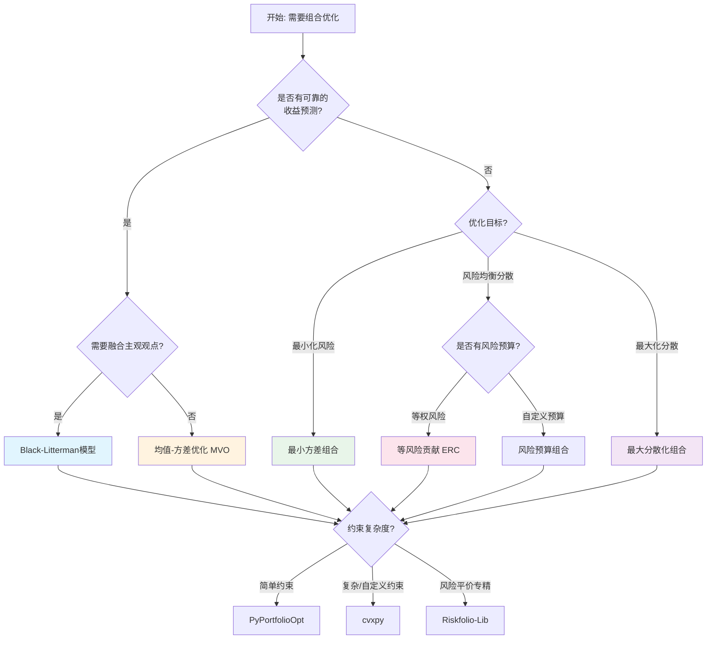
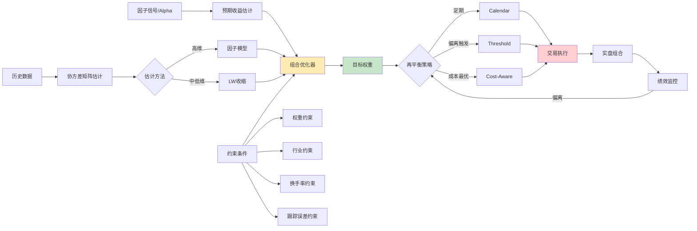

# 组合优化与资产配置

## 核心要点

> [!summary] 一句话总结
> 组合优化是将因子信号/预期收益转化为可执行持仓权重的关键环节，核心在于**收益估计、风险建模、约束处理**三者的平衡。

- **均值-方差优化（MVO）** 是理论基石，但对输入参数极度敏感——"垃圾进垃圾出"
- **Black-Litterman模型** 通过贝叶斯融合市场均衡收益与主观观点，解决MVO的输入敏感性
- **协方差矩阵估计** 质量直接决定优化结果，Ledoit-Wolf收缩和因子模型是两大主流方法
- **风险平价/ERC** 不依赖收益预测，仅基于风险分散，在A股实践中表现稳健
- **约束优化** 是理论到实盘的桥梁：行业暴露、个股权重、换手率、跟踪误差缺一不可
- **再平衡策略** 必须纳入交易成本分析，A股的印花税（卖出0.05%）和佣金对高频再平衡影响显著

---

## 一、均值-方差优化（Markowitz模型）

### 1.1 数学框架

Harry Markowitz (1952) 提出的均值-方差优化（Mean-Variance Optimization, MVO）是现代投资组合理论的基石。

**基本形式：给定目标收益，最小化组合方差**

$$
\min_{\mathbf{w}} \quad \frac{1}{2} \mathbf{w}^T \Sigma \mathbf{w}
$$

$$
\text{s.t.} \quad \boldsymbol{\mu}^T \mathbf{w} = \mu_{\text{target}}, \quad \mathbf{1}^T \mathbf{w} = 1
$$

其中：
- $\mathbf{w} \in \mathbb{R}^N$ — 资产权重向量
- $\Sigma \in \mathbb{R}^{N \times N}$ — 收益率协方差矩阵
- $\boldsymbol{\mu} \in \mathbb{R}^N$ — 预期收益率向量
- $\mu_{\text{target}}$ — 目标收益率

**解析解（无约束做空时）：**

$$
\mathbf{w}^* = \frac{1}{\lambda} \Sigma^{-1} (\boldsymbol{\mu} - r_f \mathbf{1})
$$

其中 $\lambda$ 为风险厌恶系数，$r_f$ 为无风险利率。

**有效前沿（Efficient Frontier）** 是所有最优组合在风险-收益空间中形成的曲线，其上每个点代表给定风险下的最大收益（或给定收益下的最小风险）。

### 1.2 三种经典优化目标

| 优化目标 | 目标函数 | 适用场景 |
|---------|---------|---------|
| **最小方差组合** | $\min \mathbf{w}^T \Sigma \mathbf{w}$ | 保守型配置、不信任收益预测 |
| **最大夏普比率** | $\max \frac{\boldsymbol{\mu}^T \mathbf{w} - r_f}{\sqrt{\mathbf{w}^T \Sigma \mathbf{w}}}$ | 追求风险调整后最优收益 |
| **目标收益最小风险** | $\min \mathbf{w}^T \Sigma \mathbf{w}$ s.t. $\boldsymbol{\mu}^T \mathbf{w} = \mu_t$ | 有明确收益目标的组合 |

### 1.3 cvxpy实现

```python
import numpy as np
import cvxpy as cp

class MarkowitzOptimizer:
    """Markowitz均值-方差优化器"""

    def __init__(self, mu: np.ndarray, Sigma: np.ndarray, rf: float = 0.03):
        """
        Parameters
        ----------
        mu : 预期年化收益率向量 (N,)
        Sigma : 年化协方差矩阵 (N, N)
        rf : 无风险利率
        """
        self.mu = mu
        self.Sigma = Sigma
        self.rf = rf
        self.N = len(mu)

    def min_variance(self, allow_short=False):
        """最小方差组合"""
        w = cp.Variable(self.N)
        objective = cp.Minimize(cp.quad_form(w, self.Sigma))
        constraints = [cp.sum(w) == 1]
        if not allow_short:
            constraints.append(w >= 0)
        prob = cp.Problem(objective, constraints)
        prob.solve(solver=cp.ECOS)
        return w.value

    def max_sharpe(self, allow_short=False):
        """最大夏普比率（Schaible变换转为凸优化）"""
        # 使用变量替换 y = w/k, k = 1/(mu-rf)^T w
        y = cp.Variable(self.N)
        k = cp.Variable()
        objective = cp.Minimize(cp.quad_form(y, self.Sigma))
        constraints = [
            (self.mu - self.rf) @ y == 1,
            cp.sum(y) == k,
            k >= 0
        ]
        if not allow_short:
            constraints.append(y >= 0)
        prob = cp.Problem(objective, constraints)
        prob.solve(solver=cp.ECOS)
        return y.value / k.value

    def efficient_return(self, target_return, allow_short=False):
        """给定目标收益最小化风险"""
        w = cp.Variable(self.N)
        objective = cp.Minimize(cp.quad_form(w, self.Sigma))
        constraints = [
            cp.sum(w) == 1,
            self.mu @ w >= target_return
        ]
        if not allow_short:
            constraints.append(w >= 0)
        prob = cp.Problem(objective, constraints)
        prob.solve(solver=cp.ECOS)
        return w.value

    def efficient_frontier(self, n_points=50, allow_short=False):
        """生成有效前沿"""
        min_ret = self.mu.min()
        max_ret = self.mu.max()
        target_returns = np.linspace(min_ret, max_ret, n_points)
        frontier = []
        for tr in target_returns:
            w = self.efficient_return(tr, allow_short)
            if w is not None:
                port_vol = np.sqrt(w @ self.Sigma @ w)
                port_ret = self.mu @ w
                frontier.append((port_vol, port_ret, w))
        return frontier
```

### 1.4 MVO的核心缺陷

> [!warning] Markowitz模型的实践挑战
> 1. **对预期收益极度敏感**：收益估计微小变化导致权重剧烈翻转
> 2. **集中持仓**：常产生少数资产极端权重的"角点解"
> 3. **估计误差放大**：优化器倾向于超配被高估收益/低估风险的资产
> 4. **协方差矩阵不稳定**：样本协方差在N>T时奇异，小样本噪声大

---

## 二、Black-Litterman模型

### 2.1 模型动机与核心思想

Black-Litterman（BL）模型由Fischer Black和Robert Litterman (1992) 在高盛提出，是对MVO输入敏感性问题的优雅解决方案。

**核心思想**：在贝叶斯框架下，将**市场均衡收益**（先验）与**投资者主观观点**（似然）融合，得到**后验预期收益**，再送入优化器。

### 2.2 完整推导

**Step 1：计算隐含均衡收益（先验）**

假设当前市场处于均衡状态，反推市场隐含的预期超额收益率：

$$
\boldsymbol{\pi} = \lambda \Sigma \mathbf{w}_{mkt}
$$

其中：
- $\lambda = \frac{E[R_m] - r_f}{\sigma_m^2}$ — 风险厌恶系数（通常取2.5~3.5）
- $\Sigma$ — 协方差矩阵
- $\mathbf{w}_{mkt}$ — 市场均衡权重（市值加权）

**Step 2：定义投资者观点**

以矩阵形式表达K个观点：

$$
P \boldsymbol{\mu} = \mathbf{q} + \boldsymbol{\varepsilon}, \quad \boldsymbol{\varepsilon} \sim N(\mathbf{0}, \Omega)
$$

其中：
- $P \in \mathbb{R}^{K \times N}$ — 观点选择矩阵（Pick Matrix）
- $\mathbf{q} \in \mathbb{R}^K$ — 观点预期收益向量
- $\Omega \in \mathbb{R}^{K \times K}$ — 观点不确定性矩阵（对角阵）

> **观点示例**：
> - 绝对观点："贵州茅台未来一年收益15%" → P=[0,...,1,...,0], q=[0.15]
> - 相对观点："银行板块跑赢地产板块3%" → P=[...,0.5,...,-0.5,...], q=[0.03]

**Step 3：贝叶斯更新（后验收益）**

$$
\boldsymbol{\mu}_{BL} = \left[(\tau\Sigma)^{-1} + P^T \Omega^{-1} P\right]^{-1} \left[(\tau\Sigma)^{-1} \boldsymbol{\pi} + P^T \Omega^{-1} \mathbf{q}\right]
$$

$$
\Sigma_{BL} = \left[(\tau\Sigma)^{-1} + P^T \Omega^{-1} P\right]^{-1}
$$

其中 $\tau$ 为标量参数（通常取0.025~0.05），控制先验的不确定性程度。

**Step 4：最优权重**

$$
\mathbf{w}_{BL} = \frac{1}{\lambda}(\Sigma + \Sigma_{BL})^{-1} \boldsymbol{\mu}_{BL}
$$

### 2.3 关键参数设定

| 参数 | 含义 | 典型取值 | 敏感度 |
|------|------|---------|--------|
| $\tau$ | 先验不确定性标量 | 0.025 ~ 0.05 | 中等，值越大观点影响越大 |
| $\lambda$ | 风险厌恶系数 | 2.5 ~ 3.5 | 高，直接影响均衡收益幅度 |
| $\Omega$ | 观点不确定性 | $\text{diag}(\tau \cdot P \Sigma P^T)$ | 极高，核心调节旋钮 |
| $P$ | 观点选择矩阵 | 由观点结构决定 | 结构性参数 |

### 2.4 Python实现

```python
import numpy as np

class BlackLittermanModel:
    """Black-Litterman模型完整实现"""

    def __init__(self, Sigma: np.ndarray, market_weights: np.ndarray,
                 risk_free_rate: float = 0.03, tau: float = 0.05,
                 risk_aversion: float = 2.5):
        self.Sigma = Sigma
        self.w_mkt = market_weights
        self.rf = risk_free_rate
        self.tau = tau
        self.lam = risk_aversion
        self.N = len(market_weights)

        # Step 1: 计算隐含均衡收益
        self.pi = self.lam * self.Sigma @ self.w_mkt

    def set_views(self, P: np.ndarray, q: np.ndarray,
                  omega: np.ndarray = None, confidence: np.ndarray = None):
        """
        设定投资者观点

        Parameters
        ----------
        P : 观点矩阵 (K, N)
        q : 观点收益 (K,)
        omega : 观点不确定性矩阵 (K, K)，若为None则自动计算
        confidence : 各观点置信度 (K,)，范围[0,1]，用于调整omega
        """
        self.P = P
        self.q = q

        if omega is not None:
            self.Omega = omega
        else:
            # He & Litterman (1999) 推荐: omega = diag(tau * P @ Sigma @ P^T)
            self.Omega = np.diag(np.diag(self.tau * P @ self.Sigma @ P.T))
            if confidence is not None:
                # 置信度越高，omega越小（不确定性越低）
                for i, c in enumerate(confidence):
                    self.Omega[i, i] /= max(c, 0.01)

    def posterior_return(self):
        """计算后验预期收益"""
        tau_Sigma_inv = np.linalg.inv(self.tau * self.Sigma)
        Omega_inv = np.linalg.inv(self.Omega)

        # 后验精度矩阵
        M = np.linalg.inv(tau_Sigma_inv + self.P.T @ Omega_inv @ self.P)

        # 后验均值
        self.mu_bl = M @ (tau_Sigma_inv @ self.pi + self.P.T @ Omega_inv @ self.q)

        # 后验协方差
        self.Sigma_bl = M

        return self.mu_bl

    def optimal_weights(self):
        """计算BL最优权重"""
        if not hasattr(self, 'mu_bl'):
            self.posterior_return()

        Sigma_total = self.Sigma + self.Sigma_bl
        w = (1 / self.lam) * np.linalg.inv(Sigma_total) @ self.mu_bl

        # 归一化
        w = w / w.sum()
        return w


# === 使用示例 ===
# 5只A股资产
asset_names = ['贵州茅台', '宁德时代', '招商银行', '中国平安', '比亚迪']
N = 5

# 市值加权（模拟）
w_mkt = np.array([0.25, 0.20, 0.20, 0.15, 0.20])

# 年化协方差矩阵（模拟）
np.random.seed(42)
A = np.random.randn(N, N) * 0.1
Sigma = A @ A.T + np.eye(N) * 0.04  # 确保正定

# 初始化BL模型
bl = BlackLittermanModel(Sigma, w_mkt, risk_free_rate=0.025, tau=0.05)

# 设定观点
P = np.array([
    [1, 0, 0, 0, 0],     # 绝对观点：茅台收益20%
    [0, 1, 0, -1, 0],    # 相对观点：宁德 > 平安 5%
])
q = np.array([0.20, 0.05])
confidence = np.array([0.8, 0.6])  # 观点置信度

bl.set_views(P, q, confidence=confidence)
mu_posterior = bl.posterior_return()
w_bl = bl.optimal_weights()

for name, w_eq, w_opt in zip(asset_names, w_mkt, w_bl):
    print(f"{name}: 均衡权重={w_eq:.1%} → BL权重={w_opt:.1%}")
```

---

## 三、协方差矩阵估计

协方差矩阵 $\Sigma$ 的估计质量直接决定组合优化的成败。样本协方差矩阵在高维（N > T）时甚至不可逆，低维时也充满估计噪声。

### 3.1 Ledoit-Wolf收缩估计

**核心思想**：将样本协方差矩阵向结构化目标（Target）收缩，在偏差和方差之间取得最优平衡。

$$
\hat{\Sigma}_{LW} = (1 - \alpha) \hat{\Sigma}_{sample} + \alpha \cdot F
$$

其中：
- $\hat{\Sigma}_{sample}$ — 样本协方差矩阵
- $F$ — 收缩目标（常用 $\frac{\text{tr}(\hat{\Sigma})}{N} \cdot I_N$，即缩放的单位阵）
- $\alpha \in [0, 1]$ — 最优收缩强度，由Ledoit-Wolf公式解析确定

**收缩强度 $\alpha$ 的解析公式**（Ledoit & Wolf, 2004）：

$$
\alpha^* = \frac{\sum_{i,j} \text{Var}(\hat{\sigma}_{ij})}{\sum_{i,j} (\hat{\sigma}_{ij} - f_{ij})^2}
$$

直觉：样本协方差估计越不稳定（分子大），收缩越强。

**Python实现：**

```python
from sklearn.covariance import LedoitWolf
import numpy as np

# returns: (T, N) 日收益率矩阵
returns = np.random.randn(252, 50) * 0.02  # 模拟50只股票1年日收益

# 方法1: sklearn自动计算最优收缩
lw = LedoitWolf()
lw.fit(returns)
Sigma_lw = lw.covariance_ * 252  # 年化
print(f"最优收缩系数: {lw.shrinkage_:.4f}")

# 方法2: 手动实现（教学用途）
def ledoit_wolf_shrinkage(X):
    """手动实现Ledoit-Wolf收缩"""
    T, N = X.shape
    X_centered = X - X.mean(axis=0)
    S = X_centered.T @ X_centered / T  # 样本协方差

    # 收缩目标: 缩放单位阵
    mu = np.trace(S) / N
    F = mu * np.eye(N)

    # 计算最优收缩强度
    delta = S - F
    sum_sq = np.sum(delta ** 2)  # 分母

    # 分子: 协方差元素的方差之和
    Y = X_centered ** 2
    phi = np.sum((Y.T @ Y / T - S ** 2))

    alpha = min(max(phi / (T * sum_sq), 0), 1)

    Sigma_shrunk = (1 - alpha) * S + alpha * F
    return Sigma_shrunk, alpha
```

### 3.2 因子模型估计

**核心思想**：用少量因子解释收益的共同变动，大幅降低待估参数。

$$
\Sigma_{factor} = B \Lambda B^T + D
$$

其中：
- $B \in \mathbb{R}^{N \times K}$ — 因子载荷矩阵
- $\Lambda \in \mathbb{R}^{K \times K}$ — 因子协方差矩阵
- $D \in \mathbb{R}^{N \times N}$ — 特异性风险（对角阵）
- $K \ll N$ — 因子数（通常3~10个）

**参数量对比**（N=500只股票）：

| 方法 | 参数量 | 说明 |
|------|--------|------|
| 样本协方差 | 125,250 | $N(N+1)/2$ |
| 10因子模型 | 5,555 | $NK + K(K+1)/2 + N$ |
| Ledoit-Wolf | 125,250 + 1 | 样本协方差 + 1个收缩参数 |

```python
import numpy as np
from sklearn.decomposition import PCA

def factor_cov_estimation(returns, n_factors=5):
    """
    基于PCA的因子模型协方差估计

    Parameters
    ----------
    returns : (T, N) 收益率矩阵
    n_factors : 因子数量

    Returns
    -------
    Sigma_factor : 因子模型协方差矩阵
    """
    T, N = returns.shape

    # PCA提取因子
    pca = PCA(n_components=n_factors)
    factors = pca.fit_transform(returns)  # (T, K) 因子收益

    # 因子载荷: B = V * sqrt(eigenvalues) 或直接回归
    B = pca.components_.T * np.sqrt(pca.explained_variance_)  # (N, K)

    # 因子协方差
    Lambda = np.cov(factors.T)  # (K, K)

    # 特异性风险
    residuals = returns - factors @ pca.components_
    D = np.diag(np.var(residuals, axis=0))  # (N, N) 对角阵

    # 因子模型协方差
    Sigma_factor = B @ Lambda @ B.T + D

    return Sigma_factor

# A股常用因子模型: Barra CNE6 (市场/规模/价值/动量/波动率/流动性等)
```

### 3.3 方法选择建议

| 场景 | 推荐方法 | 理由 |
|------|---------|------|
| N < 50, T > 500 | 样本协方差 + LW收缩 | 样本量充足，收缩微调即可 |
| N = 50~200 | LW收缩 或 因子模型 | 两者均有效，因子模型更稳定 |
| N > 200 | 因子模型（必选） | 样本协方差近乎不可用 |
| 日频高换手策略 | 短窗口LW + 指数加权 | 需捕捉近期协方差变化 |

---

## 四、风险平价与等风险贡献（ERC）

### 4.1 风险贡献分解

对于组合波动率 $\sigma_p = \sqrt{\mathbf{w}^T \Sigma \mathbf{w}}$，各资产的**风险贡献**可分解为：

**边际风险贡献（MRC）：**
$$
MRC_i = \frac{\partial \sigma_p}{\partial w_i} = \frac{(\Sigma \mathbf{w})_i}{\sigma_p}
$$

**总风险贡献（RC）：**
$$
RC_i = w_i \cdot MRC_i = \frac{w_i (\Sigma \mathbf{w})_i}{\sigma_p}
$$

**欧拉分解定理**（$\sigma_p$ 为一次齐次函数）：
$$
\sigma_p = \sum_{i=1}^{N} RC_i
$$

### 4.2 等风险贡献（ERC）优化

**ERC条件**：所有资产风险贡献相等。

$$
RC_i = RC_j = \frac{\sigma_p}{N}, \quad \forall i, j
$$

**等价优化问题**（Maillard, Roncalli & Teiletche, 2010）：

$$
\min_{\mathbf{w}} \sum_{i=1}^{N} \sum_{j=1}^{N} \left(w_i (\Sigma \mathbf{w})_i - w_j (\Sigma \mathbf{w})_j \right)^2
$$

$$
\text{s.t.} \quad \mathbf{1}^T \mathbf{w} = 1, \quad \mathbf{w} \geq 0
$$

**或等价的对数形式**（Spinu, 2013，可转化为凸优化）：

$$
\min_{\mathbf{y}} \frac{1}{2} \mathbf{y}^T \Sigma \mathbf{y} - \frac{1}{N} \sum_{i=1}^{N} \ln(y_i)
$$

然后归一化 $\mathbf{w} = \mathbf{y} / \mathbf{1}^T \mathbf{y}$。

### 4.3 广义风险预算

风险平价是风险预算的特例。一般地，指定各资产目标风险预算 $\mathbf{b}$（$\sum b_i = 1$）：

$$
\frac{RC_i}{\sigma_p} = b_i, \quad \forall i
$$

例如：60/40策略可设股票风险预算60%、债券40%，而非按名义权重。

### 4.4 Python实现

```python
import numpy as np
from scipy.optimize import minimize

class RiskParityOptimizer:
    """风险平价/等风险贡献优化器"""

    def __init__(self, Sigma: np.ndarray):
        self.Sigma = Sigma
        self.N = Sigma.shape[0]

    def risk_contribution(self, w):
        """计算各资产的风险贡献"""
        port_vol = np.sqrt(w @ self.Sigma @ w)
        mrc = self.Sigma @ w / port_vol  # 边际风险贡献
        rc = w * mrc  # 总风险贡献
        return rc, port_vol

    def erc_optimization(self, budget=None):
        """等风险贡献优化（对数障碍法）"""
        if budget is None:
            budget = np.ones(self.N) / self.N

        def objective(y):
            port_var = 0.5 * y @ self.Sigma @ y
            log_barrier = -np.sum(budget * np.log(y))
            return port_var + log_barrier

        def gradient(y):
            return self.Sigma @ y - budget / y

        # 初始值: 逆波动率加权
        vols = np.sqrt(np.diag(self.Sigma))
        y0 = (1 / vols) / np.sum(1 / vols)

        result = minimize(objective, y0, jac=gradient,
                         method='SLSQP',
                         bounds=[(1e-8, None)] * self.N)

        # 归一化为权重
        w = result.x / result.x.sum()
        return w

    def naive_risk_parity(self):
        """简化版风险平价（逆波动率加权，忽略相关性）"""
        vols = np.sqrt(np.diag(self.Sigma))
        w = (1 / vols) / np.sum(1 / vols)
        return w

    def verify_erc(self, w):
        """验证ERC条件是否满足"""
        rc, port_vol = self.risk_contribution(w)
        rc_pct = rc / port_vol  # 相对风险贡献
        print(f"组合波动率: {port_vol:.4%}")
        print(f"风险贡献: {np.round(rc_pct, 4)}")
        print(f"最大/最小风险贡献比: {rc_pct.max()/rc_pct.min():.4f}")
        return rc_pct
```

---

## 五、最大分散化与最小方差组合

### 5.1 最大分散化组合（Maximum Diversification）

**分散化比率（Diversification Ratio）**：

$$
DR = \frac{\mathbf{w}^T \boldsymbol{\sigma}}{\sqrt{\mathbf{w}^T \Sigma \mathbf{w}}}
$$

其中 $\boldsymbol{\sigma}$ 为各资产波动率向量。当且仅当所有资产完全正相关时 $DR = 1$，否则 $DR > 1$。

**优化问题**：

$$
\max_{\mathbf{w}} \frac{\mathbf{w}^T \boldsymbol{\sigma}}{\sqrt{\mathbf{w}^T \Sigma \mathbf{w}}}, \quad \text{s.t.} \quad \mathbf{1}^T \mathbf{w} = 1, \quad \mathbf{w} \geq 0
$$

等价于（用相关系数矩阵 $C$）：

$$
\min_{\mathbf{w}} \mathbf{w}^T C \mathbf{w}, \quad \text{s.t.} \quad \mathbf{1}^T \mathbf{w} = 1, \quad \mathbf{w} \geq 0
$$

### 5.2 最小方差组合（Global Minimum Variance）

**解析解**（允许做空时）：

$$
\mathbf{w}_{GMV} = \frac{\Sigma^{-1} \mathbf{1}}{\mathbf{1}^T \Sigma^{-1} \mathbf{1}}
$$

**性质**：
- 不需要预期收益输入，仅依赖协方差矩阵
- 实证研究表明：最小方差组合在样本外往往优于最大夏普比率组合（DeMiguel et al., 2009）
- 倾向于集中在低波动率资产上

### 5.3 Python实现

```python
def max_diversification(Sigma, allow_short=False):
    """最大分散化组合"""
    N = Sigma.shape[0]
    sigma = np.sqrt(np.diag(Sigma))

    # 构造相关系数矩阵
    D_inv = np.diag(1.0 / sigma)
    C = D_inv @ Sigma @ D_inv  # 相关系数矩阵

    w = cp.Variable(N)
    objective = cp.Minimize(cp.quad_form(w, C))
    constraints = [cp.sum(w) == 1]
    if not allow_short:
        constraints.append(w >= 0)
    prob = cp.Problem(objective, constraints)
    prob.solve(solver=cp.ECOS)
    return w.value

def global_min_variance(Sigma, allow_short=True):
    """全局最小方差组合"""
    N = Sigma.shape[0]
    if allow_short:
        # 解析解
        ones = np.ones(N)
        Sigma_inv = np.linalg.inv(Sigma)
        w = Sigma_inv @ ones / (ones @ Sigma_inv @ ones)
        return w
    else:
        # 约束优化
        w = cp.Variable(N)
        objective = cp.Minimize(cp.quad_form(w, Sigma))
        constraints = [cp.sum(w) == 1, w >= 0]
        prob = cp.Problem(objective, constraints)
        prob.solve(solver=cp.ECOS)
        return w.value
```

### 5.4 方法对比

| 方法 | 需要收益估计 | 核心驱动 | 集中度 | A股适用性 |
|------|:----------:|---------|--------|---------|
| MVO | 是 | 收益+风险 | 高 | 需要高质量alpha |
| 最小方差 | 否 | 仅风险 | 中 | 低波动策略 |
| 风险平价 | 否 | 风险均衡 | 低 | 全天候配置 |
| 最大分散化 | 否 | 相关结构 | 中 | 分散化配置 |
| Black-Litterman | 部分（观点） | 先验+观点 | 中 | 主观+量化结合 |

---

## 六、约束优化

### 6.1 五种核心约束的cvxpy实现

在A股实盘中，裸优化几乎不可用，必须叠加各种业务约束：

```python
import cvxpy as cp
import numpy as np

class ConstrainedOptimizer:
    """带约束的组合优化器"""

    def __init__(self, mu, Sigma, N):
        self.mu = mu
        self.Sigma = Sigma
        self.N = N
        self.w = cp.Variable(N)
        self.constraints = [cp.sum(self.w) == 1, self.w >= 0]

    # ========== 约束1: 个股权重约束 ==========
    def add_weight_bounds(self, lower=0.0, upper=0.10):
        """
        个股权重上下限
        A股常见: 单只股票不超过10%（公募基金双十限制）
        """
        self.constraints.append(self.w >= lower)
        self.constraints.append(self.w <= upper)

    # ========== 约束2: 行业暴露约束 ==========
    def add_sector_constraints(self, sector_matrix, sector_lower, sector_upper):
        """
        行业暴露约束

        Parameters
        ----------
        sector_matrix : (K_sector, N) 行业映射矩阵，每行表示一个行业
        sector_lower : (K_sector,) 各行业权重下限
        sector_upper : (K_sector,) 各行业权重上限

        示例: 限制金融行业权重不超过30%
        """
        sector_weights = sector_matrix @ self.w
        self.constraints.append(sector_weights >= sector_lower)
        self.constraints.append(sector_weights <= sector_upper)

    # ========== 约束3: 换手率约束 ==========
    def add_turnover_constraint(self, w_prev, max_turnover=0.30):
        """
        换手率约束

        Parameters
        ----------
        w_prev : 上期持仓权重
        max_turnover : 最大单边换手率（如0.30表示30%）
        """
        turnover = cp.norm(self.w - w_prev, 1)  # L1范数 = 双边换手率
        self.constraints.append(turnover <= 2 * max_turnover)

    # ========== 约束4: 跟踪误差约束 ==========
    def add_tracking_error_constraint(self, w_bench, max_te=0.05):
        """
        跟踪误差约束（相对基准）

        Parameters
        ----------
        w_bench : 基准权重
        max_te : 最大年化跟踪误差（如0.05表示5%）
        """
        w_active = self.w - w_bench
        te_squared = cp.quad_form(w_active, self.Sigma)
        self.constraints.append(te_squared <= max_te ** 2)

    # ========== 约束5: 持仓数量约束 ==========
    def add_cardinality_constraint(self, max_holdings=50, min_weight=0.005):
        """
        持仓数量约束（近似实现，精确基数约束为NP-hard）
        通过设置最小权重阈值间接控制持仓数量

        注意: 精确基数约束需要MILP（混合整数规划），
        cvxpy可通过boolean变量实现但求解时间大幅增加
        """
        # 近似方法: 最小权重阈值
        # 更精确方法如下（需MILP求解器如GLPK_MI）:
        z = cp.Variable(self.N, boolean=True)  # 0-1变量
        self.constraints.append(self.w <= z)  # w_i > 0 => z_i = 1
        self.constraints.append(self.w >= min_weight * z)  # z_i = 1 => w_i >= min_weight
        self.constraints.append(cp.sum(z) <= max_holdings)

    def optimize(self, objective='max_sharpe', rf=0.03):
        """执行优化"""
        if objective == 'max_sharpe':
            # 近似: 最大化 mu^T w - lambda/2 * w^T Sigma w
            lam = 2.5
            obj = cp.Maximize(self.mu @ self.w - (lam/2) * cp.quad_form(self.w, self.Sigma))
        elif objective == 'min_variance':
            obj = cp.Minimize(cp.quad_form(self.w, self.Sigma))
        elif objective == 'min_te':
            obj = cp.Minimize(cp.quad_form(self.w, self.Sigma))

        prob = cp.Problem(obj, self.constraints)
        prob.solve(solver=cp.ECOS_BB if any(
            isinstance(c, cp.constraints.nonpos.NonPos) for c in self.constraints
        ) else cp.ECOS)

        return self.w.value


# === 使用示例 ===
N = 100  # 100只股票
mu = np.random.randn(N) * 0.10 + 0.08
Sigma = np.eye(N) * 0.04 + np.ones((N, N)) * 0.01

opt = ConstrainedOptimizer(mu, Sigma, N)
opt.add_weight_bounds(lower=0.0, upper=0.05)  # 单股最多5%

# 行业约束: 假设5个行业, 每行业最多25%
sector_map = np.zeros((5, N))
for i in range(5):
    sector_map[i, i*20:(i+1)*20] = 1
opt.add_sector_constraints(sector_map,
                           sector_lower=np.ones(5)*0.05,
                           sector_upper=np.ones(5)*0.25)

# 换手率约束: 相比上期最多换手20%
w_prev = np.ones(N) / N
opt.add_turnover_constraint(w_prev, max_turnover=0.20)

w_opt = opt.optimize(objective='max_sharpe')
```

### 6.2 A股特殊约束

| 约束类型 | A股具体要求 | 实现方式 |
|---------|-----------|---------|
| 公募双十限制 | 单只不超基金净值10%，同一发行人不超10% | `w <= 0.10` |
| 涨跌停不可交易 | 涨停无法买入，跌停无法卖出 | 动态调整可交易域 |
| 最小交易单位 | 100股整手限制（科创板/北交所部分1股） | 后处理四舍五入 |
| ST/退市风险警示 | 部分机构禁止持有ST股 | 从候选池剔除 |
| 停牌股处理 | 停牌期间无法交易 | 锁定权重，仅调整可交易部分 |

---

## 七、再平衡策略

### 7.1 三种主流再平衡方法

#### (1) 定期再平衡（Calendar Rebalancing）

按固定周期（月度/季度/半年/年度）将权重调回目标。

```python
def calendar_rebalance(current_weights, target_weights,
                       frequency='quarterly', current_date=None):
    """
    定期再平衡

    Parameters
    ----------
    frequency : 'monthly' | 'quarterly' | 'semi-annual' | 'annual'
    """
    rebalance_months = {
        'monthly': list(range(1, 13)),
        'quarterly': [3, 6, 9, 12],
        'semi-annual': [6, 12],
        'annual': [12]
    }

    if current_date.month in rebalance_months[frequency]:
        trades = target_weights - current_weights
        return trades
    return np.zeros_like(current_weights)
```

**优缺点**：
- 优点：简单、可预测、交易成本稳定
- 缺点：无法应对极端行情导致的权重严重偏离

#### (2) 阈值触发再平衡（Threshold Rebalancing）

当任一资产权重偏离目标超过阈值时触发再平衡。

```python
def threshold_rebalance(current_weights, target_weights,
                        abs_threshold=0.05, rel_threshold=0.25):
    """
    阈值触发再平衡

    Parameters
    ----------
    abs_threshold : 绝对偏离阈值（如5%）
    rel_threshold : 相对偏离阈值（如25%，即目标权重的25%）
    """
    abs_deviation = np.abs(current_weights - target_weights)
    rel_deviation = abs_deviation / np.maximum(target_weights, 1e-8)

    # 任一资产触发绝对或相对阈值
    trigger = np.any(abs_deviation > abs_threshold) or \
              np.any(rel_deviation > rel_threshold)

    if trigger:
        trades = target_weights - current_weights
        return trades, True
    return np.zeros_like(current_weights), False
```

**阈值设定参考**（A股）：

| 组合规模 | 绝对阈值 | 相对阈值 | 建议频率上限 |
|---------|---------|---------|------------|
| < 100万 | 5% | 30% | 月度 |
| 100万~1000万 | 3% | 20% | 双周 |
| > 1000万 | 2% | 15% | 周度 |

#### (3) 交易成本感知再平衡（Cost-Aware Rebalancing）

将交易成本纳入优化目标，只在预期改善超过交易成本时才调仓。

```python
def cost_aware_rebalance(current_weights, target_weights, Sigma, mu,
                         cost_rate=0.002, risk_aversion=2.5):
    """
    交易成本感知再平衡

    在标准目标函数中加入交易成本惩罚项:
    max  mu^T w - lambda/2 * w^T Sigma w - c * |w - w_current|

    Parameters
    ----------
    cost_rate : 单边交易成本率
        A股: 佣金0.025% + 印花税0.05%(卖出) + 冲击成本 ≈ 0.15%~0.20%
    """
    import cvxpy as cp

    N = len(current_weights)
    w = cp.Variable(N)

    # 效用函数 - 交易成本
    utility = mu @ w - (risk_aversion / 2) * cp.quad_form(w, Sigma)
    trading_cost = cost_rate * cp.norm(w - current_weights, 1)

    objective = cp.Maximize(utility - trading_cost)
    constraints = [cp.sum(w) == 1, w >= 0]

    prob = cp.Problem(objective, constraints)
    prob.solve(solver=cp.ECOS)

    trades = w.value - current_weights

    # 过滤微小交易（低于最小交易金额）
    min_trade = 0.001  # 0.1%以下不交易
    trades[np.abs(trades) < min_trade] = 0

    return trades, w.value
```

### 7.2 A股交易成本明细

| 成本项 | 费率 | 方向 | 说明 |
|--------|------|------|------|
| 券商佣金 | 0.01%~0.03% | 双向 | 机构可低至万一 |
| 印花税 | 0.05% | 仅卖出 | 2023年8月下调 |
| 过户费 | 0.001% | 双向 | 沪深均收 |
| 冲击成本 | 0.05%~0.30% | 双向 | 取决于流动性和交易量 |
| **综合单边成本** | **0.10%~0.20%** | — | 机构典型水平 |

### 7.3 再平衡频率与成本的权衡

> [!important] 关键发现
> 根据实证研究，A股市场季度再平衡通常是最优频率：
> - 年化收益提升约1.5%~2.2%（相比买入持有）
> - 最大回撤减少4%~5%
> - 阈值触发再平衡比定期再平衡年化收益再提升约0.5%~0.7%
> - 高波动市场中（波动率>20%），再平衡的减回撤效果尤为显著（最大回撤减少约35%）

---

## 八、Python库功能对比

### 8.1 四大组合优化库

| 特性 | **cvxpy** | **scipy.optimize** | **PyPortfolioOpt** | **Riskfolio-Lib** |
|------|-----------|-------------------|-------------------|-------------------|
| **定位** | 通用凸优化建模 | 通用数值优化 | 经典组合优化 | 风险平价专精 |
| **优化范式** | 凸优化（DCP规则） | 任意非线性优化 | 封装凸优化 | 凸优化+风险平价 |
| **MVO** | 手动建模 | 手动建模 | 内置，一行调用 | 内置 |
| **Black-Litterman** | 需手动实现 | 需手动实现 | 内置 | 内置 |
| **风险平价/ERC** | 需手动建模 | 需手动建模 | 基础支持 | **核心功能** |
| **风险度量** | 方差/CVaR/自定义 | 任意 | 方差/CVaR/CDaR | **18种凸风险度量** |
| **约束灵活度** | **最高** | 高 | 中 | 中高 |
| **整数约束** | 支持（MILP） | 不支持 | 不支持 | 不支持 |
| **协方差估计** | 无 | 无 | LW收缩/OAS/半协方差 | LW/OAS/因子模型 |
| **有效前沿** | 手动实现 | 手动实现 | 内置绘图 | 内置绘图 |
| **学习曲线** | 中 | 低 | **低** | 中 |
| **依赖** | 独立 | SciPy生态 | cvxpy后端 | cvxpy后端 |
| **GitHub Stars** | ~5k | SciPy一部分 | ~4.5k | ~3k |
| **推荐场景** | 自定义复杂约束 | 简单原型 | **快速标准MVO** | **风险平价策略** |

### 8.2 快速上手示例

```python
# ===== PyPortfolioOpt（最快上手） =====
from pypfopt import EfficientFrontier, risk_models, expected_returns
import pandas as pd

prices = pd.read_csv('stock_prices.csv', index_col='date', parse_dates=True)
mu = expected_returns.mean_historical_return(prices)
S = risk_models.CovarianceShrinkage(prices).ledoit_wolf()

ef = EfficientFrontier(mu, S, weight_bounds=(0, 0.10))
ef.max_sharpe(risk_free_rate=0.03)
weights = ef.clean_weights()
print(ef.portfolio_performance(verbose=True))

# ===== Riskfolio-Lib（风险平价） =====
import riskfolio as rp

port = rp.Portfolio(returns=returns_df)
port.assets_stats(method_mu='hist', method_cov='ledoit')

# 风险平价优化
w_rp = port.rp_optimization(
    model='Classic',
    rm='MV',           # 风险度量: MV/CVaR/CDaR等
    hist=True,
    rf=0.03,
    b=None              # None = 等风险预算
)

# ===== cvxpy（最灵活） =====
import cvxpy as cp
w = cp.Variable(N)
obj = cp.Minimize(cp.quad_form(w, Sigma))
constraints = [cp.sum(w) == 1, w >= 0, w <= 0.05,
               sector_map @ w <= 0.25,
               cp.norm(w - w_prev, 1) <= 0.40]
prob = cp.Problem(obj, constraints)
prob.solve()

# ===== scipy.optimize（原型验证） =====
from scipy.optimize import minimize
def neg_sharpe(w):
    ret = w @ mu
    vol = np.sqrt(w @ Sigma @ w)
    return -(ret - rf) / vol

result = minimize(neg_sharpe, x0=np.ones(N)/N,
                  method='SLSQP',
                  bounds=[(0, 0.1)]*N,
                  constraints={'type': 'eq', 'fun': lambda w: w.sum() - 1})
```

### 8.3 选型建议

```
需求 → 推荐
├─ 快速原型/教学 → PyPortfolioOpt
├─ 风险平价/多风险度量 → Riskfolio-Lib
├─ 复杂自定义约束/MILP → cvxpy
├─ 已有scipy生态 → scipy.optimize
└─ 生产系统 → cvxpy（灵活）+ sklearn（协方差）
```

---

## 九、参数速查表

### 9.1 优化模型参数

| 参数 | 符号 | 典型范围 | 说明 |
|------|------|---------|------|
| 风险厌恶系数 | $\lambda$ | 1.0 ~ 10.0 | A股一般取2.5~5.0 |
| BL先验不确定性 | $\tau$ | 0.01 ~ 0.10 | 常用0.025~0.05 |
| LW收缩强度 | $\alpha$ | 自动计算 | 典型0.1~0.5 |
| 因子模型因子数 | K | 3 ~ 10 | Barra CNE6用6~10个 |

### 9.2 A股约束参数

| 约束 | 参数 | 公募基金 | 私募基金 |
|------|------|---------|---------|
| 单股上限 | $w_{max}$ | 10% | 10%~20% |
| 单股下限 | $w_{min}$ | 0% | 0% |
| 行业上限 | $s_{max}$ | 基准+5~10% | 基准+15% |
| 单边换手率 | $TO_{max}$ | 20%~50%/月 | 自定义 |
| 跟踪误差 | $TE_{max}$ | 3%~8%/年 | 5%~15%/年 |
| 最大持仓数 | $N_{max}$ | 50~100 | 20~50 |

### 9.3 交易成本参数

| 成本项 | 当前费率 | 备注 |
|--------|---------|------|
| 佣金 | 0.01%~0.03% | 双向收取 |
| 印花税 | 0.05% | 仅卖出，2023.08下调 |
| 过户费 | 0.001% | 双向 |
| 冲击成本（大盘股） | 0.05%~0.10% | 日交易量0.5%以内 |
| 冲击成本（小盘股） | 0.10%~0.30% | 流动性差异大 |
| 综合单边成本 | 0.10%~0.20% | 机构典型 |

---

## 十、决策流程图

### 10.1 优化方法选型决策树



### 10.2 组合构建全流程



---

## 十一、完整代码：PortfolioOptimizer类

```python
"""
组合优化器 - 集成MVO/BL/风险平价/约束优化/再平衡
适用于A股量化投资组合构建

依赖: pip install numpy pandas cvxpy scikit-learn scipy
"""

import numpy as np
import pandas as pd
import cvxpy as cp
from sklearn.covariance import LedoitWolf
from sklearn.decomposition import PCA
from scipy.optimize import minimize
from typing import Optional, Dict, Tuple, List
from dataclasses import dataclass


@dataclass
class OptResult:
    """优化结果"""
    weights: np.ndarray
    expected_return: float
    volatility: float
    sharpe_ratio: float
    risk_contributions: np.ndarray
    method: str

    def summary(self, asset_names=None):
        if asset_names is None:
            asset_names = [f"Asset_{i}" for i in range(len(self.weights))]
        s = f"\n{'='*50}\n{self.method}\n{'='*50}\n"
        s += f"预期年化收益: {self.expected_return:.2%}\n"
        s += f"年化波动率:   {self.volatility:.2%}\n"
        s += f"夏普比率:     {self.sharpe_ratio:.3f}\n"
        s += f"\n持仓({np.sum(self.weights > 1e-4)}只):\n"
        for name, w, rc in sorted(
            zip(asset_names, self.weights, self.risk_contributions),
            key=lambda x: -x[1]
        ):
            if w > 1e-4:
                s += f"  {name:12s}: 权重={w:.2%}, 风险贡献={rc:.2%}\n"
        return s


class PortfolioOptimizer:
    """
    全功能组合优化器

    支持:
    - 均值-方差优化（MVO）
    - Black-Litterman模型
    - 风险平价/等风险贡献（ERC）
    - 最大分散化/最小方差
    - 多种约束（权重/行业/换手率/跟踪误差）
    - 协方差矩阵估计（LW收缩/因子模型）
    - 再平衡策略
    """

    def __init__(self, returns: pd.DataFrame,
                 risk_free_rate: float = 0.03,
                 annualization: int = 252):
        """
        Parameters
        ----------
        returns : 日收益率DataFrame，列为资产名
        risk_free_rate : 无风险年化利率
        annualization : 年化因子（日频252，月频12）
        """
        self.returns = returns
        self.rf = risk_free_rate
        self.ann = annualization
        self.asset_names = list(returns.columns)
        self.N = len(self.asset_names)

        # 默认收益和协方差估计
        self.mu = returns.mean().values * annualization
        self.Sigma = None  # 延迟计算

    # ==================== 协方差估计 ====================

    def estimate_covariance(self, method='ledoit_wolf', **kwargs):
        """
        估计协方差矩阵

        Parameters
        ----------
        method : 'sample' | 'ledoit_wolf' | 'factor' | 'ewma'
        """
        if method == 'sample':
            self.Sigma = self.returns.cov().values * self.ann

        elif method == 'ledoit_wolf':
            lw = LedoitWolf()
            lw.fit(self.returns.values)
            self.Sigma = lw.covariance_ * self.ann
            self._lw_shrinkage = lw.shrinkage_

        elif method == 'factor':
            n_factors = kwargs.get('n_factors', 5)
            self.Sigma = self._factor_cov(n_factors)

        elif method == 'ewma':
            halflife = kwargs.get('halflife', 60)
            self.Sigma = self._ewma_cov(halflife)

        return self.Sigma

    def _factor_cov(self, n_factors):
        """PCA因子模型协方差"""
        pca = PCA(n_components=n_factors)
        factors = pca.fit_transform(self.returns.values)
        B = pca.components_.T * np.sqrt(pca.explained_variance_)
        Lambda = np.cov(factors.T)
        residuals = self.returns.values - factors @ pca.components_
        D = np.diag(np.var(residuals, axis=0))
        return (B @ Lambda @ B.T + D) * self.ann

    def _ewma_cov(self, halflife):
        """指数加权协方差"""
        return self.returns.ewm(halflife=halflife).cov().iloc[-self.N:].values * self.ann

    def _ensure_sigma(self):
        if self.Sigma is None:
            self.estimate_covariance('ledoit_wolf')

    # ==================== 优化方法 ====================

    def _build_result(self, w, method_name) -> OptResult:
        """构建标准化结果"""
        self._ensure_sigma()
        port_ret = self.mu @ w
        port_vol = np.sqrt(w @ self.Sigma @ w)
        sharpe = (port_ret - self.rf) / port_vol if port_vol > 0 else 0

        # 风险贡献
        mrc = self.Sigma @ w / port_vol if port_vol > 0 else np.zeros(self.N)
        rc = w * mrc

        return OptResult(
            weights=w,
            expected_return=port_ret,
            volatility=port_vol,
            sharpe_ratio=sharpe,
            risk_contributions=rc,
            method=method_name
        )

    def mean_variance(self, target='max_sharpe', target_return=None,
                      constraints: Dict = None) -> OptResult:
        """
        均值-方差优化

        Parameters
        ----------
        target : 'max_sharpe' | 'min_variance' | 'efficient_return'
        target_return : 当target='efficient_return'时的目标年化收益
        constraints : 附加约束字典
        """
        self._ensure_sigma()
        w = cp.Variable(self.N)
        cons = [cp.sum(w) == 1, w >= 0]
        cons = self._add_constraints(w, cons, constraints)

        if target == 'min_variance':
            obj = cp.Minimize(cp.quad_form(w, self.Sigma))
        elif target == 'max_sharpe':
            lam = 2.5
            obj = cp.Maximize(self.mu @ w - (lam/2) * cp.quad_form(w, self.Sigma))
        elif target == 'efficient_return':
            obj = cp.Minimize(cp.quad_form(w, self.Sigma))
            cons.append(self.mu @ w >= target_return)

        prob = cp.Problem(obj, cons)
        prob.solve(solver=cp.ECOS)
        return self._build_result(w.value, f"MVO-{target}")

    def black_litterman(self, views_P: np.ndarray, views_q: np.ndarray,
                        market_weights: np.ndarray = None,
                        tau: float = 0.05, risk_aversion: float = 2.5,
                        view_confidences: np.ndarray = None,
                        constraints: Dict = None) -> OptResult:
        """
        Black-Litterman模型优化

        Parameters
        ----------
        views_P : 观点矩阵 (K, N)
        views_q : 观点收益 (K,)
        market_weights : 市场权重，默认等权
        tau : 先验不确定性
        view_confidences : 观点置信度 (K,)
        """
        self._ensure_sigma()

        if market_weights is None:
            market_weights = np.ones(self.N) / self.N

        # 隐含均衡收益
        pi = risk_aversion * self.Sigma @ market_weights

        # 观点不确定性
        Omega = np.diag(np.diag(tau * views_P @ self.Sigma @ views_P.T))
        if view_confidences is not None:
            for i, c in enumerate(view_confidences):
                Omega[i, i] /= max(c, 0.01)

        # 后验
        tau_Sigma_inv = np.linalg.inv(tau * self.Sigma)
        Omega_inv = np.linalg.inv(Omega)
        M = np.linalg.inv(tau_Sigma_inv + views_P.T @ Omega_inv @ views_P)
        mu_bl = M @ (tau_Sigma_inv @ pi + views_P.T @ Omega_inv @ views_q)

        # 用后验收益做MVO
        w = cp.Variable(self.N)
        cons = [cp.sum(w) == 1, w >= 0]
        cons = self._add_constraints(w, cons, constraints)

        lam = risk_aversion
        obj = cp.Maximize(mu_bl @ w - (lam/2) * cp.quad_form(w, self.Sigma))
        prob = cp.Problem(obj, cons)
        prob.solve(solver=cp.ECOS)

        # 临时替换mu以计算结果
        old_mu = self.mu.copy()
        self.mu = mu_bl
        result = self._build_result(w.value, "Black-Litterman")
        self.mu = old_mu
        return result

    def risk_parity(self, risk_budget: np.ndarray = None,
                    constraints: Dict = None) -> OptResult:
        """
        风险平价/等风险贡献优化（对数障碍法）

        Parameters
        ----------
        risk_budget : 风险预算 (N,)，None表示等权风险
        """
        self._ensure_sigma()

        if risk_budget is None:
            risk_budget = np.ones(self.N) / self.N

        Sigma = self.Sigma

        def objective(y):
            return 0.5 * y @ Sigma @ y - np.sum(risk_budget * np.log(np.maximum(y, 1e-10)))

        def gradient(y):
            return Sigma @ y - risk_budget / np.maximum(y, 1e-10)

        vols = np.sqrt(np.diag(Sigma))
        y0 = (1 / vols) / np.sum(1 / vols)

        result = minimize(objective, y0, jac=gradient,
                         method='SLSQP',
                         bounds=[(1e-8, None)] * self.N)

        w = result.x / result.x.sum()
        return self._build_result(w, "Risk Parity (ERC)")

    def min_variance(self, constraints: Dict = None) -> OptResult:
        """全局最小方差组合"""
        return self.mean_variance(target='min_variance', constraints=constraints)

    def max_diversification(self, constraints: Dict = None) -> OptResult:
        """最大分散化组合"""
        self._ensure_sigma()
        sigma = np.sqrt(np.diag(self.Sigma))
        D_inv = np.diag(1.0 / sigma)
        C = D_inv @ self.Sigma @ D_inv

        w = cp.Variable(self.N)
        cons = [cp.sum(w) == 1, w >= 0]
        cons = self._add_constraints(w, cons, constraints)

        obj = cp.Minimize(cp.quad_form(w, C))
        prob = cp.Problem(obj, cons)
        prob.solve(solver=cp.ECOS)
        return self._build_result(w.value, "Max Diversification")

    # ==================== 约束管理 ====================

    def _add_constraints(self, w, cons, constraints):
        """添加约束条件"""
        if constraints is None:
            return cons

        if 'weight_bounds' in constraints:
            lb, ub = constraints['weight_bounds']
            cons.append(w >= lb)
            cons.append(w <= ub)

        if 'sector' in constraints:
            sector_map = constraints['sector']['matrix']
            cons.append(sector_map @ w <= constraints['sector']['upper'])
            if 'lower' in constraints['sector']:
                cons.append(sector_map @ w >= constraints['sector']['lower'])

        if 'turnover' in constraints:
            w_prev = constraints['turnover']['prev_weights']
            max_to = constraints['turnover']['max_turnover']
            cons.append(cp.norm(w - w_prev, 1) <= 2 * max_to)

        if 'tracking_error' in constraints:
            w_bench = constraints['tracking_error']['benchmark']
            max_te = constraints['tracking_error']['max_te']
            w_active = w - w_bench
            cons.append(cp.quad_form(w_active, self.Sigma) <= max_te ** 2)

        return cons

    # ==================== 再平衡 ====================

    def rebalance(self, current_weights: np.ndarray, target_weights: np.ndarray,
                  method: str = 'cost_aware', **kwargs) -> Tuple[np.ndarray, float]:
        """
        再平衡决策

        Parameters
        ----------
        method : 'direct' | 'threshold' | 'cost_aware'

        Returns
        -------
        trades : 交易量向量
        est_cost : 估计交易成本
        """
        cost_rate = kwargs.get('cost_rate', 0.0015)  # A股综合单边0.15%

        if method == 'direct':
            trades = target_weights - current_weights

        elif method == 'threshold':
            threshold = kwargs.get('threshold', 0.03)
            deviation = np.abs(current_weights - target_weights)
            if np.any(deviation > threshold):
                trades = target_weights - current_weights
            else:
                trades = np.zeros(self.N)

        elif method == 'cost_aware':
            self._ensure_sigma()
            w = cp.Variable(self.N)
            utility = self.mu @ w - 2.5/2 * cp.quad_form(w, self.Sigma)
            cost = cost_rate * cp.norm(w - current_weights, 1)
            obj = cp.Maximize(utility - cost)
            cons = [cp.sum(w) == 1, w >= 0]
            prob = cp.Problem(obj, cons)
            prob.solve(solver=cp.ECOS)
            trades = w.value - current_weights

            # 过滤微小交易
            min_trade = kwargs.get('min_trade', 0.001)
            trades[np.abs(trades) < min_trade] = 0

        est_cost = cost_rate * np.sum(np.abs(trades))
        return trades, est_cost

    # ==================== 比较分析 ====================

    def compare_methods(self, constraints=None) -> pd.DataFrame:
        """比较所有优化方法"""
        methods = {
            'MVO-MaxSharpe': lambda: self.mean_variance('max_sharpe', constraints=constraints),
            'MVO-MinVar': lambda: self.min_variance(constraints=constraints),
            'Risk Parity': lambda: self.risk_parity(),
            'Max Diversification': lambda: self.max_diversification(constraints=constraints),
        }

        results = []
        for name, func in methods.items():
            try:
                r = func()
                results.append({
                    '方法': name,
                    '年化收益': f"{r.expected_return:.2%}",
                    '年化波动': f"{r.volatility:.2%}",
                    '夏普比率': f"{r.sharpe_ratio:.3f}",
                    '最大权重': f"{r.weights.max():.2%}",
                    '持仓数': int(np.sum(r.weights > 1e-4)),
                    '风险集中度': f"{r.risk_contributions.max()/r.risk_contributions.sum():.2%}"
                        if r.risk_contributions.sum() > 0 else 'N/A'
                })
            except Exception as e:
                results.append({'方法': name, '年化收益': f'Error: {e}'})

        return pd.DataFrame(results)


# ==================== 使用示例 ====================
if __name__ == '__main__':
    # 模拟A股10只股票日收益数据
    np.random.seed(42)
    T, N = 504, 10
    asset_names = ['贵州茅台', '宁德时代', '招商银行', '中国平安', '比亚迪',
                   '隆基绿能', '药明康德', '海天味业', '迈瑞医疗', '恒瑞医药']

    returns = pd.DataFrame(
        np.random.randn(T, N) * 0.02 + 0.0003,
        columns=asset_names
    )

    # 初始化优化器
    opt = PortfolioOptimizer(returns, risk_free_rate=0.025)
    opt.estimate_covariance('ledoit_wolf')

    # 1. 各方法对比
    print(opt.compare_methods())

    # 2. 带约束的MVO
    constraints = {
        'weight_bounds': (0.0, 0.15),
        'turnover': {
            'prev_weights': np.ones(N) / N,
            'max_turnover': 0.30
        }
    }
    result = opt.mean_variance('max_sharpe', constraints=constraints)
    print(result.summary(asset_names))

    # 3. Black-Litterman
    P = np.zeros((2, N))
    P[0, 0] = 1                # 茅台绝对观点
    P[1, 1], P[1, 3] = 1, -1  # 宁德vs平安相对观点
    q = np.array([0.15, 0.05])

    bl_result = opt.black_litterman(P, q, view_confidences=np.array([0.7, 0.5]))
    print(bl_result.summary(asset_names))

    # 4. 风险平价
    rp_result = opt.risk_parity()
    print(rp_result.summary(asset_names))

    # 5. 再平衡
    current_w = np.ones(N) / N
    trades, cost = opt.rebalance(current_w, result.weights, method='cost_aware')
    print(f"\n交易成本估计: {cost:.4%}")
```

---

## 十二、常见误区与最佳实践

> [!danger] 常见误区

### 误区1：直接使用样本均值作为预期收益
样本均值的估计误差极大（信噪比极低），直接输入MVO会产生不稳定的极端配置。**应使用因子模型预测收益或Black-Litterman模型。**

### 误区2：忽略协方差矩阵的估计质量
特别是在A股"炒概念"行情中，相关结构快速变化。**应使用LW收缩+短窗口或EWMA协方差。**

### 误区3：不加约束的裸优化
MVO裸优化几乎必然产生不合理结果（100%某只股票）。**实盘必须添加权重上限、行业约束等。**

### 误区4：忽略交易成本进行回测
不含交易成本的回测结果往往高估收益2%~5%/年。**A股综合单边成本0.10%~0.20%，高换手策略尤需关注。**

### 误区5：等权组合就是风险平价
等权组合的风险贡献完全取决于各资产波动率和相关性，高波动资产（如宁德时代）会贡献远超平均的风险。**风险平价需要反向调整权重使风险贡献相等。**

### 误区6：单一最优化方法论
没有一种方法在所有市场环境下最优。**应采用模型集成：如50% MVO + 30% Risk Parity + 20% Min Variance。**

### 误区7：过度追求优化精度
给定输入参数的估计噪声，优化结果的精确度是虚幻的。**应关注权重的稳定性（对输入微扰的敏感度）而非精确最优。**

### 误区8：忽略再平衡的路径依赖
相同目标权重、不同再平衡路径可能产生差异巨大的实际收益。**必须在回测中模拟完整再平衡流程。**

---

## 相关笔记

- [[A股多因子选股策略开发全流程]] — 因子信号如何转化为预期收益输入
- [[多因子模型构建实战]] — 因子模型协方差估计的理论基础
- [[因子评估方法论]] — 因子IC/IR如何映射为收益预测
- [[A股指数体系与基准构建]] — 跟踪误差约束中的基准选择
- [[A股交易制度全解析]] — 涨跌停、T+1等约束对再平衡的影响
- [[量化研究Python工具链搭建]] — cvxpy/scipy等库的安装与环境配置
- [[A股量化交易平台深度对比]] — 各平台内置的组合优化功能
- [[A股衍生品市场与对冲工具]] — 对冲工具在组合风险管理中的应用
- [[A股行业轮动与风格轮动因子]] — 行业暴露约束的因子基础
- [[A股市场状态识别与择时因子]] — 不同市场状态下优化方法的切换
- [[A股可转债量化策略]] — 可转债组合构建中的约束与分散化方法

---

## 来源参考

1. Markowitz, H. (1952). "Portfolio Selection." *Journal of Finance*, 7(1), 77-91.
2. Black, F. & Litterman, R. (1992). "Global Portfolio Optimization." *Financial Analysts Journal*, 48(5), 28-43.
3. Ledoit, O. & Wolf, M. (2004). "A Well-Conditioned Estimator for Large-Dimensional Covariance Matrices." *Journal of Multivariate Analysis*, 88(2), 365-411.
4. Maillard, S., Roncalli, T. & Teiletche, J. (2010). "The Properties of Equally Weighted Risk Contribution Portfolios." *Journal of Portfolio Management*, 36(4), 60-70.
5. DeMiguel, V., Garlappi, L. & Uppal, R. (2009). "Optimal Versus Naive Diversification." *Review of Financial Studies*, 22(5), 1915-1953.
6. He, G. & Litterman, R. (1999). "The Intuition Behind Black-Litterman Model Portfolios." Goldman Sachs Investment Management Working Paper.
7. Choueifaty, Y. & Coignard, Y. (2008). "Toward Maximum Diversification." *Journal of Portfolio Management*, 35(1), 40-51.
8. Roncalli, T. (2013). *Introduction to Risk Parity and Budgeting.* Chapman & Hall/CRC.
9. Boyd, S. & Vandenberghe, L. (2004). *Convex Optimization.* Cambridge University Press.
10. PyPortfolioOpt 文档: https://pyportfolioopt.readthedocs.io/
11. Riskfolio-Lib 文档: https://riskfolio-lib.readthedocs.io/
12. cvxpy 文档: https://www.cvxpy.org/
