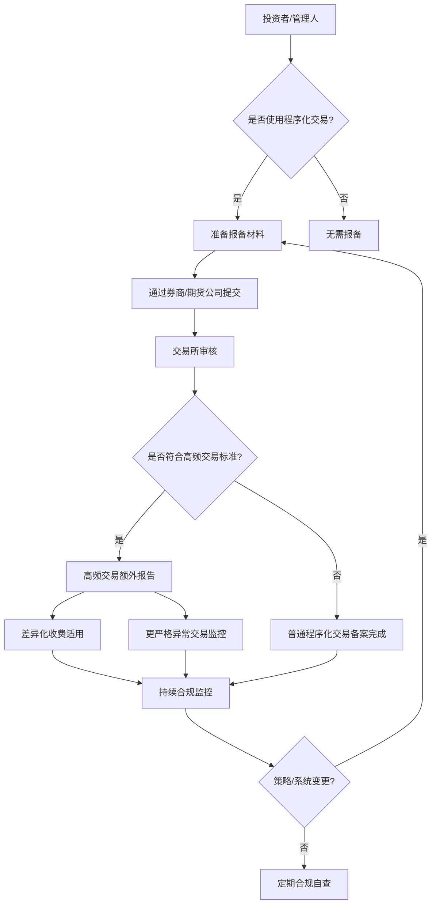
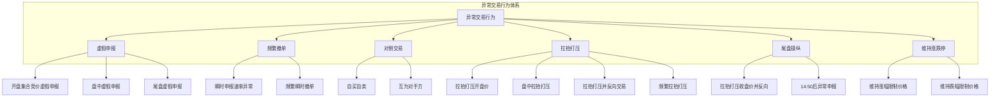
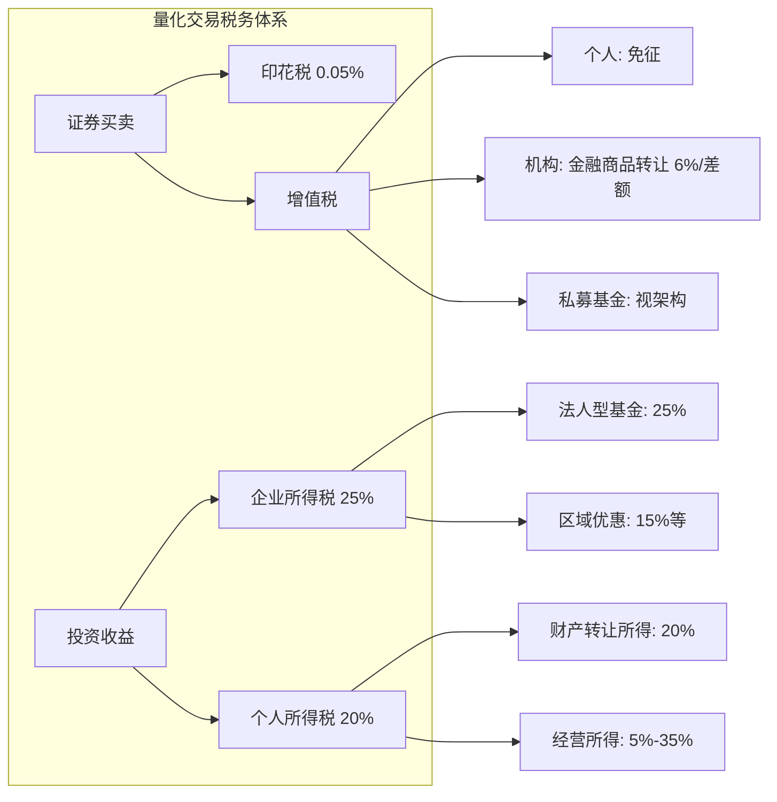
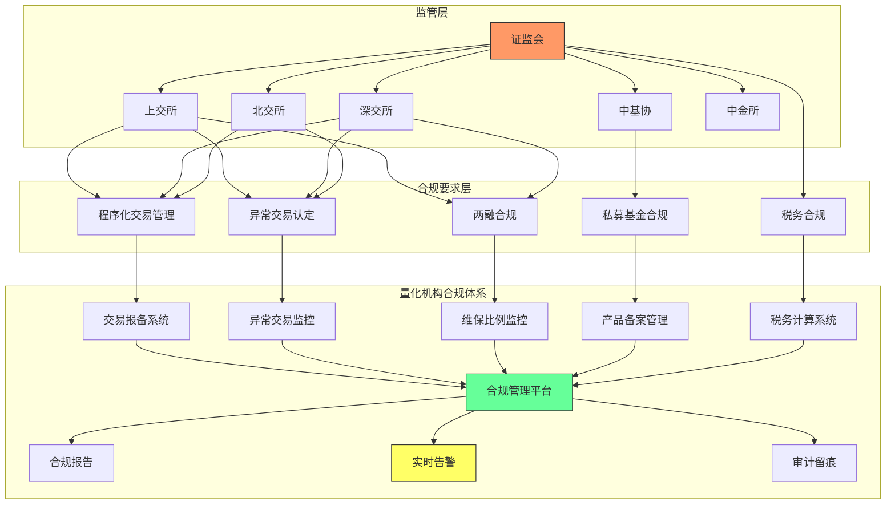

# A股量化交易合规要求

## 核心要点速览

| 维度 | 关键要求 | 核心参数 |
|------|---------|---------|
| **程序化交易报备** | 所有程序化交易须向交易所报告 | 募集完毕20个工作日内 |
| **高频交易认定** | 每秒300笔或日内20000笔 | 差异化收费+额外报告 |
| **异常交易** | 6类行为量化阈值监控 | 撤单率>=80%、偏离>=5%等 |
| **私募备案** | 中基协AMBERS系统备案 | 首轮实缴>=100万元 |
| **两融平仓线** | 维持担保比例低于130% | 触发强制平仓 |
| **印花税** | 卖出单边征收 | 0.05%（2023.8.28起） |

> [!warning] 合规是量化交易的生命线
> 违反程序化交易管理规定可导致限制交易、暂停账户乃至行政处罚。2024-2025年监管持续收紧，量化机构必须将合规嵌入系统设计的每一个环节。

---

## 一、程序化交易管理办法

### 1.1 立法沿革

| 时间节点 | 事件 | 要点 |
|----------|------|------|
| 2023年9月 | 证监会发布《程序化交易管理办法（征求意见稿）》 | 首次系统性立法，框架性规定 |
| 2024年5月15日 | 《证券市场程序化交易管理规定（试行）》正式发布 | 确立报备制度、异常交易认定、高频交易监管框架 |
| 2024年10月8日 | 正式施行 | 所有程序化交易账户须完成报备 |
| 2025年4月3日 | 沪深北交易所发布《程序化交易管理实施细则》 | 细化高频认定标准、四类异常交易行为 |
| 2025年7月7日 | 实施细则正式施行 | 量化阈值生效 |

### 1.2 核心定义

**程序化交易（Algorithmic Trading）**：通过计算机程序自动生成或下达交易指令参与证券交易的行为，包括但不限于：
- 量化选股与自动下单
- 算法拆单执行（TWAP、VWAP等）
- 高频做市与统计套利
- 事件驱动自动交易

**高频交易（High-Frequency Trading, HFT）**认定标准（2025年7月7日起）：
- **速率标准**：单个账户每秒申报、撤单笔数合计最高达到 **300笔以上**
- **总量标准**：单日申报、撤单笔数合计最高达到 **20,000笔以上**

> [!note] 高频交易 vs 普通程序化交易
> 满足上述任一条件即认定为高频交易，适用更严格的监管要求。据测算，该标准主要针对专业量化机构，普通投资者的正常交易不受影响。

### 1.3 报备要求

#### 报备主体
所有使用程序化交易的投资者，包括：
- 私募基金管理人及其管理的产品账户
- 公募基金的量化产品
- 券商自营量化部门
- 使用API接口进行自动交易的个人投资者

#### 报备内容
1. **账户基本信息**：交易者名称、交易编码、产品管理人、委托券商/期货公司
2. **交易策略信息**：交易指令执行方式、策略类型概述
3. **技术系统信息**：交易软件名称、基本功能、开发主体
4. **承诺事项**：策略及技术系统符合法律法规和交易所业务规则

#### 报备流程



### 1.4 高频交易差异化监管

| 监管措施 | 具体要求 |
|----------|---------|
| **额外报告** | 高频交易账户须提交更详细的策略说明和技术系统报告 |
| **差异化收费** | 交易所对高频交易实行更高的交易费率（具体标准由交易所制定） |
| **从严监控** | 四类异常交易行为采用更低的触发阈值 |
| **流量控制** | 可对申报速率实施技术限制 |

### 1.5 监管趋势（2024-2025）

- **趋利避害、突出公平**：监管导向从"放任"转向"规范发展"
- **借鉴境外经验**：参考欧盟MiFID II、美国SEC的程序化交易监管框架
- **技术中立原则**：不禁止程序化交易本身，但要求透明化与可监控
- **逐步收紧**：从框架立法到细则落地，参数逐步明确

---

## 二、异常交易行为认定标准

### 2.1 六类异常交易行为总览

沪深交易所对主板、科创板、创业板分别制定了异常交易认定标准。主板/科创板为 **5类14条**，创业板为 **5类11条**。



### 2.2 各类异常交易量化阈值

#### 第一类：虚假申报（Spoofing）

| 场景 | 量化定义 | 阈值 |
|------|---------|------|
| **开盘集合竞价** | 申报量占市场剩余申报量比例 | >= 30% |
| | 偏离虚拟参考价 | >= 5%（风险警示股 >= 3%） |
| | 申报后撤单比例 | >= 80% |
| **盘中虚假申报** | 最优5档内申报次数 | >= 3次 |
| | 申报量占市场剩余有效量 | >= 20% |
| | 撤单率 | >= 80% |
| | 新增：反向成交认定 | 主板/科创板适用 |
| **尾盘虚假申报** | 14:50后持续时间 | >= 2分钟 |
| | 其余标准同盘中 | — |

**数量分级标准**：

| 级别 | 普通股票 | 风险警示股（ST/*ST） | 上证50成分股 |
|------|---------|-------------------|-------------|
| 数量较大 | 30万股 / 300万元 | 30万股 / 100万元 | 适用普通标准 |
| 数量巨大 | 100万股 / 1000万元 | 50万股 / 200万元 | 从严认定 |

#### 第二类：频繁撤单（Excessive Cancellation）

| 指标 | 量化定义 | 阈值 |
|------|---------|------|
| **瞬时申报速率异常** | 1秒内申报/撤单笔数 | 达到交易所认定的异常水平 |
| **频繁瞬时撤单** | 日内1秒申报后撤单次数 | 多次触发 |
| | 全日撤单比例 | 达到较高水平 |
| **程序化交易专项** | 按产品维度分别监控 | 违规可限制交易 |

> [!important] 程序化交易的频繁撤单监控
> 2025年实施细则新增四类程序化交易异常行为：瞬时申报速率异常、频繁瞬时撤单、频繁拉抬打压、短时间大额成交。这些标准自2024年4月已试运行。

#### 第三类：对倒交易（Wash Trading）

| 行为模式 | 量化定义 | 阈值 |
|----------|---------|------|
| **自买自卖** | 同一账户连续/多次自成交 | 成交量占该股总成交 >= 20% |
| **互为对手方** | 关联账户之间互相成交 | 成交金额占比 >= 20%-30% |
| | 数量较大/巨大分级 | 适用前述数量标准 |

#### 第四类：拉抬打压（Price Manipulation）

| 场景 | 量化定义 | 阈值 |
|------|---------|------|
| **拉抬打压股价** | 大笔/连续申报偏离最新价 | >= 5%（风险警示股 >= 3%） |
| | 造成涨跌幅 | >= 5% |
| **拉抬打压并反向交易** | 偏离后反向成交 | 涨跌幅 >= 2% |
| **拉抬打压开盘价** | 偏离虚拟参考价 | >= 5%（风险警示股 >= 3%） |
| | 开盘价涨跌 | >= 5% / 3% |
| **频繁拉抬打压** | 程序化交易短时多次操纵 | 影响指数水平 |

#### 第五类：尾盘操纵（Closing Price Manipulation）

| 行为 | 量化定义 | 阈值 |
|------|---------|------|
| **拉抬打压收盘价** | 14:50后大量申报 | 涨跌幅 >= 2% |
| | 收盘后反向成交 | 金额/数量达到较大标准 |
| **维持偏离状态** | 持续申报时间 | >= 5-10分钟 |

#### 第六类：维持涨跌停价格

| 行为 | 量化定义 | 阈值 |
|------|---------|------|
| **维持涨（跌）幅限制价格** | 涨跌停后申报占剩余申报 | >= 30%-50% |
| | 持续时间 | >= 5分钟 |
| | 当日累计成交占比 | 持续增加 |

### 2.3 板块差异对比

| 板块 | 标准条数 | 关键差异 |
|------|---------|---------|
| **主板** | 5类14条 | 新增拉抬打压反向交易3条、虚假申报反向成交认定 |
| **科创板** | 5类14条 | 含盘后固定价格交易反向行为、申报速率异常监控 |
| **创业板** | 5类11条 | 未新增反向交易条款，行为接近阈值且反复可认定异常 |

### 2.4 异常交易自检代码

```python
"""
A股量化交易异常交易自检模块
用于实时监控交易行为是否接近异常交易认定阈值
"""

import time
from dataclasses import dataclass, field
from collections import defaultdict
from typing import Optional
from datetime import datetime, time as dtime


@dataclass
class TradeOrder:
    """交易委托记录"""
    order_id: str
    stock_code: str
    direction: str        # 'buy' / 'sell'
    price: float
    quantity: int
    timestamp: float      # Unix timestamp
    is_cancelled: bool = False
    cancel_timestamp: Optional[float] = None


@dataclass
class AbnormalTradeConfig:
    """异常交易阈值配置"""
    # --- 高频交易认定 ---
    hft_orders_per_second: int = 300          # 每秒申报+撤单笔数
    hft_orders_per_day: int = 20000           # 每日申报+撤单笔数

    # --- 虚假申报 ---
    spoofing_cancel_ratio: float = 0.80       # 撤单率阈值 80%
    spoofing_market_share: float = 0.20       # 占市场剩余有效量 20%
    spoofing_auction_share: float = 0.30      # 集合竞价占比 30%
    spoofing_price_deviation: float = 0.05    # 偏离参考价 5%
    spoofing_price_deviation_st: float = 0.03 # ST股偏离参考价 3%

    # --- 频繁撤单 ---
    cancel_ratio_warning: float = 0.50        # 撤单率预警线（自定义）
    cancel_ratio_critical: float = 0.70       # 撤单率临界线（自定义）

    # --- 拉抬打压 ---
    manipulation_price_move: float = 0.05     # 涨跌幅 5%
    manipulation_price_move_st: float = 0.03  # ST股涨跌幅 3%
    manipulation_reverse_move: float = 0.02   # 反向交易涨跌幅 2%

    # --- 对倒交易 ---
    wash_trade_volume_ratio: float = 0.20     # 自成交占比 20%

    # --- 尾盘操纵 ---
    closing_manipulation_time: str = "14:50"  # 尾盘开始时间
    closing_price_move: float = 0.02          # 尾盘涨跌幅 2%

    # --- 安全边际（建议使用监管阈值的60%-70%作为内部预警） ---
    safety_margin: float = 0.65               # 安全边际系数


class AbnormalTradeMonitor:
    """异常交易实时监控器"""

    def __init__(self, config: Optional[AbnormalTradeConfig] = None):
        self.config = config or AbnormalTradeConfig()
        self.orders: list[TradeOrder] = []
        self.second_order_counts: defaultdict = defaultdict(int)  # {second: count}
        self.daily_order_count: int = 0
        self.daily_cancel_count: int = 0
        self.stock_cancel_counts: defaultdict = defaultdict(lambda: {'orders': 0, 'cancels': 0})
        self.alerts: list[dict] = []

    def on_order(self, order: TradeOrder):
        """委托事件回调"""
        self.orders.append(order)
        second_key = int(order.timestamp)
        self.second_order_counts[second_key] += 1
        self.daily_order_count += 1
        self.stock_cancel_counts[order.stock_code]['orders'] += 1

        # 实时检查
        self._check_hft_per_second(second_key)
        self._check_hft_per_day()

    def on_cancel(self, order: TradeOrder):
        """撤单事件回调"""
        order.is_cancelled = True
        order.cancel_timestamp = time.time()
        second_key = int(order.cancel_timestamp)
        self.second_order_counts[second_key] += 1
        self.daily_order_count += 1
        self.daily_cancel_count += 1
        self.stock_cancel_counts[order.stock_code]['cancels'] += 1

        # 实时检查
        self._check_hft_per_second(second_key)
        self._check_cancel_ratio(order.stock_code)

    def _check_hft_per_second(self, second_key: int):
        """检查每秒申报速率是否接近高频交易标准"""
        count = self.second_order_counts[second_key]
        threshold = self.config.hft_orders_per_second
        safe_limit = int(threshold * self.config.safety_margin)

        if count >= threshold:
            self._alert('CRITICAL', 'HFT_SECOND',
                       f'每秒申报笔数 {count} 已达到高频交易标准 {threshold}')
        elif count >= safe_limit:
            self._alert('WARNING', 'HFT_SECOND',
                       f'每秒申报笔数 {count} 接近高频交易标准 {threshold}（安全边际 {safe_limit}）')

    def _check_hft_per_day(self):
        """检查每日申报总量是否接近高频交易标准"""
        threshold = self.config.hft_orders_per_day
        safe_limit = int(threshold * self.config.safety_margin)

        if self.daily_order_count >= threshold:
            self._alert('CRITICAL', 'HFT_DAILY',
                       f'每日申报笔数 {self.daily_order_count} 已达到高频交易标准 {threshold}')
        elif self.daily_order_count >= safe_limit:
            self._alert('WARNING', 'HFT_DAILY',
                       f'每日申报笔数 {self.daily_order_count} 接近高频交易标准 {threshold}')

    def _check_cancel_ratio(self, stock_code: str):
        """检查个股撤单率"""
        stats = self.stock_cancel_counts[stock_code]
        if stats['orders'] < 10:  # 样本太小不检查
            return

        cancel_ratio = stats['cancels'] / stats['orders']
        threshold = self.config.spoofing_cancel_ratio
        safe_limit = threshold * self.config.safety_margin

        if cancel_ratio >= threshold:
            self._alert('CRITICAL', 'SPOOFING_CANCEL',
                       f'{stock_code} 撤单率 {cancel_ratio:.1%} 已达到虚假申报标准 {threshold:.0%}')
        elif cancel_ratio >= safe_limit:
            self._alert('WARNING', 'SPOOFING_CANCEL',
                       f'{stock_code} 撤单率 {cancel_ratio:.1%} 接近虚假申报标准 {threshold:.0%}')

    def check_price_manipulation(self, stock_code: str,
                                  current_price: float,
                                  reference_price: float,
                                  is_st: bool = False):
        """检查价格操纵风险"""
        deviation = abs(current_price - reference_price) / reference_price
        threshold = (self.config.manipulation_price_move_st if is_st
                    else self.config.manipulation_price_move)
        safe_limit = threshold * self.config.safety_margin

        if deviation >= threshold:
            self._alert('CRITICAL', 'PRICE_MANIPULATION',
                       f'{stock_code} 价格偏离 {deviation:.2%} 达到阈值 {threshold:.0%}')
        elif deviation >= safe_limit:
            self._alert('WARNING', 'PRICE_MANIPULATION',
                       f'{stock_code} 价格偏离 {deviation:.2%} 接近阈值 {threshold:.0%}')

    def check_closing_period(self):
        """检查是否进入尾盘敏感时段"""
        now = datetime.now().time()
        closing_start = dtime(14, 50)
        if now >= closing_start:
            self._alert('INFO', 'CLOSING_PERIOD',
                       '已进入14:50尾盘敏感时段，所有交易行为将受到更严格监控')
            return True
        return False

    def check_wash_trade(self, stock_code: str,
                          self_trade_volume: int,
                          total_volume: int):
        """检查对倒交易风险"""
        if total_volume == 0:
            return
        ratio = self_trade_volume / total_volume
        threshold = self.config.wash_trade_volume_ratio
        safe_limit = threshold * self.config.safety_margin

        if ratio >= threshold:
            self._alert('CRITICAL', 'WASH_TRADE',
                       f'{stock_code} 自成交占比 {ratio:.1%} 达到对倒交易标准 {threshold:.0%}')
        elif ratio >= safe_limit:
            self._alert('WARNING', 'WASH_TRADE',
                       f'{stock_code} 自成交占比 {ratio:.1%} 接近对倒交易标准 {threshold:.0%}')

    def _alert(self, level: str, alert_type: str, message: str):
        """生成告警"""
        alert = {
            'timestamp': datetime.now().isoformat(),
            'level': level,
            'type': alert_type,
            'message': message
        }
        self.alerts.append(alert)

        # 实际部署中应接入告警系统（企业微信/钉钉/邮件）
        prefix = {'CRITICAL': '[!!!]', 'WARNING': '[!]', 'INFO': '[i]'}
        print(f"{prefix.get(level, '[?]')} {alert['timestamp']} [{alert_type}] {message}")

    def daily_report(self) -> dict:
        """生成每日合规自检报告"""
        report = {
            'date': datetime.now().strftime('%Y-%m-%d'),
            'total_orders': self.daily_order_count,
            'total_cancels': self.daily_cancel_count,
            'overall_cancel_ratio': (self.daily_cancel_count / self.daily_order_count
                                     if self.daily_order_count > 0 else 0),
            'max_orders_per_second': (max(self.second_order_counts.values())
                                      if self.second_order_counts else 0),
            'hft_threshold_reached': self.daily_order_count >= self.config.hft_orders_per_day,
            'alerts_count': len(self.alerts),
            'critical_alerts': sum(1 for a in self.alerts if a['level'] == 'CRITICAL'),
            'warning_alerts': sum(1 for a in self.alerts if a['level'] == 'WARNING'),
            'per_stock_stats': dict(self.stock_cancel_counts),
        }
        return report


# --- 使用示例 ---
if __name__ == '__main__':
    monitor = AbnormalTradeMonitor()

    # 模拟委托
    for i in range(100):
        order = TradeOrder(
            order_id=f'ORD_{i:04d}',
            stock_code='600519',
            direction='buy',
            price=1800.0 + i * 0.1,
            quantity=100,
            timestamp=time.time()
        )
        monitor.on_order(order)

        # 模拟80%撤单
        if i % 5 != 0:
            monitor.on_cancel(order)

    # 生成日报
    report = monitor.daily_report()
    print(f"\n=== 每日合规自检报告 ===")
    print(f"日期: {report['date']}")
    print(f"总委托: {report['total_orders']}, 总撤单: {report['total_cancels']}")
    print(f"撤单率: {report['overall_cancel_ratio']:.1%}")
    print(f"最高秒级笔数: {report['max_orders_per_second']}")
    print(f"告警总数: {report['alerts_count']} (严重: {report['critical_alerts']}, 警告: {report['warning_alerts']})")
```

---

## 三、私募基金合规

### 3.1 备案要求

#### 管理人登记
- 在中基协完成**私募基金管理人登记**（通过AMBERS系统）
- 2024年4月中基协发布最新办理流程图
- 需具备合格的高管团队、风控制度、信息系统

#### 产品备案流程

| 步骤 | 要求 | 时限 |
|------|------|------|
| 1. 产品设立 | 公司型/合伙型须完成工商登记 | — |
| 2. 募集完毕 | 投资者确权，首轮实缴 >= 100万元 | — |
| 3. 系统备案 | 通过AMBERS系统提交 | 募集完毕后 **20个工作日内** |
| 4. 审核反馈 | 中基协审核，可能要求补充材料 | 一般20个工作日 |
| 5. 完成备案 | 取得备案编号 | — |

#### 量化基金特殊要求（2024-2025）
- 2025年量化产品备案 5,617只，占证券类产品 **44.42%**，较2024年翻倍
- 须符合《私募证券投资基金运作指引》（2024年8月1日起施行）
- 备案前仅允许现金管理类临时投资
- 股权类基金约定存续期 >= 5年

### 3.2 信息披露

| 披露事项 | 频率 | 内容 |
|----------|------|------|
| 净值披露 | 按合同约定（通常周度/月度） | 基金净值、累计净值、回撤情况 |
| 定期报告 | 季度/年度 | 投资运作、持仓分布、收益归因 |
| 重大事项 | 即时 | 策略重大变更、风控触发、管理人变更 |
| 年度审计 | 年度 | 第三方审计报告 |

2025年1月起实施《技术指引》，完善系统管理、门户备案、安全防护，规范投资者端信息服务。

### 3.3 预警线与止损线

| 参数 | 典型设置 | 说明 |
|------|---------|------|
| **预警线** | 净值 0.85-0.90 | 触及后启动风控措施：降低仓位、通知投资者 |
| **止损线** | 净值 0.75-0.80 | 触及后强制减仓或清盘 |
| **单日回撤预警** | -3% ~ -5% | 当日净值回撤超过阈值触发预警 |
| **最大回撤预警** | -10% ~ -15% | 累计最大回撤超过阈值触发预警 |

> [!tip] 预警止损的合同约定
> 《运作指引》要求预警线和止损线必须在基金合同中明确约定，并确保投资者充分知情。具体比例由管理人与投资者协商确定，但需匹配投资者风险承受能力。

### 3.4 投资者适当性

| 要求 | 具体内容 |
|------|---------|
| **投资门槛** | 单只基金首轮实缴 >= 100万元 |
| **合格投资者** | 金融资产 >= 300万元 或 近3年年均收入 >= 50万元 |
| **禁止行为** | 不得汇集他人资金投资、不得代持 |
| **适当性管理** | 评估投资者风险承受能力，执行"双录"（录音录像） |
| **资金来源** | 核查合法性，不得使用贷款、配资等非自有资金 |
| **冷静期** | 签署合同后不少于24小时冷静期 |

---

## 四、两融合规

### 4.1 维持担保比例

```
维持担保比例 = (信用账户总资产) / (融资买入金额 + 融券卖出市值) x 100%
```

| 比例线 | 数值 | 触发操作 |
|--------|------|---------|
| **警戒线** | 150% | 券商提醒，限制新增融资融券 |
| **追保线** | 140% | T+1日内须追加担保物至警戒线以上 |
| **平仓线** | 130% | 强制平仓，券商有权不经通知直接处置 |
| **安全线** | >= 300% | 可提取超出部分担保物 |

> [!warning] 强制平仓的严肃性
> 维持担保比例低于130%时，券商有权对信用账户进行强制平仓，且不需要事先通知投资者。量化策略使用两融时必须设置更保守的内部平仓线（建议不低于160%）。

### 4.2 融券限制（2024-2025加强）

| 限制措施 | 内容 |
|----------|------|
| **战略投资者出借限制** | 禁止战略投资者在限售期内出借所持股份 |
| **转融通暂停** | 部分高风险券种暂停转融通业务 |
| **量化账户限制** | 禁止向高频量化等特定账户出借证券 |
| **裸卖空禁令** | 严格禁止无券卖空，违规者受行政处罚 |
| **T+1交收** | 融券卖出后T+1才能买券还券 |

### 4.3 融券卖出规则

- **价格限制**：融券卖出价格不得低于最新成交价（报升规则 Uptick Rule）
- **数量限制**：单只股票融券卖出量不得超过融券标的总量的一定比例
- **标的范围**：仅限交易所公布的融券标的证券
- **禁止绕道**：不得通过分拆账户规避融券限制

### 4.4 量化策略两融注意事项

1. **多空策略（Long-Short）**：融券做空端受限于标的可用券源，实际执行中可能无法完全对冲
2. **统计套利**：配对交易中的空头腿依赖融券，需提前锁券
3. **市场中性策略**：建议使用股指期货对冲替代融券做空，参见 [[A股衍生品市场与对冲工具]]
4. **风险提示**：两融杠杆放大收益的同时也放大亏损，需严格控制杠杆倍数

---

## 五、税务处理

### 5.1 四税全景



### 5.2 印花税

| 项目 | 说明 |
|------|------|
| **税率** | **0.05%**（2023年8月28日起，由0.1%减半） |
| **征收方式** | 卖出方单边征收 |
| **适用范围** | A股股票卖出，不含ETF、债券、期货 |
| **缴纳方式** | 由券商代扣代缴 |
| **量化影响** | 高换手策略（如日内回转、高频策略）成本显著，年化换手100倍时印花税成本约5% |

**印花税对不同策略的成本影响**：

| 策略类型 | 年化换手率 | 印花税成本（年化） |
|----------|-----------|-------------------|
| 长期价值投资 | 1-2倍 | 0.05%-0.10% |
| 多因子月度调仓 | 12-24倍 | 0.60%-1.20% |
| 统计套利 | 50-100倍 | 2.50%-5.00% |
| 日内回转/T+0 | 200-500倍 | 10%-25% |

### 5.3 增值税

| 主体类型 | 税务处理 | 税率 |
|----------|---------|------|
| **个人投资者** | 转让股票**免征**增值税 | 0% |
| **一般纳税人机构** | 金融商品转让，按买卖差价缴纳 | **6%**（差额计税） |
| **小规模纳税人** | 金融商品转让 | **3%**（差额计税） |
| **公募基金** | 买卖股票、债券免征 | 0% |
| **私募基金** | 视组织形式，契约型通常参照资管产品简易征收 | **3%** |
| **QFII/RQFII** | 暂免征收 | 0% |

> [!note] 增值税法更新
> 《增值税法》2024年通过，2026年1月1日生效。2025年出台实施条例，明确应税交易范围，强化电子化征管。量化机构需关注新法实施后的具体执行口径变化。

### 5.4 企业所得税

| 情形 | 税率 | 说明 |
|------|------|------|
| **一般企业** | 25% | 股票买卖差价、股息红利均计入应纳税所得额 |
| **高新技术企业** | 15% | 量化科技公司可申请认定 |
| **小微企业** | 5%-20% | 应纳税所得额分段优惠 |
| **居民企业间股息** | 免税 | 居民企业之间的股息红利免征 |

**合伙型私募基金**：按"先分后税"原则，基金层面不缴企业所得税，由合伙人各自缴纳。

### 5.5 个人所得税

| 所得类型 | 税率 | 适用场景 |
|----------|------|---------|
| **股票转让所得** | 暂免 | 个人在二级市场买卖A股股票 |
| **股息红利** | 0%-20% | 持股期限差异化：>1年免税，1个月-1年10%，<1个月20% |
| **有限合伙经营所得** | 5%-35% | LP从合伙型私募基金获得的收益（按经营所得） |
| **财产转让所得** | 20% | 特定情形下的股权转让 |

**股息红利差异化征税**：

| 持股期限 | 税率 | 说明 |
|----------|------|------|
| > 1年 | 0%（免税） | 鼓励长期持有 |
| 1个月 ~ 1年 | 10% | 中期持有 |
| < 1个月 | 20% | 短期持有成本高 |

### 5.6 税务计算器代码

```python
"""
A股量化交易税务计算器
计算不同交易主体和策略下的综合税务成本
"""

from dataclasses import dataclass
from enum import Enum
from typing import Optional


class EntityType(Enum):
    """交易主体类型"""
    INDIVIDUAL = "个人投资者"
    GENERAL_CORP = "一般企业（25%）"
    HIGHTECH_CORP = "高新技术企业（15%）"
    LP_PARTNERSHIP = "有限合伙人"
    GP_PARTNERSHIP = "普通合伙人"
    PUBLIC_FUND = "公募基金"
    PRIVATE_FUND_CONTRACT = "契约型私募"
    PRIVATE_FUND_PARTNERSHIP = "合伙型私募"


@dataclass
class TradeTaxConfig:
    """税率配置（2023.8.28后）"""
    stamp_duty_rate: float = 0.0005         # 印花税 0.05%（卖出单边）
    vat_rate_general: float = 0.06          # 增值税一般纳税人 6%
    vat_rate_small: float = 0.03            # 增值税小规模/简易征收 3%
    corp_tax_rate: float = 0.25             # 企业所得税 25%
    corp_tax_rate_hightech: float = 0.15    # 高新技术企业 15%
    individual_tax_transfer: float = 0.0    # 个人股票转让暂免
    individual_tax_dividend_short: float = 0.20   # 股息<1月 20%
    individual_tax_dividend_mid: float = 0.10     # 股息1月-1年 10%
    individual_tax_dividend_long: float = 0.0     # 股息>1年 免税
    lp_tax_rate_max: float = 0.35           # 有限合伙经营所得最高35%
    commission_rate: float = 0.0003         # 佣金（双边）
    transfer_fee_rate: float = 0.00002      # 过户费


class QuantTaxCalculator:
    """量化交易税务计算器"""

    def __init__(self, config: Optional[TradeTaxConfig] = None):
        self.config = config or TradeTaxConfig()

    def calc_trade_cost(self,
                        trade_amount: float,
                        entity_type: EntityType,
                        is_sell: bool = True) -> dict:
        """
        计算单笔交易成本

        Args:
            trade_amount: 交易金额（元）
            entity_type: 交易主体类型
            is_sell: 是否为卖出

        Returns:
            各项费用明细
        """
        costs = {
            'trade_amount': trade_amount,
            'entity_type': entity_type.value,
            'stamp_duty': 0.0,
            'commission': trade_amount * self.config.commission_rate,
            'transfer_fee': trade_amount * self.config.transfer_fee_rate,
            'vat': 0.0,
        }

        # 印花税（仅卖出）
        if is_sell:
            costs['stamp_duty'] = trade_amount * self.config.stamp_duty_rate

        costs['total'] = sum(v for k, v in costs.items()
                            if k not in ('trade_amount', 'entity_type'))
        costs['total_rate'] = costs['total'] / trade_amount if trade_amount > 0 else 0

        return costs

    def calc_round_trip_cost(self, trade_amount: float,
                              entity_type: EntityType) -> dict:
        """计算一个完整买卖回合的交易成本"""
        buy_cost = self.calc_trade_cost(trade_amount, entity_type, is_sell=False)
        sell_cost = self.calc_trade_cost(trade_amount, entity_type, is_sell=True)

        total = buy_cost['total'] + sell_cost['total']
        return {
            'buy_cost': buy_cost['total'],
            'sell_cost': sell_cost['total'],
            'round_trip_total': total,
            'round_trip_rate': total / trade_amount if trade_amount > 0 else 0,
        }

    def calc_annual_tax_cost(self,
                              annual_turnover: float,
                              avg_position: float,
                              annual_return: float,
                              entity_type: EntityType,
                              profit: Optional[float] = None) -> dict:
        """
        计算年度综合税务成本

        Args:
            annual_turnover: 年化换手率（倍）
            avg_position: 平均持仓金额
            annual_return: 年化收益率
            entity_type: 交易主体类型
            profit: 年度利润（元），默认由持仓和收益率计算
        """
        if profit is None:
            profit = avg_position * annual_return

        trade_volume = avg_position * annual_turnover

        # 交易成本
        stamp_duty_annual = trade_volume * self.config.stamp_duty_rate  # 卖出次数=换手率
        commission_annual = trade_volume * 2 * self.config.commission_rate  # 买卖双边
        transfer_fee_annual = trade_volume * 2 * self.config.transfer_fee_rate

        # 增值税
        vat_annual = 0.0
        if entity_type in (EntityType.GENERAL_CORP, EntityType.HIGHTECH_CORP):
            vat_annual = max(0, profit) * self.config.vat_rate_general
        elif entity_type in (EntityType.PRIVATE_FUND_CONTRACT,):
            vat_annual = max(0, profit) * self.config.vat_rate_small
        # 个人、公募免征

        # 所得税
        income_tax = 0.0
        if entity_type == EntityType.GENERAL_CORP:
            income_tax = max(0, profit - vat_annual) * self.config.corp_tax_rate
        elif entity_type == EntityType.HIGHTECH_CORP:
            income_tax = max(0, profit - vat_annual) * self.config.corp_tax_rate_hightech
        elif entity_type == EntityType.LP_PARTNERSHIP:
            income_tax = max(0, profit) * self.config.lp_tax_rate_max  # 简化取最高档
        elif entity_type == EntityType.INDIVIDUAL:
            income_tax = 0.0  # 个人股票转让暂免

        total_cost = (stamp_duty_annual + commission_annual +
                     transfer_fee_annual + vat_annual + income_tax)

        return {
            'entity_type': entity_type.value,
            'avg_position': avg_position,
            'annual_turnover': annual_turnover,
            'annual_return_rate': annual_return,
            'profit': profit,
            'stamp_duty': stamp_duty_annual,
            'commission': commission_annual,
            'transfer_fee': transfer_fee_annual,
            'vat': vat_annual,
            'income_tax': income_tax,
            'total_cost': total_cost,
            'cost_as_pct_of_position': total_cost / avg_position if avg_position > 0 else 0,
            'cost_as_pct_of_profit': total_cost / profit if profit > 0 else float('inf'),
            'net_profit': profit - total_cost,
            'net_return_rate': (profit - total_cost) / avg_position if avg_position > 0 else 0,
        }

    def compare_entities(self,
                          avg_position: float = 10_000_000,
                          annual_turnover: float = 24,
                          annual_return: float = 0.20):
        """对比不同主体类型的税务成本"""
        entities = [
            EntityType.INDIVIDUAL,
            EntityType.GENERAL_CORP,
            EntityType.HIGHTECH_CORP,
            EntityType.LP_PARTNERSHIP,
            EntityType.PRIVATE_FUND_CONTRACT,
        ]

        print(f"\n{'='*80}")
        print(f"税务成本对比 | 持仓:{avg_position/10000:.0f}万 | "
              f"换手:{annual_turnover}倍 | 收益率:{annual_return:.0%}")
        print(f"{'='*80}")
        print(f"{'主体类型':<20} {'印花税':>10} {'佣金':>10} {'增值税':>10} "
              f"{'所得税':>12} {'总成本':>12} {'净收益率':>8}")
        print(f"{'-'*80}")

        for entity in entities:
            result = self.calc_annual_tax_cost(
                annual_turnover, avg_position, annual_return, entity)
            print(f"{entity.value:<20} "
                  f"{result['stamp_duty']:>10,.0f} "
                  f"{result['commission']:>10,.0f} "
                  f"{result['vat']:>10,.0f} "
                  f"{result['income_tax']:>12,.0f} "
                  f"{result['total_cost']:>12,.0f} "
                  f"{result['net_return_rate']:>7.1%}")
        print(f"{'='*80}")


# --- 使用示例 ---
if __name__ == '__main__':
    calc = QuantTaxCalculator()

    # 单笔交易成本
    print("=== 单笔卖出100万元的交易成本 ===")
    cost = calc.calc_trade_cost(1_000_000, EntityType.INDIVIDUAL, is_sell=True)
    for k, v in cost.items():
        if isinstance(v, float):
            print(f"  {k}: {v:,.2f}")
        else:
            print(f"  {k}: {v}")

    # 完整回合成本
    print("\n=== 买卖一回合（100万元）交易成本 ===")
    rt = calc.calc_round_trip_cost(1_000_000, EntityType.INDIVIDUAL)
    for k, v in rt.items():
        print(f"  {k}: {v:,.4f}" if isinstance(v, float) else f"  {k}: {v}")

    # 不同主体年度税务对比
    calc.compare_entities(
        avg_position=10_000_000,   # 1000万持仓
        annual_turnover=24,         # 月度调仓
        annual_return=0.20          # 20%年化收益
    )

    # 高换手策略对比
    calc.compare_entities(
        avg_position=10_000_000,
        annual_turnover=100,        # 高频策略
        annual_return=0.30
    )
```

---

## 六、合规检查清单

### 程序化交易合规（7项）

- [ ] 1. 已向交易所完成程序化交易报备
- [ ] 2. 报备信息（策略类型、软件系统、账户信息）保持最新
- [ ] 3. 每秒申报笔数控制在300笔以下（非高频交易）或已完成高频交易额外报告
- [ ] 4. 每日申报+撤单笔数控制在20,000笔以下（或已报备高频交易）
- [ ] 5. 异常交易自检系统已部署并运行
- [ ] 6. 交易系统具备紧急熔断（Kill Switch）功能
- [ ] 7. 策略/系统变更后及时更新报备信息

### 异常交易防控（5项）

- [ ] 8. 个股撤单率实时监控，内部阈值设为监管标准的65%
- [ ] 9. 禁止自买自卖（对倒）逻辑已在系统中硬编码
- [ ] 10. 尾盘（14:50后）交易执行更严格的风控参数
- [ ] 11. 价格偏离度实时监控，防止拉抬打压行为
- [ ] 12. 全市场撤单率日报自动生成并存档

### 私募合规（4项）

- [ ] 13. 产品已在中基协AMBERS系统完成备案
- [ ] 14. 投资者适当性审查材料完整（风险评估、双录、冷静期确认）
- [ ] 15. 净值预警线/止损线在合同中明确约定并系统化监控
- [ ] 16. 信息披露按合同约定频率执行

### 两融合规（2项）

- [ ] 17. 维持担保比例实时监控，内部预警线 >= 160%
- [ ] 18. 融券卖出严格遵守报升规则（Uptick Rule），无裸卖空行为

### 税务合规（2项）

- [ ] 19. 印花税、增值税由券商代扣或按期申报
- [ ] 20. 年度所得税申报完整，合伙型基金"先分后税"处理正确

---

## 七、合规参数速查表

### 程序化交易参数

| 参数 | 阈值 | 说明 |
|------|------|------|
| 高频交易-秒级 | 300笔/秒 | 申报+撤单合计 |
| 高频交易-日级 | 20,000笔/日 | 申报+撤单合计 |
| 程序化交易报备时限 | 交易前 | 开户后、使用程序化交易前 |

### 异常交易参数

| 参数 | 阈值 | 适用范围 |
|------|------|---------|
| 虚假申报撤单率 | >= 80% | 全部A股 |
| 集合竞价占比 | >= 30% | 开盘集合竞价 |
| 价格偏离度 | >= 5%（ST >= 3%） | 普通股/风险警示股 |
| 拉抬打压涨跌幅 | >= 5% | 普通股 |
| 反向交易涨跌幅 | >= 2% | 拉抬打压后反向 |
| 对倒成交占比 | >= 20% | 自成交/互为对手方 |
| 尾盘敏感时段 | 14:50 起 | 从严监控 |
| 维持涨跌停申报占比 | >= 30%-50% | 涨跌停后 |
| 维持涨跌停持续时间 | >= 5分钟 | 涨跌停后 |

### 私募基金参数

| 参数 | 阈值 | 说明 |
|------|------|------|
| 合格投资者门槛 | 首轮实缴 >= 100万元 | 单只基金 |
| 金融资产要求 | >= 300万元 | 或近3年年均收入 >= 50万元 |
| 备案时限 | 20个工作日 | 募集完毕后 |
| 冷静期 | >= 24小时 | 合同签署后 |
| 典型预警线 | 净值 0.85-0.90 | 合同约定 |
| 典型止损线 | 净值 0.75-0.80 | 合同约定 |

### 两融参数

| 参数 | 阈值 | 说明 |
|------|------|------|
| 维持担保比例-安全线 | >= 300% | 可提取超出部分 |
| 维持担保比例-警戒线 | 150% | 限制新增融资融券 |
| 维持担保比例-追保线 | 140% | T+1追加担保物 |
| 维持担保比例-平仓线 | 130% | 强制平仓 |
| 建议内部平仓线 | >= 160% | 量化策略保守设置 |

### 税率参数

| 税种 | 税率 | 适用条件 |
|------|------|---------|
| 印花税 | 0.05% | 卖出单边，2023.8.28起 |
| 增值税（一般纳税人） | 6% | 金融商品转让差额 |
| 增值税（简易征收） | 3% | 小规模/资管产品 |
| 增值税（个人） | 0% | 个人转让股票免征 |
| 企业所得税 | 25% | 一般企业 |
| 企业所得税（高新） | 15% | 高新技术企业 |
| 个人所得税（股票转让） | 0% | 暂免征收 |
| 个人所得税（股息<1月） | 20% | 短期持有 |
| 个人所得税（股息1月-1年） | 10% | 中期持有 |
| 个人所得税（股息>1年） | 0% | 长期持有免税 |
| 有限合伙经营所得 | 5%-35% | 累进税率 |

---

## 八、合规架构全景图



---

## 九、常见误区

### 误区一：个人量化交易不需要报备
**事实**：只要使用程序化方式（包括API接口自动下单），无论是机构还是个人，均须按规定向交易所报备。通过券商API交易的个人投资者同样在监管范围内。

### 误区二：撤单率只要不到80%就安全
**事实**：80%是虚假申报的认定阈值，但交易所会综合考虑行为模式。行为"接近阈值且反复出现"同样可被认定为异常交易。建议内部阈值设为监管标准的60%-70%。

### 误区三：个人炒股完全不用交税
**事实**：个人股票转让所得暂免个人所得税，但股息红利需按持有期限差异化缴税（20%/10%/0%）。此外印花税（0.05%）由券商代扣，高换手策略的印花税成本不可忽视。

### 误区四：合伙型私募基金按20%税率缴个人所得税
**事实**：合伙企业的合伙人取得的所得，按"经营所得"适用5%-35%超额累进税率，而非统一20%的财产转让所得税率。不同地区可能有不同的执行口径，需具体咨询当地税务机关。

### 误区五：融券做空等同于裸卖空
**事实**：融券做空是借入券商持有的证券后卖出，属于合规操作。裸卖空是在未借入证券的情况下直接卖出，在A股市场被严格禁止。量化策略中的空头对冲应通过正规融券或股指期货实现。

### 误区六：ETF交易需要缴印花税
**事实**：ETF买卖暂免征收印花税，这使得基于ETF的量化策略在交易成本上相比个股策略有显著优势，特别是高换手率策略。

### 误区七：程序化交易管理办法禁止量化交易
**事实**：监管的目标是"规范发展"而非"禁止"。程序化交易管理办法旨在提高透明度、防止市场操纵，合规运营的量化策略不受限制。

---

## 十、相关笔记

- [[A股交易制度全解析]] — 交易规则基础，涨跌停、T+1等制度约束
- [[A股量化实盘接入方案]] — 实盘接入架构，与合规报备的技术衔接
- [[量化交易风控体系建设]] — 风控系统设计，合规监控的技术实现
- [[A股衍生品市场与对冲工具]] — 期货期权对冲替代融券的合规路径
- [[A股市场参与者结构与资金流分析]] — 市场微观结构与监管环境
- [[A股回测框架实战与避坑指南]] — 回测中考虑合规约束和交易成本
- [[A股量化交易平台深度对比]] — 各平台的合规支持功能对比
- [[A股交易制度全解析]] — 交易时间、竞价规则等基础制度
- [[量化系统监控与运维]] — 合规监控日志、审计追踪的技术实现
- [[量化策略的服务器部署与自动化]] — 合规报备系统的部署与自动化运维

---

## 来源参考

1. 证监会《证券市场程序化交易管理规定（试行）》（2024年5月15日发布，10月8日施行）
2. 上交所/深交所/北交所《程序化交易管理实施细则》（2025年4月3日发布，7月7日施行）
3. 中基协《私募证券投资基金运作指引》（2024年8月1日施行）
4. 财政部税务总局关于减半征收证券交易印花税的公告（2023年第39号）
5. 上交所《关于股票异常交易实时监控细则的通知》（2023年修订）
6. 深交所《关于创业板股票异常交易实时监控细则的通知》（2023年修订）
7. 君合律师事务所《程序化交易管理规定解读》
8. 海问律师事务所《程序化交易管理办法评析》
9. 中基协《私募基金登记备案动态》（2024-2025年各期）
10. 普华永道《中国税务回顾与展望2025》
11. 中金所《期货市场程序化交易管理规定（征求意见稿）》

---

> [!abstract] 最后更新
> 本文基于截至2026年3月的公开监管文件和政策整理。量化交易合规环境持续演进，建议定期核查证监会、交易所、中基协官网获取最新规则变化。
