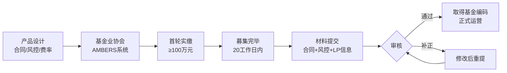

# 量化私募运营与产品设计

> - 量化私募产品两大类型：**管理型**（管理人自主决策）和**顾问型**（管理人为投资顾问），管理型更灵活
> - 费率结构标准：管理费1-2%/年 + 业绩报酬20%（高水位法），2025年行业趋势向下竞争
> - 产品备案通过AMBERS系统，首轮实缴≥100万，募集完毕20个工作日内备案
> - 预警线0.85-0.90、止损线0.75-0.80是行业惯例，触发后限制操作至净值恢复
> - 2025年量化产品备案5617只，占证券类44.42%，较2024年翻倍——行业快速扩张

---

## 一、产品结构

### 1.1 管理型 vs 顾问型

| 维度 | 管理型 | 顾问型 |
|------|--------|--------|
| 管理人角色 | 直接管理 | 投资顾问 |
| 决策权 | 管理人全权 | 建议权,通道方执行 |
| 牌照要求 | 私募基金管理人 | 可为投资顾问 |
| 灵活度 | 高 | 受限于通道方 |
| 费率谈判 | 直接收取 | 需与通道方分成 |
| 适合阶段 | 成熟团队 | 初创团队/合规过渡 |

### 1.2 产品形式

| 形式 | 税务 | 杠杆 | 适用 |
|------|------|------|------|
| 契约型 | 基金层面不纳税 | 结构化可加杠杆 | 最常见 |
| 合伙型 | "先分后税" 5-35%累进 | 有限合伙人杠杆受限 | 少数高净值 |
| 公司型 | 双重征税 | 不适用 | 极少 |

## 二、费率设计

| 费用类型 | 标准 | 趋势 |
|---------|------|------|
| 管理费 | 1-2%/年 | 下降至0.5-1% |
| 业绩报酬 | 20%(高水位法) | 部分降至15% |
| 认购费 | 0-1% | 多数免除 |
| 赎回费 | 持有<6月1%，≥1年0% | 锁定期1-3年 |
| 托管费 | 0.1-0.2%/年 | 稳定 |
| 外包服务费 | 0.05-0.1%/年 | 稳定 |

### 高水位法计算
```
业绩报酬 = max(0, (期末净值 - 高水位) × 份额 × 20%)
高水位 = max(历史所有估值日的单位净值)
```

## 三、备案流程



## 四、投资者适当性

| 投资者类型 | 门槛 | 限制 |
|-----------|------|------|
| 合格投资者(个人) | 金融资产≥300万 或 近3年年收入≥50万 | 单只产品投资≥100万 |
| 合格投资者(机构) | 净资产≥1000万 | 无最低投资限制 |
| 专业投资者 | 满足额外条件 | 可投资高风险产品 |

## 五、净值管理与清盘

| 线 | 数值 | 触发动作 |
|----|------|---------|
| 预警线 | 0.85-0.90 | 限制开新仓、通知投资者 |
| 止损线 | 0.75-0.80 | 强制减仓至安全水位或清盘 |
| 清盘线 | 0.70-0.75 | 终止产品、返还剩余资金 |
| 高水位 | 历史最高净值 | 低于高水位不收业绩报酬 |

## 六、常见误区

| 误区 | 真相 |
|------|------|
| "有策略就能发产品" | 需先完成私募管理人登记（耗时3-6个月），才能备案产品 |
| "业绩报酬=利润×20%" | 高水位法下，净值未创新高时不收业绩报酬，即使当期盈利 |
| "100万投资门槛可以凑" | 监管严查"拼单""代持"，违规将被处罚 |
| "量化产品不需要披露" | 需按季度向投资者披露净值、持仓摘要、风控报告 |

## 七、相关笔记

- [[A股量化交易合规要求]] — 程序化交易备案/异常交易/税务
- [[量化交易风控体系建设]] — 预警线/止损线/仓位管理
- [[交易成本建模与执行优化]] — 成本对产品净值的影响
- [[策略绩效评估与统计检验]] — 产品绩效评估方法

---

## 来源参考

1. 中国证券投资基金业协会AMBERS系统操作指南
2. 《私募投资基金监督管理暂行办法》(2014)及后续修订
3. 私募排排网2025年量化私募行业报告
