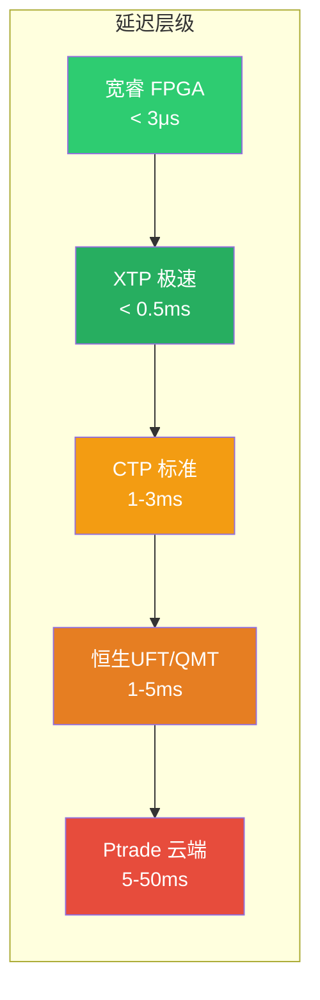
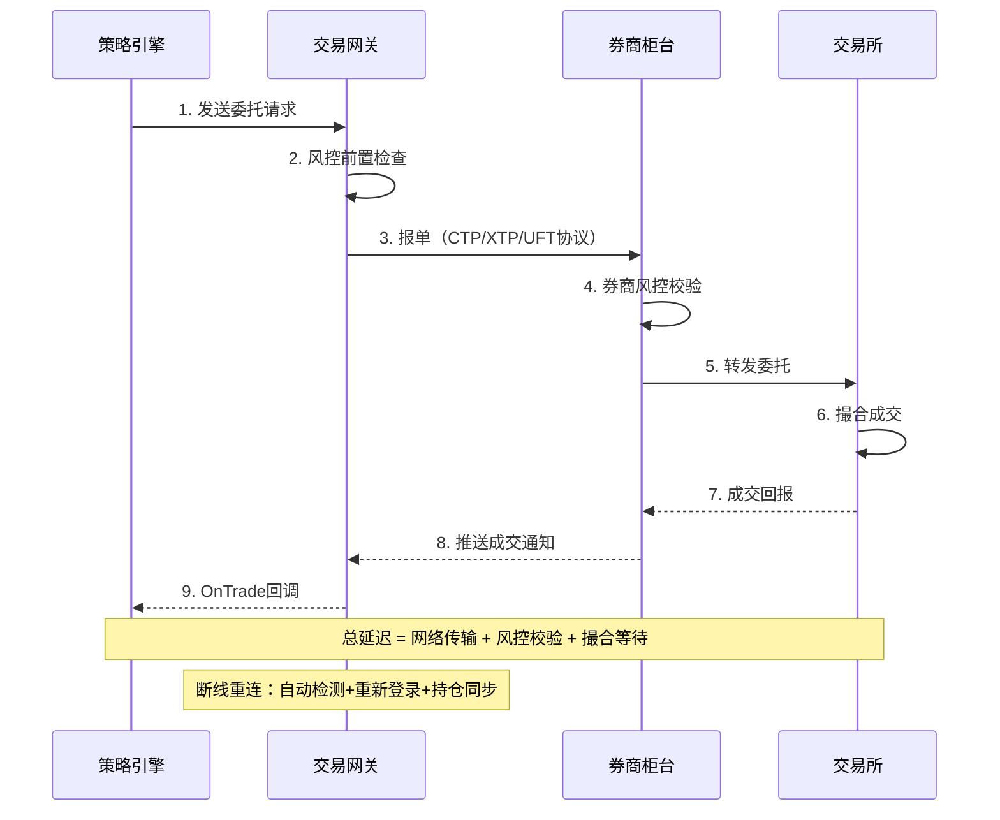
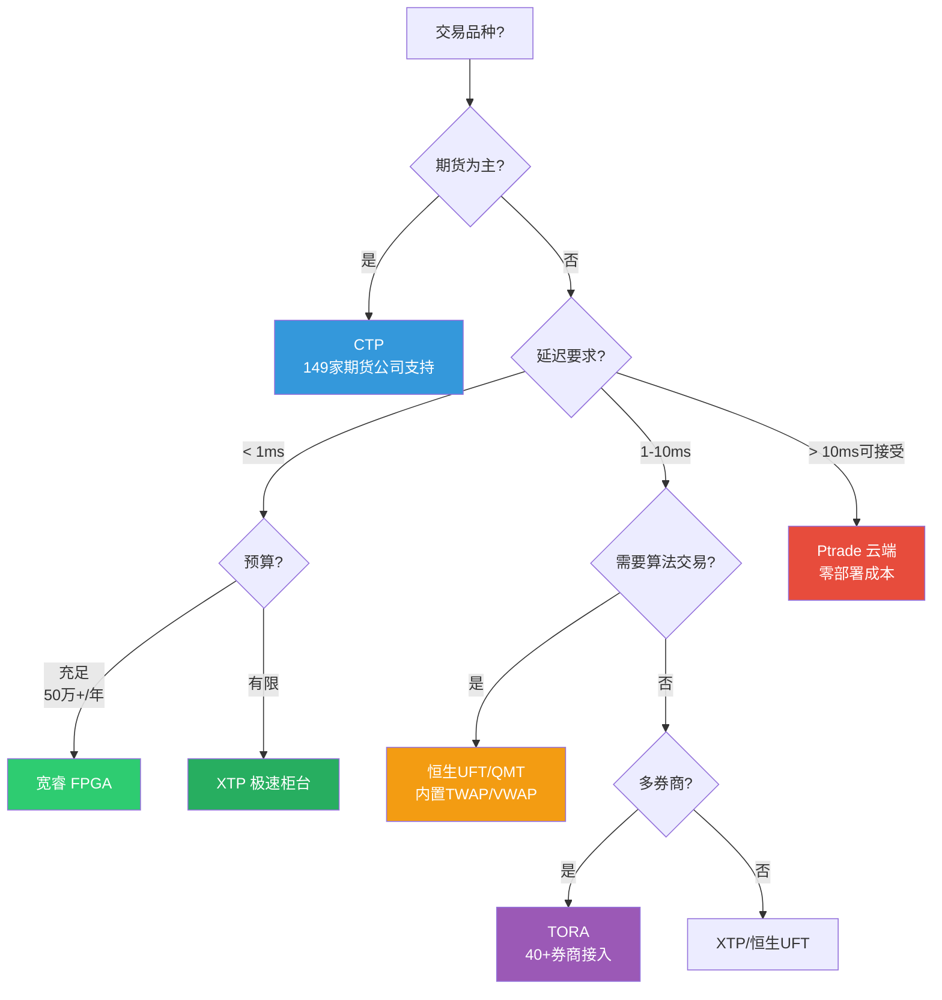

# A股实盘交易接口与协议详解

## 概述

A股程序化交易接口是量化策略从回测走向实盘的"最后一公里"。2024-2025年，随着监管趋严（程序化交易报告制度2025年7月正式实施）和技术演进（FPGA硬件加速普及），接口生态发生显著变化。本文系统对比CTP、XTP、恒生UFT、TORA、宽睿五大主流接口的技术架构、延迟特征、Python接入方式和合规要求，为量化团队的接口选型提供决策依据。

**核心结论**：
- 期货交易首选 **CTP**（覆盖149家期货公司），股票低延迟首选 **XTP/宽睿**
- Python接入推荐 **VN.PY** 框架统一对接多接口
- 2025年合规要求：先报后交易，高频策略需额外提交测试报告

> 相关笔记：[[A股量化实盘接入方案]] | [[A股量化交易平台深度对比]] | [[A股量化交易合规要求]]

---

## 五大接口技术架构

### CTP（综合交易平台，Comprehensive Transaction Platform）

上海期货信息技术有限公司开发，A股期货市场事实标准。

**架构特点**：
- 模块化网关架构：交易前置（TraderFront）+ 行情前置（MdFront）
- 支持上交所、深交所、中金所、上期所、大商所、郑商所
- 2025年深化FPGA行情解码与RDMA（Remote Direct Memory Access）网络加速

**API设计**：
- C++ 原生接口，通过 SWIG 生成 Python 绑定
- 请求-响应模式 + 推送通知（OnRtn系列回调）
- 报单流程：ReqOrderInsert → OnRspOrderInsert → OnRtnOrder → OnRtnTrade

```python
# CTP Python接入示例（via VN.PY）
from vnpy_ctp import CtpGateway
from vnpy.trader.engine import MainEngine
from vnpy.event import EventEngine

event_engine = EventEngine()
main_engine = MainEngine(event_engine)
main_engine.add_gateway(CtpGateway)

# 连接配置
setting = {
    "用户名": "your_userid",
    "密码": "your_password",
    "经纪商代码": "9999",           # SimNow测试
    "交易服务器": "tcp://180.168.146.187:10201",
    "行情服务器": "tcp://180.168.146.187:10211",
    "产品名称": "simnow_client_test",
    "授权编码": "0000000000000000",
}
main_engine.connect(setting, "CTP")
```

### XTP（中泰证券极速交易系统）

原九维/新华胜证开发，定位股票/期权极速交易。

**架构特点**：
- 极速柜台架构，绕过传统券商中间件
- 支持BINARY二进制协议（优于FIX协议，减少解析开销）
- 2025年流控更精细化，HFT申报速率受限

**延迟优势**：
- 委托响应延迟 < 0.5ms（内网环境）
- 行情推送延迟 < 1ms
- 支持Level-2逐笔成交推送

```python
# XTP Python接入示例
from vnpy_xtp import XtpGateway

setting = {
    "账号": "your_account",
    "密码": "your_password",
    "客户号": 1,
    "行情地址": "120.27.164.138",
    "行情端口": 6002,
    "交易地址": "120.27.164.69",
    "交易端口": 6001,
    "行情协议": "TCP",          # TCP/UDP可选
    "授权码": "your_auth_code",
}
```

### 恒生UFT（Ultra-Fast Trading）

恒生电子开发，券商柜台市场占有率最高。

**架构特点**：
- 云端柜台 + 券商直连模式
- 内置算法交易模板：TWAP、VWAP、Iceberg、Sniper
- 通过Ptrade/QMT等平台提供Python接口
- 模块化UI支持策略可视化配置

**接入方式**：
- Ptrade：券商定制Python环境，云端运行，无需本地部署
- QMT（迅投）：本地Python + miniQMT极简模式
- 恒生API直连：需券商开通，适合机构客户

```python
# QMT/miniQMT 接入示例
from xtquant import xtdata, xttrader
from xtquant.xttype import StockAccount

# 创建交易账户
acc = StockAccount('your_account')

# 创建交易对象
trader = xttrader.XtQuantTrader(r'D:\qmt\userdata', session_id=123456)
trader.start()
trader.connect()

# 下单
order_id = trader.order_stock(
    acc, '600519.SH', xtconstant.STOCK_BUY,
    100, xtconstant.FIX_PRICE, 1800.0
)
```

### TORA（华鑫证券奇点系统）

**架构特点**：
- 多资产DMA（Direct Market Access）架构
- 跨市场通道，支持40+券商接入
- 智能拆单功能，自动优化大单执行
- 2025年新增高频优化模块

**适用场景**：多账户管理、跨券商策略、中频以上交易

### 宽睿（Wide Quant）

**架构特点**：
- FPGA硬件加速柜台，纳秒级行情处理
- 硬件解码绕过操作系统内核，延迟远低于纯软件方案
- 与华泰证券等头部券商极速系统深度集成
- 适合机构级HFT场景

**延迟特征**：
- 行情解码：< 100ns（FPGA硬件）
- 委托延迟：< 3μs（内网FPGA直连）
- 需付费订阅，成本较高

---

## 接口协议对比

### 通信协议对比

| 维度 | CTP | XTP | 恒生UFT | TORA | 宽睿 |
|------|-----|-----|---------|------|------|
| **协议类型** | CTP私有协议 | BINARY二进制 | FIX/私有 | FIX/DMA | FPGA硬件协议 |
| **传输方式** | TCP | TCP/UDP | TCP | TCP | RDMA/共享内存 |
| **编码格式** | 结构体序列化 | 紧凑二进制 | FIX Tag-Value | FIX标准 | 硬件直通 |
| **压缩** | 无 | 可选 | 无 | 无 | N/A |
| **心跳机制** | 30s间隔 | 可配置 | 可配置 | 标准FIX | 硬件级 |

### 功能覆盖对比

| 功能 | CTP | XTP | 恒生UFT | TORA | 宽睿 |
|------|-----|-----|---------|------|------|
| **股票交易** | ✅ | ✅ | ✅ | ✅ | ✅ |
| **期货交易** | ✅（主力） | ❌ | ✅ | ✅ | ✅ |
| **期权交易** | ✅ | ✅ | ✅ | ✅ | ✅ |
| **两融交易** | ❌ | ✅ | ✅ | ✅ | ✅ |
| **算法交易** | 需自建 | 需自建 | 内置模板 | 智能拆单 | 需自建 |
| **Level-2行情** | ❌ | ✅ | ✅ | ✅ | ✅ |
| **多账户** | ✅ | ✅ | ✅ | ✅（强项） | ✅ |
| **VN.PY支持** | ✅ | ✅ | 间接 | ✅ | 需定制 |

---

## 延迟实测对比



| 接口 | 委托延迟 | 行情延迟 | 成交回报延迟 | 适用频率 |
|------|---------|---------|-------------|---------|
| **宽睿 FPGA** | < 3μs | < 100ns | < 5μs | 高频/做市 |
| **XTP 极速** | < 0.5ms | < 1ms | < 1ms | 中高频 |
| **CTP** | 1-3ms | 1-2ms | 2-5ms | 中频/CTA |
| **恒生UFT/QMT** | 1-5ms | 1-3ms | 3-8ms | 中低频 |
| **TORA** | 1-3ms | 1-2ms | 2-5ms | 中频 |
| **Ptrade 云端** | 5-50ms | 3-10ms | 10-50ms | 低频/日频 |

> **注意**：以上延迟为内网/同机房环境实测值，跨机房或公网延迟将显著增加。FPGA方案需专用硬件，年费通常在50-200万元。

---

## 交易流程架构



---

## Python接入最佳实践

### VN.PY统一接入架构

VN.PY是国内最成熟的Python量化框架，支持CTP、XTP、TORA等多接口统一对接：

```python
# VN.PY 多接口统一管理示例
from vnpy.trader.engine import MainEngine
from vnpy.event import EventEngine
from vnpy_ctp import CtpGateway
from vnpy_xtp import XtpGateway

event_engine = EventEngine()
main_engine = MainEngine(event_engine)

# 同时接入期货(CTP)和股票(XTP)
main_engine.add_gateway(CtpGateway)
main_engine.add_gateway(XtpGateway)

# 统一订阅行情
from vnpy.trader.object import SubscribeRequest
req = SubscribeRequest(symbol="600519", exchange=Exchange.SSE)
main_engine.subscribe(req, "XTP")

# 统一下单接口
from vnpy.trader.object import OrderRequest
order = OrderRequest(
    symbol="600519",
    exchange=Exchange.SSE,
    direction=Direction.LONG,
    type=OrderType.LIMIT,
    volume=100,
    price=1800.0,
)
main_engine.send_order(order, "XTP")
```

### 断线重连机制

```python
class ReconnectManager:
    """交易接口断线重连管理器"""

    def __init__(self, gateway, max_retry=5, interval=3):
        self.gateway = gateway
        self.max_retry = max_retry
        self.interval = interval
        self.retry_count = 0

    def on_disconnected(self):
        """断线回调"""
        while self.retry_count < self.max_retry:
            self.retry_count += 1
            time.sleep(self.interval * self.retry_count)  # 退避策略
            try:
                self.gateway.connect(self.setting)
                self.sync_positions()  # 重连后同步持仓
                self.retry_count = 0
                return True
            except Exception as e:
                logging.error(f"重连失败 #{self.retry_count}: {e}")
        return False

    def sync_positions(self):
        """重连后持仓同步"""
        self.gateway.query_position()
        self.gateway.query_account()
```

### 委托状态机

```python
from enum import Enum

class OrderStatus(Enum):
    SUBMITTING = "提交中"      # 本地已发送，等待柜台确认
    NOT_TRADED = "未成交"       # 柜台已接受，等待撮合
    PART_TRADED = "部分成交"    # 部分数量已成交
    ALL_TRADED = "全部成交"     # 完全成交
    CANCELLED = "已撤单"        # 用户主动撤单
    REJECTED = "已拒绝"         # 风控拒绝或交易所拒绝

# 状态转移合法性校验
VALID_TRANSITIONS = {
    OrderStatus.SUBMITTING: {OrderStatus.NOT_TRADED, OrderStatus.REJECTED},
    OrderStatus.NOT_TRADED: {OrderStatus.PART_TRADED, OrderStatus.ALL_TRADED, OrderStatus.CANCELLED},
    OrderStatus.PART_TRADED: {OrderStatus.ALL_TRADED, OrderStatus.CANCELLED},
}
```

---

## 2024-2025合规要求

2024年《程序化交易管理规定》及2025年7月实施细则的核心要求：

| 合规项 | 要求 | 影响 |
|--------|------|------|
| **报告制度** | 先报后交易，提交策略类型、最高申报速率、软件信息 | 所有程序化交易者 |
| **高频认定** | 单账户每秒申报/撤单 ≥ 300笔，或单日 ≥ 20,000笔 | 高频策略需额外报告 |
| **差异化收费** | 高频交易可能面临更高费率 | 增加高频策略成本 |
| **异常监控** | 交易所实时监控异常交易行为 | 需内置合规检查模块 |
| **测试报告** | 高频策略需提交策略测试报告 | 增加上线流程复杂度 |

```python
# 合规检查示例：申报速率监控
class ComplianceMonitor:
    """程序化交易合规监控"""

    def __init__(self, max_orders_per_second=200, max_orders_per_day=15000):
        self.max_ops = max_orders_per_second
        self.max_opd = max_orders_per_day
        self.second_orders = []
        self.daily_count = 0

    def check_order(self) -> bool:
        now = time.time()
        # 清理1秒前的记录
        self.second_orders = [t for t in self.second_orders if now - t < 1.0]

        if len(self.second_orders) >= self.max_ops:
            logging.warning(f"秒级申报达上限: {self.max_ops}")
            return False
        if self.daily_count >= self.max_opd:
            logging.warning(f"日级申报达上限: {self.max_opd}")
            return False

        self.second_orders.append(now)
        self.daily_count += 1
        return True
```

---

## 接口选型决策



---

## 参数速查表

| 参数 | CTP | XTP | 恒生UFT | TORA | 宽睿 |
|------|-----|-----|---------|------|------|
| **委托延迟** | 1-3ms | < 0.5ms | 1-5ms | 1-3ms | < 3μs |
| **协议类型** | TCP私有 | BINARY/TCP | FIX/TCP | FIX/DMA | RDMA硬件 |
| **VN.PY网关** | vnpy_ctp | vnpy_xtp | 间接(QMT) | vnpy_tora | 需定制 |
| **适用品种** | 期货/期权 | 股票/期权 | 股票/两融 | 多资产 | 股票/期权 |
| **年费估算** | 免费(SimNow) | 券商开通 | 券商开通 | 券商开通 | 50-200万 |
| **Python SDK** | ctpapi | xtp_api | xtquant | tora_api | 定制SDK |
| **多账户** | ✅ | ✅ | ✅ | ✅(强项) | ✅ |
| **Level-2** | ❌ | ✅ | ✅ | ✅ | ✅ |
| **算法交易** | 需自建 | 需自建 | TWAP/VWAP | 智能拆单 | 需自建 |
| **合规报告** | 需要 | 需要 | 需要 | 需要 | 需要 |

---

## 常见误区

| 误区 | 真相 |
|------|------|
| CTP只能做期货 | CTP也可接入股票，但股票低延迟场景XTP更优 |
| 延迟越低策略越赚钱 | 中低频策略（日频/周频）对延迟不敏感，接口选型应匹配策略频率 |
| FPGA方案个人也能用 | 宽睿等FPGA方案年费50万+，且需专用硬件和机房托管，个人投资者ROI极低 |
| Ptrade延迟太高不能用 | 日频/周频策略用Ptrade完全够用，且零部署成本、免运维 |
| VN.PY性能不够 | VN.PY核心引擎已能处理中频交易，仅纳秒级高频需C++原生接口 |
| 接口接入后就能交易 | 2025年起需先向交易所报告程序化交易信息，获批后方可交易 |

---

## 相关链接

- [[A股量化实盘接入方案]] — 实盘接入全流程指南
- [[A股量化交易平台深度对比]] — 平台功能横向对比
- [[量化系统监控与运维]] — 实盘系统运维保障
- [[A股量化交易合规要求]] — 程序化交易合规详解
- [[交易成本建模与执行优化]] — 执行层成本优化
- [[量化策略的服务器部署与自动化]] — 部署架构设计
