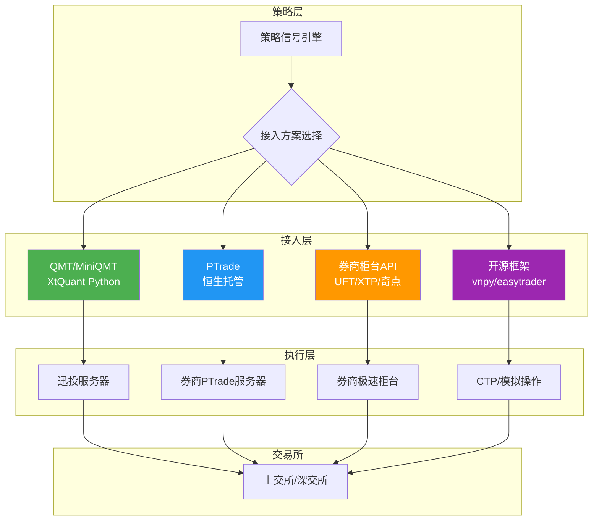
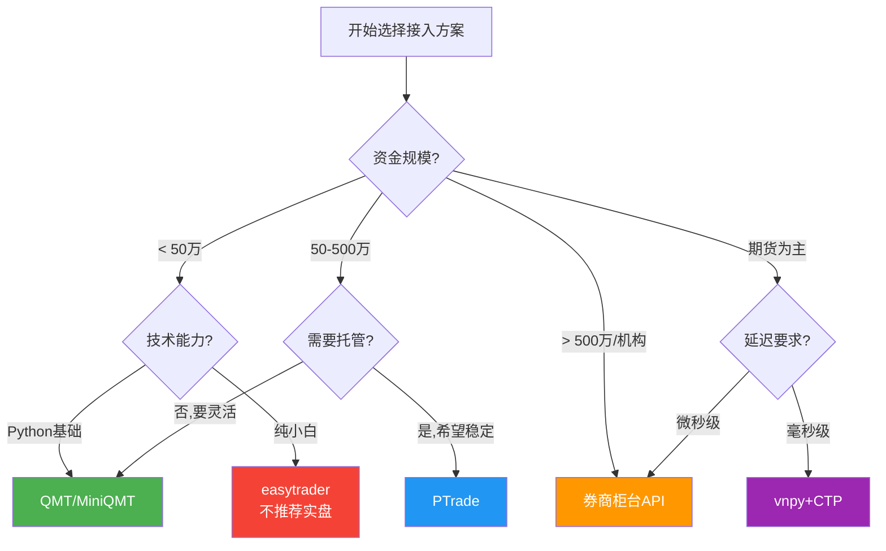

# A股量化实盘接入方案

> [!summary] 核心要点
> - A股量化实盘接入主要有四条路径：**QMT/MiniQMT**（个人最佳起点）、**PTrade**（券商托管）、**券商柜台直连**（机构级）、**开源框架**（灵活但需自运维）
> - QMT 通过 XtQuant Python 库实现程序化交易，门槛最低（部分券商零门槛），支持股票/ETF/两融
> - PTrade 由恒生开发，策略运行在券商服务器端，需 50 万资金门槛，稳定性高但灵活性受限
> - 券商柜台 API（恒生 UFT/中泰 XTP/华鑫奇点/金证）面向机构，延迟可达微秒级
> - 实盘与回测存在 5 大核心差异：网络延迟、滑点、部分成交、拒单/废单、系统故障，需逐一建立应对机制
> - **模拟盘测试至少运行 2-4 周**，覆盖不同市场状态后再切换实盘

## 实盘接入架构总览



## 方案选型决策树



---

## 一、QMT/MiniQMT + XtQuant 实盘接入

### 1.1 方案概述

QMT（迅投极速交易终端）是迅投科技开发的量化交易客户端，被国金证券、中信建投、华鑫证券、东方财富等多家券商采购部署。MiniQMT 是其精简版，专门面向程序化交易，通过 **XtQuant** Python 库提供完整的交易 API。

| 特性 | 说明 |
|------|------|
| 支持品种 | A股、ETF、可转债、两融（部分券商支持期权） |
| 编程语言 | Python 3.8-3.12 |
| 运行模式 | 本地客户端 + Python 脚本 |
| 资金门槛 | 因券商而异，部分零门槛 |
| 延迟级别 | 毫秒级（10-100ms） |
| 操作系统 | Windows（MiniQMT 仅支持 Windows） |

### 1.2 环境搭建步骤

**Step 1: 开户与权限申请**
```
1. 选择支持 QMT 的券商开户（国金、中信建投、华鑫等）
2. 联系客户经理申请开通 MiniQMT 权限
3. 获取 MiniQMT 安装包（与普通QMT不同）
4. 签署量化交易相关协议
```

**Step 2: 安装 MiniQMT 客户端**
```
1. 下载券商专版 MiniQMT 安装包
2. 安装至本地目录（如 D:\国金QMT交易端\）
3. 首次启动输入资金账号和密码登录
4. 确认左下角显示"已连接"状态
```

**Step 3: 安装 XtQuant Python 库**
```bash
# 方法一：pip 安装（推荐，2024年后支持）
pip install XtQuant-pro

# 方法二：从客户端提取
# 1. QMT客户端 → 设置 → 下载Python库
# 2. 复制 Lib/site-packages/xtquant 到你的 Python 环境
# 路径示例：D:\国金QMT交易端\bin\Lib\site-packages\xtquant
#         → C:\Python311\Lib\site-packages\xtquant

# 验证安装
python -c "from xtquant import xttrader, xtdata; print('XtQuant 安装成功')"
```

**Step 4: 配置连接**
```python
# 确保 MiniQMT 客户端已登录并保持运行
# XtQuant 通过本地 socket 与 MiniQMT 通信
# 默认端口：58620（可在客户端设置中查看）
```

### 1.3 完整代码模板：QMT 股票交易

```python
"""
QMT/MiniQMT 实盘交易完整模板
前置条件：MiniQMT 客户端已登录
"""

from xtquant.xttrader import XtQuantTrader, XtQuantTraderCallback
from xtquant.xttype import StockAccount
from xtquant import xtconstant, xtdata
import time
import datetime
import logging

# ═══════════════════════════════════════════
# 日志配置
# ═══════════════════════════════════════════
logging.basicConfig(
    level=logging.INFO,
    format='%(asctime)s [%(levelname)s] %(message)s',
    handlers=[
        logging.FileHandler('qmt_trade.log', encoding='utf-8'),
        logging.StreamHandler()
    ]
)
logger = logging.getLogger(__name__)

# ═══════════════════════════════════════════
# 回调类：成交回报 / 委托回报 / 撤单回报
# ═══════════════════════════════════════════
class MyTraderCallback(XtQuantTraderCallback):
    """交易回调处理"""

    def on_disconnected(self):
        logger.warning("⚠ 与 MiniQMT 断开连接，尝试重连...")

    def on_stock_order(self, order):
        """委托状态变化回调"""
        logger.info(
            f"[委托回报] 代码={order.stock_code} "
            f"方向={'买' if order.order_type == xtconstant.STOCK_BUY else '卖'} "
            f"委托量={order.order_volume} 成交量={order.traded_volume} "
            f"委托价={order.price} 状态={order.order_status} "
            f"委托编号={order.order_id}"
        )

    def on_stock_trade(self, trade):
        """成交回报回调（每笔成交触发）"""
        logger.info(
            f"[成交回报] 代码={trade.stock_code} "
            f"成交价={trade.traded_price} 成交量={trade.traded_volume} "
            f"成交金额={trade.traded_amount} "
            f"成交编号={trade.traded_id}"
        )

    def on_order_error(self, order_error):
        """委托失败回调（拒单/废单）"""
        logger.error(
            f"[委托失败] 委托编号={order_error.order_id} "
            f"错误码={order_error.error_id} "
            f"错误信息={order_error.error_msg}"
        )

    def on_cancel_error(self, cancel_error):
        """撤单失败回调"""
        logger.error(
            f"[撤单失败] 委托编号={cancel_error.order_id} "
            f"错误信息={cancel_error.error_msg}"
        )

    def on_order_stock_async_response(self, response):
        """异步下单回调"""
        logger.info(
            f"[异步下单] 委托编号={response.order_id} "
            f"序列号={response.seq}"
        )


# ═══════════════════════════════════════════
# 交易管理器
# ═══════════════════════════════════════════
class QMTTrader:
    """QMT 实盘交易管理器"""

    def __init__(self, qmt_path: str, account_id: str, session_id: int = 0):
        """
        Args:
            qmt_path: MiniQMT 安装路径，如 r'D:\国金QMT交易端\userdata_mini'
            account_id: 资金账号
            session_id: 会话ID（同一账号多策略时需不同）
        """
        self.qmt_path = qmt_path
        self.account_id = account_id
        self.session_id = session_id
        self.trader = None
        self.account = None
        self.connected = False

    def connect(self) -> bool:
        """连接 MiniQMT"""
        try:
            self.trader = XtQuantTrader(self.qmt_path, self.session_id)
            callback = MyTraderCallback()
            self.trader.register_callback(callback)
            self.trader.start()

            ret = self.trader.connect()
            if ret != 0:
                logger.error(f"连接失败，错误码: {ret}")
                return False

            self.account = StockAccount(self.account_id)
            ret = self.trader.subscribe_account(self.account)
            if ret != 0:
                logger.error(f"订阅账户失败，错误码: {ret}")
                return False

            self.connected = True
            logger.info(f"成功连接 MiniQMT，账户: {self.account_id}")
            return True
        except Exception as e:
            logger.error(f"连接异常: {e}")
            return False

    # ─── 下单 ────────────────────────────
    def buy(self, stock_code: str, price: float, volume: int,
            price_type: int = xtconstant.FIX_PRICE) -> int:
        """
        买入股票
        Args:
            stock_code: 股票代码，如 '600000.SH' 或 '000001.SZ'
            price: 委托价格（市价单时传0）
            volume: 委托数量（必须为100的整数倍）
            price_type: 报价类型
                xtconstant.FIX_PRICE = 限价单
                xtconstant.LATEST_PRICE = 最新价
                xtconstant.MARKET_SH5_BEST = 上海最优五档即时成交
                xtconstant.MARKET_SZ5_BEST = 深圳最优五档即时成交
                xtconstant.MARKET_PEER_PRICE_FIRST = 对手方最优
        Returns:
            order_id: 委托编号，-1表示失败
        """
        if not self._pre_check(stock_code, volume):
            return -1

        order_id = self.trader.order_stock(
            self.account, stock_code,
            xtconstant.STOCK_BUY,
            volume, price_type, price,
            strategy_name='my_strategy',
            order_remark='QMT买入'
        )
        logger.info(
            f"[买入委托] {stock_code} 价格={price} 数量={volume} "
            f"委托编号={order_id}"
        )
        return order_id

    def sell(self, stock_code: str, price: float, volume: int,
             price_type: int = xtconstant.FIX_PRICE) -> int:
        """卖出股票，参数同 buy"""
        if not self._pre_check(stock_code, volume):
            return -1

        order_id = self.trader.order_stock(
            self.account, stock_code,
            xtconstant.STOCK_SELL,
            volume, price_type, price,
            strategy_name='my_strategy',
            order_remark='QMT卖出'
        )
        logger.info(
            f"[卖出委托] {stock_code} 价格={price} 数量={volume} "
            f"委托编号={order_id}"
        )
        return order_id

    # ─── 撤单 ────────────────────────────
    def cancel(self, order_id: int) -> int:
        """撤单，返回0表示成功"""
        ret = self.trader.cancel_order_stock(self.account, order_id)
        logger.info(f"[撤单] 委托编号={order_id} 结果={ret}")
        return ret

    def cancel_all(self):
        """撤销所有未成交委托"""
        orders = self.query_orders()
        for o in orders:
            if o.order_status in [
                xtconstant.ORDER_UNREPORTED,
                xtconstant.ORDER_WAIT_REPORTING,
                xtconstant.ORDER_REPORTED,
                xtconstant.ORDER_PART_SUCC
            ]:
                self.cancel(o.order_id)

    # ─── 查询 ────────────────────────────
    def query_positions(self) -> list:
        """查询持仓"""
        positions = self.trader.query_stock_positions(self.account)
        for p in positions:
            if p.volume > 0:
                logger.info(
                    f"[持仓] {p.stock_code} "
                    f"总量={p.volume} 可用={p.can_use_volume} "
                    f"成本价={p.open_price:.3f} 市值={p.market_value:.2f}"
                )
        return positions

    def query_asset(self):
        """查询资产"""
        asset = self.trader.query_stock_asset(self.account)
        if asset:
            logger.info(
                f"[资产] 总资产={asset.total_asset:.2f} "
                f"现金={asset.cash:.2f} "
                f"持仓市值={asset.market_value:.2f} "
                f"冻结资金={asset.frozen_cash:.2f}"
            )
        return asset

    def query_orders(self) -> list:
        """查询当日委托"""
        return self.trader.query_stock_orders(self.account)

    def query_trades(self) -> list:
        """查询当日成交"""
        return self.trader.query_stock_trades(self.account)

    # ─── 辅助 ────────────────────────────
    def _pre_check(self, stock_code: str, volume: int) -> bool:
        """下单前检查"""
        if not self.connected:
            logger.error("未连接 MiniQMT")
            return False
        if volume <= 0 or volume % 100 != 0:
            logger.error(f"委托数量必须为100的正整数倍，当前: {volume}")
            return False
        if '.' not in stock_code:
            logger.error(f"股票代码格式错误，需含市场后缀: {stock_code}")
            return False
        return True

    def run_forever(self):
        """阻塞主线程，持续接收回调"""
        self.trader.run_forever()


# ═══════════════════════════════════════════
# 使用示例
# ═══════════════════════════════════════════
if __name__ == '__main__':
    # 初始化
    trader = QMTTrader(
        qmt_path=r'D:\国金QMT交易端\userdata_mini',
        account_id='8888888888',  # 替换为真实账号
        session_id=1
    )

    # 连接
    if not trader.connect():
        exit(1)

    # 查询资产和持仓
    trader.query_asset()
    trader.query_positions()

    # 限价买入：600000.SH 100股 @ 10.50
    order_id = trader.buy('600000.SH', 10.50, 100)

    # 等待回报
    time.sleep(3)

    # 查询委托状态
    orders = trader.query_orders()

    # 撤单示例
    # trader.cancel(order_id)

    # 阻塞等待回调
    trader.run_forever()
```

### 1.4 QMT 优缺点

| 优势 | 劣势 |
|------|------|
| Python 原生支持，门槛低 | 仅支持 Windows |
| 多家券商可选 | 需保持 MiniQMT 客户端运行 |
| 支持股票/ETF/两融/可转债 | 延迟毫秒级，不适合高频 |
| XtData 提供行情数据 | 各券商版本可能有差异 |
| 社区文档较丰富 | 非开源，排查问题依赖官方 |

---

## 二、PTrade 实盘接入

### 2.1 方案概述

PTrade 是恒生电子开发的量化交易平台，由券商采购后提供给客户使用。策略代码运行在**券商服务器端**，本质上是一个 Python 策略托管环境。

| 特性 | 说明 |
|------|------|
| 开发商 | 恒生电子 |
| 支持品种 | A股、ETF、可转债、两融、期权 |
| 编程语言 | Python（受限环境，不可 pip install） |
| 运行模式 | 策略托管在券商服务器 |
| 资金门槛 | 一般 50 万元以上 |
| 操作系统 | 客户端 Windows / 服务器 Linux |

### 2.2 申请流程

```
Step 1: 选择支持 PTrade 的券商开户
        └── 国盛、国金、安信、东方财富等
        └── 联系客户经理协商佣金（可低至万1）

Step 2: 满足资金门槛
        └── 账户资产 ≥ 50万元
        └── 完成风险测评（建议积极型/C4及以上）

Step 3: 申请 PTrade 权限
        └── 提交身份证、银行卡等材料
        └── 签署量化交易协议
        └── 等待审核（1-3个工作日）

Step 4: 获取客户端
        └── 客户经理提供专用安装包（券商间不通用）
        └── 分为仿真版和生产版
        └── 首次登录需在交易时段内完成

Step 5: 仿真测试
        └── 先在仿真环境调试策略
        └── 确认稳定后再切换生产环境
```

### 2.3 PTrade 策略编写模板

```python
"""
PTrade 策略模板：均线突破 + 风控
运行环境：PTrade 服务器（Python 受限环境）
"""

def initialize(context):
    """
    初始化函数（仅运行一次）
    - 设置股票池
    - 配置全局变量
    - 注册定时任务
    """
    # ─── 全局参数 ─────────────────────
    g.stock_pool = ['600519.SS', '000858.SZ', '601318.SS']
    g.ma_short = 5       # 短期均线
    g.ma_long = 20       # 长期均线
    g.max_position = 3   # 最大持仓数
    g.stop_loss = -0.05  # 止损线 5%
    g.take_profit = 0.15 # 止盈线 15%

    # ─── 设置股票池 ────────────────────
    set_universe(g.stock_pool)

    # ─── 定时任务 ──────────────────────
    # 每日开盘前运行：准备数据
    run_daily(before_market, '09:15')
    # 每日盘中运行：执行交易
    run_daily(market_open_trade, '09:35')
    # 每日收盘前运行：风控检查
    run_daily(before_close_check, '14:50')
    # 每隔60秒运行：监控持仓
    run_interval(monitor_positions, 60)

    log.info('策略初始化完成')


def before_market(context):
    """盘前准备"""
    log.info(f'=== {context.current_dt} 盘前准备 ===')
    log.info(f'可用资金: {context.portfolio.available_cash:.2f}')
    log.info(f'总资产: {context.portfolio.total_value:.2f}')


def market_open_trade(context):
    """开盘后交易逻辑"""
    positions = context.portfolio.positions

    for stock in g.stock_pool:
        # 获取历史数据
        hist = get_history(30, '1d', 'close', stock, fq='pre')
        if len(hist) < g.ma_long:
            continue

        ma_s = hist[-g.ma_short:].mean()
        ma_l = hist[-g.ma_long:].mean()
        current_price = hist.iloc[-1]

        has_position = stock in positions and positions[stock].amount > 0

        # 买入信号：短均线上穿长均线
        if ma_s > ma_l * 1.01 and not has_position:
            current_positions = sum(
                1 for s, p in positions.items() if p.amount > 0
            )
            if current_positions < g.max_position:
                # 等权分配
                cash_per_stock = context.portfolio.available_cash / (
                    g.max_position - current_positions
                )
                order_value(stock, cash_per_stock)
                log.info(f'买入 {stock} 金额 {cash_per_stock:.0f}')

        # 卖出信号：短均线下穿长均线
        elif ma_s < ma_l * 0.99 and has_position:
            order_target(stock, 0)
            log.info(f'卖出 {stock}')


def monitor_positions(context):
    """持仓监控：止盈止损"""
    for stock, pos in context.portfolio.positions.items():
        if pos.amount <= 0:
            continue

        # 计算收益率
        pnl_ratio = (pos.price - pos.avg_cost) / pos.avg_cost

        # 止损
        if pnl_ratio < g.stop_loss:
            order_target(stock, 0)
            log.warn(f'止损卖出 {stock} 亏损 {pnl_ratio:.2%}')

        # 止盈
        elif pnl_ratio > g.take_profit:
            order_target(stock, 0)
            log.info(f'止盈卖出 {stock} 盈利 {pnl_ratio:.2%}')


def before_close_check(context):
    """收盘前检查"""
    log.info(f'=== 收盘前检查 ===')
    log.info(f'今日收益: {context.portfolio.returns:.4%}')

    # 取消所有未成交委托
    open_orders = get_open_orders()
    for oid, o in open_orders.items():
        cancel_order(oid)
        log.info(f'撤单: {o.security} 委托编号={oid}')


def handle_data(context, data):
    """
    每个bar触发（1分钟/1天）
    本策略主要逻辑在定时任务中，此处可留空或做辅助检查
    """
    pass
```

### 2.4 PTrade 常用 API 速查

| 函数 | 用途 | 示例 |
|------|------|------|
| `order(sec, amount)` | 按股数下单（正买负卖） | `order('600519.SS', 100)` |
| `order_target(sec, amount)` | 调整至目标股数 | `order_target('600519.SS', 0)` |
| `order_value(sec, value)` | 按金额下单 | `order_value('600519.SS', 50000)` |
| `order_target_value(sec, value)` | 调整至目标市值 | `order_target_value('600519.SS', 100000)` |
| `cancel_order(order_id)` | 撤单 | `cancel_order(12345)` |
| `get_open_orders()` | 未成交委托 | `orders = get_open_orders()` |
| `get_history(count, unit, field, sec)` | 历史数据 | 见上方代码 |
| `run_daily(func, time)` | 每日定时 | `run_daily(func, '09:30')` |
| `run_interval(func, seconds)` | 间隔定时（>=3秒） | `run_interval(func, 60)` |
| `set_universe(stocks)` | 设置股票池 | `set_universe(['600519.SS'])` |

### 2.5 PTrade 优缺点

| 优势 | 劣势 |
|------|------|
| 策略运行在券商服务器，稳定性极高 | 资金门槛 50 万 |
| 无需本地维护，断网不影响 | Python 环境受限，不能 pip install |
| 券商间数据隔离，安全性好 | 各券商版本差异，不通用 |
| 内置回测 + 模拟 + 实盘全链路 | 灵活性差，无法使用外部库 |
| 定时任务原生支持 | 调试困难，日志查看不便 |

---

## 三、券商柜台系统 API 接入

### 3.1 主流柜台系统对比

| 柜台系统 | 开发商 | 支持品种 | 延迟级别 | 接口语言 | 典型券商 |
|----------|--------|----------|----------|----------|----------|
| **恒生UFT** | 恒生电子 | 期货、ETF期权 | <250ns（极速） | C++/Python(vnpy) | 多数主流券商 |
| **中泰XTP** | 中泰证券 | A股、ETF期权 | 微秒级 | C++/Python(vnpy) | 中泰证券 |
| **华鑫奇点(TORA)** | 华鑫证券 | A股、ETF期权 | 微秒级 | C++/Python(vnpy) | 华鑫证券 |
| **金证极速** | 金证股份 | 多品种 | 微秒级 | C++ | 多家券商 |
| **恒生UFX** | 恒生电子 | 统一接入 | 毫秒级 | C++/Java | 多家券商 |

> [!important] 柜台 API 接入门槛
> 券商柜台 API 主要面向**机构客户**或**高净值个人**（通常 500 万以上），需签署专门的接入协议。个人投资者一般通过 QMT 或 PTrade 间接使用柜台通道。

### 3.2 通过 vnpy 接入券商柜台

vnpy（VeighNa）框架提供了多个券商柜台的 Python 网关封装：

```python
"""
vnpy 接入券商柜台示例
支持：恒生UFT / 中泰XTP / 华鑫奇点(TORA)
"""
from vnpy.event import EventEngine
from vnpy.trader.engine import MainEngine
from vnpy.trader.object import SubscribeRequest, OrderRequest
from vnpy.trader.constant import Exchange, Direction, OrderType, Offset

# ─── 选择网关 ──────────────────────────
# 恒生UFT：
# from vnpy_uft import UftGateway as Gateway
# GATEWAY_NAME = "UFT"

# 中泰XTP：
from vnpy_xtp import XtpGateway as Gateway
GATEWAY_NAME = "XTP"

# 华鑫奇点：
# from vnpy_tora import ToraGateway as Gateway
# GATEWAY_NAME = "TORA"


def main():
    event_engine = EventEngine()
    main_engine = MainEngine(event_engine)
    main_engine.add_gateway(Gateway)

    # 连接配置（以 XTP 为例）
    setting = {
        "账号": "your_account",
        "密码": "your_password",
        "客户号": 1,
        "行情地址": "120.27.164.138",
        "行情端口": 6002,
        "交易地址": "120.27.164.69",
        "交易端口": 6001,
        "行情协议": "TCP",
        "授权码": "your_auth_code"
    }

    main_engine.connect(setting, GATEWAY_NAME)

    # 等待连接
    import time
    time.sleep(5)

    # 订阅行情
    req = SubscribeRequest(
        symbol="600000",
        exchange=Exchange.SSE
    )
    main_engine.subscribe(req, GATEWAY_NAME)

    # 下单
    order_req = OrderRequest(
        symbol="600000",
        exchange=Exchange.SSE,
        direction=Direction.LONG,
        type=OrderType.LIMIT,
        volume=100,
        price=10.50,
        offset=Offset.NONE  # 股票无开平概念
    )
    vt_orderid = main_engine.send_order(order_req, GATEWAY_NAME)
    print(f"委托编号: {vt_orderid}")


if __name__ == "__main__":
    main()
```

### 3.3 各柜台 API 接入要点

**恒生 UFT**
- 全内存交易架构，订单处理 <1ms
- 通过 UFX 统一接入层可屏蔽后端差异
- 需要券商分配 token 和接入地址
- 适合期货和 ETF 期权高频交易

**中泰 XTP**
- 中泰证券自主研发，文档相对完善
- 提供 C++ SDK 和 Python 封装
- 支持两融和 ETF 期权
- GitHub 有官方示例代码

**华鑫奇点 (TORA)**
- 华鑫证券自主研发
- vnpy 社区版 gateway 支持较好
- 支持 A 股和 ETF 期权
- 适合中低频量化交易

**金证极速**
- 与恒生并列的主流柜台供应商
- 高并发 TPS 达 1500 万/秒
- 主要面向机构客户
- 接入需与券商 IT 部门对接

---

## 四、开源方案

### 4.1 vnpy + CTP/Mini（期货专用）

> [!warning] CTP 不支持 A 股股票交易
> CTP/CTP Mini 接口仅支持**国内期货和期货期权**，不能直接交易 A 股股票。A 股股票需通过 vnpy 的券商柜台网关（XTP/TORA/UFT）接入。

```python
"""
vnpy + CTP 期货交易示例
适用：国内期货、期货期权
"""
from vnpy.event import EventEngine
from vnpy.trader.engine import MainEngine
from vnpy_ctp import CtpGateway
from vnpy_ctastrategy import CtaStrategyApp

event_engine = EventEngine()
main_engine = MainEngine(event_engine)

# 加载 CTP 网关
main_engine.add_gateway(CtpGateway)

# 加载 CTA 策略引擎
cta_engine = main_engine.add_app(CtaStrategyApp)

# CTP 连接配置
ctp_setting = {
    "用户名": "your_investor_id",
    "密码": "your_password",
    "经纪商代码": "9999",  # SimNow: 9999
    "交易服务器": "180.168.146.187:10201",
    "行情服务器": "180.168.146.187:10211",
    "产品名称": "simnow_client_test",
    "授权编码": "your_auth_code",
    "产品信息": ""
}

main_engine.connect(ctp_setting, "CTP")
```

**CTP 接入要点**：
- 开户期货公司后申请 CTP 权限
- SimNow 提供免费模拟环境（仿真测试首选）
- CTP Mini 是 CTP 的精简版，功能相同，部分期货公司提供
- 支持 GFD/FAK/FOK 等多种报单类型

### 4.2 easytrader 方案（高风险，不推荐实盘）

> [!danger] 风险警告
> easytrader 通过**模拟键盘/鼠标操作**券商客户端实现交易，存在严重风险：
> - 券商反作弊系统可能识别并**冻结账户**
> - 客户端 UI 升级后立即**失效**
> - **违反**券商用户协议，可能被永久封号
> - 延迟高（秒级），完全不适合任何频率的实盘交易
> - 无法获取可靠的成交回报

```python
# easytrader 示例（仅供了解，不推荐实盘使用）
import easytrader

user = easytrader.use('ths')  # 同花顺
user.connect(r'C:\同花顺\xiadan.exe')

# 买入
user.buy('600000', price=10.5, amount=100)

# 查持仓
positions = user.position
print(positions)

# 风险：以上操作实际是模拟鼠标点击，极不稳定
```

**替代建议**：如果资金量不够开通 QMT/PTrade，建议：
1. 先用 [[A股回测框架实战与避坑指南|回测框架]] 充分验证策略
2. 使用聚宽/米筐等云平台的模拟交易功能
3. 积累到门槛后再接入正式交易通道

### 4.3 akshare + 券商 Web 端方案

部分开发者尝试通过 akshare 获取数据 + 券商 Web 端/APP 端 API 实现交易。此方案存在以下问题：

| 风险项 | 说明 |
|--------|------|
| 合规性 | 抓取 Web 端接口可能违反用户协议 |
| 稳定性 | 接口随时可能变更，无 SLA 保障 |
| 安全性 | 需在代码中存储登录凭证 |
| 延迟 | HTTP 请求延迟较高（数百毫秒） |

> [!tip] 推荐组合
> akshare 适合作为**数据源**（获取行情、财务数据），但交易执行应通过正规 API（QMT/PTrade/柜台API）完成。参见 [[A股量化数据源全景图]]。

---

## 五、方案对比矩阵

| 维度 | QMT/MiniQMT | PTrade | 券商柜台API | vnpy+CTP | easytrader |
|------|:-----------:|:------:|:----------:|:--------:|:----------:|
| **延迟** | 10-100ms | 10-50ms | <1ms | 1-10ms | 1-5s |
| **稳定性** | 中高 | 高 | 极高 | 高 | 极低 |
| **资金门槛** | 0-30万 | 50万+ | 500万+/机构 | 期货开户即可 | 无 |
| **技术门槛** | 低 | 低 | 高 | 中 | 低 |
| **品种覆盖** | 股票/ETF/两融 | 股票/ETF/期权 | 全品种 | 期货/期权 | 股票 |
| **操作系统** | Windows | Windows客户端 | Linux/Windows | 全平台 | Windows |
| **是否开源** | 否 | 否 | 否（vnpy封装开源） | 是 | 是 |
| **成交回报** | 实时回调 | 服务端推送 | 实时回调 | 实时回调 | 不可靠 |
| **运维成本** | 中（需开机） | 低（券商托管） | 高（自建） | 中 | 高（频繁失效） |
| **适合场景** | 个人中低频 | 个人/小私募 | 机构/高频 | 期货CTA | 不推荐 |

---

## 六、实盘 vs 回测差异处理

实盘交易面临 5 类核心异常，回测中通常不会出现。参见 [[A股回测框架实战与避坑指南]] 中关于回测偏差的讨论。

### 6.1 异常类型与应对策略

#### 异常一：网络延迟与滑点

**现象**：信号产生到订单执行存在 10ms-数秒延迟，实际成交价与预期偏离。

**影响**：回测假设以收盘价/信号价成交，实盘滑点可能导致年化收益偏差 30-40%。

```python
# ═══ 滑点应对：自适应滑点模型 ═══
class SlippageManager:
    """实盘滑点管理"""

    def __init__(self, base_slippage_bps: float = 5.0):
        """
        Args:
            base_slippage_bps: 基础滑点（基点），5bps = 0.05%
        """
        self.base_slippage = base_slippage_bps / 10000
        self.actual_slippages = []  # 实际滑点记录

    def adjust_price(self, signal_price: float, direction: str,
                     volatility: float = 0.02) -> float:
        """
        根据方向和波动率调整限价单价格
        Args:
            signal_price: 信号价格
            direction: 'buy' 或 'sell'
            volatility: 当前波动率
        """
        # 动态滑点 = 基础滑点 * (1 + 波动率放大系数)
        dynamic_slip = self.base_slippage * (1 + volatility * 10)

        if direction == 'buy':
            return round(signal_price * (1 + dynamic_slip), 2)
        else:
            return round(signal_price * (1 - dynamic_slip), 2)

    def record_slippage(self, expected_price: float, actual_price: float):
        """记录实际滑点，用于模型校准"""
        slip = abs(actual_price - expected_price) / expected_price
        self.actual_slippages.append(slip)

        # 滚动更新基础滑点（最近100笔均值 * 1.5安全系数）
        if len(self.actual_slippages) > 100:
            self.actual_slippages = self.actual_slippages[-100:]
        if len(self.actual_slippages) >= 20:
            self.base_slippage = (
                sum(self.actual_slippages) / len(self.actual_slippages) * 1.5
            )
```

#### 异常二：部分成交

**现象**：委托 1000 股，仅成交 300 股，剩余 700 股挂单。在流动性差的小盘股或涨跌停板附近尤为常见。

```python
# ═══ 部分成交处理 ═══
class PartialFillHandler:
    """部分成交处理器"""

    def __init__(self, max_wait_seconds: int = 30, max_retry: int = 3):
        self.max_wait = max_wait_seconds
        self.max_retry = max_retry

    def handle_partial_fill(self, trader, order_id: int,
                            target_volume: int, filled_volume: int,
                            stock_code: str, direction: str):
        """
        处理部分成交
        策略：等待 → 撤单 → 以新价格重挂剩余量
        """
        remaining = target_volume - filled_volume

        if remaining <= 0:
            return  # 已全部成交

        # Step 1: 等待一段时间看是否继续成交
        import time
        time.sleep(min(self.max_wait, 10))

        # Step 2: 查询最新成交量
        order = trader.query_order(order_id)
        if order and order.traded_volume >= target_volume:
            return  # 等待期间已全部成交

        # Step 3: 撤销剩余挂单
        trader.cancel(order_id)
        time.sleep(1)

        # Step 4: 获取最新价重新下单
        latest_price = get_latest_price(stock_code)
        new_remaining = target_volume - order.traded_volume

        if new_remaining >= 100:  # A股最小交易单位
            if direction == 'buy':
                # 适当提高价格以确保成交
                new_price = round(latest_price * 1.002, 2)
                trader.buy(stock_code, new_price, new_remaining)
            else:
                new_price = round(latest_price * 0.998, 2)
                trader.sell(stock_code, new_price, new_remaining)
```

#### 异常三：拒单

**现象**：委托被交易所或券商风控拒绝，常见原因包括：涨跌停限制、资金不足、持仓不足、股票停牌/ST限制、频率限制。

```python
# ═══ 拒单处理 ═══
REJECT_REASONS = {
    # 错误码: (原因, 是否可重试, 建议处理)
    'INSUFFICIENT_FUND': ('资金不足', False, '降低委托量或等待资金释放'),
    'INSUFFICIENT_POSITION': ('持仓不足', False, '核实可用持仓（T+1限制）'),
    'PRICE_LIMIT': ('涨跌停限制', True, '调整价格至涨跌停价'),
    'SUSPENDED': ('停牌', False, '从交易列表移除'),
    'FREQ_LIMIT': ('频率限制', True, '延迟后重试'),
    'RISK_CONTROL': ('风控拦截', False, '检查风控规则'),
}

def handle_rejection(error_code: str, stock_code: str,
                     order_params: dict) -> dict:
    """
    处理拒单，返回处理建议
    Returns:
        {'action': 'retry'|'skip'|'adjust', 'params': {...}}
    """
    reason, retryable, suggestion = REJECT_REASONS.get(
        error_code, ('未知错误', False, '人工检查')
    )

    logger.warning(
        f"[拒单] {stock_code} 原因={reason} "
        f"可重试={retryable} 建议={suggestion}"
    )

    if error_code == 'PRICE_LIMIT':
        # 调整至涨跌停价
        limit_price = get_limit_price(stock_code, order_params['direction'])
        return {
            'action': 'adjust',
            'params': {**order_params, 'price': limit_price}
        }
    elif retryable:
        return {'action': 'retry', 'params': order_params}
    else:
        return {'action': 'skip', 'params': {}}
```

#### 异常四：废单

**现象**：委托参数错误导致订单无效，常见于：价格不在合法范围、数量非100整数倍、代码错误、超出权限范围。

```python
# ═══ 下单前校验（预防废单） ═══
def validate_order(stock_code: str, price: float, volume: int,
                   direction: str, account_info: dict) -> tuple:
    """
    下单前全面校验
    Returns:
        (is_valid: bool, error_msg: str)
    """
    errors = []

    # 1. 代码格式校验
    if not stock_code or '.' not in stock_code:
        errors.append(f'代码格式错误: {stock_code}')

    # 2. 数量校验
    if volume <= 0:
        errors.append(f'数量必须为正: {volume}')
    if volume % 100 != 0:
        errors.append(f'数量必须为100整数倍: {volume}')

    # 3. 价格校验
    if price <= 0:
        errors.append(f'价格必须为正: {price}')

    # 检查涨跌停价
    prev_close = get_prev_close(stock_code)
    if prev_close:
        upper_limit = round(prev_close * 1.10, 2)  # 主板10%
        lower_limit = round(prev_close * 0.90, 2)
        # 创业板/科创板20%
        if stock_code.startswith(('300', '301', '688')):
            upper_limit = round(prev_close * 1.20, 2)
            lower_limit = round(prev_close * 0.80, 2)
        # ST股5%
        # 北交所30%

        if not (lower_limit <= price <= upper_limit):
            errors.append(
                f'价格超出涨跌停范围: {price} '
                f'(允许 {lower_limit}-{upper_limit})'
            )

    # 4. 资金/持仓校验
    if direction == 'buy':
        required = price * volume
        if required > account_info.get('available_cash', 0):
            errors.append(
                f'资金不足: 需要 {required:.2f} '
                f'可用 {account_info["available_cash"]:.2f}'
            )
    elif direction == 'sell':
        available = get_available_volume(stock_code, account_info)
        if volume > available:
            errors.append(
                f'可卖数量不足: 需要 {volume} 可用 {available}'
            )

    # 5. 交易时间校验
    if not is_trading_time():
        errors.append('当前非交易时间')

    if errors:
        return False, '; '.join(errors)
    return True, ''
```

#### 异常五：系统故障

**现象**：网络断线、API 超时、券商系统宕机、本地程序崩溃。

```python
# ═══ 系统故障恢复 ═══
class FaultRecovery:
    """系统故障恢复管理"""

    def __init__(self, trader, state_file='trade_state.json'):
        self.trader = trader
        self.state_file = state_file

    def save_state(self, pending_orders: list, positions: dict):
        """定期保存交易状态（每30秒）"""
        import json
        state = {
            'timestamp': datetime.datetime.now().isoformat(),
            'pending_orders': [
                {'stock': o.stock_code, 'volume': o.volume,
                 'price': o.price, 'direction': o.direction,
                 'order_id': o.order_id}
                for o in pending_orders
            ],
            'target_positions': positions
        }
        with open(self.state_file, 'w') as f:
            json.dump(state, f, ensure_ascii=False, indent=2)

    def recover(self):
        """
        故障恢复流程：
        1. 加载上次保存的状态
        2. 查询当前实际持仓
        3. 对比目标持仓与实际持仓
        4. 补齐差异
        """
        import json
        try:
            with open(self.state_file, 'r') as f:
                state = json.load(f)
        except FileNotFoundError:
            logger.info("无历史状态文件，跳过恢复")
            return

        logger.info(f"开始故障恢复，上次状态时间: {state['timestamp']}")

        # 查询当前实际持仓
        actual_positions = {}
        for p in self.trader.query_positions():
            if p.volume > 0:
                actual_positions[p.stock_code] = p.volume

        # 对比并补齐
        target = state.get('target_positions', {})
        for stock, target_vol in target.items():
            actual_vol = actual_positions.get(stock, 0)
            diff = target_vol - actual_vol

            if diff > 0 and diff >= 100:
                logger.info(f"恢复买入: {stock} {diff}股")
                # 以最新价买入
                price = get_latest_price(stock)
                self.trader.buy(stock, price, diff)
            elif diff < 0 and abs(diff) >= 100:
                logger.info(f"恢复卖出: {stock} {abs(diff)}股")
                price = get_latest_price(stock)
                self.trader.sell(stock, price, abs(diff))
```

### 6.2 实盘与回测差异汇总

| 差异项 | 回测假设 | 实盘现实 | 影响程度 | 应对方法 |
|--------|----------|----------|----------|----------|
| 成交价 | 信号价即成交价 | 存在滑点 | 高 | 自适应滑点模型 |
| 成交量 | 全部成交 | 可能部分成交 | 高 | 部分成交处理器 |
| 委托拒绝 | 不存在 | 多种原因拒单 | 中 | 拒单分类处理 |
| 系统可用性 | 100% | 可能断线/宕机 | 高 | 状态持久化 + 自动恢复 |
| 交易成本 | 固定费率 | 佣金+印花税+过户费 | 中 | 精确费用模型 |
| T+1限制 | 可能遗漏 | 当日买入不可卖出 | 高 | 持仓日期标记 |
| 涨跌停 | 可能忽略 | 涨停买不到/跌停卖不出 | 高 | 涨跌停过滤 |

---

## 七、模拟盘测试最佳实践

### 7.1 模拟盘测试清单

- [ ] **环境验证**：模拟盘环境与实盘环境配置一致
- [ ] **连接测试**：API 连接、断线重连、心跳检测
- [ ] **下单测试**：限价单、市价单、各种报价类型
- [ ] **撤单测试**：正常撤单、部分成交后撤单
- [ ] **查询测试**：资产查询、持仓查询、委托查询、成交查询
- [ ] **回调测试**：成交回报、委托回报、错误回报是否正常接收
- [ ] **边界测试**：涨跌停价下单、最小单位（100股）下单
- [ ] **异常测试**：错误代码下单、超出资金下单、非交易时间下单
- [ ] **并发测试**：同时下多笔委托，观察处理顺序和回报
- [ ] **持续运行**：连续运行 5 个交易日，观察稳定性
- [ ] **市场覆盖**：在震荡市、趋势市、极端行情（涨停潮/跌停潮）中测试
- [ ] **日志完整性**：所有操作是否有完整日志记录
- [ ] **对账**：模拟盘持仓与策略记录是否一致

### 7.2 模拟盘到实盘的切换流程

```
Phase 1: 纯模拟（2-4周）
├── 验证所有交易功能正常
├── 观察策略在不同市场状态下的表现
├── 对比模拟盘结果与回测结果的偏差
└── 偏差 > 20% 需排查原因

Phase 2: 小资金实盘（2-4周）
├── 使用最小仓位（如1手）测试
├── 验证实盘成交回报与模拟盘一致
├── 记录实际滑点数据校准模型
└── 确认风控规则生效

Phase 3: 逐步加仓（持续）
├── 每周增加 20-30% 仓位
├── 监控策略容量上限
├── 关注市场冲击成本变化
└── 建立实盘绩效基准线
```

---

## 八、参数速查表

### 8.1 交易接口参数

| 参数 | QMT/XtQuant | PTrade | vnpy |
|------|-------------|--------|------|
| 股票代码格式 | `600000.SH` / `000001.SZ` | `600000.SS` / `000001.SZ` | `600000` + Exchange.SSE |
| 买入方向 | `xtconstant.STOCK_BUY` | `order(sec, +amount)` | `Direction.LONG` |
| 卖出方向 | `xtconstant.STOCK_SELL` | `order(sec, -amount)` | `Direction.SHORT` |
| 限价单 | `xtconstant.FIX_PRICE` | 默认 | `OrderType.LIMIT` |
| 市价单 | `xtconstant.LATEST_PRICE` | `order_market()` | `OrderType.MARKET` |
| 最小单位 | 100股 | 100股 | 100股 |
| 价格精度 | 0.01元 | 0.01元 | 0.01元 |

### 8.2 交易时间参数

| 时段 | 时间 | 可执行操作 |
|------|------|-----------|
| 集合竞价（开盘） | 09:15-09:25 | 可委托/撤单（09:20后不可撤单） |
| 连续竞价（上午） | 09:30-11:30 | 正常交易 |
| 午间休市 | 11:30-13:00 | 可委托，不会即时成交 |
| 连续竞价（下午） | 13:00-14:57 | 正常交易 |
| 收盘集合竞价 | 14:57-15:00 | 可委托，不可撤单 |

详细交易制度参见 [[A股交易制度全解析]]。

### 8.3 交易费用参数

| 费用项 | 费率 | 备注 |
|--------|------|------|
| 券商佣金 | 万1-万3 | 双向收取，最低5元 |
| 印花税 | 0.05% | 仅卖出时收取（2023.8起降至0.05%） |
| 过户费 | 0.001% | 双向收取 |
| ETF佣金 | 万0.5-万2 | 部分券商免最低5元限制 |
| 可转债佣金 | 万0.1-万1 | 部分券商有优惠 |

---

## 九、实盘部署检查清单（20项）

### 系统环境（5项）
- [ ] 1. 操作系统版本确认，已安装所有安全补丁
- [ ] 2. Python 环境独立（virtualenv/conda），依赖版本锁定
- [ ] 3. 网络连接稳定，延迟 <50ms，配置备用网络
- [ ] 4. 服务器时间与交易所时间同步（NTP校时）
- [ ] 5. 磁盘空间充足（日志/数据至少预留 10GB）

### 交易接口（5项）
- [ ] 6. API 连接正常，心跳检测通过
- [ ] 7. 账户权限已开通（交易/行情/两融等）
- [ ] 8. 断线重连机制已测试并正常工作
- [ ] 9. 模拟盘测试完成，已运行至少 2 周
- [ ] 10. 成交回报回调函数已注册并验证

### 策略配置（5项）
- [ ] 11. 策略参数已从回测最优参数适当放宽（留安全边际）
- [ ] 12. 标的池已过滤 ST、停牌、涨跌停股票
- [ ] 13. 滑点模型已校准（使用模拟盘实际数据）
- [ ] 14. 交易成本模型包含佣金+印花税+过户费
- [ ] 15. T+1 限制已在代码中处理

### 风控运维（5项）
- [ ] 16. 单笔最大委托金额限制已设置
- [ ] 17. 单日最大交易次数/金额限制已设置
- [ ] 18. 止损线已配置（个股级 + 账户级）
- [ ] 19. 日志系统已配置，包含操作日志和错误日志
- [ ] 20. 异常告警已配置（短信/微信/邮件），关键人可接收

---

## 十、常见误区

> [!warning] 误区一：回测收益 = 实盘收益
> 回测忽略了滑点、部分成交、涨跌停限制、T+1 等因素。实盘收益通常比回测低 30-50%。务必在回测中设置保守的滑点和手续费参数。

> [!warning] 误区二：easytrader 可以长期用于实盘
> 模拟键盘操作方案风险极高，券商 UI 升级即失效，反作弊检测可能冻结账户。即使短期能用，也不应作为生产方案。

> [!warning] 误区三：MiniQMT 不需要保持运行
> XtQuant 通过本地 socket 与 MiniQMT 通信，MiniQMT 客户端必须保持登录状态。建议配置开机自启动和断线重连。

> [!warning] 误区四：PTrade 可以使用任意 Python 库
> PTrade 运行在券商服务器的沙箱环境中，不能自由 pip install。需要使用其内置的库（pandas、numpy、talib 等），复杂需求需提前确认。

> [!warning] 误区五：模拟盘跑通就可以上实盘
> 模拟盘和实盘存在差异：模拟盘通常100%成交、无滑点、无资金限制。必须先用小资金实盘验证，再逐步加仓。

> [!warning] 误区六：低频策略不需要关注延迟
> 即使是日频策略，在集合竞价和开盘时段的延迟也会显著影响执行效果。特别是在热门股票或极端行情中。

> [!warning] 误区七：一个策略可以无限扩容
> 策略存在容量上限。当资金量增大时，市场冲击成本急剧上升，尤其是小盘股策略。需要监控冲击成本并控制单策略资金上限。

---

## 十一、相关笔记

- [[A股量化交易平台深度对比]] - 各平台功能对比与选型
- [[A股交易制度全解析]] - 交易制度与规则
- [[A股市场微观结构深度研究]] - 市场微观结构与流动性
- [[量化研究Python工具链搭建]] - Python 环境配置
- [[A股回测框架实战与避坑指南]] - 回测框架与常见陷阱
- [[量化数据工程实践]] - 数据工程实践
- [[A股量化数据源全景图]] - 数据源与 API
- [[A股多因子选股策略开发全流程]] - 策略开发全流程
- [[A股衍生品市场与对冲工具]] - 期货期权相关
- [[量化策略的服务器部署与自动化]] — 策略上线后的服务器选型、Docker部署与定时任务
- [[量化系统监控与运维]] — 实盘运行中的监控告警、日志管理与容灾方案

---

## 来源参考

1. 迅投 QMT/XtQuant 官方文档 - https://dict.thinktrader.net/nativeApi/ & https://docs.thinktrader.net/
2. vnpy/VeighNa 官方文档 - https://www.vnpy.com/docs/cn/community/info/gateway.html
3. PTrade 量化交易使用指南 - https://quants.site/tutorial/strategy-frame/
4. 恒生电子开放平台（UFT/UFX）- https://www.hs.net/openplat-front/
5. 中泰 XTP 官方 GitHub - https://github.com/ztsec/xtp
6. XtQuant-pro PyPI 文档 - https://pypi.org/project/XtQuant-pro/
7. vnpy 社区论坛 QMT 接入讨论 - https://www.vnpy.com/forum/topic/33667
8. easytrader GitHub - https://github.com/shidenggui/easytrader
9. 量化实盘与回测差异研究 - https://bigquant.com/wiki/doc/muD2XDiJRG
10. A股交易费用制度 - 中国证监会 & 沪深交易所公告

---

*本笔记最后更新：2026-03-24*
