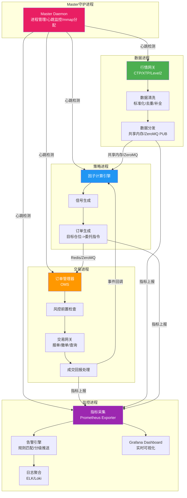
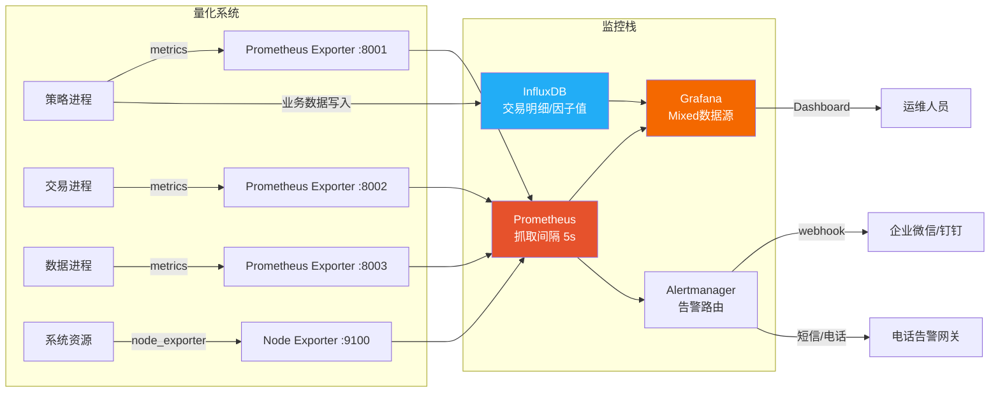
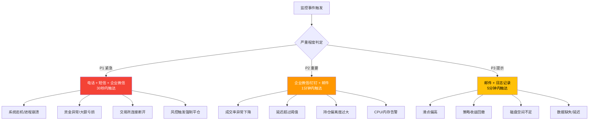
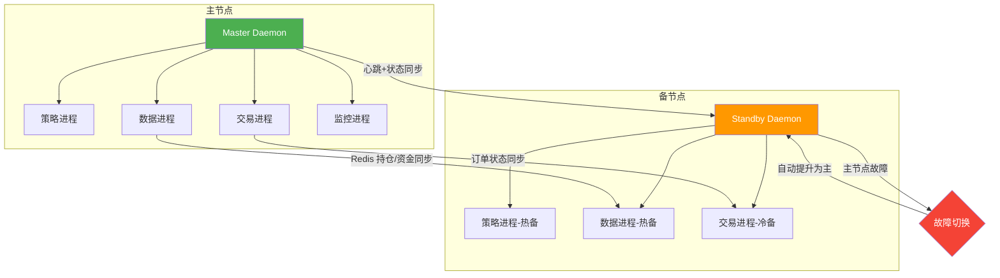

# 量化系统监控与运维

> [!summary] 核心要点
> - 量化系统采用**四进程分离架构**（策略/数据/交易/监控），通过 ZeroMQ/Redis/共享内存实现低延迟进程间通信，单进程崩溃不影响全局
> - 实时监控基于 **Grafana + Prometheus + InfluxDB** 三件套，核心指标覆盖委托延迟、成交率、滑点、资金利用率、持仓偏离度
> - 告警分三级：**P1（电话+短信）/ P2（企业微信/钉钉）/ P3（邮件/日志）**，确保关键事件 30 秒内触达负责人
> - 日志管理采用 **ELK Stack** 或 **Loki** 方案，策略/交易/系统日志分级存储，热数据 7 天、温数据 90 天、冷数据 1 年+
> - 容灾方案覆盖主备热切换（RTO < 60s）、断线自动重连、异常持仓自动冻结与人工确认机制
> - 自动化运维实现全流程无人值守：开盘前检查 -> 盘中监控 -> 收盘后对账结算 -> 定时数据更新

## 一、系统架构设计：四进程分离

### 1.1 架构总览

量化交易系统的核心设计原则是**进程隔离、故障不扩散**。将系统拆分为四个独立进程，任何一个进程崩溃不影响其他进程运行，master 守护进程负责监控和重启。



### 1.2 各进程职责

| 进程 | 核心职责 | 关键特性 | 通信方式 |
|------|---------|---------|---------|
| **数据进程** | 行情接收、清洗、存储、分发 | 多源容错（CTP+XTP 互备）、PIT 一致性 | 共享内存（写）、ZeroMQ PUB |
| **策略进程** | 因子计算、信号生成、目标仓位计算 | 单进程单线程（避免线程安全问题）、可多实例 | 共享内存（读）、Redis（持仓/资金） |
| **交易进程** | 订单管理、风控前置、报单执行、成交回报 | OMS 状态机、SOR 智能路由、TWAP/VWAP 算法单 | Redis（订单队列）、ZeroMQ REQ/REP |
| **监控进程** | 指标采集、告警推送、日志聚合、可视化 | 独立于业务进程、无侵入式采集 | Prometheus pull、HTTP push |

### 1.3 进程间通信方案

```python
"""
进程间通信核心模块 — 基于 ZeroMQ + Redis + 共享内存
"""
import zmq
import redis
import mmap
import struct
import json
import time
from typing import Dict, Optional
from dataclasses import dataclass, asdict

# ============================================================
# 1. 共享内存通信（行情数据，延迟 < 2μs）
# ============================================================
@dataclass
class TickData:
    symbol: str
    last_price: float
    volume: int
    timestamp: float

class SharedMemoryChannel:
    """共享内存通道：单写多读，用于行情数据分发"""

    TICK_SIZE = 256  # 每个 tick 固定大小
    MAX_SYMBOLS = 5000

    def __init__(self, name: str = "/quant_shm", create: bool = False):
        self.size = self.TICK_SIZE * self.MAX_SYMBOLS
        if create:
            # 数据进程创建共享内存
            self.fd = open(f"/dev/shm{name}", "w+b")
            self.fd.truncate(self.size)
        else:
            self.fd = open(f"/dev/shm{name}", "r+b")
        self.mm = mmap.mmap(self.fd.fileno(), self.size)

    def write_tick(self, slot: int, tick: TickData):
        """数据进程写入 tick（无锁写入）"""
        offset = slot * self.TICK_SIZE
        data = json.dumps(asdict(tick)).encode().ljust(self.TICK_SIZE, b'\x00')
        self.mm[offset:offset + self.TICK_SIZE] = data

    def read_tick(self, slot: int) -> Optional[TickData]:
        """策略进程读取 tick（无锁读取）"""
        offset = slot * self.TICK_SIZE
        raw = self.mm[offset:offset + self.TICK_SIZE].rstrip(b'\x00')
        if raw:
            d = json.loads(raw)
            return TickData(**d)
        return None

# ============================================================
# 2. ZeroMQ 通信（策略信号 -> 交易引擎）
# ============================================================
class ZMQPublisher:
    """ZeroMQ 发布者：策略进程发出交易信号"""

    def __init__(self, endpoint: str = "tcp://*:5555"):
        self.ctx = zmq.Context()
        self.socket = self.ctx.socket(zmq.PUB)
        self.socket.bind(endpoint)

    def publish_signal(self, topic: str, signal: dict):
        self.socket.send_multipart([
            topic.encode(),
            json.dumps(signal).encode()
        ])

class ZMQSubscriber:
    """ZeroMQ 订阅者：交易进程接收信号"""

    def __init__(self, endpoint: str = "tcp://localhost:5555",
                 topics: list = None):
        self.ctx = zmq.Context()
        self.socket = self.ctx.socket(zmq.SUB)
        self.socket.connect(endpoint)
        for topic in (topics or [b""]):
            self.socket.subscribe(topic if isinstance(topic, bytes)
                                  else topic.encode())

    def receive(self, timeout_ms: int = 1000) -> Optional[dict]:
        if self.socket.poll(timeout_ms):
            topic, msg = self.socket.recv_multipart()
            return {"topic": topic.decode(), "data": json.loads(msg)}
        return None

# ============================================================
# 3. Redis 通信（持仓/资金状态共享、订单队列）
# ============================================================
class RedisStateManager:
    """Redis 状态管理器：持仓/资金/订单队列"""

    def __init__(self, host: str = "localhost", port: int = 6379, db: int = 0):
        self.r = redis.Redis(host=host, port=port, db=db,
                             decode_responses=True)

    def update_position(self, account: str, positions: Dict[str, dict]):
        """交易进程更新持仓"""
        key = f"position:{account}"
        self.r.hset(key, mapping={
            k: json.dumps(v) for k, v in positions.items()
        })
        self.r.expire(key, 86400)

    def get_position(self, account: str) -> Dict[str, dict]:
        """策略进程读取持仓"""
        raw = self.r.hgetall(f"position:{account}")
        return {k: json.loads(v) for k, v in raw.items()}

    def push_order(self, order: dict):
        """策略进程提交订单到队列"""
        self.r.rpush("order_queue", json.dumps(order))

    def pop_order(self, timeout: int = 1) -> Optional[dict]:
        """交易进程从队列取订单"""
        result = self.r.blpop("order_queue", timeout=timeout)
        if result:
            return json.loads(result[1])
        return None
```

### 1.4 Master 守护进程

```python
"""
Master Daemon — 进程生命周期管理
"""
import subprocess
import time
import signal
import logging
from dataclasses import dataclass, field
from typing import Dict, List
from datetime import datetime

logger = logging.getLogger("master_daemon")

@dataclass
class ProcessInfo:
    name: str
    cmd: List[str]
    process: subprocess.Popen = None
    restart_count: int = 0
    max_restarts: int = 10
    last_heartbeat: float = 0.0
    heartbeat_timeout: float = 30.0  # 秒

class MasterDaemon:
    """
    Master 守护进程：
    - 启动/停止/重启子进程
    - 心跳监控与自动恢复
    - 按依赖顺序启动（数据 -> 交易 -> 策略 -> 监控）
    """

    STARTUP_ORDER = ["data_engine", "trade_engine",
                     "strategy_engine", "monitor_engine"]

    def __init__(self):
        self.processes: Dict[str, ProcessInfo] = {}
        self.running = True
        signal.signal(signal.SIGTERM, self._shutdown)
        signal.signal(signal.SIGINT, self._shutdown)

    def register(self, name: str, cmd: List[str], **kwargs):
        self.processes[name] = ProcessInfo(name=name, cmd=cmd, **kwargs)

    def start_all(self):
        """按依赖顺序启动"""
        for name in self.STARTUP_ORDER:
            if name in self.processes:
                self._start_process(name)
                time.sleep(2)  # 等待进程就绪
                logger.info(f"[Master] {name} 启动成功, PID={self.processes[name].process.pid}")

    def _start_process(self, name: str):
        info = self.processes[name]
        info.process = subprocess.Popen(
            info.cmd,
            stdout=subprocess.PIPE,
            stderr=subprocess.PIPE
        )
        info.last_heartbeat = time.time()

    def monitor_loop(self):
        """主监控循环"""
        while self.running:
            for name, info in self.processes.items():
                if info.process is None:
                    continue

                # 检查进程是否存活
                retcode = info.process.poll()
                if retcode is not None:
                    logger.error(f"[Master] {name} 异常退出, code={retcode}")
                    self._handle_crash(name)
                    continue

                # 检查心跳超时
                if time.time() - info.last_heartbeat > info.heartbeat_timeout:
                    logger.warning(f"[Master] {name} 心跳超时")
                    self._handle_crash(name)

            time.sleep(5)

    def _handle_crash(self, name: str):
        """处理进程崩溃：重启或告警"""
        info = self.processes[name]
        if info.restart_count < info.max_restarts:
            info.restart_count += 1
            logger.info(f"[Master] 重启 {name} (第{info.restart_count}次)")
            self._start_process(name)
        else:
            logger.critical(f"[Master] {name} 超过最大重启次数，触发 P1 告警")
            # 触发电话/短信告警
            self._send_critical_alert(name)

    def _send_critical_alert(self, name: str):
        """发送 P1 级告警"""
        # 集成告警模块（见告警机制章节）
        pass

    def _shutdown(self, signum, frame):
        """优雅关闭所有进程"""
        logger.info("[Master] 收到停止信号，开始优雅关闭")
        self.running = False
        for name in reversed(self.STARTUP_ORDER):
            if name in self.processes and self.processes[name].process:
                self.processes[name].process.terminate()
                self.processes[name].process.wait(timeout=10)
                logger.info(f"[Master] {name} 已停止")

# 使用示例
if __name__ == "__main__":
    daemon = MasterDaemon()
    daemon.register("data_engine", ["python", "data_engine.py"])
    daemon.register("trade_engine", ["python", "trade_engine.py"])
    daemon.register("strategy_engine", ["python", "strategy_engine.py"])
    daemon.register("monitor_engine", ["python", "monitor_engine.py"])
    daemon.start_all()
    daemon.monitor_loop()
```

## 二、实时监控方案：Grafana + Prometheus + InfluxDB

### 2.1 监控架构



### 2.2 关键监控指标

| 指标名称 | 含义 | 计算方式 | 告警阈值 | 面板类型 |
|---------|------|---------|---------|---------|
| **委托延迟** | 策略下单到交易所确认耗时 | P95(order_submit_ts - signal_ts) | > 200ms P2 / > 500ms P1 | Heatmap |
| **成交率** | 委托成交数量/委托总数量 | filled_orders / total_orders | < 80% P2 / < 60% P1 | Gauge |
| **滑点** | 实际成交价 vs 信号价偏差 | (exec_price - signal_price) / signal_price * 10000 bps | > 5bps P3 / > 15bps P2 | Time Series |
| **资金利用率** | 已用资金 / 总资金 | used_margin / total_capital | > 95% P2 / > 99% P1 | Gauge |
| **持仓偏离度** | 实际持仓 vs 目标持仓偏差 | sum(abs(actual - target)) / total_mv | > 3% P3 / > 5% P2 | Bar Chart |
| **行情延迟** | 行情到达系统时间 vs 交易所时间 | recv_ts - exchange_ts | > 100ms P2 / > 500ms P1 | Time Series |
| **系统资源** | CPU/内存/磁盘/网络 | node_exporter 采集 | CPU > 80% / MEM > 85% P2 | Dashboard |

### 2.3 Prometheus 指标埋点

```python
"""
量化系统 Prometheus 指标埋点模块
"""
from prometheus_client import (
    Histogram, Counter, Gauge, Summary,
    start_http_server, CollectorRegistry
)
import time
from functools import wraps

# 创建独立 registry，避免默认指标干扰
REGISTRY = CollectorRegistry()

# ============================================================
# 核心交易指标
# ============================================================

# 委托延迟（秒）
ORDER_LATENCY = Histogram(
    'quant_order_latency_seconds',
    '委托延迟分布',
    labelnames=['strategy', 'broker'],
    buckets=[0.01, 0.05, 0.1, 0.2, 0.5, 1.0, 2.0, 5.0],
    registry=REGISTRY
)

# 成交率
FILL_RATE = Gauge(
    'quant_fill_rate_ratio',
    '当日成交率',
    labelnames=['strategy'],
    registry=REGISTRY
)

# 滑点（bps）
SLIPPAGE = Histogram(
    'quant_slippage_bps',
    '滑点分布(基点)',
    labelnames=['strategy', 'direction'],
    buckets=[0, 1, 2, 5, 10, 15, 20, 50],
    registry=REGISTRY
)

# 资金利用率
CAPITAL_USAGE = Gauge(
    'quant_capital_usage_ratio',
    '资金利用率',
    labelnames=['account'],
    registry=REGISTRY
)

# 持仓偏离度
POSITION_DEVIATION = Gauge(
    'quant_position_deviation_ratio',
    '持仓偏离度',
    labelnames=['strategy'],
    registry=REGISTRY
)

# 订单计数
ORDER_TOTAL = Counter(
    'quant_orders_total',
    '订单总数',
    labelnames=['strategy', 'status'],  # status: submitted/filled/rejected/cancelled
    registry=REGISTRY
)

# 行情延迟
TICK_LATENCY = Histogram(
    'quant_tick_latency_seconds',
    '行情延迟分布',
    labelnames=['source', 'symbol'],
    buckets=[0.001, 0.005, 0.01, 0.05, 0.1, 0.5],
    registry=REGISTRY
)

# PnL
DAILY_PNL = Gauge(
    'quant_daily_pnl_yuan',
    '当日盈亏(元)',
    labelnames=['strategy', 'account'],
    registry=REGISTRY
)

# ============================================================
# 埋点装饰器与工具函数
# ============================================================

def track_order_latency(strategy: str, broker: str):
    """订单延迟追踪装饰器"""
    def decorator(func):
        @wraps(func)
        def wrapper(*args, **kwargs):
            start = time.time()
            result = func(*args, **kwargs)
            elapsed = time.time() - start
            ORDER_LATENCY.labels(
                strategy=strategy, broker=broker
            ).observe(elapsed)
            return result
        return wrapper
    return decorator

def record_fill(strategy: str, signal_price: float,
                exec_price: float, direction: str):
    """记录成交信息"""
    slippage_bps = abs(exec_price - signal_price) / signal_price * 10000
    SLIPPAGE.labels(
        strategy=strategy, direction=direction
    ).observe(slippage_bps)
    ORDER_TOTAL.labels(strategy=strategy, status="filled").inc()

def update_portfolio_metrics(strategy: str, account: str,
                             used_capital: float, total_capital: float,
                             actual_positions: dict,
                             target_positions: dict,
                             daily_pnl: float):
    """更新组合级指标"""
    CAPITAL_USAGE.labels(account=account).set(
        used_capital / total_capital if total_capital > 0 else 0
    )

    total_mv = sum(abs(v) for v in actual_positions.values()) or 1
    deviation = sum(
        abs(actual_positions.get(k, 0) - v)
        for k, v in target_positions.items()
    ) / total_mv
    POSITION_DEVIATION.labels(strategy=strategy).set(deviation)

    DAILY_PNL.labels(strategy=strategy, account=account).set(daily_pnl)

# 启动 metrics HTTP 服务
def start_metrics_server(port: int = 8001):
    start_http_server(port, registry=REGISTRY)
```

### 2.4 InfluxDB 业务数据写入

```python
"""
InfluxDB 业务数据写入 — 交易明细、因子值等
"""
from influxdb_client import InfluxDBClient, Point, WritePrecision
from influxdb_client.client.write_api import SYNCHRONOUS
from datetime import datetime

class InfluxTradeWriter:
    """交易明细写入 InfluxDB"""

    def __init__(self, url: str = "http://localhost:8086",
                 token: str = "your-token",
                 org: str = "quant", bucket: str = "trading"):
        self.client = InfluxDBClient(url=url, token=token, org=org)
        self.write_api = self.client.write_api(write_options=SYNCHRONOUS)
        self.bucket = bucket
        self.org = org

    def write_trade(self, strategy: str, symbol: str,
                    direction: str, signal_price: float,
                    exec_price: float, volume: int,
                    latency_ms: float):
        """写入单笔交易明细"""
        slippage_bps = (exec_price - signal_price) / signal_price * 10000
        point = (
            Point("trade_execution")
            .tag("strategy", strategy)
            .tag("symbol", symbol)
            .tag("direction", direction)
            .field("signal_price", signal_price)
            .field("exec_price", exec_price)
            .field("volume", volume)
            .field("slippage_bps", round(slippage_bps, 2))
            .field("latency_ms", round(latency_ms, 2))
            .time(datetime.utcnow(), WritePrecision.MS)
        )
        self.write_api.write(bucket=self.bucket, org=self.org, record=point)

    def write_portfolio_snapshot(self, account: str, total_mv: float,
                                 cash: float, pnl: float,
                                 positions: dict):
        """写入组合快照（每分钟一次）"""
        point = (
            Point("portfolio_snapshot")
            .tag("account", account)
            .field("total_mv", total_mv)
            .field("cash", cash)
            .field("daily_pnl", pnl)
            .field("num_positions", len(positions))
            .field("capital_usage", (total_mv - cash) / total_mv if total_mv > 0 else 0)
            .time(datetime.utcnow(), WritePrecision.MS)
        )
        self.write_api.write(bucket=self.bucket, org=self.org, record=point)
```

### 2.5 Grafana Dashboard 配置

> [!tip] Dashboard JSON 导入
> 以下为核心面板 PromQL/Flux 查询，可直接在 Grafana 中配置。

**Panel 1: 委托延迟热力图**
```promql
histogram_quantile(0.95,
  rate(quant_order_latency_seconds_bucket{strategy="$strategy"}[5m])
)
```

**Panel 2: 成交率仪表盘**
```promql
quant_fill_rate_ratio{strategy="$strategy"}
```

**Panel 3: 滑点趋势**
```promql
rate(quant_slippage_bps_sum{strategy="$strategy"}[5m])
  /
rate(quant_slippage_bps_count{strategy="$strategy"}[5m])
```

**Panel 4: 资金利用率**
```promql
quant_capital_usage_ratio{account="$account"}
```

**Panel 5: 持仓偏离度**
```promql
quant_position_deviation_ratio{strategy="$strategy"}
```

**Panel 6: 当日 PnL 曲线（InfluxDB Flux）**
```flux
from(bucket: "trading")
  |> range(start: v.timeRangeStart, stop: v.timeRangeStop)
  |> filter(fn: (r) => r._measurement == "portfolio_snapshot"
      and r.account == "${account}")
  |> filter(fn: (r) => r._field == "daily_pnl")
  |> aggregateWindow(every: 1m, fn: last, createEmpty: false)
```

**Grafana 模板变量配置：**
```yaml
# 变量定义
strategy:
  type: query
  query: label_values(quant_orders_total, strategy)

account:
  type: query
  query: label_values(quant_capital_usage_ratio, account)

# Prometheus 数据源: http://prometheus:9090
# InfluxDB 数据源: http://influxdb:8086, org=quant, bucket=trading
```

## 三、告警机制：三级告警 + 多渠道推送

### 3.1 告警分级体系



| 级别 | 触发条件示例 | 通知渠道 | 响应时间 | 升级规则 |
|------|------------|---------|---------|---------|
| **P1** | 进程崩溃、交易所断连、资金异常、风控强平 | 电话 + 短信 + 企业微信 | < 30s | 5分钟未确认自动升级至负责人上级 |
| **P2** | 成交率<80%、延迟>200ms、持仓偏离>5%、CPU>80% | 企业微信/钉钉 + 邮件 | < 1min | 15分钟未处理升级为 P1 |
| **P3** | 滑点偏高、策略回撤、磁盘<20%、数据延迟 | 邮件 + 日志 | < 5min | 连续触发3次升级为 P2 |

### 3.2 多渠道告警推送代码

```python
"""
多渠道告警推送模块
支持：企业微信、钉钉、短信、电话、邮件
"""
import requests
import smtplib
import json
import time
import hashlib
import hmac
import base64
import urllib.parse
import logging
from email.mime.text import MIMEText
from enum import IntEnum
from typing import List, Optional
from dataclasses import dataclass
from datetime import datetime
from concurrent.futures import ThreadPoolExecutor

logger = logging.getLogger("alert")

class AlertLevel(IntEnum):
    P1 = 1  # 紧急：电话 + 短信 + 企业微信
    P2 = 2  # 重要：企业微信/钉钉 + 邮件
    P3 = 3  # 提示：邮件 + 日志

@dataclass
class AlertEvent:
    level: AlertLevel
    title: str
    message: str
    source: str  # 告警来源（进程名）
    metric_value: float = 0.0
    threshold: float = 0.0
    timestamp: datetime = None

    def __post_init__(self):
        if self.timestamp is None:
            self.timestamp = datetime.now()

    def format_text(self) -> str:
        return (
            f"[{self.level.name}] {self.title}\n"
            f"来源: {self.source}\n"
            f"当前值: {self.metric_value:.4f}\n"
            f"阈值: {self.threshold:.4f}\n"
            f"详情: {self.message}\n"
            f"时间: {self.timestamp.strftime('%Y-%m-%d %H:%M:%S')}"
        )

    def format_markdown(self) -> str:
        color = {AlertLevel.P1: "red", AlertLevel.P2: "warning",
                 AlertLevel.P3: "info"}.get(self.level, "info")
        return (
            f'### <font color="{color}">[{self.level.name}]</font> {self.title}\n'
            f'> **来源**: {self.source}\n'
            f'> **当前值**: {self.metric_value:.4f}\n'
            f'> **阈值**: {self.threshold:.4f}\n'
            f'> **详情**: {self.message}\n'
            f'> **时间**: {self.timestamp.strftime("%Y-%m-%d %H:%M:%S")}'
        )


# ============================================================
# 1. 企业微信推送
# ============================================================
class WeChatWorkNotifier:
    """企业微信 Webhook 推送"""

    def __init__(self, webhook_url: str):
        self.webhook_url = webhook_url

    def send(self, event: AlertEvent) -> bool:
        payload = {
            "msgtype": "markdown",
            "markdown": {"content": event.format_markdown()}
        }
        try:
            resp = requests.post(self.webhook_url, json=payload, timeout=5)
            result = resp.json()
            if result.get("errcode") == 0:
                logger.info(f"企业微信推送成功: {event.title}")
                return True
            logger.error(f"企业微信推送失败: {result}")
            return False
        except Exception as e:
            logger.error(f"企业微信推送异常: {e}")
            return False


# ============================================================
# 2. 钉钉机器人推送
# ============================================================
class DingTalkNotifier:
    """钉钉 Webhook 推送（支持签名验证）"""

    def __init__(self, webhook_url: str, secret: str = ""):
        self.webhook_url = webhook_url
        self.secret = secret

    def _sign(self) -> str:
        """生成签名"""
        timestamp = str(round(time.time() * 1000))
        string_to_sign = f"{timestamp}\n{self.secret}"
        hmac_code = hmac.new(
            self.secret.encode(), string_to_sign.encode(),
            digestmod=hashlib.sha256
        ).digest()
        sign = urllib.parse.quote_plus(base64.b64encode(hmac_code))
        return f"{self.webhook_url}&timestamp={timestamp}&sign={sign}"

    def send(self, event: AlertEvent) -> bool:
        url = self._sign() if self.secret else self.webhook_url
        payload = {
            "msgtype": "markdown",
            "markdown": {
                "title": f"[{event.level.name}] {event.title}",
                "text": event.format_markdown()
            }
        }
        try:
            resp = requests.post(url, json=payload, timeout=5)
            result = resp.json()
            if result.get("errcode") == 0:
                logger.info(f"钉钉推送成功: {event.title}")
                return True
            logger.error(f"钉钉推送失败: {result}")
            return False
        except Exception as e:
            logger.error(f"钉钉推送异常: {e}")
            return False


# ============================================================
# 3. 短信告警（以阿里云 SMS 为例）
# ============================================================
class SMSNotifier:
    """短信告警 — 阿里云 SMS"""

    def __init__(self, access_key: str, access_secret: str,
                 sign_name: str, template_code: str):
        self.access_key = access_key
        self.access_secret = access_secret
        self.sign_name = sign_name
        self.template_code = template_code

    def send(self, phone: str, event: AlertEvent) -> bool:
        """调用阿里云 SMS API 发送短信"""
        try:
            # 使用 alibabacloud-sdk
            from alibabacloud_dysmsapi20170525.client import Client
            from alibabacloud_dysmsapi20170525 import models
            from alibabacloud_tea_openapi.models import Config

            config = Config(
                access_key_id=self.access_key,
                access_key_secret=self.access_secret,
                endpoint="dysmsapi.aliyuncs.com"
            )
            client = Client(config)
            request = models.SendSmsRequest(
                phone_numbers=phone,
                sign_name=self.sign_name,
                template_code=self.template_code,
                template_param=json.dumps({
                    "level": event.level.name,
                    "title": event.title[:20],
                    "value": f"{event.metric_value:.2f}"
                })
            )
            response = client.send_sms(request)
            logger.info(f"短信发送成功: {phone}")
            return True
        except Exception as e:
            logger.error(f"短信发送失败: {e}")
            return False


# ============================================================
# 4. 电话告警（以阿里云语音为例）
# ============================================================
class PhoneCallNotifier:
    """电话告警 — 用于 P1 级最高优先级"""

    def __init__(self, access_key: str, access_secret: str, tts_code: str):
        self.access_key = access_key
        self.access_secret = access_secret
        self.tts_code = tts_code

    def call(self, phone: str, event: AlertEvent) -> bool:
        try:
            from alibabacloud_dyvmsapi20170525.client import Client
            from alibabacloud_dyvmsapi20170525 import models
            from alibabacloud_tea_openapi.models import Config

            config = Config(
                access_key_id=self.access_key,
                access_key_secret=self.access_secret,
                endpoint="dyvmsapi.aliyuncs.com"
            )
            client = Client(config)
            request = models.SingleCallByTtsRequest(
                called_number=phone,
                called_show_number="",
                tts_code=self.tts_code,
                tts_param=json.dumps({
                    "level": event.level.name,
                    "title": event.title
                })
            )
            client.single_call_by_tts(request)
            logger.info(f"电话告警已拨出: {phone}")
            return True
        except Exception as e:
            logger.error(f"电话告警失败: {e}")
            return False


# ============================================================
# 5. 邮件告警
# ============================================================
class EmailNotifier:
    """SMTP 邮件告警"""

    def __init__(self, smtp_host: str, smtp_port: int,
                 username: str, password: str, sender: str):
        self.smtp_host = smtp_host
        self.smtp_port = smtp_port
        self.username = username
        self.password = password
        self.sender = sender

    def send(self, to_addrs: List[str], event: AlertEvent) -> bool:
        try:
            msg = MIMEText(event.format_text(), "plain", "utf-8")
            msg["Subject"] = f"[{event.level.name}] {event.title}"
            msg["From"] = self.sender
            msg["To"] = ", ".join(to_addrs)

            with smtplib.SMTP_SSL(self.smtp_host, self.smtp_port) as server:
                server.login(self.username, self.password)
                server.sendmail(self.sender, to_addrs, msg.as_string())
            logger.info(f"邮件发送成功: {to_addrs}")
            return True
        except Exception as e:
            logger.error(f"邮件发送失败: {e}")
            return False


# ============================================================
# 6. 告警调度器 — 根据级别路由到不同渠道
# ============================================================
class AlertDispatcher:
    """
    告警调度器：根据 AlertLevel 自动选择推送渠道
    - P1: 电话 + 短信 + 企业微信（并发推送）
    - P2: 企业微信 + 钉钉 + 邮件
    - P3: 邮件 + 日志
    """

    def __init__(self):
        self.wechat: Optional[WeChatWorkNotifier] = None
        self.dingtalk: Optional[DingTalkNotifier] = None
        self.sms: Optional[SMSNotifier] = None
        self.phone: Optional[PhoneCallNotifier] = None
        self.email: Optional[EmailNotifier] = None
        self.phone_numbers: List[str] = []
        self.email_addrs: List[str] = []
        self.executor = ThreadPoolExecutor(max_workers=5)
        self._cooldown: dict = {}  # 防止告警风暴
        self.cooldown_seconds = 300  # 同一告警5分钟内不重复

    def dispatch(self, event: AlertEvent):
        """根据级别分发告警"""
        # 防告警风暴
        key = f"{event.source}:{event.title}"
        now = time.time()
        if key in self._cooldown and now - self._cooldown[key] < self.cooldown_seconds:
            logger.debug(f"告警冷却中，跳过: {key}")
            return
        self._cooldown[key] = now

        logger.warning(f"触发告警: {event.format_text()}")

        if event.level == AlertLevel.P1:
            futures = []
            if self.phone:
                for phone in self.phone_numbers:
                    futures.append(
                        self.executor.submit(self.phone.call, phone, event))
            if self.sms:
                for phone in self.phone_numbers:
                    futures.append(
                        self.executor.submit(self.sms.send, phone, event))
            if self.wechat:
                futures.append(
                    self.executor.submit(self.wechat.send, event))

        elif event.level == AlertLevel.P2:
            if self.wechat:
                self.executor.submit(self.wechat.send, event)
            if self.dingtalk:
                self.executor.submit(self.dingtalk.send, event)
            if self.email:
                self.executor.submit(self.email.send, self.email_addrs, event)

        elif event.level == AlertLevel.P3:
            if self.email:
                self.executor.submit(self.email.send, self.email_addrs, event)
            # 始终写日志
            logger.info(f"P3 告警已记录: {event.title}")
```

## 四、日志管理：分级存储与检索

### 4.1 日志分类与级别

| 日志类型 | 内容示例 | 级别 | 保留策略 |
|---------|---------|------|---------|
| **策略日志** | 因子值、信号触发、目标仓位、回测对比 | DEBUG/INFO | 热 7 天 / 温 90 天 / 冷 1 年 |
| **交易日志** | 委托、成交、撤单、拒单、资金变动 | INFO/WARNING | 热 30 天 / 温 180 天 / 冷 永久 |
| **系统日志** | 进程启停、心跳、资源使用、异常堆栈 | WARNING/ERROR | 热 7 天 / 温 30 天 / 冷 90 天 |

### 4.2 结构化日志方案

```python
"""
量化系统结构化日志模块
- JSON 格式输出，便于 ELK/Loki 解析
- 按类型、级别自动路由到不同文件
- 支持 Logstash TCP 输出
"""
import logging
import logging.handlers
import json
import os
from datetime import datetime
from pathlib import Path

class JSONFormatter(logging.Formatter):
    """JSON 结构化日志格式"""

    def format(self, record):
        log_data = {
            "timestamp": datetime.fromtimestamp(record.created).isoformat(),
            "level": record.levelname,
            "logger": record.name,
            "message": record.getMessage(),
            "module": record.module,
            "function": record.funcName,
            "line": record.lineno,
        }
        # 附加自定义字段
        if hasattr(record, "strategy"):
            log_data["strategy"] = record.strategy
        if hasattr(record, "order_id"):
            log_data["order_id"] = record.order_id
        if hasattr(record, "symbol"):
            log_data["symbol"] = record.symbol
        if hasattr(record, "extra_data"):
            log_data.update(record.extra_data)
        if record.exc_info:
            log_data["exception"] = self.formatException(record.exc_info)
        return json.dumps(log_data, ensure_ascii=False)


def setup_quant_logging(log_dir: str = "/var/log/quant",
                        log_type: str = "strategy"):
    """
    配置量化日志系统

    参数:
        log_dir: 日志根目录
        log_type: 日志类型 (strategy/trade/system)

    日志文件规则:
        - {log_type}.log — 当前日志
        - {log_type}.log.{date} — 按天轮转
        - 单文件最大 100MB，最多保留 30 个文件
    """
    log_path = Path(log_dir) / log_type
    log_path.mkdir(parents=True, exist_ok=True)

    logger = logging.getLogger(f"quant.{log_type}")
    logger.setLevel(logging.DEBUG)

    # 文件 Handler — 按天轮转
    file_handler = logging.handlers.TimedRotatingFileHandler(
        filename=str(log_path / f"{log_type}.log"),
        when="midnight",
        interval=1,
        backupCount=90,  # 保留 90 天
        encoding="utf-8"
    )
    file_handler.setLevel(logging.DEBUG)
    file_handler.setFormatter(JSONFormatter())

    # 控制台 Handler
    console_handler = logging.StreamHandler()
    console_handler.setLevel(logging.INFO)
    console_handler.setFormatter(
        logging.Formatter("%(asctime)s [%(levelname)s] %(name)s: %(message)s")
    )

    # Logstash TCP Handler（可选，ELK 集成）
    try:
        tcp_handler = logging.handlers.SocketHandler(
            host="logstash-host",
            port=5000
        )
        tcp_handler.setLevel(logging.INFO)
        tcp_handler.setFormatter(JSONFormatter())
        logger.addHandler(tcp_handler)
    except Exception:
        pass  # Logstash 不可用时静默跳过

    logger.addHandler(file_handler)
    logger.addHandler(console_handler)

    return logger


# ============================================================
# 使用示例
# ============================================================
# 策略日志
strategy_logger = setup_quant_logging(log_type="strategy")
strategy_logger.info("信号触发",
                     extra={"strategy": "mean_reversion",
                            "symbol": "600519.SH",
                            "extra_data": {"signal": "buy",
                                           "factor_value": 0.85}})

# 交易日志
trade_logger = setup_quant_logging(log_type="trade")
trade_logger.info("委托已提交",
                  extra={"order_id": "ORD-20260324-001",
                         "symbol": "600519.SH",
                         "extra_data": {"price": 1680.0,
                                        "volume": 100,
                                        "direction": "buy"}})

# 系统日志
system_logger = setup_quant_logging(log_type="system")
system_logger.warning("CPU使用率过高",
                      extra={"extra_data": {"cpu_percent": 85.3,
                                            "process": "strategy_engine"}})
```

### 4.3 ELK Stack 配置要点

```yaml
# Logstash Pipeline 配置: /etc/logstash/conf.d/quant-pipeline.conf
# ---
# input {
#   tcp {
#     port => 5000
#     codec => json
#   }
#   beats {
#     port => 5044  # Filebeat 采集
#   }
# }
#
# filter {
#   if [logger] =~ /^quant\.strategy/ {
#     mutate { add_field => { "log_type" => "strategy" } }
#   } else if [logger] =~ /^quant\.trade/ {
#     mutate { add_field => { "log_type" => "trade" } }
#   } else {
#     mutate { add_field => { "log_type" => "system" } }
#   }
# }
#
# output {
#   elasticsearch {
#     hosts => ["http://elasticsearch:9200"]
#     index => "quant-%{log_type}-%{+YYYY.MM.dd}"
#   }
# }
```

**Elasticsearch ILM（索引生命周期管理）：**

| 阶段 | 条件 | 动作 | 节点类型 |
|------|------|------|---------|
| **热（Hot）** | 当前活跃 | 正常读写 | SSD 节点 |
| **温（Warm）** | 7 天后 | 只读、force merge | HDD 节点 |
| **冷（Cold）** | 90 天后 | 压缩、降副本 | 归档节点 |
| **删除** | 策略日志 1 年 / 交易日志永久 | 按类型删除或归档 | - |

## 五、容灾方案

### 5.1 容灾架构概览



### 5.2 断线重连机制

```python
"""
断线重连模块 — 适用于行情/交易连接
"""
import time
import logging
import threading
from enum import Enum
from typing import Callable, Optional

logger = logging.getLogger("quant.reconnect")

class ConnectionState(Enum):
    DISCONNECTED = "disconnected"
    CONNECTING = "connecting"
    CONNECTED = "connected"
    RECONNECTING = "reconnecting"

class ReconnectManager:
    """
    自动断线重连管理器

    特性:
    - 指数退避重连（1s -> 2s -> 4s -> ... -> 最大60s）
    - 最大重连次数限制
    - 重连成功后自动恢复订阅/查询持仓
    - 线程安全
    """

    def __init__(self,
                 connect_func: Callable[[], bool],
                 on_connected: Optional[Callable] = None,
                 on_disconnected: Optional[Callable] = None,
                 max_retries: int = 50,
                 base_interval: float = 1.0,
                 max_interval: float = 60.0):
        self.connect_func = connect_func
        self.on_connected = on_connected
        self.on_disconnected = on_disconnected
        self.max_retries = max_retries
        self.base_interval = base_interval
        self.max_interval = max_interval

        self.state = ConnectionState.DISCONNECTED
        self.retry_count = 0
        self._lock = threading.Lock()
        self._stop_event = threading.Event()

    def start_reconnect(self):
        """启动重连线程"""
        if self.state == ConnectionState.RECONNECTING:
            return
        self.state = ConnectionState.RECONNECTING
        thread = threading.Thread(target=self._reconnect_loop, daemon=True)
        thread.start()

    def _reconnect_loop(self):
        """指数退避重连循环"""
        while not self._stop_event.is_set() and self.retry_count < self.max_retries:
            interval = min(
                self.base_interval * (2 ** self.retry_count),
                self.max_interval
            )
            logger.info(
                f"第 {self.retry_count + 1} 次重连，"
                f"等待 {interval:.1f}s..."
            )
            self._stop_event.wait(interval)
            if self._stop_event.is_set():
                break

            try:
                self.state = ConnectionState.CONNECTING
                success = self.connect_func()
                if success:
                    with self._lock:
                        self.state = ConnectionState.CONNECTED
                        self.retry_count = 0
                    logger.info("重连成功!")
                    if self.on_connected:
                        self.on_connected()
                    return
                else:
                    self.retry_count += 1
            except Exception as e:
                logger.error(f"重连异常: {e}")
                self.retry_count += 1

        # 超过最大重连次数
        logger.critical(f"重连失败，已达最大次数 {self.max_retries}")
        self.state = ConnectionState.DISCONNECTED
        if self.on_disconnected:
            self.on_disconnected()

    def stop(self):
        self._stop_event.set()


class QuoteFeedReconnector:
    """行情连接重连示例"""

    def __init__(self, gateway):
        self.gateway = gateway
        self.subscribed_symbols = set()
        self.reconnect_mgr = ReconnectManager(
            connect_func=self._do_connect,
            on_connected=self._on_reconnected,
            on_disconnected=self._on_failed,
            max_retries=50
        )

    def _do_connect(self) -> bool:
        """执行连接"""
        return self.gateway.connect()

    def _on_reconnected(self):
        """重连成功后恢复订阅"""
        logger.info("行情重连成功，恢复订阅...")
        for symbol in self.subscribed_symbols:
            self.gateway.subscribe(symbol)
        # 补充断线期间缺失的数据
        self._fill_missing_data()

    def _fill_missing_data(self):
        """补充断线期间的缺失数据"""
        logger.info("正在补充断线期间缺失的行情数据...")
        # 从备用数据源获取缺失的 tick/bar
        pass

    def _on_failed(self):
        """重连彻底失败，触发 P1 告警"""
        logger.critical("行情连接彻底断开，触发 P1 告警!")
        # 调用告警调度器
```

### 5.3 异常持仓处理

```python
"""
异常持仓处理模块
- 检测实际持仓 vs 目标持仓偏差
- 策略重启后持仓恢复
- 异常持仓冻结 + 人工确认
"""
import json
import logging
from dataclasses import dataclass
from typing import Dict, Optional
from datetime import datetime
from pathlib import Path

logger = logging.getLogger("quant.position")

@dataclass
class PositionRecord:
    symbol: str
    target_volume: int
    actual_volume: int
    frozen: bool = False
    last_update: str = ""

class AbnormalPositionHandler:
    """
    异常持仓处理器

    流程:
    1. 定期对比 actual vs target
    2. 偏差超阈值 -> 冻结该标的交易
    3. 推送告警等待人工确认
    4. 确认后自动修正或手动处理
    """

    DEVIATION_THRESHOLD = 0.05  # 5% 偏差触发
    POSITION_SNAPSHOT_FILE = "/data/quant/position_snapshot.json"

    def __init__(self, state_manager, alert_dispatcher):
        self.state = state_manager  # RedisStateManager
        self.alert = alert_dispatcher  # AlertDispatcher
        self.frozen_symbols = set()

    def check_positions(self, account: str,
                        target: Dict[str, int]) -> Dict[str, PositionRecord]:
        """检查持仓偏离"""
        actual_positions = self.state.get_position(account)
        results = {}

        all_symbols = set(list(target.keys()) +
                          list(actual_positions.keys()))

        for symbol in all_symbols:
            target_vol = target.get(symbol, 0)
            actual_data = actual_positions.get(symbol, {})
            actual_vol = actual_data.get("volume", 0) if isinstance(
                actual_data, dict) else 0

            record = PositionRecord(
                symbol=symbol,
                target_volume=target_vol,
                actual_volume=actual_vol,
                last_update=datetime.now().isoformat()
            )

            # 检查偏差
            base = max(abs(target_vol), abs(actual_vol), 1)
            deviation = abs(actual_vol - target_vol) / base

            if deviation > self.DEVIATION_THRESHOLD:
                record.frozen = True
                self.frozen_symbols.add(symbol)
                logger.warning(
                    f"持仓异常: {symbol}, 目标={target_vol}, "
                    f"实际={actual_vol}, 偏差={deviation:.1%}"
                )
                # 触发告警
                from量化系统监控与运维 import AlertEvent, AlertLevel
                self.alert.dispatch(AlertEvent(
                    level=AlertLevel.P2,
                    title=f"持仓偏离告警: {symbol}",
                    message=f"目标 {target_vol} vs 实际 {actual_vol}",
                    source="position_checker",
                    metric_value=deviation,
                    threshold=self.DEVIATION_THRESHOLD
                ))

            results[symbol] = record

        return results

    def save_snapshot(self, account: str, positions: Dict[str, int]):
        """持久化持仓快照（用于崩溃恢复）"""
        snapshot = {
            "account": account,
            "positions": positions,
            "timestamp": datetime.now().isoformat()
        }
        path = Path(self.POSITION_SNAPSHOT_FILE)
        path.parent.mkdir(parents=True, exist_ok=True)
        path.write_text(json.dumps(snapshot, ensure_ascii=False, indent=2))
        logger.info(f"持仓快照已保存: {path}")

    def load_snapshot(self) -> Optional[dict]:
        """加载上次持仓快照（策略重启恢复）"""
        path = Path(self.POSITION_SNAPSHOT_FILE)
        if path.exists():
            snapshot = json.loads(path.read_text())
            logger.info(f"加载持仓快照: {snapshot['timestamp']}")
            return snapshot
        logger.warning("未找到持仓快照")
        return None

    def is_frozen(self, symbol: str) -> bool:
        """检查标的是否被冻结"""
        return symbol in self.frozen_symbols

    def unfreeze(self, symbol: str):
        """人工确认后解冻"""
        self.frozen_symbols.discard(symbol)
        logger.info(f"标的已解冻: {symbol}")
```

## 六、自动化运维脚本

### 6.1 每日运维流程


### 6.2 开盘前检查脚本

```python
"""
开盘前自动检查脚本
运行时间: 工作日 08:30 (crontab: 30 8 * * 1-5)
"""
import sys
import os
import socket
import psutil
import redis
import requests
import logging
from datetime import datetime, date
from pathlib import Path

logger = logging.getLogger("quant.preopen")

class PreOpenChecker:
    """开盘前全面检查"""

    def __init__(self, config: dict):
        self.config = config
        self.errors = []
        self.warnings = []

    def run_all_checks(self) -> bool:
        """执行所有检查，返回是否通过"""
        checks = [
            ("交易日历", self.check_trading_day),
            ("系统资源", self.check_system_resources),
            ("网络连通", self.check_network),
            ("Redis连接", self.check_redis),
            ("数据完整性", self.check_data_integrity),
            ("账户资金", self.check_account_balance),
            ("策略配置", self.check_strategy_config),
            ("磁盘空间", self.check_disk_space),
            ("时钟同步", self.check_time_sync),
            ("日志目录", self.check_log_dirs),
        ]

        logger.info("=" * 60)
        logger.info(f"开盘前检查开始: {datetime.now()}")
        logger.info("=" * 60)

        for name, check_func in checks:
            try:
                result = check_func()
                status = "PASS" if result else "FAIL"
                logger.info(f"  [{status}] {name}")
            except Exception as e:
                logger.error(f"  [ERROR] {name}: {e}")
                self.errors.append(f"{name}: {e}")

        # 汇总结果
        if self.errors:
            logger.error(f"检查未通过! 错误: {len(self.errors)}")
            for err in self.errors:
                logger.error(f"  - {err}")
            return False

        if self.warnings:
            logger.warning(f"检查通过(有警告): {len(self.warnings)} 个警告")
            for warn in self.warnings:
                logger.warning(f"  - {warn}")
        else:
            logger.info("所有检查通过!")

        return True

    def check_trading_day(self) -> bool:
        """检查今天是否为交易日"""
        today = date.today()
        # 周末直接跳过
        if today.weekday() >= 5:
            logger.info("今天是周末，非交易日")
            sys.exit(0)
        # 检查节假日（需维护交易日历表）
        # trading_calendar = load_trading_calendar()
        # if today not in trading_calendar:
        #     sys.exit(0)
        return True

    def check_system_resources(self) -> bool:
        """检查 CPU/内存"""
        cpu_percent = psutil.cpu_percent(interval=1)
        mem = psutil.virtual_memory()

        if cpu_percent > 80:
            self.errors.append(f"CPU 使用率过高: {cpu_percent}%")
            return False
        if mem.percent > 85:
            self.errors.append(f"内存使用率过高: {mem.percent}%")
            return False
        if cpu_percent > 60:
            self.warnings.append(f"CPU 使用率偏高: {cpu_percent}%")
        return True

    def check_network(self) -> bool:
        """检查关键网络连通性"""
        targets = [
            ("交易所前置", self.config.get("ctp_front", "180.168.146.187"), 10130),
            ("行情服务器", self.config.get("quote_host", "180.168.146.187"), 10131),
        ]
        all_ok = True
        for name, host, port in targets:
            try:
                sock = socket.create_connection((host, port), timeout=5)
                sock.close()
            except Exception as e:
                self.errors.append(f"{name} ({host}:{port}) 不可达: {e}")
                all_ok = False
        return all_ok

    def check_redis(self) -> bool:
        """检查 Redis 连接"""
        try:
            r = redis.Redis(host=self.config.get("redis_host", "localhost"))
            r.ping()
            return True
        except Exception as e:
            self.errors.append(f"Redis 连接失败: {e}")
            return False

    def check_data_integrity(self) -> bool:
        """检查昨日数据是否完整"""
        # 检查昨日行情数据是否入库
        # 检查因子数据是否计算完成
        data_dir = Path(self.config.get("data_dir", "/data/quant/daily"))
        if not data_dir.exists():
            self.errors.append(f"数据目录不存在: {data_dir}")
            return False
        return True

    def check_account_balance(self) -> bool:
        """检查账户资金"""
        min_balance = self.config.get("min_balance", 50000)
        # 实际实现中从券商 API 查询
        # balance = query_account_balance()
        # if balance < min_balance:
        #     self.errors.append(f"账户余额不足: {balance} < {min_balance}")
        #     return False
        return True

    def check_strategy_config(self) -> bool:
        """检查策略配置文件"""
        config_path = Path(self.config.get("strategy_config",
                                            "/etc/quant/strategy.yaml"))
        if not config_path.exists():
            self.errors.append(f"策略配置文件不存在: {config_path}")
            return False
        return True

    def check_disk_space(self) -> bool:
        """检查磁盘空间"""
        usage = psutil.disk_usage("/")
        free_gb = usage.free / (1024 ** 3)
        if free_gb < 5:
            self.errors.append(f"磁盘空间不足: {free_gb:.1f}GB")
            return False
        if free_gb < 20:
            self.warnings.append(f"磁盘空间偏低: {free_gb:.1f}GB")
        return True

    def check_time_sync(self) -> bool:
        """检查系统时钟（与NTP服务器偏差）"""
        try:
            import ntplib
            ntp = ntplib.NTPClient()
            resp = ntp.request("ntp.aliyun.com", version=3)
            offset_ms = abs(resp.offset * 1000)
            if offset_ms > 500:
                self.errors.append(f"时钟偏差过大: {offset_ms:.0f}ms")
                return False
            if offset_ms > 100:
                self.warnings.append(f"时钟偏差偏大: {offset_ms:.0f}ms")
            return True
        except Exception:
            self.warnings.append("NTP 检查跳过(ntplib 不可用)")
            return True

    def check_log_dirs(self) -> bool:
        """检查日志目录可写"""
        log_dir = Path(self.config.get("log_dir", "/var/log/quant"))
        log_dir.mkdir(parents=True, exist_ok=True)
        test_file = log_dir / ".write_test"
        try:
            test_file.write_text("test")
            test_file.unlink()
            return True
        except Exception as e:
            self.errors.append(f"日志目录不可写: {e}")
            return False


# 使用
if __name__ == "__main__":
    config = {
        "redis_host": "localhost",
        "data_dir": "/data/quant/daily",
        "min_balance": 50000,
        "strategy_config": "/etc/quant/strategy.yaml",
        "log_dir": "/var/log/quant",
    }
    checker = PreOpenChecker(config)
    if not checker.run_all_checks():
        logger.error("开盘前检查未通过，策略启动已阻止!")
        sys.exit(1)
```

### 6.3 收盘后对账结算脚本

```python
"""
收盘后对账结算脚本
运行时间: 工作日 15:30 (crontab: 30 15 * * 1-5)
"""
import json
import logging
from datetime import date, datetime
from pathlib import Path
from dataclasses import dataclass, asdict
from typing import Dict, List

logger = logging.getLogger("quant.reconcile")

@dataclass
class ReconcileResult:
    date: str
    account: str
    strategy: str
    pnl_realized: float      # 已实现盈亏
    pnl_unrealized: float    # 未实现盈亏
    commission: float         # 手续费
    turnover: float           # 成交额
    num_trades: int           # 成交笔数
    fill_rate: float          # 成交率
    avg_slippage_bps: float   # 平均滑点
    position_match: bool      # 持仓是否一致
    cash_match: bool          # 资金是否一致
    issues: List[str]         # 发现的问题


class PostCloseReconciler:
    """收盘后对账结算"""

    def __init__(self, config: dict):
        self.config = config
        self.report_dir = Path(config.get("report_dir",
                                           "/data/quant/reports"))
        self.report_dir.mkdir(parents=True, exist_ok=True)

    def reconcile(self, account: str, strategy: str) -> ReconcileResult:
        """执行对账"""
        today = date.today().isoformat()
        issues = []

        # 1. 获取券商端数据（实际通过 API 查询）
        broker_positions = self._get_broker_positions(account)
        broker_trades = self._get_broker_trades(account)
        broker_balance = self._get_broker_balance(account)

        # 2. 获取本地记录
        local_positions = self._get_local_positions(account)
        local_trades = self._get_local_trades(account, today)

        # 3. 持仓对账
        position_match = self._compare_positions(
            broker_positions, local_positions, issues)

        # 4. 资金对账
        cash_match = self._compare_cash(
            broker_balance, account, issues)

        # 5. 计算绩效指标
        pnl_realized = sum(t.get("pnl", 0) for t in local_trades)
        commission = sum(t.get("commission", 0) for t in local_trades)
        turnover = sum(t.get("amount", 0) for t in local_trades)
        num_trades = len(local_trades)

        filled = sum(1 for t in local_trades if t.get("status") == "filled")
        total = max(len(local_trades), 1)
        fill_rate = filled / total

        slippages = [t.get("slippage_bps", 0) for t in local_trades
                     if t.get("slippage_bps") is not None]
        avg_slippage = sum(slippages) / max(len(slippages), 1)

        result = ReconcileResult(
            date=today,
            account=account,
            strategy=strategy,
            pnl_realized=pnl_realized,
            pnl_unrealized=0.0,  # 需行情计算
            commission=commission,
            turnover=turnover,
            num_trades=num_trades,
            fill_rate=fill_rate,
            avg_slippage_bps=avg_slippage,
            position_match=position_match,
            cash_match=cash_match,
            issues=issues
        )

        # 6. 保存报告
        self._save_report(result)

        # 7. 发送日报
        self._send_daily_report(result)

        return result

    def _compare_positions(self, broker: dict, local: dict,
                           issues: list) -> bool:
        """对比持仓"""
        match = True
        all_symbols = set(list(broker.keys()) + list(local.keys()))
        for symbol in all_symbols:
            b_vol = broker.get(symbol, {}).get("volume", 0)
            l_vol = local.get(symbol, {}).get("volume", 0)
            if b_vol != l_vol:
                issues.append(
                    f"持仓不一致: {symbol} 券商={b_vol} 本地={l_vol}")
                match = False
        return match

    def _compare_cash(self, broker_balance: float,
                      account: str, issues: list) -> bool:
        """对比资金"""
        # local_balance = get_local_balance(account)
        # if abs(broker_balance - local_balance) > 0.01:
        #     issues.append(f"资金不一致: 券商={broker_balance} 本地={local_balance}")
        #     return False
        return True

    def _save_report(self, result: ReconcileResult):
        """保存 JSON 对账报告"""
        filename = f"reconcile_{result.date}_{result.strategy}.json"
        path = self.report_dir / filename
        path.write_text(
            json.dumps(asdict(result), ensure_ascii=False, indent=2))
        logger.info(f"对账报告已保存: {path}")

    def _send_daily_report(self, result: ReconcileResult):
        """推送日报摘要"""
        status = "PASS" if (result.position_match and result.cash_match) else "FAIL"
        summary = (
            f"[日报] {result.date} {result.strategy}\n"
            f"状态: {status}\n"
            f"盈亏: {result.pnl_realized:+,.2f}\n"
            f"手续费: {result.commission:,.2f}\n"
            f"成交笔数: {result.num_trades}\n"
            f"成交率: {result.fill_rate:.1%}\n"
            f"平均滑点: {result.avg_slippage_bps:.1f}bps"
        )
        if result.issues:
            summary += f"\n问题: {'; '.join(result.issues)}"
        logger.info(summary)
        # 调用告警模块推送

    # 以下方法需根据实际券商 API 实现
    def _get_broker_positions(self, account: str) -> dict:
        return {}

    def _get_broker_trades(self, account: str) -> list:
        return []

    def _get_broker_balance(self, account: str) -> float:
        return 0.0

    def _get_local_positions(self, account: str) -> dict:
        return {}

    def _get_local_trades(self, account: str, date_str: str) -> list:
        return []
```

### 6.4 Crontab 完整配置

```bash
# ============================================================
# 量化系统自动化运维 Crontab 配置
# 编辑: crontab -e
# ============================================================

# 环境变量
SHELL=/bin/bash
PATH=/usr/local/bin:/usr/bin:/bin
PYTHON=/usr/bin/python3
QUANT_HOME=/opt/quant
LOG_DIR=/var/log/quant/cron

# --- 开盘前 ---
# 08:30 开盘前检查
30 8 * * 1-5 $PYTHON $QUANT_HOME/ops/pre_open_check.py >> $LOG_DIR/preopen.log 2>&1

# 09:15 启动策略进程
15 9 * * 1-5 $PYTHON $QUANT_HOME/ops/start_strategy.py >> $LOG_DIR/startup.log 2>&1

# --- 盘中 ---
# 每分钟检查进程健康
* 9-15 * * 1-5 $PYTHON $QUANT_HOME/ops/health_check.py >> $LOG_DIR/health.log 2>&1

# 每5分钟推送组合快照到 InfluxDB
*/5 9-15 * * 1-5 $PYTHON $QUANT_HOME/ops/portfolio_snapshot.py >> $LOG_DIR/snapshot.log 2>&1

# --- 收盘后 ---
# 15:05 停止策略进程
5 15 * * 1-5 $PYTHON $QUANT_HOME/ops/stop_strategy.py >> $LOG_DIR/shutdown.log 2>&1

# 15:30 收盘对账结算
30 15 * * 1-5 $PYTHON $QUANT_HOME/ops/reconcile.py >> $LOG_DIR/reconcile.log 2>&1

# 16:00 更新日线数据
0 16 * * 1-5 $PYTHON $QUANT_HOME/ops/update_daily_data.py >> $LOG_DIR/data_update.log 2>&1

# 17:00 生成日报
0 17 * * 1-5 $PYTHON $QUANT_HOME/ops/daily_report.py >> $LOG_DIR/report.log 2>&1

# --- 夜间维护 ---
# 22:00 日志归档压缩
0 22 * * 1-5 $PYTHON $QUANT_HOME/ops/log_archive.py >> $LOG_DIR/archive.log 2>&1

# 23:00 数据库维护（清理过期数据）
0 23 * * 0 $PYTHON $QUANT_HOME/ops/db_maintenance.py >> $LOG_DIR/maintenance.log 2>&1
```

## 七、参数速查表

### 7.1 通信方案选型

| 通信方式 | 延迟 | 适用场景 | 可靠性 | 推荐场景 |
|---------|------|---------|--------|---------|
| **共享内存(mmap)** | < 2us | 行情分发 | 高（单写多读） | 数据进程 -> 策略进程 |
| **ZeroMQ PUB/SUB** | < 50us | 事件通知、信号分发 | 中（无持久化） | 策略信号 -> 交易引擎 |
| **ZeroMQ REQ/REP** | < 100us | 请求-应答 | 中 | 查询持仓/资金 |
| **Redis** | < 1ms | 状态共享、订单队列 | 高（可持久化） | 持仓/资金状态、订单队列 |
| **消息队列(Kafka/RabbitMQ)** | 1-10ms | 日志、审计流 | 很高 | 交易日志、审计 |

### 7.2 监控指标阈值

| 指标 | P3 阈值 | P2 阈值 | P1 阈值 | 采集频率 |
|------|---------|---------|---------|---------|
| 委托延迟 (P95) | > 100ms | > 200ms | > 500ms | 5s |
| 成交率 | < 90% | < 80% | < 60% | 1min |
| 滑点 (均值) | > 5bps | > 15bps | > 30bps | 每笔成交 |
| 资金利用率 | > 90% | > 95% | > 99% | 1min |
| 持仓偏离度 | > 3% | > 5% | > 10% | 1min |
| 行情延迟 | > 50ms | > 100ms | > 500ms | 5s |
| CPU 使用率 | > 60% | > 80% | > 95% | 15s |
| 内存使用率 | > 70% | > 85% | > 95% | 15s |
| 磁盘使用率 | > 70% | > 85% | > 95% | 5min |

### 7.3 容灾参数

| 参数 | 建议值 | 说明 |
|------|--------|------|
| 心跳间隔 | 5s | Master 检测子进程间隔 |
| 心跳超时 | 30s | 超过此时间判定进程失联 |
| 最大重启次数 | 10 次 | 超过后停止重启触发 P1 |
| 重连退避基数 | 1s | 指数退避: 1s, 2s, 4s, ... |
| 重连退避上限 | 60s | 最大等待间隔 |
| 最大重连次数 | 50 次 | 超过后判定彻底断开 |
| 持仓快照频率 | 每笔成交后 | 用于崩溃恢复 |
| 主备同步延迟 | < 1s | Redis 主从同步 |
| 故障切换 RTO | < 60s | 从发现到备节点接管 |

### 7.4 自动化运维时间表

| 时间 | 任务 | 脚本 | 超时 |
|------|------|------|------|
| 08:30 | 开盘前检查 | pre_open_check.py | 5min |
| 09:15 | 策略启动 | start_strategy.py | 2min |
| 09:30-15:00 | 盘中健康检查(每分钟) | health_check.py | 30s |
| 15:05 | 策略停止 | stop_strategy.py | 2min |
| 15:30 | 对账结算 | reconcile.py | 10min |
| 16:00 | 日线数据更新 | update_daily_data.py | 30min |
| 17:00 | 日报生成 | daily_report.py | 5min |
| 22:00 | 日志归档 | log_archive.py | 15min |

## 八、常见误区与最佳实践

> [!warning] 常见误区
>
> **误区1: 策略和交易跑在同一个进程/线程中**
> 策略计算阻塞会导致订单发送延迟，策略异常会导致交易连接断开。必须进程分离。
>
> **误区2: 只监控系统指标，忽视业务指标**
> CPU/内存正常不代表策略正常运行。成交率、滑点、持仓偏离度等业务指标更能反映系统健康。
>
> **误区3: 告警不分级，所有告警走同一渠道**
> 导致"告警疲劳"——运维人员习惯性忽略所有告警。P1/P2/P3 分级 + 告警冷却是关键。
>
> **误区4: 没有告警冷却机制**
> 单一异常触发告警风暴（每秒发送数十条告警），反而淹没关键信息。建议同一告警 5 分钟内不重复。
>
> **误区5: 依赖单一数据源/连接**
> 行情连接断开直接导致策略停摆。至少准备两个行情源互备，交易通道也应有备用。
>
> **误区6: 收盘后不做对账**
> 本地记录与券商实际持仓不一致是常见问题（网络丢包、部分成交遗漏）。每日对账是底线。
>
> **误区7: 容灾方案不演练**
> 备节点"平时不用，用时不灵"。建议每季度模拟主节点故障，验证切换流程。
>
> **误区8: 日志只存文本文件，不做结构化**
> 排查问题时无法快速检索。JSON 结构化日志 + ELK 全文检索才能在分钟内定位问题。

> [!tip] 最佳实践清单
> 1. 进程分离 + Master 守护 = 单点故障自动恢复
> 2. Prometheus 采集系统指标 + InfluxDB 存储业务数据 = 全维度监控
> 3. 告警三级分类 + 冷却机制 + 升级规则 = 零遗漏不扰民
> 4. JSON 结构化日志 + ELK/Loki = 分钟级问题定位
> 5. 开盘前 10 项检查 + 收盘后自动对账 = 运维不漏项
> 6. 指数退避重连 + 持仓快照 = 异常恢复有保障
> 7. 每季度容灾演练 = 关键时刻不掉链子

## 九、相关笔记

- [[A股量化实盘接入方案]] — 实盘接入架构与券商 API 对接方案
- [[量化交易风控体系建设]] — 风控规则引擎与事前/事中/事后风控设计
- [[A股量化交易平台深度对比]] — 主流量化平台功能与性能对比
- [[量化研究Python工具链搭建]] — Python 量化开发环境与依赖管理
- [[量化数据工程实践]] — 数据采集、清洗、存储的工程化实践
- [[A股交易制度全解析]] — 交易规则、涨跌停板、T+1 制度
- [[A股市场微观结构深度研究]] — 市场微观结构对交易执行的影响
- [[A股回测框架实战与避坑指南]] — 回测框架选型与常见陷阱

## 来源参考

1. [功夫量化 — 量化交易系统架构设计](https://www.kungfu-trader.com/index.php/2023/11/30/article1/) — 进程分离架构、共享内存通信、Master/Daemon 进程设计
2. [功夫量化 — 策略引擎与交易引擎](https://www.kungfu-trader.com/index.php/2023/08/23/article5/) — 单进程单线程模型、ZeroMQ 消息队列
3. [CSDN — 量化交易系统全栈架构](https://blog.csdn.net/yuntongliangda/article/details/153688845) — 数据引擎、监控引擎、Feature Store
4. [CSDN — Grafana + Prometheus + InfluxDB 监控实践](https://blog.csdn.net/2501_93891251/article/details/154145958) — Mixed 数据源融合、PromQL 查询
5. [腾讯云 — InfluxDB 量化交易数据存储](https://cloud.tencent.com/developer/article/2141924) — 时序数据库选型与 Flux 查询
6. [腾讯云 — Python 量化交易告警系统](https://cloud.tencent.com/developer/article/1873948) — 邮件告警实现
7. [CSDN — vnpy 高可用容灾方案](https://blog.csdn.net/gitblog_00224/article/details/153709467) — 主备切换、断线重连、持仓恢复
8. [CSDN — 量化交易自动化运维](https://blog.csdn.net/peixiancha_88/article/details/134265910) — crontab 配置、开盘前检查
9. [Elastic — ELK Stack 日志管理](https://www.elastic.co/cn/virtual-events/introduction-elk-stack) — Elasticsearch ILM、Logstash 管道
10. [DolphinDB — 存算分离量化架构](https://dolphindb.com/customer-case/detail/10) — 大规模量化系统架构参考
