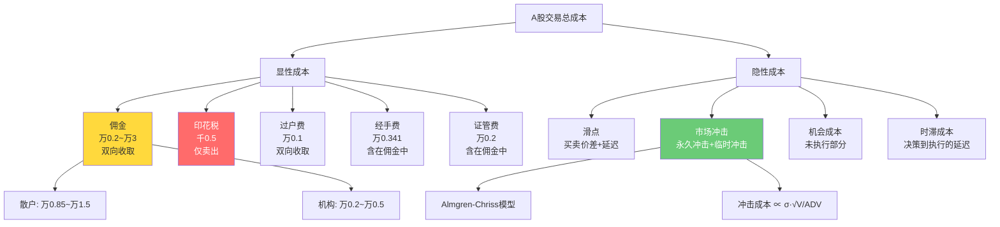
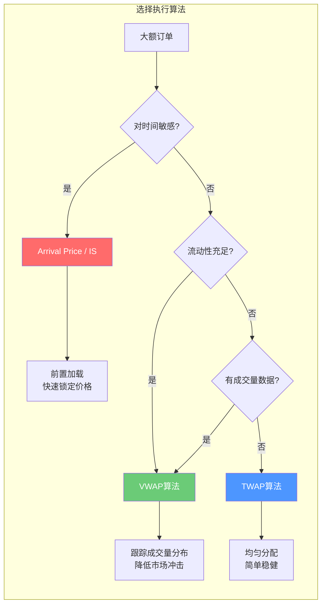

# 交易成本建模与执行优化

> [!abstract] 核心要点
> - A股交易成本由**显性成本**（佣金、印花税、过户费、经手费、证管费）和**隐性成本**（滑点、市场冲击、机会成本）两大类构成
> - 2024-2025年A股佣金已降至万0.85-1.5区间，机构通道费可低至万0.2-0.5，但印花税（卖出千0.5）仍是最大单项显性成本
> - Almgren-Chriss 模型将市场冲击分解为**永久冲击**和**临时冲击**，通过均值-方差优化求解最优执行轨迹
> - TWAP 按时间均匀拆单，VWAP 按成交量分布拆单；Arrival Price/IS 算法前置加载以锁定到达价格
> - 高换手策略（年换手 >50 倍）在当前费率下年化成本可达 10%+，存在明确的**换手率-收益边界**

## 一、A股交易成本全分解

### 1.1 显性成本费率表（2024-2025 现行标准）

| 费用项目 | 费率 | 收取方向 | 收取方 | 备注 |
|---------|------|---------|--------|------|
| **佣金** | 万0.85 ~ 万3（协商） | 买卖双向 | 券商 | 含经手费+证管费；最低5元/笔 |
| **印花税** | **千0.5**（0.05%） | **仅卖出** | 税务局 | 2023年8月28日起由千1降为千0.5 |
| **过户费** | 万0.1（0.001%） | 买卖双向 | 中国结算 | 沪深统一，大宗交易下浮30% |
| **经手费** | 万0.341（0.00341%） | 买卖双向 | 交易所 | 通常包含在佣金中；北交所万1.25 |
| **证管费** | 万0.2（0.002%） | 买卖双向 | 证监会 | 通常包含在佣金中 |
| **结算费** | 一般免收 | — | 中国结算 | A股通常券商承担或含在佣金中 |

> [!warning] 佣金的"含规费"与"不含规费"
> 券商报价有两种口径：
> - **含规费（净佣）**：佣金已包含经手费+证管费，如"万0.85含规费"
> - **不含规费**：佣金之外另收经手费+证管费，实际成本 = 佣金 + 万0.541
> 谈判时务必确认口径，否则实际成本差异可达 40%

### 1.2 券商佣金费率分层

| 客户类型 | 资金规模 | 典型佣金（含规费） | 备注 |
|---------|---------|-------------------|------|
| 普通散户（线上默认） | < 50万 | 万1.5 ~ 万2.5 | 不主动谈判的默认费率 |
| 主动谈判散户 | 50-100万 | 万1.0 ~ 万1.5 | 通过客户经理协商 |
| 中等资金量 | 100-500万 | 万0.85 ~ 万1.2 | 多数券商可达万1以下 |
| 大资金/高频交易 | 500万+ | 万0.5 ~ 万0.85 | 需VIP通道申请 |
| **机构通道费** | 千万级+ | **万0.2 ~ 万0.5** | 私募/基金专用通道 |
| ETF/可转债 | — | 万0.5 ~ 万1.0 | 单独定价，通常低于A股 |

### 1.3 单次交易综合成本计算

以万1佣金（含规费）为例，**单次买卖往返**总成本：

```
买入成本 = 佣金 万1 = 0.01%
卖出成本 = 佣金 万1 + 印花税 千0.5 = 0.01% + 0.05% = 0.06%
──────────────────────────────────────
往返总成本 = 0.01% + 0.06% = 0.07%（万7/往返）

另加过户费（双向）= 0.001% × 2 = 0.002%
──────────────────────────────────────
实际往返 ≈ 0.072%（万7.2/往返）
```

> [!tip] 不同佣金水平往返成本对照
> | 佣金水平 | 往返显性成本（含印花税+过户费） |
> |---------|-------------------------------|
> | 万3 | 0.072% + 0.05% = **0.122%** |
> | 万1.5 | 0.032% + 0.05% = **0.082%** |
> | 万1 | 0.022% + 0.05% = **0.072%** |
> | 万0.5 | 0.012% + 0.05% = **0.062%** |
> | 万0.2（机构） | 0.006% + 0.05% = **0.056%** |

### 1.4 成本分解 Mermaid 图



## 二、滑点建模

### 2.1 固定滑点模型

最简单的滑点估计方法，设定固定的滑点值：

```python
# 固定滑点模型
class FixedSlippageModel:
    """
    适用场景：大周期回测、流动性充足的大盘股
    """
    def __init__(self, slippage_bps=1.0):
        """
        slippage_bps: 固定滑点，单位为基点(bps)
        1 bps = 0.01%，如 slippage_bps=1.0 表示万分之一
        """
        self.slippage_rate = slippage_bps / 10000

    def calculate(self, price, side):
        """
        side: 'buy' 买入方向滑点加价, 'sell' 卖出方向滑点减价
        """
        if side == 'buy':
            return price * (1 + self.slippage_rate)
        else:
            return price * (1 - self.slippage_rate)
```

**优点**：实现简单、回测高效
**缺点**：无法反映流动性差异，小盘股严重低估滑点，大盘股可能高估

**经验参数**：
- 沪深300成分股：1-2 bps
- 中证500成分股：2-5 bps
- 中证1000/小盘股：5-15 bps

### 2.2 自适应滑点模型（基于买卖价差）

利用 Tick 级别的买卖价差（Bid-Ask Spread）动态估计滑点：

```python
import numpy as np
import pandas as pd

class AdaptiveSlippageModel:
    """
    基于实时/历史 tick 数据的买卖价差自适应滑点
    适用场景：精细化回测、日内策略
    """
    def __init__(self, tick_data: pd.DataFrame):
        """
        tick_data 至少包含列: datetime, bid1, ask1, last_price, volume
        """
        self.tick_data = tick_data
        self._precompute_spread()

    def _precompute_spread(self):
        """预计算每日各时段的平均价差"""
        df = self.tick_data.copy()
        df['spread'] = df['ask1'] - df['bid1']
        df['spread_pct'] = df['spread'] / df['last_price']
        df['date'] = df['datetime'].dt.date
        df['hour'] = df['datetime'].dt.hour

        # 按日期和小时聚合
        self.spread_profile = df.groupby(['date', 'hour']).agg(
            spread_mean=('spread_pct', 'mean'),
            spread_std=('spread_pct', 'std'),
            volume_mean=('volume', 'mean')
        ).reset_index()

        # 买入滑点：ask - last，卖出滑点：last - bid
        df['buy_slip'] = (df['ask1'] - df['last_price']) / df['last_price']
        df['sell_slip'] = (df['last_price'] - df['bid1']) / df['last_price']
        self.daily_buy_slip = df.groupby('date')['buy_slip'].mean()
        self.daily_sell_slip = df.groupby('date')['sell_slip'].mean()

    def estimate(self, date, hour, side='buy'):
        """估计特定日期时段的滑点"""
        mask = (self.spread_profile['date'] == date) & \
               (self.spread_profile['hour'] == hour)
        row = self.spread_profile[mask]
        if row.empty:
            return self.spread_profile['spread_mean'].mean() / 2  # fallback
        half_spread = row['spread_mean'].values[0] / 2
        return half_spread
```

### 2.3 基于成交量的冲击成本模型（Almgren-Chriss 扩展）

市场冲击随交易量占比非线性增长：

```python
class VolumeImpactSlippageModel:
    """
    基于成交量的市场冲击滑点模型
    slippage = η × σ × (Q / ADV)^α

    其中:
      η: 冲击系数（经验值 0.1 ~ 0.5）
      σ: 日波动率
      Q: 交易股数
      ADV: 平均日成交量（Average Daily Volume）
      α: 冲击指数（通常 0.5 ~ 0.7，反映凹性冲击）
    """
    def __init__(self, eta=0.3, alpha=0.6):
        self.eta = eta
        self.alpha = alpha

    def calculate(self, price, quantity, adv, daily_volatility):
        """
        返回单位滑点（百分比）和滑点金额
        """
        participation_rate = quantity / adv
        impact_pct = self.eta * daily_volatility * (participation_rate ** self.alpha)
        slippage_amount = price * impact_pct
        return {
            'impact_pct': impact_pct,
            'slippage_per_share': slippage_amount,
            'total_slippage': slippage_amount * quantity,
            'participation_rate': participation_rate
        }

    def suggest_max_quantity(self, adv, max_impact_pct=0.001, daily_volatility=0.02):
        """建议最大单次交易量，限制冲击在 max_impact_pct 以内"""
        # impact = η × σ × (Q/ADV)^α  =>  Q = ADV × (impact / (η×σ))^(1/α)
        ratio = (max_impact_pct / (self.eta * daily_volatility)) ** (1 / self.alpha)
        return int(adv * ratio)
```

**A股经验参数**：

| 股票类型 | η（冲击系数） | α（冲击指数） | 单日参与率上限 |
|---------|-------------|-------------|-------------|
| 沪深300成分 | 0.10 ~ 0.20 | 0.5 | 10-15% ADV |
| 中证500成分 | 0.20 ~ 0.35 | 0.55 | 5-10% ADV |
| 中证1000成分 | 0.30 ~ 0.50 | 0.6 | 3-5% ADV |
| 小盘股（<30亿市值） | 0.40 ~ 0.70 | 0.65 | 1-3% ADV |

## 三、Almgren-Chriss 最优执行模型

### 3.1 模型设定

**目标**：将 $X$ 股在时间 $[0, T]$ 内全部卖出（或买入），最小化执行成本与风险的加权和。

**变量定义**：
- $q(t)$：时刻 $t$ 的剩余持仓量，$q(0) = X$，$q(T) = 0$
- $\dot{q}(t) = -v(t)$：交易速率（$v(t) > 0$ 表示卖出）
- $S(t)$：资产价格，服从带冲击的随机过程

**价格动态**：

$$S(t) = S_0 - \gamma \int_0^t v(s)\,ds + \sigma W(t)$$

其中：
- $\gamma$：**永久冲击系数**（Permanent Impact）— 交易对价格的持久偏移
- $\sigma$：价格波动率
- $W(t)$：标准布朗运动

**瞬时执行价格**（含临时冲击）：

$$\tilde{S}(t) = S(t) - \eta \cdot v(t)$$

其中 $\eta$ 为**临时冲击系数**（Temporary Impact）。

### 3.2 目标函数

执行总成本的期望：

$$E[\text{Cost}] = \int_0^T v(t) \left[ \gamma \int_0^t v(s)\,ds + \eta \cdot v(t) \right] dt$$

风险项（剩余持仓的方差）：

$$\text{Var} = \sigma^2 \int_0^T q(t)^2 \, dt$$

**均值-方差目标**：

$$\min_{v(t)} \quad E[\text{Cost}] + \lambda_{\text{risk}} \cdot \text{Var}$$

其中 $\lambda_{\text{risk}}$ 为风险厌恶参数。

### 3.3 最优交易轨迹（解析解）

定义特征时间尺度：

$$\kappa = \sqrt{\frac{\lambda_{\text{risk}} \sigma^2}{\eta}}$$

**最优持仓轨迹**：

$$q^*(t) = X \cdot \frac{\sinh\left(\kappa(T - t)\right)}{\sinh(\kappa T)}$$

**最优交易速率**：

$$v^*(t) = X \cdot \frac{\kappa \cosh\left(\kappa(T - t)\right)}{\sinh(\kappa T)}$$

**两个极端情形**：
1. **$\lambda_{\text{risk}} \to 0$（风险中性）**：$\kappa \to 0$，$v^*(t) = X/T$（TWAP，均匀交易）
2. **$\lambda_{\text{risk}} \to \infty$（极度风险厌恶）**：$\kappa \to \infty$，集中在 $t=0$ 一次性执行

### 3.4 最优成本

$$\text{Cost}^* = \frac{1}{2}\gamma X^2 + \eta \cdot \frac{\kappa X^2}{2} \cdot \coth(\kappa T)$$

$$\text{Var}^* = \frac{\sigma^2 X^2}{2\kappa} \cdot \left(\coth(\kappa T) - \frac{\kappa T}{\sinh^2(\kappa T)}\right)$$

### 3.5 Python 实现

```python
import numpy as np
from scipy.optimize import minimize

class AlmgrenChrissOptimalExecution:
    """
    Almgren-Chriss 最优执行模型

    参数:
        X: 总交易股数
        T: 总执行时间（交易日或分钟数）
        sigma: 价格波动率（与T同频率）
        gamma: 永久冲击系数
        eta: 临时冲击系数
        lambda_risk: 风险厌恶参数
    """
    def __init__(self, X, T, sigma, gamma, eta, lambda_risk):
        self.X = X
        self.T = T
        self.sigma = sigma
        self.gamma = gamma
        self.eta = eta
        self.lambda_risk = lambda_risk
        self.kappa = np.sqrt(lambda_risk * sigma**2 / eta)

    def optimal_trajectory(self, n_steps=100):
        """计算最优持仓轨迹 q*(t)"""
        t = np.linspace(0, self.T, n_steps)
        kT = self.kappa * self.T
        q = self.X * np.sinh(self.kappa * (self.T - t)) / np.sinh(kT)
        return t, q

    def optimal_trading_rate(self, n_steps=100):
        """计算最优交易速率 v*(t)"""
        t = np.linspace(0, self.T, n_steps)
        kT = self.kappa * self.T
        v = self.X * self.kappa * np.cosh(self.kappa * (self.T - t)) / np.sinh(kT)
        return t, v

    def expected_cost(self):
        """计算最优策略下的期望成本"""
        kT = self.kappa * self.T
        permanent = 0.5 * self.gamma * self.X**2
        temporary = self.eta * self.kappa * self.X**2 / 2 * (np.cosh(kT) / np.sinh(kT))
        return permanent + temporary

    def variance(self):
        """计算最优策略下的风险（方差）"""
        kT = self.kappa * self.T
        coth_kT = np.cosh(kT) / np.sinh(kT)
        term2 = kT / (np.sinh(kT)**2)
        return self.sigma**2 * self.X**2 / (2 * self.kappa) * (coth_kT - term2)

    def efficient_frontier(self, n_points=50):
        """计算成本-风险有效前沿"""
        lambdas = np.logspace(-4, 2, n_points)
        costs, variances = [], []
        for lam in lambdas:
            model = AlmgrenChrissOptimalExecution(
                self.X, self.T, self.sigma, self.gamma, self.eta, lam
            )
            costs.append(model.expected_cost())
            variances.append(model.variance())
        return np.array(costs), np.array(variances), lambdas


# 使用示例
if __name__ == '__main__':
    model = AlmgrenChrissOptimalExecution(
        X=100000,       # 10万股
        T=240,          # 240分钟（全天）
        sigma=0.02,     # 每分钟波动率
        gamma=2.5e-7,   # 永久冲击系数
        eta=2.5e-6,     # 临时冲击系数
        lambda_risk=1e-6  # 风险厌恶参数
    )

    t, q = model.optimal_trajectory()
    t, v = model.optimal_trading_rate()
    print(f"期望成本: {model.expected_cost():.2f}")
    print(f"方差: {model.variance():.2f}")
    print(f"Kappa: {model.kappa:.4f}")
```

## 四、TWAP / VWAP 算法拆单执行

### 4.1 TWAP（Time-Weighted Average Price）

**原理**：在指定时间窗口内均匀分配下单量，不考虑成交量分布。

```python
import numpy as np
import pandas as pd
from datetime import datetime, timedelta

class TWAPExecutor:
    """
    TWAP 拆单执行引擎

    参数:
        total_quantity: 总下单量（股）
        start_time: 开始时间
        end_time: 结束时间
        interval_minutes: 拆单间隔（分钟）
        randomize: 是否加入随机扰动防止被探测
    """
    def __init__(self, total_quantity, start_time, end_time,
                 interval_minutes=5, randomize=True):
        self.total_quantity = total_quantity
        self.start_time = start_time
        self.end_time = end_time
        self.interval_minutes = interval_minutes
        self.randomize = randomize
        self.schedule = self._generate_schedule()

    def _generate_schedule(self):
        """生成TWAP下单计划"""
        current = self.start_time
        slots = []
        while current < self.end_time:
            slots.append(current)
            current += timedelta(minutes=self.interval_minutes)

        n_slots = len(slots)
        base_qty = self.total_quantity // n_slots
        remainder = self.total_quantity % n_slots

        quantities = [base_qty] * n_slots
        # 将余量分散到前 remainder 个时间槽
        for i in range(remainder):
            quantities[i] += 1

        if self.randomize:
            # 加入 ±10% 的随机扰动（总量不变）
            noise = np.random.uniform(-0.1, 0.1, n_slots)
            noise -= noise.mean()  # 零均值
            adjustments = (np.array(quantities) * noise).astype(int)
            quantities = [max(100, q + a) for q, a in zip(quantities, adjustments)]
            # 修正总量
            diff = self.total_quantity - sum(quantities)
            quantities[-1] += diff

        return pd.DataFrame({
            'time': slots,
            'quantity': quantities
        })

    def get_next_order(self, current_time):
        """获取下一个待执行的订单"""
        pending = self.schedule[self.schedule['time'] <= current_time]
        if pending.empty:
            return None
        return pending.iloc[-1]

    def execution_report(self, filled_prices):
        """生成执行报告"""
        self.schedule['filled_price'] = filled_prices
        twap_price = np.average(
            filled_prices,
            weights=self.schedule['quantity']
        )
        return {
            'twap_achieved': twap_price,
            'total_quantity': self.schedule['quantity'].sum(),
            'n_orders': len(self.schedule),
            'schedule': self.schedule
        }
```

### 4.2 VWAP（Volume-Weighted Average Price）

**原理**：预测日内成交量分布，按比例分配下单量，使执行均价尽可能接近市场 VWAP。

```python
class VWAPExecutor:
    """
    VWAP 拆单执行引擎

    核心: 基于历史日内成交量分布预测，按比例分配下单量
    """
    def __init__(self, total_quantity, symbol, interval_minutes=5):
        self.total_quantity = total_quantity
        self.symbol = symbol
        self.interval_minutes = interval_minutes
        self.volume_profile = None
        self.schedule = None

    def fit_volume_profile(self, historical_minute_data: pd.DataFrame,
                           lookback_days=20):
        """
        拟合日内成交量分布

        historical_minute_data: 包含 datetime, volume 列的分钟线数据
        """
        df = historical_minute_data.copy()
        df['time_of_day'] = df['datetime'].dt.time
        df['date'] = df['datetime'].dt.date

        # 最近 lookback_days 的日内平均成交量分布
        dates = sorted(df['date'].unique())[-lookback_days:]
        df = df[df['date'].isin(dates)]

        # 按 interval_minutes 聚合
        df['minute_bucket'] = (
            df['datetime'].dt.hour * 60 + df['datetime'].dt.minute
        ) // self.interval_minutes * self.interval_minutes

        profile = df.groupby('minute_bucket')['volume'].mean().reset_index()
        profile.columns = ['minute_bucket', 'avg_volume']

        # 归一化为比例
        total_vol = profile['avg_volume'].sum()
        profile['volume_pct'] = profile['avg_volume'] / total_vol

        self.volume_profile = profile
        return profile

    def generate_schedule(self):
        """根据成交量分布生成下单计划"""
        if self.volume_profile is None:
            raise ValueError("请先调用 fit_volume_profile 拟合成交量分布")

        schedule = self.volume_profile.copy()
        schedule['target_quantity'] = (
            schedule['volume_pct'] * self.total_quantity
        ).round().astype(int)

        # 修正四舍五入误差
        diff = self.total_quantity - schedule['target_quantity'].sum()
        idx_max = schedule['target_quantity'].idxmax()
        schedule.loc[idx_max, 'target_quantity'] += diff

        # A股最小交易单位为100股
        schedule['target_quantity'] = (
            (schedule['target_quantity'] / 100).round() * 100
        ).astype(int)

        # 再次修正
        diff = self.total_quantity - schedule['target_quantity'].sum()
        schedule.loc[idx_max, 'target_quantity'] += diff

        self.schedule = schedule
        return schedule

    def dynamic_adjust(self, current_bucket, actual_volume, expected_volume):
        """
        动态调整: 根据实际成交量与预期的偏差调整后续下单量

        如果实际成交量高于预期 → 市场活跃，可适当增加当前桶下单量
        如果实际成交量低于预期 → 市场低迷，减少当前桶下单量，后移
        """
        if expected_volume == 0:
            return 0

        activity_ratio = actual_volume / expected_volume

        # 自适应系数：偏离越大调整越激进
        adjustment_factor = 0.5  # 调整强度
        adjusted_ratio = 1 + adjustment_factor * (activity_ratio - 1)
        adjusted_ratio = np.clip(adjusted_ratio, 0.5, 2.0)  # 限制范围

        base_qty = self.schedule.loc[
            self.schedule['minute_bucket'] == current_bucket,
            'target_quantity'
        ].values[0]

        return int(base_qty * adjusted_ratio)

    def evaluate_performance(self, executed_prices, executed_quantities,
                             market_vwap):
        """评估执行质量"""
        exec_vwap = np.average(executed_prices, weights=executed_quantities)
        slippage_bps = (exec_vwap - market_vwap) / market_vwap * 10000

        return {
            'executed_vwap': exec_vwap,
            'market_vwap': market_vwap,
            'slippage_bps': slippage_bps,
            'total_executed': sum(executed_quantities),
            'completion_rate': sum(executed_quantities) / self.total_quantity
        }
```

### 4.3 TWAP vs VWAP 对比



| 维度 | TWAP | VWAP | Arrival Price/IS |
|------|------|------|-----------------|
| **基准价格** | 时间加权均价 | 成交量加权均价 | 订单到达价格 |
| **交易节奏** | 均匀分布 | 跟踪成交量曲线 | 前置加载，递减 |
| **数据需求** | 无 | 历史成交量分布 | 波动率+冲击模型 |
| **市场冲击** | 中等 | 较低 | 较高（集中执行） |
| **时滞风险** | 较高 | 中等 | 较低 |
| **适用场景** | 流动性差/无历史数据 | 大单/被动执行 | 有方向信念/alpha衰减快 |
| **复杂度** | 低 | 中 | 高 |

## 五、Arrival Price / IS 算法与自适应执行

### 5.1 Implementation Shortfall（IS）

**定义**：实际执行成本与"纸面组合"（Paper Portfolio）的差异：

$$\text{IS} = \underbrace{(\bar{P}_{\text{exec}} - P_{\text{decision}})}_{\text{执行价差}} \times Q$$

分解为：
- **延迟成本**（Delay Cost）：从决策到开始执行之间的价格变动
- **市场冲击**（Market Impact）：执行过程中对价格的推动
- **机会成本**（Opportunity Cost）：未完成部分的损失

### 5.2 Arrival Price 算法

以**订单到达时的市场价格**为基准，通过前置加载（Front-Loading）交易来最小化 IS：

```python
class ArrivalPriceExecutor:
    """
    Arrival Price / IS 最小化执行算法

    核心思想: 前期激进执行锁定到达价格，后期递减以控制冲击
    """
    def __init__(self, total_quantity, T_minutes, arrival_price,
                 sigma, eta, gamma, urgency=0.5):
        """
        urgency: 紧迫度参数 [0,1]
            0 = 纯TWAP（风险中性）
            1 = 尽快执行（极度风险厌恶）
        """
        self.total_quantity = total_quantity
        self.T = T_minutes
        self.arrival_price = arrival_price
        self.sigma = sigma
        self.eta = eta
        self.gamma = gamma
        self.urgency = urgency

        # 将 urgency 映射为 Almgren-Chriss 的 lambda_risk
        self.lambda_risk = 10 ** (urgency * 4 - 2)  # 0.01 ~ 100
        self.ac_model = AlmgrenChrissOptimalExecution(
            total_quantity, T_minutes, sigma, gamma, eta, self.lambda_risk
        )

    def generate_schedule(self, n_slots=48):
        """生成 AP 执行计划"""
        t, q = self.ac_model.optimal_trajectory(n_slots + 1)
        quantities = -np.diff(q)  # q 递减，diff 为负，取反
        quantities = np.maximum(quantities, 0)

        # 归一化确保总量正确
        quantities = quantities / quantities.sum() * self.total_quantity
        quantities = np.round(quantities / 100) * 100  # A股整百手

        # 修正
        diff = self.total_quantity - quantities.sum()
        quantities[0] += diff

        interval = self.T / n_slots
        times = [i * interval for i in range(n_slots)]

        return pd.DataFrame({
            'minute': times,
            'target_quantity': quantities.astype(int),
            'cumulative_pct': np.cumsum(quantities) / self.total_quantity
        })

    def evaluate_is(self, executed_prices, executed_quantities):
        """计算 Implementation Shortfall"""
        exec_vwap = np.average(executed_prices, weights=executed_quantities)
        is_bps = (exec_vwap - self.arrival_price) / self.arrival_price * 10000
        total_is = (exec_vwap - self.arrival_price) * sum(executed_quantities)

        return {
            'arrival_price': self.arrival_price,
            'executed_vwap': exec_vwap,
            'is_bps': is_bps,
            'total_is_cost': total_is,
            'completion_rate': sum(executed_quantities) / self.total_quantity
        }
```

### 5.3 自适应执行策略

在静态最优轨迹基础上，根据实时市场状态动态调整：

```python
class AdaptiveExecutor:
    """
    自适应执行引擎: 结合 Arrival Price 基础轨迹 + 实时调整

    调整逻辑:
    - 价格有利（向好方向移动） → 减速执行，让利润跑
    - 价格不利（向差方向移动） → 加速执行，止损
    - 波动率上升 → 加速执行，降低风险
    - 流动性改善 → 适当加量
    """
    def __init__(self, base_executor, alpha_decay_halflife=30):
        """
        base_executor: ArrivalPriceExecutor 实例
        alpha_decay_halflife: alpha信号半衰期（分钟）
        """
        self.base = base_executor
        self.alpha_hl = alpha_decay_halflife
        self.base_schedule = base_executor.generate_schedule()
        self.executed = []

    def adjust_quantity(self, slot_idx, current_price, current_volatility,
                       current_volume, expected_volume):
        """
        实时调整当前槽位的下单量
        """
        base_qty = self.base_schedule.loc[slot_idx, 'target_quantity']
        arrival = self.base.arrival_price

        # 1. 价格信号调整
        price_move = (current_price - arrival) / arrival
        # 买入场景：价格上涨不利，加速；价格下跌有利，减速
        if self.base.total_quantity > 0:  # 买入
            price_factor = 1 + 2.0 * price_move  # 涨了就多买
        else:  # 卖出
            price_factor = 1 - 2.0 * price_move

        # 2. 波动率调整：波动率升高 → 加速
        vol_ratio = current_volatility / self.base.sigma
        vol_factor = min(vol_ratio, 2.0)  # 最多加速2倍

        # 3. 流动性调整
        liq_ratio = current_volume / max(expected_volume, 1)
        liq_factor = np.clip(liq_ratio, 0.5, 2.0)

        # 综合调整
        adjusted_qty = base_qty * price_factor * vol_factor * liq_factor
        adjusted_qty = max(100, int(round(adjusted_qty / 100) * 100))

        # 剩余量约束
        total_executed = sum(e['quantity'] for e in self.executed)
        remaining = abs(self.base.total_quantity) - total_executed
        adjusted_qty = min(adjusted_qty, remaining)

        return adjusted_qty
```

## 六、交易成本综合模型（完整 Python 实现）

```python
import numpy as np
import pandas as pd
from dataclasses import dataclass, field
from typing import Optional, Dict, List

@dataclass
class AShareCostConfig:
    """A股交易成本配置"""
    # 显性成本
    commission_rate: float = 0.0001      # 佣金费率（万1，含规费）
    commission_min: float = 5.0          # 最低佣金（元/笔）
    stamp_tax_rate: float = 0.0005       # 印花税（千0.5，仅卖出）
    transfer_fee_rate: float = 0.00001   # 过户费（万0.1，双向）

    # 隐性成本参数
    slippage_model: str = 'volume_impact'  # 'fixed', 'adaptive', 'volume_impact'
    fixed_slippage_bps: float = 2.0       # 固定滑点（bps）
    impact_eta: float = 0.3               # 冲击系数
    impact_alpha: float = 0.6             # 冲击指数


class TransactionCostModel:
    """
    A股交易成本综合模型

    整合显性成本 + 隐性成本（滑点/冲击），支持：
    - 单笔交易成本计算
    - 组合换手成本估算
    - 策略回测成本扣除
    - 成本敏感性分析
    """
    def __init__(self, config: Optional[AShareCostConfig] = None):
        self.config = config or AShareCostConfig()

    def explicit_cost(self, price: float, quantity: int, side: str) -> Dict:
        """
        计算单笔交易的显性成本

        side: 'buy' 或 'sell'
        """
        trade_amount = price * quantity

        # 佣金（双向）
        commission = max(
            trade_amount * self.config.commission_rate,
            self.config.commission_min
        )

        # 印花税（仅卖出）
        stamp_tax = trade_amount * self.config.stamp_tax_rate if side == 'sell' else 0

        # 过户费（双向）
        transfer_fee = trade_amount * self.config.transfer_fee_rate

        total = commission + stamp_tax + transfer_fee

        return {
            'trade_amount': trade_amount,
            'commission': commission,
            'stamp_tax': stamp_tax,
            'transfer_fee': transfer_fee,
            'total_explicit': total,
            'explicit_rate': total / trade_amount if trade_amount > 0 else 0
        }

    def implicit_cost(self, price: float, quantity: int,
                      adv: float, daily_volatility: float,
                      side: str = 'buy') -> Dict:
        """
        计算隐性成本（滑点 + 市场冲击）

        adv: 平均日成交量（股）
        daily_volatility: 日波动率
        """
        trade_amount = price * quantity

        if self.config.slippage_model == 'fixed':
            slippage_rate = self.config.fixed_slippage_bps / 10000
        elif self.config.slippage_model == 'volume_impact':
            participation = quantity / adv if adv > 0 else 0.01
            slippage_rate = (
                self.config.impact_eta *
                daily_volatility *
                (participation ** self.config.impact_alpha)
            )
        else:
            slippage_rate = self.config.fixed_slippage_bps / 10000

        slippage_cost = trade_amount * slippage_rate

        return {
            'slippage_rate': slippage_rate,
            'slippage_cost': slippage_cost,
            'participation_rate': quantity / adv if adv > 0 else None
        }

    def total_cost(self, price, quantity, side, adv=None,
                   daily_volatility=None) -> Dict:
        """计算单笔交易总成本"""
        explicit = self.explicit_cost(price, quantity, side)

        if adv and daily_volatility:
            implicit = self.implicit_cost(
                price, quantity, adv, daily_volatility, side
            )
        else:
            implicit = {'slippage_rate': 0, 'slippage_cost': 0}

        total = explicit['total_explicit'] + implicit['slippage_cost']
        trade_amount = explicit['trade_amount']

        return {
            **explicit,
            **implicit,
            'total_cost': total,
            'total_rate': total / trade_amount if trade_amount > 0 else 0
        }

    def roundtrip_cost(self, price, quantity, adv=None,
                       daily_volatility=None) -> Dict:
        """计算一次完整买卖往返的总成本"""
        buy = self.total_cost(price, quantity, 'buy', adv, daily_volatility)
        sell = self.total_cost(price, quantity, 'sell', adv, daily_volatility)

        trade_amount = price * quantity
        total_roundtrip = buy['total_cost'] + sell['total_cost']

        return {
            'buy_cost': buy['total_cost'],
            'sell_cost': sell['total_cost'],
            'roundtrip_cost': total_roundtrip,
            'roundtrip_rate': total_roundtrip / trade_amount,
            'roundtrip_bps': total_roundtrip / trade_amount * 10000,
            'detail_buy': buy,
            'detail_sell': sell
        }

    def turnover_cost_analysis(self, portfolio_value: float,
                               annual_turnover_list: list,
                               avg_price: float = 20.0,
                               avg_adv_shares: float = 5e6,
                               daily_vol: float = 0.025) -> pd.DataFrame:
        """
        换手率-成本敏感性分析

        annual_turnover_list: 年换手率列表（倍数），如 [1, 5, 10, 20, 50, 100]
        """
        results = []
        for turnover in annual_turnover_list:
            # 年交易额 = 组合市值 × 年换手率 × 2（买卖双边）
            annual_trade_value = portfolio_value * turnover
            avg_trade_per_day = annual_trade_value / 242  # A股约242个交易日
            avg_quantity = int(avg_trade_per_day / avg_price)

            rt = self.roundtrip_cost(avg_price, avg_quantity, avg_adv_shares, daily_vol)
            annual_cost_rate = rt['roundtrip_rate'] * turnover

            results.append({
                '年换手率(倍)': turnover,
                '单次往返成本(bps)': round(rt['roundtrip_bps'], 2),
                '年化交易成本(%)': round(annual_cost_rate * 100, 2),
                '需年化超额(%)': round(annual_cost_rate * 100, 2),
                '日均交易额(万)': round(avg_trade_per_day / 10000, 1)
            })

        return pd.DataFrame(results)


# ======== 使用示例 ========
if __name__ == '__main__':
    # 1. 创建成本模型
    config = AShareCostConfig(
        commission_rate=0.0001,       # 万1佣金（含规费）
        stamp_tax_rate=0.0005,        # 印花税千0.5
        slippage_model='volume_impact',
        impact_eta=0.3,
        impact_alpha=0.6
    )
    model = TransactionCostModel(config)

    # 2. 单笔交易成本
    cost = model.total_cost(
        price=20.0, quantity=50000, side='buy',
        adv=5_000_000, daily_volatility=0.025
    )
    print(f"单笔买入成本: {cost['total_rate']*10000:.1f} bps")

    # 3. 往返成本
    rt = model.roundtrip_cost(
        price=20.0, quantity=50000,
        adv=5_000_000, daily_volatility=0.025
    )
    print(f"往返总成本: {rt['roundtrip_bps']:.1f} bps")

    # 4. 换手率敏感性分析
    df = model.turnover_cost_analysis(
        portfolio_value=10_000_000,  # 1000万组合
        annual_turnover_list=[1, 5, 10, 20, 30, 50, 80, 100]
    )
    print("\n换手率-成本敏感性分析:")
    print(df.to_string(index=False))
```

## 七、交易成本对策略的影响分析

### 7.1 换手率-收益边界

高换手策略面临的核心矛盾：**换手率越高，潜在 alpha 捕获越多，但交易成本也线性增长**。

| 策略类型 | 典型年换手率 | 佣金万1往返成本 | 佣金万0.2往返成本 | 所需年化超额 |
|---------|------------|---------------|-----------------|-------------|
| 价值投资 | 1-3倍 | 0.07-0.22% | 0.06-0.17% | < 1% |
| 多因子月调仓 | 10-15倍 | 0.72-1.08% | 0.56-0.84% | 1-2% |
| 多因子周调仓 | 30-50倍 | 2.16-3.60% | 1.68-2.80% | 3-5% |
| 日内动量/反转 | 50-100倍 | 3.60-7.20% | 2.80-5.60% | 5-10% |
| 高频做市 | 100-300倍 | 7.20-21.60% | 5.60-16.80% | >10% |

> [!important] 成本侵蚀的"死亡区间"
> 当策略年化超额收益 < 年化交易成本时，策略注定亏损。以万1佣金计算：
> - 年换手50倍：需 >3.6% 年化超额才能覆盖显性成本
> - 加上滑点/冲击成本（通常是显性成本的 1-3 倍），实际门槛为 **7-15%**
> - 2023-2025年 A股量化超额收益普遍在 5-15%，高换手策略的盈利空间被严重压缩

### 7.2 成本敏感性的策略启示

1. **降频优先**：如果 alpha 信号的半衰期允许，优先降低换手率
2. **佣金谈判**：从万1.5降到万0.5，年换手30倍的策略年化省 0.6%
3. **执行算法**：用 VWAP/IS 算法可降低 30-50% 的冲击成本
4. **市值偏移**：大盘股冲击成本远低于小盘股，市值因子暴露需权衡
5. **换手率约束**：在组合优化中加入换手率惩罚项（参见 [[组合优化与资产配置]]）

### 7.3 私募量化行业趋势

- 2020-2022年：平均换手率 50+ 倍，超额收益 15-25%
- 2023-2025年：换手率降至 30 倍以下，超额收益收窄至 5-15%
- **策略同质化**加剧交易拥挤，实际冲击成本上升
- 市场日均成交额从万亿降至 6000-8000 亿时，冲击成本剧增

## 八、A股佣金费率历史变化趋势

| 时期 | 主流佣金水平 | 驱动因素 |
|------|------------|---------|
| 2000年以前 | 千3（0.3%） | 统一定价时代 |
| 2002-2008 | 千1~千2 | 佣金自由化改革，逐步放开 |
| 2008-2013 | 万8~万15 | 互联网券商出现，价格战初期 |
| 2013-2018 | 万3~万8 | 一人多户政策，竞争白热化 |
| 2018-2021 | 万1.5~万3 | 互联网券商（东方财富等）倒逼 |
| 2021-2023 | 万1~万1.5 | 中小券商万1成标配，头部可谈 |
| 2023-2025 | **万0.85~万1.2** | 含规费万0.85成地板价，机构万0.2-0.5 |

**趋势判断**：
- 含规费佣金已接近成本底线（经手费万0.341+证管费万0.2 = 万0.541），纯佣金利润空间仅万0.3左右
- 机构通道费（万0.2-0.5）几乎为代收代缴规费 + 微利
- 未来降费空间有限，**印花税**（千0.5）已成为最大可变成本项
- 印花税进一步减免（甚至取消）的预期一直存在，若实现将显著利好高换手策略

**对策略选择的影响**：
- 2010年时佣金万8-15 → 日内策略几乎不可能盈利
- 2025年佣金万0.85 → 日内策略理论可行，但需要精细化执行
- 佣金下降使得"中频"策略（周调仓/双周调仓，年换手20-40倍）成为量化主流

## 九、参数速查表

| 参数 | 典型值 | 来源/适用条件 |
|------|--------|-------------|
| 佣金费率（散户） | 万1~万1.5 | 主动协商后 |
| 佣金费率（机构） | 万0.2~万0.5 | 千万级资金 |
| 印花税 | 千0.5（仅卖出） | 2023年8月28日起 |
| 过户费 | 万0.1（双向） | 沪深统一标准 |
| 经手费 | 万0.341（双向） | 沪深A股 |
| 证管费 | 万0.2（双向） | 全市场统一 |
| 固定滑点（大盘股） | 1-2 bps | 沪深300成分 |
| 固定滑点（中盘股） | 2-5 bps | 中证500成分 |
| 固定滑点（小盘股） | 5-15 bps | 中证1000及以下 |
| 冲击系数 η | 0.1~0.7 | 视市值和流动性 |
| 冲击指数 α | 0.5~0.7 | 经验值，通常0.6 |
| 参与率上限（大盘） | 10-15% ADV | 单日建议上限 |
| 参与率上限（小盘） | 1-3% ADV | 单日建议上限 |
| Almgren-Chriss κ | √(λσ²/η) | 特征时间尺度 |
| VWAP 拆单间隔 | 5分钟 | A股日内常用 |
| A股年交易日 | 242天 | 近5年均值 |

## 十、常见误区

> [!danger] 误区1：回测中忽略交易成本
> 不加成本的回测等于自欺欺人。年换手30倍的策略，忽略成本可能"多出"5-10%的虚假收益。

> [!danger] 误区2：只算佣金不算滑点
> 对于中小盘股或大额交易，**隐性成本（滑点+冲击）往往是显性成本的 2-5 倍**。万1佣金的策略，实际往返成本可能是万20-50。

> [!danger] 误区3：认为VWAP一定优于TWAP
> VWAP 在成交量预测准确时优于 TWAP，但如果当日成交量分布异常（如午盘异动），VWAP 反而会集中在错误的时间段放量。TWAP 作为 fallback 方案更稳健。

> [!danger] 误区4：用散户佣金回测机构策略
> 万1.5佣金 vs 万0.2机构通道，在年换手50倍的策略中，年化成本差异达 **1.3%**，这是真金白银的差距。

> [!danger] 误区5：忽视最低佣金5元/笔的影响
> 对于小额频繁交易（如每笔几千元），最低5元佣金意味着实际费率远高于名义费率。5000元交易的实际佣金率 = 5/5000 = 0.1% = **万10**。

> [!danger] 误区6：印花税"买卖都收"
> 2008年9月19日起，A股印花税改为**仅卖出方单边征收**。回测代码中双边计算印花税会多扣一倍。

## 十一、相关笔记

- [[A股交易制度全解析]] — 交易规则、涨跌停、T+1制度等基础设施
- [[A股市场微观结构深度研究]] — 订单簿结构、买卖价差、流动性分析
- [[A股量化实盘接入方案]] — 实盘下单通道、API接口与执行延迟
- [[A股回测框架实战与避坑指南]] — 回测中的成本建模与常见偏差
- [[量化交易风控体系建设]] — 风控约束对执行策略的影响
- [[A股多因子选股策略开发全流程]] — 因子换手率与交易成本的权衡
- [[组合优化与资产配置]] — 换手率约束与交易成本惩罚项
- [[策略绩效评估与统计检验]] — 扣除交易成本后的真实绩效评估
- [[A股量化交易合规要求]] — 算法交易的合规报备要求
- [[A股量化交易平台深度对比]] — 各平台对交易成本建模的支持

## 参考来源

1. Almgren, R., & Chriss, N. (2001). *Optimal execution of portfolio transactions*. Journal of Risk, 3(2), 5-39.
2. Almgren, R. (2003). *Optimal execution with nonlinear impact functions and trading-enhanced risk*. Applied Mathematical Finance, 10(1), 1-18.
3. 上海证券交易所官网 — 交易费用标准: https://www.sse.com.cn/services/tradingservice/charge/ssecharge/
4. 深圳证券交易所官网 — 交易费用标准
5. 中国结算 — 收费标准公告
6. 券商佣金费率对比（2024-2025）: https://zanqian.ihaosuan.com/archives/2405.html
7. Kissell, R. (2013). *The Science of Algorithmic Trading and Portfolio Management*. Academic Press.
8. 华泰证券研究所 — 《算法交易与最优执行》系列研报
9. 东方证券研究所 — 《A股交易成本分析与执行优化》
10. GitHub: tashaxing/TWAP_VWAP_code — TWAP/VWAP 开源实现参考
