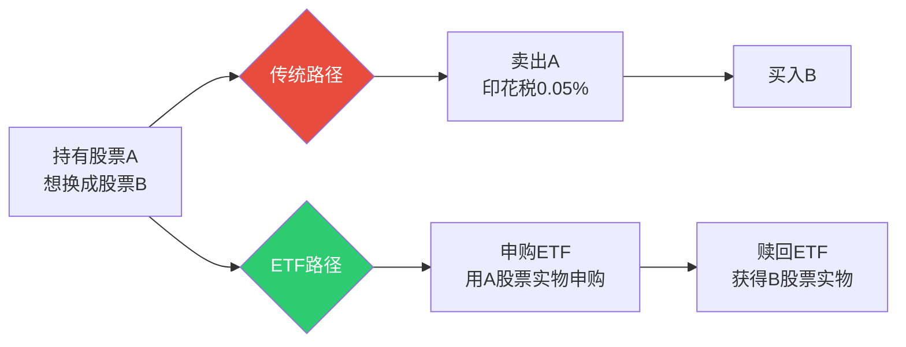
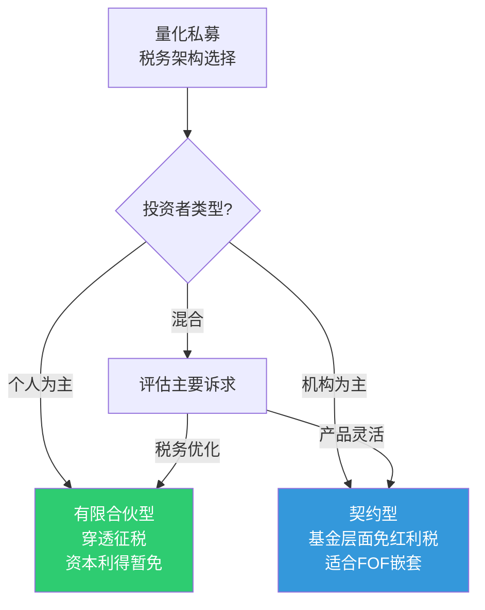

# 量化交易税务筹划与滑点成本实证

## 概述

交易成本是量化策略实盘收益与回测收益之间"Gap"的最大来源之一。本文从税费和执行成本两个维度系统分析A股量化交易的真实成本结构，包括印花税（2023年8月减半至0.05%）对高频策略的定量影响、红利税差别化政策、ETF税优路径、各品种滑点实测数据、冲击成本模型及算法交易成本优化。

**核心结论**：
- 印花税减半后高频策略年化成本降低约2-4个百分点
- ETF交易免印花税，是量化税优路径的核心工具
- 沪深300成分股单边滑点约2-5bp，小盘股可达10-30bp
- VWAP算法在A股中等规模委托中滑点表现最优

> 相关笔记：[[交易成本建模与执行优化]] | [[A股量化交易合规要求]] | [[A股市场微观结构深度研究]]

---

## 交易税费全景

### A股交易成本结构

| 成本项 | 税率/费率 | 计费基础 | 买入 | 卖出 | 备注 |
|--------|----------|---------|------|------|------|
| **印花税** | 0.05% | 成交金额 | ❌ | ✅ | 2023.8.28起减半 |
| **券商佣金** | 0.01-0.03% | 成交金额 | ✅ | ✅ | 量化机构可谈至万0.5 |
| **过户费** | 0.001% | 成交金额 | ✅ | ✅ | 沪深合并收取 |
| **经手费** | 0.00341% | 成交金额 | ✅ | ✅ | 交易所收取 |
| **证管费** | 0.002% | 成交金额 | ✅ | ✅ | 证监会收取 |
| **规费合计** | ~0.00541% | 成交金额 | ✅ | ✅ | 经手费+证管费 |

### 各品种综合费率对比

| 品种 | 单边总成本(买入) | 单边总成本(卖出) | 双边总成本 | 年化影响(日频) |
|------|----------------|----------------|-----------|--------------|
| **沪深股票** | ~0.02% | ~0.07% | ~0.09% | ~22% |
| **ETF** | ~0.02% | ~0.02% | ~0.04% | ~10% |
| **可转债** | ~0.005% | ~0.005% | ~0.01% | ~2.5% |
| **股指期货** | ~0.0023% | ~0.0023% | ~0.005% | ~1.2% |
| **商品期货** | 品种差异大 | 品种差异大 | 0.003-0.05% | 0.7-12% |

> 年化影响 = 双边成本 × 250(交易日) ×（假设日均换手100%）

---

## 印花税影响分析

### 减半政策实证

2023年8月28日起，A股证券交易印花税由1‰减半至0.5‰（单边卖出收取）。

**定量影响**：

| 策略类型 | 日均换手 | 减半前年化印花税成本 | 减半后年化印花税成本 | 节省 |
|---------|---------|-------------------|-------------------|------|
| 日频轮动 | 100% | 2.5% | 1.25% | 1.25% |
| 周频调仓 | 20% | 0.5% | 0.25% | 0.25% |
| 月频调仓 | ~5% | 0.125% | 0.0625% | 0.06% |
| 高频做T | 300%+ | 7.5%+ | 3.75%+ | 3.75%+ |

**2024年印花税收入**：1276亿元，同比降29.1%，投资者减负超千亿。

```python
def estimate_stamp_tax_impact(
    annual_turnover: float,
    avg_position: float,
    tax_rate: float = 0.0005
) -> dict:
    """
    估算印花税对策略收益的年化影响

    Parameters
    ----------
    annual_turnover : 年化双边换手率（如2.0表示200%）
    avg_position : 平均持仓市值（元）
    tax_rate : 印花税率（当前0.05%）
    """
    # 印花税仅卖出收取，所以是单边换手 × 税率
    single_side_turnover = annual_turnover / 2
    annual_tax = avg_position * single_side_turnover * tax_rate
    tax_drag = single_side_turnover * tax_rate  # 年化收益拖累比例

    return {
        'annual_tax_amount': annual_tax,
        'tax_drag_pct': tax_drag * 100,
        'monthly_tax': annual_tax / 12,
    }

# 示例：1000万持仓，年化换手400%
result = estimate_stamp_tax_impact(4.0, 10_000_000)
# tax_drag_pct = 0.1% (即年化收益被印花税拖累0.1个百分点)
```

### 高频策略的印花税优化

针对高频量化的税务建议：
1. **ETF替代策略**：ETF交易免印花税，将股票轮动改为ETF轮动可节省全部印花税
2. **降低无效换手**：设置调仓阈值（权重变化 > 2%才调仓），减少微小调仓的税务损耗
3. **可转债替代**：可转债交易免印花税且T+0，适合日内策略
4. **期货对冲替代现货卖出**：卖出股指期货对冲而非卖出股票，避免触发印花税

---

## 红利税筹划

### 差别化税率政策

| 持股期限 | 红利税率 | 计算 | 适用 |
|---------|---------|------|------|
| **≤ 1个月** | 20% | 全额计入应税所得 | 高频策略 |
| **1个月 < 持股 ≤ 1年** | 10% | 减半计入应税所得 | 中频策略 |
| **> 1年** | 0% | 免征 | 长期持有 |

### 红利税对量化策略的影响

```python
def dividend_tax_impact(
    dividend_yield: float,
    holding_period_days: int,
    position_value: float
) -> dict:
    """计算红利税对策略收益的影响"""
    if holding_period_days <= 30:
        tax_rate = 0.20
    elif holding_period_days <= 365:
        tax_rate = 0.10
    else:
        tax_rate = 0.0

    annual_dividend = position_value * dividend_yield
    tax_cost = annual_dividend * tax_rate
    net_yield = dividend_yield * (1 - tax_rate)

    return {
        'tax_rate': tax_rate,
        'annual_tax': tax_cost,
        'gross_yield': dividend_yield,
        'net_yield': net_yield,
        'yield_loss': dividend_yield - net_yield,
    }
```

**筹划建议**：
- 高股息策略（红利因子）应设计持股期 > 1年以免征红利税
- 短线策略需在回测中扣除红利税成本，避免高估回测收益
- 除权除息日前后的套利需考虑税务摩擦

---

## ETF税优路径

ETF是A股量化交易的税务最优工具：

| 税优点 | 说明 | 节省幅度 |
|--------|------|---------|
| **免印花税** | ETF交易不征收印花税 | 0.05%/笔 |
| **红利税递延** | ETF持仓分红在基金层面不征税 | 视持股期 |
| **实物申赎换股** | 通过ETF申赎实现"换股不卖股" | 避免触发卖出印花税 |
| **T+0品种** | 跨境ETF、商品ETF支持T+0 | 日内策略无额外成本 |

### ETF实物申赎换股策略



---

## 滑点成本实证

### 各品种滑点实测

| 品种 | 委托规模 | 单边滑点(bp) | 说明 |
|------|---------|-------------|------|
| **沪深300成分股** | 100万 | 2-5 | 流动性好，冲击小 |
| **沪深300成分股** | 1000万 | 5-15 | 需拆单执行 |
| **中证500成分股** | 100万 | 3-8 | 流动性中等 |
| **中证1000成分股** | 100万 | 5-15 | 流动性较差 |
| **小盘股(市值<50亿)** | 100万 | 10-30 | 流动性差，冲击大 |
| **ETF(日均>1亿)** | 100万 | 1-3 | 做市商提供流动性 |
| **可转债** | 100万 | 2-8 | 品种差异大 |
| **股指期货(IF)** | 10手 | 0.5-2 | 流动性极好 |

### 滑点测量方法

```python
import pandas as pd
import numpy as np

def measure_slippage(
    orders_df: pd.DataFrame,
    trades_df: pd.DataFrame,
    benchmark: str = 'arrival_price'
) -> pd.DataFrame:
    """
    实盘滑点测量

    Parameters
    ----------
    orders_df : 委托记录（含decision_price, order_time）
    trades_df : 成交记录（含avg_fill_price, fill_time）
    benchmark : 基准价格类型
    """
    merged = orders_df.merge(trades_df, on='order_id')

    if benchmark == 'arrival_price':
        # 到达价格基准（决策时刻价格）
        merged['slippage_bp'] = (
            (merged['avg_fill_price'] - merged['decision_price'])
            / merged['decision_price'] * 10000
        )
    elif benchmark == 'vwap':
        # VWAP基准
        merged['slippage_bp'] = (
            (merged['avg_fill_price'] - merged['interval_vwap'])
            / merged['interval_vwap'] * 10000
        )

    # 买入滑点为正（成交价高于基准），卖出取反
    merged.loc[merged['direction'] == 'SELL', 'slippage_bp'] *= -1

    return merged[['order_id', 'stock_code', 'direction',
                   'order_amount', 'slippage_bp']]
```

---

## 冲击成本模型

### Almgren-Chriss模型

Almgren-Chriss（2000）是最经典的最优执行模型，核心思想是在"冲击成本"与"时间风险"之间寻找均衡。

**模型假设**：
- 永久冲击（Permanent Impact）：$g(v) = \gamma v$，与交易速率线性相关
- 临时冲击（Temporary Impact）：$h(v) = \eta v^{\delta}$，$\delta$通常取0.5-1.0
- 价格波动：$\sigma$为日波动率

**最优执行轨迹**：

$$x_k = X \cdot \frac{\sinh(\kappa(T-t_k))}{\sinh(\kappa T)}$$

其中 $\kappa = \sqrt{\frac{\lambda \sigma^2}{\eta}}$，$\lambda$ 为风险厌恶系数。

```python
import numpy as np

def almgren_chriss_trajectory(
    total_shares: int,
    num_periods: int,
    sigma: float,
    eta: float,
    gamma: float,
    risk_aversion: float = 1e-6
) -> np.ndarray:
    """
    Almgren-Chriss最优执行轨迹

    Parameters
    ----------
    total_shares : 总委托量
    num_periods : 执行时段数
    sigma : 价格波动率
    eta : 临时冲击系数
    gamma : 永久冲击系数
    risk_aversion : 风险厌恶系数λ
    """
    tau = 1.0  # 每个时段长度
    kappa = np.sqrt(risk_aversion * sigma**2 / (eta * tau))

    # 最优持仓轨迹
    trajectory = np.zeros(num_periods + 1)
    for k in range(num_periods + 1):
        t_k = k * tau
        T = num_periods * tau
        trajectory[k] = total_shares * np.sinh(kappa * (T - t_k)) / np.sinh(kappa * T)

    # 每期交易量
    trade_list = -np.diff(trajectory)

    return trade_list

# 示例：将10000股在20个5分钟时段内执行
trades = almgren_chriss_trajectory(
    total_shares=10000,
    num_periods=20,
    sigma=0.02,      # 2%日波动率
    eta=0.001,        # 临时冲击系数
    gamma=0.0001,     # 永久冲击系数
    risk_aversion=1e-6
)
```

### 平方根冲击模型

A股实证中更常用的简化模型：

$$Impact = k \cdot \sigma \cdot \sqrt{\frac{Q}{V}}$$

其中：$Q$ 为委托量，$V$ 为日均成交量，$\sigma$ 为日波动率，$k$ 为经验系数（A股约0.5-1.5）。

```python
def sqrt_impact_model(
    order_volume: float,
    daily_volume: float,
    daily_volatility: float,
    k: float = 1.0
) -> float:
    """
    平方根冲击成本模型

    Returns: 预期冲击成本（bp）
    """
    participation_rate = order_volume / daily_volume
    impact_bp = k * daily_volatility * 10000 * np.sqrt(participation_rate)
    return impact_bp

# 示例：100万委托，日均成交5000万，日波动率2%
impact = sqrt_impact_model(1_000_000, 50_000_000, 0.02)
# 约 2.83bp
```

---

## 算法交易成本对比

| 算法 | 适用场景 | A股滑点(中等规模) | 优势 | 劣势 |
|------|---------|-------------------|------|------|
| **TWAP** | 均匀执行 | 3-8bp | 简单稳定 | 不适应流动性变化 |
| **VWAP** | 跟踪市场节奏 | 2-5bp | 贴近市场VWAP | 需预测成交量分布 |
| **IS(Implementation Shortfall)** | 风险厌恶 | 3-6bp | 理论最优 | 实现复杂 |
| **Iceberg** | 大单隐藏 | 4-8bp | 减少信息泄露 | 执行速度慢 |
| **Sniper** | 捕捉流动性 | 2-5bp | 被动等待最优价 | 可能无法完成 |
| **POV(参与率)** | 控制占比 | 3-7bp | 简单可控 | 被动跟随 |

### A股VWAP算法实现

```python
def generate_vwap_schedule(
    total_volume: int,
    intraday_volume_profile: np.ndarray
) -> np.ndarray:
    """
    生成VWAP执行计划

    Parameters
    ----------
    total_volume : 总委托量
    intraday_volume_profile : 日内成交量分布（归一化，如30个5分钟区间）
    """
    # 归一化成交量分布
    profile = intraday_volume_profile / intraday_volume_profile.sum()

    # 按成交量分布分配每个时段的委托量
    schedule = np.round(total_volume * profile).astype(int)

    # 修正舍入误差
    diff = total_volume - schedule.sum()
    schedule[np.argmax(profile)] += diff

    return schedule

# A股典型日内成交量分布（U形：开盘和收盘活跃）
typical_profile = np.array([
    8, 6, 5, 4, 3, 3,  # 9:30-10:00（高）
    3, 3, 3, 3, 3, 3,  # 10:00-10:30
    3, 3, 3, 3, 3, 3,  # 10:30-11:00
    3, 3, 3, 4,         # 11:00-11:30
    # 午休
    5, 4, 3, 3, 3, 3,  # 13:00-13:30
    3, 3, 3, 3, 3, 3,  # 13:30-14:00
    3, 3, 3, 4, 5, 6,  # 14:00-14:30
    7, 8, 9, 10,        # 14:30-15:00（高）
])
```

---

## 私募税务架构

### 三种基金产品架构的税务比较

| 维度 | 有限合伙型 | 契约型 | 公司型 |
|------|-----------|--------|--------|
| **管理人税率** | 增值税6% + 所得税25% | 增值税6% + 所得税25% | 增值税6% + 所得税25% |
| **投资者分红税** | 个人20%（经营所得5-35%） | 个人20% | 个人20%（股息） |
| **股票红利税** | 差别化（同个人） | 基金层面免征 | 25%企业所得税 |
| **资本利得税** | 个人暂免 | 个人暂免 | 25%企业所得税 |
| **增值税** | 金融商品转让6% | 同左 | 同左 |
| **税务透明度** | 穿透征税 | 非穿透 | 非穿透 |
| **推荐场景** | 个人投资者为主 | 机构/产品嵌套 | 较少使用 |



---

## 参数速查表

| 参数 | 数值 | 说明 |
|------|------|------|
| 印花税率 | 0.05%（卖出） | 2023.8.28起减半 |
| 券商佣金（量化） | 万0.5-万1.5 | 与券商谈判 |
| 过户费 | 0.001% | 双边收取 |
| 红利税（≤1月） | 20% | 短线持有最不利 |
| 红利税（1月-1年） | 10% | 中期持有 |
| 红利税（>1年） | 0% | 长期免征 |
| 沪深300滑点 | 2-5bp/100万 | 流动性好 |
| 小盘股滑点 | 10-30bp/100万 | 流动性差 |
| ETF滑点 | 1-3bp/100万 | 做市商提供流动性 |
| 平方根冲击k系数 | 0.5-1.5 | A股经验值 |
| VWAP算法滑点 | 2-5bp | 中等规模委托 |
| 日频策略年化成本 | ~22% | 100%换手假设 |

---

## 常见误区

| 误区 | 真相 |
|------|------|
| 印花税影响小可忽略 | 高频策略年化印花税成本可达3-7%，是Alpha最大侵蚀者 |
| ETF和股票交易成本一样 | ETF免印花税，综合成本仅股票的40-50% |
| 回测中设0.1%佣金就够了 | 需加入滑点（2-30bp）和冲击成本，否则回测严重高估收益 |
| 小盘股超额高所以更赚钱 | 小盘股滑点可达30bp+，实盘中大部分Alpha被交易成本吞噬 |
| 算法交易一定比手动好 | 小额委托（< 日均成交量1%）直接市价单可能比算法更快、成本更低 |
| 红利税对量化无影响 | 高股息策略短线持有20%红利税会显著侵蚀收益 |
| 有限合伙比契约型税负低 | 视投资者结构而定，机构投资者反而契约型更优 |

---

## 相关链接

- [[交易成本建模与执行优化]] — 执行层成本建模理论
- [[A股量化交易合规要求]] — 合规与监管要求
- [[量化私募运营与产品设计]] — 私募产品架构设计
- [[A股量化实盘接入方案]] — 实盘接入全流程
- [[A股市场微观结构深度研究]] — 市场微观结构与流动性
- [[A股ETF量化策略与套利实战]] — ETF策略与税优应用
