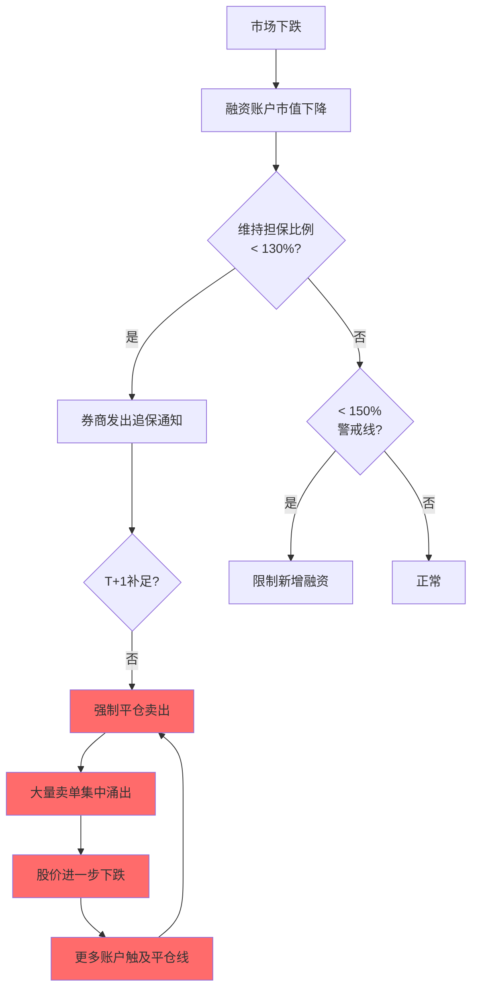
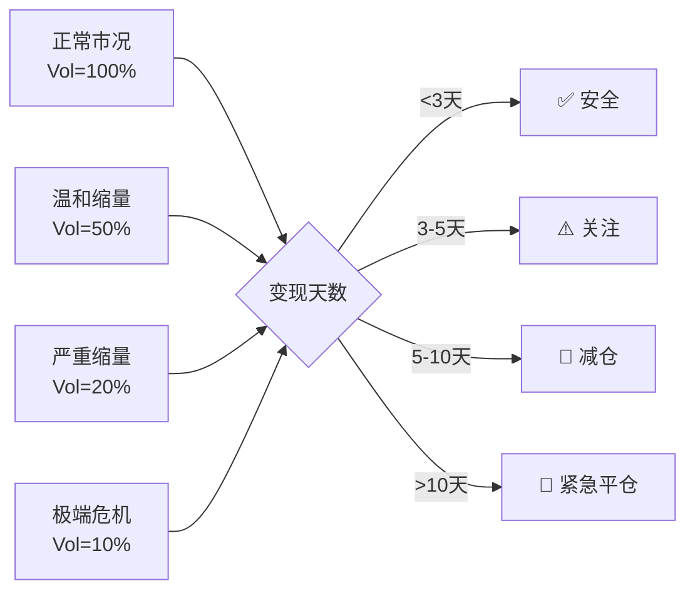

# A股流动性风险管理

> - 流动性风险是量化交易中最容易被低估的风险类型——2015年股灾千股跌停、2024年DMA踩踏均为流动性危机
> - A股冲击成本经验公式：Impact = η·σ·(Q/ADV)^α，参与率5%时滑点25-50bps，>10%时>100bps
> - **变现天数** = 持仓市值 / (日均成交额 × 参与率上限)，是组合流动性的核心度量
> - 两融强平连锁反应：维持担保比例跌破130% → 强制平仓 → 压低价格 → 更多账户触及平仓线 → 踩踏螺旋
> - 流动性筛选门槛：日均成交额≥1000万（保守≥5000万），参与率上限：沪深300成分10-15%、中证500成分5-10%、小盘1-3%

---

## 一、流动性风险分类

### 1.1 市场流动性风险 vs 融资流动性风险

| 维度 | 市场流动性风险 | 融资流动性风险 |
|------|--------------|--------------|
| 定义 | 无法以合理价格及时变现头寸 | 无法及时获得资金满足保证金/赎回要求 |
| 触发因素 | 买卖价差扩大、深度下降、成交量萎缩 | 追保通知、赎回申请、融资到期 |
| A股典型场景 | 跌停板封死无法卖出、小盘股无量 | 两融追保、私募赎回潮、DMA强平 |
| 度量指标 | Amihud、买卖价差、深度、弹性 | 现金比率、融资可得性、杠杆率 |

### 1.2 A股特有的流动性特征

- **涨跌停板**：跌停板封死时卖方流动性完全消失，买方亦然
- **T+1制度**：当日买入股票无法当日卖出，增加隔夜流动性风险
- **散户主导**：散户交易额占比~60%，极端行情下恐慌性抛售加剧流动性枯竭
- **融券稀缺**：做空机制受限→单边下跌时缺乏对手方

---

## 二、流动性度量指标

| 指标 | 公式 | 频率 | 优缺点 |
|------|------|------|--------|
| Amihud ILLIQ | \|R\|/Volume | 日频 | 最优低频代理，但极端值影响大 |
| Kyle Lambda | ΔP/ΔQ（回归斜率） | Tick级 | 精确但需高频数据 |
| Roll价差 | 2√(-Cov(Δp_t,Δp_{t-1})) | 日频 | 简单但负协方差时失效 |
| 有效价差 | 2\|P_trade - Midpoint\| | Tick级 | 直接度量交易成本 |
| 零收益天数比 | 零收益天数/总天数 | 月频 | 适合新兴市场 |
| 市场深度 | 买一+卖一挂单量 | 实时 | 只反映最优价格流动性 |
| 换手率 | 成交量/流通股本 | 日频 | 简单直观但不反映冲击 |
| 弹性 | 冲击后价格恢复速度 | Tick级 | 最全面但计算复杂 |

```python
import pandas as pd
import numpy as np

class LiquidityRiskMonitor:
    """流动性风险监控器"""
    
    def __init__(self):
        self.alert_thresholds = {
            'amihud_pct': 90,        # Amihud>90分位数告警
            'spread_bps': 50,        # 价差>50bps告警
            'depth_ratio': 0.3,      # 深度降至均值30%告警
            'volume_ratio': 0.3,     # 成交量降至均值30%告警
            'liquidation_days': 5,   # 变现天数>5天告警
        }
    
    def calc_amihud(self, returns: pd.Series, 
                    volumes: pd.Series, 
                    window: int = 20) -> pd.Series:
        """Amihud非流动性指标"""
        illiq = (returns.abs() / volumes).rolling(window).mean()
        return illiq
    
    def calc_liquidation_days(self, position_value: float,
                               adv: float,
                               participation_rate: float = 0.05
                               ) -> float:
        """变现天数估算"""
        if adv <= 0 or participation_rate <= 0:
            return float('inf')
        daily_capacity = adv * participation_rate
        return position_value / daily_capacity
    
    def calc_impact_cost(self, sigma: float, Q: float, 
                         ADV: float, eta: float = 0.3,
                         alpha: float = 0.5) -> float:
        """冲击成本估算
        Impact = eta * sigma * (Q/ADV)^alpha
        """
        if ADV <= 0:
            return float('inf')
        return eta * sigma * (Q / ADV) ** alpha
    
    def portfolio_liquidity_score(self, 
                                  holdings: pd.DataFrame
                                  ) -> pd.DataFrame:
        """
        组合流动性评分
        holdings: columns=[stock_code, position_value, adv_20d, 
                          spread_bps, amihud]
        """
        h = holdings.copy()
        
        # 变现天数
        h['liquidation_days'] = h.apply(
            lambda x: self.calc_liquidation_days(
                x['position_value'], x['adv_20d']), axis=1)
        
        # 流动性评分 (0-100, 越高越好)
        h['score'] = 100
        h.loc[h['liquidation_days'] > 5, 'score'] -= 30
        h.loc[h['liquidation_days'] > 10, 'score'] -= 30
        h.loc[h['spread_bps'] > 30, 'score'] -= 20
        h.loc[h['spread_bps'] > 50, 'score'] -= 20
        h['score'] = h['score'].clip(0, 100)
        
        # 组合加权流动性评分
        weights = h['position_value'] / h['position_value'].sum()
        portfolio_score = (h['score'] * weights).sum()
        
        return h, portfolio_score
    
    def stress_test(self, holdings: pd.DataFrame,
                    shock_scenarios: dict) -> pd.DataFrame:
        """
        流动性压力测试
        shock_scenarios: {scenario_name: volume_multiplier}
        例: {"正常": 1.0, "温和缩量": 0.5, "极端缩量": 0.2, "2015股灾": 0.1}
        """
        results = []
        for scenario, vol_mult in shock_scenarios.items():
            h = holdings.copy()
            h['stressed_adv'] = h['adv_20d'] * vol_mult
            h['stressed_liq_days'] = h.apply(
                lambda x: self.calc_liquidation_days(
                    x['position_value'], x['stressed_adv']),
                axis=1)
            
            max_days = h['stressed_liq_days'].max()
            avg_days = (h['stressed_liq_days'] * 
                       h['position_value']).sum() / h['position_value'].sum()
            
            results.append({
                'scenario': scenario,
                'volume_multiplier': vol_mult,
                'max_liquidation_days': max_days,
                'weighted_avg_days': avg_days,
                'stocks_over_5days': (h['stressed_liq_days'] > 5).sum(),
                'stocks_over_10days': (h['stressed_liq_days'] > 10).sum()
            })
        
        return pd.DataFrame(results)
```

---

## 三、涨跌停板流动性陷阱

### 3.1 陷阱机制

| 场景 | 流动性状态 | 风险 |
|------|-----------|------|
| 跌停板封死 | 卖方无对手，流动性=0 | 持仓无法止损 |
| 连续跌停 | 多日流动性冻结 | 亏损持续扩大 |
| 涨停板封死 | 买方无对手 | 做空方无法平仓 |
| ST/*ST连续跌停 | 5%限幅+流动性极差 | 退市风险叠加 |
| 北交所30%涨跌停 | 单日波幅大但流动性差 | 小市值个股风险极高 |

### 3.2 应对策略

- **持仓分散**：单股不超过组合5%，行业不超过20%
- **流动性筛选**：日均成交额≥5000万元（保守1亿元）
- **涨跌停预警**：接近涨跌停幅度80%时预警，90%时强制减仓
- **替代对冲**：个股无法卖出时用股指期货对冲系统性风险

---

## 四、两融强平踩踏

### 4.1 强平连锁机制



### 4.2 历史案例

| 事件 | 时间 | 两融余额变化 | 市场影响 |
|------|------|-------------|---------|
| 2015年股灾 | 2015.06-08 | 2.27万亿→0.9万亿 | 千股跌停，上证从5178跌至2850 |
| 2016年熔断 | 2016.01 | 约1万亿 | 4天触发4次熔断 |
| 2024年DMA危机 | 2024.01-02 | — | 量化DMA策略集中平仓+雪球敲入 |
| 2024年融券收紧 | 2024.07 | 融券余额大幅收缩 | 融券T+0策略终结 |

### 4.3 监控指标

| 指标 | 正常 | 警戒 | 危险 |
|------|------|------|------|
| 全市场两融余额变化率(周) | <-3% | -3%~-8% | >-8% |
| 融资买入占比 | 5-10% | >10% | >12% |
| 融券余额集中度(前10股) | <30% | 30-50% | >50% |
| 维持担保比例分布(<150%) | <10%账户 | 10-20% | >20% |

---

## 五、组合层面流动性风控

### 5.1 流动性约束体系

| 维度 | 指标 | 门槛 | 动作 |
|------|------|------|------|
| 个股流动性 | 日均成交额 | ≥5000万元 | 低于门槛不建仓 |
| 参与率 | 单日交易量/ADV | 沪深300<15%,中证500<10%,小盘<3% | 超限分多日执行 |
| 变现天数 | 持仓/可执行量 | 组合加权≤3天,单股≤5天 | 超限减仓 |
| 集中度 | 单股占组合比 | <5%(保守3%) | 超限触发再平衡 |
| 冲击成本 | 预估单边冲击 | <50bps | 超限降低交易速度 |

### 5.2 流动性压力测试



---

## 六、小盘股流动性管理

### 6.1 策略容量与流动性

| 股池 | 日均成交额(中位数) | 参与率上限 | 单股日可执行额 | 策略容量(100股池) |
|------|-------------------|-----------|--------------|------------------|
| 沪深300 | ~10亿元 | 15% | 1.5亿 | 150亿 |
| 中证500 | ~3亿元 | 10% | 3000万 | 30亿 |
| 中证1000 | ~1亿元 | 5% | 500万 | 5亿 |
| 微盘股 | ~2000万 | 3% | 60万 | 0.6亿 |

---

## 七、参数速查表

| 参数 | 保守 | 标准 | 激进 |
|------|------|------|------|
| 成交额门槛 | 1亿元/日 | 5000万/日 | 1000万/日 |
| 参与率上限(大盘) | 10% | 15% | 20% |
| 参与率上限(小盘) | 1% | 3% | 5% |
| 变现天数上限(组合) | 2天 | 3天 | 5天 |
| 变现天数上限(单股) | 3天 | 5天 | 10天 |
| 单股集中度 | 3% | 5% | 8% |
| 冲击成本上限 | 30bps | 50bps | 100bps |
| Amihud告警分位数 | 80% | 90% | 95% |
| 价差告警阈值 | 30bps | 50bps | 100bps |

---

## 八、常见误区

| 误区 | 真相 |
|------|------|
| "大盘股流动性没问题" | 2024年1月大盘蓝筹也出现流动性危机，DMA平仓时连沪深300成分股都大幅滑点 |
| "用日均成交额衡量就够" | 极端行情下成交量可能骤降80%+，需做压力测试而非只看常态 |
| "分散持仓就不怕流动性风险" | 系统性流动性危机时所有股票同时流动性枯竭，分散无法对冲 |
| "ETF可以解决流动性问题" | ETF在极端行情下也会出现大幅折价（如2015年分级基金下折） |
| "变现天数3天足够安全" | 融资追保期限通常T+1，变现天数>1天的持仓在融资账户中就有强平风险 |
| "冲击成本可以线性外推" | 冲击成本是凹函数（平方根模型），参与率从5%提高到20%冲击不是4倍而是约2倍 |
| "北交所流动性在改善" | 北交所日均成交约100-200亿，个股中位数仅几百万，量化策略容量极其有限 |

---

## 九、相关笔记

- [[量化交易风控体系建设]] — 事前/事中/事后风控全体系
- [[A股市场微观结构深度研究]] — 市场深度、价差、冲击成本理论
- [[交易成本建模与执行优化]] — Almgren-Chriss模型、TWAP/VWAP执行
- [[A股市场参与者结构与资金流分析]] — 两融余额、北向资金、主力资金流
- [[A股交易制度全解析]] — 涨跌停板、T+1、融资融券制度
- [[A股回测框架实战与避坑指南]] — 流动性约束在回测中的处理
- [[A股多因子选股策略开发全流程]] — 流动性筛选门槛与容量估算
- [[组合优化与资产配置]] — 流动性约束下的组合优化

---

## 来源参考

1. Amihud, Y. (2002). "Illiquidity and stock returns" — Amihud非流动性指标
2. Kyle, A. (1985). "Continuous Auctions and Insider Trading" — Kyle Lambda模型
3. Almgren, R. & Chriss, N. (2001). "Optimal execution of portfolio transactions" — 冲击成本模型
4. 中国证监会2015年股市异常波动报告 — 两融强平连锁反应分析
5. 华泰证券《A股流动性风险度量与管理》 — 流动性因子与组合约束
6. 中信证券《2024年DMA策略危机复盘》 — 量化策略流动性踩踏实证
7. 沪深交易所融资融券业务规则(2024-2026) — 维持担保比例/追保规则
